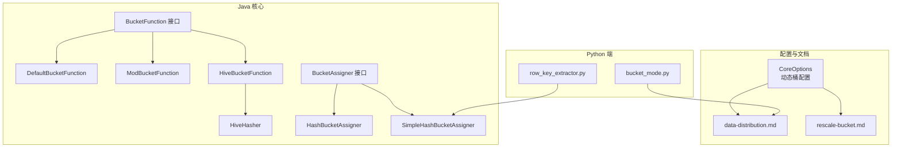
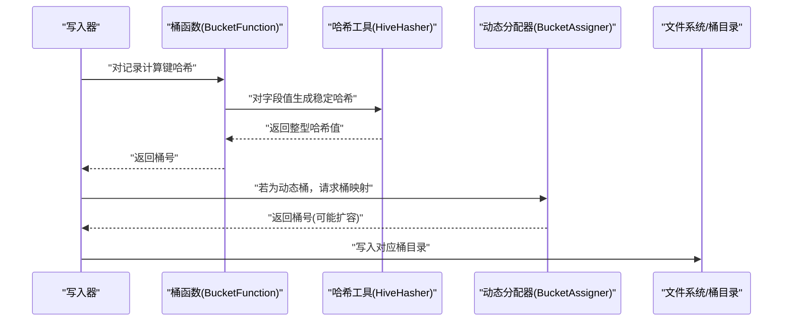
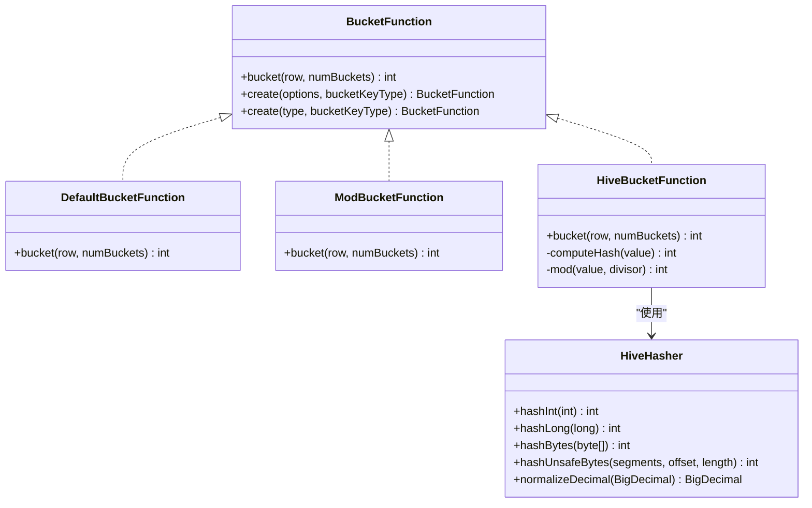
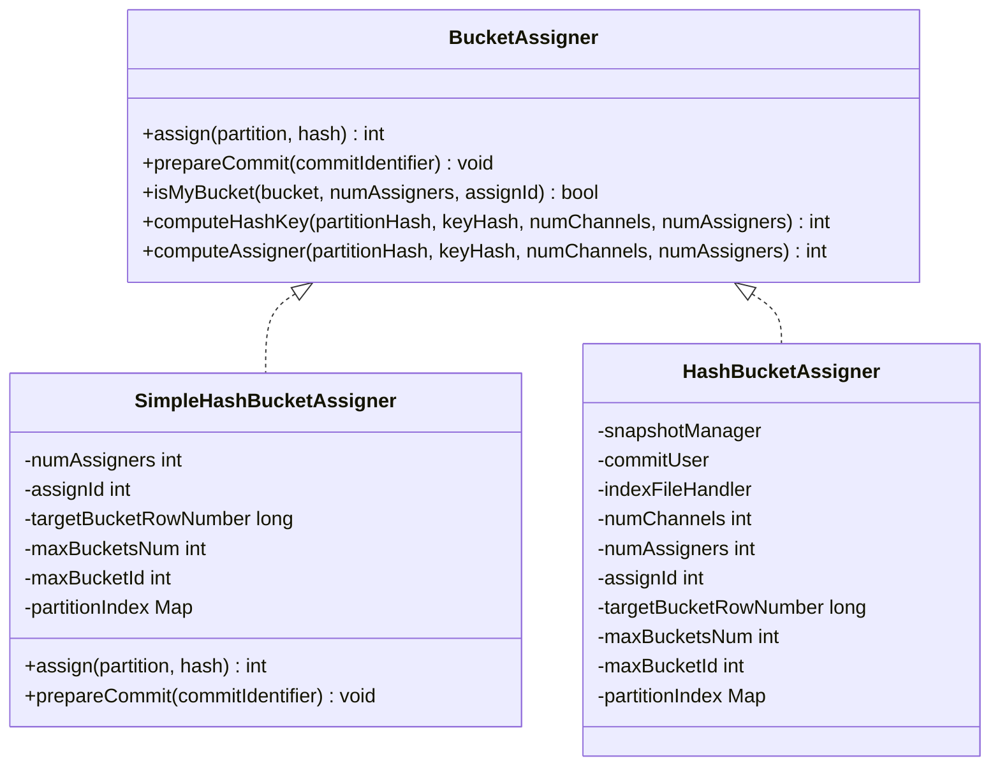
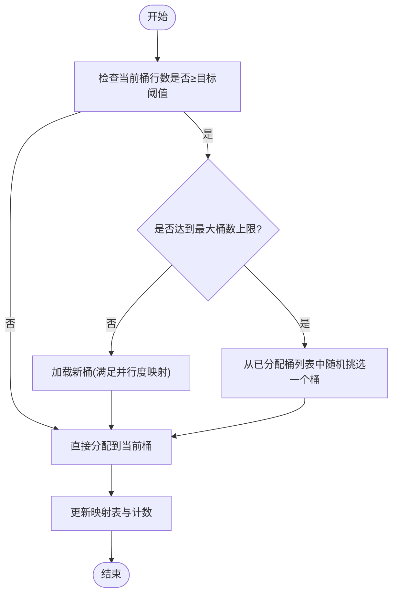
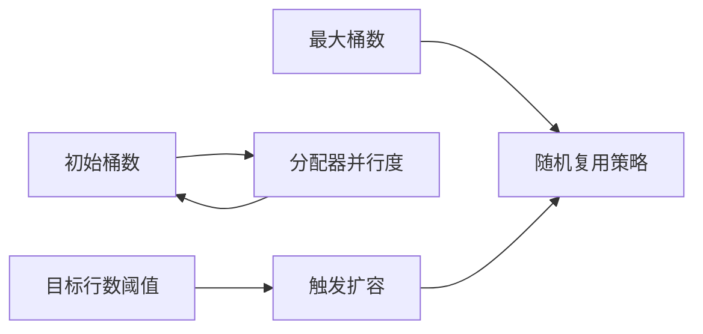
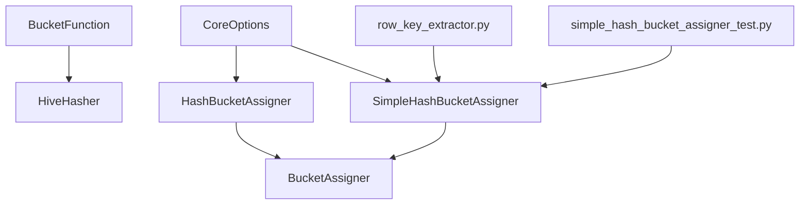

# 哈希索引

<cite>
**本文引用的文件**
- [HiveBucketFunction.java](file://paimon-core/src/main/java/org/apache/paimon/bucket/HiveBucketFunction.java)
- [HiveHasher.java](file://paimon-core/src/main/java/org/apache/paimon/bucket/HiveHasher.java)
- [DefaultBucketFunction.java](file://paimon-core/src/main/java/org/apache/paimon/bucket/DefaultBucketFunction.java)
- [ModBucketFunction.java](file://paimon-core/src/main/java/org/apache/paimon/bucket/ModBucketFunction.java)
- [BucketFunction.java](file://paimon-core/src/main/java/org/apache/paimon/bucket/BucketFunction.java)
- [SimpleHashBucketAssigner.java](file://paimon-core/src/main/java/org/apache/paimon/index/SimpleHashBucketAssigner.java)
- [HashBucketAssigner.java](file://paimon-core/src/main/java/org/apache/paimon/index/HashBucketAssigner.java)
- [BucketAssigner.java](file://paimon-core/src/main/java/org/apache/paimon/index/BucketAssigner.java)
- [CoreOptions.java](file://paimon-api/src/main/java/org/apache/paimon/CoreOptions.java)
- [data-distribution.md](file://docs/content/primary-key-table/data-distribution.md)
- [rescale-bucket.md](file://docs/content/maintenance/rescale-bucket.md)
- [bucket_mode.py](file://paimon-python/pypaimon/table/bucket_mode.py)
- [row_key_extractor.py](file://paimon-python/pypaimon/write/row_key_extractor.py)
- [simple_hash_bucket_assigner_test.py](file://paimon-python/pypaimon/tests/write/simple_hash_bucket_assigner_test.py)
</cite>

## 目录
1. [简介](#简介)
2. [项目结构](#项目结构)
3. [核心组件](#核心组件)
4. [架构总览](#架构总览)
5. [组件详解](#组件详解)
6. [依赖关系分析](#依赖关系分析)
7. [性能考量](#性能考量)
8. [故障排查指南](#故障排查指南)
9. [结论](#结论)
10. [附录](#附录)

## 简介
本文件系统性阐述 Paimon 中“哈希索引”的设计与实现，重点覆盖以下主题：
- 哈希函数选择与哈希计算细节（含 Hive 兼容哈希）
- 桶分配策略与动态扩桶机制
- 负载均衡与跨并行度的桶映射
- 数据分布与均匀性保障
- 与桶模式（固定/动态/跨分区/未感知/延后）的关系
- 查询优化策略（桶级快速定位、减少扫描范围）
- 配置参数与调优建议（哈希算法、桶数、冲突处理）
- 不同场景下的性能权衡与最佳实践

## 项目结构
围绕哈希索引的关键代码分布在如下模块：
- bucket 包：定义多种桶函数接口与实现（默认、模运算、Hive 兼容）
- index 包：动态桶分配器（简单与完整索引版）、通用分配器接口
- docs：官方文档对数据分布、动态桶、扩桶的说明
- paimon-api：核心配置项（动态桶目标行数、初始桶数、最大桶数、分配器并行度等）
- paimon-python：Python 端桶模式枚举与动态桶分配器实现

**图表来源**
- [BucketFunction.java:28-51](file://paimon-core/src/main/java/org/apache/paimon/bucket/BucketFunction.java#L28-L51)
- [DefaultBucketFunction.java:25-35](file://paimon-core/src/main/java/org/apache/paimon/bucket/DefaultBucketFunction.java#L25-L35)
- [ModBucketFunction.java:40-74](file://paimon-core/src/main/java/org/apache/paimon/bucket/ModBucketFunction.java#L40-L74)
- [HiveBucketFunction.java:30-98](file://paimon-core/src/main/java/org/apache/paimon/bucket/HiveBucketFunction.java#L30-L98)
- [HiveHasher.java:27-114](file://paimon-core/src/main/java/org/apache/paimon/bucket/HiveHasher.java#L27-L114)
- [BucketAssigner.java:24-43](file://paimon-core/src/main/java/org/apache/paimon/index/BucketAssigner.java#L24-L43)
- [HashBucketAssigner.java:39-71](file://paimon-core/src/main/java/org/apache/paimon/index/HashBucketAssigner.java#L39-L71)
- [SimpleHashBucketAssigner.java:34-140](file://paimon-core/src/main/java/org/apache/paimon/index/SimpleHashBucketAssigner.java#L34-L140)
- [CoreOptions.java:1411-1441](file://paimon-api/src/main/java/org/apache/paimon/CoreOptions.java#L1411-L1441)
- [data-distribution.md:31-71](file://docs/content/primary-key-table/data-distribution.md#L31-L71)
- [rescale-bucket.md:29-44](file://docs/content/maintenance/rescale-bucket.md#L29-L44)
- [bucket_mode.py:22-32](file://paimon-python/pypaimon/table/bucket_mode.py#L22-L32)
- [row_key_extractor.py:218-238](file://paimon-python/pypaimon/write/row_key_extractor.py#L218-L238)

**章节来源**
- [BucketFunction.java:28-51](file://paimon-core/src/main/java/org/apache/paimon/bucket/BucketFunction.java#L28-L51)
- [CoreOptions.java:1411-1441](file://paimon-api/src/main/java/org/apache/paimon/CoreOptions.java#L1411-L1441)

## 核心组件
- 桶函数（BucketFunction）：定义从记录到桶号的映射规则，支持默认哈希、模运算、Hive 兼容三种方式。
- 哈希工具（HiveHasher）：为字符串、字节数组、数值、Decimal 等类型生成稳定哈希值，保证 Hive 兼容语义。
- 动态桶分配器（BucketAssigner 及其实现）：在动态桶模式下，维护“键哈希→桶号”的映射，按目标行数阈值自动扩容，支持跨并行度的桶映射。
- 配置项（CoreOptions）：动态桶的目标行数、初始桶数、最大桶数、分配器并行度等。
- 文档与模式（data-distribution.md、bucket_mode.py）：说明固定/动态/跨分区/未感知/延后桶模式的行为与适用场景。

**章节来源**
- [DefaultBucketFunction.java:25-35](file://paimon-core/src/main/java/org/apache/paimon/bucket/DefaultBucketFunction.java#L25-L35)
- [ModBucketFunction.java:40-74](file://paimon-core/src/main/java/org/apache/paimon/bucket/ModBucketFunction.java#L40-L74)
- [HiveBucketFunction.java:30-98](file://paimon-core/src/main/java/org/apache/paimon/bucket/HiveBucketFunction.java#L30-L98)
- [HiveHasher.java:27-114](file://paimon-core/src/main/java/org/apache/paimon/bucket/HiveHasher.java#L27-L114)
- [BucketAssigner.java:24-43](file://paimon-core/src/main/java/org/apache/paimon/index/BucketAssigner.java#L24-L43)
- [SimpleHashBucketAssigner.java:34-140](file://paimon-core/src/main/java/org/apache/paimon/index/SimpleHashBucketAssigner.java#L34-L140)
- [CoreOptions.java:1411-1441](file://paimon-api/src/main/java/org/apache/paimon/CoreOptions.java#L1411-L1441)
- [data-distribution.md:31-71](file://docs/content/primary-key-table/data-distribution.md#L31-L71)
- [bucket_mode.py:22-32](file://paimon-python/pypaimon/table/bucket_mode.py#L22-L32)

## 架构总览
哈希索引在写入路径上的关键流程：
- 计算键哈希：根据所选桶函数对主键或指定字段进行哈希
- 映射到桶：通过动态分配器或固定桶公式得到桶号
- 写入对应桶：数据落盘到该桶目录，LSM 树组织
- 扩容与再平衡：当桶内行数达到阈值时，按策略新增桶或随机复用已有桶

**图表来源**
- [BucketFunction.java:32-50](file://paimon-core/src/main/java/org/apache/paimon/bucket/BucketFunction.java#L32-L50)
- [HiveBucketFunction.java:42-51](file://paimon-core/src/main/java/org/apache/paimon/bucket/HiveBucketFunction.java#L42-L51)
- [HiveHasher.java:37-96](file://paimon-core/src/main/java/org/apache/paimon/bucket/HiveHasher.java#L37-L96)
- [BucketAssigner.java:26-42](file://paimon-core/src/main/java/org/apache/paimon/index/BucketAssigner.java#L26-L42)
- [SimpleHashBucketAssigner.java:54-118](file://paimon-core/src/main/java/org/apache/paimon/index/SimpleHashBucketAssigner.java#L54-L118)

## 组件详解

### 桶函数与哈希计算
- 默认桶函数：对记录对象的哈希取绝对值后再对桶数取模，适用于通用场景。
- 模运算桶函数：要求桶键为 INT 或 BIGINT，使用 floorMod 实现负数安全的取模。
- Hive 兼容桶函数：对多种基础类型（布尔、字节、短整型、整型、长整型、浮点、双精度、字符串、字节数组、Decimal）分别计算哈希，最终以 31 进制多项式聚合字段哈希，再对桶数取模；并对负余数做修正，确保桶号非负且均匀。

**图表来源**
- [BucketFunction.java:28-51](file://paimon-core/src/main/java/org/apache/paimon/bucket/BucketFunction.java#L28-L51)
- [DefaultBucketFunction.java:25-35](file://paimon-core/src/main/java/org/apache/paimon/bucket/DefaultBucketFunction.java#L25-L35)
- [ModBucketFunction.java:40-74](file://paimon-core/src/main/java/org/apache/paimon/bucket/ModBucketFunction.java#L40-L74)
- [HiveBucketFunction.java:30-98](file://paimon-core/src/main/java/org/apache/paimon/bucket/HiveBucketFunction.java#L30-L98)
- [HiveHasher.java:27-114](file://paimon-core/src/main/java/org/apache/paimon/bucket/HiveHasher.java#L27-L114)

**章节来源**
- [DefaultBucketFunction.java:25-35](file://paimon-core/src/main/java/org/apache/paimon/bucket/DefaultBucketFunction.java#L25-L35)
- [ModBucketFunction.java:40-74](file://paimon-core/src/main/java/org/apache/paimon/bucket/ModBucketFunction.java#L40-L74)
- [HiveBucketFunction.java:30-98](file://paimon-core/src/main/java/org/apache/paimon/bucket/HiveBucketFunction.java#L30-L98)
- [HiveHasher.java:27-114](file://paimon-core/src/main/java/org/apache/paimon/bucket/HiveHasher.java#L27-L114)

### 动态桶分配器（哈希索引）
- 分配器接口：提供跨并行度的桶映射一致性，支持“键哈希→桶号”的快速查找与扩容。
- 简单分配器（内存映射）：为每个分区维护“键哈希→桶号”映射表，按目标行数阈值自动扩容；当超过最大桶上限时，随机复用已有桶，避免无限增长。
- 完整分配器（带索引文件）：在需要持久化全局索引时使用，结合快照管理与索引文件处理器，实现更稳健的跨作业恢复。

**图表来源**
- [BucketAssigner.java:24-43](file://paimon-core/src/main/java/org/apache/paimon/index/BucketAssigner.java#L24-L43)
- [SimpleHashBucketAssigner.java:34-140](file://paimon-core/src/main/java/org/apache/paimon/index/SimpleHashBucketAssigner.java#L34-L140)
- [HashBucketAssigner.java:39-71](file://paimon-core/src/main/java/org/apache/paimon/index/HashBucketAssigner.java#L39-L71)

**章节来源**
- [BucketAssigner.java:24-43](file://paimon-core/src/main/java/org/apache/paimon/index/BucketAssigner.java#L24-L43)
- [SimpleHashBucketAssigner.java:34-140](file://paimon-core/src/main/java/org/apache/paimon/index/SimpleHashBucketAssigner.java#L34-L140)
- [HashBucketAssigner.java:39-71](file://paimon-core/src/main/java/org/apache/paimon/index/HashBucketAssigner.java#L39-L71)

### 动态扩桶与负载均衡流程
- 触发条件：当当前桶内累计行数达到“目标行数阈值”时，尝试加载新桶；若已达最大桶数上限，则随机复用已有桶。
- 并行度映射：通过“键哈希对分配器数量取模”决定归属的分配器实例，从而实现跨并行度的一致性。
- 随机复用策略：在达到上限时，从已分配桶列表中随机挑选一个桶，降低热点集中风险。

**图表来源**
- [SimpleHashBucketAssigner.java:98-118](file://paimon-core/src/main/java/org/apache/paimon/index/SimpleHashBucketAssigner.java#L98-L118)
- [BucketAssigner.java:30-38](file://paimon-core/src/main/java/org/apache/paimon/index/BucketAssigner.java#L30-L38)

**章节来源**
- [SimpleHashBucketAssigner.java:98-118](file://paimon-core/src/main/java/org/apache/paimon/index/SimpleHashBucketAssigner.java#L98-L118)
- [BucketAssigner.java:30-38](file://paimon-core/src/main/java/org/apache/paimon/index/BucketAssigner.java#L30-L38)

### 与桶模式的关系
- 固定桶：通过“绝对哈希取模”确定桶号，适合已知稳定吞吐与数据分布的场景；扩桶需离线重组织。
- 动态桶：默认主键表模式，按目标行数自动扩容；键到桶的映射由哈希索引维护，内存占用与键基数相关。
- 跨分区：当主键不包含全部分区字段时，支持跨分区更新，需谨慎选择合并引擎与索引 TTL。
- 未感知/延后：写入先暂存于延后目录，后续通过压缩/扩桶作业落至正确桶，适合难以预估桶数的场景。

**章节来源**
- [data-distribution.md:31-71](file://docs/content/primary-key-table/data-distribution.md#L31-L71)
- [bucket_mode.py:22-32](file://paimon-python/pypaimon/table/bucket_mode.py#L22-L32)

### 查询优化策略
- 桶级快速定位：通过哈希函数直接定位目标桶，避免全表扫描
- 减少扫描范围：读取时仅扫描命中桶，显著降低 I/O
- 动态桶优化：在低更新率场景下，哈希索引几乎无性能损失，且内存开销可控

**章节来源**
- [data-distribution.md:58-66](file://docs/content/primary-key-table/data-distribution.md#L58-L66)

### 配置指南与调优
- 动态桶目标行数：控制单桶目标行数，影响扩容频率与内存占用
- 初始桶数：决定分配器初始并行度与初始化速度
- 最大桶数：限制动态桶上限，超过时采用随机复用策略
- 分配器并行度：与初始桶数相关，过小会导致分配器处理瓶颈

**图表来源**
- [CoreOptions.java:1411-1441](file://paimon-api/src/main/java/org/apache/paimon/CoreOptions.java#L1411-L1441)

**章节来源**
- [CoreOptions.java:1411-1441](file://paimon-api/src/main/java/org/apache/paimon/CoreOptions.java#L1411-L1441)

### 扩容与重分布（Rescale）
- 在线修改元数据：ALTER TABLE 修改桶数
- 重组织数据布局：通过 INSERT OVERWRITE 将旧桶数据按新桶数重新散列
- 分区级差异化：不同分区可设置不同桶数
- 注意事项：扩桶期间禁止并发写入同一分区

**章节来源**
- [rescale-bucket.md:29-67](file://docs/content/maintenance/rescale-bucket.md#L29-L67)

## 依赖关系分析
- 桶函数依赖类型系统与哈希工具，确保对不同数据类型的稳定哈希
- 动态分配器依赖并行度映射与桶信息统计，实现跨实例一致性
- 配置项贯穿写入与扩桶决策，决定性能与资源占用
- Python 端实现与测试验证了 Java 端逻辑的正确性与边界行为

**图表来源**
- [BucketFunction.java:32-50](file://paimon-core/src/main/java/org/apache/paimon/bucket/BucketFunction.java#L32-L50)
- [HiveHasher.java:27-114](file://paimon-core/src/main/java/org/apache/paimon/bucket/HiveHasher.java#L27-L114)
- [BucketAssigner.java:24-43](file://paimon-core/src/main/java/org/apache/paimon/index/BucketAssigner.java#L24-L43)
- [HashBucketAssigner.java:39-71](file://paimon-core/src/main/java/org/apache/paimon/index/HashBucketAssigner.java#L39-L71)
- [SimpleHashBucketAssigner.java:34-140](file://paimon-core/src/main/java/org/apache/paimon/index/SimpleHashBucketAssigner.java#L34-L140)
- [CoreOptions.java:1411-1441](file://paimon-api/src/main/java/org/apache/paimon/CoreOptions.java#L1411-L1441)
- [row_key_extractor.py:218-238](file://paimon-python/pypaimon/write/row_key_extractor.py#L218-L238)
- [simple_hash_bucket_assigner_test.py:35-60](file://paimon-python/pypaimon/tests/write/simple_hash_bucket_assigner_test.py#L35-L60)

**章节来源**
- [BucketFunction.java:32-50](file://paimon-core/src/main/java/org/apache/paimon/bucket/BucketFunction.java#L32-L50)
- [SimpleHashBucketAssigner.java:34-140](file://paimon-core/src/main/java/org/apache/paimon/index/SimpleHashBucketAssigner.java#L34-L140)
- [CoreOptions.java:1411-1441](file://paimon-api/src/main/java/org/apache/paimon/CoreOptions.java#L1411-L1441)

## 性能考量
- 写入性能：动态桶在低更新率场景下几乎无额外开销；高更新率下，哈希索引带来稳定的桶级定位，减少写放大
- 查询性能：桶级快速定位显著降低扫描范围，提升点查与范围查性能
- 存储效率：固定桶过大导致小文件增多，过小导致写放大；动态桶按目标行数自适应，平衡文件大小与并行度
- 内存占用：动态桶模式下，哈希索引需维护“键哈希→桶号”映射，约每 1 亿条键占用 1 GB 内存（活跃分区）

**章节来源**
- [data-distribution.md:61-66](file://docs/content/primary-key-table/data-distribution.md#L61-L66)

## 故障排查指南
- 动态桶分配失败：当所有桶均被分配且未达上限时抛出异常，检查最大桶数配置与并行度映射
- 扩容后查询异常：确认是否已完成 INSERT OVERWRITE 重组织，或是否对同一分区并发写入
- 内存不足：适当提高目标行数阈值或限制最大桶数，降低索引规模
- 负载不均：检查键分布是否极端偏斜，必要时调整桶函数或引入复合键

**章节来源**
- [SimpleHashBucketAssigner.java:132-134](file://paimon-core/src/main/java/org/apache/paimon/index/SimpleHashBucketAssigner.java#L132-L134)
- [rescale-bucket.md:46-57](file://docs/content/maintenance/rescale-bucket.md#L46-L57)

## 结论
哈希索引通过“稳定哈希+桶映射+动态扩桶”的组合，在 Paimon 的主键表中实现了高效、可扩展的数据分布与查询定位。合理配置动态桶参数、选择合适的桶函数与桶模式，可在不同业务场景下取得写入、查询与存储的最优平衡。

## 附录
- 关键实现参考路径
  - [HiveBucketFunction.java:30-98](file://paimon-core/src/main/java/org/apache/paimon/bucket/HiveBucketFunction.java#L30-L98)
  - [HiveHasher.java:27-114](file://paimon-core/src/main/java/org/apache/paimon/bucket/HiveHasher.java#L27-L114)
  - [SimpleHashBucketAssigner.java:34-140](file://paimon-core/src/main/java/org/apache/paimon/index/SimpleHashBucketAssigner.java#L34-L140)
  - [CoreOptions.java:1411-1441](file://paimon-api/src/main/java/org/apache/paimon/CoreOptions.java#L1411-L1441)
  - [data-distribution.md:31-71](file://docs/content/primary-key-table/data-distribution.md#L31-L71)
  - [rescale-bucket.md:29-67](file://docs/content/maintenance/rescale-bucket.md#L29-L67)
  - [bucket_mode.py:22-32](file://paimon-python/pypaimon/table/bucket_mode.py#L22-L32)
  - [row_key_extractor.py:218-238](file://paimon-python/pypaimon/write/row_key_extractor.py#L218-L238)
  - [simple_hash_bucket_assigner_test.py:35-60](file://paimon-python/pypaimon/tests/write/simple_hash_bucket_assigner_test.py#L35-L60)