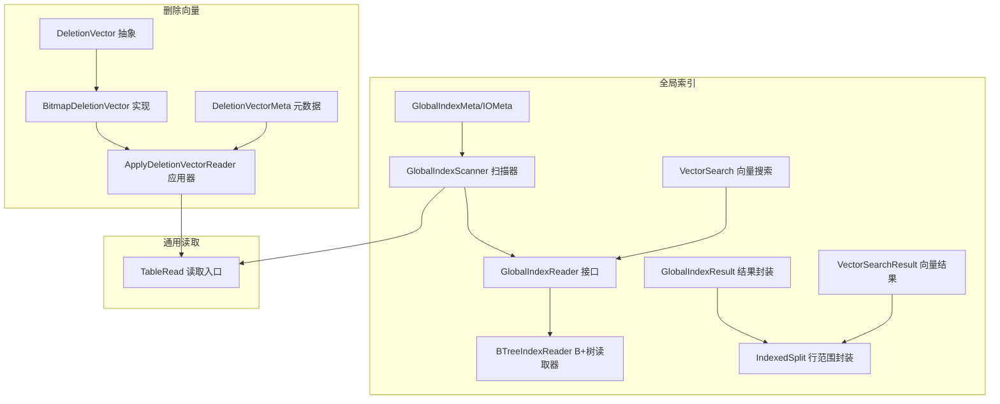
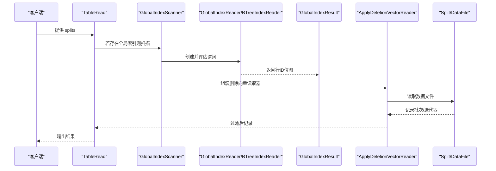
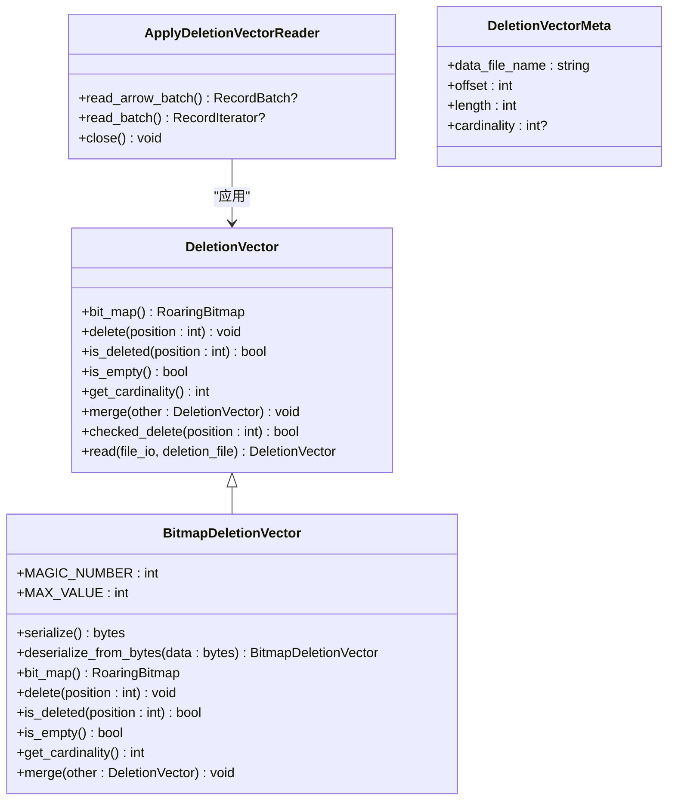
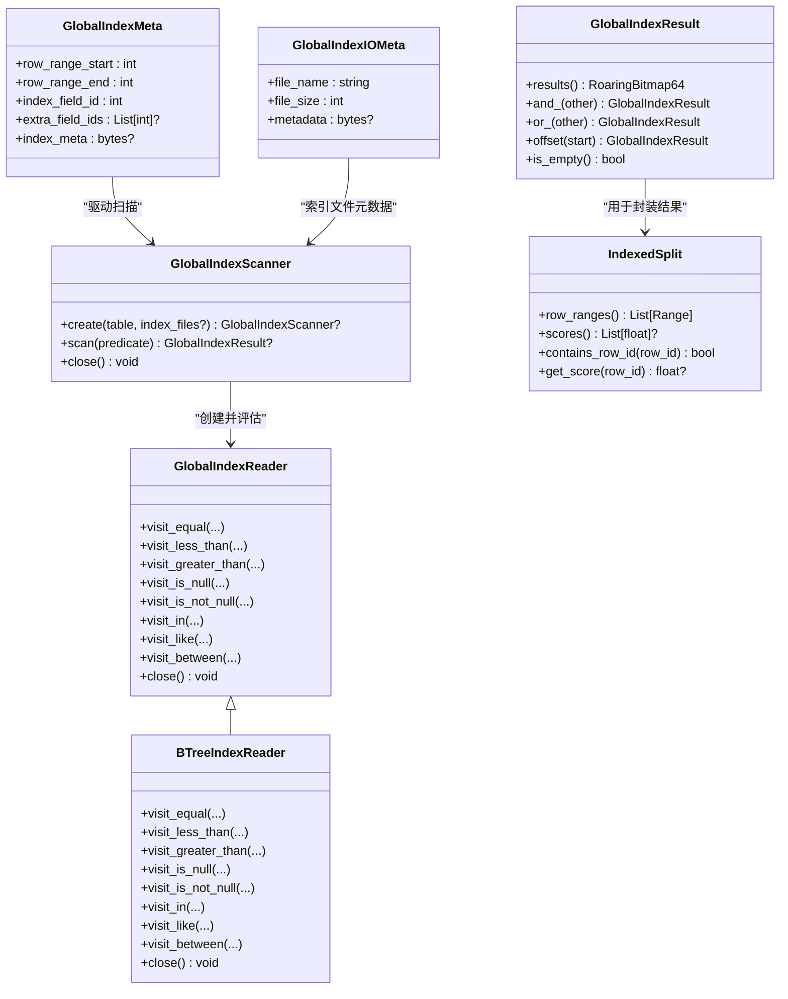
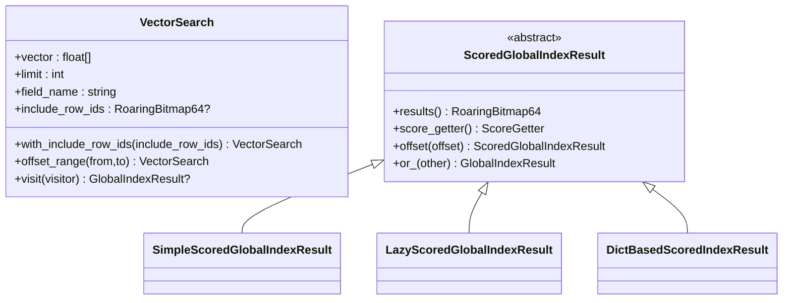
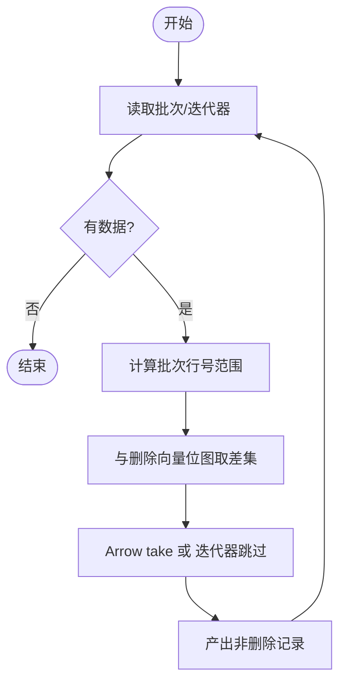
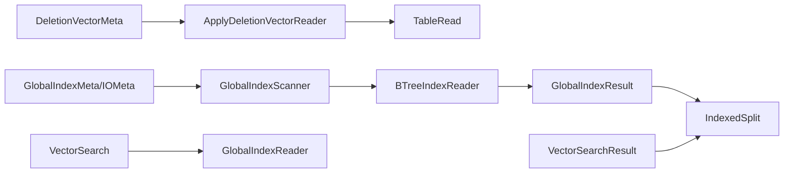

# 索引系统

<cite>
**本文引用的文件**
- [deletion_vector.py](file://paimon-python/pypaimon/deletionvectors/deletion_vector.py)
- [bitmap_deletion_vector.py](file://paimon-python/pypaimon/deletionvectors/bitmap_deletion_vector.py)
- [apply_deletion_vector_reader.py](file://paimon-python/pypaimon/deletionvectors/apply_deletion_vector_reader.py)
- [deletion_vector_meta.py](file://paimon-python/pypaimon/index/deletion_vector_meta.py)
- [global_index_meta.py](file://paimon-python/pypaimon/globalindex/global_index_meta.py)
- [global_index_reader.py](file://paimon-python/pypaimon/globalindex/global_index_reader.py)
- [global_index_scanner.py](file://paimon-python/pypaimon/globalindex/global_index_scanner.py)
- [global_index_result.py](file://paimon-python/pypaimon/globalindex/global_index_result.py)
- [vector_search.py](file://paimon-python/pypaimon/globalindex/vector_search.py)
- [vector_search_result.py](file://paimon-python/pypaimon/globalindex/vector_search_result.py)
- [indexed_split.py](file://paimon-python/pypaimon/globalindex/indexed_split.py)
- [btree_index_reader.py](file://paimon-python/pypaimon/globalindex/btree/btree_index_reader.py)
- [table_read.py](file://paimon-python/pypaimon/read/table_read.py)
</cite>

## 目录
1. [简介](#简介)
2. [项目结构](#项目结构)
3. [核心组件](#核心组件)
4. [架构总览](#架构总览)
5. [详细组件分析](#详细组件分析)
6. [依赖分析](#依赖分析)
7. [性能考虑](#性能考虑)
8. [故障排除指南](#故障排除指南)
9. [结论](#结论)
10. [附录](#附录)

## 简介
本文件系统性梳理 Apache Paimon 的索引体系，重点覆盖以下方面：
- 删除向量（Deletion Vector）：删除标记的存储、序列化/反序列化、读取与应用流程，以及在查询阶段的过滤逻辑。
- 全局索引系统：B+树索引、位图索引等不同索引类型的实现与使用；全局索引扫描器与评估器的协作；结果集的延迟求值与集合运算。
- 向量搜索索引：向量相似度搜索的参数与接口、结果封装、偏移与合并语义。
- 索引创建、维护与优化：索引元数据、扫描与选择策略、与查询谓词的匹配。
- 查询优化：如何通过合理的索引设计提升查询性能。
- 最佳实践与故障排除。

## 项目结构
围绕索引系统的关键模块分布于 Python 客户端与通用读取层：
- 删除向量：deletionvectors 子包下的抽象与实现、读取器与元数据。
- 全局索引：globalindex 子包下的元数据、扫描器、读取器（B+树）、结果封装、向量搜索定义与结果。
- 通用读取：read 子包中的 TableRead 与 SplitRead 流程，负责将索引结果映射到实际数据文件读取。

**图表来源**
- [deletion_vector.py:25-144](file://paimon-python/pypaimon/deletionvectors/deletion_vector.py#L25-L144)
- [bitmap_deletion_vector.py:24-166](file://paimon-python/pypaimon/deletionvectors/bitmap_deletion_vector.py#L24-L166)
- [apply_deletion_vector_reader.py:30-129](file://paimon-python/pypaimon/deletionvectors/apply_deletion_vector_reader.py#L30-L129)
- [deletion_vector_meta.py:22-41](file://paimon-python/pypaimon/index/deletion_vector_meta.py#L22-L41)
- [global_index_meta.py:25-75](file://paimon-python/pypaimon/globalindex/global_index_meta.py#L25-L75)
- [global_index_scanner.py:33-167](file://paimon-python/pypaimon/globalindex/global_index_scanner.py#L33-L167)
- [global_index_reader.py:34-109](file://paimon-python/pypaimon/globalindex/global_index_reader.py#L34-L109)
- [btree_index_reader.py:56-424](file://paimon-python/pypaimon/globalindex/btree/btree_index_reader.py#L56-L424)
- [global_index_result.py:26-101](file://paimon-python/pypaimon/globalindex/global_index_result.py#L26-L101)
- [vector_search.py:26-93](file://paimon-python/pypaimon/globalindex/vector_search.py#L26-L93)
- [vector_search_result.py:32-137](file://paimon-python/pypaimon/globalindex/vector_search_result.py#L32-L137)
- [indexed_split.py:28-143](file://paimon-python/pypaimon/globalindex/indexed_split.py#L28-L143)
- [table_read.py:35-200](file://paimon-python/pypaimon/read/table_read.py#L35-L200)

**章节来源**
- [deletion_vector.py:25-144](file://paimon-python/pypaimon/deletionvectors/deletion_vector.py#L25-L144)
- [global_index_scanner.py:33-167](file://paimon-python/pypaimon/globalindex/global_index_scanner.py#L33-L167)
- [table_read.py:35-200](file://paimon-python/pypaimon/read/table_read.py#L35-L200)

## 核心组件
- 删除向量抽象与实现
  - 抽象类定义删除标记的位图、插入、查询、合并、读取等接口。
  - 基于 RoaringBitmap 的位图实现，支持序列化/反序列化、校验与容量统计。
- 删除向量应用器
  - 在读取阶段对记录批次或迭代器应用删除向量，剔除已删除行。
- 全局索引元数据与扫描器
  - 元数据描述索引字段、范围、额外字段与索引元信息。
  - 扫描器根据谓词与分区过滤条件扫描索引文件，构建读取器集合并评估谓词。
- B+树索引读取器
  - 支持等值、范围、空值、IN/NOT IN 等谓词，基于 SST 文件与页块句柄进行高效范围扫描。
- 结果封装与向量搜索
  - 全局索引结果以压缩位图表示，支持延迟求值、交并补与偏移。
  - 向量搜索定义查询向量、字段名、返回数量与包含/偏移行集，结果可携带分数并支持偏移与合并。

**章节来源**
- [deletion_vector.py:25-144](file://paimon-python/pypaimon/deletionvectors/deletion_vector.py#L25-L144)
- [bitmap_deletion_vector.py:24-166](file://paimon-python/pypaimon/deletionvectors/bitmap_deletion_vector.py#L24-L166)
- [apply_deletion_vector_reader.py:30-129](file://paimon-python/pypaimon/deletionvectors/apply_deletion_vector_reader.py#L30-L129)
- [global_index_meta.py:25-75](file://paimon-python/pypaimon/globalindex/global_index_meta.py#L25-L75)
- [global_index_scanner.py:33-167](file://paimon-python/pypaimon/globalindex/global_index_scanner.py#L33-L167)
- [btree_index_reader.py:56-424](file://paimon-python/pypaimon/globalindex/btree/btree_index_reader.py#L56-L424)
- [global_index_result.py:26-101](file://paimon-python/pypaimon/globalindex/global_index_result.py#L26-L101)
- [vector_search.py:26-93](file://paimon-python/pypaimon/globalindex/vector_search.py#L26-L93)
- [vector_search_result.py:32-137](file://paimon-python/pypaimon/globalindex/vector_search_result.py#L32-L137)

## 架构总览
下图展示从表读取到索引应用的整体流程：TableRead 将 Split 分发给具体 SplitRead，若存在全局索引，则由 GlobalIndexScanner 选择合适的 GlobalIndexReader（如 BTreeIndexReader），执行谓词评估得到行 ID 位图；随后 ApplyDeletionVectorReader 将删除向量应用于数据读取，最终输出去重后的记录。

**图表来源**
- [table_read.py:52-151](file://paimon-python/pypaimon/read/table_read.py#L52-L151)
- [global_index_scanner.py:132-139](file://paimon-python/pypaimon/globalindex/global_index_scanner.py#L132-L139)
- [btree_index_reader.py:322-327](file://paimon-python/pypaimon/globalindex/btree/btree_index_reader.py#L322-L327)
- [apply_deletion_vector_reader.py:30-129](file://paimon-python/pypaimon/deletionvectors/apply_deletion_vector_reader.py#L30-L129)

## 详细组件分析

### 删除向量（Deletion Vector）
- 设计要点
  - 抽象接口统一删除标记的位图、插入、查询、合并、读取等能力。
  - 位图实现采用 RoaringBitmap，支持序列化/反序列化、CRC 校验、容量统计与类型限制。
  - 读取器支持从文件中按元数据定位并解析删除向量。
  - 应用器在读取阶段对批次或迭代器应用删除向量，剔除已删除位置。
- 关键流程
  - 写入侧生成 DeletionVectorMeta 并持久化到索引清单。
  - 读取侧通过 DeletionFile 定位删除向量文件，调用 DeletionVector.read 解析。
  - ApplyDeletionVectorReader 在 RecordBatch 或 RecordIterator 层面应用位图过滤。

**图表来源**
- [deletion_vector.py:25-144](file://paimon-python/pypaimon/deletionvectors/deletion_vector.py#L25-L144)
- [bitmap_deletion_vector.py:24-166](file://paimon-python/pypaimon/deletionvectors/bitmap_deletion_vector.py#L24-L166)
- [apply_deletion_vector_reader.py:30-129](file://paimon-python/pypaimon/deletionvectors/apply_deletion_vector_reader.py#L30-L129)
- [deletion_vector_meta.py:22-41](file://paimon-python/pypaimon/index/deletion_vector_meta.py#L22-L41)

**章节来源**
- [deletion_vector.py:25-144](file://paimon-python/pypaimon/deletionvectors/deletion_vector.py#L25-L144)
- [bitmap_deletion_vector.py:24-166](file://paimon-python/pypaimon/deletionvectors/bitmap_deletion_vector.py#L24-L166)
- [apply_deletion_vector_reader.py:30-129](file://paimon-python/pypaimon/deletionvectors/apply_deletion_vector_reader.py#L30-L129)
- [deletion_vector_meta.py:22-41](file://paimon-python/pypaimon/index/deletion_vector_meta.py#L22-L41)

### 全局索引系统（B+树索引）
- 元数据与扫描
  - GlobalIndexMeta 描述索引字段、行范围、额外字段与索引元信息；GlobalIndexIOMeta 描述索引文件的路径、大小与元数据。
  - GlobalIndexScanner 负责根据谓词与分区过滤扫描索引文件，构造 BTreeIndexReader 集合，并通过 GlobalIndexEvaluator 评估谓词。
- B+树读取器
  - BTreeIndexReader 从索引文件尾部读取 Footer 获取索引块与空值位图句柄，支持等值、范围、空值、IN/NOT IN、LIKE 等谓词。
  - 通过 SST 文件迭代器与变长整型解码，将键对应的行 ID 列表聚合为 RoaringBitmap64。
- 结果封装
  - GlobalIndexResult 以压缩位图为结果，支持延迟求值、交并补与偏移；IndexedSplit 将行范围与可选分数封装为数据拆分，便于后续读取。

**图表来源**
- [global_index_meta.py:25-75](file://paimon-python/pypaimon/globalindex/global_index_meta.py#L25-L75)
- [global_index_scanner.py:33-167](file://paimon-python/pypaimon/globalindex/global_index_scanner.py#L33-L167)
- [global_index_reader.py:34-109](file://paimon-python/pypaimon/globalindex/global_index_reader.py#L34-L109)
- [btree_index_reader.py:56-424](file://paimon-python/pypaimon/globalindex/btree/btree_index_reader.py#L56-L424)
- [global_index_result.py:26-101](file://paimon-python/pypaimon/globalindex/global_index_result.py#L26-L101)
- [indexed_split.py:28-143](file://paimon-python/pypaimon/globalindex/indexed_split.py#L28-L143)

**章节来源**
- [global_index_meta.py:25-75](file://paimon-python/pypaimon/globalindex/global_index_meta.py#L25-L75)
- [global_index_scanner.py:33-167](file://paimon-python/pypaimon/globalindex/global_index_scanner.py#L33-L167)
- [global_index_reader.py:34-109](file://paimon-python/pypaimon/globalindex/global_index_reader.py#L34-L109)
- [btree_index_reader.py:56-424](file://paimon-python/pypaimon/globalindex/btree/btree_index_reader.py#L56-L424)
- [global_index_result.py:26-101](file://paimon-python/pypaimon/globalindex/global_index_result.py#L26-L101)
- [indexed_split.py:28-143](file://paimon-python/pypaimon/globalindex/indexed_split.py#L28-L143)

### 向量搜索索引
- 向量搜索定义
  - VectorSearch 指定查询向量、返回数量、目标向量字段名，以及可选的包含行集（RoaringBitmap64）。
  - 支持偏移行集的范围操作，生成新的 VectorSearch。
- 结果封装
  - ScoredGlobalIndexResult 为带分数的结果，提供按行 ID 获取分数的函数；支持偏移与并集合并。
  - 提供简单与惰性两种实现，兼顾内存与延迟求值需求。

**图表来源**
- [vector_search.py:26-93](file://paimon-python/pypaimon/globalindex/vector_search.py#L26-L93)
- [vector_search_result.py:32-137](file://paimon-python/pypaimon/globalindex/vector_search_result.py#L32-L137)

**章节来源**
- [vector_search.py:26-93](file://paimon-python/pypaimon/globalindex/vector_search.py#L26-L93)
- [vector_search_result.py:32-137](file://paimon-python/pypaimon/globalindex/vector_search_result.py#L32-L137)

### 删除向量应用流程（读取阶段）
- 流程说明
  - ApplyDeletionVectorReader 在读取 RecordBatch 或 RecordIterator 时，计算当前批次的行号范围，与删除向量位图取差集，仅保留未删除行。
  - 对 Arrow Batch 使用 take 操作裁剪，对迭代器逐条跳过已删除位置。

**图表来源**
- [apply_deletion_vector_reader.py:52-129](file://paimon-python/pypaimon/deletionvectors/apply_deletion_vector_reader.py#L52-L129)

**章节来源**
- [apply_deletion_vector_reader.py:30-129](file://paimon-python/pypaimon/deletionvectors/apply_deletion_vector_reader.py#L30-L129)

## 依赖分析
- 组件耦合
  - 删除向量与应用器：低耦合，通过位图接口交互；删除向量文件由元数据定位。
  - 全局索引扫描器与读取器：扫描器负责选择合适读取器（按索引类型与字段），读取器专注谓词评估。
  - 结果封装与拆分：GlobalIndexResult 与 IndexedSplit 解耦，前者提供行 ID 位图，后者封装行范围与分数。
- 外部依赖
  - RoaringBitmap/RoaringBitmap64：压缩位图，支持交并补与范围操作。
  - SST 文件与页块句柄：B+树索引读取依赖 Footer 中的索引块与空值位图句柄。
- 循环依赖
  - 未发现循环导入；各模块职责清晰，接口边界明确。

**图表来源**
- [deletion_vector_meta.py:22-41](file://paimon-python/pypaimon/index/deletion_vector_meta.py#L22-L41)
- [apply_deletion_vector_reader.py:30-129](file://paimon-python/pypaimon/deletionvectors/apply_deletion_vector_reader.py#L30-L129)
- [global_index_meta.py:25-75](file://paimon-python/pypaimon/globalindex/global_index_meta.py#L25-L75)
- [global_index_scanner.py:33-167](file://paimon-python/pypaimon/globalindex/global_index_scanner.py#L33-L167)
- [btree_index_reader.py:56-424](file://paimon-python/pypaimon/globalindex/btree/btree_index_reader.py#L56-L424)
- [global_index_result.py:26-101](file://paimon-python/pypaimon/globalindex/global_index_result.py#L26-L101)
- [indexed_split.py:28-143](file://paimon-python/pypaimon/globalindex/indexed_split.py#L28-L143)
- [vector_search.py:26-93](file://paimon-python/pypaimon/globalindex/vector_search.py#L26-L93)
- [vector_search_result.py:32-137](file://paimon-python/pypaimon/globalindex/vector_search_result.py#L32-L137)

**章节来源**
- [table_read.py:35-200](file://paimon-python/pypaimon/read/table_read.py#L35-L200)

## 性能考虑
- 删除向量
  - 位图压缩：RoaringBitmap/RoaringBitmap64 提供高效压缩与集合运算，适合大规模稀疏删除标记。
  - 延迟求值：删除向量读取与应用尽量延迟到真正需要时，减少不必要的计算。
- 全局索引（B+树）
  - 范围扫描：利用页块句柄与 SST 文件迭代器，避免全表扫描，提高等值/范围/空值查询性能。
  - 空值分离：空值单独存储于位图，便于快速排除空值或仅返回非空值。
- 向量搜索
  - 分数获取与偏移：通过 ScoredGlobalIndexResult 的延迟实现与偏移/并集操作，降低中间结果内存占用。
  - 行集约束：通过 include_row_ids 限制搜索空间，结合 offset_range 进一步缩小范围。

[本节为通用性能讨论，不直接分析具体文件]

## 故障排除指南
- 删除向量
  - 校验失败：位图序列化包含 CRC 校验，若校验失败需检查索引文件完整性与元数据长度一致性。
  - 位置越界：BitmapDeletionVector 对最大行数有限制，超过阈值会抛出异常，需确认数据规模与索引配置。
- 全局索引
  - 索引文件读取错误：BTreeIndexReader 在读取 Footer、空值位图或范围扫描时可能抛出运行时异常，需检查索引文件路径与句柄有效性。
  - 谓词不支持：某些字符串模式（如 starts_with/ends_with/contains/like）在 B+树读取器中默认回退为“全非空”结果，需确认是否需要其他索引类型。
- 读取阶段
  - 删除向量应用无效：确认 DeletionVectorMeta 与 DeletionFile 的 offset/length 一致，且 ApplyDeletionVectorReader 正确接入读取链路。

**章节来源**
- [bitmap_deletion_vector.py:146-157](file://paimon-python/pypaimon/deletionvectors/bitmap_deletion_vector.py#L146-L157)
- [btree_index_reader.py:144-147](file://paimon-python/pypaimon/globalindex/btree/btree_index_reader.py#L144-L147)
- [btree_index_reader.py:365-377](file://paimon-python/pypaimon/globalindex/btree/btree_index_reader.py#L365-L377)

## 结论
- 删除向量通过压缩位图与延迟应用，在保证正确性的前提下显著降低读取阶段的无效数据处理成本。
- 全局索引（尤其是 B+树）为等值、范围与空值查询提供了高效的谓词评估能力；结合扫描器与结果封装，形成完整的查询优化链路。
- 向量搜索结果封装支持分数与偏移/合并，满足相似度检索的多样化需求。
- 合理的索引设计（字段选择、索引类型、元数据管理）与维护策略（重建、更新时机）是提升查询性能的关键。

[本节为总结性内容，不直接分析具体文件]

## 附录
- 使用建议
  - 删除向量：在写入侧及时生成并落盘，读取侧确保元数据与文件一致；对大规模数据优先使用位图压缩。
  - 全局索引：针对高频等值/范围/空值查询建立 B+树索引；对字符串模糊匹配考虑其他索引类型或组合策略。
  - 向量搜索：限定 include_row_ids 与 limit，结合 offset_range 缩小搜索窗口；必要时缓存常用向量的候选集。
- 维护策略
  - 索引重建：当数据分布发生显著变化或查询模式改变时，重新构建全局索引以恢复查询性能。
  - 更新时机：批量写入后定期刷新索引清单与元数据，确保扫描器能正确识别可用索引文件。

[本节为通用指导，不直接分析具体文件]