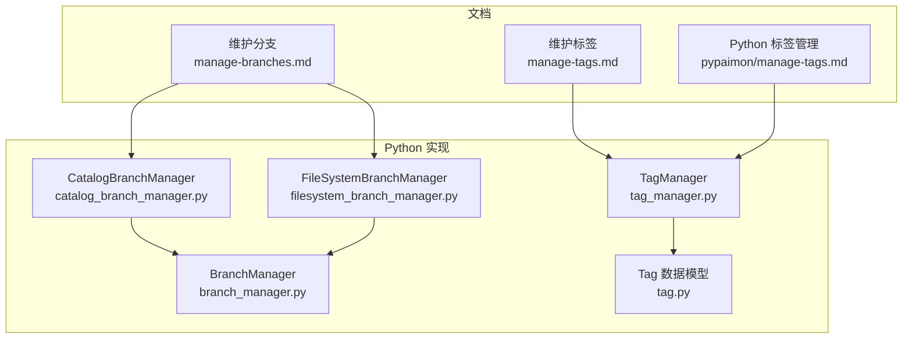
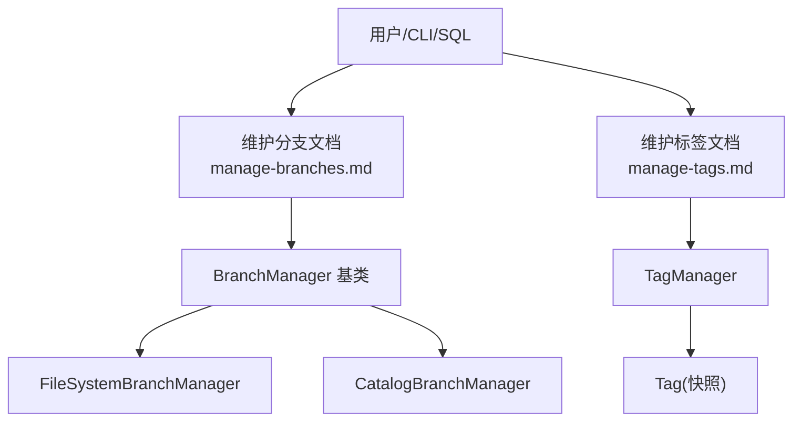
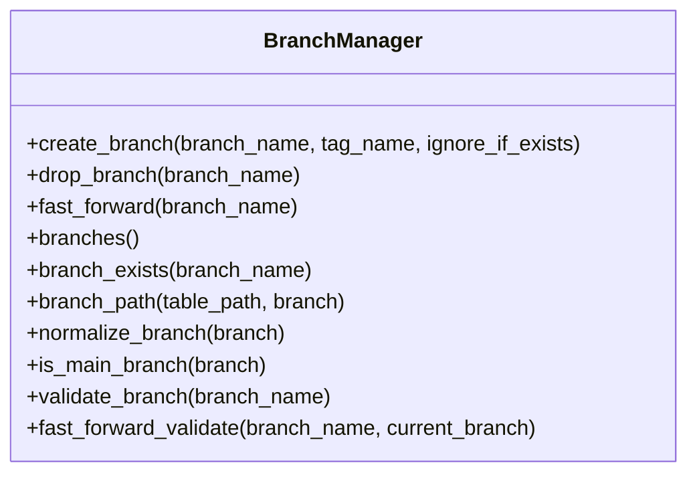
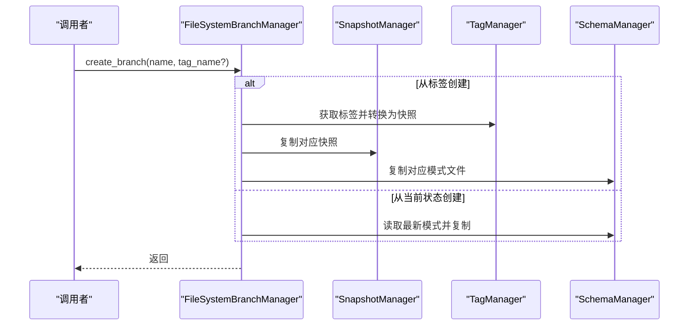
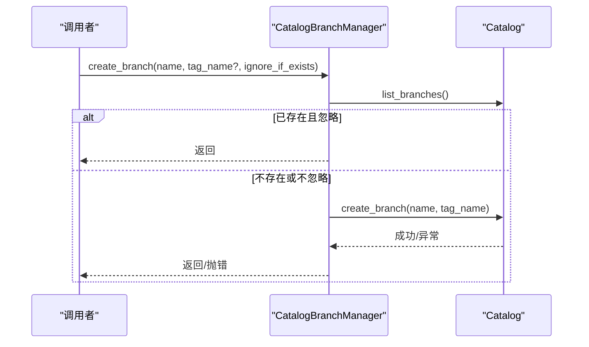
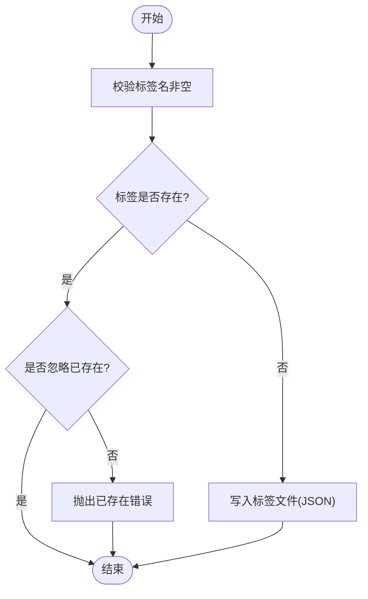
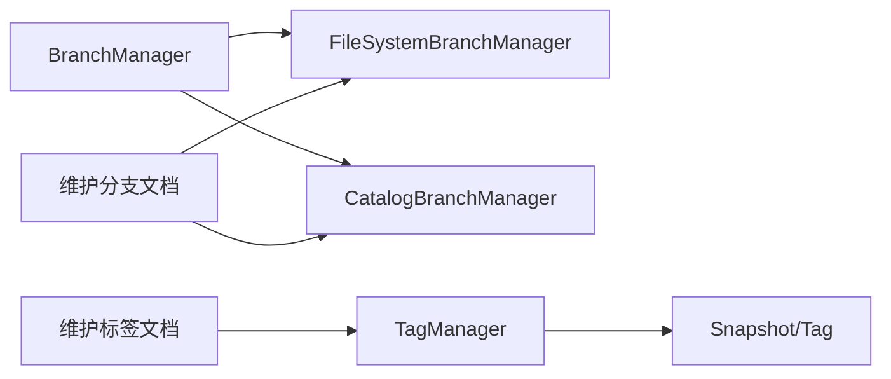

# 分支和标签管理

<cite>
**本文引用的文件**   
- [manage-branches.md](file://docs/content/maintenance/manage-branches.md)
- [manage-tags.md](file://docs/content/maintenance/manage-tags.md)
- [manage-tags.md（Python）](file://docs/content/pypaimon/manage-tags.md)
- [branch_manager.py](file://paimon-python/pypaimon/branch/branch_manager.py)
- [catalog_branch_manager.py](file://paimon-python/pypaimon/branch/catalog_branch_manager.py)
- [filesystem_branch_manager.py](file://paimon-python/pypaimon/branch/filesystem_branch_manager.py)
- [tag_manager.py](file://paimon-python/pypaimon/tag/tag_manager.py)
- [tag.py](file://paimon-python/pypaimon/tag/tag.py)
- [contributing.md](file://docs/content/project/contributing.md)
- [catalog_branch_manager_test.py](file://paimon-python/pypaimon/tests/branch/catalog_branch_manager_test.py)
- [file_store_table_branch_manager_test.py](file://paimon-python/pypaimon/tests/branch/file_store_table_branch_manager_test.py)
</cite>

## 目录
1. [简介](#简介)
2. [项目结构](#项目结构)
3. [核心组件](#核心组件)
4. [架构总览](#架构总览)
5. [详细组件分析](#详细组件分析)
6. [依赖分析](#依赖分析)
7. [性能考虑](#性能考虑)
8. [故障排查指南](#故障排查指南)
9. [结论](#结论)
10. [附录](#附录)

## 简介
本文件系统化梳理 Apache Paimon 的分支与标签管理能力，覆盖概念、用途、操作流程、最佳实践以及在团队协作与数据治理中的价值。内容基于官方文档与 Python 实现源码，帮助读者从入门到进阶掌握分支与标签的创建、切换、合并、删除、回滚与时间旅行查询等关键能力。

## 项目结构
围绕分支与标签管理，仓库中与之直接相关的内容主要分布在以下位置：
- 官方文档：维护分支与标签的用户指南，涵盖 SQL/CLI 操作与最佳实践
- Python 实现：提供分支与标签的管理器类，支持目录式与目录服务两种后端
- 测试用例：验证分支与标签的创建、删除、重命名、快进等行为

图表来源
- [manage-branches.md:1-291](file://docs/content/maintenance/manage-branches.md#L1-L291)
- [manage-tags.md:1-299](file://docs/content/maintenance/manage-tags.md#L1-L299)
- [manage-tags.md（Python）:1-72](file://docs/content/pypaimon/manage-tags.md#L1-L72)
- [branch_manager.py:1-192](file://paimon-python/pypaimon/branch/branch_manager.py#L1-L192)
- [catalog_branch_manager.py:1-152](file://paimon-python/pypaimon/branch/catalog_branch_manager.py#L1-L152)
- [filesystem_branch_manager.py:1-333](file://paimon-python/pypaimon/branch/filesystem_branch_manager.py#L1-L333)
- [tag_manager.py:1-234](file://paimon-python/pypaimon/tag/tag_manager.py#L1-L234)
- [tag.py:1-45](file://paimon-python/pypaimon/tag/tag.py#L1-L45)

章节来源
- [manage-branches.md:1-291](file://docs/content/maintenance/manage-branches.md#L1-L291)
- [manage-tags.md:1-299](file://docs/content/maintenance/manage-tags.md#L1-L299)
- [manage-tags.md（Python）:1-72](file://docs/content/pypaimon/manage-tags.md#L1-L72)
- [branch_manager.py:1-192](file://paimon-python/pypaimon/branch/branch_manager.py#L1-L192)
- [catalog_branch_manager.py:1-152](file://paimon-python/pypaimon/branch/catalog_branch_manager.py#L1-L152)
- [filesystem_branch_manager.py:1-333](file://paimon-python/pypaimon/branch/filesystem_branch_manager.py#L1-L333)
- [tag_manager.py:1-234](file://paimon-python/pypaimon/tag/tag_manager.py#L1-L234)
- [tag.py:1-45](file://paimon-python/pypaimon/tag/tag.py#L1-L45)

## 核心组件
- 分支管理器基类：定义分支创建、删除、快进、列举与校验等通用接口与规则
- 目录式分支管理器：基于文件系统实现分支的创建、删除、快进与列举
- 目录服务分支管理器：通过目录服务（Catalog）执行分支操作
- 标签管理器：负责标签的创建、删除、重命名、列举与持久化存储
- 标签数据模型：以“快照”为载体的时间点标记，支持回滚与增量查询

章节来源
- [branch_manager.py:28-192](file://paimon-python/pypaimon/branch/branch_manager.py#L28-L192)
- [filesystem_branch_manager.py:31-333](file://paimon-python/pypaimon/branch/filesystem_branch_manager.py#L31-L333)
- [catalog_branch_manager.py:31-152](file://paimon-python/pypaimon/branch/catalog_branch_manager.py#L31-L152)
- [tag_manager.py:32-234](file://paimon-python/pypaimon/tag/tag_manager.py#L32-L234)
- [tag.py:22-45](file://paimon-python/pypaimon/tag/tag.py#L22-L45)

## 架构总览
下图展示分支与标签在不同运行模式下的交互路径：SQL/CLI 文档描述了用户操作入口；Python 层的管理器根据部署形态选择目录式或目录服务实现；标签以“快照”为单位进行持久化与回滚。

图表来源
- [manage-branches.md:1-291](file://docs/content/maintenance/manage-branches.md#L1-L291)
- [manage-tags.md:1-299](file://docs/content/maintenance/manage-tags.md#L1-L299)
- [branch_manager.py:28-192](file://paimon-python/pypaimon/branch/branch_manager.py#L28-L192)
- [filesystem_branch_manager.py:31-333](file://paimon-python/pypaimon/branch/filesystem_branch_manager.py#L31-L333)
- [catalog_branch_manager.py:31-152](file://paimon-python/pypaimon/branch/catalog_branch_manager.py#L31-L152)
- [tag_manager.py:32-234](file://paimon-python/pypaimon/tag/tag_manager.py#L32-L234)
- [tag.py:22-45](file://paimon-python/pypaimon/tag/tag.py#L22-L45)

## 详细组件分析

### 分支管理器（BranchManager）
- 职责：定义分支生命周期管理的统一接口与约束（如主分支不可用作目标、名称合法性等）
- 关键方法：创建、删除、快进、列举、存在性检查、路径与规范化工具
- 校验规则：禁止使用默认主分支名、空字符串、纯数字名；快进不允许指向当前分支或主分支

图表来源
- [branch_manager.py:28-192](file://paimon-python/pypaimon/branch/branch_manager.py#L28-L192)

章节来源
- [branch_manager.py:28-192](file://paimon-python/pypaimon/branch/branch_manager.py#L28-L192)

### 目录式分支管理器（FileSystemBranchManager）
- 职责：在文件系统上实现分支的创建、删除、快进与列举
- 创建逻辑：可从标签或当前状态创建；若从标签创建，复制对应快照、标签与模式文件
- 删除逻辑：递归删除分支目录
- 快进逻辑：将分支侧快照复制回主分支，必要时清理缓存
- 列举逻辑：扫描 branch/* 目录，解析分支名

图表来源
- [filesystem_branch_manager.py:117-176](file://paimon-python/pypaimon/branch/filesystem_branch_manager.py#L117-L176)

章节来源
- [filesystem_branch_manager.py:31-333](file://paimon-python/pypaimon/branch/filesystem_branch_manager.py#L31-L333)

### 目录服务分支管理器（CatalogBranchManager）
- 职责：委托目录服务执行分支操作，适用于 REST 等目录服务场景
- 行为：封装异常（分支不存在、标签不存在、已存在等），并调用目录服务的创建、删除、快进与列举接口

图表来源
- [catalog_branch_manager.py:81-107](file://paimon-python/pypaimon/branch/catalog_branch_manager.py#L81-L107)

章节来源
- [catalog_branch_manager.py:31-152](file://paimon-python/pypaimon/branch/catalog_branch_manager.py#L31-L152)

### 标签管理器（TagManager）
- 职责：标签即“带命名的快照”，用于历史数据保留与回滚
- 功能：创建、删除、重命名、列举、读取；标签文件位于 branch/*/tag/ 下
- 重命名：原子性地将旧文件重命名为新文件

图表来源
- [tag_manager.py:117-142](file://paimon-python/pypaimon/tag/tag_manager.py#L117-L142)

章节来源
- [tag_manager.py:32-234](file://paimon-python/pypaimon/tag/tag_manager.py#L32-L234)
- [tag.py:22-45](file://paimon-python/pypaimon/tag/tag.py#L22-L45)

### 标签数据模型（Tag）
- 继承自快照，提供 trim_to_snapshot 将标签还原为快照对象，便于回滚与查询

章节来源
- [tag.py:22-45](file://paimon-python/pypaimon/tag/tag.py#L22-L45)

## 依赖分析
- 分支层依赖：BranchManager 作为抽象基类，FileSystemBranchManager 与 CatalogBranchManager 各自实现具体策略
- 标签层依赖：TagManager 依赖文件系统与快照管理器；Tag 继承快照
- 文档层依赖：维护分支/标签文档为用户操作指南，Python 文档补充 Python API 使用方式

图表来源
- [branch_manager.py:28-192](file://paimon-python/pypaimon/branch/branch_manager.py#L28-L192)
- [filesystem_branch_manager.py:31-333](file://paimon-python/pypaimon/branch/filesystem_branch_manager.py#L31-L333)
- [catalog_branch_manager.py:31-152](file://paimon-python/pypaimon/branch/catalog_branch_manager.py#L31-L152)
- [tag_manager.py:32-234](file://paimon-python/pypaimon/tag/tag_manager.py#L32-L234)
- [manage-branches.md:1-291](file://docs/content/maintenance/manage-branches.md#L1-L291)
- [manage-tags.md:1-299](file://docs/content/maintenance/manage-tags.md#L1-L299)

章节来源
- [branch_manager.py:28-192](file://paimon-python/pypaimon/branch/branch_manager.py#L28-L192)
- [filesystem_branch_manager.py:31-333](file://paimon-python/pypaimon/branch/filesystem_branch_manager.py#L31-L333)
- [catalog_branch_manager.py:31-152](file://paimon-python/pypaimon/branch/catalog_branch_manager.py#L31-L152)
- [tag_manager.py:32-234](file://paimon-python/pypaimon/tag/tag_manager.py#L32-L234)
- [manage-branches.md:1-291](file://docs/content/maintenance/manage-branches.md#L1-L291)
- [manage-tags.md:1-299](file://docs/content/maintenance/manage-tags.md#L1-L299)

## 性能考虑
- 快照复制成本：从标签创建分支会复制快照与模式文件，建议仅在必要时创建分支
- 文件系统开销：批量写入与重命名操作可能受底层文件系统影响，建议在空闲时段执行
- 缓存失效：快进后可能需要清理缓存以避免读取陈旧元数据
- 标签保留策略：合理设置标签保留数量与时间，避免过多标签导致存储与列举开销上升

## 故障排查指南
- 分支名称非法
  - 现象：创建/重命名时报错提示主分支名不可用、名称为空或为纯数字
  - 排查：确认分支名符合规则，避免使用默认主分支名
- 分支不存在
  - 现象：删除/快进时报错提示分支不存在
  - 排查：先列举分支确认存在性，再执行操作
- 标签不存在
  - 现象：回滚/读取时报错提示标签不存在
  - 排查：确认标签名正确，必要时重新创建
- 删除分支未清理数据
  - 说明：删除分支仅删除元数据，需配合清理孤儿文件工具
- 快进冲突
  - 现象：尝试快进到当前分支或主分支
  - 排查：确保目标分支与当前分支不同，且非主分支

章节来源
- [branch_manager.py:148-192](file://paimon-python/pypaimon/branch/branch_manager.py#L148-L192)
- [filesystem_branch_manager.py:178-200](file://paimon-python/pypaimon/branch/filesystem_branch_manager.py#L178-L200)
- [catalog_branch_manager.py:109-139](file://paimon-python/pypaimon/branch/catalog_branch_manager.py#L109-L139)
- [tag_manager.py:180-200](file://paimon-python/pypaimon/tag/tag_manager.py#L180-L200)
- [manage-branches.md:86-130](file://docs/content/maintenance/manage-branches.md#L86-L130)

## 结论
Paimon 的分支与标签体系为流批一体化场景提供了强大的并行开发与历史数据治理能力。通过目录式与目录服务两种分支实现，结合标签的持久化与回滚能力，团队可在不中断生产工作负载的前提下进行实验与修复，并以标签为单位进行合规性审计与版本发布。建议在团队内建立统一的分支命名规范与标签保留策略，配合自动化脚本与 CI 流程，提升协作效率与数据治理水平。

## 附录

### 概念与用途
- 分支：同一张表的多条开发线，适合实验性作业、功能验证与并行开发
- 标签：基于快照的命名标记，用于历史数据保留、回滚与增量查询

章节来源
- [manage-branches.md:29-34](file://docs/content/maintenance/manage-branches.md#L29-L34)
- [manage-tags.md:29-35](file://docs/content/maintenance/manage-tags.md#L29-L35)

### 分支操作命令与示例
- 创建分支
  - 从标签创建：参考维护分支文档中的 SQL/CLI 示例
  - 从当前状态创建：参考维护分支文档中的 SQL/CLI 示例
- 删除分支：参考维护分支文档中的 SQL/CLI 示例
- 快进分支：参考维护分支文档中的 SQL/CLI 示例
- 在分支上读写：参考维护分支文档中的 SQL/CLI 示例

章节来源
- [manage-branches.md:35-291](file://docs/content/maintenance/manage-branches.md#L35-L291)

### 标签操作命令与示例
- 自动创建标签：参考维护标签文档中的自动创建步骤与参数
- 手动创建/删除/重命名标签：参考维护标签文档与 Python 标签文档中的示例
- 回滚到标签：参考维护标签文档中的回滚示例

章节来源
- [manage-tags.md:36-299](file://docs/content/maintenance/manage-tags.md#L36-L299)
- [manage-tags.md（Python）:32-72](file://docs/content/pypaimon/manage-tags.md#L32-L72)

### 团队协作与最佳实践
- 分支策略
  - 主干稳定：默认主分支保持稳定，所有变更通过功能分支进行
  - 功能分支命名：采用语义化前缀（如 feature/、fix/、hotfix/），避免纯数字
  - 合并与清理：完成评审后合并至主分支并删除功能分支
- 标签策略
  - 发布标签：每次发布创建标签，命名遵循语义化版本
  - 日常归档：按天/小时生成标签，便于回溯与审计
  - 清理策略：设置最大保留数量或时间，定期清理过期标签
- 并行开发与紧急修复
  - 并行开发：为不同特性创建独立分支，互不影响
  - 紧急修复：在 hotfix 分支修复后，快进至主分支并回滚到修复标签

章节来源
- [contributing.md:151-187](file://docs/content/project/contributing.md#L151-L187)

### 数据治理与合规性
- 版本可追溯：标签即快照，支持历史数据查询与回滚
- 审计留痕：分支与标签的创建、删除、重命名均具备可追踪性
- 合规保留：通过标签保留策略满足法规要求的数据保留周期

章节来源
- [manage-tags.md:58-61](file://docs/content/maintenance/manage-tags.md#L58-L61)
- [tag_manager.py:117-142](file://paimon-python/pypaimon/tag/tag_manager.py#L117-L142)

### 测试与验证
- 分支管理器测试：覆盖分支创建、删除、重命名、列举与校验
- 目录服务分支管理器测试：覆盖异常处理与参数校验
- 集成测试：验证在无目录服务与有目录服务两种形态下的分支管理器选择与行为

章节来源
- [catalog_branch_manager_test.py:30-196](file://paimon-python/pypaimon/tests/branch/catalog_branch_manager_test.py#L30-L196)
- [file_store_table_branch_manager_test.py:90-170](file://paimon-python/pypaimon/tests/branch/file_store_table_branch_manager_test.py#L90-L170)