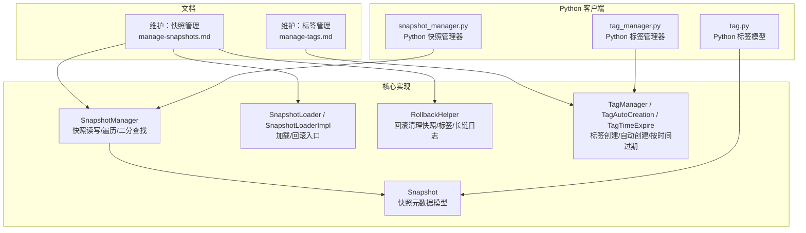
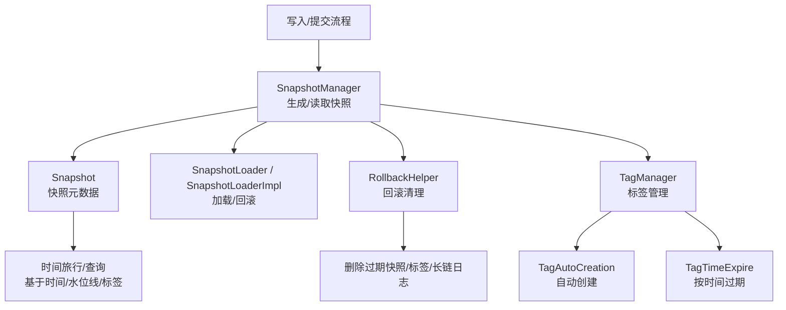
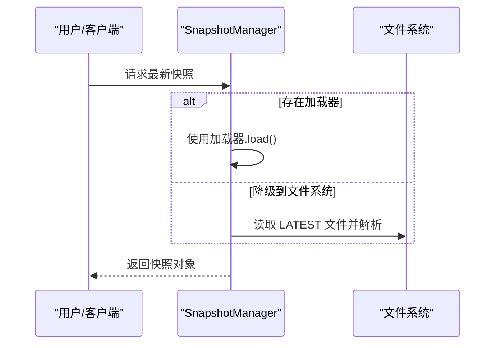
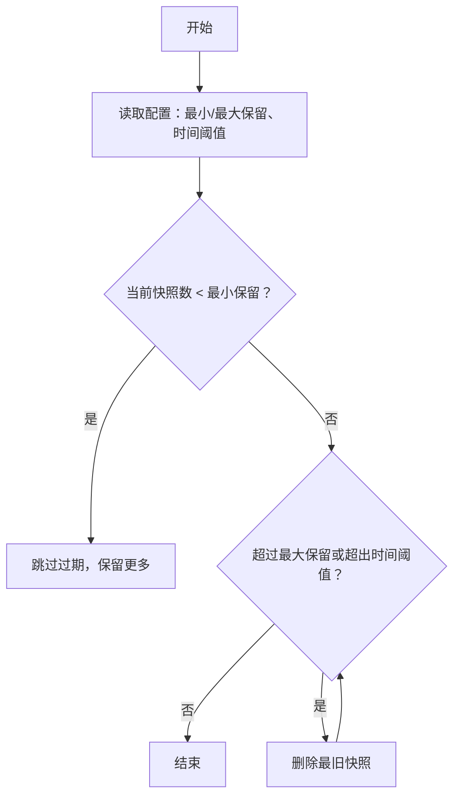
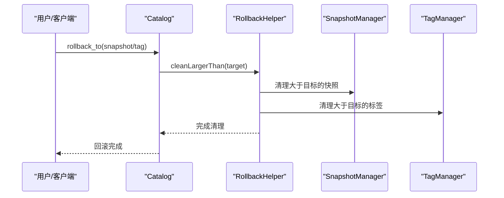
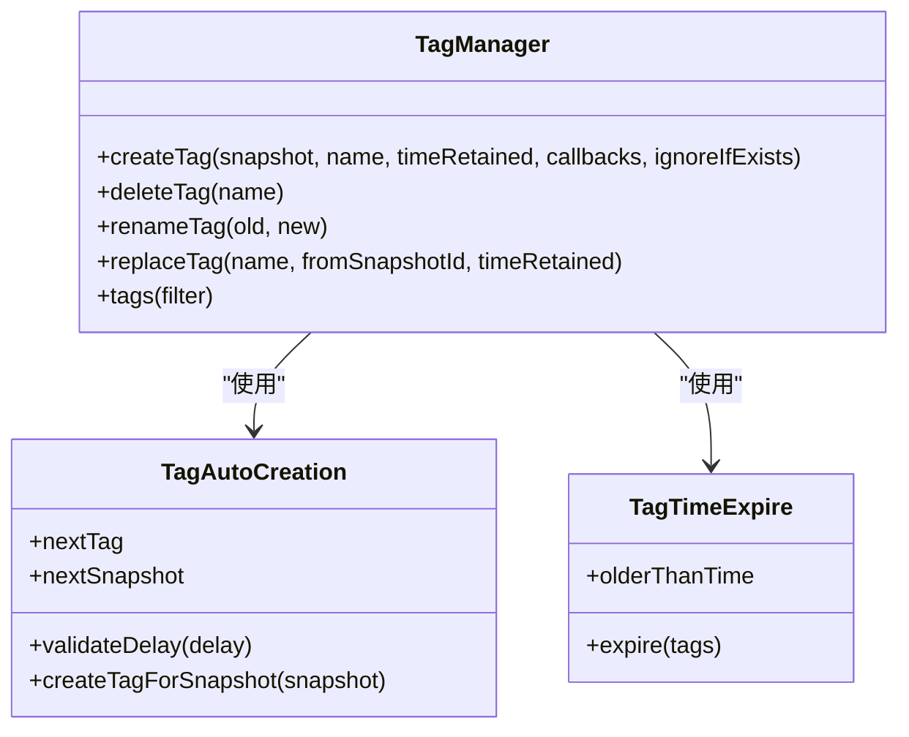
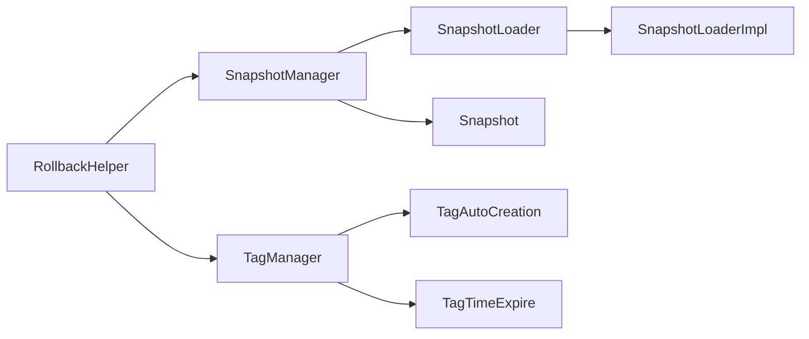

# 快照管理

<cite>
**本文引用的文件**
- [manage-snapshots.md](file://docs/content/maintenance/manage-snapshots.md)
- [manage-tags.md](file://docs/content/maintenance/manage-tags.md)
- [SnapshotManager.java](file://paimon-core/src/main/java/org/apache/paimon/utils/SnapshotManager.java)
- [SnapshotLoader.java](file://paimon-core/src/main/java/org/apache/paimon/utils/SnapshotLoader.java)
- [SnapshotLoaderImpl.java](file://paimon-core/src/main/java/org/apache/paimon/tag/SnapshotLoaderImpl.java)
- [RollbackHelper.java](file://paimon-core/src/main/java/org/apache/paimon/table/RollbackHelper.java)
- [Snapshot.java](file://paimon-api/src/main/java/org/apache/paimon/Snapshot.java)
- [TagManager.java](file://paimon-core/src/main/java/org/apache/paimon/utils/TagManager.java)
- [TagAutoCreation.java](file://paimon-core/src/main/java/org/apache/paimon/tag/TagAutoCreation.java)
- [TagTimeExpire.java](file://paimon-core/src/main/java/org/apache/paimon/tag/TagTimeExpire.java)
- [snapshot_manager.py（Python）](file://paimon-python/pypaimon/snapshot/snapshot_manager.py)
- [tag_manager.py（Python）](file://paimon-python/pypaimon/tag/tag_manager.py)
- [tag.py（Python）](file://paimon-python/pypaimon/tag/tag.py)
- [rest_catalog_test.py（Python 测试）](file://paimon-python/pypaimon/tests/rest/rest_catalog_test.py)
</cite>

## 目录
1. [引言](#引言)
2. [项目结构](#项目结构)
3. [核心组件](#核心组件)
4. [架构总览](#架构总览)
5. [详细组件分析](#详细组件分析)
6. [依赖分析](#依赖分析)
7. [性能考虑](#性能考虑)
8. [故障排查指南](#故障排查指南)
9. [结论](#结论)
10. [附录](#附录)

## 引言
本章节系统化阐述 Apache Paimon 的快照管理能力，围绕“时间点一致性”“数据版本控制”“自动与手动快照”“查看与查询”“删除与清理”“回滚”“标签管理”“数据恢复与审计”等主题展开，并提供命令与编程接口示例路径，帮助读者在不同运行环境（Flink、Spark、Java API、Python 客户端）中高效使用。

## 项目结构
与快照管理直接相关的文档与代码主要分布在以下位置：
- 维护与用户指南：维护快照与标签的使用说明与最佳实践
- 核心实现：快照与标签的读写、过期、回滚、时间旅行等逻辑
- Python 客户端：面向用户的快照与标签管理封装

图表来源
- [manage-snapshots.md](file://docs/content/maintenance/manage-snapshots.md)
- [manage-tags.md](file://docs/content/maintenance/manage-tags.md)
- [SnapshotManager.java](file://paimon-core/src/main/java/org/apache/paimon/utils/SnapshotManager.java)
- [SnapshotLoader.java](file://paimon-core/src/main/java/org/apache/paimon/utils/SnapshotLoader.java)
- [SnapshotLoaderImpl.java](file://paimon-core/src/main/java/org/apache/paimon/tag/SnapshotLoaderImpl.java)
- [RollbackHelper.java](file://paimon-core/src/main/java/org/apache/paimon/table/RollbackHelper.java)
- [TagManager.java](file://paimon-core/src/main/java/org/apache/paimon/utils/TagManager.java)
- [TagAutoCreation.java](file://paimon-core/src/main/java/org/apache/paimon/tag/TagAutoCreation.java)
- [TagTimeExpire.java](file://paimon-core/src/main/java/org/apache/paimon/tag/TagTimeExpire.java)
- [Snapshot.java](file://paimon-api/src/main/java/org/apache/paimon/Snapshot.java)
- [snapshot_manager.py（Python）](file://paimon-python/pypaimon/snapshot/snapshot_manager.py)
- [tag_manager.py（Python）](file://paimon-python/pypaimon/tag/tag_manager.py)
- [tag.py（Python）](file://paimon-python/pypaimon/tag/tag.py)

章节来源
- [manage-snapshots.md](file://docs/content/maintenance/manage-snapshots.md)
- [manage-tags.md](file://docs/content/maintenance/manage-tags.md)

## 核心组件
- 快照模型（Snapshot）：描述某一提交时刻的数据状态，包含清单列表、统计信息、提交标识、时间戳、水位线等关键字段，用于时间旅行与一致性读取。
- 快照管理器（SnapshotManager）：负责快照文件的读取、缓存、最新/最早快照定位、范围扫描、二分查找（基于提交时间/水位线）、安全遍历等。
- 加载器（SnapshotLoader / SnapshotLoaderImpl）：统一抽象快照加载与回滚入口，支持从 Catalog 或分支切换加载。
- 回滚助手（RollbackHelper）：执行回滚时清理大于目标快照的快照、长链变更日志与标签，确保一致性。
- 标签管理（TagManager / TagAutoCreation / TagTimeExpire）：标签即“带命名的快照”，支持自动创建、按时间过期、重命名、替换、删除等。
- Python 客户端：提供与 Java 等价的快照与标签管理能力，便于脚本化与交互式使用。

章节来源
- [Snapshot.java](file://paimon-api/src/main/java/org/apache/paimon/Snapshot.java)
- [SnapshotManager.java](file://paimon-core/src/main/java/org/apache/paimon/utils/SnapshotManager.java)
- [SnapshotLoader.java](file://paimon-core/src/main/java/org/apache/paimon/utils/SnapshotLoader.java)
- [SnapshotLoaderImpl.java](file://paimon-core/src/main/java/org/apache/paimon/tag/SnapshotLoaderImpl.java)
- [RollbackHelper.java](file://paimon-core/src/main/java/org/apache/paimon/table/RollbackHelper.java)
- [TagManager.java](file://paimon-core/src/main/java/org/apache/paimon/utils/TagManager.java)
- [TagAutoCreation.java](file://paimon-core/src/main/java/org/apache/paimon/tag/TagAutoCreation.java)
- [TagTimeExpire.java](file://paimon-core/src/main/java/org/apache/paimon/tag/TagTimeExpire.java)
- [snapshot_manager.py（Python）](file://paimon-python/pypaimon/snapshot/snapshot_manager.py)
- [tag_manager.py（Python）](file://paimon-python/pypaimon/tag/tag_manager.py)
- [tag.py（Python）](file://paimon-python/pypaimon/tag/tag.py)

## 架构总览
下图展示快照与标签在系统中的角色与交互：

图表来源
- [SnapshotManager.java](file://paimon-core/src/main/java/org/apache/paimon/utils/SnapshotManager.java)
- [SnapshotLoader.java](file://paimon-core/src/main/java/org/apache/paimon/utils/SnapshotLoader.java)
- [SnapshotLoaderImpl.java](file://paimon-core/src/main/java/org/apache/paimon/tag/SnapshotLoaderImpl.java)
- [RollbackHelper.java](file://paimon-core/src/main/java/org/apache/paimon/table/RollbackHelper.java)
- [TagManager.java](file://paimon-core/src/main/java/org/apache/paimon/utils/TagManager.java)
- [TagAutoCreation.java](file://paimon-core/src/main/java/org/apache/paimon/tag/TagAutoCreation.java)
- [TagTimeExpire.java](file://paimon-core/src/main/java/org/apache/paimon/tag/TagTimeExpire.java)
- [Snapshot.java](file://paimon-api/src/main/java/org/apache/paimon/Snapshot.java)

## 详细组件分析

### 快照概念与作用
- 时间点一致性：快照记录某一提交时刻的表状态，保证读取的一致性与可重复性。
- 数据版本控制：通过递增的快照 ID 与提交标识，实现版本演进与并发控制。
- 支持时间旅行：可通过时间戳或水位线定位到历史快照，实现“回放/对比/审计”。

章节来源
- [Snapshot.java](file://paimon-api/src/main/java/org/apache/paimon/Snapshot.java)
- [SnapshotManager.java](file://paimon-core/src/main/java/org/apache/paimon/utils/SnapshotManager.java)

### 快照创建与触发
- 自动快照：每次提交生成一个或两个快照；写入器在提交过程中触发。
- 手动快照：通过命令或 API 触发（例如在批作业或运维场景中）。

章节来源
- [manage-snapshots.md](file://docs/content/maintenance/manage-snapshots.md)

### 快照查看与查询
- 查看最新/最早快照、按范围扫描、按用户过滤、安全遍历。
- 基于时间与水位线的二分查找，支持“早于/晚于等于”的快速定位。
- Python 客户端提供批量获取、二分查找、批量拉取等便捷能力。

图表来源
- [SnapshotManager.java](file://paimon-core/src/main/java/org/apache/paimon/utils/SnapshotManager.java)
- [snapshot_manager.py（Python）](file://paimon-python/pypaimon/snapshot/snapshot_manager.py)

章节来源
- [SnapshotManager.java](file://paimon-core/src/main/java/org/apache/paimon/utils/SnapshotManager.java)
- [snapshot_manager.py（Python）](file://paimon-python/pypaimon/snapshot/snapshot_manager.py)

### 快照删除与清理策略
- 过期策略由表属性控制：保留时长、最小/最大保留数量、过期执行模式与单次最大删除数。
- 过期检查遵循“先满足最小保留，再按最大保留与时间阈值裁剪”。
- 可手动触发过期，或在异步模式下降低对上游背压影响。

图表来源
- [manage-snapshots.md](file://docs/content/maintenance/manage-snapshots.md)

章节来源
- [manage-snapshots.md](file://docs/content/maintenance/manage-snapshots.md)

### 快照回滚
- 支持按快照 ID 或标签名回滚。
- 回滚后会清理大于目标快照的所有快照、长链变更日志与标签，确保一致性。
- Python 测试覆盖了回滚失败与成功场景，包括“从快照校验”等约束。

图表来源
- [RollbackHelper.java](file://paimon-core/src/main/java/org/apache/paimon/table/RollbackHelper.java)
- [SnapshotLoaderImpl.java](file://paimon-core/src/main/java/org/apache/paimon/tag/SnapshotLoaderImpl.java)
- [rest_catalog_test.py（Python 测试）](file://paimon-python/pypaimon/tests/rest/rest_catalog_test.py)

章节来源
- [RollbackHelper.java](file://paimon-core/src/main/java/org/apache/paimon/table/RollbackHelper.java)
- [SnapshotLoaderImpl.java](file://paimon-core/src/main/java/org/apache/paimon/tag/SnapshotLoaderImpl.java)
- [rest_catalog_test.py（Python 测试）](file://paimon-python/pypaimon/tests/rest/rest_catalog_test.py)

### 标签管理
- 创建：支持指定快照 ID 或默认最新快照；可设置保留时长。
- 删除：按名称删除标签。
- 回滚：按标签名回滚，清理大于目标快照的快照与标签。
- 自动创建：按进程时间/水位线/批次周期自动打标签，并可配置延迟。
- 按时间过期：根据默认保留时长或绝对时间阈值自动删除过期标签。

图表来源
- [TagManager.java](file://paimon-core/src/main/java/org/apache/paimon/utils/TagManager.java)
- [TagAutoCreation.java](file://paimon-core/src/main/java/org/apache/paimon/tag/TagAutoCreation.java)
- [TagTimeExpire.java](file://paimon-core/src/main/java/org/apache/paimon/tag/TagTimeExpire.java)

章节来源
- [manage-tags.md](file://docs/content/maintenance/manage-tags.md)
- [TagManager.java](file://paimon-core/src/main/java/org/apache/paimon/utils/TagManager.java)
- [TagAutoCreation.java](file://paimon-core/src/main/java/org/apache/paimon/tag/TagAutoCreation.java)
- [TagTimeExpire.java](file://paimon-core/src/main/java/org/apache/paimon/tag/TagTimeExpire.java)
- [tag_manager.py（Python）](file://paimon-python/pypaimon/tag/tag_manager.py)
- [tag.py（Python）](file://paimon-python/pypaimon/tag/tag.py)

### 数据恢复与审计
- 快照与标签共同支撑“时间旅行”与“历史审计”。通过标签可长期保留每日/每小时的快照，便于跨天增量比对与问题复盘。
- 回滚可用于灾难恢复，但需谨慎评估对下游的影响。

章节来源
- [manage-tags.md](file://docs/content/maintenance/manage-tags.md)
- [manage-snapshots.md](file://docs/content/maintenance/manage-snapshots.md)

### 快照操作命令与编程接口示例（路径）
- 过期快照（Flink SQL/Action/Spark）
  - [命令示例路径](file://docs/content/maintenance/manage-snapshots.md)
- 回滚到快照（Flink SQL/Action/Java/Spark）
  - [命令示例路径](file://docs/content/maintenance/manage-snapshots.md)
- 回滚到标签（Flink SQL/Action/Java/Spark）
  - [命令示例路径](file://docs/content/maintenance/manage-tags.md)
- Java API：Table.rollbackTo(...)、Table.createTag(...)
  - [示例路径](file://docs/content/maintenance/manage-snapshots.md)
  - [示例路径](file://docs/content/maintenance/manage-tags.md)
- Python 客户端：SnapshotManager、TagManager
  - [Python 快照管理器](file://paimon-python/pypaimon/snapshot/snapshot_manager.py)
  - [Python 标签管理器](file://paimon-python/pypaimon/tag/tag_manager.py)

## 依赖分析
- SnapshotManager 依赖 FileIO、Hint 文件、分支路径工具，提供快照读写与二分查找。
- SnapshotLoader 抽象了加载与回滚入口，SnapshotLoaderImpl 将其绑定到 Catalog。
- RollbackHelper 联合 SnapshotManager、ChangelogManager、TagManager 完成回滚清理。
- TagManager 与 TagAutoCreation/TagTimeExpire 协作实现自动创建与按时间过期。

图表来源
- [SnapshotManager.java](file://paimon-core/src/main/java/org/apache/paimon/utils/SnapshotManager.java)
- [SnapshotLoader.java](file://paimon-core/src/main/java/org/apache/paimon/utils/SnapshotLoader.java)
- [SnapshotLoaderImpl.java](file://paimon-core/src/main/java/org/apache/paimon/tag/SnapshotLoaderImpl.java)
- [RollbackHelper.java](file://paimon-core/src/main/java/org/apache/paimon/table/RollbackHelper.java)
- [TagManager.java](file://paimon-core/src/main/java/org/apache/paimon/utils/TagManager.java)
- [TagAutoCreation.java](file://paimon-core/src/main/java/org/apache/paimon/tag/TagAutoCreation.java)
- [TagTimeExpire.java](file://paimon-core/src/main/java/org/apache/paimon/tag/TagTimeExpire.java)
- [Snapshot.java](file://paimon-api/src/main/java/org/apache/paimon/Snapshot.java)

章节来源
- [SnapshotManager.java](file://paimon-core/src/main/java/org/apache/paimon/utils/SnapshotManager.java)
- [SnapshotLoader.java](file://paimon-core/src/main/java/org/apache/paimon/utils/SnapshotLoader.java)
- [SnapshotLoaderImpl.java](file://paimon-core/src/main/java/org/apache/paimon/tag/SnapshotLoaderImpl.java)
- [RollbackHelper.java](file://paimon-core/src/main/java/org/apache/paimon/table/RollbackHelper.java)
- [TagManager.java](file://paimon-core/src/main/java/org/apache/paimon/utils/TagManager.java)
- [TagAutoCreation.java](file://paimon-core/src/main/java/org/apache/paimon/tag/TagAutoCreation.java)
- [TagTimeExpire.java](file://paimon-core/src/main/java/org/apache/paimon/tag/TagTimeExpire.java)
- [Snapshot.java](file://paimon-api/src/main/java/org/apache/paimon/Snapshot.java)

## 性能考虑
- 快照二分查找与范围扫描：利用 Hint 文件与二分策略减少 IO。
- 并发与一致性：在多写入器场景下，建议写入独占或差异化过期阈值，避免竞态导致的“读到已过期快照”。
- 异步过期：在批量作业中谨慎使用异步模式，避免过期任务未完成导致的不一致。

章节来源
- [SnapshotManager.java](file://paimon-core/src/main/java/org/apache/paimon/utils/SnapshotManager.java)
- [manage-snapshots.md](file://docs/content/maintenance/manage-snapshots.md)

## 故障排查指南
- 回滚失败：检查目标快照是否存在、是否满足“从快照校验”要求。
- 快照缺失：确认是否被其他写入器并发过期；必要时启用写入独占或调整过期阈值。
- 标签异常：确认自动创建周期与延迟配置是否合理，检查按时间过期策略是否提前删除。

章节来源
- [rest_catalog_test.py（Python 测试）](file://paimon-python/pypaimon/tests/rest/rest_catalog_test.py)
- [manage-snapshots.md](file://docs/content/maintenance/manage-snapshots.md)
- [manage-tags.md](file://docs/content/maintenance/manage-tags.md)

## 结论
快照与标签构成了 Paimon 的时间点一致性与版本控制基石。通过合理的过期策略、自动标签与回滚清理机制，既能保障存储空间与查询稳定性，又能满足审计与恢复需求。建议在生产环境中结合业务窗口与延迟容忍度，精细化配置保留策略与过期模式。

## 附录
- 快照与标签的常用命令与 API 示例请参考以下路径：
  - [快照管理命令与说明](file://docs/content/maintenance/manage-snapshots.md)
  - [标签管理命令与说明](file://docs/content/maintenance/manage-tags.md)
  - [Java 快照管理器](file://paimon-core/src/main/java/org/apache/paimon/utils/SnapshotManager.java)
  - [Java 标签管理器](file://paimon-core/src/main/java/org/apache/paimon/utils/TagManager.java)
  - [Python 快照管理器](file://paimon-python/pypaimon/snapshot/snapshot_manager.py)
  - [Python 标签管理器](file://paimon-python/pypaimon/tag/tag_manager.py)