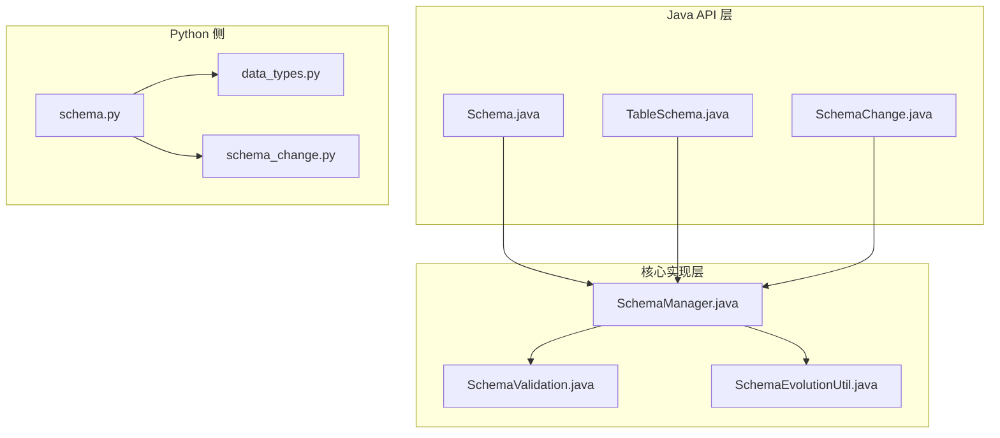
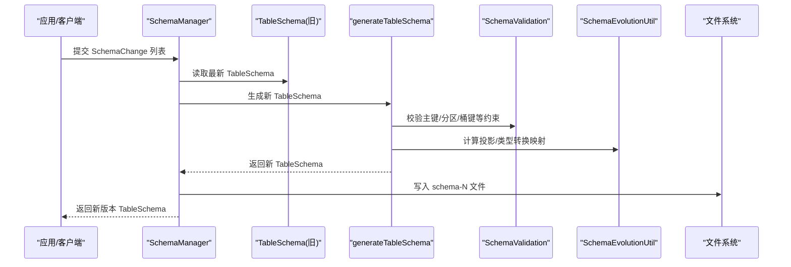
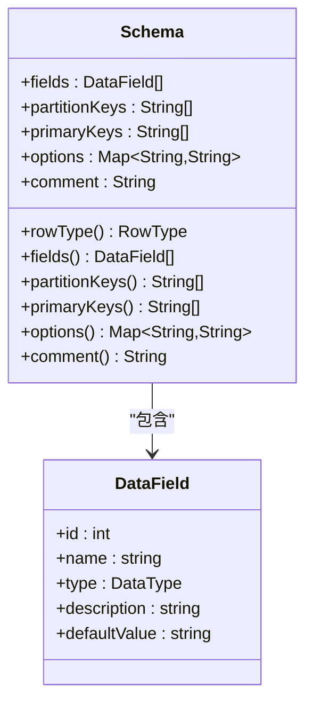
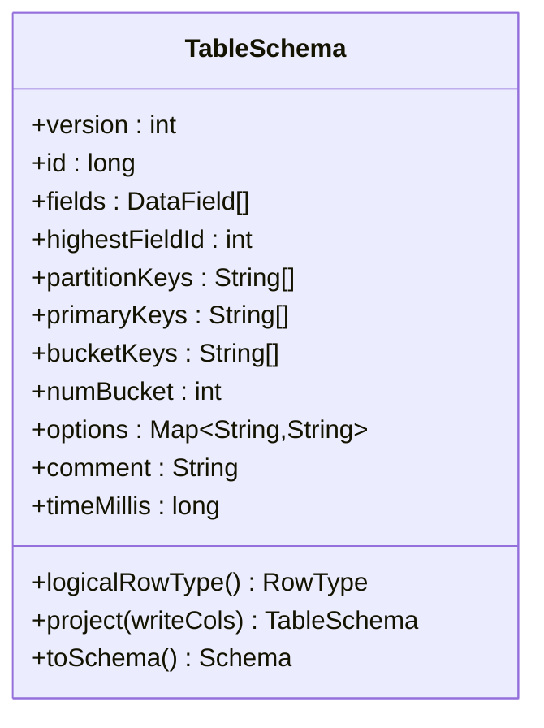
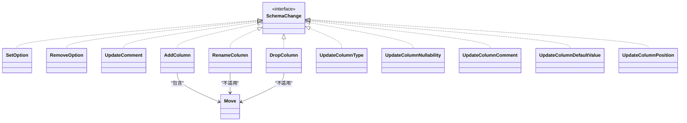
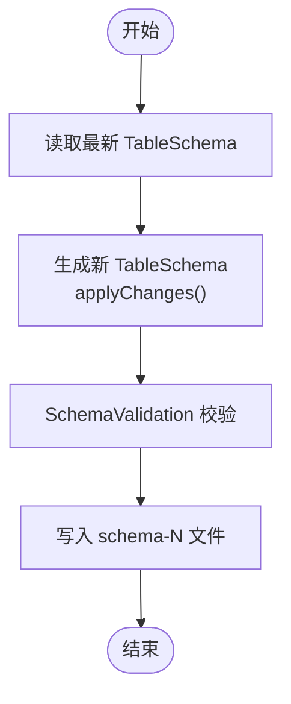
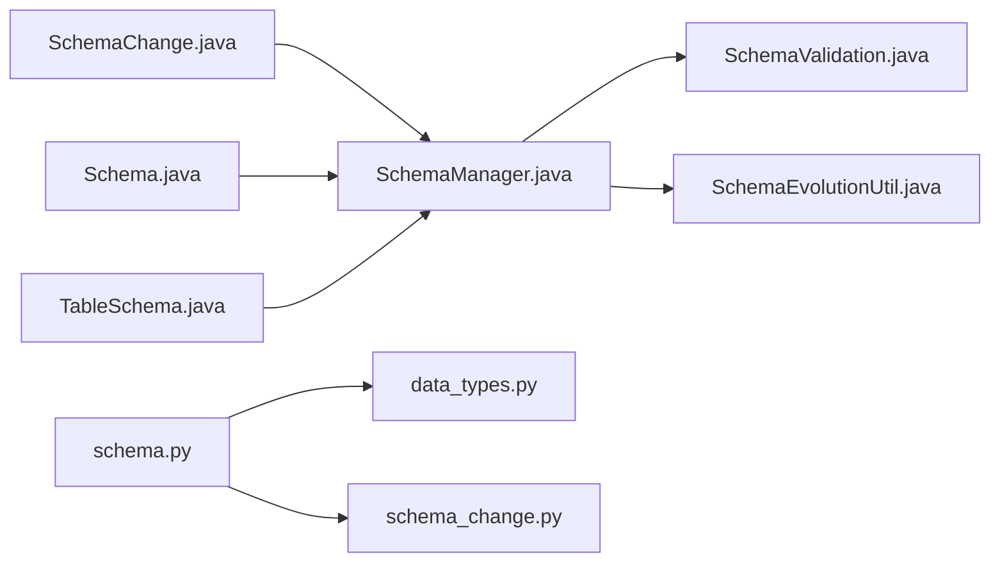
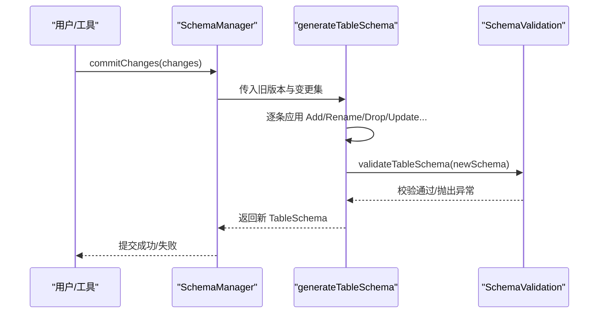

# 模式管理

<cite>
**本文引用的文件**
- [Schema.java](file://paimon-api/src/main/java/org/apache/paimon/schema/Schema.java)
- [TableSchema.java](file://paimon-api/src/main/java/org/apache/paimon/schema/TableSchema.java)
- [SchemaChange.java](file://paimon-api/src/main/java/org/apache/paimon/schema/SchemaChange.java)
- [SchemaManager.java](file://paimon-core/src/main/java/org/apache/paimon/schema/SchemaManager.java)
- [SchemaValidation.java](file://paimon-core/src/main/java/org/apache/paimon/schema/SchemaValidation.java)
- [SchemaEvolutionUtil.java](file://paimon-core/src/main/java/org/apache/paimon/schema/SchemaEvolutionUtil.java)
- [schema.py](file://paimon-python/pypaimon/schema/schema.py)
- [data_types.py](file://paimon-python/pypaimon/schema/data_types.py)
- [schema_change.py](file://paimon-python/pypaimon/schema/schema_change.py)
- [rest-catalog-open-api.yaml](file://docs/static/rest-catalog-open-api.yaml)
</cite>

## 目录
1. [简介](#简介)
2. [项目结构](#项目结构)
3. [核心组件](#核心组件)
4. [架构总览](#架构总览)
5. [详细组件分析](#详细组件分析)
6. [依赖分析](#依赖分析)
7. [性能考量](#性能考量)
8. [故障排查指南](#故障排查指南)
9. [结论](#结论)
10. [附录](#附录)

## 简介
本篇文档围绕 Apache Paimon 的“模式管理”能力，系统阐述表模式（Schema）的概念与职责、字段定义与类型系统、约束条件（主键、分区键、桶键）、模式演进机制（新增、重命名、删除、类型修改、位置调整、默认值与注释更新）、历史版本管理（版本号递增、分支与快照联动）、模式验证与冲突检测、以及模式变更对查询性能与存储效率的影响。同时提供面向 SQL 与编程接口的实践建议与参考路径。

## 项目结构
- 模式模型与变更接口位于 Java API 层：Schema、TableSchema、SchemaChange 及其子类。
- 模式管理与演进逻辑位于核心层：SchemaManager 负责版本化存储、生成新版本、提交变更；SchemaValidation 提供一致性与约束校验；SchemaEvolutionUtil 支持演进过程中的投影与类型转换。
- Python 侧提供与 REST Catalog 对接的模式与类型定义，便于外部工具链集成。

图表来源
- [Schema.java:1-391](file://paimon-api/src/main/java/org/apache/paimon/schema/Schema.java#L1-L391)
- [TableSchema.java:1-390](file://paimon-api/src/main/java/org/apache/paimon/schema/TableSchema.java#L1-L390)
- [SchemaChange.java:1-800](file://paimon-api/src/main/java/org/apache/paimon/schema/SchemaChange.java#L1-L800)
- [SchemaManager.java:1-800](file://paimon-core/src/main/java/org/apache/paimon/schema/SchemaManager.java#L1-L800)
- [SchemaValidation.java:1-800](file://paimon-core/src/main/java/org/apache/paimon/schema/SchemaValidation.java#L1-L800)
- [SchemaEvolutionUtil.java:1-318](file://paimon-core/src/main/java/org/apache/paimon/schema/SchemaEvolutionUtil.java#L1-L318)
- [schema.py:1-96](file://paimon-python/pypaimon/schema/schema.py#L1-L96)
- [data_types.py:1-706](file://paimon-python/pypaimon/schema/data_types.py#L1-L706)
- [schema_change.py:147-218](file://paimon-python/pypaimon/schema/schema_change.py#L147-L218)

章节来源
- [Schema.java:1-391](file://paimon-api/src/main/java/org/apache/paimon/schema/Schema.java#L1-L391)
- [TableSchema.java:1-390](file://paimon-api/src/main/java/org/apache/paimon/schema/TableSchema.java#L1-L390)
- [SchemaChange.java:1-800](file://paimon-api/src/main/java/org/apache/paimon/schema/SchemaChange.java#L1-L800)
- [SchemaManager.java:1-800](file://paimon-core/src/main/java/org/apache/paimon/schema/SchemaManager.java#L1-L800)
- [SchemaValidation.java:1-800](file://paimon-core/src/main/java/org/apache/paimon/schema/SchemaValidation.java#L1-L800)
- [SchemaEvolutionUtil.java:1-318](file://paimon-core/src/main/java/org/apache/paimon/schema/SchemaEvolutionUtil.java#L1-L318)
- [schema.py:1-96](file://paimon-python/pypaimon/schema/schema.py#L1-L96)
- [data_types.py:1-706](file://paimon-python/pypaimon/schema/data_types.py#L1-L706)
- [schema_change.py:147-218](file://paimon-python/pypaimon/schema/schema_change.py#L147-L218)

## 核心组件
- Schema：描述表的字段、分区键、主键、选项与注释，负责规范化与去重检查。
- TableSchema：在 Schema 基础上增加 schemaId、最高字段 ID、桶键、桶数、时间戳等，用于持久化与运行时投影。
- SchemaChange：统一的模式变更抽象，涵盖设置/移除选项、更新注释、新增/重命名/删除列、更新类型/空值语义/默认值/位置等。
- SchemaManager：版本化管理器，负责生成新版本、提交变更、合并模式、校验外部表等。
- SchemaValidation：对表模式与选项进行严格校验，确保主键/分区键/桶键/序列字段/聚合函数等约束合法。
- SchemaEvolutionUtil：演进过程中的索引映射、类型转换、谓词下推适配等。

章节来源
- [Schema.java:56-267](file://paimon-api/src/main/java/org/apache/paimon/schema/Schema.java#L56-L267)
- [TableSchema.java:46-128](file://paimon-api/src/main/java/org/apache/paimon/schema/TableSchema.java#L46-L128)
- [SchemaChange.java:37-82](file://paimon-api/src/main/java/org/apache/paimon/schema/SchemaChange.java#L37-L82)
- [SchemaManager.java:107-132](file://paimon-core/src/main/java/org/apache/paimon/schema/SchemaManager.java#L107-L132)
- [SchemaValidation.java:94-287](file://paimon-core/src/main/java/org/apache/paimon/schema/SchemaValidation.java#L94-L287)
- [SchemaEvolutionUtil.java:57-125](file://paimon-core/src/main/java/org/apache/paimon/schema/SchemaEvolutionUtil.java#L57-L125)

## 架构总览
下图展示从应用发起模式变更到持久化新版本的关键流程，以及与校验、演进工具的交互。

图表来源
- [SchemaManager.java:244-278](file://paimon-core/src/main/java/org/apache/paimon/schema/SchemaManager.java#L244-L278)
- [SchemaManager.java:280-577](file://paimon-core/src/main/java/org/apache/paimon/schema/SchemaManager.java#L280-L577)
- [SchemaValidation.java:105-128](file://paimon-core/src/main/java/org/apache/paimon/schema/SchemaValidation.java#L105-L128)
- [SchemaEvolutionUtil.java:80-125](file://paimon-core/src/main/java/org/apache/paimon/schema/SchemaEvolutionUtil.java#L80-L125)

## 详细组件分析

### 组件一：Schema（表模式定义）
- 字段与类型：通过 DataField 列表表达，支持原子类型、数组、映射、行类型，并可携带默认值与注释。
- 约束与规范化：
  - 分区键与主键必须存在于字段集合中，且不得重复。
  - 主键字段自动置为非空。
  - 支持从选项解析主键/分区键。
- 选项与注释：以 Map 存储，支持字符串键值对与可选注释。

图表来源
- [Schema.java:56-127](file://paimon-api/src/main/java/org/apache/paimon/schema/Schema.java#L56-L127)
- [Schema.java:128-229](file://paimon-api/src/main/java/org/apache/paimon/schema/Schema.java#L128-L229)

章节来源
- [Schema.java:56-267](file://paimon-api/src/main/java/org/apache/paimon/schema/Schema.java#L56-L267)

### 组件二：TableSchema（带版本的表模式）
- 版本与标识：包含 schemaId、highestFieldId、版本号、创建时间戳。
- 桶键与分区键：提供原始桶键与修剪后的主键集合，避免与分区键冲突。
- 投影与逻辑类型：支持按字段名投影、生成逻辑行类型与桶键类型等。
- 复制与转换：提供 copy 与 toSchema 方法，便于选项或注释更新。

图表来源
- [TableSchema.java:46-128](file://paimon-api/src/main/java/org/apache/paimon/schema/TableSchema.java#L46-L128)
- [TableSchema.java:130-390](file://paimon-api/src/main/java/org/apache/paimon/schema/TableSchema.java#L130-L390)

章节来源
- [TableSchema.java:46-390](file://paimon-api/src/main/java/org/apache/paimon/schema/TableSchema.java#L46-L390)

### 组件三：SchemaChange（模式变更抽象）
- 变更类型：设置/移除选项、更新注释、新增列、重命名列、删除列、更新类型、更新空值语义、更新注释、更新默认值、更新列位置等。
- 嵌套支持：字段名数组支持嵌套结构定位，Move 支持 FIRST/AFTER/BEFORE/LAST 四种移动方式。
- 工厂方法：提供静态便捷构造器，便于构建具体变更对象。

图表来源
- [SchemaChange.java:37-82](file://paimon-api/src/main/java/org/apache/paimon/schema/SchemaChange.java#L37-L82)
- [SchemaChange.java:291-370](file://paimon-api/src/main/java/org/apache/paimon/schema/SchemaChange.java#L291-L370)
- [SchemaChange.java:372-424](file://paimon-api/src/main/java/org/apache/paimon/schema/SchemaChange.java#L372-L424)
- [SchemaChange.java:426-463](file://paimon-api/src/main/java/org/apache/paimon/schema/SchemaChange.java#L426-L463)
- [SchemaChange.java:465-527](file://paimon-api/src/main/java/org/apache/paimon/schema/SchemaChange.java#L465-L527)
- [SchemaChange.java:529-564](file://paimon-api/src/main/java/org/apache/paimon/schema/SchemaChange.java#L529-L564)
- [SchemaChange.java:566-651](file://paimon-api/src/main/java/org/apache/paimon/schema/SchemaChange.java#L566-L651)
- [SchemaChange.java:653-705](file://paimon-api/src/main/java/org/apache/paimon/schema/SchemaChange.java#L653-L705)
- [SchemaChange.java:707-759](file://paimon-api/src/main/java/org/apache/paimon/schema/SchemaChange.java#L707-L759)
- [SchemaChange.java:761-800](file://paimon-api/src/main/java/org/apache/paimon/schema/SchemaChange.java#L761-L800)

章节来源
- [SchemaChange.java:37-82](file://paimon-api/src/main/java/org/apache/paimon/schema/SchemaChange.java#L37-L82)
- [SchemaChange.java:291-800](file://paimon-api/src/main/java/org/apache/paimon/schema/SchemaChange.java#L291-L800)

### 组件四：SchemaManager（版本化管理与演进）
- 最新版本与列表：列出 schema-*.json 并选择最大编号作为最新版本。
- 创建表：首次写入 schema-0，校验外部表场景下的兼容性。
- 提交变更：基于旧版本生成新版本，处理列新增/重命名/删除/类型更新/空值语义/默认值/位置等，必要时抛出不支持或非法参数异常。
- 合并模式：根据 RowType 与允许的显式转换生成差异变更并提交。
- 选项映射：重命名列时同步更新相关选项键（如桶键、序列字段、字段级聚合配置等）。

图表来源
- [SchemaManager.java:133-141](file://paimon-core/src/main/java/org/apache/paimon/schema/SchemaManager.java#L133-L141)
- [SchemaManager.java:244-278](file://paimon-core/src/main/java/org/apache/paimon/schema/SchemaManager.java#L244-L278)
- [SchemaManager.java:280-577](file://paimon-core/src/main/java/org/apache/paimon/schema/SchemaManager.java#L280-L577)
- [SchemaValidation.java:105-128](file://paimon-core/src/main/java/org/apache/paimon/schema/SchemaValidation.java#L105-L128)

章节来源
- [SchemaManager.java:107-800](file://paimon-core/src/main/java/org/apache/paimon/schema/SchemaManager.java#L107-L800)

### 组件五：SchemaValidation（约束与兼容性校验）
- 主键/分区键/UPSERT 键：仅支持标量类型，禁止 Map/Array/Row/Multiset；主键与分区键不可为空；主键与 upsert-key 互斥。
- 桶键与分区键：桶键不可包含分区键；桶键不可含嵌套类型；桶数需大于 0 或采用推迟桶策略。
- 序列字段：不可与跨分区更新共用；不可在 FIRST_ROW 合并引擎上使用。
- 启动模式：不同启动模式要求互斥或唯一配置项。
- 行跟踪与数据演进：启用 row-tracking 才能启用数据演进；BLOB 类型列需要额外选项与限制。
- 向量存储：向量字段类型必须为向量，且不能是分区键。

章节来源
- [SchemaValidation.java:94-287](file://paimon-core/src/main/java/org/apache/paimon/schema/SchemaValidation.java#L94-L287)

### 组件六：SchemaEvolutionUtil（演进投影与类型转换）
- 索引映射：根据字段 ID 将表字段映射到底层数据字段，支持 NULL 占位。
- 谓词下推适配：将过滤谓词从新类型回退到旧类型，保持执行计划稳定。
- 类型转换：针对 Row/Array/Map 递归创建 CastExecutor，确保安全转换。

章节来源
- [SchemaEvolutionUtil.java:57-318](file://paimon-core/src/main/java/org/apache/paimon/schema/SchemaEvolutionUtil.java#L57-L318)

### 组件七：Python 侧模式与类型（REST Catalog 集成）
- Schema：封装 fields/partitionKeys/primaryKeys/options/comment，支持从 PyArrow Schema 转换并校验 BLOB 与行跟踪/数据演进选项。
- DataType/DataField：定义原子类型、数组、映射、行类型及字段元信息，支持 JSON 序列化与 PyArrow 映射。
- SchemaChange（Python）：与 Java SchemaChange 对应，支持 ADD/DROP/RENAME/UPDATE 等动作。

章节来源
- [schema.py:28-96](file://paimon-python/pypaimon/schema/schema.py#L28-L96)
- [data_types.py:55-311](file://paimon-python/pypaimon/schema/data_types.py#L55-L311)
- [schema_change.py:147-218](file://paimon-python/pypaimon/schema/schema_change.py#L147-L218)

## 依赖分析
- Schema 与 TableSchema：前者用于创建/序列化，后者用于持久化与运行时投影。
- SchemaChange 与 SchemaManager：前者描述变更意图，后者负责生成新版本并落盘。
- SchemaValidation 与 SchemaManager：前者在生成新版本前进行强约束校验。
- SchemaEvolutionUtil 与 SchemaManager：后者在生成新版本时可能触发投影与类型转换映射计算。

图表来源
- [SchemaChange.java:37-82](file://paimon-api/src/main/java/org/apache/paimon/schema/SchemaChange.java#L37-L82)
- [SchemaManager.java:244-278](file://paimon-core/src/main/java/org/apache/paimon/schema/SchemaManager.java#L244-L278)
- [Schema.java:56-127](file://paimon-api/src/main/java/org/apache/paimon/schema/Schema.java#L56-L127)
- [TableSchema.java:46-128](file://paimon-api/src/main/java/org/apache/paimon/schema/TableSchema.java#L46-L128)
- [SchemaValidation.java:105-128](file://paimon-core/src/main/java/org/apache/paimon/schema/SchemaValidation.java#L105-L128)
- [SchemaEvolutionUtil.java:80-125](file://paimon-core/src/main/java/org/apache/paimon/schema/SchemaEvolutionUtil.java#L80-L125)
- [schema.py:28-96](file://paimon-python/pypaimon/schema/schema.py#L28-L96)
- [data_types.py:55-311](file://paimon-python/pypaimon/schema/data_types.py#L55-L311)
- [schema_change.py:147-218](file://paimon-python/pypaimon/schema/schema_change.py#L147-L218)

章节来源
- [SchemaManager.java:244-577](file://paimon-core/src/main/java/org/apache/paimon/schema/SchemaManager.java#L244-L577)
- [SchemaValidation.java:105-287](file://paimon-core/src/main/java/org/apache/paimon/schema/SchemaValidation.java#L105-L287)
- [SchemaEvolutionUtil.java:80-318](file://paimon-core/src/main/java/org/apache/paimon/schema/SchemaEvolutionUtil.java#L80-L318)

## 性能考量
- 查询性能
  - 主键/分区键/桶键：合理设计主键与分区键可显著提升过滤与聚簇效率；跨分区更新会限制某些特性（如序列字段）。
  - 列位置与投影：通过投影减少读取字段数量，降低 IO 与反序列化开销。
  - 数据演进与行跟踪：启用数据演进通常伴随额外的投影与类型转换成本，但可避免重建表。
- 存储效率
  - 类型转换与 CAST：尽量避免高代价转换（如精度扩大、字符串与数值互转），减少隐式转换带来的冗余。
  - 向量/大对象：向量与 BLOB 类型的特殊存储策略会影响文件格式与 IO 模式，需结合业务权衡。
- 运行时优化
  - 演进工具：利用索引映射与谓词下推适配，减少不必要的全表扫描。

[本节为通用指导，无需特定文件引用]

## 故障排查指南
- “列已存在/不存在”
  - 新增列时目标列名已存在；删除列时目标列不存在；重命名时目标列名不存在。
  - 排查要点：确认字段名数组与嵌套层级是否正确；检查 Move 引用字段是否存在。
- “空值到非空转换被禁用”
  - 当 alter-column-null-to-not-null.disabled=true 时，禁止将可空列改为非空。
  - 排查要点：查看表选项配置，必要时允许显式转换或先填充默认值。
- “类型转换不安全”
  - 目标类型无法无损转换或缺少显式转换支持。
  - 排查要点：确认源类型与目标类型兼容；开启显式类型转换或调整目标类型。
- “主键/分区键/桶键约束不满足”
  - 主键/分区键必须为标量类型；桶键不可含嵌套类型；桶键不可与分区键重叠。
  - 排查要点：核对字段类型与键集合；避免跨分区更新场景下的序列字段使用。
- “外部表模式不一致”
  - 外部表创建时，若字段/分区/主键/选项与现有不一致则拒绝。
  - 排查要点：比对外部表与现有模式，确保兼容。

章节来源
- [SchemaManager.java:334-401](file://paimon-core/src/main/java/org/apache/paimon/schema/SchemaManager.java#L334-L401)
- [SchemaManager.java:446-488](file://paimon-core/src/main/java/org/apache/paimon/schema/SchemaManager.java#L446-L488)
- [SchemaManager.java:631-644](file://paimon-core/src/main/java/org/apache/paimon/schema/SchemaManager.java#L631-L644)
- [SchemaValidation.java:301-325](file://paimon-core/src/main/java/org/apache/paimon/schema/SchemaValidation.java#L301-L325)
- [SchemaValidation.java:553-596](file://paimon-core/src/main/java/org/apache/paimon/schema/SchemaValidation.java#L553-L596)

## 结论
Paimon 的模式管理以 Schema/SchemaChange 为核心，配合 SchemaManager 的版本化演进与 SchemaValidation 的强约束校验，实现了对复杂嵌套结构、多维键约束与运行时投影的稳健支持。通过演进工具链，系统在保证向后兼容的前提下，尽可能降低变更成本与运行时开销。生产实践中，建议优先使用受控的变更路径（如类型安全转换、显式默认值、合理的主键/分区/桶键设计），并结合数据演进与行跟踪策略平衡灵活性与稳定性。

[本节为总结性内容，无需特定文件引用]

## 附录

### 模式演进与验证流程（代码级）

图表来源
- [SchemaManager.java:244-577](file://paimon-core/src/main/java/org/apache/paimon/schema/SchemaManager.java#L244-L577)
- [SchemaValidation.java:105-128](file://paimon-core/src/main/java/org/apache/paimon/schema/SchemaValidation.java#L105-L128)

### 模式变更 SQL 与编程接口参考路径
- SQL ALTER 与 DDL（Flink/Spark/PyFlink）：请参考官方文档对应章节，使用 ALTER TABLE/CREATE TABLE 等语法声明字段、类型、约束与选项。
- 编程接口（Java）：
  - 使用 Schema.Builder 定义字段、主键、分区键、选项与注释。
  - 使用 SchemaChange 静态工厂方法构造具体变更对象，再调用 SchemaManager.commitChanges 提交。
  - 参考路径：
    - [Schema.java:268-390](file://paimon-api/src/main/java/org/apache/paimon/schema/Schema.java#L268-L390)
    - [SchemaChange.java:84-165](file://paimon-api/src/main/java/org/apache/paimon/schema/SchemaChange.java#L84-L165)
    - [SchemaManager.java:244-278](file://paimon-core/src/main/java/org/apache/paimon/schema/SchemaManager.java#L244-L278)
- 编程接口（Python）：
  - 使用 pypaimon.schema.Schema 与 data_types.DataType/DataField 定义模式。
  - 使用 pypaimon.schema.schema_change 中的变更对象与 REST Catalog 对接。
  - 参考路径：
    - [schema.py:28-96](file://paimon-python/pypaimon/schema/schema.py#L28-L96)
    - [data_types.py:55-311](file://paimon-python/pypaimon/schema/data_types.py#L55-L311)
    - [schema_change.py:147-218](file://paimon-python/pypaimon/schema/schema_change.py#L147-L218)
- REST Catalog API（SchemaChange 定义）：
  - 参考 OpenAPI 定义中 BaseSchemaChange 与其派生类型（addColumn、renameColumn、dropColumn、updateColumnType 等）。
  - 参考路径：
    - [rest-catalog-open-api.yaml:2898-2955](file://docs/static/rest-catalog-open-api.yaml#L2898-L2955)

章节来源
- [Schema.java:268-390](file://paimon-api/src/main/java/org/apache/paimon/schema/Schema.java#L268-L390)
- [SchemaChange.java:84-165](file://paimon-api/src/main/java/org/apache/paimon/schema/SchemaChange.java#L84-L165)
- [SchemaManager.java:244-278](file://paimon-core/src/main/java/org/apache/paimon/schema/SchemaManager.java#L244-L278)
- [schema.py:28-96](file://paimon-python/pypaimon/schema/schema.py#L28-L96)
- [data_types.py:55-311](file://paimon-python/pypaimon/schema/data_types.py#L55-L311)
- [schema_change.py:147-218](file://paimon-python/pypaimon/schema/schema_change.py#L147-L218)
- [rest-catalog-open-api.yaml:2898-2955](file://docs/static/rest-catalog-open-api.yaml#L2898-L2955)