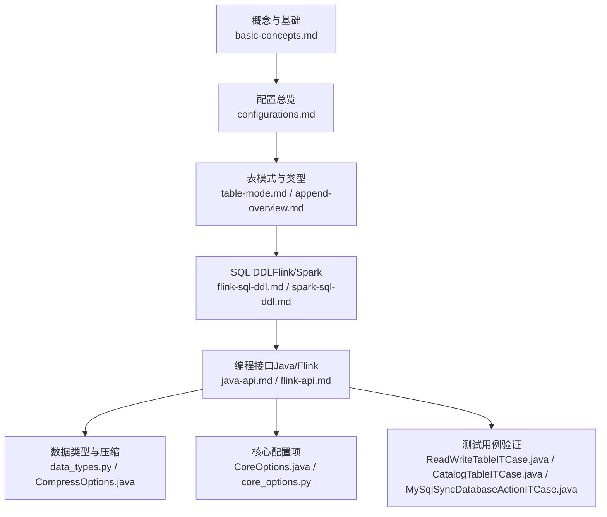
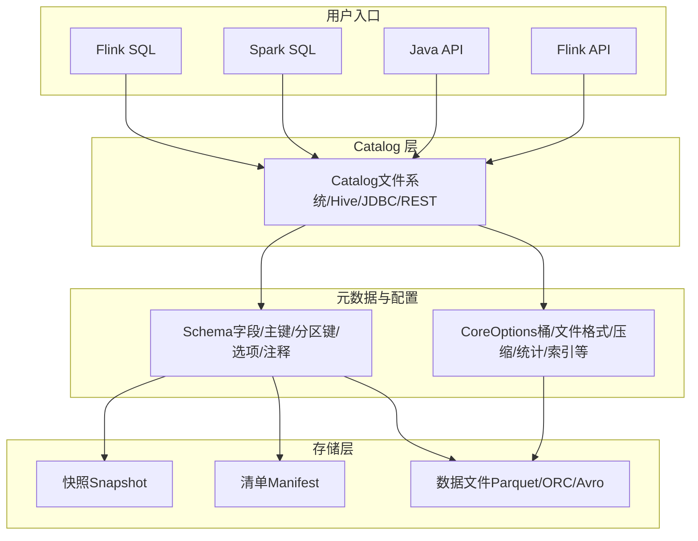
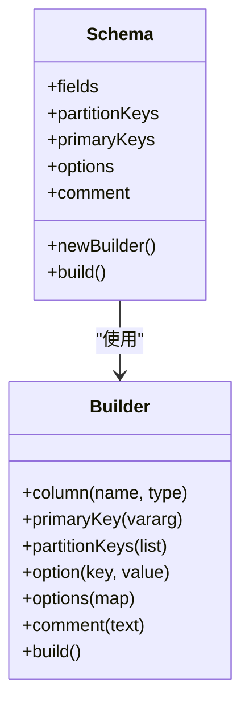
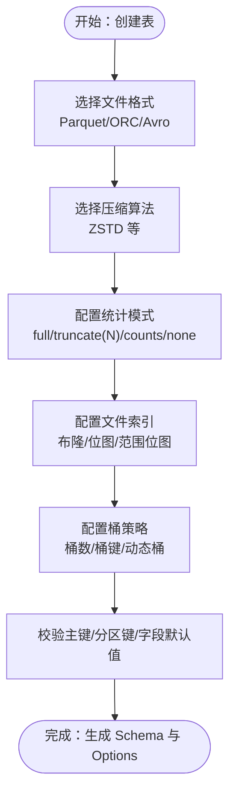
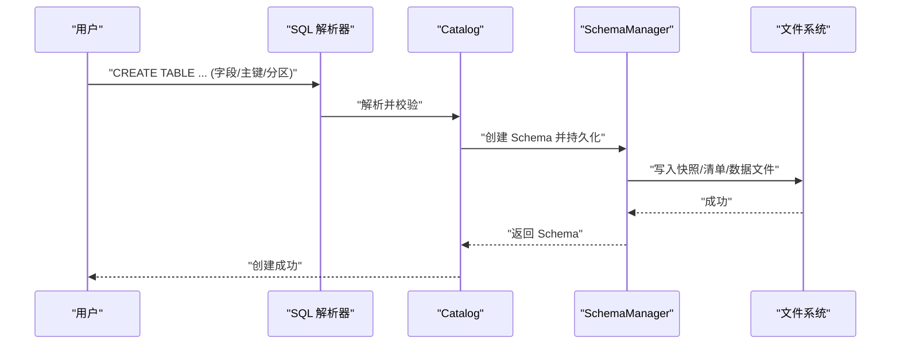
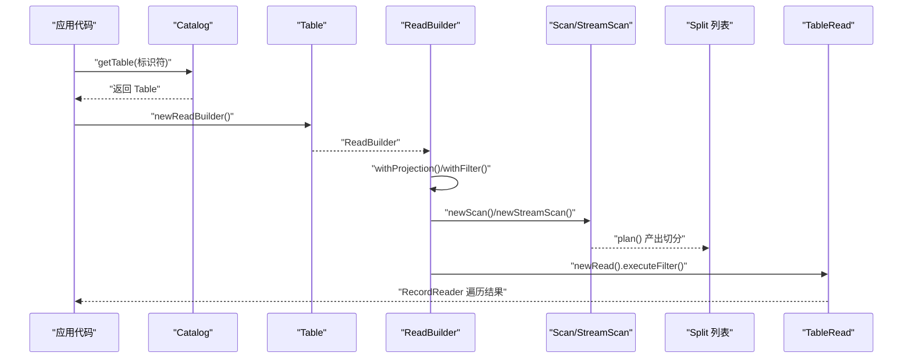
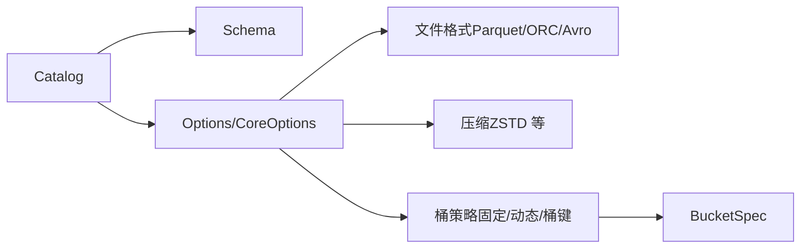

# 表创建和配置

<cite>
**本文引用的文件**
- [basic-concepts.md](file://docs/content/concepts/basic-concepts.md)
- [configurations.md](file://docs/content/maintenance/configurations.md)
- [table-mode.md](file://docs/content/primary-key-table/table-mode.md)
- [append-overview.md](file://docs/content/append-table/overview.md)
- [flink-sql-ddl.md](file://docs/content/flink/sql-ddl.md)
- [spark-sql-ddl.md](file://docs/content/spark/sql-ddl.md)
- [java-api.md](file://docs/content/program-api/java-api.md)
- [flink-api.md](file://docs/content/program-api/flink-api.md)
- [Schema.java](file://paimon-api/src/main/java/org/apache/paimon/schema/Schema.java)
- [CompressOptions.java](file://paimon-api/src/main/java/org/apache/paimon/compression/CompressOptions.java)
- [CoreOptions.java](file://paimon-api/src/main/java/org/apache/paimon/CoreOptions.java)
- [BucketSpec.java](file://paimon-core/src/main/java/org/apache/paimon/table/BucketSpec.java)
- [OrcFileFormat.java](file://paimon-format/src/main/java/org/apache/paimon/format/orc/OrcFileFormat.java)
- [ReadWriteTableITCase.java](file://paimon-flink/paimon-flink-common/src/test/java/org/apache/paimon/flink/ReadWriteTableITCase.java)
- [CatalogTableITCase.java](file://paimon-flink/paimon-flink-common/src/test/java/org/apache/paimon/flink/CatalogTableITCase.java)
- [MySqlSyncDatabaseActionITCase.java](file://paimon-flink/paimon-flink-cdc/src/test/java/org/apache/paimon/flink/action/cdc/mysql/MySqlSyncDatabaseActionITCase.java)
- [core_options.py](file://paimon-python/pypaimon/common/options/core_options.py)
- [data_types.py](file://paimon-python/pypaimon/schema/data_types.py)
</cite>

## 目录
1. [引言](#引言)
2. [项目结构](#项目结构)
3. [核心组件](#核心组件)
4. [架构总览](#架构总览)
5. [详细组件分析](#详细组件分析)
6. [依赖分析](#依赖分析)
7. [性能考虑](#性能考虑)
8. [故障排查指南](#故障排查指南)
9. [结论](#结论)
10. [附录](#附录)

## 引言
本文件系统性阐述 Apache Paimon 的“表创建与配置”能力，覆盖以下关键主题：
- 表结构定义：字段类型、主键、分区键、默认值、注释等
- 表配置选项：桶数量、桶键、文件格式、压缩算法、统计模式、索引等
- 不同表类型：追加表（Append Table）与键值表（Primary Key Table）的创建差异与适用场景
- 最佳实践与常见配置示例：如何平衡写入吞吐、读取性能与存储成本
- 性能影响与优化建议：基于表模式、桶策略、文件格式与压缩策略
- 完整 SQL 语法示例与编程接口使用方法：Flink SQL、Spark SQL、Java API、Flink DataStream API

## 项目结构
围绕“表创建与配置”，本文档涉及以下知识域与文件：
- 概念与基础：文件布局、快照、清单、数据文件、分区、一致性保证
- 配置总览：核心配置项、引擎适配配置、格式与索引配置
- 表模式与类型：追加表概览、键值表模式（MOR/COW/MOW）
- SQL DDL：Flink/Spark 中的 Catalog 与 Table 创建语法
- 编程接口：Java API、Flink API 的表创建与读写流程
- 数据类型与压缩：字段类型映射、压缩选项默认值
- 测试用例：验证主键、分区键、表选项在创建时的行为

**图表来源**
- [basic-concepts.md:29-76](file://docs/content/concepts/basic-concepts.md#L29-L76)
- [configurations.md:27-92](file://docs/content/maintenance/configurations.md#L27-L92)
- [table-mode.md:27-117](file://docs/content/primary-key-table/table-mode.md#L27-L117)
- [append-overview.md:27-204](file://docs/content/append-table/overview.md#L27-L204)
- [flink-sql-ddl.md:153-319](file://docs/content/flink/sql-ddl.md#L153-L319)
- [spark-sql-ddl.md:167-370](file://docs/content/spark/sql-ddl.md#L167-L370)
- [java-api.md:84-140](file://docs/content/program-api/java-api.md#L84-L140)
- [flink-api.md:63-172](file://docs/content/program-api/flink-api.md#L63-L172)
- [data_types.py:212-388](file://paimon-python/pypaimon/schema/data_types.py#L212-L388)
- [CompressOptions.java:37-76](file://paimon-api/src/main/java/org/apache/paimon/compression/CompressOptions.java#L37-L76)
- [CoreOptions.java:838-854](file://paimon-api/src/main/java/org/apache/paimon/CoreOptions.java#L838-L854)
- [ReadWriteTableITCase.java:1519-1541](file://paimon-flink/paimon-flink-common/src/test/java/org/apache/paimon/flink/ReadWriteTableITCase.java#L1519-L1541)
- [CatalogTableITCase.java:413-423](file://paimon-flink/paimon-flink-common/src/test/java/org/apache/paimon/flink/CatalogTableITCase.java#L413-L423)
- [MySqlSyncDatabaseActionITCase.java:1379-1399](file://paimon-flink/paimon-flink-cdc/src/test/java/org/apache/paimon/flink/action/cdc/mysql/MySqlSyncDatabaseActionITCase.java#L1379-L1399)

**章节来源**
- [basic-concepts.md:29-76](file://docs/content/concepts/basic-concepts.md#L29-L76)
- [configurations.md:27-92](file://docs/content/maintenance/configurations.md#L27-L92)

## 核心组件
- 表结构定义与构建器
  - 使用 Schema 构建器声明字段、主键、分区键、选项与注释；支持链式配置与不可变 Schema 实例
  - 字段类型通过数据类型模块定义，支持数组、映射、原子类型等
- 表配置选项
  - 桶策略：桶数、桶键、动态桶目标行数
  - 文件格式：Parquet（默认）、ORC、Avro 等
  - 压缩算法：ZSTD 等，默认压缩级别
  - 统计模式：全量、截断、仅空值计数、禁用
  - 其他：预合并小文件、删除向量、分层压缩比率等
- 表类型与模式
  - 追加表：无主键，适合批量与流式写入，支持聚合下推、文件索引加速
  - 键值表：支持主键，提供多种写入/读取模式（MOR/COW/MOW），权衡写放大与读性能
- 编程接口
  - Java API：Catalog 创建、表创建、读写扫描、批流处理
  - Flink API：通过 DataStream 与 Table API 写入/读取 Paimon 表

**章节来源**
- [Schema.java:268-390](file://paimon-api/src/main/java/org/apache/paimon/schema/Schema.java#L268-L390)
- [data_types.py:212-388](file://paimon-python/pypaimon/schema/data_types.py#L212-L388)
- [CoreOptions.java:838-854](file://paimon-api/src/main/java/org/apache/paimon/CoreOptions.java#L838-L854)
- [append-overview.md:27-204](file://docs/content/append-table/overview.md#L27-L204)
- [table-mode.md:27-117](file://docs/content/primary-key-table/table-mode.md#L27-L117)
- [java-api.md:84-140](file://docs/content/program-api/java-api.md#L84-L140)
- [flink-api.md:63-172](file://docs/content/program-api/flink-api.md#L63-L172)

## 架构总览
下图展示从“表创建”到“运行时读写”的关键路径：SQL/编程接口 -> Catalog -> Schema/Options -> 文件存储（快照/清单/数据文件）。

**图表来源**
- [flink-sql-ddl.md:153-187](file://docs/content/flink/sql-ddl.md#L153-L187)
- [spark-sql-ddl.md:167-201](file://docs/content/spark/sql-ddl.md#L167-L201)
- [java-api.md:84-116](file://docs/content/program-api/java-api.md#L84-L116)
- [basic-concepts.md:35-58](file://docs/content/concepts/basic-concepts.md#L35-L58)
- [configurations.md:27-92](file://docs/content/maintenance/configurations.md#L27-L92)

## 详细组件分析

### 表结构定义与字段类型
- 字段与主键/分区键
  - 通过 Schema.Builder 声明列、主键、分区键与选项
  - 主键约束要求非空且唯一标识一行
  - 分区键用于按列值拆分数据，提升查询与维护效率
- 字段类型
  - 支持原子类型、数组、映射等复杂类型
  - 类型解析与序列化/反序列化由数据类型模块负责
- 默认值与注释
  - 可为字段设置默认值（分区键与主键字段不支持）
  - 注释用于增强可读性与文档化

**图表来源**
- [Schema.java:268-390](file://paimon-api/src/main/java/org/apache/paimon/schema/Schema.java#L268-L390)
- [data_types.py:212-388](file://paimon-python/pypaimon/schema/data_types.py#L212-L388)

**章节来源**
- [Schema.java:268-390](file://paimon-api/src/main/java/org/apache/paimon/schema/Schema.java#L268-L390)
- [data_types.py:212-388](file://paimon-python/pypaimon/schema/data_types.py#L212-L388)

### 表配置选项与参数
- 桶与分区
  - 桶数（固定/动态）、桶键、动态桶目标行数
  - 动态桶模式下，根据目标行数自动扩容
- 文件格式与压缩
  - 默认 Parquet；可选 ORC、Avro
  - 压缩算法与级别（默认 ZSTD，级别 1）
- 统计与索引
  - 统计模式：full、truncate(N)、counts、none
  - 文件索引：布隆过滤、位图、范围位图
- 其他
  - 预合并小文件、删除向量、分层压缩比率（高峰/低谷时段）

**图表来源**
- [configurations.md:27-92](file://docs/content/maintenance/configurations.md#L27-L92)
- [CoreOptions.java:838-854](file://paimon-api/src/main/java/org/apache/paimon/CoreOptions.java#L838-L854)
- [CompressOptions.java:37-76](file://paimon-api/src/main/java/org/apache/paimon/compression/CompressOptions.java#L37-L76)
- [append-overview.md:135-188](file://docs/content/append-table/overview.md#L135-L188)

**章节来源**
- [configurations.md:27-92](file://docs/content/maintenance/configurations.md#L27-L92)
- [CoreOptions.java:838-854](file://paimon-api/src/main/java/org/apache/paimon/CoreOptions.java#L838-L854)
- [CompressOptions.java:37-76](file://paimon-api/src/main/java/org/apache/paimon/compression/CompressOptions.java#L37-L76)
- [append-overview.md:135-188](file://docs/content/append-table/overview.md#L135-L188)

### 不同表类型的创建方法
- 追加表（Append Table）
  - 无主键，适合批量与流式写入
  - 支持聚合下推、文件索引加速、小文件预合并
  - 示例见 Flink/Spark SQL DDL
- 键值表（Primary Key Table）
  - 有主键，支持 upsert、多模式（MOR/COW/MOW）
  - 读写性能与写放大权衡，推荐 MOW 或 MOR 读优化
- 外部表（Spark Hive Catalog）
  - 指定 location 即为外部表，删除仅移除元数据

**图表来源**
- [flink-sql-ddl.md:153-187](file://docs/content/flink/sql-ddl.md#L153-L187)
- [spark-sql-ddl.md:167-201](file://docs/content/spark/sql-ddl.md#L167-L201)
- [java-api.md:84-116](file://docs/content/program-api/java-api.md#L84-L116)

**章节来源**
- [append-overview.md:27-204](file://docs/content/append-table/overview.md#L27-L204)
- [table-mode.md:27-117](file://docs/content/primary-key-table/table-mode.md#L27-L117)
- [flink-sql-ddl.md:153-187](file://docs/content/flink/sql-ddl.md#L153-L187)
- [spark-sql-ddl.md:167-201](file://docs/content/spark/sql-ddl.md#L167-L201)

### SQL 语法示例与最佳实践
- Flink SQL
  - 创建 Catalog 与表、分区表、带主键表、CTAS、LIKE
  - 统计模式、字段默认值、分区过期时间等
- Spark SQL
  - Catalog 创建、外部表、TBLPROPERTIES、CTAS、标签管理
- 最佳实践
  - 追加表：合理设置分区键，启用文件索引与预合并小文件
  - 键值表：根据查询特征选择模式（MOR/COW/MOW），控制桶大小与删除向量

**章节来源**
- [flink-sql-ddl.md:153-319](file://docs/content/flink/sql-ddl.md#L153-L319)
- [spark-sql-ddl.md:167-370](file://docs/content/spark/sql-ddl.md#L167-L370)
- [append-overview.md:135-204](file://docs/content/append-table/overview.md#L135-L204)
- [table-mode.md:45-117](file://docs/content/primary-key-table/table-mode.md#L45-L117)

### 编程接口使用方法
- Java API
  - Catalog 创建（文件系统/Hive/JDBC/REST）
  - 表创建（Schema + Options）
  - 批/流读写（扫描计划、切分、提交/中止）
- Flink API
  - DataStream 与 Table API 集成
  - Sink/Source 构建器配置并执行

**图表来源**
- [java-api.md:142-202](file://docs/content/program-api/java-api.md#L142-L202)
- [java-api.md:256-319](file://docs/content/program-api/java-api.md#L256-L319)

**章节来源**
- [java-api.md:84-140](file://docs/content/program-api/java-api.md#L84-L140)
- [java-api.md:142-202](file://docs/content/program-api/java-api.md#L142-L202)
- [java-api.md:256-319](file://docs/content/program-api/java-api.md#L256-L319)
- [flink-api.md:63-172](file://docs/content/program-api/flink-api.md#L63-L172)

## 依赖分析
- 组件耦合
  - Catalog 依赖 Schema 与 Options；Schema 负责结构定义；Options 负责行为配置
  - 文件格式（Parquet/ORC/Avro）与压缩（ZSTD）在 CoreOptions 中统一管理
  - 桶策略（固定/动态）与桶键在 CoreOptions 与 BucketSpec 中体现
- 外部依赖
  - Hadoop 环境（依赖 Hadoop 类路径或打包）
  - Hive/MySQL/PostgreSQL 等元数据存储（按 Catalog 类型而定）

**图表来源**
- [CoreOptions.java:838-854](file://paimon-api/src/main/java/org/apache/paimon/CoreOptions.java#L838-L854)
- [BucketSpec.java:42-65](file://paimon-core/src/main/java/org/apache/paimon/table/BucketSpec.java#L42-L65)
- [OrcFileFormat.java:203-216](file://paimon-format/src/main/java/org/apache/paimon/format/orc/OrcFileFormat.java#L203-L216)

**章节来源**
- [CoreOptions.java:838-854](file://paimon-api/src/main/java/org/apache/paimon/CoreOptions.java#L838-L854)
- [BucketSpec.java:42-65](file://paimon-core/src/main/java/org/apache/paimon/table/BucketSpec.java#L42-L65)
- [OrcFileFormat.java:203-216](file://paimon-format/src/main/java/org/apache/paimon/format/orc/OrcFileFormat.java#L203-L216)

## 性能考虑
- 写入吞吐
  - 追加表：预合并小文件减少小文件数量，降低存储压力
  - 键值表：MOR/COW/MOW 模式选择需权衡写放大与读性能
- 读取性能
  - 启用文件索引（布隆/位图/范围位图）与统计模式（truncate/counts/full）
  - 控制桶内数据规模（建议 200MB~1GB），避免过多小文件
- 存储成本
  - 合理选择文件格式与压缩算法；统计模式 none 时可显著减小清单体积
- 并发与一致性
  - 快照隔离保障并发写入不丢失；跨分区 upsert 需注意桶与分区关系

**章节来源**
- [append-overview.md:95-122](file://docs/content/append-table/overview.md#L95-L122)
- [table-mode.md:45-117](file://docs/content/primary-key-table/table-mode.md#L45-L117)
- [configurations.md:27-92](file://docs/content/maintenance/configurations.md#L27-L92)

## 故障排查指南
- 数据库不存在导致创建失败
  - 在 Catalog 创建表前确保数据库存在，否则抛出异常
- 主键/分区键配置错误
  - 主键字段不可为空；分区键与主键需一致或满足 upsert 要求
- 字段默认值限制
  - 分区键与主键字段不允许设置默认值
- Hive 元数据同步
  - 新建分区默认不同步至 Hive，可通过属性开启同步
- Python/SDK 版本兼容
  - stats-dense-store 关闭时，读端 SDK 版本需满足最低版本要求

**章节来源**
- [ReadWriteTableITCase.java:1519-1541](file://paimon-flink/paimon-flink-common/src/test/java/org/apache/paimon/flink/ReadWriteTableITCase.java#L1519-L1541)
- [CatalogTableITCase.java:413-423](file://paimon-flink/paimon-flink-common/src/test/java/org/apache/paimon/flink/CatalogTableITCase.java#L413-L423)
- [MySqlSyncDatabaseActionITCase.java:1379-1399](file://paimon-flink/paimon-flink-cdc/src/test/java/org/apache/paimon/flink/action/cdc/mysql/MySqlSyncDatabaseActionITCase.java#L1379-L1399)
- [flink-sql-ddl.md:100-118](file://docs/content/flink/sql-ddl.md#L100-L118)

## 结论
- 明确表结构与配置是 Paimon 表高效运行的基础：合理的字段类型、主键/分区键、桶策略与文件格式/压缩组合，能显著提升写入与读取性能
- 追加表与键值表各有适用场景：前者强调易用与批量/流式写入，后者强调更新与查询性能
- 通过 SQL 与编程接口均可完成表创建与配置，建议优先使用计算引擎 SQL，必要时采用 Java/Flink API 进行定制化集成

## 附录
- 常用配置速查
  - 桶：bucket、bucket-key、dynamic-bucket.target-row-num
  - 文件格式：file.format（parquet/orc/avro）
  - 压缩：file.compression（zstd 等）、file.compression.zstd-level
  - 统计：metadata.stats-mode、fields.{field}.stats-mode
  - 索引：file-index.bloom-filter.columns、file-index.bitmap.columns、file-index.range-bitmap.columns
  - 小文件：precommit-compact、write-only
  - 删除向量：deletion-vectors.enabled
- SQL 示例路径
  - Flink：创建 Catalog 与表、分区表、带主键表、CTAS、LIKE
  - Spark：创建 Catalog 与表、外部表、TBLPROPERTIES、CTAS、标签管理
- 编程接口路径
  - Java API：Catalog 创建、表创建、读写扫描
  - Flink API：DataStream/Table API 集成

**章节来源**
- [flink-sql-ddl.md:153-319](file://docs/content/flink/sql-ddl.md#L153-L319)
- [spark-sql-ddl.md:167-370](file://docs/content/spark/sql-ddl.md#L167-L370)
- [java-api.md:84-140](file://docs/content/program-api/java-api.md#L84-L140)
- [flink-api.md:63-172](file://docs/content/program-api/flink-api.md#L63-L172)