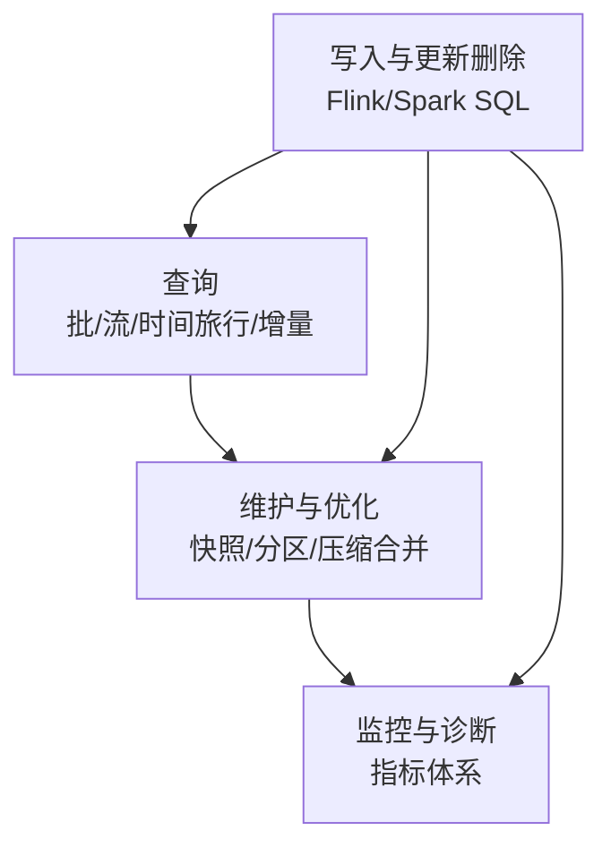
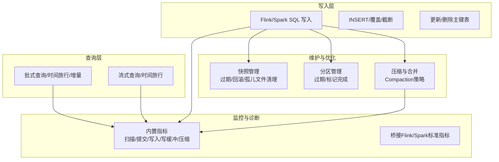
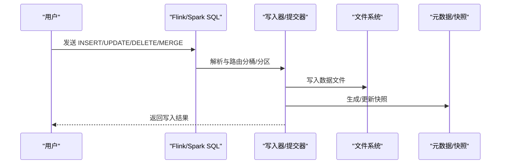
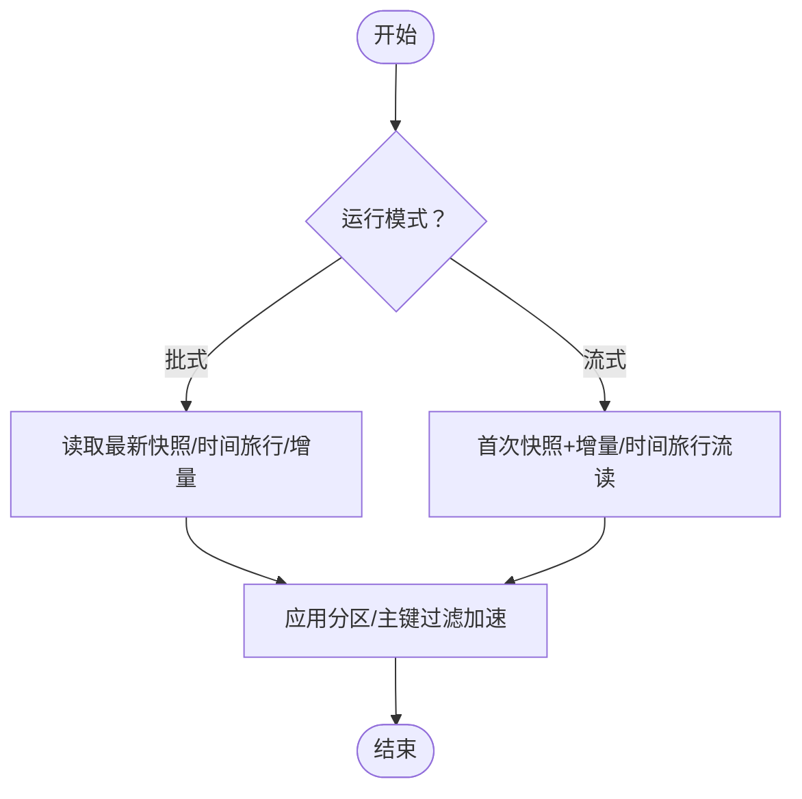
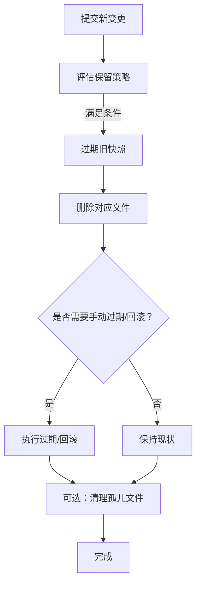
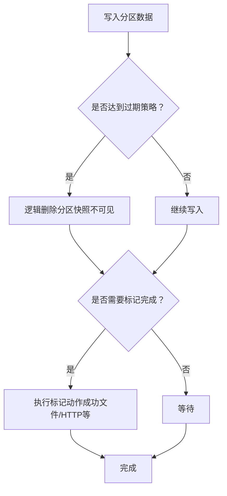
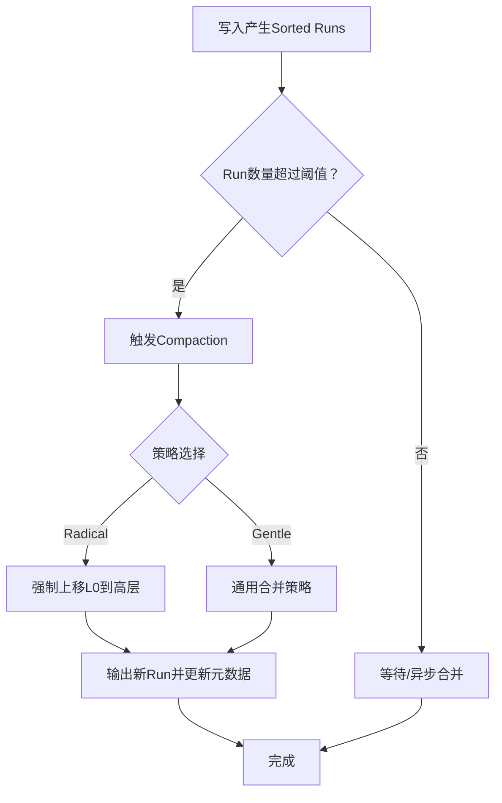
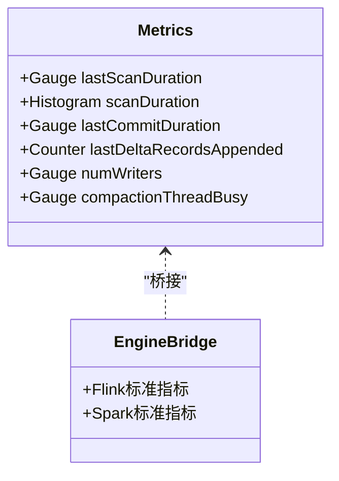
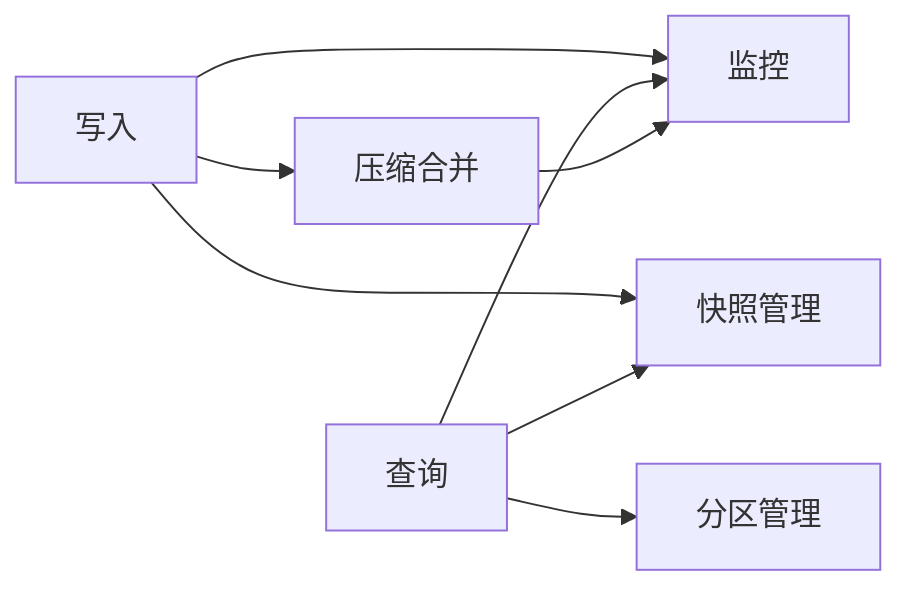

# 表操作

<cite>
**本文引用的文件**   
- [docs/content/maintenance/_index.md](file://docs/content/maintenance/_index.md)
- [docs/content/maintenance/configurations.md](file://docs/content/maintenance/configurations.md)
- [docs/content/maintenance/write-performance.md](file://docs/content/maintenance/write-performance.md)
- [docs/content/maintenance/metrics.md](file://docs/content/maintenance/metrics.md)
- [docs/content/maintenance/manage-partitions.md](file://docs/content/maintenance/manage-partitions.md)
- [docs/content/maintenance/manage-snapshots.md](file://docs/content/maintenance/manage-snapshots.md)
- [docs/content/primary-key-table/compaction.md](file://docs/content/primary-key-table/compaction.md)
- [docs/content/primary-key-table/query-performance.md](file://docs/content/primary-key-table/query-performance.md)
- [docs/content/primary-key-table/data-distribution.md](file://docs/content/primary-key-table/data-distribution.md)
- [docs/content/flink/sql-write.md](file://docs/content/flink/sql-write.md)
- [docs/content/spark/sql-write.md](file://docs/content/spark/sql-write.md)
- [docs/content/flink/sql-query.md](file://docs/content/flink/sql-query.md)
- [docs/content/spark/sql-query.md](file://docs/content/spark/sql-query.md)
- [docs/content/primary-key-table/overview.md](file://docs/content/primary-key-table/overview.md)
</cite>

## 目录
1. [简介](#简介)
2. [项目结构](#项目结构)
3. [核心组件](#核心组件)
4. [架构总览](#架构总览)
5. [详细组件分析](#详细组件分析)
6. [依赖关系分析](#依赖关系分析)
7. [性能考量](#性能考量)
8. [故障排查指南](#故障排查指南)
9. [结论](#结论)
10. [附录](#附录)

## 简介
本章节面向Apache Paimon的表操作能力，系统性阐述数据写入、查询、更新、删除等基础操作；表的维护与优化（数据清理、统计信息更新、文件整理、快照管理、分区管理）；查询与写入性能优化策略；以及监控与诊断方法。文档以仓库中的官方文档为依据，结合图示帮助读者快速理解并正确使用Paimon表操作。

## 项目结构
围绕“表操作”的知识主要分布在以下文档主题：
- 写入与更新删除：Flink/Spark SQL写入、覆盖、截断、更新、删除、合并等
- 查询：批式与流式查询、时间旅行、增量读取、并行度控制
- 维护与优化：写入性能、指标监控、快照管理、分区管理、压缩与合并（Compaction）
- 配置参考：核心选项、引擎适配器配置项

[本图为概念性结构示意，不直接映射具体源码文件]

## 核心组件
- 写入组件：支持INSERT/INSERT OVERWRITE、批量与流式模式；支持聚簇（Append表）、覆盖与截断、更新与删除（主键表）
- 查询组件：支持批式全量/时间旅行/增量；流式首次快照+增量；并行度推断与自定义
- 维护组件：快照过期与回滚、孤儿文件清理、分区过期与标记完成
- 优化组件：Compaction策略（通用/查找/全量）、异步Compaction、分桶重缩放
- 指标组件：扫描/提交/写入/写缓冲/压缩等内置指标，桥接到Flink/Spark标准指标

**章节来源**
- [docs/content/flink/sql-write.md:1-316](file://docs/content/flink/sql-write.md#L1-L316)
- [docs/content/spark/sql-write.md:1-299](file://docs/content/spark/sql-write.md#L1-L299)
- [docs/content/flink/sql-query.md:1-308](file://docs/content/flink/sql-query.md#L1-L308)
- [docs/content/spark/sql-query.md:1-170](file://docs/content/spark/sql-query.md#L1-L170)
- [docs/content/maintenance/manage-snapshots.md:1-402](file://docs/content/maintenance/manage-snapshots.md#L1-L402)
- [docs/content/maintenance/manage-partitions.md:1-171](file://docs/content/maintenance/manage-partitions.md#L1-L171)
- [docs/content/primary-key-table/compaction.md:1-198](file://docs/content/primary-key-table/compaction.md#L1-L198)
- [docs/content/maintenance/metrics.md:1-465](file://docs/content/maintenance/metrics.md#L1-L465)

## 架构总览
下图展示从“写入/查询”到“维护与优化”的整体流程，以及“监控与诊断”的贯穿作用。

**图表来源**
- [docs/content/flink/sql-write.md:1-316](file://docs/content/flink/sql-write.md#L1-L316)
- [docs/content/spark/sql-write.md:1-299](file://docs/content/spark/sql-write.md#L1-L299)
- [docs/content/flink/sql-query.md:1-308](file://docs/content/flink/sql-query.md#L1-L308)
- [docs/content/spark/sql-query.md:1-170](file://docs/content/spark/sql-query.md#L1-L170)
- [docs/content/maintenance/manage-snapshots.md:1-402](file://docs/content/maintenance/manage-snapshots.md#L1-L402)
- [docs/content/maintenance/manage-partitions.md:1-171](file://docs/content/maintenance/manage-partitions.md#L1-L171)
- [docs/content/primary-key-table/compaction.md:1-198](file://docs/content/primary-key-table/compaction.md#L1-L198)
- [docs/content/maintenance/metrics.md:1-465](file://docs/content/maintenance/metrics.md#L1-L465)

## 详细组件分析

### 写入与更新删除（Flink/Spark）
- 基础写入
  - INSERT INTO/INSERT OVERWRITE：支持批/流；动态/静态覆盖；聚簇（Append表，批模式）
  - TRUNCATE/清空分区：通过OVERWRITE插入空集或专用作业
- 更新与删除（主键表）
  - UPDATE/DELETE：要求主键表、特定MergeEngine支持；不支持流式删除
- 合并写入（Spark）
  - MERGE INTO：基于条件的插入/更新/删除一体化
- 写入性能与内存
  - 写缓冲、溢写、分桶数、Sink并行度、本地合并、文件格式与压缩、提交内存、Committer细粒度资源管理

**图表来源**
- [docs/content/flink/sql-write.md:1-316](file://docs/content/flink/sql-write.md#L1-L316)
- [docs/content/spark/sql-write.md:1-299](file://docs/content/spark/sql-write.md#L1-L299)

**章节来源**
- [docs/content/flink/sql-write.md:1-316](file://docs/content/flink/sql-write.md#L1-L316)
- [docs/content/spark/sql-write.md:1-299](file://docs/content/spark/sql-write.md#L1-L299)
- [docs/content/maintenance/write-performance.md:1-164](file://docs/content/maintenance/write-performance.md#L1-L164)

### 查询（批式/流式/时间旅行/增量）
- 批式查询
  - 默认读取最新快照；支持时间旅行（按快照ID/时间戳/标签/Watermark）
  - 增量读取：指定起止快照/时间戳/自动标签；可强制扫描变更日志或新增文件
- 流式查询
  - 首次启动可选择仅读取最新变更（latest模式）
  - 支持时间旅行流读（从某快照开始持续读取）
  - 并行度推断：默认按切分数量（批）或桶数量（流），可手动指定或禁用推断
- 查询优化
  - 强烈建议使用分区与主键过滤；复合主键建议左前缀匹配
  - Spark可读取隐藏元数据列辅助定位

**图表来源**
- [docs/content/flink/sql-query.md:1-308](file://docs/content/flink/sql-query.md#L1-L308)
- [docs/content/spark/sql-query.md:1-170](file://docs/content/spark/sql-query.md#L1-L170)

**章节来源**
- [docs/content/flink/sql-query.md:1-308](file://docs/content/flink/sql-query.md#L1-L308)
- [docs/content/spark/sql-query.md:1-170](file://docs/content/spark/sql-query.md#L1-L170)
- [docs/content/primary-key-table/query-performance.md:1-105](file://docs/content/primary-key-table/query-performance.md#L1-L105)

### 快照管理（清理、回滚、孤儿文件）
- 过期策略
  - 时间保留、最小/最大保留数量、执行模式（同步/异步）、单次过期上限
  - 示例表格演示在不同条件下快照过期行为
- 手动过期与回滚
  - 提供多引擎调用方式（SQL/动作作业/Java API）
- 孤儿文件清理
  - 物理删除不再被快照使用的文件，支持时间阈值与并行度控制

**图表来源**
- [docs/content/maintenance/manage-snapshots.md:1-402](file://docs/content/maintenance/manage-snapshots.md#L1-L402)

**章节来源**
- [docs/content/maintenance/manage-snapshots.md:1-402](file://docs/content/maintenance/manage-snapshots.md#L1-L402)

### 分区管理（过期与标记完成）
- 过期策略
  - 值时间/更新时间两种策略；支持时间格式化与模式提取
  - 可配置检查间隔与过期时间
- 标记完成
  - 支持成功文件、done分区、事件标记、HTTP上报等多种动作
  - 支持水印触发更准确的分区完成时机

**图表来源**
- [docs/content/maintenance/manage-partitions.md:1-171](file://docs/content/maintenance/manage-partitions.md#L1-L171)

**章节来源**
- [docs/content/maintenance/manage-partitions.md:1-171](file://docs/content/maintenance/manage-partitions.md#L1-L171)

### 压缩与合并（Compaction）
- 目标与限制
  - 控制LSM树Sorted Runs数量，避免查询时全量合并导致性能下降或OOM
  - 同一分区同一时刻仅允许一个Compaction作业，避免冲突
- 策略与配置
  - 异步Compaction：降低峰值写入阻塞
  - 专用Compaction作业：多写入场景分离冲突
  - 记录级过期：在Compaction中按时间字段过期记录
  - 全量Compaction：自动触发或定期优化
  - 查找Compaction：Radical/Gentle策略，平衡资源与新鲜度
  - 关键参数：Sorted Runs触发/停止阈值、排序溢写阈值等

**图表来源**
- [docs/content/primary-key-table/compaction.md:1-198](file://docs/content/primary-key-table/compaction.md#L1-L198)

**章节来源**
- [docs/content/primary-key-table/compaction.md:1-198](file://docs/content/primary-key-table/compaction.md#L1-L198)

### 数据分布与分桶
- 固定分桶：按哈希确定桶，适合稳定写入；重缩放需离线处理
- 动态分桶：默认模式，随数据到达自动扩展；单写入作业限制
- 延迟分桶：先写入延迟目录，再通过Compaction落位；可后续重缩放
- 跨分区更新：推荐动态分桶；可通过索引TTL降低初始化成本

**章节来源**
- [docs/content/primary-key-table/data-distribution.md:1-118](file://docs/content/primary-key-table/data-distribution.md#L1-L118)
- [docs/content/primary-key-table/overview.md:1-62](file://docs/content/primary-key-table/overview.md#L1-L62)

### 指标与监控（内置与标准）
- 内置指标类别：Gauge/Counter/Histogram
  - 扫描：最近一次扫描耗时、Manifest扫描数、跳过的/结果文件数
  - 提交：最近一次提交耗时、追加/删除/紧凑文件数、快照生成数、记录计数
  - 写入/写缓冲：写者数量、缓冲占用/总量、内存抢占次数
  - 压缩：Level0文件数、线程繁忙度、平均压缩时长、输入/输出文件大小、排序缓冲使用率
- 桥接Flink/Spark标准指标：Source/Sink关键指标（字节/记录吞吐、事件时间滞后等）

**图表来源**
- [docs/content/maintenance/metrics.md:1-465](file://docs/content/maintenance/metrics.md#L1-L465)

**章节来源**
- [docs/content/maintenance/metrics.md:1-465](file://docs/content/maintenance/metrics.md#L1-L465)

## 依赖关系分析
- 写入路径依赖Compaction与快照管理，以保证文件结构与可见性
- 查询路径依赖快照与分区元数据，时间旅行/增量读取依赖标签/水印/快照ID
- 监控贯穿写入、查询、压缩全过程，用于性能诊断与容量规划

**图表来源**
- [docs/content/maintenance/manage-snapshots.md:1-402](file://docs/content/maintenance/manage-snapshots.md#L1-L402)
- [docs/content/maintenance/manage-partitions.md:1-171](file://docs/content/maintenance/manage-partitions.md#L1-L171)
- [docs/content/primary-key-table/compaction.md:1-198](file://docs/content/primary-key-table/compaction.md#L1-L198)
- [docs/content/maintenance/metrics.md:1-465](file://docs/content/maintenance/metrics.md#L1-L465)

**章节来源**
- [docs/content/maintenance/manage-snapshots.md:1-402](file://docs/content/maintenance/manage-snapshots.md#L1-L402)
- [docs/content/maintenance/manage-partitions.md:1-171](file://docs/content/maintenance/manage-partitions.md#L1-L171)
- [docs/content/primary-key-table/compaction.md:1-198](file://docs/content/primary-key-table/compaction.md#L1-L198)
- [docs/content/maintenance/metrics.md:1-465](file://docs/content/maintenance/metrics.md#L1-L465)

## 性能考量
- 写入性能
  - 增大写缓冲、启用溢写、调整分桶数、合理设置Sink并行度
  - 降低Changelog Producer与Delta提交频率对写入影响
  - 异步Compaction缓解峰值写入阻塞
- 查询性能
  - 使用分区与主键过滤；复合主键建议左前缀匹配
  - 启用文件索引（布隆/位图/范围位图）加速点查与范围查
  - 读优化表/去向量表在无桶并发限制场景具备更好并发
- 存储与IO
  - 文件格式与压缩级别权衡：行式AVRO提升紧凑性能但分析慢；ZSTD等级越高压缩比越高但读写变慢
  - 控制快照保留策略，避免过多小文件与冗余元数据

**章节来源**
- [docs/content/maintenance/write-performance.md:1-164](file://docs/content/maintenance/write-performance.md#L1-L164)
- [docs/content/primary-key-table/query-performance.md:1-105](file://docs/content/primary-key-table/query-performance.md#L1-L105)
- [docs/content/primary-key-table/compaction.md:1-198](file://docs/content/primary-key-table/compaction.md#L1-L198)

## 故障排查指南
- 写入阻塞/背压
  - 检查Sorted Runs阈值与Compaction策略；必要时开启异步Compaction
  - 降低Changelog Producer与Delta提交频率；增大Checkpoint超时
- OOM风险
  - 减少排序缓冲阈值与溢写缓冲；降低读批大小；关闭或限制字典编码
  - 使用托管内存分配或精细化Committer内存
- 查询慢
  - 确认是否命中分区/主键过滤；为热点列建立文件索引
  - 对于主键表，确认分桶数与数据规模匹配（每桶约200MB-1GB）
- 快照/孤儿文件异常
  - 手动过期或回滚至健康状态；清理孤儿文件
- 分区未及时完成
  - 调整Idle时间、水印模式与标记动作；确保下游消费方能识别完成信号

**章节来源**
- [docs/content/maintenance/write-performance.md:1-164](file://docs/content/maintenance/write-performance.md#L1-L164)
- [docs/content/maintenance/manage-snapshots.md:1-402](file://docs/content/maintenance/manage-snapshots.md#L1-L402)
- [docs/content/maintenance/manage-partitions.md:1-171](file://docs/content/maintenance/manage-partitions.md#L1-L171)
- [docs/content/primary-key-table/compaction.md:1-198](file://docs/content/primary-key-table/compaction.md#L1-L198)

## 结论
Paimon的表操作围绕“写入—维护—查询—优化—监控”形成闭环。通过合理的分桶与Compaction策略、严格的快照与分区管理、以及完善的指标体系，可在高吞吐写入与高效查询之间取得平衡，并为生产环境提供可观测、可治理的数据湖仓能力。

## 附录
- 配置参考
  - 核心选项、Catalog/引擎适配器配置项详见维护章节配置页
- 实操清单
  - 写入：确认分桶数、写缓冲、Sink并行度、文件格式/压缩
  - 查询：优先分区/主键过滤，必要时启用文件索引
  - 维护：设定快照保留策略与过期模式，定期清理孤儿文件
  - 优化：根据负载选择异步/查找/全量Compaction策略
  - 监控：关注扫描/提交/写入/压缩关键指标，结合标准指标定位瓶颈

**章节来源**
- [docs/content/maintenance/configurations.md:1-92](file://docs/content/maintenance/configurations.md#L1-L92)
- [docs/content/maintenance/_index.md:1-26](file://docs/content/maintenance/_index.md#L1-L26)