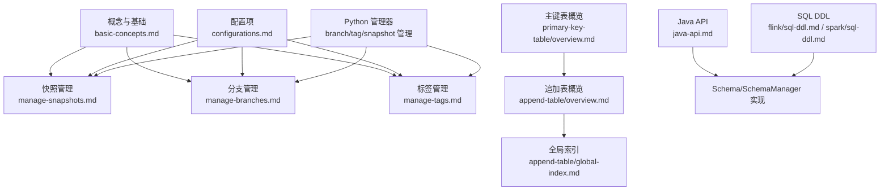
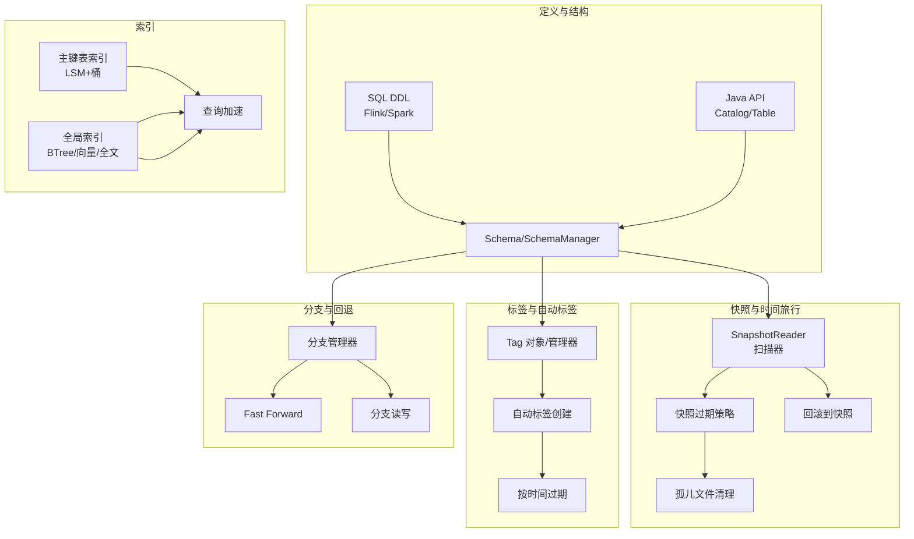
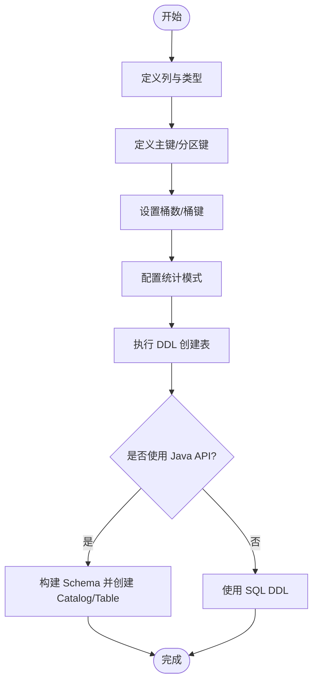
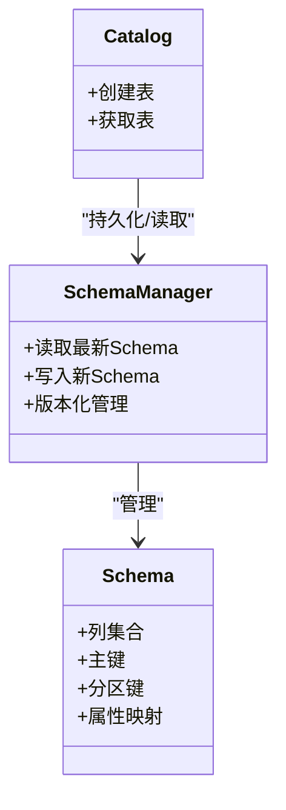
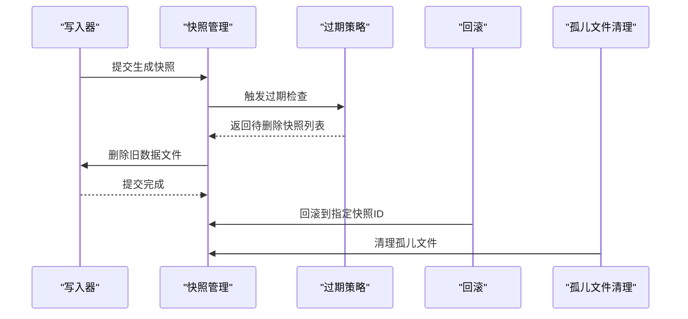
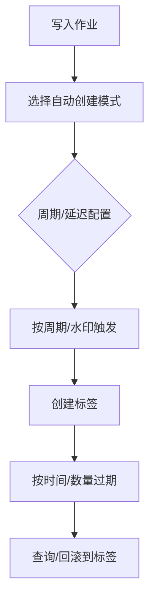
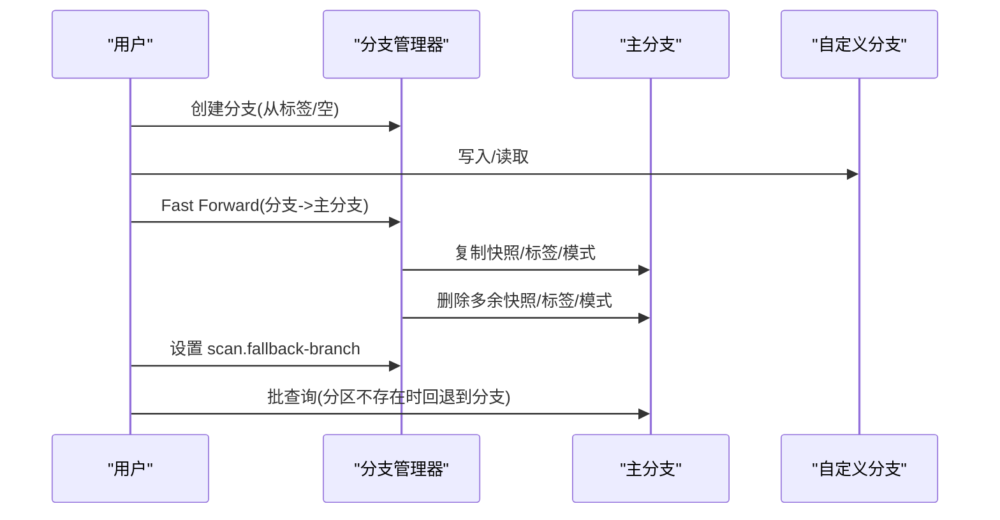
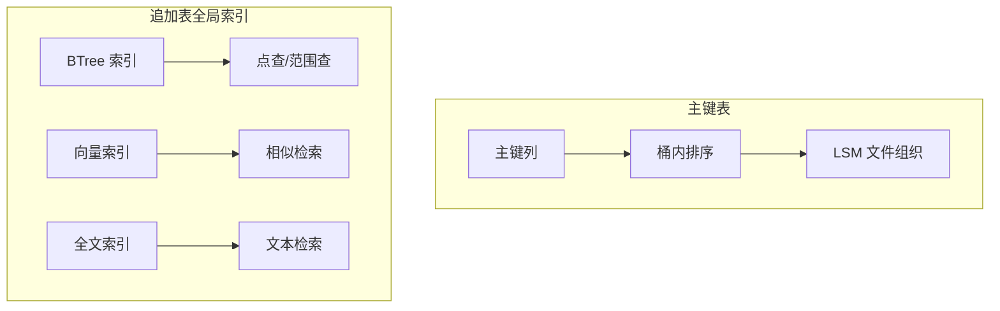
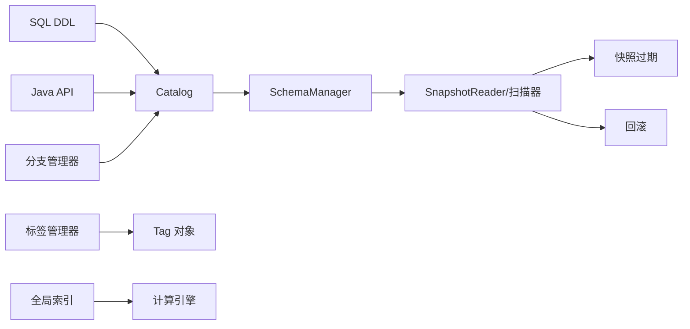

# 表管理

<cite>
**本文引用的文件**
- [basic-concepts.md](file://docs/content/concepts/basic-concepts.md)
- [manage-snapshots.md](file://docs/content/maintenance/manage-snapshots.md)
- [manage-branches.md](file://docs/content/maintenance/manage-branches.md)
- [manage-tags.md](file://docs/content/maintenance/manage-tags.md)
- [overview.md（主键表）](file://docs/content/primary-key-table/overview.md)
- [overview.md（追加表）](file://docs/content/append-table/overview.md)
- [global-index.md（追加表）](file://docs/content/append-table/global-index.md)
- [configurations.md](file://docs/content/maintenance/configurations.md)
- [java-api.md](file://docs/content/program-api/java-api.md)
- [sql-ddl.md（Flink）](file://docs/content/flink/sql-ddl.md)
- [sql-ddl.md（Spark）](file://docs/content/spark/sql-ddl.md)
- [Schema.java](file://paimon-api/src/main/java/org/apache/paimon/schema/Schema.java)
- [SchemaManager.java](file://paimon-core/src/main/java/org/apache/paimon/schema/SchemaManager.java)
- [Tag.java](file://paimon-core/src/main/java/org/apache/paimon/tag/Tag.java)
- [TagAutoCreation.java](file://paimon-core/src/main/java/org/apache/paimon/tag/TagAutoCreation.java)
- [TagAutoManager.java](file://paimon-core/src/main/java/org/apache/paimon/tag/TagAutoManager.java)
- [TagBatchCreation.java](file://paimon-core/src/main/java/org/apache/paimon/tag/TagBatchCreation.java)
- [TagTimeExpire.java](file://paimon-core/src/main/java/org/apache/paimon/tag/TagTimeExpire.java)
- [TagTimeExtractor.java](file://paimon-core/src/main/java/org/apache/paimon/tag/TagTimeExtractor.java)
- [SnapshotLoaderImpl.java](file://paimon-core/src/main/java/org/apache/paimon/tag/SnapshotLoaderImpl.java)
- [SnapshotReader.java](file://paimon-core/src/main/java/org/apache/paimon/table/source/snapshot/SnapshotReader.java)
- [AbstractStartingScanner.java](file://paimon-core/src/main/java/org/apache/paimon/table/source/snapshot/AbstractStartingScanner.java)
- [FullStartingScanner.java](file://paimon-core/src/main/java/org/apache/paimon/table/source/snapshot/FullStartingScanner.java)
- [ContinuousLatestStartingScanner.java](file://paimon-core/src/main/java/org/apache/paimon/table/source/snapshot/ContinuousLatestStartingScanner.java)
- [ChangelogFollowUpScanner.java](file://paimon-core/src/main/java/org/apache/paimon/table/source/snapshot/ChangelogFollowUpScanner.java)
- [DeltFollowUpScanner.java](file://paimon-core/src/main/java/org/apache/paimon/table/source/snapshot/DeltaFollowUpScanner.java)
- [Branch Manager（Python）](file://paimon-python/pypaimon/branch/branch_manager.py)
- [Catalog（Python）](file://paimon-python/pypaimon/catalog/catalog.py)
- [Snapshot Manager（Python）](file://paimon-python/pypaimon/snapshot/snapshot_manager.py)
- [Tag Manager（Python）](file://paimon-python/pypaimon/tag/tag_manager.py)
</cite>

## 目录
1. [简介](#简介)
2. [项目结构](#项目结构)
3. [核心组件](#核心组件)
4. [架构总览](#架构总览)
5. [详细组件分析](#详细组件分析)
6. [依赖关系分析](#依赖关系分析)
7. [性能考量](#性能考量)
8. [故障排查指南](#故障排查指南)
9. [结论](#结论)
10. [附录](#附录)

## 简介
本章节系统化梳理 Apache Paimon 的“表管理”能力，覆盖表创建与结构定义、分区键与桶配置、模式演进（Schema Evolution）、快照生命周期管理、标签与自动标签、分支与回滚、索引（主键索引与全局索引）、以及维护操作（过期清理、孤儿文件清理、统计信息更新等）。文档以仓库内官方文档与关键实现类为依据，结合可视化图示帮助读者从概念到实操全面掌握。

## 项目结构
围绕“表管理”的知识主要分布在以下位置：
- 概念与基础：docs/content/concepts/basic-concepts.md
- 快照管理：docs/content/maintenance/manage-snapshots.md
- 分支管理：docs/content/maintenance/manage-branches.md
- 标签管理：docs/content/maintenance/manage-tags.md
- 主键表概览：docs/content/primary-key-table/overview.md
- 追加表概览：docs/content/append-table/overview.md
- 全局索引（追加表）：docs/content/append-table/global-index.md
- 配置项：docs/content/maintenance/configurations.md
- Java API：docs/content/program-api/java-api.md
- SQL DDL（Flink/Spark）：docs/content/flink/sql-ddl.md、docs/content/spark/sql-ddl.md
- 关键实现类：paimon-api 与 paimon-core 中的 Schema、SchemaManager、Tag、SnapshotReader、分支/标签 Python 管理器等

**图表来源**
- [basic-concepts.md:35-76](file://docs/content/concepts/basic-concepts.md#L35-L76)
- [manage-snapshots.md:27-402](file://docs/content/maintenance/manage-snapshots.md#L27-L402)
- [manage-branches.md:27-291](file://docs/content/maintenance/manage-branches.md#L27-L291)
- [manage-tags.md:27-299](file://docs/content/maintenance/manage-tags.md#L27-L299)
- [overview.md（主键表）:27-62](file://docs/content/primary-key-table/overview.md#L27-L62)
- [overview.md（追加表）:27-204](file://docs/content/append-table/overview.md#L27-L204)
- [global-index.md（追加表）:27-215](file://docs/content/append-table/global-index.md#L27-L215)
- [configurations.md:27-92](file://docs/content/maintenance/configurations.md#L27-L92)
- [java-api.md:51-140](file://docs/content/program-api/java-api.md#L51-L140)
- [sql-ddl.md（Flink）:153-192](file://docs/content/flink/sql-ddl.md#L153-L192)
- [sql-ddl.md（Spark）:167-201](file://docs/content/spark/sql-ddl.md#L167-L201)

**章节来源**
- [basic-concepts.md:27-76](file://docs/content/concepts/basic-concepts.md#L27-L76)
- [configurations.md:27-92](file://docs/content/maintenance/configurations.md#L27-L92)

## 核心组件
- 表结构与模式演进
  - 通过 SQL DDL 定义主键、分区键、桶数、默认值、统计模式等；Java API 提供 Schema 构建与 Catalog 创建能力。
  - 模式演进由 SchemaManager 负责持久化与版本化管理，支持列增删改、类型变更等。
- 快照与时间旅行
  - 快照用于捕获表在某时刻的状态，支持过期策略、手动过期、回滚到指定快照、移除孤儿文件。
- 标签与自动标签
  - 基于快照创建标签，支持按时间或周期自动创建与过期。
- 分支与回退
  - 支持从标签创建分支、快速前移（Fast Forward）、读写分支、批式回退分支。
- 索引
  - 主键表：按主键排序、桶内 LSM 结构提升查询性能。
  - 追加表：全局索引（BTree/向量/全文），支持点查、范围查、相似检索、全文检索。
- 维护操作
  - 快照过期、孤儿文件清理、统计信息更新（统计模式配置）。

**章节来源**
- [sql-ddl.md（Flink）:153-192](file://docs/content/flink/sql-ddl.md#L153-L192)
- [sql-ddl.md（Spark）:167-201](file://docs/content/spark/sql-ddl.md#L167-L201)
- [java-api.md:84-140](file://docs/content/program-api/java-api.md#L84-L140)
- [Schema.java](file://paimon-api/src/main/java/org/apache/paimon/schema/Schema.java)
- [SchemaManager.java](file://paimon-core/src/main/java/org/apache/paimon/schema/SchemaManager.java)
- [manage-snapshots.md:27-402](file://docs/content/maintenance/manage-snapshots.md#L27-L402)
- [manage-tags.md:27-299](file://docs/content/maintenance/manage-tags.md#L27-L299)
- [manage-branches.md:27-291](file://docs/content/maintenance/manage-branches.md#L27-L291)
- [overview.md（主键表）:27-62](file://docs/content/primary-key-table/overview.md#L27-L62)
- [global-index.md（追加表）:27-215](file://docs/content/append-table/global-index.md#L27-L215)

## 架构总览
下图展示“表管理”在概念层与实现层的关键交互：DDL/Java API 构建表结构，SchemaManager 管理模式演进；SnapshotReader/扫描器负责快照读取与增量扫描；Tag 自动/批量创建与过期；分支与标签管理器支撑分支与标签操作；全局索引在追加表上提供高效检索。

**图表来源**
- [basic-concepts.md:35-76](file://docs/content/concepts/basic-concepts.md#L35-L76)
- [manage-snapshots.md:27-402](file://docs/content/maintenance/manage-snapshots.md#L27-L402)
- [manage-tags.md:27-299](file://docs/content/maintenance/manage-tags.md#L27-L299)
- [manage-branches.md:27-291](file://docs/content/maintenance/manage-branches.md#L27-L291)
- [overview.md（主键表）:27-62](file://docs/content/primary-key-table/overview.md#L27-L62)
- [global-index.md（追加表）:27-215](file://docs/content/append-table/global-index.md#L27-L215)
- [SnapshotReader.java](file://paimon-core/src/main/java/org/apache/paimon/table/source/snapshot/SnapshotReader.java)
- [Tag.java](file://paimon-core/src/main/java/org/apache/paimon/tag/Tag.java)
- [TagAutoCreation.java](file://paimon-core/src/main/java/org/apache/paimon/tag/TagAutoCreation.java)
- [TagAutoManager.java](file://paimon-core/src/main/java/org/apache/paimon/tag/TagAutoManager.java)
- [TagBatchCreation.java](file://paimon-core/src/main/java/org/apache/paimon/tag/TagBatchCreation.java)
- [TagTimeExpire.java](file://paimon-core/src/main/java/org/apache/paimon/tag/TagTimeExpire.java)
- [TagTimeExtractor.java](file://paimon-core/src/main/java/org/apache/paimon/tag/TagTimeExtractor.java)
- [SnapshotLoaderImpl.java](file://paimon-core/src/main/java/org/apache/paimon/tag/SnapshotLoaderImpl.java)

## 详细组件分析

### 表创建与结构定义
- 主键表
  - 支持定义主键、分区键、桶数、桶键、合并引擎等；桶决定最小存储单元与最大并行度，推荐每个桶 200MB–1GB。
- 追加表
  - 不具备直接更新/删除能力，适合批处理与流式队列场景；支持预小文件合并、后合并、聚合下推、文件索引、行级操作（MOW）。
- SQL DDL
  - Flink/Spark 均可创建 Catalog 与表，支持主键、分区、TBLPROPERTIES/WITH 选项。
- Java API
  - 通过 Catalog 创建/获取表，使用 Schema 构建表结构，支持批/流读写。

**图表来源**
- [sql-ddl.md（Flink）:153-192](file://docs/content/flink/sql-ddl.md#L153-L192)
- [sql-ddl.md（Spark）:167-201](file://docs/content/spark/sql-ddl.md#L167-L201)
- [java-api.md:84-140](file://docs/content/program-api/java-api.md#L84-L140)
- [overview.md（主键表）:27-62](file://docs/content/primary-key-table/overview.md#L27-L62)
- [overview.md（追加表）:27-204](file://docs/content/append-table/overview.md#L27-L204)

**章节来源**
- [sql-ddl.md（Flink）:153-192](file://docs/content/flink/sql-ddl.md#L153-L192)
- [sql-ddl.md（Spark）:167-201](file://docs/content/spark/sql-ddl.md#L167-L201)
- [java-api.md:84-140](file://docs/content/program-api/java-api.md#L84-L140)
- [overview.md（主键表）:27-62](file://docs/content/primary-key-table/overview.md#L27-L62)
- [overview.md（追加表）:27-204](file://docs/content/append-table/overview.md#L27-L204)

### 模式管理系统（Schema Evolution）
- 模式演进由 SchemaManager 负责，支持列新增、删除、重命名、类型修改等；Schema 作为统一的数据契约。
- Java API 提供 Schema 构建入口，Catalog 创建/获取表时应用 Schema。

**图表来源**
- [Schema.java](file://paimon-api/src/main/java/org/apache/paimon/schema/Schema.java)
- [SchemaManager.java](file://paimon-core/src/main/java/org/apache/paimon/schema/SchemaManager.java)
- [java-api.md:84-140](file://docs/content/program-api/java-api.md#L84-L140)

**章节来源**
- [Schema.java](file://paimon-api/src/main/java/org/apache/paimon/schema/Schema.java)
- [SchemaManager.java](file://paimon-core/src/main/java/org/apache/paimon/schema/SchemaManager.java)
- [java-api.md:84-140](file://docs/content/program-api/java-api.md#L84-L140)

### 快照管理机制
- 快照捕获表在某时刻的状态，支持过期策略（保留时长、最小/最大保留数、异步/同步过期模式、单次最大过期数）。
- 手动过期、回滚到快照、移除孤儿文件（默认仅清理超过 1 天的孤儿文件，可通过 older_than 控制）。

**图表来源**
- [manage-snapshots.md:27-402](file://docs/content/maintenance/manage-snapshots.md#L27-L402)
- [basic-concepts.md:35-76](file://docs/content/concepts/basic-concepts.md#L35-L76)

**章节来源**
- [manage-snapshots.md:27-402](file://docs/content/maintenance/manage-snapshots.md#L27-L402)
- [basic-concepts.md:35-76](file://docs/content/concepts/basic-concepts.md#L35-L76)

### 标签与自动标签
- 标签基于快照创建，支持按时间/周期自动创建与过期；可对标签进行创建、删除、重命名、显示等操作。
- 自动标签支持按进程时间/水印/批次触发，周期可选日/小时/两小时，延迟可配置。

**图表来源**
- [manage-tags.md:27-299](file://docs/content/maintenance/manage-tags.md#L27-L299)
- [TagAutoCreation.java](file://paimon-core/src/main/java/org/apache/paimon/tag/TagAutoCreation.java)
- [TagAutoManager.java](file://paimon-core/src/main/java/org/apache/paimon/tag/TagAutoManager.java)
- [TagBatchCreation.java](file://paimon-core/src/main/java/org/apache/paimon/tag/TagBatchCreation.java)
- [TagTimeExpire.java](file://paimon-core/src/main/java/org/apache/paimon/tag/TagTimeExpire.java)
- [TagTimeExtractor.java](file://paimon-core/src/main/java/org/apache/paimon/tag/TagTimeExtractor.java)
- [Tag.java](file://paimon-core/src/main/java/org/apache/paimon/tag/Tag.java)
- [SnapshotLoaderImpl.java](file://paimon-core/src/main/java/org/apache/paimon/tag/SnapshotLoaderImpl.java)

**章节来源**
- [manage-tags.md:27-299](file://docs/content/maintenance/manage-tags.md#L27-L299)
- [TagAutoCreation.java](file://paimon-core/src/main/java/org/apache/paimon/tag/TagAutoCreation.java)
- [TagAutoManager.java](file://paimon-core/src/main/java/org/apache/paimon/tag/TagAutoManager.java)
- [TagBatchCreation.java](file://paimon-core/src/main/java/org/apache/paimon/tag/TagBatchCreation.java)
- [TagTimeExpire.java](file://paimon-core/src/main/java/org/apache/paimon/tag/TagTimeExpire.java)
- [TagTimeExtractor.java](file://paimon-core/src/main/java/org/apache/paimon/tag/TagTimeExtractor.java)
- [Tag.java](file://paimon-core/src/main/java/org/apache/paimon/tag/Tag.java)
- [SnapshotLoaderImpl.java](file://paimon-core/src/main/java/org/apache/paimon/tag/SnapshotLoaderImpl.java)

### 分支与回滚
- 支持从标签创建分支、删除分支；读写分支语法；快速前移（Fast Forward）将分支内容复制到主分支并删除多余元数据；批式回退分支支持回退到历史状态。
- 可设置 scan.fallback-branch 在批任务中优先读取主分支，若分区不存在则回退到指定分支。

**图表来源**
- [manage-branches.md:27-291](file://docs/content/maintenance/manage-branches.md#L27-L291)
- [Branch Manager（Python）](file://paimon-python/pypaimon/branch/branch_manager.py)

**章节来源**
- [manage-branches.md:27-291](file://docs/content/maintenance/manage-branches.md#L27-L291)
- [Branch Manager（Python）](file://paimon-python/pypaimon/branch/branch_manager.py)

### 索引管理（主键索引与全局索引）
- 主键表：按主键排序、桶内 LSM，提升过滤主键的查询性能。
- 追加表：全局索引支持 BTree（等值/IN/范围）、向量 ANN（DiskANN）、全文检索（Tantivy），需满足特定表属性（如 unaware-bucket、row-tracking、data-evolution）。

**图表来源**
- [overview.md（主键表）:27-62](file://docs/content/primary-key-table/overview.md#L27-L62)
- [global-index.md（追加表）:27-215](file://docs/content/append-table/global-index.md#L27-L215)

**章节来源**
- [overview.md（主键表）:27-62](file://docs/content/primary-key-table/overview.md#L27-L62)
- [global-index.md（追加表）:27-215](file://docs/content/append-table/global-index.md#L27-L215)

### 维护操作
- 快照过期：通过 snapshot.time-retained、snapshot.num-retained.min/max、snapshot.expire.execution-mode、snapshot.expire.limit 控制。
- 孤儿文件清理：remove_orphan_files，默认清理超过 1 天的孤儿文件，可通过 older_than 调整。
- 统计信息更新：metadata.stats-mode 支持 full/truncate(n)/counts/none，字段级可单独配置；stats-dense-store 可减少清单存储大小但需引擎版本要求。

**章节来源**
- [manage-snapshots.md:27-402](file://docs/content/maintenance/manage-snapshots.md#L27-L402)
- [configurations.md:27-92](file://docs/content/maintenance/configurations.md#L27-L92)

## 依赖关系分析
- 表结构定义依赖 Catalog 与 Schema；DDL/Java API 是入口。
- 快照管理依赖 SnapshotReader 与扫描器族（全量、连续、增量、跟随等）。
- 标签管理依赖 Tag 对象与自动/批量创建、时间过期模块。
- 分支管理依赖分支管理器与 Python Catalog。
- 索引依赖表模式与引擎支持（主键表内置、追加表全局索引）。

**图表来源**
- [java-api.md:51-140](file://docs/content/program-api/java-api.md#L51-L140)
- [sql-ddl.md（Flink）:153-192](file://docs/content/flink/sql-ddl.md#L153-L192)
- [SnapshotReader.java](file://paimon-core/src/main/java/org/apache/paimon/table/source/snapshot/SnapshotReader.java)
- [AbstractStartingScanner.java](file://paimon-core/src/main/java/org/apache/paimon/table/source/snapshot/AbstractStartingScanner.java)
- [FullStartingScanner.java](file://paimon-core/src/main/java/org/apache/paimon/table/source/snapshot/FullStartingScanner.java)
- [ContinuousLatestStartingScanner.java](file://paimon-core/src/main/java/org/apache/paimon/table/source/snapshot/ContinuousLatestStartingScanner.java)
- [ChangelogFollowUpScanner.java](file://paimon-core/src/main/java/org/apache/paimon/table/source/snapshot/ChangelogFollowUpScanner.java)
- [DeltFollowUpScanner.java](file://paimon-core/src/main/java/org/apache/paimon/table/source/snapshot/DeltaFollowUpScanner.java)
- [Tag.java](file://paimon-core/src/main/java/org/apache/paimon/tag/Tag.java)
- [Branch Manager（Python）](file://paimon-python/pypaimon/branch/branch_manager.py)
- [Catalog（Python）](file://paimon-python/pypaimon/catalog/catalog.py)

**章节来源**
- [java-api.md:51-140](file://docs/content/program-api/java-api.md#L51-L140)
- [sql-ddl.md（Flink）:153-192](file://docs/content/flink/sql-ddl.md#L153-L192)
- [SnapshotReader.java](file://paimon-core/src/main/java/org/apache/paimon/table/source/snapshot/SnapshotReader.java)
- [AbstractStartingScanner.java](file://paimon-core/src/main/java/org/apache/paimon/table/source/snapshot/AbstractStartingScanner.java)
- [FullStartingScanner.java](file://paimon-core/src/main/java/org/apache/paimon/table/source/snapshot/FullStartingScanner.java)
- [ContinuousLatestStartingScanner.java](file://paimon-core/src/main/java/org/apache/paimon/table/source/snapshot/ContinuousLatestStartingScanner.java)
- [ChangelogFollowUpScanner.java](file://paimon-core/src/main/java/org/apache/paimon/table/source/snapshot/ChangelogFollowUpScanner.java)
- [DeltFollowUpScanner.java](file://paimon-core/src/main/java/org/apache/paimon/table/source/snapshot/DeltaFollowUpScanner.java)
- [Tag.java](file://paimon-core/src/main/java/org/apache/paimon/tag/Tag.java)
- [Branch Manager（Python）](file://paimon-python/pypaimon/branch/branch_manager.py)
- [Catalog（Python）](file://paimon-python/pypaimon/catalog/catalog.py)

## 性能考量
- 桶数与并行度：桶数限制最大处理并行度，建议每个桶 200MB–1GB，避免过多小文件导致读性能下降。
- 快照过期：合理设置保留时长与数量，避免过短导致批查询失败或流式重启失败；异步过期可能影响上游背压。
- 统计模式：根据字段长度与查询需求选择 truncate(n)/full/counts/none；禁用统计可减小清单体积但需引擎版本支持。
- 全局索引：向量/全文索引会增加写入与存储开销，按场景权衡启用。

[本节为通用指导，不直接分析具体文件]

## 故障排查指南
- 快照过期导致批查询失败
  - 检查 snapshot.time-retained 是否过短；必要时增大保留时长或调整 retain_min/max。
- 流式重启失败
  - 使用 Consumer Id 保护；或调整 snapshot.expire.execution-mode 为同步模式。
- 孤儿文件堆积
  - 执行 remove_orphan_files，并设置 older_than 合理阈值。
- 标签未按预期创建/过期
  - 检查 tag.automatic-creation、tag.creation-period、tag.creation-delay、tag.num-retained-max 或 tag.default-time-retained。
- 分支读写异常
  - 确认分支名称正确；如分支修改了模式，Spark 需 REFRESH TABLE 清理缓存。

**章节来源**
- [manage-snapshots.md:214-229](file://docs/content/maintenance/manage-snapshots.md#L214-L229)
- [manage-tags.md:36-91](file://docs/content/maintenance/manage-tags.md#L36-L91)
- [manage-branches.md:174-180](file://docs/content/maintenance/manage-branches.md#L174-L180)

## 结论
Paimon 的表管理以“快照—标签—分支”为核心，辅以 Schema 演进与索引体系，形成从结构定义、数据维护到查询优化的完整闭环。通过合理的桶配置、快照过期策略、统计模式与全局索引，可在保证一致性的同时获得良好的性能与可运维性。

[本节为总结性内容，不直接分析具体文件]

## 附录
- 最佳实践
  - 主键表：明确主键与分区键，合理设置桶数；开启必要的统计模式；按需启用全局索引。
  - 追加表：启用 row-tracking 与 data-evolution，按需开启 unaware-bucket；结合文件索引与聚合下推优化查询。
  - 快照与标签：制定清晰的保留策略与自动标签周期；定期清理孤儿文件。
  - 分支：使用分支隔离实验与修正流程，必要时 Fast Forward 合并；批查询设置 fallback-branch 提升可用性。

[本节为通用指导，不直接分析具体文件]