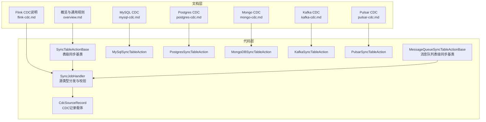
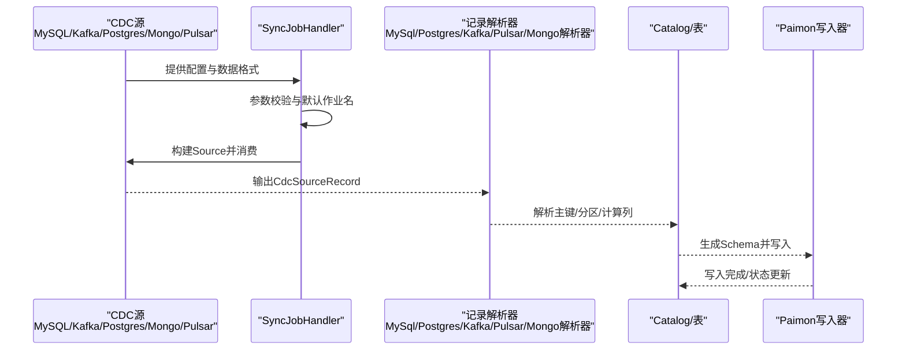
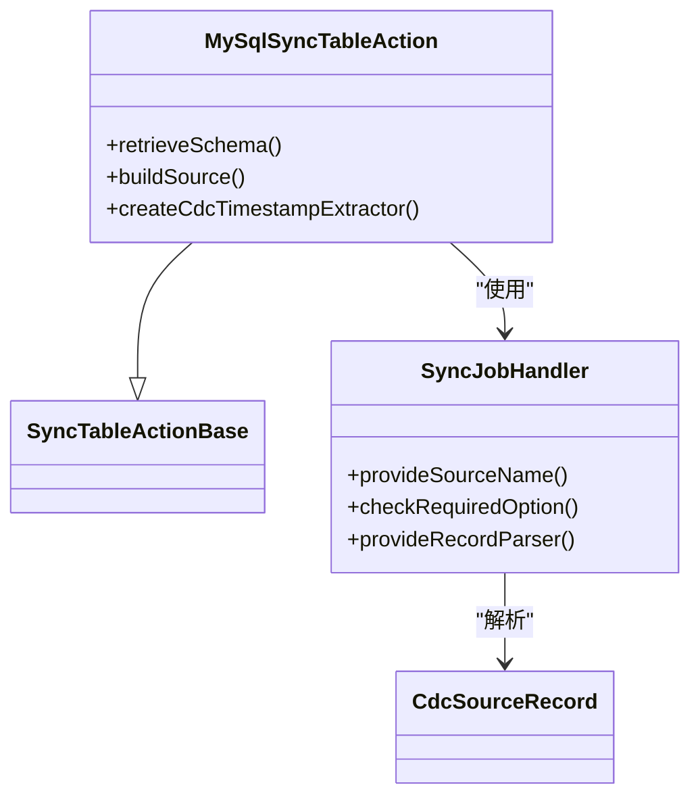
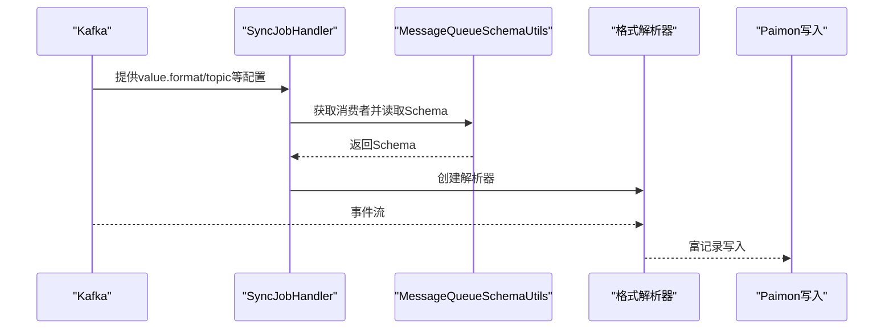
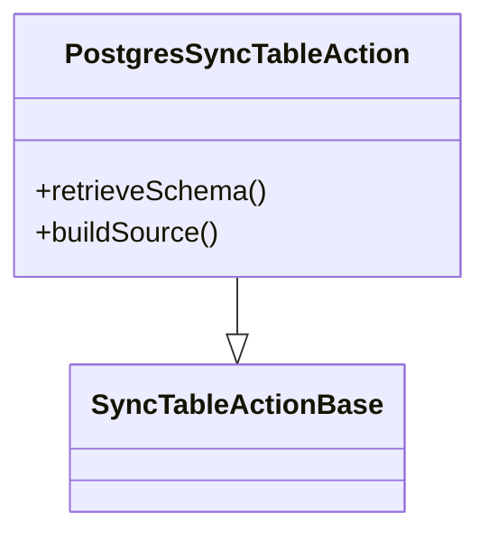
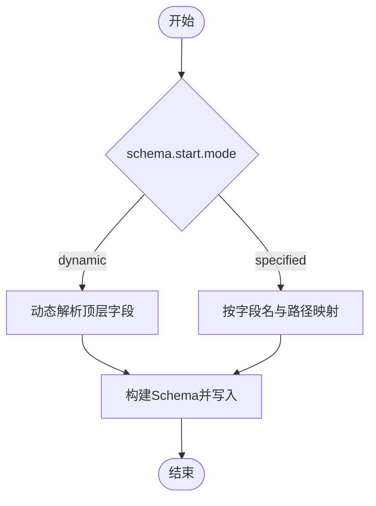
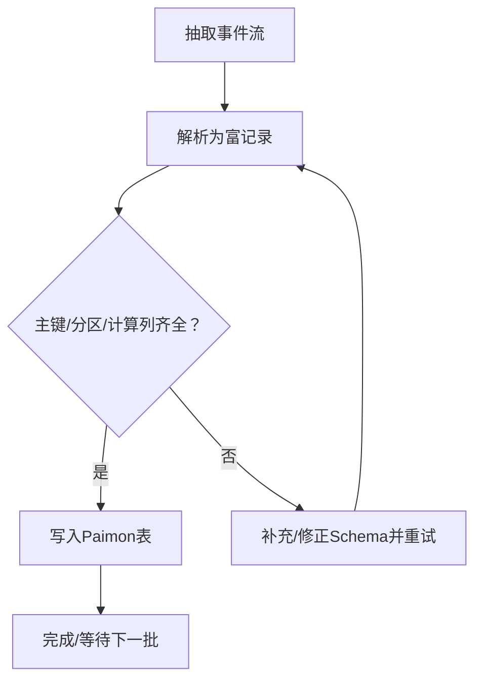
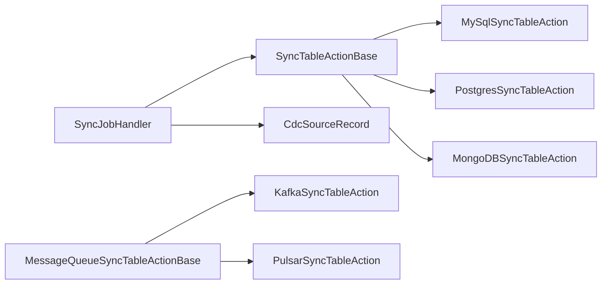

# CDC集成

<cite>
**本文引用的文件**
- [overview.md](file://docs/content/cdc-ingestion/overview.md)
- [flink-cdc.md](file://docs/content/cdc-ingestion/flink-cdc.md)
- [mysql-cdc.md](file://docs/content/cdc-ingestion/mysql-cdc.md)
- [kafka-cdc.md](file://docs/content/cdc-ingestion/kafka-cdc.md)
- [postgres-cdc.md](file://docs/content/cdc-ingestion/postgres-cdc.md)
- [mongo-cdc.md](file://docs/content/cdc-ingestion/mongo-cdc.md)
- [pulsar-cdc.md](file://docs/content/cdc-ingestion/pulsar-cdc.md)
- [MySqlSyncTableAction.java](file://paimon-flink/paimon-flink-cdc/src/main/java/org/apache/paimon/flink/action/cdc/mysql/MySqlSyncTableAction.java)
- [PostgresSyncTableAction.java](file://paimon-flink/paimon-flink-cdc/src/main/java/org/apache/paimon/flink/action/cdc/postgres/PostgresSyncTableAction.java)
- [MongoDBSyncTableAction.java](file://paimon-flink/paimon-flink-cdc/src/main/java/org/apache/paimon/flink/action/cdc/mongodb/MongoDBSyncTableAction.java)
- [KafkaSyncTableAction.java](file://paimon-flink/paimon-flink-cdc/src/main/java/org/apache/paimon/flink/action/cdc/kafka/KafkaSyncTableAction.java)
- [PulsarSyncTableAction.java](file://paimon-flink/paimon-flink-cdc/src/main/java/org/apache/paimon/flink/action/cdc/pulsar/PulsarSyncTableAction.java)
- [SyncTableActionBase.java](file://paimon-flink/paimon-flink-cdc/src/main/java/org/apache/paimon/flink/action/cdc/SyncTableActionBase.java)
- [MessageQueueSyncTableActionBase.java](file://paimon-flink/paimon-flink-cdc/src/main/java/org/apache/paimon/flink/action/cdc/MessageQueueSyncTableActionBase.java)
- [SyncJobHandler.java](file://paimon-flink/paimon-flink-cdc/src/main/java/org/apache/paimon/flink/action/cdc/SyncJobHandler.java)
- [CdcSourceRecord.java](file://paimon-flink/paimon-flink-cdc/src/main/java/org/apache/paimon/flink/action/cdc/CdcSourceRecord.java)
</cite>

## 目录
1. [简介](#简介)
2. [项目结构](#项目结构)
3. [核心组件](#核心组件)
4. [架构总览](#架构总览)
5. [详细组件分析](#详细组件分析)
6. [依赖关系分析](#依赖关系分析)
7. [性能考虑](#性能考虑)
8. [故障排除指南](#故障排除指南)
9. [结论](#结论)
10. [附录](#附录)

## 简介
本文件面向Apache Paimon在Flink中的CDC（变更数据捕获）集成，系统化阐述变更数据捕获的概念与原理，并覆盖MySQL、Kafka、PostgreSQL、MongoDB、Pulsar等多源CDC的接入方式与最佳实践。文档从架构、数据流、处理逻辑、部署配置、监控与排障等方面进行深入说明，帮助读者快速构建稳定、可扩展的CDC数据管道。

## 项目结构
围绕CDC功能，Paimon在文档侧提供了各数据源的使用说明与参数参考；在代码侧通过统一的Action抽象与Source类型分发，实现“按源适配”的CDC同步能力。

**图表来源**
- [overview.md:1-156](file://docs/content/cdc-ingestion/overview.md#L1-L156)
- [flink-cdc.md:1-172](file://docs/content/cdc-ingestion/flink-cdc.md#L1-L172)
- [mysql-cdc.md:1-272](file://docs/content/cdc-ingestion/mysql-cdc.md#L1-L272)
- [kafka-cdc.md:1-569](file://docs/content/cdc-ingestion/kafka-cdc.md#L1-L569)
- [postgres-cdc.md:1-128](file://docs/content/cdc-ingestion/postgres-cdc.md#L1-L128)
- [mongo-cdc.md:1-252](file://docs/content/cdc-ingestion/mongo-cdc.md#L1-L252)
- [pulsar-cdc.md:1-363](file://docs/content/cdc-ingestion/pulsar-cdc.md#L1-L363)
- [SyncTableActionBase.java:1-217](file://paimon-flink/paimon-flink-cdc/src/main/java/org/apache/paimon/flink/action/cdc/SyncTableActionBase.java#L1-L217)
- [MessageQueueSyncTableActionBase.java:1-93](file://paimon-flink/paimon-flink-cdc/src/main/java/org/apache/paimon/flink/action/cdc/MessageQueueSyncTableActionBase.java#L1-L93)
- [SyncJobHandler.java:1-270](file://paimon-flink/paimon-flink-cdc/src/main/java/org/apache/paimon/flink/action/cdc/SyncJobHandler.java#L1-L270)
- [MySqlSyncTableAction.java:1-134](file://paimon-flink/paimon-flink-cdc/src/main/java/org/apache/paimon/flink/action/cdc/mysql/MySqlSyncTableAction.java#L1-L134)
- [PostgresSyncTableAction.java:1-134](file://paimon-flink/paimon-flink-cdc/src/main/java/org/apache/paimon/flink/action/cdc/postgres/PostgresSyncTableAction.java#L1-L134)
- [MongoDBSyncTableAction.java:1-81](file://paimon-flink/paimon-flink-cdc/src/main/java/org/apache/paimon/flink/action/cdc/mongodb/MongoDBSyncTableAction.java#L1-L81)
- [KafkaSyncTableAction.java:1-37](file://paimon-flink/paimon-flink-cdc/src/main/java/org/apache/paimon/flink/action/cdc/kafka/KafkaSyncTableAction.java#L1-L37)
- [PulsarSyncTableAction.java:1-37](file://paimon-flink/paimon-flink-cdc/src/main/java/org/apache/paimon/flink/action/cdc/pulsar/PulsarSyncTableAction.java#L1-L37)
- [CdcSourceRecord.java:1-112](file://paimon-flink/paimon-flink-cdc/src/main/java/org/apache/paimon/flink/action/cdc/CdcSourceRecord.java#L1-L112)

**章节来源**
- [overview.md:1-156](file://docs/content/cdc-ingestion/overview.md#L1-L156)
- [flink-cdc.md:1-172](file://docs/content/cdc-ingestion/flink-cdc.md#L1-L172)

## 核心组件
- 同步动作基类：统一表级CDC同步的生命周期与行为，负责模式推断、计算列构建、表存在性检查与兼容性校验、Sink构建与执行。
- 源类型分发器：根据源类型（MySQL、Postgres、Kafka、Pulsar、Mongo）进行参数校验、Source构建、解析器选择与消费者封装。
- 记录载体：标准化CDC上游事件为统一对象，便于下游解析与写入。

关键职责与交互要点：
- 表级同步基类在构建阶段完成Paimon表的Schema生成与兼容性检查，确保与上游Schema一致或支持有限的演进。
- 源类型分发器在运行时根据配置选择具体Source与解析器，保证不同格式（如Canal/Debezium/Maxwell/Ogg/JSON等）的正确解析。
- 记录载体承载事件值与元数据，支持后续解析器提取主键、分区键与计算列所需字段。

**章节来源**
- [SyncTableActionBase.java:47-217](file://paimon-flink/paimon-flink-cdc/src/main/java/org/apache/paimon/flink/action/cdc/SyncTableActionBase.java#L47-L217)
- [MessageQueueSyncTableActionBase.java:28-93](file://paimon-flink/paimon-flink-cdc/src/main/java/org/apache/paimon/flink/action/cdc/MessageQueueSyncTableActionBase.java#L28-L93)
- [SyncJobHandler.java:53-270](file://paimon-flink/paimon-flink-cdc/src/main/java/org/apache/paimon/flink/action/cdc/SyncJobHandler.java#L53-L270)
- [CdcSourceRecord.java:29-112](file://paimon-flink/paimon-flink-cdc/src/main/java/org/apache/paimon/flink/action/cdc/CdcSourceRecord.java#L29-L112)

## 架构总览
下图展示从不同数据源到Paimon的CDC数据通路：源类型分发器根据配置选择对应Source与解析器，解析器将事件转换为富记录后写入Paimon表。

**图表来源**
- [SyncJobHandler.java:97-247](file://paimon-flink/paimon-flink-cdc/src/main/java/org/apache/paimon/flink/action/cdc/SyncJobHandler.java#L97-L247)
- [SyncTableActionBase.java:114-179](file://paimon-flink/paimon-flink-cdc/src/main/java/org/apache/paimon/flink/action/cdc/SyncTableActionBase.java#L114-L179)
- [CdcSourceRecord.java:30-112](file://paimon-flink/paimon-flink-cdc/src/main/java/org/apache/paimon/flink/action/cdc/CdcSourceRecord.java#L30-L112)

## 详细组件分析

### MySQL CDC
- 支持表级与库级同步，自动合并多个表Schema并创建/对齐目标Paimon表。
- 仅支持带主键的表；不支持删除列、重命名列（重命名将新增列）。
- 建议使用正则表达式匹配多表或多库，结合分片合并策略实现跨库聚合。

**图表来源**
- [MySqlSyncTableAction.java:74-134](file://paimon-flink/paimon-flink-cdc/src/main/java/org/apache/paimon/flink/action/cdc/mysql/MySqlSyncTableAction.java#L74-L134)
- [SyncTableActionBase.java:48-217](file://paimon-flink/paimon-flink-cdc/src/main/java/org/apache/paimon/flink/action/cdc/SyncTableActionBase.java#L48-L217)
- [SyncJobHandler.java:54-270](file://paimon-flink/paimon-flink-cdc/src/main/java/org/apache/paimon/flink/action/cdc/SyncJobHandler.java#L54-L270)
- [CdcSourceRecord.java:30-112](file://paimon-flink/paimon-flink-cdc/src/main/java/org/apache/paimon/flink/action/cdc/CdcSourceRecord.java#L30-L112)

**章节来源**
- [mysql-cdc.md:43-272](file://docs/content/cdc-ingestion/mysql-cdc.md#L43-L272)
- [MySqlSyncTableAction.java:43-134](file://paimon-flink/paimon-flink-cdc/src/main/java/org/apache/paimon/flink/action/cdc/mysql/MySqlSyncTableAction.java#L43-L134)

### Kafka CDC
- 支持多种格式（Canal/Debezium/Maxwell/Ogg/JSON/Avro/BSON），自动从最早非DDL数据中推断Schema。
- 支持单主题/多主题/多表映射，适合日志与事件流的增量写入。

**图表来源**
- [kafka-cdc.md:35-113](file://docs/content/cdc-ingestion/kafka-cdc.md#L35-L113)
- [MessageQueueSyncTableActionBase.java:64-92](file://paimon-flink/paimon-flink-cdc/src/main/java/org/apache/paimon/flink/action/cdc/MessageQueueSyncTableActionBase.java#L64-L92)
- [SyncJobHandler.java:221-247](file://paimon-flink/paimon-flink-cdc/src/main/java/org/apache/paimon/flink/action/cdc/SyncJobHandler.java#L221-L247)

**章节来源**
- [kafka-cdc.md:89-569](file://docs/content/cdc-ingestion/kafka-cdc.md#L89-L569)
- [KafkaSyncTableAction.java:26-37](file://paimon-flink/paimon-flink-cdc/src/main/java/org/apache/paimon/flink/action/cdc/kafka/KafkaSyncTableAction.java#L26-L37)

### Postgres CDC
- 需要指定slot名称，支持表级/库级同步，Schema合并与演进规则与MySQL类似。

**图表来源**
- [postgres-cdc.md:43-128](file://docs/content/cdc-ingestion/postgres-cdc.md#L43-L128)
- [PostgresSyncTableAction.java:75-134](file://paimon-flink/paimon-flink-cdc/src/main/java/org/apache/paimon/flink/action/cdc/postgres/PostgresSyncTableAction.java#L75-L134)

**章节来源**
- [postgres-cdc.md:43-128](file://docs/content/cdc-ingestion/postgres-cdc.md#L43-L128)
- [PostgresSyncTableAction.java:44-134](file://paimon-flink/paimon-flink-cdc/src/main/java/org/apache/paimon/flink/action/cdc/postgres/PostgresSyncTableAction.java#L44-L134)

### Mongo CDC
- 以Collection为单位同步，主键固定为_id；动态/指定两种Schema模式；默认将所有字段映射为String以适配无固定Schema的特性。

**图表来源**
- [mongo-cdc.md:40-135](file://docs/content/cdc-ingestion/mongo-cdc.md#L40-L135)
- [MongoDBSyncTableAction.java:51-81](file://paimon-flink/paimon-flink-cdc/src/main/java/org/apache/paimon/flink/action/cdc/mongodb/MongoDBSyncTableAction.java#L51-L81)

**章节来源**
- [mongo-cdc.md:40-252](file://docs/content/cdc-ingestion/mongo-cdc.md#L40-L252)
- [MongoDBSyncTableAction.java:32-81](file://paimon-flink/paimon-flink-cdc/src/main/java/org/apache/paimon/flink/action/cdc/mongodb/MongoDBSyncTableAction.java#L32-L81)

### Pulsar CDC
- 支持多种格式，提供丰富的起止游标控制选项，适合大规模事件流的CDC写入。

**图表来源**
- [pulsar-cdc.md:35-101](file://docs/content/cdc-ingestion/pulsar-cdc.md#L35-L101)
- [MessageQueueSyncTableActionBase.java:64-92](file://paimon-flink/paimon-flink-cdc/src/main/java/org/apache/paimon/flink/action/cdc/MessageQueueSyncTableActionBase.java#L64-L92)
- [SyncJobHandler.java:221-247](file://paimon-flink/paimon-flink-cdc/src/main/java/org/apache/paimon/flink/action/cdc/SyncJobHandler.java#L221-L247)

**章节来源**
- [pulsar-cdc.md:79-363](file://docs/content/cdc-ingestion/pulsar-cdc.md#L79-L363)
- [PulsarSyncTableAction.java:26-37](file://paimon-flink/paimon-flink-cdc/src/main/java/org/apache/paimon/flink/action/cdc/pulsar/PulsarSyncTableAction.java#L26-L37)

### 通用CDC处理流程
- 数据抽取：依据源类型构建Source并消费事件流。
- 转换：解析器将事件转换为富记录，提取主键、分区键与计算列。
- 加载：写入器将记录写入Paimon表，支持Schema演进与一致性保障。

[此图为概念流程，无需图表来源]

## 依赖关系分析
- 源类型分发器承担参数校验、Source构建、解析器选择与消费者封装职责，避免在具体Action中重复实现。
- 表级同步基类统一Schema生成、兼容性检查与Sink构建，降低各源的实现复杂度。
- 记录载体作为统一接口，屏蔽上游差异，便于扩展新的源类型。

**图表来源**
- [SyncJobHandler.java:54-270](file://paimon-flink/paimon-flink-cdc/src/main/java/org/apache/paimon/flink/action/cdc/SyncJobHandler.java#L54-L270)
- [SyncTableActionBase.java:48-217](file://paimon-flink/paimon-flink-cdc/src/main/java/org/apache/paimon/flink/action/cdc/SyncTableActionBase.java#L48-L217)
- [MessageQueueSyncTableActionBase.java:54-93](file://paimon-flink/paimon-flink-cdc/src/main/java/org/apache/paimon/flink/action/cdc/MessageQueueSyncTableActionBase.java#L54-L93)
- [MySqlSyncTableAction.java:74-134](file://paimon-flink/paimon-flink-cdc/src/main/java/org/apache/paimon/flink/action/cdc/mysql/MySqlSyncTableAction.java#L74-L134)
- [PostgresSyncTableAction.java:75-134](file://paimon-flink/paimon-flink-cdc/src/main/java/org/apache/paimon/flink/action/cdc/postgres/PostgresSyncTableAction.java#L75-L134)
- [MongoDBSyncTableAction.java:51-81](file://paimon-flink/paimon-flink-cdc/src/main/java/org/apache/paimon/flink/action/cdc/mongodb/MongoDBSyncTableAction.java#L51-L81)
- [KafkaSyncTableAction.java:26-37](file://paimon-flink/paimon-flink-cdc/src/main/java/org/apache/paimon/flink/action/cdc/kafka/KafkaSyncTableAction.java#L26-L37)
- [PulsarSyncTableAction.java:26-37](file://paimon-flink/paimon-flink-cdc/src/main/java/org/apache/paimon/flink/action/cdc/pulsar/PulsarSyncTableAction.java#L26-L37)
- [CdcSourceRecord.java:30-112](file://paimon-flink/paimon-flink-cdc/src/main/java/org/apache/paimon/flink/action/cdc/CdcSourceRecord.java#L30-L112)

**章节来源**
- [SyncJobHandler.java:97-247](file://paimon-flink/paimon-flink-cdc/src/main/java/org/apache/paimon/flink/action/cdc/SyncJobHandler.java#L97-L247)
- [SyncTableActionBase.java:114-179](file://paimon-flink/paimon-flink-cdc/src/main/java/org/apache/paimon/flink/action/cdc/SyncTableActionBase.java#L114-L179)

## 性能考虑
- 并行度与分区：合理设置Paimon Sink并行度与分区键，避免热点与倾斜。
- Schema演进：尽量采用兼容的类型变更，减少全量重建。
- 消费位点：消息队列源可利用起止游标控制，缩短首次同步时间。
- 类型映射：通过类型映射选项统一上游类型，减少解析成本。
- 监控与Checkpoint：启用Checkpoint并设置合理的间隔，提升容错与恢复效率。

[本节为通用指导，无需章节来源]

## 故障排除指南
- 中文乱码：在Flink配置中设置字符集选项，确保编码一致。
- 缺失字段类型/库表名：部分JSON格式可能缺失类型或库表信息，需手动指定或调整格式。
- 主键缺失：消息队列源可能未携带主键，需在提交任务时显式指定主键。
- MongoDB无Schema：动态模式下所有字段映射为String，需在下游做进一步处理。

**章节来源**
- [mysql-cdc.md:261-272](file://docs/content/cdc-ingestion/mysql-cdc.md#L261-L272)
- [kafka-cdc.md:77-87](file://docs/content/cdc-ingestion/kafka-cdc.md#L77-L87)
- [mongo-cdc.md:126-134](file://docs/content/cdc-ingestion/mongo-cdc.md#L126-L134)

## 结论
Paimon在Flink中的CDC集成通过统一的Action与源类型分发机制，实现了对MySQL、PostgreSQL、MongoDB、Kafka与Pulsar的高效同步。借助Schema演进、计算列与类型映射等能力，用户可在保证一致性的前提下灵活适配多源数据，并通过合理的并行与监控策略获得稳定的生产级表现。

## 附录
- 部署与运行：使用官方Action命令行工具提交作业，按数据源文档准备连接Jar与配置项。
- 监控与运维：结合Checkpoint、作业名与表配置，建立完善的监控与告警体系。
- 最佳实践：优先使用带主键的表、合理设计分区键与计算列、严格控制Schema变更范围。

**章节来源**
- [overview.md:141-156](file://docs/content/cdc-ingestion/overview.md#L141-L156)
- [flink-cdc.md:83-90](file://docs/content/cdc-ingestion/flink-cdc.md#L83-L90)