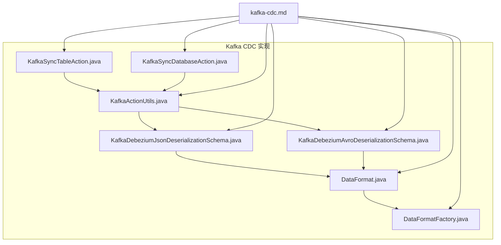
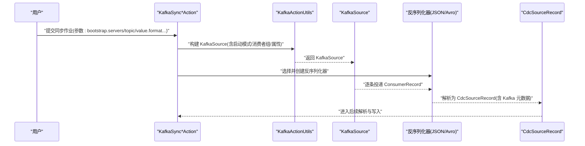
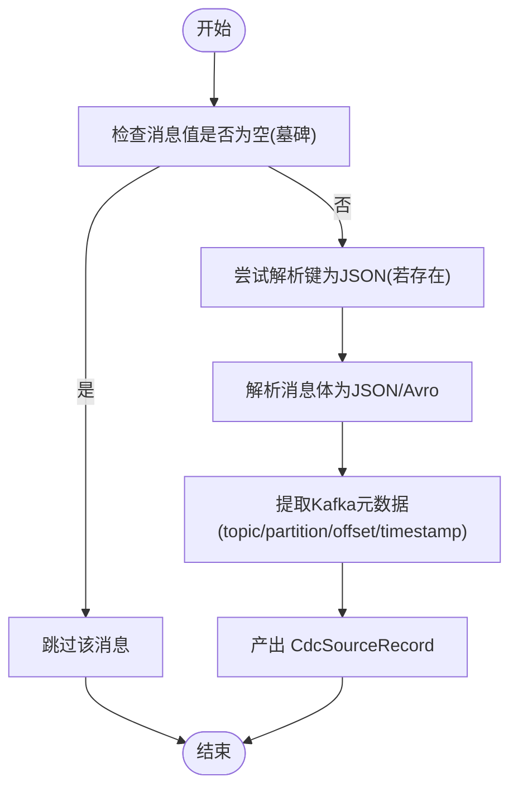
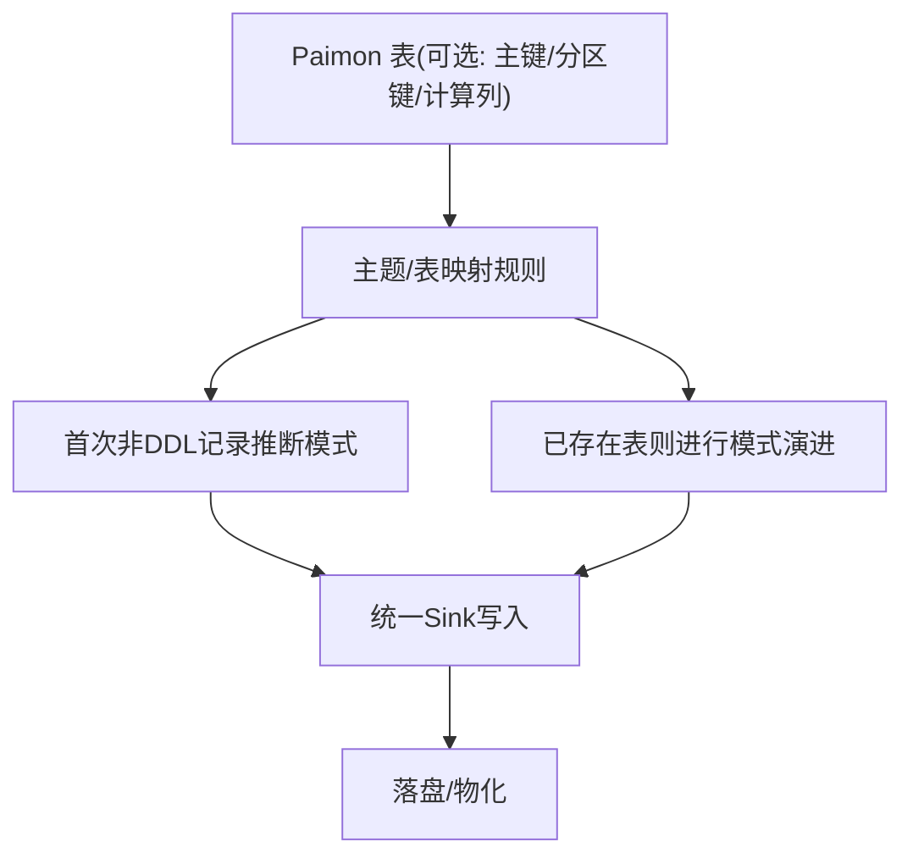
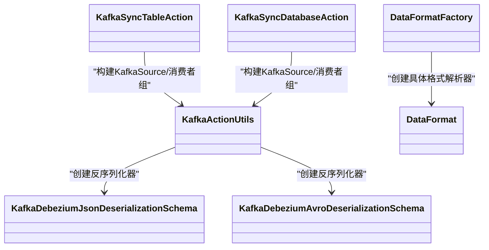

# Kafka CDC

<cite>
**本文引用的文件**
- [kafka-cdc.md](file://docs/content/cdc-ingestion/kafka-cdc.md)
- [KafkaSyncTableAction.java](file://paimon-flink/paimon-flink-cdc/src/main/java/org/apache/paimon/flink/action/cdc/kafka/KafkaSyncTableAction.java)
- [KafkaSyncDatabaseAction.java](file://paimon-flink/paimon-flink-cdc/src/main/java/org/apache/paimon/flink/action/cdc/kafka/KafkaSyncDatabaseAction.java)
- [KafkaActionUtils.java](file://paimon-flink/paimon-flink-cdc/src/main/java/org/apache/paimon/flink/action/cdc/kafka/KafkaActionUtils.java)
- [KafkaDebeziumJsonDeserializationSchema.java](file://paimon-flink/paimon-flink-cdc/src/main/java/org/apache/paimon/flink/action/cdc/kafka/KafkaDebeziumJsonDeserializationSchema.java)
- [KafkaDebeziumAvroDeserializationSchema.java](file://paimon-flink/paimon-flink-cdc/src/main/java/org/apache/paimon/flink/action/cdc/kafka/KafkaDebeziumAvroDeserializationSchema.java)
- [DataFormat.java](file://paimon-flink/paimon-flink-cdc/src/main/java/org/apache/paimon/flink/action/cdc/format/DataFormat.java)
- [DataFormatFactory.java](file://paimon-flink/paimon-flink-cdc/src/main/java/org/apache/paimon/flink/action/cdc/format/DataFormatFactory.java)
</cite>

## 目录
1. [简介](#简介)
2. [项目结构](#项目结构)
3. [核心组件](#核心组件)
4. [架构总览](#架构总览)
5. [组件详解](#组件详解)
6. [依赖关系分析](#依赖关系分析)
7. [性能考量](#性能考量)
8. [故障排查指南](#故障排查指南)
9. [结论](#结论)
10. [附录](#附录)

## 简介
本章节面向使用 Apache Paimon 进行 Kafka CDC 同步的用户，系统性讲解 Kafka CDC 的工作原理、消息格式解析、Kafka 主题到 Paimon 表的映射与转换流程、支持的数据格式（JSON、Avro、Debezium 等）、配置参数（Bootstrap Servers、Topic 配置、消费者组等）、分区与并行度、容错与重平衡、以及性能调优与监控建议。文档同时提供可直接定位到源码位置的参考路径，便于进一步深入。

## 项目结构
围绕 Kafka CDC 的实现，主要涉及以下模块与文件：
- 文档：kafka-cdc.md 提供了格式支持、命令行参数、示例与额外配置项说明
- 动作入口：KafkaSyncTableAction、KafkaSyncDatabaseAction 负责构建同步任务
- 工具类：KafkaActionUtils 负责构建 KafkaSource、解析启动模式、提取 Kafka 元数据、早期消费等
- 消费反序列化器：KafkaDebeziumJsonDeserializationSchema、KafkaDebeziumAvroDeserializationSchema 处理 JSON/Avro 消息
- 数据格式抽象：DataFormat、DataFormatFactory 定义并创建不同格式的解析器

**图表来源**
- [KafkaSyncTableAction.java:27-35](file://paimon-flink/paimon-flink-cdc/src/main/java/org/apache/paimon/flink/action/cdc/kafka/KafkaSyncTableAction.java#L27-L35)
- [KafkaSyncDatabaseAction.java:29-34](file://paimon-flink/paimon-flink-cdc/src/main/java/org/apache/paimon/flink/action/cdc/kafka/KafkaSyncDatabaseAction.java#L29-L34)
- [KafkaActionUtils.java:73-143](file://paimon-flink/paimon-flink-cdc/src/main/java/org/apache/paimon/flink/action/cdc/kafka/KafkaActionUtils.java#L73-L143)
- [KafkaDebeziumJsonDeserializationSchema.java:61-89](file://paimon-flink/paimon-flink-cdc/src/main/java/org/apache/paimon/flink/action/cdc/kafka/KafkaDebeziumJsonDeserializationSchema.java#L61-L89)
- [KafkaDebeziumAvroDeserializationSchema.java:60-84](file://paimon-flink/paimon-flink-cdc/src/main/java/org/apache/paimon/flink/action/cdc/kafka/KafkaDebeziumAvroDeserializationSchema.java#L60-L84)
- [DataFormat.java:36-70](file://paimon-flink/paimon-flink-cdc/src/main/java/org/apache/paimon/flink/action/cdc/format/DataFormat.java#L36-L70)
- [DataFormatFactory.java:30-44](file://paimon-flink/paimon-flink-cdc/src/main/java/org/apache/paimon/flink/action/cdc/format/DataFormatFactory.java#L30-L44)

**章节来源**
- [kafka-cdc.md:1-569](file://docs/content/cdc-ingestion/kafka-cdc.md#L1-L569)
- [KafkaSyncTableAction.java:27-35](file://paimon-flink/paimon-flink-cdc/src/main/java/org/apache/paimon/flink/action/cdc/kafka/KafkaSyncTableAction.java#L27-L35)
- [KafkaSyncDatabaseAction.java:29-34](file://paimon-flink/paimon-flink-cdc/src/main/java/org/apache/paimon/flink/action/cdc/kafka/KafkaSyncDatabaseAction.java#L29-L34)
- [KafkaActionUtils.java:73-143](file://paimon-flink/paimon-flink-cdc/src/main/java/org/apache/paimon/flink/action/cdc/kafka/KafkaActionUtils.java#L73-L143)
- [KafkaDebeziumJsonDeserializationSchema.java:61-89](file://paimon-flink/paimon-flink-cdc/src/main/java/org/apache/paimon/flink/action/cdc/kafka/KafkaDebeziumJsonDeserializationSchema.java#L61-L89)
- [KafkaDebeziumAvroDeserializationSchema.java:60-84](file://paimon-flink/paimon-flink-cdc/src/main/java/org/apache/paimon/flink/action/cdc/kafka/KafkaDebeziumAvroDeserializationSchema.java#L60-L84)
- [DataFormat.java:36-70](file://paimon-flink/paimon-flink-cdc/src/main/java/org/apache/paimon/flink/action/cdc/format/DataFormat.java#L36-L70)
- [DataFormatFactory.java:30-44](file://paimon-flink/paimon-flink-cdc/src/main/java/org/apache/paimon/flink/action/cdc/format/DataFormatFactory.java#L30-L44)

## 核心组件
- KafkaSyncTableAction 与 KafkaSyncDatabaseAction：分别负责单表与多表/多主题的同步动作封装，内部通过 SyncJobHandler.SourceType.KAFKA 指定来源类型，并委托底层工具类完成 KafkaSource 构建与反序列化器选择。
- KafkaActionUtils：提供 KafkaSource 构建、启动模式解析（最早/最新/GROUP_OFFSETS/SPECIFIC_OFFSETS/TIMESTAMP）、消费者组生成、Topic 发现、元数据提取、早期消费（仅用于模式推断）等能力。
- 反序列化器：
  - KafkaDebeziumJsonDeserializationSchema：将 Kafka 消息体解析为 JSON 结构，提取 Kafka 元数据，输出 CdcSourceRecord。
  - KafkaDebeziumAvroDeserializationSchema：基于 Confluent Avro Schema Registry 解析 Avro 消息，输出 CdcSourceRecord。
- DataFormat 与 DataFormatFactory：定义数据格式抽象与工厂创建逻辑，根据 value.format 选择具体格式解析器。

**章节来源**
- [KafkaSyncTableAction.java:27-35](file://paimon-flink/paimon-flink-cdc/src/main/java/org/apache/paimon/flink/action/cdc/kafka/KafkaSyncTableAction.java#L27-L35)
- [KafkaSyncDatabaseAction.java:29-34](file://paimon-flink/paimon-flink-cdc/src/main/java/org/apache/paimon/flink/action/cdc/kafka/KafkaSyncDatabaseAction.java#L29-L34)
- [KafkaActionUtils.java:73-143](file://paimon-flink/paimon-flink-cdc/src/main/java/org/apache/paimon/flink/action/cdc/kafka/KafkaActionUtils.java#L73-L143)
- [KafkaDebeziumJsonDeserializationSchema.java:61-89](file://paimon-flink/paimon-flink-cdc/src/main/java/org/apache/paimon/flink/action/cdc/kafka/KafkaDebeziumJsonDeserializationSchema.java#L61-L89)
- [KafkaDebeziumAvroDeserializationSchema.java:60-84](file://paimon-flink/paimon-flink-cdc/src/main/java/org/apache/paimon/flink/action/cdc/kafka/KafkaDebeziumAvroDeserializationSchema.java#L60-L84)
- [DataFormat.java:36-70](file://paimon-flink/paimon-flink-cdc/src/main/java/org/apache/paimon/flink/action/cdc/format/DataFormat.java#L36-L70)
- [DataFormatFactory.java:30-44](file://paimon-flink/paimon-flink-cdc/src/main/java/org/apache/paimon/flink/action/cdc/format/DataFormatFactory.java#L30-L44)

## 架构总览
下图展示了从 Kafka 到 Paimon 的端到端 CDC 流程：KafkaSyncTableAction/KafkaSyncDatabaseAction 作为入口，KafkaActionUtils 构建 KafkaSource 并选择反序列化器，反序列化器将 Kafka 消息解析为 CdcSourceRecord，随后进入统一的解析与写入阶段。

**图表来源**
- [KafkaSyncTableAction.java:27-35](file://paimon-flink/paimon-flink-cdc/src/main/java/org/apache/paimon/flink/action/cdc/kafka/KafkaSyncTableAction.java#L27-L35)
- [KafkaSyncDatabaseAction.java:29-34](file://paimon-flink/paimon-flink-cdc/src/main/java/org/apache/paimon/flink/action/cdc/kafka/KafkaSyncDatabaseAction.java#L29-L34)
- [KafkaActionUtils.java:73-143](file://paimon/flink/paimon-flink-cdc/src/main/java/org/apache/paimon/flink/action/cdc/kafka/KafkaActionUtils.java#L73-L143)
- [KafkaDebeziumJsonDeserializationSchema.java:61-89](file://paimon-flink/paimon-flink-cdc/src/main/java/org/apache/paimon/flink/action/cdc/kafka/KafkaDebeziumJsonDeserializationSchema.java#L61-L89)
- [KafkaDebeziumAvroDeserializationSchema.java:60-84](file://paimon-flink/paimon-flink-cdc/src/main/java/org/apache/paimon/flink/action/cdc/kafka/KafkaDebeziumAvroDeserializationSchema.java#L60-L84)

## 组件详解

### Kafka CDC 工作原理与消息格式解析
- JSON 格式（Debezium/Canal/Maxwell/Ogg/Normal）：通过 KafkaDebeziumJsonDeserializationSchema 将 Kafka 消息体解析为 JSON，提取 Kafka 元数据（topic/partition/offset/timestamp），输出 CdcSourceRecord。该实现会跳过空值（墓碑消息），并对键进行健壮性处理（非 JSON 键被忽略）。
- Avro 格式（Debezium Avro）：通过 KafkaDebeziumAvroDeserializationSchema 基于 Confluent Avro Schema Registry 解析消息键与值，输出 CdcSourceRecord。需要提供 schema.registry.url。
- 元数据注入：KafkaActionUtils.extractKafkaMetadata 将 Kafka 消息的 topic、partition、offset、timestamp、timestamp_type 注入到记录中，便于后续列映射或过滤。

**图表来源**
- [KafkaDebeziumJsonDeserializationSchema.java:61-89](file://paimon-flink/paimon-flink-cdc/src/main/java/org/apache/paimon/flink/action/cdc/kafka/KafkaDebeziumJsonDeserializationSchema.java#L61-L89)
- [KafkaDebeziumAvroDeserializationSchema.java:60-84](file://paimon-flink/paimon-flink-cdc/src/main/java/org/apache/paimon/flink/action/cdc/kafka/KafkaDebeziumAvroDeserializationSchema.java#L60-L84)
- [KafkaActionUtils.java:322-332](file://paimon-flink/paimon-flink-cdc/src/main/java/org/apache/paimon/flink/action/cdc/kafka/KafkaActionUtils.java#L322-L332)

**章节来源**
- [kafka-cdc.md:35-87](file://docs/content/cdc-ingestion/kafka-cdc.md#L35-L87)
- [KafkaDebeziumJsonDeserializationSchema.java:61-89](file://paimon-flink/paimon-flink-cdc/src/main/java/org/apache/paimon/flink/action/cdc/kafka/KafkaDebeziumJsonDeserializationSchema.java#L61-L89)
- [KafkaDebeziumAvroDeserializationSchema.java:60-84](file://paimon-flink/paimon-flink-cdc/src/main/java/org/apache/paimon/flink/action/cdc/kafka/KafkaDebeziumAvroDeserializationSchema.java#L60-L84)
- [KafkaActionUtils.java:322-332](file://paimon-flink/paimon-flink-cdc/src/main/java/org/apache/paimon/flink/action/cdc/kafka/KafkaActionUtils.java#L322-L332)

### Kafka 主题到 Paimon 表的映射与转换
- 单表同步：KafkaSyncTableAction 将一个或多个 Kafka 主题映射到一个 Paimon 表；当目标表不存在时自动创建，其模式由所有指定主题的“首个非 DDL 记录”推断而来；若表已存在，则与解析出的模式对比并尝试进行模式演进。
- 数据库同步：KafkaSyncDatabaseAction 将多主题/多表映射到一个 Paimon 数据库，统一构建单一汇聚 Sink，按表维度进行模式管理与演进。
- 元数据列：可通过 metadata_column 选项将 Kafka 元数据（topic、partition、offset、timestamp、timestamp_type）映射为表列，结合 metadata_column_prefix 设置列前缀。
- 计算列：支持 computed_column，允许在同步过程中对字段进行派生计算。
- 分区键与主键：可显式指定 partition_keys 与 primary_keys；若表已存在且已有键定义，不建议再次通过参数修改。

**图表来源**
- [kafka-cdc.md:91-116](file://docs/content/cdc-ingestion/kafka-cdc.md#L91-L116)
- [KafkaSyncTableAction.java:27-35](file://paimon-flink/paimon-flink-cdc/src/main/java/org/apache/paimon/flink/action/cdc/kafka/KafkaSyncTableAction.java#L27-L35)
- [KafkaSyncDatabaseAction.java:29-34](file://paimon-flink/paimon-flink-cdc/src/main/java/org/apache/paimon/flink/action/cdc/kafka/KafkaSyncDatabaseAction.java#L29-L34)

**章节来源**
- [kafka-cdc.md:91-116](file://docs/content/cdc-ingestion/kafka-cdc.md#L91-L116)
- [kafka-cdc.md:195-233](file://docs/content/cdc-ingestion/kafka-cdc.md#L195-L233)

### 支持的数据格式与配置要点
- 支持格式：Canal JSON、Debezium JSON、Debezium Avro、Ogg JSON、Maxwell JSON、Normal JSON、aws-dms-json、debezium-bson 等。
- JSON/Avro 解析：通过 DataFormatFactory 根据 value.format 创建对应 DataFormat，再由 KafkaActionUtils 选择反序列化器。
- Avro Schema Registry：当 value.format=debezium-avro 时，需提供 schema.registry.url；反序列化器会在打开时初始化 Confluent Avro 解析器。
- Debezium BSON：MongoDB 专用，文档无固定模式，before/after 字段以字符串形式出现，需满足特定 capture.mode 与 full.update.type 配置。

**章节来源**
- [kafka-cdc.md:35-87](file://docs/content/cdc-ingestion/kafka-cdc.md#L35-L87)
- [kafka-cdc.md:275-296](file://docs/content/cdc-ingestion/kafka-cdc.md#L275-L296)
- [kafka-cdc.md:298-317](file://docs/content/cdc-ingestion/kafka-cdc.md#L298-L317)
- [DataFormatFactory.java:30-44](file://paimon-flink/paimon-flink-cdc/src/main/java/org/apache/paimon/flink/action/cdc/format/DataFormatFactory.java#L30-L44)
- [KafkaActionUtils.java:244-247](file://paimon-flink/paimon-flink-cdc/src/main/java/org/apache/paimon/flink/action/cdc/kafka/KafkaActionUtils.java#L244-L247)
- [KafkaDebeziumAvroDeserializationSchema.java:50-53](file://paimon-flink/paimon-flink-cdc/src/main/java/org/apache/paimon/flink/action/cdc/kafka/KafkaDebeziumAvroDeserializationSchema.java#L50-L53)

### 配置参数说明（Kafka）
- 必填参数
  - properties.bootstrap.servers：Kafka 集群地址
  - topic 或 topic-pattern：指定要消费的主题或正则匹配
  - value.format：消息体格式（如 debezium-json、debezium-avro、canal-json、json 等）
- 消费者组与启动模式
  - properties.group.id：消费者组 ID（未提供时自动生成）
  - scan.startup.mode：EARLIEST_OFFSET/LATEST_OFFSET/GROUP_OFFSETS/SPECIFIC_OFFSETS/TIMESTAMP
  - scan.startup.specific-offsets：当启动模式为 SPECIFIC_OFFSETS 时，格式为 partition:0,offset:42;partition:1,offset:300
  - scan.startup.timestamp-millis：当启动模式为 TIMESTAMP 时，毫秒时间戳
- 元数据列
  - metadata_column：启用 Kafka 元数据列（topic、partition、offset、timestamp、timestamp_type）
  - metadata_column_prefix：元数据列前缀
- 其他常用参数
  - properties.auto.offset.reset：earliest/none 等（影响 GROUP_OFFSETS 行为）
  - properties.enable.auto.commit：false（手动提交偏移）
  - schema.registry.url：当 value.format=debezium-avro 时必填

**章节来源**
- [kafka-cdc.md:108-111](file://docs/content/cdc-ingestion/kafka-cdc.md#L108-L111)
- [kafka-cdc.md:275-296](file://docs/content/cdc-ingestion/kafka-cdc.md#L275-L296)
- [KafkaActionUtils.java:73-143](file://paimon-flink/paimon-flink-cdc/src/main/java/org/apache/paimon/flink/action/cdc/kafka/KafkaActionUtils.java#L73-L143)
- [KafkaActionUtils.java:196-233](file://paimon-flink/paimon-flink-cdc/src/main/java/org/apache/paimon/flink/action/cdc/kafka/KafkaActionUtils.java#L196-L233)
- [KafkaActionUtils.java:235-242](file://paimon/flink/paimon-flink-cdc/src/main/java/org/apache/paimon/flink/action/cdc/kafka/KafkaActionUtils.java#L235-L242)

### 分区处理与并行度
- KafkaSource 并行度：KafkaSource 的并行度通常与主题分区数一致，每个分区由一个子任务消费；可通过 KafkaSource 的并行度控制整体吞吐。
- 启动模式与分区：EARLIEST/LATEST/SPECIFIC_OFFSETS/TIMESTAMP 决定从何处开始消费；SPECIFIC_OFFSETS 可针对不同分区设置起始位点。
- 模式推断与分区：KafkaActionUtils.getKafkaEarliestConsumer 会选取一个分区进行最早位点拉取，用于推断模式（非生产消费）。

**章节来源**
- [KafkaActionUtils.java:249-289](file://paimon-flink/paimon-flink-cdc/src/main/java/org/apache/paimon/flink/action/cdc/kafka/KafkaActionUtils.java#L249-L289)
- [KafkaActionUtils.java:73-143](file://paimon-flink/paimon-flink-cdc/src/main/java/org/apache/paimon/flink/action/cdc/kafka/KafkaActionUtils.java#L73-L143)

### 容错机制与重平衡
- 消费者组与偏移提交：默认禁用自动提交（enable.auto.commit=false），消费者组由 properties.group.id 指定；GROUP_OFFSETS 模式下可配置 auto.offset.reset。
- 重平衡：当消费者组发生重平衡时，Kafka 会重新分配分区；GROUP_OFFSETS 模式下的偏移回退策略由 auto.offset.reset 控制。
- 异常处理：反序列化器在解析失败时会记录错误日志并抛出异常；KafkaActionUtils 在早期消费场景中捕获异常并向上抛出，便于作业感知。

**章节来源**
- [KafkaActionUtils.java:257-266](file://paimon-flink/paimon-flink-cdc/src/main/java/org/apache/paimon/flink/action/cdc/kafka/KafkaActionUtils.java#L257-L266)
- [KafkaActionUtils.java:168-183](file://paimon-flink/paimon-flink-cdc/src/main/java/org/apache/paimon/flink/action/cdc/kafka/KafkaActionUtils.java#L168-L183)
- [KafkaDebeziumJsonDeserializationSchema.java:85-88](file://paimon-flink/paimon-flink-cdc/src/main/java/org/apache/paimon/flink/action/cdc/kafka/KafkaDebeziumJsonDeserializationSchema.java#L85-L88)

### 配置示例与代码实现定位
- 单表同步示例（Canal JSON）：参见命令行参数与示例路径
  - [kafka_sync_table 示例:117-138](file://docs/content/cdc-ingestion/kafka-cdc.md#L117-L138)
- 数据库同步示例（多主题）：参见命令行参数与示例路径
  - [kafka_sync_database 示例:256-273](file://docs/content/cdc-ingestion/kafka-cdc.md#L256-L273)
- Append 日志数据（value.format=json）：参见命令行参数与示例路径
  - [value.format=json 示例:174-193](file://docs/content/cdc-ingestion/kafka-cdc.md#L174-L193)
- Avro Schema Registry 配置：参见额外配置项
  - [schema.registry.url:275-296](file://docs/content/cdc-ingestion/kafka-cdc.md#L275-L296)

**章节来源**
- [kafka-cdc.md:117-138](file://docs/content/cdc-ingestion/kafka-cdc.md#L117-L138)
- [kafka-cdc.md:174-193](file://docs/content/cdc-ingestion/kafka-cdc.md#L174-L193)
- [kafka-cdc.md:256-273](file://docs/content/cdc-ingestion/kafka-cdc.md#L256-L273)
- [kafka-cdc.md:275-296](file://docs/content/cdc-ingestion/kafka-cdc.md#L275-L296)

## 依赖关系分析
- 组件耦合
  - KafkaSync*Action 依赖 KafkaActionUtils 构建 KafkaSource 与消费者组
  - 反序列化器依赖 KafkaActionUtils 提供的 Kafka 元数据提取
  - DataFormat 抽象屏蔽不同格式差异，由 DataFormatFactory 按 value.format 创建实例
- 外部依赖
  - Flink Kafka Connector：KafkaSource、KafkaRecordDeserializationSchema
  - Confluent Avro：Debezium Avro 解析
  - Jackson：JSON 解析

**图表来源**
- [KafkaSyncTableAction.java:27-35](file://paimon-flink/paimon-flink-cdc/src/main/java/org/apache/paimon/flink/action/cdc/kafka/KafkaSyncTableAction.java#L27-L35)
- [KafkaSyncDatabaseAction.java:29-34](file://paimon-flink/paimon-flink-cdc/src/main/java/org/apache/paimon/flink/action/cdc/kafka/KafkaSyncDatabaseAction.java#L29-L34)
- [KafkaActionUtils.java:73-143](file://paimon-flink/paimon-flink-cdc/src/main/java/org/apache/paimon/flink/action/cdc/kafka/KafkaActionUtils.java#L73-L143)
- [KafkaDebeziumJsonDeserializationSchema.java:61-89](file://paimon-flink/paimon-flink-cdc/src/main/java/org/apache/paimon/flink/action/cdc/kafka/KafkaDebeziumJsonDeserializationSchema.java#L61-L89)
- [KafkaDebeziumAvroDeserializationSchema.java:60-84](file://paimon-flink/paimon-flink-cdc/src/main/java/org/apache/paimon/flink/action/cdc/kafka/KafkaDebeziumAvroDeserializationSchema.java#L60-L84)
- [DataFormat.java:36-70](file://paimon-flink/paimon-flink-cdc/src/main/java/org/apache/paimon/flink/action/cdc/format/DataFormat.java#L36-L70)
- [DataFormatFactory.java:30-44](file://paimon-flink/paimon-flink-cdc/src/main/java/org/apache/paimon/flink/action/cdc/format/DataFormatFactory.java#L30-L44)

**章节来源**
- [KafkaSyncTableAction.java:27-35](file://paimon-flink/paimon-flink-cdc/src/main/java/org/apache/paimon/flink/action/cdc/kafka/KafkaSyncTableAction.java#L27-L35)
- [KafkaSyncDatabaseAction.java:29-34](file://paimon-flink/paimon-flink-cdc/src/main/java/org/apache/paimon/flink/action/cdc/kafka/KafkaSyncDatabaseAction.java#L29-L34)
- [KafkaActionUtils.java:73-143](file://paimon-flink/paimon-flink-cdc/src/main/java/org/apache/paimon/flink/action/cdc/kafka/KafkaActionUtils.java#L73-L143)
- [DataFormatFactory.java:30-44](file://paimon-flink/paimon-flink-cdc/src/main/java/org/apache/paimon/flink/action/cdc/format/DataFormatFactory.java#L30-L44)

## 性能考量
- 并行度与分区
  - KafkaSource 并行度与主题分区数保持一致，合理设置可提升吞吐
  - 若分区数不足，可考虑增加分区或拆分主题
- 反序列化开销
  - JSON/Avro 解析成本不同，Avro 在 Schema Registry 下具备更高解析效率但需网络访问
- 元数据列与计算列
  - 元数据列与计算列会增加解析与写入成本，建议按需开启
- 偏移提交与重启
  - 禁用自动提交可避免重复消费，但需确保下游写入幂等性
- 启动模式
  - EARLIEST/LATEST/SPECIFIC_OFFSETS/TIMESTAMP 影响首启耗时与数据覆盖范围

[本节为通用性能建议，无需特定文件引用]

## 故障排查指南
- JSON 解析失败
  - 现象：日志记录无效 JSON 并抛出异常
  - 排查：确认消息体为有效 JSON；键非 JSON 不影响解析
  - 参考路径：[KafkaDebeziumJsonDeserializationSchema:85-88](file://paimon-flink/paimon-flink-cdc/src/main/java/org/apache/paimon/flink/action/cdc/kafka/KafkaDebeziumJsonDeserializationSchema.java#L85-L88)
- Avro 解析失败
  - 现象：反序列化器在打开时初始化 Confluent Avro 解析器
  - 排查：确认 schema.registry.url 正确；消息键/值符合 Avro Schema
  - 参考路径：[KafkaDebeziumAvroDeserializationSchema:56-58](file://paimon-flink/paimon-flink-cdc/src/main/java/org/apache/paimon/flink/action/cdc/kafka/KafkaDebeziumAvroDeserializationSchema.java#L56-L58)
- 无法发现主题
  - 现象：找不到匹配 topic-pattern 的主题
  - 排查：确认 topic-pattern 与实际主题名匹配；检查 bootstrap.servers
  - 参考路径：[KafkaActionUtils.findOneTopic:307-319](file://paimon-flink/paimon-flink-cdc/src/main/java/org/apache/paimon/flink/action/cdc/kafka/KafkaActionUtils.java#L307-L319)
- 偏移重置策略
  - 现象：GROUP_OFFSETS 模式下无可用偏移
  - 排查：调整 properties.auto.offset.reset（earliest/none）
  - 参考路径：[KafkaActionUtils.getResetStrategy:168-183](file://paimon-flink/paimon-flink-cdc/src/main/java/org/apache/paimon/flink/action/cdc/kafka/KafkaActionUtils.java#L168-L183)
- 特定偏移启动格式错误
  - 现象：scan.startup.specific-offsets 格式非法
  - 排查：遵循 partition:0,offset:42;partition:1,offset:300 格式
  - 参考路径：[KafkaActionUtils.parseSpecificOffsets:196-233](file://paimon-flink/paimon-flink-cdc/src/main/java/org/apache/paimon/flink/action/cdc/kafka/KafkaActionUtils.java#L196-L233)

**章节来源**
- [KafkaDebeziumJsonDeserializationSchema.java:85-88](file://paimon-flink/paimon-flink-cdc/src/main/java/org/apache/paimon/flink/action/cdc/kafka/KafkaDebeziumJsonDeserializationSchema.java#L85-L88)
- [KafkaDebeziumAvroDeserializationSchema.java:56-58](file://paimon-flink/paimon-flink-cdc/src/main/java/org/apache/paimon/flink/action/cdc/kafka/KafkaDebeziumAvroDeserializationSchema.java#L56-L58)
- [KafkaActionUtils.java:307-319](file://paimon-flink/paimon-flink-cdc/src/main/java/org/apache/paimon/flink/action/cdc/kafka/KafkaActionUtils.java#L307-L319)
- [KafkaActionUtils.java:168-183](file://paimon-flink/paimon-flink-cdc/src/main/java/org/apache/paimon/flink/action/cdc/kafka/KafkaActionUtils.java#L168-L183)
- [KafkaActionUtils.java:196-233](file://paimon-flink/paimon-flink-cdc/src/main/java/org/apache/paimon/flink/action/cdc/kafka/KafkaActionUtils.java#L196-L233)

## 结论
本文从架构、组件、配置、容错与性能等多个维度梳理了 Apache Paimon 的 Kafka CDC 能力，明确了从 Kafka 主题到 Paimon 表的映射与转换路径，并提供了可定位到源码的参考路径以便进一步深入。建议在生产环境中结合业务数据特征选择合适的消息格式与启动模式，合理设置并行度与元数据列，以获得稳定高效的 CDC 同步效果。

[本节为总结性内容，无需特定文件引用]

## 附录
- 命令行参数与示例
  - [kafka_sync_table 参数与示例:95-113](file://docs/content/cdc-ingestion/kafka-cdc.md#L95-L113)
  - [kafka_sync_database 参数与示例:201-225](file://docs/content/cdc-ingestion/kafka-cdc.md#L201-L225)
- 额外配置项
  - [schema.registry.url:275-296](file://docs/content/cdc-ingestion/kafka-cdc.md#L275-L296)
- 数据格式支持
  - [格式支持表格:35-75](file://docs/content/cdc-ingestion/kafka-cdc.md#L35-L75)

**章节来源**
- [kafka-cdc.md:95-113](file://docs/content/cdc-ingestion/kafka-cdc.md#L95-L113)
- [kafka-cdc.md:201-225](file://docs/content/cdc-ingestion/kafka-cdc.md#L201-L225)
- [kafka-cdc.md:275-296](file://docs/content/cdc-ingestion/kafka-cdc.md#L275-L296)
- [kafka-cdc.md:35-75](file://docs/content/cdc-ingestion/kafka-cdc.md#L35-L75)