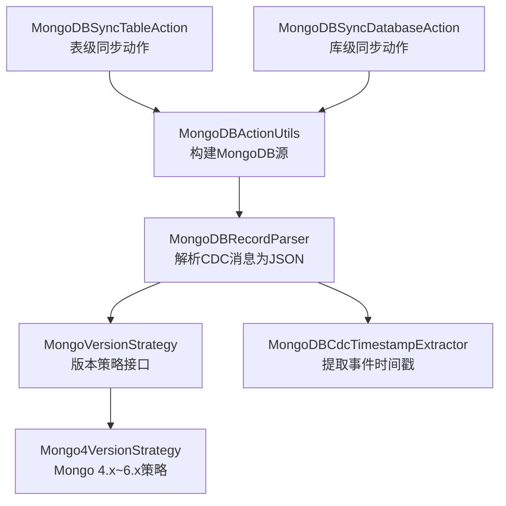
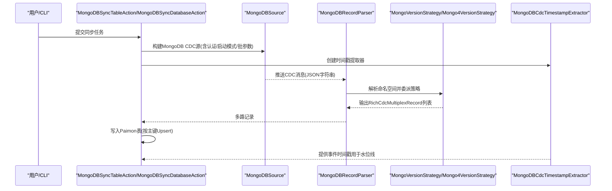
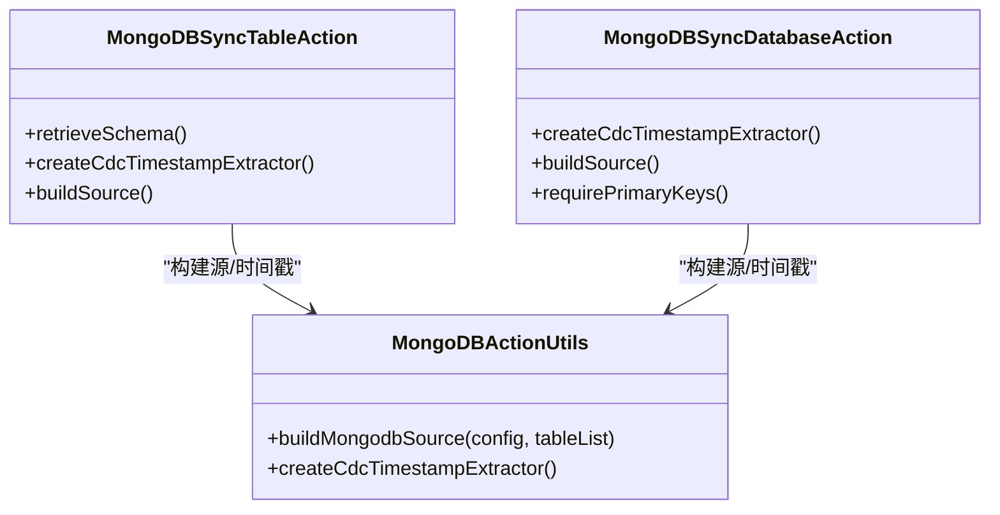
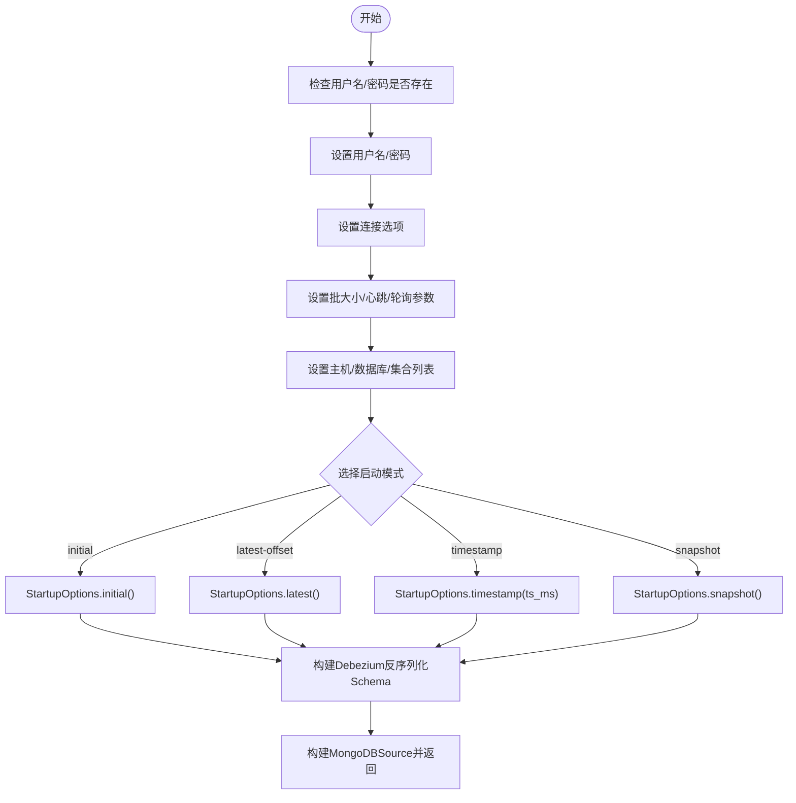
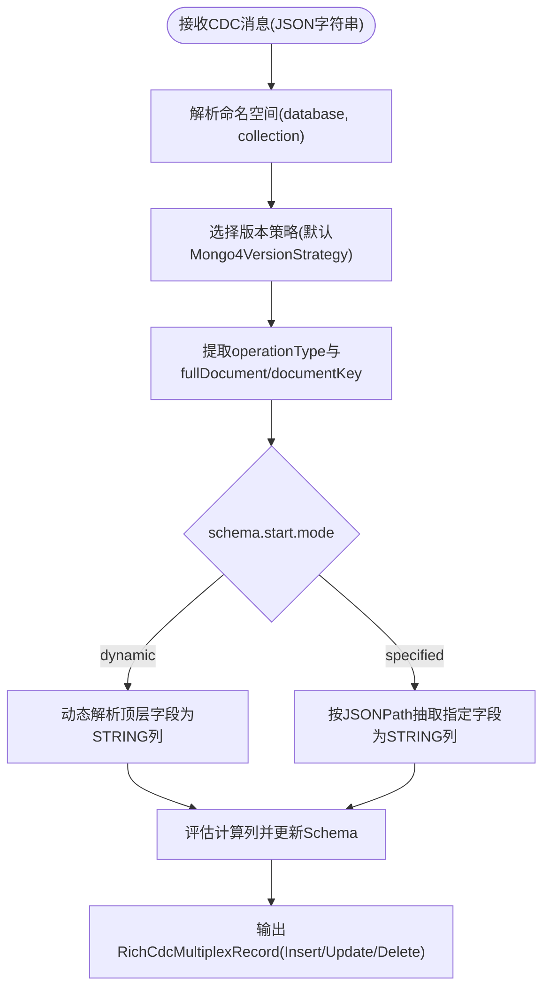
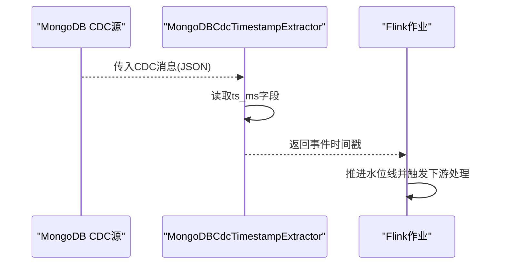
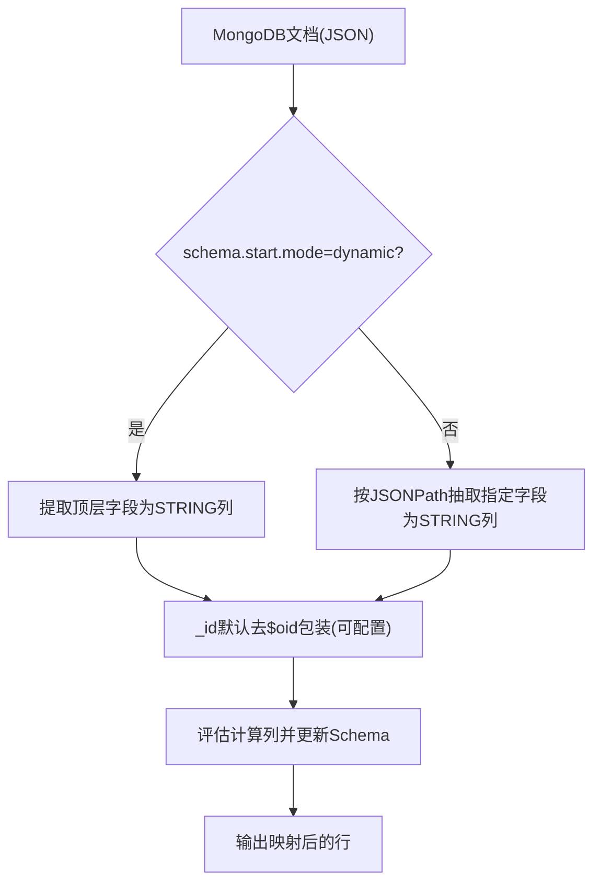
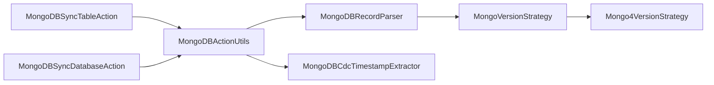

# MongoDB CDC

<cite>
**本文引用的文件**
- [mongo-cdc.md](file://docs/content/cdc-ingestion/mongo-cdc.md)
- [MongoDBSyncTableAction.java](file://paimon-flink/paimon-flink-cdc/src/main/java/org/apache/paimon/flink/action/cdc/mongodb/MongoDBSyncTableAction.java)
- [MongoDBSyncDatabaseAction.java](file://paimon-flink/paimon-flink-cdc/src/main/java/org/apache/paimon/flink/action/cdc/mongodb/MongoDBSyncDatabaseAction.java)
- [MongoDBActionUtils.java](file://paimon-flink/paimon-flink-cdc/src/main/java/org/apache/paimon/flink/action/cdc/mongodb/MongoDBActionUtils.java)
- [MongoDBSchemaUtils.java](file://paimon-flink/paimon-flink-cdc/src/main/java/org/apache/paimon/flink/action/cdc/mongodb/MongoDBSchemaUtils.java)
- [MongoDBRecordParser.java](file://paimon-flink/paimon-flink-cdc/src/main/java/org/apache/paimon/flink/action/cdc/mongodb/MongoDBRecordParser.java)
- [MongoVersionStrategy.java](file://paimon-flink/paimon-flink-cdc/src/main/java/org/apache/paimon/flink/action/cdc/mongodb/strategy/MongoVersionStrategy.java)
- [Mongo4VersionStrategy.java](file://paimon-flink/paimon-flink-cdc/src/main/java/org/apache/paimon/flink/action/cdc/mongodb/strategy/Mongo4VersionStrategy.java)
- [MongoDBCdcTimestampExtractor.java](file://paimon-flink/paimon-flink-cdc/src/main/java/org/apache/paimon/flink/action/cdc/mongodb/MongoDBCdcTimestampExtractor.java)
- [CdcDebeziumTimestampExtractorITCase.java](file://paimon-flink/paimon-flink-cdc/src/test/java/org/apache/paimon/flink/action/cdc/CdcDebeziumTimestampExtractorITCase.java)
- [DebeziumBsonRecordParser.java](file://paimon-flink/paimon-flink-cdc/src/main/java/org/apache/paimon/flink/action/cdc/format/debezium/DebeziumBsonRecordParser.java)
</cite>

## 目录
1. [简介](#简介)
2. [项目结构](#项目结构)
3. [核心组件](#核心组件)
4. [架构总览](#架构总览)
5. [详细组件分析](#详细组件分析)
6. [依赖分析](#依赖分析)
7. [性能考虑](#性能考虑)
8. [故障排查指南](#故障排查指南)
9. [结论](#结论)
10. [附录](#附录)

## 简介
本章节面向使用 Apache Paimon 进行 MongoDB CDC 同步的用户，系统性介绍 MongoDB 变更流（Change Stream）与 Oplog 的工作机制、变更事件监听流程、表级与库级同步模式的实现差异、文档结构映射与嵌套字段处理策略、连接配置与认证设置、时间戳与增量同步机制、复杂数据类型的转换规则，并提供可操作的配置示例与性能优化建议。

## 项目结构
MongoDB CDC 能力主要由以下模块组成：
- 动作入口：表级同步与库级同步动作类，负责构建 Flink 源、提取时间戳提取器、校验主键要求等。
- 源构建工具：封装 MongoDB CDC 源的构建逻辑，包括认证、启动模式、批大小、心跳间隔、轮询参数等。
- 记录解析器：将 CDC 消息反序列化为 JSON，按命名空间抽取数据库与集合名，并委派给版本策略进行记录提取。
- 版本策略：根据 MongoDB 版本选择具体策略，当前默认针对 4.x~6.x 的通用格式进行处理；支持动态/指定字段两种模式。
- 时间戳提取器：从 CDC 记录中提取事件时间戳，用于水位线推进与增量同步。
- 模式工具：根据配置决定是“动态”从首个文档推断 Schema，还是“指定”字段映射生成 Schema。

**图表来源**
- [MongoDBSyncTableAction.java:51-80](file://paimon-flink/paimon-flink-cdc/src/main/java/org/apache/paimon/flink/action/cdc/mongodb/MongoDBSyncTableAction.java#L51-L80)
- [MongoDBSyncDatabaseAction.java:52-79](file://paimon-flink/paimon-flink-cdc/src/main/java/org/apache/paimon/flink/action/cdc/mongodb/MongoDBSyncDatabaseAction.java#L52-L79)
- [MongoDBActionUtils.java:90-149](file://paimon-flink/paimon-flink-cdc/src/main/java/org/apache/paimon/flink/action/cdc/mongodb/MongoDBActionUtils.java#L90-L149)
- [MongoDBRecordParser.java:66-101](file://paimon-flink/paimon-flink-cdc/src/main/java/org/apache/paimon/flink/action/cdc/mongodb/MongoDBRecordParser.java#L66-L101)
- [MongoVersionStrategy.java:47-113](file://paimon-flink/paimon-flink-cdc/src/main/java/org/apache/paimon/flink/action/cdc/mongodb/strategy/MongoVersionStrategy.java#L47-L113)
- [Mongo4VersionStrategy.java:40-131](file://paimon-flink/paimon-flink-cdc/src/main/java/org/apache/paimon/flink/action/cdc/mongodb/strategy/Mongo4VersionStrategy.java#L40-L131)
- [MongoDBCdcTimestampExtractor.java:29-31](file://paimon-flink/paimon-flink-cdc/src/main/java/org/apache/paimon/flink/action/cdc/mongodb/MongoDBCdcTimestampExtractor.java#L29-L31)

**章节来源**
- [mongo-cdc.md:40-252](file://docs/content/cdc-ingestion/mongo-cdc.md#L40-L252)
- [MongoDBSyncTableAction.java:51-80](file://paimon-flink/paimon-flink-cdc/src/main/java/org/apache/paimon/flink/action/cdc/mongodb/MongoDBSyncTableAction.java#L51-L80)
- [MongoDBSyncDatabaseAction.java:52-79](file://paimon-flink/paimon-flink-cdc/src/main/java/org/apache/paimon/flink/action/cdc/mongodb/MongoDBSyncDatabaseAction.java#L52-L79)
- [MongoDBActionUtils.java:90-149](file://paimon-flink/paimon-flink-cdc/src/main/java/org/apache/paimon/flink/action/cdc/mongodb/MongoDBActionUtils.java#L90-L149)
- [MongoDBRecordParser.java:66-101](file://paimon-flink/paimon-flink-cdc/src/main/java/org/apache/paimon/flink/action/cdc/mongodb/MongoDBRecordParser.java#L66-L101)
- [MongoVersionStrategy.java:47-113](file://paimon-flink/paimon-flink-cdc/src/main/java/org/apache/paimon/flink/action/cdc/mongodb/strategy/MongoVersionStrategy.java#L47-L113)
- [Mongo4VersionStrategy.java:40-131](file://paimon-flink/paimon-flink-cdc/src/main/java/org/apache/paimon/flink/action/cdc/mongodb/strategy/Mongo4VersionStrategy.java#L40-L131)
- [MongoDBCdcTimestampExtractor.java:29-31](file://paimon-flink/paimon-flink-cdc/src/main/java/org/apache/paimon/flink/action/cdc/mongodb/MongoDBCdcTimestampExtractor.java#L29-L31)

## 核心组件
- 表级同步动作：负责单集合到单表的同步，自动推断或按指定字段映射生成 Schema，并确保主键为 _id。
- 库级同步动作：负责整库同步，支持前缀/后缀、包含/排除正则表达式，自动为每个集合创建或比对表结构。
- 源构建工具：统一构建 MongoDB CDC 源，支持用户名/密码、连接选项、批大小、心跳间隔、轮询等待时间、启动模式（initial/latest-offset/timestamp/snapshot）、反序列化器等。
- 记录解析器：从 CDC 消息中提取命名空间信息，选择版本策略并输出多路记录。
- 版本策略：统一处理 operationType（insert/update/replace/delete），动态/指定字段模式，_id 默认生成策略（去除 $oid 包装或保留原样）。
- 时间戳提取器：从 CDC 记录 ts_ms 字段提取事件时间戳，用于水位线推进与增量同步。

**章节来源**
- [mongo-cdc.md:40-252](file://docs/content/cdc-ingestion/mongo-cdc.md#L40-L252)
- [MongoDBSyncTableAction.java:51-80](file://paimon-flink/paimon-flink-cdc/src/main/java/org/apache/paimon/flink/action/cdc/mongodb/MongoDBSyncTableAction.java#L51-L80)
- [MongoDBSyncDatabaseAction.java:52-79](file://paimon-flink/paimon-flink-cdc/src/main/java/org/apache/paimon/flink/action/cdc/mongodb/MongoDBSyncDatabaseAction.java#L52-L79)
- [MongoDBActionUtils.java:90-149](file://paimon-flink/paimon-flink-cdc/src/main/java/org/apache/paimon/flink/action/cdc/mongodb/MongoDBActionUtils.java#L90-L149)
- [MongoDBRecordParser.java:66-101](file://paimon-flink/paimon-flink-cdc/src/main/java/org/apache/paimon/flink/action/cdc/mongodb/MongoDBRecordParser.java#L66-L101)
- [MongoVersionStrategy.java:47-113](file://paimon-flink/paimon-flink-cdc/src/main/java/org/apache/paimon/flink/action/cdc/mongodb/strategy/MongoVersionStrategy.java#L47-L113)
- [MongoDBCdcTimestampExtractor.java:29-31](file://paimon-flink/paimon-flink-cdc/src/main/java/org/apache/paimon/flink/action/cdc/mongodb/MongoDBCdcTimestampExtractor.java#L29-L31)

## 架构总览
下图展示了从 MongoDB CDC 源到 Paimon 写入的整体流程：动作类构建源并设置时间戳提取器；记录解析器将 CDC 消息转为 JSON 并按命名空间分发；版本策略根据 operationType 生成插入/更新/删除记录；最终写入 Paimon 表。

**图表来源**
- [MongoDBSyncTableAction.java:51-80](file://paimon-flink/paimon-flink-cdc/src/main/java/org/apache/paimon/flink/action/cdc/mongodb/MongoDBSyncTableAction.java#L51-L80)
- [MongoDBSyncDatabaseAction.java:52-79](file://paimon-flink/paimon-flink-cdc/src/main/java/org/apache/paimon/flink/action/cdc/mongodb/MongoDBSyncDatabaseAction.java#L52-L79)
- [MongoDBActionUtils.java:90-149](file://paimon-flink/paimon-flink-cdc/src/main/java/org/apache/paimon/flink/action/cdc/mongodb/MongoDBActionUtils.java#L90-L149)
- [MongoDBRecordParser.java:66-101](file://paimon-flink/paimon-flink-cdc/src/main/java/org/apache/paimon/flink/action/cdc/mongodb/MongoDBRecordParser.java#L66-L101)
- [MongoVersionStrategy.java:47-113](file://paimon-flink/paimon-flink-cdc/src/main/java/org/apache/paimon/flink/action/cdc/mongodb/strategy/MongoVersionStrategy.java#L47-L113)
- [MongoDBCdcTimestampExtractor.java:29-31](file://paimon-flink/paimon-flink-cdc/src/main/java/org/apache/paimon/flink/action/cdc/mongodb/MongoDBCdcTimestampExtractor.java#L29-L31)

## 详细组件分析

### 组件A：表级同步与库级同步
- 表级同步动作：校验目标数据库/表存在性，构建源时使用“数据库.集合”的精确匹配；时间戳提取器由工具方法创建。
- 库级同步动作：支持包含/排除正则表达式，自动为新增集合纳入同步；要求所有集合主键为 _id。

**图表来源**
- [MongoDBSyncTableAction.java:51-80](file://paimon-flink/paimon-flink-cdc/src/main/java/org/apache/paimon/flink/action/cdc/mongodb/MongoDBSyncTableAction.java#L51-L80)
- [MongoDBSyncDatabaseAction.java:52-79](file://paimon-flink/paimon-flink-cdc/src/main/java/org/apache/paimon/flink/action/cdc/mongodb/MongoDBSyncDatabaseAction.java#L52-L79)
- [MongoDBActionUtils.java:90-149](file://paimon-flink/paimon-flink-cdc/src/main/java/org/apache/paimon/flink/action/cdc/mongodb/MongoDBActionUtils.java#L90-L149)

**章节来源**
- [MongoDBSyncTableAction.java:51-80](file://paimon-flink/paimon-flink-cdc/src/main/java/org/apache/paimon/flink/action/cdc/mongodb/MongoDBSyncTableAction.java#L51-L80)
- [MongoDBSyncDatabaseAction.java:52-79](file://paimon-flink/paimon-flink-cdc/src/main/java/org/apache/paimon/flink/action/cdc/mongodb/MongoDBSyncDatabaseAction.java#L52-L79)
- [mongo-cdc.md:185-252](file://docs/content/cdc-ingestion/mongo-cdc.md#L185-L252)

### 组件B：源构建与连接配置
- 支持的配置项：主机列表、用户名、密码、连接选项、批大小、心跳间隔、协议、轮询最大批次、轮询等待时间、启动模式（initial/latest-offset/timestamp/snapshot）。
- 启动模式映射：initial 对应初始快照，latest-offset 对应最新偏移，timestamp 使用毫秒级时间戳，snapshot 仅快照。
- 反序列化器：使用 Debezium JSON 反序列化，Decimal 以数值形式输出，保证数值精度。

**图表来源**
- [MongoDBActionUtils.java:90-149](file://paimon-flink/paimon-flink-cdc/src/main/java/org/apache/paimon/flink/action/cdc/mongodb/MongoDBActionUtils.java#L90-L149)

**章节来源**
- [MongoDBActionUtils.java:90-149](file://paimon-flink/paimon-flink-cdc/src/main/java/org/apache/paimon/flink/action/cdc/mongodb/MongoDBActionUtils.java#L90-L149)
- [mongo-cdc.md:40-79](file://docs/content/cdc-ingestion/mongo-cdc.md#L40-L79)

### 组件C：记录解析与版本策略
- 命名空间解析：从 CDC 消息中提取数据库与集合名称，选择对应策略。
- 版本策略：当前默认 Mongo4VersionStrategy，处理 operationType（insert/update/replace/delete），并委派 getExtractRow 完成字段抽取与类型声明。
- 字段抽取模式：
  - 动态模式：直接将顶层字段作为列，类型均为 STRING。
  - 指定模式：通过 JSONPath 指定字段路径与列名，再进行类型声明与计算列评估。

**图表来源**
- [MongoDBRecordParser.java:66-101](file://paimon-flink/paimon-flink-cdc/src/main/java/org/apache/paimon/flink/action/cdc/mongodb/MongoDBRecordParser.java#L66-L101)
- [MongoVersionStrategy.java:47-113](file://paimon-flink/paimon-flink-cdc/src/main/java/org/apache/paimon/flink/action/cdc/mongodb/strategy/MongoVersionStrategy.java#L47-L113)
- [Mongo4VersionStrategy.java:40-131](file://paimon-flink/paimon-flink-cdc/src/main/java/org/apache/paimon/flink/action/cdc/mongodb/strategy/Mongo4VersionStrategy.java#L40-L131)

**章节来源**
- [MongoDBRecordParser.java:66-101](file://paimon-flink/paimon-flink-cdc/src/main/java/org/apache/paimon/flink/action/cdc/mongodb/MongoDBRecordParser.java#L66-L101)
- [MongoVersionStrategy.java:47-113](file://paimon-flink/paimon-flink-cdc/src/main/java/org/apache/paimon/flink/action/cdc/mongodb/strategy/MongoVersionStrategy.java#L47-L113)
- [mongo-cdc.md:62-136](file://docs/content/cdc-ingestion/mongo-cdc.md#L62-L136)

### 组件D：时间戳处理与增量同步
- 时间戳提取：从 CDC 记录 ts_ms 字段提取毫秒级时间戳；对于 schema-change 事件 ts_ms 为空时，采用特殊标记跳过。
- 增量同步：结合启动模式（timestamp/latest-offset）与水位线推进，实现从指定时间点或最新位置开始的连续增量同步。

**图表来源**
- [MongoDBCdcTimestampExtractor.java:29-31](file://paimon-flink/paimon-flink-cdc/src/main/java/org/apache/paimon/flink/action/cdc/mongodb/MongoDBCdcTimestampExtractor.java#L29-L31)
- [CdcDebeziumTimestampExtractorITCase.java:72-78](file://paimon-flink/paimon-flink-cdc/src/test/java/org/apache/paimon/flink/action/cdc/CdcDebeziumTimestampExtractorITCase.java#L72-L78)

**章节来源**
- [MongoDBCdcTimestampExtractor.java:29-31](file://paimon-flink/paimon-flink-cdc/src/main/java/org/apache/paimon/flink/action/cdc/mongodb/MongoDBCdcTimestampExtractor.java#L29-L31)
- [CdcDebeziumTimestampExtractorITCase.java:72-78](file://paimon-flink/paimon-flink-cdc/src/test/java/org/apache/paimon/flink/action/cdc/CdcDebeziumTimestampExtractorITCase.java#L72-L78)
- [mongo-cdc.md:126-136](file://docs/content/cdc-ingestion/mongo-cdc.md#L126-L136)

### 组件E：文档结构映射与嵌套字段处理
- 动态模式：将顶层字段作为列，类型统一为 STRING，避免因 MongoDB 动态 Schema 导致的类型不一致问题。
- 指定模式：通过 JSONPath 精准抽取嵌套字段，支持函数式计算列，便于在 Paimon 中进行二次加工。
- _id 处理：默认去除 $oid 包装，简化主键表示；也可保留原始结构以便需要时使用。

**图表来源**
- [MongoVersionStrategy.java:79-113](file://paimon-flink/paimon-flink-cdc/src/main/java/org/apache/paimon/flink/action/cdc/mongodb/strategy/MongoVersionStrategy.java#L79-L113)
- [mongo-cdc.md:62-136](file://docs/content/cdc-ingestion/mongo-cdc.md#L62-L136)

**章节来源**
- [MongoVersionStrategy.java:79-113](file://paimon-flink/paimon-flink-cdc/src/main/java/org/apache/paimon/flink/action/cdc/mongodb/strategy/MongoVersionStrategy.java#L79-L113)
- [mongo-cdc.md:62-136](file://docs/content/cdc-ingestion/mongo-cdc.md#L62-L136)

### 组件F：复杂数据类型支持与转换规则
- 数值类型：Decimal 以数值形式输出，避免科学计数或字符串化导致的精度丢失。
- BSON 文档转换：在 Debezium BSON 场景下，将 BSON 文档转换为 JSON 字符串，逐字段递归序列化为 STRING，确保兼容性。
- 类型一致性：MongoDB CDC 变更流不携带类型定义，统一 STRING 列满足大多数场景；如需强类型，可在 Paimon 中通过计算列进行二次转换。

**章节来源**
- [MongoDBActionUtils.java:143-146](file://paimon-flink/paimon-flink-cdc/src/main/java/org/apache/paimon/flink/action/cdc/mongodb/MongoDBActionUtils.java#L143-L146)
- [DebeziumBsonRecordParser.java:110-143](file://paimon-flink/paimon-flink-cdc/src/main/java/org/apache/paimon/flink/action/cdc/format/debezium/DebeziumBsonRecordParser.java#L110-L143)
- [mongo-cdc.md:126-136](file://docs/content/cdc-ingestion/mongo-cdc.md#L126-L136)

## 依赖分析
- 动作类依赖源构建工具与时间戳提取器，二者共同决定 CDC 源的配置与事件时间戳来源。
- 记录解析器依赖版本策略接口与具体实现，以适配不同 MongoDB 版本的消息格式。
- 模式工具根据配置决定 Schema 获取方式（动态/指定），并与版本策略配合完成字段抽取与类型声明。

**图表来源**
- [MongoDBSyncTableAction.java:51-80](file://paimon-flink/paimon-flink-cdc/src/main/java/org/apache/paimon/flink/action/cdc/mongodb/MongoDBSyncTableAction.java#L51-L80)
- [MongoDBSyncDatabaseAction.java:52-79](file://paimon-flink/paimon-flink-cdc/src/main/java/org/apache/paimon/flink/action/cdc/mongodb/MongoDBSyncDatabaseAction.java#L52-L79)
- [MongoDBActionUtils.java:90-149](file://paimon-flink/paimon-flink-cdc/src/main/java/org/apache/paimon/flink/action/cdc/mongodb/MongoDBActionUtils.java#L90-L149)
- [MongoDBRecordParser.java:66-101](file://paimon-flink/paimon-flink-cdc/src/main/java/org/apache/paimon/flink/action/cdc/mongodb/MongoDBRecordParser.java#L66-L101)
- [MongoVersionStrategy.java:47-113](file://paimon-flink/paimon-flink-cdc/src/main/java/org/apache/paimon/flink/action/cdc/mongodb/strategy/MongoVersionStrategy.java#L47-L113)
- [Mongo4VersionStrategy.java:40-131](file://paimon-flink/paimon-flink-cdc/src/main/java/org/apache/paimon/flink/action/cdc/mongodb/strategy/Mongo4VersionStrategy.java#L40-L131)
- [MongoDBCdcTimestampExtractor.java:29-31](file://paimon-flink/paimon-flink-cdc/src/main/java/org/apache/paimon/flink/action/cdc/mongodb/MongoDBCdcTimestampExtractor.java#L29-L31)

**章节来源**
- [MongoDBSyncTableAction.java:51-80](file://paimon-flink/paimon-flink-cdc/src/main/java/org/apache/paimon/flink/action/cdc/mongodb/MongoDBSyncTableAction.java#L51-L80)
- [MongoDBSyncDatabaseAction.java:52-79](file://paimon-flink/paimon-flink-cdc/src/main/java/org/apache/paimon/flink/action/cdc/mongodb/MongoDBSyncDatabaseAction.java#L52-L79)
- [MongoDBActionUtils.java:90-149](file://paimon-flink/paimon-flink-cdc/src/main/java/org/apache/paimon/flink/action/cdc/mongodb/MongoDBActionUtils.java#L90-L149)
- [MongoDBRecordParser.java:66-101](file://paimon-flink/paimon-flink-cdc/src/main/java/org/apache/paimon/flink/action/cdc/mongodb/MongoDBRecordParser.java#L66-L101)
- [MongoVersionStrategy.java:47-113](file://paimon-flink/paimon-flink-cdc/src/main/java/org/apache/paimon/flink/action/cdc/mongodb/strategy/MongoVersionStrategy.java#L47-L113)
- [Mongo4VersionStrategy.java:40-131](file://paimon-flink/paimon-flink-cdc/src/main/java/org/apache/paimon/flink/action/cdc/mongodb/strategy/Mongo4VersionStrategy.java#L40-L131)
- [MongoDBCdcTimestampExtractor.java:29-31](file://paimon-flink/paimon-flink-cdc/src/main/java/org/apache/paimon/flink/action/cdc/mongodb/MongoDBCdcTimestampExtractor.java#L29-L31)

## 性能考虑
- 批处理与轮询：合理设置批大小与轮询等待时间，平衡延迟与吞吐；心跳间隔影响变更检测频率。
- 启动模式：首次全量快照后切换至 latest-offset 或 timestamp 模式，减少重复扫描。
- 字段抽取：在指定模式下仅抽取必要字段，降低序列化与传输开销。
- 主键设计：统一使用 _id 作为主键，有利于 Upsert 写入与去重。
- 计算列：尽量在上游 CDC 层面完成简单计算，避免在 Paimon 写入阶段做重型计算。

[本节为通用性能建议，无需特定文件引用]

## 故障排查指南
- 启动模式非法：当 scan.startup.mode 非法时会抛出异常，确认值是否为 initial/latest-offset/timestamp/snapshot。
- 缺少 _id：动态模式下若文档不含 _id 将报错，请确保集合具备主键或在指定模式下显式映射。
- BSON 与 JSON：若上游为 BSON，确保反序列化器正确处理；转换为 JSON 字符串后再逐字段序列化为 STRING。
- 时间戳异常：schema-change 事件 ts_ms 为空时会被忽略；检查 CDC 源配置与事件类型。

**章节来源**
- [MongoDBActionUtils.java:120-141](file://paimon-flink/paimon-flink-cdc/src/main/java/org/apache/paimon/flink/action/cdc/mongodb/MongoDBActionUtils.java#L120-L141)
- [MongoVersionStrategy.java:89-93](file://paimon-flink/paimon-flink-cdc/src/main/java/org/apache/paimon/flink/action/cdc/mongodb/strategy/MongoVersionStrategy.java#L89-L93)
- [MongoDBCdcTimestampExtractor.java:29-31](file://paimon-flink/paimon-flink-cdc/src/main/java/org/apache/paimon/flink/action/cdc/mongodb/MongoDBCdcTimestampExtractor.java#L29-L31)
- [CdcDebeziumTimestampExtractorITCase.java:72-78](file://paimon-flink/paimon-flink-cdc/src/test/java/org/apache/paimon/flink/action/cdc/CdcDebeziumTimestampExtractorITCase.java#L72-L78)

## 结论
Paimon 的 MongoDB CDC 集成通过动作类、源构建工具、记录解析器与版本策略的协同，实现了对 MongoDB 变更流的高效解析与同步。表级与库级两种模式覆盖了从单集合到整库的多种场景；动态/指定两种 Schema 获取模式兼顾灵活性与可控性；统一的 STRING 类型与 _id 主键约定简化了上下游对接。结合合理的批处理参数与启动模式，可获得稳定且高性能的增量同步能力。

[本节为总结性内容，无需特定文件引用]

## 附录
- 配置示例与用法请参考官方文档中的“同步表”与“同步数据库”示例命令与参数说明。
- 若需进一步了解 CDC 源的完整配置项，请参阅官方 Flink CDC 文档中 MongoDB CDC 的 Connector Options。

**章节来源**
- [mongo-cdc.md:40-252](file://docs/content/cdc-ingestion/mongo-cdc.md#L40-L252)