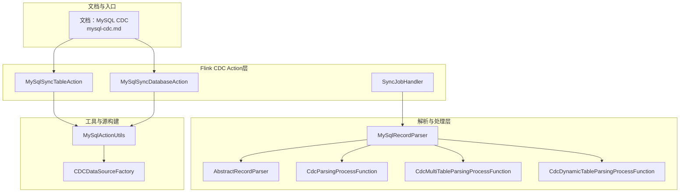
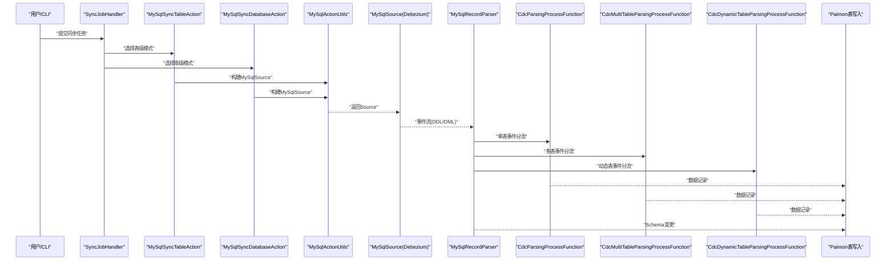
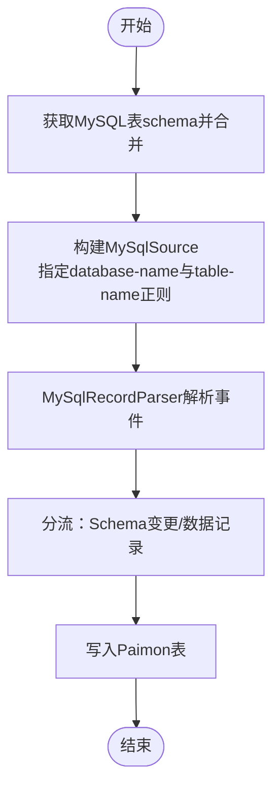
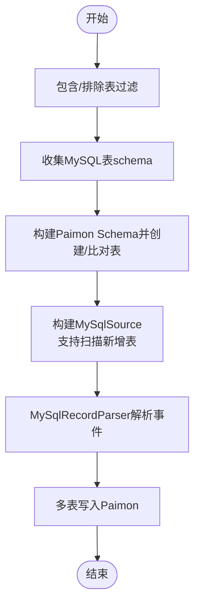
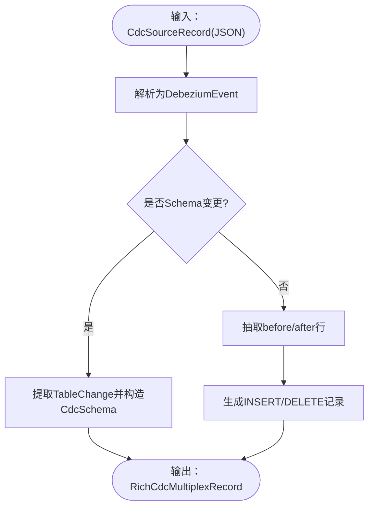
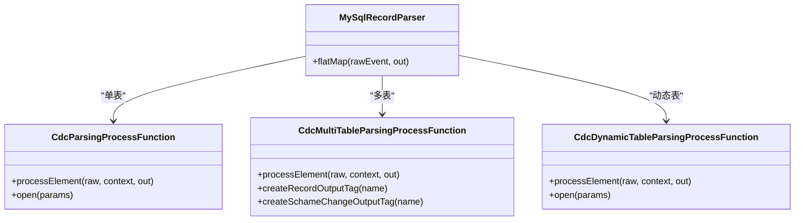
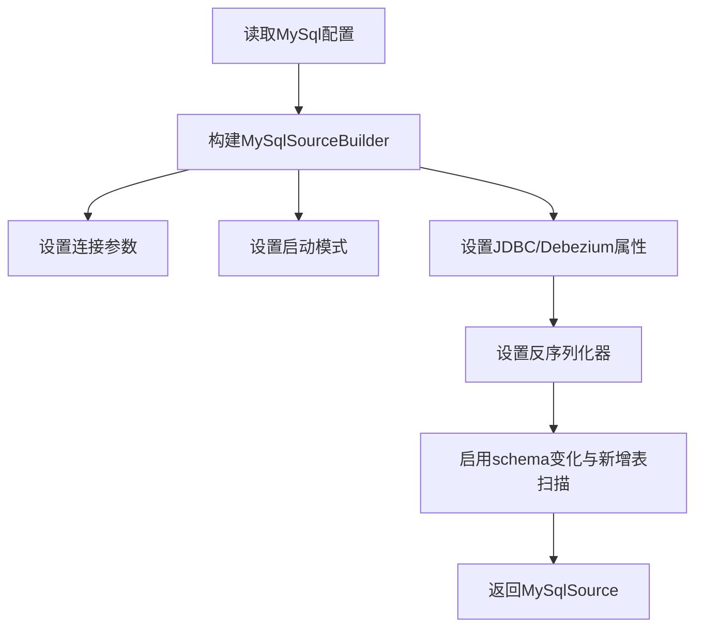
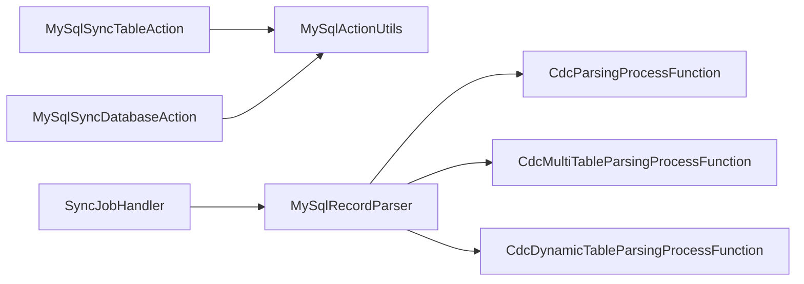

# MySQL CDC

<cite>
**本文引用的文件**
- [mysql-cdc.md](file://docs/content/cdc-ingestion/mysql-cdc.md)
- [MySqlSyncTableAction.java](file://paimon-flink/paimon-flink-cdc/src/main/java/org/apache/paimon/flink/action/cdc/mysql/MySqlSyncTableAction.java)
- [MySqlSyncDatabaseAction.java](file://paimon-flink/paimon-flink-cdc/src/main/java/org/apache/paimon/flink/action/cdc/mysql/MySqlSyncDatabaseAction.java)
- [MySqlRecordParser.java](file://paimon-flink/paimon-flink-cdc/src/main/java/org/apache/paimon/flink/action/cdc/mysql/MySqlRecordParser.java)
- [MySqlActionUtils.java](file://paimon-flink/paimon-flink-cdc/src/main/java/org/apache/paimon/flink/action/cdc/mysql/MySqlActionUtils.java)
- [SyncJobHandler.java](file://paimon-flink/paimon-flink-cdc/src/main/java/org/apache/paimon/flink/action/cdc/SyncJobHandler.java)
- [CdcParsingProcessFunction.java](file://paimon-flink/paimon-flink-cdc/src/main/java/org/apache/paimon/flink/sink/cdc/CdcParsingProcessFunction.java)
- [CdcMultiTableParsingProcessFunction.java](file://paimon-flink/paimon-flink-cdc/src/main/java/org/apache/paimon/flink/sink/cdc/CdcMultiTableParsingProcessFunction.java)
- [CdcDynamicTableParsingProcessFunction.java](file://paimon-flink/paimon-flink-cdc/src/main/java/org/apache/paimon/flink/sink/cdc/CdcDynamicTableParsingProcessFunction.java)
- [AbstractRecordParser.java](file://paimon-flink/paimon-flink-cdc/src/main/java/org/apache/paimon/flink/sink/cdc/format/AbstractRecordParser.java)
- [CDCDataSourceFactory.java](file://paimon-flink/paimon-flink-cdc/src/main/java/org/apache/paimon/flink/pipeline/cdc/source/CDCDataSourceFactory.java)
- [my.cnf（测试）](file://paimon-flink/paimon-flink-cdc/src/test/resources/mysql/my.cnf)
- [my.cnf（E2E测试）](file://paimon-e2e-tests/src/test/resources/mysql/my.cnf)
</cite>

## 目录
1. [简介](#简介)
2. [项目结构](#项目结构)
3. [核心组件](#核心组件)
4. [架构总览](#架构总览)
5. [详细组件分析](#详细组件分析)
6. [依赖关系分析](#依赖关系分析)
7. [性能考量](#性能考量)
8. [故障排除指南](#故障排除指南)
9. [结论](#结论)
10. [附录](#附录)

## 简介
本章节面向希望在Apache Paimon中集成并使用MySQL CDC（变更数据捕获）的用户，系统性地讲解以下内容：
- MySQL CDC的工作原理与实现机制
- MySQL Binlog的解析与处理流程
- 表级同步与库级同步两种模式的区别与适用场景
- 配置参数详解（连接参数、过滤规则、schema映射等）
- 数据类型映射规则与特殊处理
- 增量同步与全量初始化过程
- 具体配置示例与代码实现路径
- 性能优化建议与故障排除指南

## 项目结构
围绕MySQL CDC功能，Paimon在Flink CDC生态之上提供了高层Action封装与解析器、处理函数等模块，形成“配置驱动 + 解析转换 + 写入落库”的完整链路。

图示来源
- [mysql-cdc.md:27-272](file://docs/content/cdc-ingestion/mysql-cdc.md#L27-L272)
- [MySqlSyncTableAction.java:74-134](file://paimon-flink/paimon-flink-cdc/src/main/java/org/apache/paimon/flink/action/cdc/mysql/MySqlSyncTableAction.java#L74-L134)
- [MySqlSyncDatabaseAction.java:94-269](file://paimon-flink/paimon-flink-cdc/src/main/java/org/apache/paimon/flink/action/cdc/mysql/MySqlSyncDatabaseAction.java#L94-L269)
- [MySqlRecordParser.java:73-304](file://paimon-flink/paimon-flink-cdc/src/main/java/org/apache/paimon/flink/action/cdc/mysql/MySqlRecordParser.java#L73-L304)
- [AbstractRecordParser.java:50-60](file://paimon-flink/paimon-flink-cdc/src/main/java/org/apache/paimon/flink/sink/cdc/format/AbstractRecordParser.java#L50-L60)
- [CdcParsingProcessFunction.java:37-74](file://paimon-flink/paimon-flink-cdc/src/main/java/org/apache/paimon/flink/sink/cdc/CdcParsingProcessFunction.java#L37-L74)
- [CdcMultiTableParsingProcessFunction.java:67-97](file://paimon-flink/paimon-flink-cdc/src/main/java/org/apache/paimon/flink/sink/cdc/CdcMultiTableParsingProcessFunction.java#L67-L97)
- [CdcDynamicTableParsingProcessFunction.java:63-98](file://paimon-flink/paimon-flink-cdc/src/main/java/org/apache/paimon/flink/sink/cdc/CdcDynamicTableParsingProcessFunction.java#L63-L98)
- [MySqlActionUtils.java:63-312](file://paimon-flink/paimon-flink-cdc/src/main/java/org/apache/paimon/flink/action/cdc/mysql/MySqlActionUtils.java#L63-L312)
- [CDCDataSourceFactory.java:100-119](file://paimon-flink/paimon-flink-cdc/src/main/java/org/apache/paimon/flink/pipeline/cdc/source/CDCDataSourceFactory.java#L100-L119)

章节来源
- [mysql-cdc.md:27-272](file://docs/content/cdc-ingestion/mysql-cdc.md#L27-L272)

## 核心组件
- 同步动作（MySqlSyncTableAction / MySqlSyncDatabaseAction）
  - 负责根据用户配置构建MySQL CDC源、推断目标表schema、生成写入任务。
  - 支持表级同步与库级同步两种模式；库级模式支持包含/排除表、分片合并、兼容性校验等。
- 记录解析器（MySqlRecordParser）
  - 将Debezium JSON事件解析为RichCdcMultiplexRecord，抽取schema变更与数据变更，支持计算列与元数据列。
- 处理函数（CdcParsingProcessFunction / CdcMultiTableParsingProcessFunction / CdcDynamicTableParsingProcessFunction）
  - 将原始事件分流为schema变更与数据记录，并按表名侧输出，便于后续多表写入。
- 工具类（MySqlActionUtils）
  - 构建MySqlSource、解析启动选项、JDBC属性与类型映射、注册驱动等。
- 源工厂（CDCDataSourceFactory）
  - 提供CDC数据源的统一入口与可选配置项。

章节来源
- [MySqlSyncTableAction.java:74-134](file://paimon-flink/paimon-flink-cdc/src/main/java/org/apache/paimon/flink/action/cdc/mysql/MySqlSyncTableAction.java#L74-L134)
- [MySqlSyncDatabaseAction.java:94-269](file://paimon-flink/paimon-flink-cdc/src/main/java/org/apache/paimon/flink/action/cdc/mysql/MySqlSyncDatabaseAction.java#L94-L269)
- [MySqlRecordParser.java:73-304](file://paimon-flink/paimon-flink-cdc/src/main/java/org/apache/paimon/flink/action/cdc/mysql/MySqlRecordParser.java#L73-L304)
- [CdcParsingProcessFunction.java:37-74](file://paimon-flink/paimon-flink-cdc/src/main/java/org/apache/paimon/flink/sink/cdc/CdcParsingProcessFunction.java#L37-L74)
- [CdcMultiTableParsingProcessFunction.java:67-97](file://paimon-flink/paimon-flink-cdc/src/main/java/org/apache/paimon/flink/sink/cdc/CdcMultiTableParsingProcessFunction.java#L67-L97)
- [CdcDynamicTableParsingProcessFunction.java:63-98](file://paimon-flink/paimon-flink-cdc/src/main/java/org/apache/paimon/flink/sink/cdc/CdcDynamicTableParsingProcessFunction.java#L63-L98)
- [MySqlActionUtils.java:63-312](file://paimon-flink/paimon-flink-cdc/src/main/java/org/apache/paimon/flink/action/cdc/mysql/MySqlActionUtils.java#L63-L312)
- [CDCDataSourceFactory.java:100-119](file://paimon-flink/paimon-flink-cdc/src/main/java/org/apache/paimon/flink/pipeline/cdc/source/CDCDataSourceFactory.java#L100-L119)

## 架构总览
下图展示从MySQL CDC源到Paimon表写入的整体流程，涵盖全量快照、增量Binlog、schema演进与多表分流。

图示来源
- [SyncJobHandler.java:198-219](file://paimon-flink/paimon-flink-cdc/src/main/java/org/apache/paimon/flink/action/cdc/SyncJobHandler.java#L198-L219)
- [MySqlSyncTableAction.java:96-110](file://paimon-flink/paimon-flink-cdc/src/main/java/org/apache/paimon/flink/action/cdc/mysql/MySqlSyncTableAction.java#L96-L110)
- [MySqlSyncDatabaseAction.java:189-201](file://paimon-flink/paimon-flink-cdc/src/main/java/org/apache/paimon/flink/action/cdc/mysql/MySqlSyncDatabaseAction.java#L189-L201)
- [MySqlActionUtils.java:147-269](file://paimon-flink/paimon-flink-cdc/src/main/java/org/apache/paimon/flink/action/cdc/mysql/MySqlActionUtils.java#L147-L269)
- [MySqlRecordParser.java:118-130](file://paimon-flink/paimon-flink-cdc/src/main/java/org/apache/paimon/flink/action/cdc/mysql/MySqlRecordParser.java#L118-L130)
- [CdcParsingProcessFunction.java:64-73](file://paimon-flink/paimon-flink-cdc/src/main/java/org/apache/paimon/flink/sink/cdc/CdcParsingProcessFunction.java#L64-L73)
- [CdcMultiTableParsingProcessFunction.java:67-97](file://paimon-flink/paimon-flink-cdc/src/main/java/org/apache/paimon/flink/sink/cdc/CdcMultiTableParsingProcessFunction.java#L67-L97)
- [CdcDynamicTableParsingProcessFunction.java:89-98](file://paimon-flink/paimon-flink-cdc/src/main/java/org/apache/paimon/flink/sink/cdc/CdcDynamicTableParsingProcessFunction.java#L89-L98)

## 详细组件分析

### 组件A：表级同步（MySqlSyncTableAction）
- 功能要点
  - 将一个或多个MySQL表的变更汇聚到一个Paimon表中。
  - 自动推断schema并进行兼容性检查；不支持无主键表。
  - 支持通过正则表达式匹配多个表与数据库。
- 关键流程
  - 获取MySQL表schema信息并合并为Paimon表schema。
  - 构建MySqlSource，基于database-name与table-name正则组合tableList。
  - 使用MySqlRecordParser解析事件，分流schema变更与数据记录。
- 适用场景
  - 单表或多表聚合写入同一Paimon表。
  - 分库分表场景下，通过正则将同名表合并到一个Paimon表。

图示来源
- [MySqlSyncTableAction.java:86-110](file://paimon-flink/paimon-flink-cdc/src/main/java/org/apache/paimon/flink/action/cdc/mysql/MySqlSyncTableAction.java#L86-L110)
- [MySqlActionUtils.java:147-269](file://paimon-flink/paimon-flink-cdc/src/main/java/org/apache/paimon/flink/action/cdc/mysql/MySqlActionUtils.java#L147-L269)
- [MySqlRecordParser.java:118-130](file://paimon-flink/paimon-flink-cdc/src/main/java/org/apache/paimon/flink/action/cdc/mysql/MySqlRecordParser.java#L118-L130)

章节来源
- [MySqlSyncTableAction.java:74-134](file://paimon-flink/paimon-flink-cdc/src/main/java/org/apache/paimon/flink/action/cdc/mysql/MySqlSyncTableAction.java#L74-L134)

### 组件B：库级同步（MySqlSyncDatabaseAction）
- 功能要点
  - 将整个MySQL数据库的变更同步到一个Paimon数据库中。
  - 支持包含/排除表、分片合并、兼容性校验、忽略不兼容表等。
  - 对每个目标Paimon表分别构建写入sink，当前实现为多sink模式。
- 关键流程
  - 过滤待监控表（包含/排除正则），收集schema信息。
  - 逐表构建Paimon Schema并创建/比对现有表schema。
  - 构建MySqlSource，支持扫描新增表、按需恢复savepoint继续增量。
- 适用场景
  - 全库迁移与持续同步。
  - 多分片合并场景，将db.+\.tbl.+合并为test_db.tbl+。

图示来源
- [MySqlSyncDatabaseAction.java:115-182](file://paimon-flink/paimon-flink-cdc/src/main/java/org/apache/paimon/flink/action/cdc/mysql/MySqlSyncDatabaseAction.java#L115-L182)
- [MySqlActionUtils.java:147-269](file://paimon-flink/paimon-flink-cdc/src/main/java/org/apache/paimon/flink/action/cdc/mysql/MySqlActionUtils.java#L147-L269)
- [MySqlRecordParser.java:118-130](file://paimon-flink/paimon-flink-cdc/src/main/java/org/apache/paimon/flink/action/cdc/mysql/MySqlRecordParser.java#L118-L130)

章节来源
- [MySqlSyncDatabaseAction.java:94-269](file://paimon-flink/paimon-flink-cdc/src/main/java/org/apache/paimon/flink/action/cdc/mysql/MySqlSyncDatabaseAction.java#L94-L269)

### 组件C：MySQL事件解析与处理（MySqlRecordParser）
- 功能要点
  - 解析Debezium JSON事件，区分schema变更与数据变更。
  - 抽取表名、数据库名、字段类型与值，应用类型映射与计算列。
  - 支持元数据列注入（如binlog位置、时间戳等）。
- 关键流程
  - flatMap入口解析JSON为DebeziumEvent。
  - 若为schema变更，提取TableChange并构造CdcSchema。
  - 若为数据变更，抽取before/after，生成INSERT/DELETE记录。
  - 应用计算列与元数据列，输出RichCdcMultiplexRecord。

图示来源
- [MySqlRecordParser.java:118-130](file://paimon-flink/paimon-flink-cdc/src/main/java/org/apache/paimon/flink/action/cdc/mysql/MySqlRecordParser.java#L118-L130)
- [MySqlRecordParser.java:132-173](file://paimon-flink/paimon-flink-cdc/src/main/java/org/apache/paimon/flink/action/cdc/mysql/MySqlRecordParser.java#L132-L173)
- [MySqlRecordParser.java:206-223](file://paimon-flink/paimon-flink-cdc/src/main/java/org/apache/paimon/flink/action/cdc/mysql/MySqlRecordParser.java#L206-L223)
- [MySqlRecordParser.java:225-297](file://paimon-flink/paimon-flink-cdc/src/main/java/org/apache/paimon/flink/action/cdc/mysql/MySqlRecordParser.java#L225-L297)

章节来源
- [MySqlRecordParser.java:73-304](file://paimon-flink/paimon-flink-cdc/src/main/java/org/apache/paimon/flink/action/cdc/mysql/MySqlRecordParser.java#L73-L304)

### 组件D：处理函数与分流（CdcParsingProcessFunction / CdcMultiTableParsingProcessFunction / CdcDynamicTableParsingProcessFunction）
- 功能要点
  - 单表处理：将事件分流为schema变更与数据记录。
  - 多表处理：按表名侧输出schema变更与数据记录，便于多表写入。
  - 动态表处理：在单库模式下按表名动态分流。
- 关键点
  - 使用OutputTag区分不同表的schema变更与数据记录。
  - 保持解析器与处理函数解耦，便于扩展其他数据源。

图示来源
- [CdcParsingProcessFunction.java:37-74](file://paimon-flink/paimon-flink-cdc/src/main/java/org/apache/paimon/flink/sink/cdc/CdcParsingProcessFunction.java#L37-L74)
- [CdcMultiTableParsingProcessFunction.java:67-97](file://paimon-flink/paimon-flink-cdc/src/main/java/org/apache/paimon/flink/sink/cdc/CdcMultiTableParsingProcessFunction.java#L67-L97)
- [CdcDynamicTableParsingProcessFunction.java:63-98](file://paimon-flink/paimon-flink-cdc/src/main/java/org/apache/paimon/flink/sink/cdc/CdcDynamicTableParsingProcessFunction.java#L63-L98)
- [MySqlRecordParser.java:118-130](file://paimon-flink/paimon-flink-cdc/src/main/java/org/apache/paimon/flink/action/cdc/mysql/MySqlRecordParser.java#L118-L130)

章节来源
- [CdcParsingProcessFunction.java:37-74](file://paimon-flink/paimon-flink-cdc/src/main/java/org/apache/paimon/flink/sink/cdc/CdcParsingProcessFunction.java#L37-L74)
- [CdcMultiTableParsingProcessFunction.java:67-97](file://paimon-flink/paimon-flink-cdc/src/main/java/org/apache/paimon/flink/sink/cdc/CdcMultiTableParsingProcessFunction.java#L67-L97)
- [CdcDynamicTableParsingProcessFunction.java:63-98](file://paimon-flink/paimon-flink-cdc/src/main/java/org/apache/paimon/flink/sink/cdc/CdcDynamicTableParsingProcessFunction.java#L63-L98)

### 组件E：源构建与启动选项（MySqlActionUtils / CDCDataSourceFactory）
- 功能要点
  - 构建MySqlSource，设置主机、端口、用户名、密码、database-list、table-list等。
  - 支持多种启动模式：initial、earliest-offset、latest-offset、specific-offset、timestamp、snapshot。
  - 设置JDBC属性与Debezium属性，启用schema变化、增量快照参数等。
  - 注册MySQL驱动，确保运行时可用。
- 关键点
  - 增量快照使用splitSize替代JDBC fetchSize。
  - 支持扫描新增表开关scanNewlyAddedTableEnabled。

图示来源
- [MySqlActionUtils.java:147-269](file://paimon-flink/paimon-flink-cdc/src/main/java/org/apache/paimon/flink/action/cdc/mysql/MySqlActionUtils.java#L147-L269)
- [MySqlActionUtils.java:274-291](file://paimon-flink/paimon-flink-cdc/src/main/java/org/apache/paimon/flink/action/cdc/mysql/MySqlActionUtils.java#L274-L291)
- [MySqlActionUtils.java:293-310](file://paimon-flink/paimon-flink-cdc/src/main/java/org/apache/paimon/flink/action/cdc/mysql/MySqlActionUtils.java#L293-L310)
- [CDCDataSourceFactory.java:100-119](file://paimon-flink/paimon-flink-cdc/src/main/java/org/apache/paimon/flink/pipeline/cdc/source/CDCDataSourceFactory.java#L100-L119)

章节来源
- [MySqlActionUtils.java:63-312](file://paimon-flink/paimon-flink-cdc/src/main/java/org/apache/paimon/flink/action/cdc/mysql/MySqlActionUtils.java#L63-L312)
- [CDCDataSourceFactory.java:100-119](file://paimon-flink/paimon-flink-cdc/src/main/java/org/apache/paimon/flink/pipeline/cdc/source/CDCDataSourceFactory.java#L100-L119)

## 依赖关系分析
- 组件耦合
  - MySqlSyncTableAction / MySqlSyncDatabaseAction依赖MySqlActionUtils构建MySqlSource。
  - SyncJobHandler根据源类型选择对应的RecordParser（此处为MySqlRecordParser）。
  - 解析器与处理函数之间通过OutputTag实现弱耦合分流。
- 外部依赖
  - Flink CDC Connector MySQL（Debezium JSON）。
  - MySQL驱动（com.mysql.cj.jdbc.Driver或旧版com.mysql.jdbc.Driver）。
- 可能的循环依赖
  - 当前模块采用“Action -> Utils -> Source”的单向依赖，未见循环。

图示来源
- [MySqlSyncTableAction.java:96-110](file://paimon-flink/paimon-flink-cdc/src/main/java/org/apache/paimon/flink/action/cdc/mysql/MySqlSyncTableAction.java#L96-L110)
- [MySqlSyncDatabaseAction.java:189-201](file://paimon-flink/paimon-flink-cdc/src/main/java/org/apache/paimon/flink/action/cdc/mysql/MySqlSyncDatabaseAction.java#L189-L201)
- [SyncJobHandler.java:198-219](file://paimon-flink/paimon-flink-cdc/src/main/java/org/apache/paimon/flink/action/cdc/SyncJobHandler.java#L198-L219)
- [MySqlRecordParser.java:118-130](file://paimon-flink/paimon-flink-cdc/src/main/java/org/apache/paimon/flink/action/cdc/mysql/MySqlRecordParser.java#L118-L130)

章节来源
- [SyncJobHandler.java:182-219](file://paimon-flink/paimon-flink-cdc/src/main/java/org/apache/paimon/flink/action/cdc/SyncJobHandler.java#L182-L219)

## 性能考量
- 增量快照参数
  - 使用splitSize控制快照分片大小，提升并行度与稳定性。
  - distributionFactorLower/Upper影响分片均匀性，合理设置可避免热点。
  - splitMetaGroupSize用于分组元数据大小，平衡内存与吞吐。
- 连接与心跳
  - connectTimeout与connectMaxRetries提升连接健壮性。
  - heartbeatInterval用于维持长连接活跃，避免超时中断。
- 并发与背压
  - sink.parallelism与下游写入并行度需匹配，避免下游成为瓶颈。
  - changelog-producer/input可减少写放大，提高写入效率。
- 类型映射与计算列
  - 合理使用TypeMapping（如tinyint1-not-bool）减少类型转换开销。
  - 计算列尽量复用已解析字段，避免重复解析。

## 故障排除指南
- 中文乱码
  - 在Flink配置中设置字符集选项以解决中文乱码问题。
- 同步表/列注释
  - 创建表注释：启用useInformationSchema=true。
  - 修改表/列注释：启用Debezium schema comments选项。
- Binlog配置
  - 确保MySQL开启二进制日志（log_bin），并正确配置binlog格式与保留策略。
- 驱动加载
  - 若找不到MySQL驱动，确认已注册com.mysql.cj.jdbc.Driver或降级至旧版驱动。

章节来源
- [mysql-cdc.md:261-272](file://docs/content/cdc-ingestion/mysql-cdc.md#L261-L272)
- [my.cnf（测试）:49-51](file://paimon-flink/paimon-flink-cdc/src/test/resources/mysql/my.cnf#L49-L51)
- [my.cnf（E2E测试）:49-51](file://paimon-e2e-tests/src/test/resources/mysql/my.cnf#L49-L51)
- [MySqlActionUtils.java:293-310](file://paimon-flink/paimon-flink-cdc/src/main/java/org/apache/paimon/flink/action/cdc/mysql/MySqlActionUtils.java#L293-L310)

## 结论
Paimon的MySQL CDC能力基于Flink CDC Connector MySQL，通过高层Action与解析器、处理函数的协作，实现了从MySQL Binlog到Paimon表的高效同步。表级与库级两种模式覆盖了从单表聚合到全库同步的典型场景；结合类型映射、计算列与元数据列，满足复杂业务需求。通过合理的参数调优与运维保障，可在生产环境中获得稳定高效的CDC体验。

## 附录
- 配置参数速查（来源于文档与源码）
  - 连接参数
    - 主机、端口、用户名、密码、database-name、table-name（支持正则）、server-id、server-time-zone
  - 启动模式
    - initial、earliest-offset、latest-offset、specific-offset、timestamp、snapshot
  - 快照与并行
    - scan.incremental.snapshot.chunk-size、distribution-factor、split-meta-group-size
  - 连接与心跳
    - connect.timeout、connect.max.retries、connection.pool.size、heartbeat.interval
  - 新增表扫描
    - scan.newly-added-table.enabled
  - JDBC与Debezium属性
    - jdbc.properties.*、debezium.*（通过前缀传递）
  - 类型映射
    - tinyint1-not-bool与tinyInt1isBit冲突检测
  - 元数据列与计算列
    - metadata_column、computed_column
  - 兼容性与过滤
    - ignore-incompatible、including-tables、excluding-tables、merge-shards、table-prefix、table-suffix
  - 写入优化
    - bucket、changelog-producer、sink.parallelism

章节来源
- [mysql-cdc.md:43-272](file://docs/content/cdc-ingestion/mysql-cdc.md#L43-L272)
- [MySqlActionUtils.java:147-269](file://paimon-flink/paimon-flink-cdc/src/main/java/org/apache/paimon/flink/action/cdc/mysql/MySqlActionUtils.java#L147-L269)
- [MySqlRecordParser.java:73-116](file://paimon-flink/paimon-flink-cdc/src/main/java/org/apache/paimon/flink/action/cdc/mysql/MySqlRecordParser.java#L73-L116)