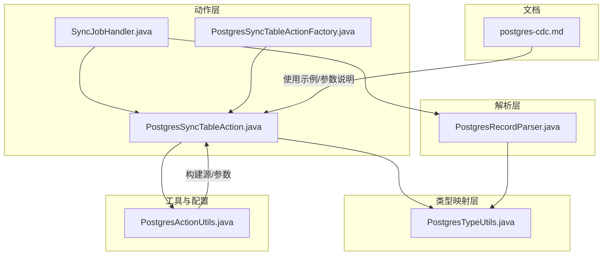
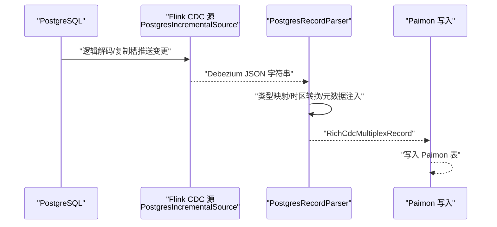
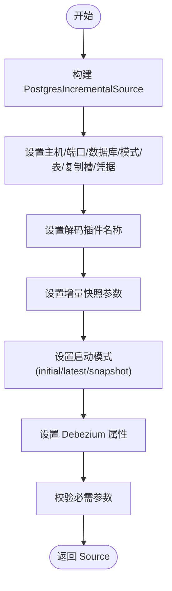
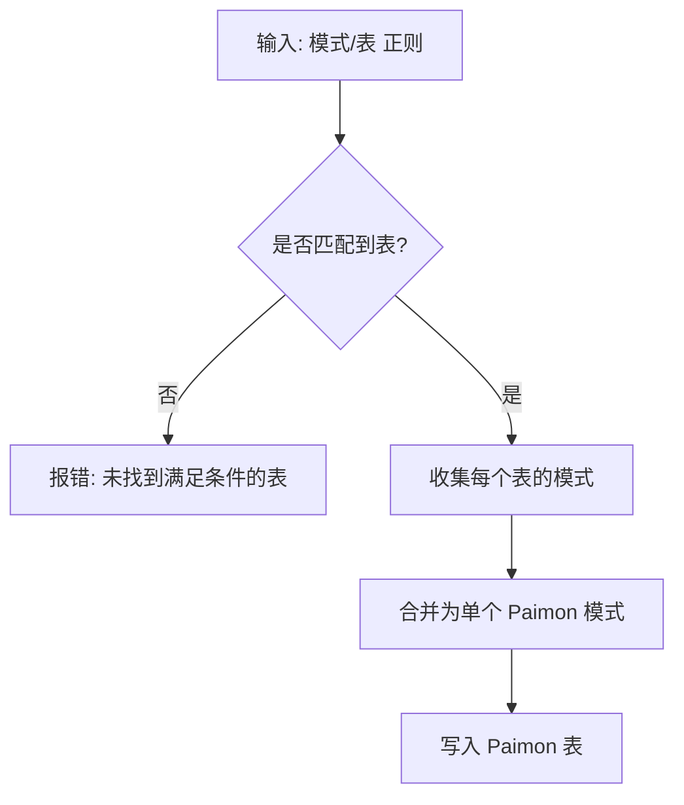
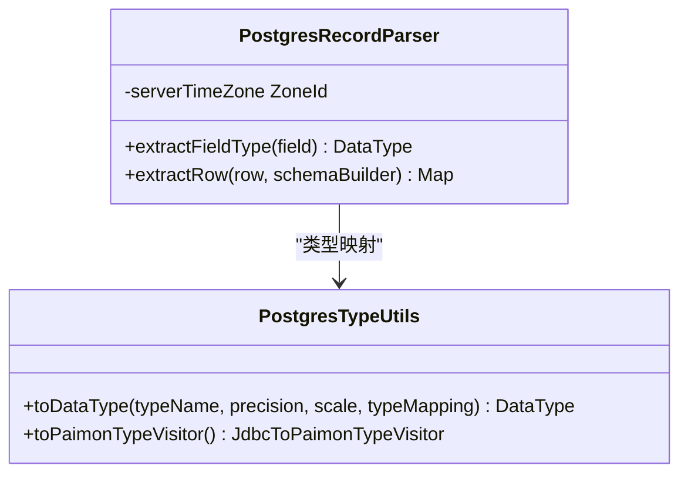
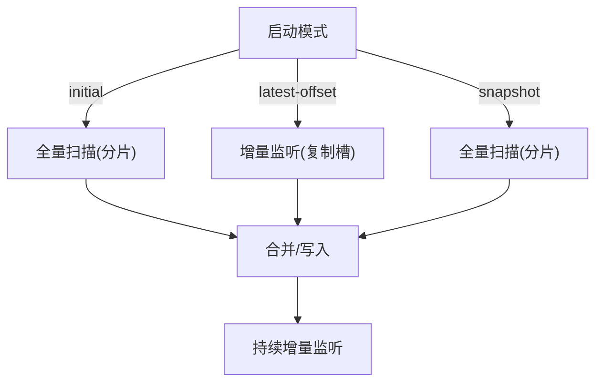
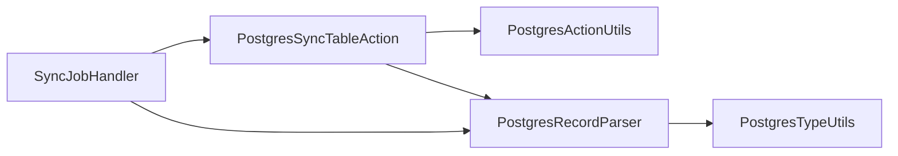

# PostgreSQL CDC

<cite>
**本文引用的文件**
- [postgres-cdc.md](file://docs/content/cdc-ingestion/postgres-cdc.md)
- [PostgresActionUtils.java](file://paimon-flink/paimon-flink-cdc/src/main/java/org/apache/paimon/flink/action/cdc/postgres/PostgresActionUtils.java)
- [PostgresRecordParser.java](file://paimon-flink/paimon-flink-cdc/src/main/java/org/apache/paimon/flink/action/cdc/postgres/PostgresRecordParser.java)
- [PostgresTypeUtils.java](file://paimon-flink/paimon-flink-cdc/src/main/java/org/apache/paimon/flink/action/cdc/postgres/PostgresTypeUtils.java)
- [PostgresSyncTableAction.java](file://paimon-flink/paimon-flink-cdc/src/main/java/org/apache/paimon/flink/action/cdc/postgres/PostgresSyncTableAction.java)
- [SyncJobHandler.java](file://paimon-flink/paimon-flink-cdc/src/main/java/org/apache/paimon/flink/action/cdc/SyncJobHandler.java)
- [PostgresSyncTableActionFactory.java](file://paimon-flink/paimon-flink-cdc/src/main/java/org/apache/paimon/flink/action/cdc/postgres/PostgresSyncTableActionFactory.java)
</cite>

## 目录
1. [简介](#简介)
2. [项目结构](#项目结构)
3. [核心组件](#核心组件)
4. [架构总览](#架构总览)
5. [详细组件分析](#详细组件分析)
6. [依赖分析](#依赖分析)
7. [性能考虑](#性能考虑)
8. [故障排查指南](#故障排查指南)
9. [结论](#结论)
10. [附录](#附录)

## 简介
本文件面向使用 Apache Paimon 进行 PostgreSQL CDC（变更数据捕获）集成的用户与工程师，系统性阐述以下主题：
- 基于 Flink CDC 的 PostgreSQL 逻辑解码（Logical Decoding）与 WAL 日志解析流程
- 表级与数据库级同步模式及限制
- 数据类型映射与时间与时区处理策略
- 连接配置、权限要求与启动参数
- 增量变更捕获与全量初始化过程
- 事务处理与一致性保障
- 配置示例与关键实现路径
- 性能优化与故障诊断方法

## 项目结构
与 PostgreSQL CDC 相关的核心模块位于 paimon-flink/paimon-flink-cdc 中，主要由以下层次构成：
- 动作层：负责构建同步作业、校验参数、生成源与解析器
- 解析层：将 Debezium JSON 转换为 Paimon 可用的记录
- 类型映射层：将 PostgreSQL 类型映射到 Paimon 数据类型
- 文档与示例：官方文档提供操作指引与示例命令

**图表来源**
- [PostgresSyncTableAction.java:75-134](file://paimon-flink/paimon-flink-cdc/src/main/java/org/apache/paimon/flink/action/cdc/postgres/PostgresSyncTableAction.java#L75-L134)
- [SyncJobHandler.java:198-219](file://paimon-flink/paimon-flink-cdc/src/main/java/org/apache/paimon/flink/action/cdc/SyncJobHandler.java#L198-L219)
- [PostgresRecordParser.java:78-368](file://paimon-flink/paimon-flink-cdc/src/main/java/org/apache/paimon/flink/action/cdc/postgres/PostgresRecordParser.java#L78-L368)
- [PostgresTypeUtils.java:31-194](file://paimon-flink/paimon-flink-cdc/src/main/java/org/apache/paimon/flink/action/cdc/postgres/PostgresTypeUtils.java#L31-L194)
- [PostgresActionUtils.java:54-221](file://paimon-flink/paimon-flink-cdc/src/main/java/org/apache/paimon/flink/action/cdc/postgres/PostgresActionUtils.java#L54-L221)
- [postgres-cdc.md:27-128](file://docs/content/cdc-ingestion/postgres-cdc.md#L27-L128)

**章节来源**
- [postgres-cdc.md:27-128](file://docs/content/cdc-ingestion/postgres-cdc.md#L27-L128)
- [PostgresSyncTableAction.java:75-134](file://paimon-flink/paimon-flink-cdc/src/main/java/org/apache/paimon/flink/action/cdc/postgres/PostgresSyncTableAction.java#L75-L134)
- [SyncJobHandler.java:54-270](file://paimon-flink/paimon-flink-cdc/src/main/java/org/apache/paimon/flink/action/cdc/SyncJobHandler.java#L54-L270)
- [PostgresRecordParser.java:78-368](file://paimon-flink/paimon-flink-cdc/src/main/java/org/apache/paimon/flink/action/cdc/postgres/PostgresRecordParser.java#L78-L368)
- [PostgresTypeUtils.java:31-194](file://paimon-flink/paimon-flink-cdc/src/main/java/org/apache/paimon/flink/action/cdc/postgres/PostgresTypeUtils.java#L31-L194)
- [PostgresActionUtils.java:54-221](file://paimon-flink/paimon-flink-cdc/src/main/java/org/apache/paimon/flink/action/cdc/postgres/PostgresActionUtils.java#L54-L221)

## 核心组件
- 同步动作（PostgresSyncTableAction）
  - 负责从 PostgreSQL 源收集表信息、合并模式、构建 CDC 源并执行同步
  - 强制要求源表具备主键，否则会报错
- 作业处理器（SyncJobHandler）
  - 提供不同 CDC 源类型的统一入口，包括 PostgreSQL
  - 校验必需参数（主机、用户名、密码、数据库、模式、复制槽等）
- 记录解析器（PostgresRecordParser）
  - 将 Debezium JSON 转换为 Paimon 记录，处理数组、位串、二进制、时间戳与时区等
- 类型映射（PostgresTypeUtils）
  - 将 PostgreSQL 类型映射为 Paimon 数据类型，支持字符串映射模式
- 工具类（PostgresActionUtils）
  - 构建 PostgreSQL CDC 源、注册 JDBC 驱动、获取表结构信息

**章节来源**
- [PostgresSyncTableAction.java:75-134](file://paimon-flink/paimon-flink-cdc/src/main/java/org/apache/paimon/flink/action/cdc/postgres/PostgresSyncTableAction.java#L75-L134)
- [SyncJobHandler.java:97-180](file://paimon-flink/paimon-flink-cdc/src/main/java/org/apache/paimon/flink/action/cdc/SyncJobHandler.java#L97-L180)
- [PostgresRecordParser.java:78-368](file://paimon-flink/paimon-flink-cdc/src/main/java/org/apache/paimon/flink/action/cdc/postgres/PostgresRecordParser.java#L78-L368)
- [PostgresTypeUtils.java:31-194](file://paimon-flink/paimon-flink-cdc/src/main/java/org/apache/paimon/flink/action/cdc/postgres/PostgresTypeUtils.java#L31-L194)
- [PostgresActionUtils.java:54-221](file://paimon-flink/paimon-flink-cdc/src/main/java/org/apache/paimon/flink/action/cdc/postgres/PostgresActionUtils.java#L54-L221)

## 架构总览
下图展示了从 PostgreSQL 到 Paimon 的 CDC 流程：源端通过 Flink CDC PostgreSQL Connector 使用逻辑解码与复制槽拉取变更；解析器将变更转换为 Paimon 记录；最终写入 Paimon 表。

**图表来源**
- [PostgresActionUtils.java:120-210](file://paimon-flink/paimon-flink-cdc/src/main/java/org/apache/paimon/flink/action/cdc/postgres/PostgresActionUtils.java#L120-L210)
- [PostgresRecordParser.java:114-122](file://paimon-flink/paimon-flink-cdc/src/main/java/org/apache/paimon/flink/action/cdc/postgres/PostgresRecordParser.java#L114-L122)
- [PostgresSyncTableAction.java:98-110](file://paimon-flink/paimon-flink-cdc/src/main/java/org/apache/paimon/flink/action/cdc/postgres/PostgresSyncTableAction.java#L98-L110)

## 详细组件分析

### 组件一：PostgreSQL CDC 源构建与参数校验
- 参数来源与默认值
  - 主机名、端口、数据库名、用户名、密码、复制槽名称、模式名、表名等
  - 启动模式（initial、latest-offset、snapshot），以及增量快照相关参数（分片大小、分组大小、分布因子、心跳间隔、连接超时等）
- 复制插件与 Debezium 属性
  - 默认使用 pgoutput 插件（PostgreSQL 10+）
  - 支持通过前缀传递 Debezium 属性
- 校验规则
  - 数据库级同步不允许指定表名（否则抛出异常）
  - 必需参数必须提供（主机、用户名、密码、数据库、模式、复制槽）

**图表来源**
- [PostgresActionUtils.java:120-210](file://paimon-flink/paimon-flink-cdc/src/main/java/org/apache/paimon/flink/action/cdc/postgres/PostgresActionUtils.java#L120-L210)
- [SyncJobHandler.java:119-140](file://paimon-flink/paimon-flink-cdc/src/main/java/org/apache/paimon/flink/action/cdc/SyncJobHandler.java#L119-L140)

**章节来源**
- [PostgresActionUtils.java:120-210](file://paimon-flink/paimon-flink-cdc/src/main/java/org/apache/paimon/flink/action/cdc/postgres/PostgresActionUtils.java#L120-L210)
- [SyncJobHandler.java:97-180](file://paimon-flink/paimon-flink-cdc/src/main/java/org/apache/paimon/flink/action/cdc/SyncJobHandler.java#L97-L180)

### 组件二：表级与数据库级同步模式
- 表级同步（postgres_sync_table）
  - 通过正则表达式匹配多个表或同一表在多模式下的同名表
  - 自动合并所有表的模式到一个 Paimon 表
  - 源表必须具备主键，否则抛错
- 数据库级同步（不在此仓库中直接提供）
  - 当前实现仅支持表级同步；数据库级同步需要通过其他方式（如自定义脚本或外部调度）实现

**图表来源**
- [PostgresSyncTableAction.java:112-124](file://paimon-flink/paimon-flink-cdc/src/main/java/org/apache/paimon/flink/action/cdc/postgres/PostgresSyncTableAction.java#L112-L124)
- [PostgresSyncTableAction.java:126-132](file://paimon-flink/paimon-flink-cdc/src/main/java/org/apache/paimon/flink/action/cdc/postgres/PostgresSyncTableAction.java#L126-L132)

**章节来源**
- [PostgresSyncTableAction.java:75-134](file://paimon-flink/paimon-flink-cdc/src/main/java/org/apache/paimon/flink/action/cdc/postgres/PostgresSyncTableAction.java#L75-L134)
- [postgres-cdc.md:43-128](file://docs/content/cdc-ingestion/postgres-cdc.md#L43-L128)

### 组件三：数据类型映射与时间/时区处理
- 类型映射
  - 支持 bit/varbit、布尔、整数系列、浮点、数值（numeric）、字符系列、文本/JSON/枚举、时间戳、带时区时间戳、时间、日期等
  - 对数组类型映射为 Paimon 数组
  - 支持将类型强制映射为字符串模式
- 时间与时区
  - Date、Timestamp、MicroTimestamp、ZonedTimestamp、MicroTime 等特殊类型按精度与时区进行转换
  - timestamptz 使用服务器时区配置转换为本地时间再格式化
- 二进制与位串
  - 位串（bit/varbit）根据长度映射为布尔或二进制
  - bytes 与 numeric 的字节表示按 Debezium 配置进行解析

**图表来源**
- [PostgresTypeUtils.java:74-173](file://paimon-flink/paimon-flink-cdc/src/main/java/org/apache/paimon/flink/action/cdc/postgres/PostgresTypeUtils.java#L74-L173)
- [PostgresRecordParser.java:148-205](file://paimon-flink/paimon-flink-cdc/src/main/java/org/apache/paimon/flink/action/cdc/postgres/PostgresRecordParser.java#L148-L205)

**章节来源**
- [PostgresTypeUtils.java:31-194](file://paimon-flink/paimon-flink-cdc/src/main/java/org/apache/paimon/flink/action/cdc/postgres/PostgresTypeUtils.java#L31-L194)
- [PostgresRecordParser.java:144-361](file://paimon-flink/paimon-flink-cdc/src/main/java/org/apache/paimon/flink/action/cdc/postgres/PostgresRecordParser.java#L144-L361)

### 组件四：增量变更捕获与全量初始化
- 全量初始化
  - 通过增量快照（incremental snapshot）对目标表进行分片扫描，避免一次性大扫描
  - 支持分片大小、分组大小、分布因子、首次分配无界分片等参数
- 增量变更捕获
  - 基于复制槽与逻辑解码（pgoutput）持续拉取变更
  - 支持心跳间隔、连接池大小、连接重试次数、关闭空闲读取器等参数
- 启动模式
  - initial：先全量后增量
  - latest-offset：仅增量
  - snapshot：仅全量

**图表来源**
- [PostgresActionUtils.java:139-197](file://paimon-flink/paimon-flink-cdc/src/main/java/org/apache/paimon/flink/action/cdc/postgres/PostgresActionUtils.java#L139-L197)

**章节来源**
- [PostgresActionUtils.java:120-210](file://paimon-flink/paimon-flink-cdc/src/main/java/org/apache/paimon/flink/action/cdc/postgres/PostgresActionUtils.java#L120-L210)

### 组件五：事务处理与一致性保证
- 事务边界
  - CDC 源以事件流形式输出，事务语义由下游写入器与提交策略决定
- 一致性策略
  - 建议启用幂等写入与预写日志（WAL）回放能力，确保 Exactly-Once 或 At-Least-Once
  - 在 Paimon 中可结合变更日志生产者与并行度控制提升一致性与吞吐
- 错误恢复
  - 连接超时、重试次数、心跳间隔等参数有助于在瞬断场景下保持稳定性

**章节来源**
- [PostgresActionUtils.java:166-179](file://paimon-flink/paimon-flink-cdc/src/main/java/org/apache/paimon/flink/action/cdc/postgres/PostgresActionUtils.java#L166-L179)

### 组件六：连接配置与权限要求
- 必需参数
  - 主机名、用户名、密码、数据库名、模式名、复制槽名称、表名（正则）
- CDC 源参数
  - 启动模式、增量快照参数、连接参数、心跳间隔、解码插件名称等
- 权限要求
  - 需要具备复制权限（replication）以创建/使用复制槽
  - 需要对目标表具备读取权限

**章节来源**
- [SyncJobHandler.java:119-140](file://paimon-flink/paimon-flink-cdc/src/main/java/org/apache/paimon/flink/action/cdc/SyncJobHandler.java#L119-L140)
- [postgres-cdc.md:29-42](file://docs/content/cdc-ingestion/postgres-cdc.md#L29-L42)

### 组件七：配置示例与代码实现路径
- 示例命令
  - 使用 flink run 执行 postgres_sync_table，传入仓库路径、数据库、表、分区键、主键、类型映射、计算列、元数据列、PostgreSQL 源配置、Catalog 与表配置等
- 关键实现路径
  - 动作工厂标识符：postgres_sync_table
  - 同步动作类：PostgresSyncTableAction
  - 记录解析器：PostgresRecordParser
  - 类型映射：PostgresTypeUtils
  - 源构建：PostgresActionUtils

**章节来源**
- [postgres-cdc.md:47-128](file://docs/content/cdc-ingestion/postgres-cdc.md#L47-L128)
- [PostgresSyncTableActionFactory.java:26-38](file://paimon-flink/paimon-flink-cdc/src/main/java/org/apache/paimon/flink/action/cdc/postgres/PostgresSyncTableActionFactory.java#L26-L38)
- [PostgresSyncTableAction.java:75-95](file://paimon-flink/paimon-flink-cdc/src/main/java/org/apache/paimon/flink/action/cdc/postgres/PostgresSyncTableAction.java#L75-L95)
- [PostgresRecordParser.java:78-111](file://paimon-flink/paimon-flink-cdc/src/main/java/org/apache/paimon/flink/action/cdc/postgres/PostgresRecordParser.java#L78-L111)
- [PostgresTypeUtils.java:74-173](file://paimon-flink/paimon-flink-cdc/src/main/java/org/apache/paimon/flink/action/cdc/postgres/PostgresTypeUtils.java#L74-L173)
- [PostgresActionUtils.java:120-210](file://paimon-flink/paimon-flink-cdc/src/main/java/org/apache/paimon/flink/action/cdc/postgres/PostgresActionUtils.java#L120-L210)

## 依赖分析
- 组件耦合
  - PostgresSyncTableAction 依赖 PostgresActionUtils 获取表信息与构建源
  - PostgresRecordParser 依赖 PostgresTypeUtils 完成类型映射
  - SyncJobHandler 作为统一入口，根据不同源类型返回对应解析器与数据格式
- 外部依赖
  - Flink CDC PostgreSQL Connector（PostgresIncrementalSource、PostgresSourceOptions）
  - Debezium JSON 解析（CdcDebeziumDeserializationSchema）
  - PostgreSQL JDBC 驱动（org.postgresql.Driver）

**图表来源**
- [PostgresSyncTableAction.java:75-110](file://paimon-flink/paimon-flink-cdc/src/main/java/org/apache/paimon/flink/action/cdc/postgres/PostgresSyncTableAction.java#L75-L110)
- [PostgresActionUtils.java:54-221](file://paimon-flink/paimon-flink-cdc/src/main/java/org/apache/paimon/flink/action/cdc/postgres/PostgresActionUtils.java#L54-L221)
- [PostgresRecordParser.java:78-368](file://paimon-flink/paimon-flink-cdc/src/main/java/org/apache/paimon/flink/action/cdc/postgres/PostgresRecordParser.java#L78-L368)
- [PostgresTypeUtils.java:31-194](file://paimon-flink/paimon-flink-cdc/src/main/java/org/apache/paimon/flink/action/cdc/postgres/PostgresTypeUtils.java#L31-L194)
- [SyncJobHandler.java:198-219](file://paimon-flink/paimon-flink-cdc/src/main/java/org/apache/paimon/flink/action/cdc/SyncJobHandler.java#L198-L219)

**章节来源**
- [PostgresSyncTableAction.java:75-134](file://paimon-flink/paimon-flink-cdc/src/main/java/org/apache/paimon/flink/action/cdc/postgres/PostgresSyncTableAction.java#L75-L134)
- [SyncJobHandler.java:54-270](file://paimon-flink/paimon-flink-cdc/src/main/java/org/apache/paimon/flink/action/cdc/SyncJobHandler.java#L54-L270)

## 性能考虑
- 分片与并行
  - 增量快照分片大小影响扫描效率与内存占用，建议根据表大小与集群资源调优
  - 连接池大小与并行度需匹配源端复制槽与网络带宽
- 心跳与重试
  - 合理的心跳间隔可减少空闲资源占用
  - 连接超时与最大重试次数应平衡稳定性与延迟
- 类型与序列化
  - 对大字段（如 bytea、json）建议开启必要的压缩或转换策略
  - 数值类型使用 DECIMAL 时注意精度与 scale，避免过宽导致存储膨胀
- 写入器优化
  - Paimon 表的桶数量、并行度与变更日志生产者配置直接影响写入吞吐

[本节为通用指导，无需特定文件来源]

## 故障排查指南
- 常见错误与定位
  - 未找到满足条件的表：检查数据库名、模式名、表名正则是否正确
  - 源表无主键：确保所有被同步表均定义主键
  - 参数缺失：确认主机、用户名、密码、数据库、模式、复制槽等必需参数已提供
  - JDBC 驱动缺失：确保运行环境中存在 org.postgresql.Driver
- 日志与调试
  - 查看 Flink 任务日志中的 CDC 源与解析器输出
  - 开启更详细的日志级别以捕获类型映射与时区转换细节
- 复制槽与权限
  - 确认复制槽名称唯一且未被占用
  - 确保用户具备 replication 权限与目标表读取权限

**章节来源**
- [PostgresSyncTableAction.java:112-124](file://paimon-flink/paimon-flink-cdc/src/main/java/org/apache/paimon/flink/action/cdc/postgres/PostgresSyncTableAction.java#L112-L124)
- [SyncJobHandler.java:119-140](file://paimon-flink/paimon-flink-cdc/src/main/java/org/apache/paimon/flink/action/cdc/SyncJobHandler.java#L119-L140)
- [PostgresActionUtils.java:212-219](file://paimon-flink/paimon-flink-cdc/src/main/java/org/apache/paimon/flink/action/cdc/postgres/PostgresActionUtils.java#L212-L219)

## 结论
本文基于 Paimon 与 Flink CDC 的 PostgreSQL CDC 实现，系统梳理了逻辑解码、增量快照、类型映射与时区处理、参数配置与权限要求、事务与一致性、性能优化与故障排查等关键主题。通过表级同步与统一的动作/解析/类型映射抽象，Paimon 能够稳定地承接 PostgreSQL 的 CDC 变更，并将其高效写入湖格式表中。

[本节为总结，无需特定文件来源]

## 附录
- 官方文档与示例命令参见：[Postgres CDC 文档:27-128](file://docs/content/cdc-ingestion/postgres-cdc.md#L27-L128)
- 关键实现路径参考：
  - [PostgresSyncTableAction.java:75-134](file://paimon-flink/paimon-flink-cdc/src/main/java/org/apache/paimon/flink/action/cdc/postgres/PostgresSyncTableAction.java#L75-L134)
  - [PostgresRecordParser.java:78-368](file://paimon-flink/paimon-flink-cdc/src/main/java/org/apache/paimon/flink/action/cdc/postgres/PostgresRecordParser.java#L78-L368)
  - [PostgresTypeUtils.java:31-194](file://paimon-flink/paimon-flink-cdc/src/main/java/org/apache/paimon/flink/action/cdc/postgres/PostgresTypeUtils.java#L31-L194)
  - [PostgresActionUtils.java:54-221](file://paimon-flink/paimon-flink-cdc/src/main/java/org/apache/paimon/flink/action/cdc/postgres/PostgresActionUtils.java#L54-L221)
  - [SyncJobHandler.java:54-270](file://paimon-flink/paimon-flink-cdc/src/main/java/org/apache/paimon/flink/action/cdc/SyncJobHandler.java#L54-L270)
  - [PostgresSyncTableActionFactory.java:26-38](file://paimon-flink/paimon-flink-cdc/src/main/java/org/apache/paimon/flink/action/cdc/postgres/PostgresSyncTableActionFactory.java#L26-L38)

[本节为补充材料，无需特定文件来源]