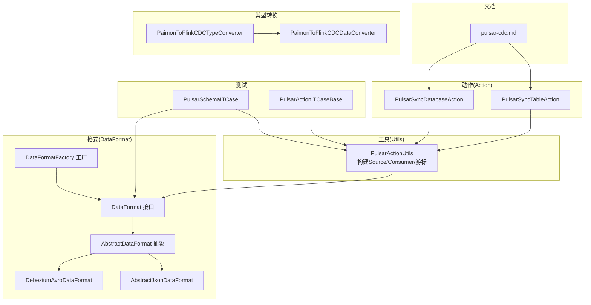
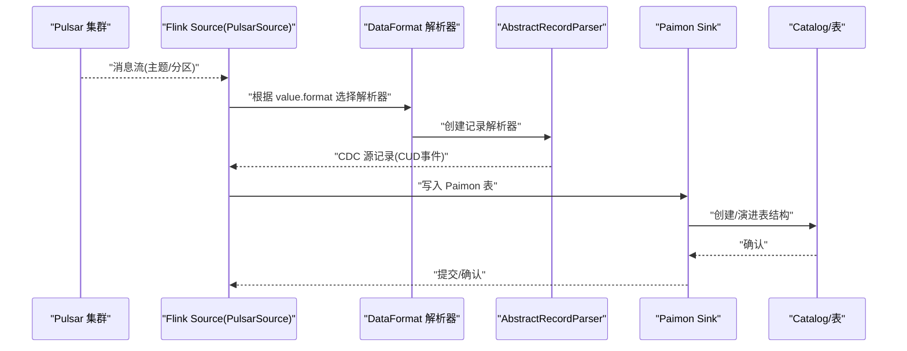
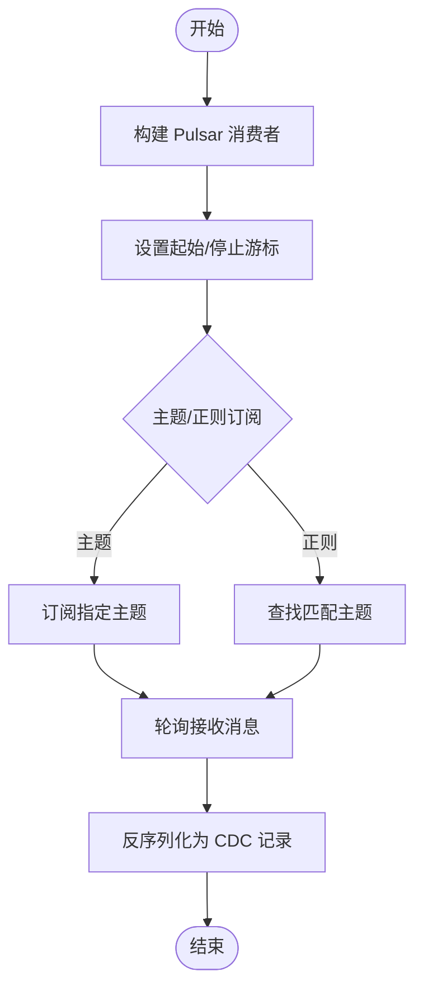
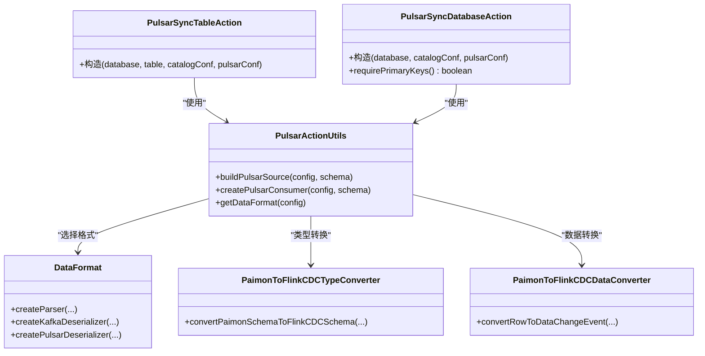
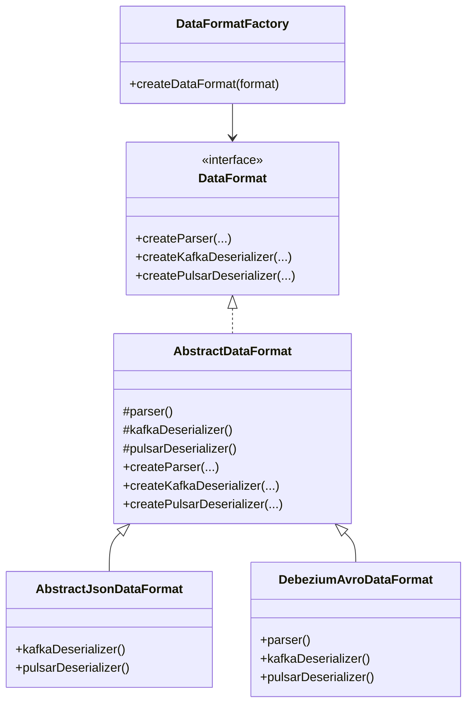
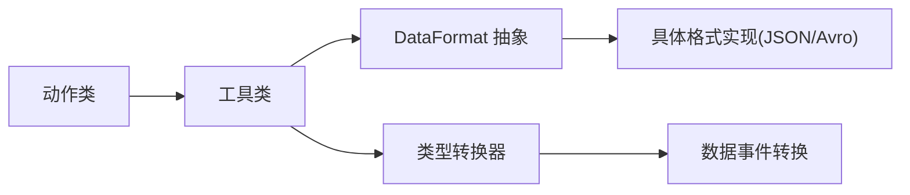

# Pulsar CDC

<cite>
**本文引用的文件**
- [pulsar-cdc.md](file://docs/content/cdc-ingestion/pulsar-cdc.md)
- [PulsarActionUtils.java](file://paimon-flink/paimon-flink-cdc/src/main/java/org/apache/paimon/flink/action/cdc/pulsar/PulsarActionUtils.java)
- [PulsarSyncTableAction.java](file://paimon-flink/paimon-flink-cdc/src/main/java/org/apache/paimon/flink/action/cdc/pulsar/PulsarSyncTableAction.java)
- [PulsarSyncDatabaseAction.java](file://paimon-flink/paimon-flink-cdc/src/main/java/org/apache/paimon/flink/action/cdc/pulsar/PulsarSyncDatabaseAction.java)
- [SyncJobHandler.java](file://paimon-flink/paimon-flink-cdc/src/main/java/org/apache/paimon/flink/action/cdc/SyncJobHandler.java)
- [DataFormat.java](file://paimon-flink/paimon-flink-cdc/src/main/java/org/apache/paimon/flink/action/cdc/format/DataFormat.java)
- [AbstractDataFormat.java](file://paimon-flink/paimon-flink-cdc/src/main/java/org/apache/paimon/flink/action/cdc/format/AbstractDataFormat.java)
- [DataFormatFactory.java](file://paimon-flink/paimon-flink-cdc/src/main/java/org/apache/paimon/flink/action/cdc/format/DataFormatFactory.java)
- [AbstractJsonDataFormat.java](file://paimon-flink/paimon-flink-cdc/src/main/java/org/apache/paimon/flink/action/cdc/format/AbstractJsonDataFormat.java)
- [DebeziumAvroDataFormat.java](file://paimon-flink/paimon-flink-cdc/src/main/java/org/apache/paimon/flink/action/cdc/format/debezium/DebeziumAvroDataFormat.java)
- [PulsarSchemaITCase.java](file://paimon-flink/paimon-flink-cdc/src/test/java/org/apache/paimon/flink/action/cdc/pulsar/PulsarSchemaITCase.java)
- [PulsarActionITCaseBase.java](file://paimon-flink/paimon-flink-cdc/src/test/java/org/apache/paimon/flink/action/cdc/pulsar/PulsarActionITCaseBase.java)
- [PaimonToFlinkCDCTypeConverter.java](file://paimon-flink/paimon-flink-cdc/src/main/java/org/apache/paimon/flink/pipeline/cdc/util/PaimonToFlinkCDCTypeConverter.java)
- [PaimonToFlinkCDCDataConverter.java](file://paimon-flink/paimon-flink-cdc/src/main/java/org/apache/paimon/flink/pipeline/cdc/util/PaimonToFlinkCDCDataConverter.java)
</cite>

## 目录
1. [简介](#简介)
2. [项目结构](#项目结构)
3. [核心组件](#核心组件)
4. [架构总览](#架构总览)
5. [详细组件分析](#详细组件分析)
6. [依赖分析](#依赖分析)
7. [性能考虑](#性能考虑)
8. [故障排查指南](#故障排查指南)
9. [结论](#结论)
10. [附录](#附录)

## 简介
本文件面向使用 Apache Paimon 的用户，系统性介绍 Pulsar CDC 集成方案，覆盖生产者-消费者模型、消息流处理、Pulsar 主题到 Paimon 表的映射与转换、多消息格式与序列化、连接配置与集群设置、分区与负载均衡、事务与去重策略、配置示例与代码实现路径、以及性能优化与运维监控建议。内容基于仓库中的官方文档与源码实现进行提炼与可视化。

## 项目结构
Pulsar CDC 能力主要由以下模块构成：
- 文档层：提供功能说明、参数清单与示例命令
- 动作层（Action）：封装“同步表/库”的可执行动作类
- 工具层（Utils）：构建 Pulsar Source、消费者、游标控制等
- 格式层（DataFormat）：抽象并实现多种 CDC 消息格式的解析与反序列化
- 类型转换层：在 Paimon 与 Flink CDC 类型之间做双向转换
- 测试层：验证 Schema 推断、消费者行为与端到端流程

**图表来源**
- [pulsar-cdc.md](file://docs/content/cdc-ingestion/pulsar-cdc.md)
- [PulsarSyncTableAction.java](file://paimon-flink/paimon-flink-cdc/src/main/java/org/apache/paimon/flink/action/cdc/pulsar/PulsarSyncTableAction.java)
- [PulsarSyncDatabaseAction.java](file://paimon-flink/paimon-flink-cdc/src/main/java/org/apache/paimon/flink/action/cdc/pulsar/PulsarSyncDatabaseAction.java)
- [PulsarActionUtils.java](file://paimon-flink/paimon-flink-cdc/src/main/java/org/apache/paimon/flink/action/cdc/pulsar/PulsarActionUtils.java)
- [DataFormat.java](file://paimon-flink/paimon-flink-cdc/src/main/java/org/apache/paimon/flink/action/cdc/format/DataFormat.java)
- [AbstractDataFormat.java](file://paimon-flink/paimon-flink-cdc/src/main/java/org/apache/paimon/flink/action/cdc/format/AbstractDataFormat.java)
- [DataFormatFactory.java](file://paimon-flink/paimon-flink-cdc/src/main/java/org/apache/paimon/flink/action/cdc/format/DataFormatFactory.java)
- [AbstractJsonDataFormat.java](file://paimon-flink/paimon-flink-cdc/src/main/java/org/apache/paimon/flink/action/cdc/format/AbstractJsonDataFormat.java)
- [DebeziumAvroDataFormat.java](file://paimon-flink/paimon-flink-cdc/src/main/java/org/apache/paimon/flink/action/cdc/format/debezium/DebeziumAvroDataFormat.java)
- [PaimonToFlinkCDCTypeConverter.java](file://paimon-flink/paimon-flink-cdc/src/main/java/org/apache/paimon/flink/pipeline/cdc/util/PaimonToFlinkCDCTypeConverter.java)
- [PaimonToFlinkCDCDataConverter.java](file://paimon-flink/paimon-flink-cdc/src/main/java/org/apache/paimon/flink/pipeline/cdc/util/PaimonToFlinkCDCDataConverter.java)
- [PulsarSchemaITCase.java](file://paimon-flink/paimon-flink-cdc/src/test/java/org/apache/paimon/flink/action/cdc/pulsar/PulsarSchemaITCase.java)
- [PulsarActionITCaseBase.java](file://paimon-flink/paimon-flink-cdc/src/test/java/org/apache/paimon/flink/action/cdc/pulsar/PulsarActionITCaseBase.java)

**章节来源**
- [pulsar-cdc.md](file://docs/content/cdc-ingestion/pulsar-cdc.md)
- [PulsarActionUtils.java](file://paimon-flink/paimon-flink-cdc/src/main/java/org/apache/paimon/flink/action/cdc/pulsar/PulsarActionUtils.java)

## 核心组件
- 同步动作
  - PulsarSyncTableAction：从单个 Pulsar 主题同步一张表到 Paimon
  - PulsarSyncDatabaseAction：从一个或多个 Pulsar 主题同步多张表到 Paimon 数据库
- 工具类
  - PulsarActionUtils：负责构建 PulsarSource、消费者、起止游标、认证与订阅等
- 格式体系
  - DataFormat 接口及其实现：统一抽象不同 CDC 消息格式的解析与反序列化
  - DataFormatFactory：按标识动态发现并创建具体格式工厂
  - AbstractJsonDataFormat、DebeziumAvroDataFormat：分别适配 JSON 及 Avro 格式
- 类型转换
  - PaimonToFlinkCDCTypeConverter：Paimon Schema 到 Flink CDC Schema 的转换
  - PaimonToFlinkCDCDataConverter：Paimon 行到 Flink CDC 事件的转换

**章节来源**
- [PulsarSyncTableAction.java](file://paimon-flink/paimon-flink-cdc/src/main/java/org/apache/paimon/flink/action/cdc/pulsar/PulsarSyncTableAction.java)
- [PulsarSyncDatabaseAction.java](file://paimon-flink/paimon-flink-cdc/src/main/java/org/apache/paimon/flink/action/cdc/pulsar/PulsarSyncDatabaseAction.java)
- [PulsarActionUtils.java](file://paimon-flink/paimon-flink-cdc/src/main/java/org/apache/paimon/flink/action/cdc/pulsar/PulsarActionUtils.java)
- [DataFormat.java](file://paimon-flink/paimon-flink-cdc/src/main/java/org/apache/paimon/flink/action/cdc/format/DataFormat.java)
- [AbstractDataFormat.java](file://paimon-flink/paimon-flink-cdc/src/main/java/org/apache/paimon/flink/action/cdc/format/AbstractDataFormat.java)
- [DataFormatFactory.java](file://paimon-flink/paimon-flink-cdc/src/main/java/org/apache/paimon/flink/action/cdc/format/DataFormatFactory.java)
- [AbstractJsonDataFormat.java](file://paimon-flink/paimon-flink-cdc/src/main/java/org/apache/paimon/flink/action/cdc/format/AbstractJsonDataFormat.java)
- [DebeziumAvroDataFormat.java](file://paimon-flink/paimon-flink-cdc/src/main/java/org/apache/paimon/flink/action/cdc/format/debezium/DebeziumAvroDataFormat.java)
- [PaimonToFlinkCDCTypeConverter.java](file://paimon-flink/paimon-flink-cdc/src/main/java/org/apache/paimon/flink/pipeline/cdc/util/PaimonToFlinkCDCTypeConverter.java)
- [PaimonToFlinkCDCDataConverter.java](file://paimon-flink/paimon-flink-cdc/src/main/java/org/apache/paimon/flink/pipeline/cdc/util/PaimonToFlinkCDCDataConverter.java)

## 架构总览
下图展示 Pulsar CDC 的端到端数据流：Flink 通过 PulsarSource 订阅主题，按配置选择格式解析器，生成 CDC 事件，最终写入 Paimon 表。

**图表来源**
- [PulsarActionUtils.java](file://paimon-flink/paimon-flink-cdc/src/main/java/org/apache/paimon/flink/action/cdc/pulsar/PulsarActionUtils.java)
- [DataFormatFactory.java](file://paimon-flink/paimon-flink-cdc/src/main/java/org/apache/paimon/flink/action/cdc/format/DataFormatFactory.java)
- [DataFormat.java](file://paimon-flink/paimon-flink-cdc/src/main/java/org/apache/paimon/flink/action/cdc/format/DataFormat.java)

## 详细组件分析

### 生产者-消费者模型与消息流处理
- 消费者构建
  - 基于 Pulsar 客户端与订阅配置，创建消费者并设置初始位置（默认 Earliest）
  - 支持按主题或正则模式匹配订阅
  - 对非全范围分区采用 KeySharedPolicy 并允许乱序投递以提升吞吐
- 消息轮询
  - 每次轮询接收一条消息，交由反序列化 Schema 解析为 CDC 源记录
- 游标控制
  - 支持基于消息 ID、发布时间、事件时间等多种起止游标策略
  - 可配置无界/有界流

**图表来源**
- [PulsarActionUtils.java](file://paimon-flink/paimon-flink-cdc/src/main/java/org/apache/paimon/flink/action/cdc/pulsar/PulsarActionUtils.java)

**章节来源**
- [PulsarActionUtils.java](file://paimon-flink/paimon-flink-cdc/src/main/java/org/apache/paimon/flink/action/cdc/pulsar/PulsarActionUtils.java)

### Pulsar 主题到 Paimon 表的映射与转换
- 映射关系
  - 单表同步：Pulsar 主题 → Paimon 表（1:1）
  - 多表同步：Pulsar 主题集合 → Paimon 数据库（多表 Sink 组合）
- Schema 推断与演进
  - 若目标表不存在，依据最早可用的非 DDL 记录推断 Schema
  - 若存在，尝试进行 Schema 演进
- 类型转换
  - Paimon <-> Flink CDC 类型双向转换，确保字段、主键、分区键与注释正确传递

**图表来源**
- [PulsarSyncTableAction.java](file://paimon-flink/paimon-flink-cdc/src/main/java/org/apache/paimon/flink/action/cdc/pulsar/PulsarSyncTableAction.java)
- [PulsarSyncDatabaseAction.java](file://paimon-flink/paimon-flink-cdc/src/main/java/org/apache/paimon/flink/action/cdc/pulsar/PulsarSyncDatabaseAction.java)
- [PulsarActionUtils.java](file://paimon-flink/paimon-flink-cdc/src/main/java/org/apache/paimon/flink/action/cdc/pulsar/PulsarActionUtils.java)
- [DataFormat.java](file://paimon-flink/paimon-flink-cdc/src/main/java/org/apache/paimon/flink/action/cdc/format/DataFormat.java)
- [PaimonToFlinkCDCTypeConverter.java](file://paimon-flink/paimon-flink-cdc/src/main/java/org/apache/paimon/flink/pipeline/cdc/util/PaimonToFlinkCDCTypeConverter.java)
- [PaimonToFlinkCDCDataConverter.java](file://paimon-flink/paimon-flink-cdc/src/main/java/org/apache/paimon/flink/pipeline/cdc/util/PaimonToFlinkCDCDataConverter.java)

**章节来源**
- [PulsarSyncTableAction.java](file://paimon-flink/paimon-flink-cdc/src/main/java/org/apache/paimon/flink/action/cdc/pulsar/PulsarSyncTableAction.java)
- [PulsarSyncDatabaseAction.java](file://paimon-flink/paimon-flink-cdc/src/main/java/org/apache/paimon/flink/action/cdc/pulsar/PulsarSyncDatabaseAction.java)
- [PulsarActionUtils.java](file://paimon-flink/paimon-flink-cdc/src/main/java/org/apache/paimon/flink/action/cdc/pulsar/PulsarActionUtils.java)
- [PaimonToFlinkCDCTypeConverter.java](file://paimon-flink/paimon-flink-cdc/src/main/java/org/apache/paimon/flink/pipeline/cdc/util/PaimonToFlinkCDCTypeConverter.java)
- [PaimonToFlinkCDCDataConverter.java](file://paimon-flink/paimon-flink-cdc/src/main/java/org/apache/paimon/flink/pipeline/cdc/util/PaimonToFlinkCDCDataConverter.java)

### 多种消息格式与序列化方式
- 支持格式
  - Canal JSON、Debezium JSON、Debezium Avro、Ogg JSON、Maxwell JSON、Normal JSON
- 格式工厂与解析器
  - DataFormatFactory 按标识发现工厂；AbstractDataFormat 提供统一创建接口
  - AbstractJsonDataFormat 为 JSON 系列提供通用反序列化 Schema
  - DebeziumAvroDataFormat 为 Avro 格式提供专用反序列化 Schema，并需要 Schema Registry URL

**图表来源**
- [DataFormat.java](file://paimon-flink/paimon-flink-cdc/src/main/java/org/apache/paimon/flink/action/cdc/format/DataFormat.java)
- [AbstractDataFormat.java](file://paimon-flink/paimon-flink-cdc/src/main/java/org/apache/paimon/flink/action/cdc/format/AbstractDataFormat.java)
- [AbstractJsonDataFormat.java](file://paimon-flink/paimon-flink-cdc/src/main/java/org/apache/paimon/flink/action/cdc/format/AbstractJsonDataFormat.java)
- [DebeziumAvroDataFormat.java](file://paimon-flink/paimon-flink-cdc/src/main/java/org/apache/paimon/flink/action/cdc/format/debezium/DebeziumAvroDataFormat.java)
- [DataFormatFactory.java](file://paimon-flink/paimon-flink-cdc/src/main/java/org/apache/paimon/flink/action/cdc/format/DataFormatFactory.java)

**章节来源**
- [pulsar-cdc.md](file://docs/content/cdc-ingestion/pulsar-cdc.md)
- [DataFormatFactory.java](file://paimon-flink/paimon-flink-cdc/src/main/java/org/apache/paimon/flink/action/cdc/format/DataFormatFactory.java)
- [AbstractJsonDataFormat.java](file://paimon-flink/paimon-flink-cdc/src/main/java/org/apache/paimon/flink/action/cdc/format/AbstractJsonDataFormat.java)
- [DebeziumAvroDataFormat.java](file://paimon-flink/paimon-flink-cdc/src/main/java/org/apache/paimon/flink/action/cdc/format/debezium/DebeziumAvroDataFormat.java)

### 连接配置与集群设置
- 必填参数
  - value.format：消息体编码格式标识
  - topic 或 topic-pattern：主题名或正则表达式
  - pulsar.client.serviceUrl：Pulsar 服务地址
  - pulsar.consumer.subscriptionName：订阅名称
- 其他常用参数
  - pulsar.admin.adminUrl：管理端点（兼容旧版本）
  - pulsar.startCursor.fromMessageId / fromPublishTime / fromMessageIdInclusive
  - pulsar.stopCursor.atMessageId / afterMessageId / atEventTime / afterEventTime
  - pulsar.source.unbounded：是否无界流
  - schema.registry.url：当使用 debezium-avro 时必需
- 认证
  - 支持通过认证插件类名与参数字符串/映射进行认证

**章节来源**
- [pulsar-cdc.md](file://docs/content/cdc-ingestion/pulsar-cdc.md)
- [PulsarActionUtils.java](file://paimon-flink/paimon-flink-cdc/src/main/java/org/apache/paimon/flink/action/cdc/pulsar/PulsarActionUtils.java)

### 分区处理与负载均衡
- 分区订阅
  - 当订阅范围非全主题时，启用 KeySharedPolicy 并可配置允许乱序交付以提升吞吐
- 负载均衡
  - 通过 KeySharedPolicy 的哈希范围策略在消费者间分配分区，结合乱序交付减少阻塞

**章节来源**
- [PulsarActionUtils.java](file://paimon-flink/paimon-flink-cdc/src/main/java/org/apache/paimon/flink/action/cdc/pulsar/PulsarActionUtils.java)

### 事务处理与消息去重
- 事务语义
  - Pulsar 提供基于消息 ID 的精确一次消费能力，配合 Paimon 写入的幂等性设计，可实现端到端的精确一次
- 去重策略
  - 基于主键与事件时间的去重：在解析阶段提取主键信息，在写入阶段利用 Paimon 的主键约束避免重复
  - 游标控制：通过起止游标避免重复消费同一消息

**章节来源**
- [PulsarActionUtils.java](file://paimon-flink/paimon-flink-cdc/src/main/java/org/apache/paimon/flink/action/cdc/pulsar/PulsarActionUtils.java)

### 配置示例与代码实现路径
- 单表同步示例
  - 使用 pulsar_sync_table 动作，指定 warehouse、database、table、分区键、主键、计算列、Pulsar 与 Catalog/表配置
- 多表同步示例
  - 使用 pulsar_sync_database 动作，支持从单主题或多主题同步至数据库，自动为每张表创建 Sink
- 关键实现路径
  - 动作入口：PulsarSyncTableAction、PulsarSyncDatabaseAction
  - Source/Consumer 构建：PulsarActionUtils.buildPulsarSource、createPulsarConsumer
  - 格式解析：DataFormatFactory + 各格式实现
  - Schema 推断与校验：测试用例 PulsarSchemaITCase

**章节来源**
- [pulsar-cdc.md](file://docs/content/cdc-ingestion/pulsar-cdc.md)
- [PulsarSyncTableAction.java](file://paimon-flink/paimon-flink-cdc/src/main/java/org/apache/paimon/flink/action/cdc/pulsar/PulsarSyncTableAction.java)
- [PulsarSyncDatabaseAction.java](file://paimon-flink/paimon-flink-cdc/src/main/java/org/apache/paimon/flink/action/cdc/pulsar/PulsarSyncDatabaseAction.java)
- [PulsarActionUtils.java](file://paimon-flink/paimon-flink-cdc/src/main/java/org/apache/paimon/flink/action/cdc/pulsar/PulsarActionUtils.java)
- [PulsarSchemaITCase.java](file://paimon-flink/paimon-flink-cdc/src/test/java/org/apache/paimon/flink/action/cdc/pulsar/PulsarSchemaITCase.java)

## 依赖分析
- 组件耦合
  - 动作类依赖工具类构建 Source/Consumer
  - 工具类依赖 DataFormat 抽象以适配多种消息格式
  - 类型转换器贯穿 Schema 与数据事件转换
- 外部依赖
  - Flink Pulsar Connector：提供 Source/Consumer、游标与认证能力
  - Pulsar Broker：提供主题、分区与消息存储

**图表来源**
- [PulsarSyncTableAction.java](file://paimon-flink/paimon-flink-cdc/src/main/java/org/apache/paimon/flink/action/cdc/pulsar/PulsarSyncTableAction.java)
- [PulsarSyncDatabaseAction.java](file://paimon-flink/paimon-flink-cdc/src/main/java/org/apache/paimon/flink/action/cdc/pulsar/PulsarSyncDatabaseAction.java)
- [PulsarActionUtils.java](file://paimon-flink/paimon-flink-cdc/src/main/java/org/apache/paimon/flink/action/cdc/pulsar/PulsarActionUtils.java)
- [DataFormat.java](file://paimon-flink/paimon-flink-cdc/src/main/java/org/apache/paimon/flink/action/cdc/format/DataFormat.java)
- [AbstractJsonDataFormat.java](file://paimon-flink/paimon-flink-cdc/src/main/java/org/apache/paimon/flink/action/cdc/format/AbstractJsonDataFormat.java)
- [DebeziumAvroDataFormat.java](file://paimon-flink/paimon-flink-cdc/src/main/java/org/apache/paimon/flink/action/cdc/format/debezium/DebeziumAvroDataFormat.java)
- [PaimonToFlinkCDCTypeConverter.java](file://paimon-flink/paimon-flink-cdc/src/main/java/org/apache/paimon/flink/pipeline/cdc/util/PaimonToFlinkCDCTypeConverter.java)
- [PaimonToFlinkCDCDataConverter.java](file://paimon-flink/paimon-flink-cdc/src/main/java/org/apache/paimon/flink/pipeline/cdc/util/PaimonToFlinkCDCDataConverter.java)

**章节来源**
- [SyncJobHandler.java](file://paimon-flink/paimon-flink-cdc/src/main/java/org/apache/paimon/flink/action/cdc/SyncJobHandler.java)
- [DataFormatFactory.java](file://paimon-flink/paimon-flink-cdc/src/main/java/org/apache/paimon/flink/action/cdc/format/DataFormatFactory.java)

## 性能考虑
- 分区与并发
  - 合理设置 Paimon 表并行度与分桶数，匹配 Pulsar 主题分区数量
  - 使用 KeySharedPolicy 与乱序交付提升分区消费吞吐
- 游标与回放
  - 使用 fromPublishTime 或 fromMessageId 精确定位起始位点，避免全量重放
  - 在无界流场景下谨慎设置停止游标，防止过早终止
- 序列化与解析
  - 优先使用高效格式（如 Avro），并配置 Schema Registry 以降低模式传输开销
- 写入优化
  - 启用合适的 changelog-producer 与 bucket 数，平衡写放大与并行度

[本节为通用指导，无需特定文件引用]

## 故障排查指南
- 无法找到主题
  - 检查 topic 与 topic-pattern 是否冲突，确认正则匹配结果
- 认证失败
  - 确认认证插件类名与参数字符串/映射仅设置其一，且格式正确
- 消费停滞
  - 检查 KeySharedPolicy 与乱序交付配置；核对分区范围与订阅范围
- Schema 不一致
  - 使用 Schema 推断测试用例验证解析结果；必要时手动定义主键与分区键

**章节来源**
- [PulsarActionUtils.java](file://paimon-flink/paimon-flink-cdc/src/main/java/org/apache/paimon/flink/action/cdc/pulsar/PulsarActionUtils.java)
- [PulsarSchemaITCase.java](file://paimon-flink/paimon-flink-cdc/src/test/java/org/apache/paimon/flink/action/cdc/pulsar/PulsarSchemaITCase.java)
- [PulsarActionITCaseBase.java](file://paimon-flink/paimon-flink-cdc/src/test/java/org/apache/paimon/flink/action/cdc/pulsar/PulsarActionITCaseBase.java)

## 结论
Pulsar CDC 在 Paimon 中提供了灵活、可扩展的变更数据捕获与同步能力。通过统一的格式抽象、完善的消费者与游标控制、以及类型转换与 Schema 演进机制，用户可以便捷地将 Pulsar 中的多源异构数据同步到 Paimon 表中，并在生产环境中实现高吞吐、低延迟与高可靠性的数据管道。

[本节为总结，无需特定文件引用]

## 附录
- 命令与参数参考
  - pulsar_sync_table：用于单表同步
  - pulsar_sync_database：用于多表/多主题同步
- 关键实现路径
  - 动作类：PulsarSyncTableAction、PulsarSyncDatabaseAction
  - 工具类：PulsarActionUtils
  - 格式体系：DataFormat、AbstractDataFormat、AbstractJsonDataFormat、DebeziumAvroDataFormat、DataFormatFactory
  - 类型转换：PaimonToFlinkCDCTypeConverter、PaimonToFlinkCDCDataConverter
  - 测试：PulsarSchemaITCase、PulsarActionITCaseBase

**章节来源**
- [pulsar-cdc.md](file://docs/content/cdc-ingestion/pulsar-cdc.md)
- [PulsarSyncTableAction.java](file://paimon-flink/paimon-flink-cdc/src/main/java/org/apache/paimon/flink/action/cdc/pulsar/PulsarSyncTableAction.java)
- [PulsarSyncDatabaseAction.java](file://paimon-flink/paimon-flink-cdc/src/main/java/org/apache/paimon/flink/action/cdc/pulsar/PulsarSyncDatabaseAction.java)
- [PulsarActionUtils.java](file://paimon-flink/paimon-flink-cdc/src/main/java/org/apache/paimon/flink/action/cdc/pulsar/PulsarActionUtils.java)
- [DataFormat.java](file://paimon-flink/paimon-flink-cdc/src/main/java/org/apache/paimon/flink/action/cdc/format/DataFormat.java)
- [AbstractDataFormat.java](file://paimon-flink/paimon-flink-cdc/src/main/java/org/apache/paimon/flink/action/cdc/format/AbstractDataFormat.java)
- [AbstractJsonDataFormat.java](file://paimon-flink/paimon-flink-cdc/src/main/java/org/apache/paimon/flink/action/cdc/format/AbstractJsonDataFormat.java)
- [DebeziumAvroDataFormat.java](file://paimon-flink/paimon-flink-cdc/src/main/java/org/apache/paimon/flink/action/cdc/format/debezium/DebeziumAvroDataFormat.java)
- [DataFormatFactory.java](file://paimon-flink/paimon-flink-cdc/src/main/java/org/apache/paimon/flink/action/cdc/format/DataFormatFactory.java)
- [PaimonToFlinkCDCTypeConverter.java](file://paimon-flink/paimon-flink-cdc/src/main/java/org/apache/paimon/flink/pipeline/cdc/util/PaimonToFlinkCDCTypeConverter.java)
- [PaimonToFlinkCDCDataConverter.java](file://paimon-flink/paimon-flink-cdc/src/main/java/org/apache/paimon/flink/pipeline/cdc/util/PaimonToFlinkCDCDataConverter.java)
- [PulsarSchemaITCase.java](file://paimon-flink/paimon-flink-cdc/src/test/java/org/apache/paimon/flink/action/cdc/pulsar/PulsarSchemaITCase.java)
- [PulsarActionITCaseBase.java](file://paimon-flink/paimon-flink-cdc/src/test/java/org/apache/paimon/flink/action/cdc/pulsar/PulsarActionITCaseBase.java)