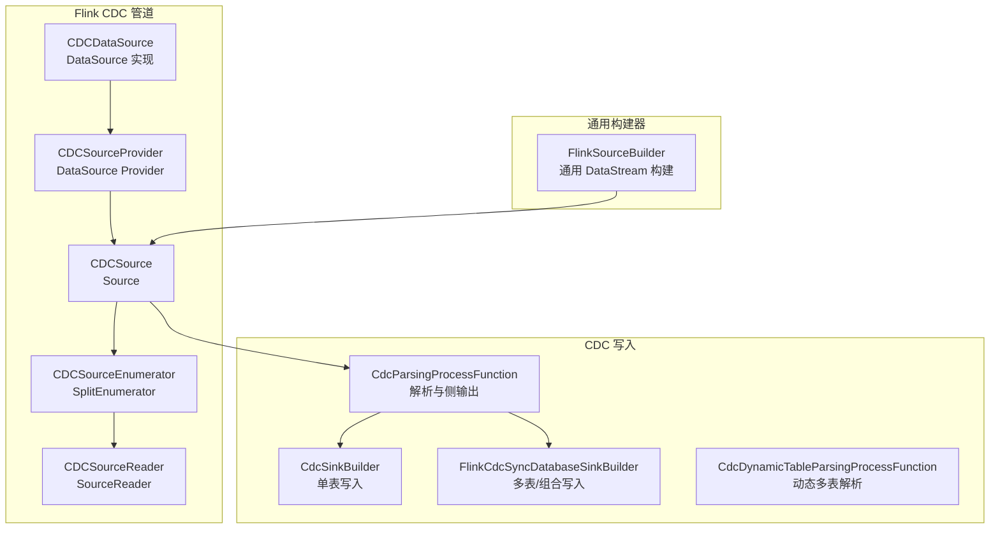
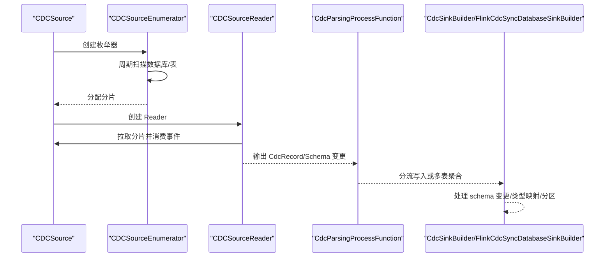
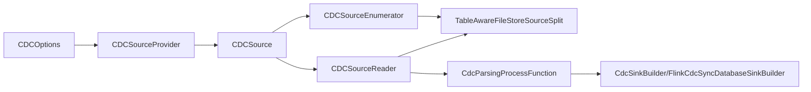
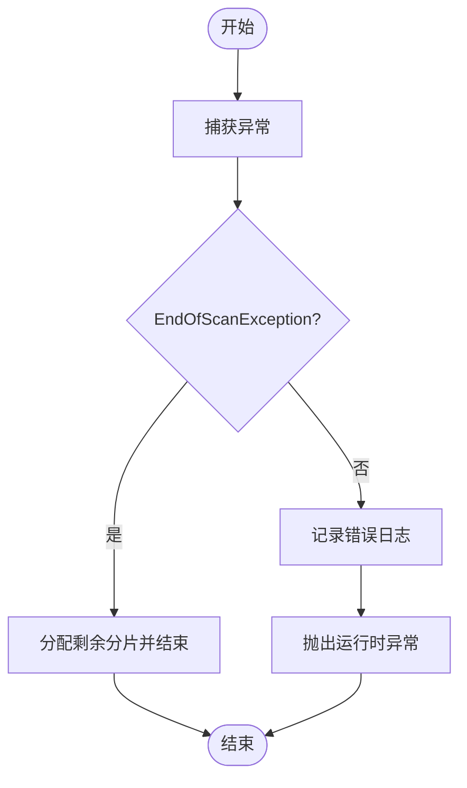

# 程序化CDC

<cite>
**本文引用的文件**   
- [CDCSource.java](file://paimon-flink/paimon-flink-cdc/src/main/java/org/apache/paimon/flink/pipeline/cdc/source/CDCSource.java)
- [CDCSourceProvider.java](file://paimon-flink/paimon-flink-cdc/src/main/java/org/apache/paimon/flink/pipeline/cdc/source/CDCSourceProvider.java)
- [CDCDataSource.java](file://paimon-flink/paimon-flink-cdc/src/main/java/org/apache/paimon/flink/pipeline/cdc/source/CDCDataSource.java)
- [CDCSourceEnumerator.java](file://paimon-flink/paimon-flink-cdc/src/main/java/org/apache/paimon/flink/pipeline/cdc/source/enumerator/CDCSourceEnumerator.java)
- [CDCSourceReader.java](file://paimon-flink/paimon-flink-cdc/src/main/java/org/apache/paimon/flink/pipeline/cdc/source/reader/CDCSourceReader.java)
- [CDCOptions.java](file://paimon-flink/paimon-flink-cdc/src/main/java/org/apache/paimon/flink/pipeline/cdc/CDCOptions.java)
- [CdcSinkBuilder.java](file://paimon-flink/paimon-flink-cdc/src/main/java/org/apache/paimon/flink/sink/cdc/CdcSinkBuilder.java)
- [FlinkCdcSyncDatabaseSinkBuilder.java](file://paimon-flink/paimon-flink-cdc/src/main/java/org/apache/paimon/flink/sink/cdc/FlinkCdcSyncDatabaseSinkBuilder.java)
- [CdcParsingProcessFunction.java](file://paimon-flink/paimon-flink-cdc/src/main/java/org/apache/paimon/flink/sink/cdc/CdcParsingProcessFunction.java)
- [CdcDynamicTableParsingProcessFunction.java](file://paimon-flink/paimon-flink-cdc/src/main/java/org/apache/paimon/flink/sink/cdc/CdcDynamicTableParsingProcessFunction.java)
- [CdcJsonDeserializationSchema.java](file://paimon-flink/paimon-flink-cdc/src/main/java/org/apache/paimon/flink/action/cdc/serialization/CdcJsonDeserializationSchema.java)
- [MongoDBActionUtils.java](file://paimon-flink/paimon-flink-cdc/src/main/java/org/apache/paimon/flink/action/cdc/mongodb/MongoDBActionUtils.java)
- [SyncJobHandler.java](file://paimon-flink/paimon-flink-cdc/src/main/java/org/apache/paimon/flink/action/cdc/SyncJobHandler.java)
- [FlinkSourceBuilder.java](file://paimon-flink/paimon-flink-common/src/main/java/org/apache/paimon/flink/source/FlinkSourceBuilder.java)
- [ExponentialHttpRequestRetryStrategy.java](file://paimon-api/src/main/java/org/apache/paimon/rest/ExponentialHttpRequestRetryStrategy.java)
- [mongo-cdc.md](file://docs/content/cdc-ingestion/mongo-cdc.md)
</cite>

## 目录
1. [引言](#引言)
2. [项目结构](#项目结构)
3. [核心组件](#核心组件)
4. [架构总览](#架构总览)
5. [详细组件分析](#详细组件分析)
6. [依赖分析](#依赖分析)
7. [性能考虑](#性能考虑)
8. [故障排查指南](#故障排查指南)
9. [结论](#结论)
10. [附录：开发示例与最佳实践](#附录开发示例与最佳实践)

## 引言
本篇文档围绕 Apache Paimon 的“程序化 CDC 集成”展开，系统讲解如何以编程方式实现从外部变更数据捕获（CDC）源到 Paimon 表的实时写入。重点包括：
- CDC 数据流的构建与执行路径
- CDCSource 的工作机制与配置项
- 自定义 DataStream 输入的 CDC 集成方案
- 程序化 CDC 的开发示例、最佳实践与调试技巧
- 错误处理与重试策略
- 性能优化建议

## 项目结构
与程序化 CDC 相关的核心模块主要分布在以下位置：
- Flink CDC 管道与源：paimon-flink/paimon-flink-cdc 模块中的 pipeline/cdc 及 sink/cdc 包
- Flink 通用 Source 构建器：paimon-flink-common 中的 FlinkSourceBuilder
- 文档与配置参考：docs/content/cdc-ingestion 下的各数据库 CDC 文档

图表来源
- [CDCSource.java:63-129](file://paimon-flink/paimon-flink-cdc/src/main/java/org/apache/paimon/flink/pipeline/cdc/source/CDCSource.java#L63-L129)
- [CDCSourceEnumerator.java:72-196](file://paimon-flink/paimon-flink-cdc/src/main/java/org/apache/paimon/flink/pipeline/cdc/source/enumerator/CDCSourceEnumerator.java#L72-L196)
- [CDCSourceReader.java:38-99](file://paimon-flink/paimon-flink-cdc/src/main/java/org/apache/paimon/flink/pipeline/cdc/source/reader/CDCSourceReader.java#L38-L99)
- [CDCSourceProvider.java:34-47](file://paimon-flink/paimon-flink-cdc/src/main/java/org/apache/paimon/flink/pipeline/cdc/source/CDCSourceProvider.java#L34-L47)
- [CDCDataSource.java:33-60](file://paimon-flink/paimon-flink-cdc/src/main/java/org/apache/paimon/flink/pipeline/cdc/source/CDCDataSource.java#L33-L60)
- [CdcSinkBuilder.java:105-124](file://paimon-flink/paimon-flink-cdc/src/main/java/org/apache/paimon/flink/sink/cdc/CdcSinkBuilder.java#L105-L124)
- [FlinkCdcSyncDatabaseSinkBuilder.java:63-161](file://paimon-flink/paimon-flink-cdc/src/main/java/org/apache/paimon/flink/sink/cdc/FlinkCdcSyncDatabaseSinkBuilder.java#L63-L161)
- [CdcParsingProcessFunction.java:37-74](file://paimon-flink/paimon-flink-cdc/src/main/java/org/apache/paimon/flink/sink/cdc/CdcParsingProcessFunction.java#L37-L74)
- [CdcDynamicTableParsingProcessFunction.java:63-98](file://paimon-flink/paimon-flink-cdc/src/main/java/org/apache/paimon/flink/sink/cdc/CdcDynamicTableParsingProcessFunction.java#L63-L98)
- [FlinkSourceBuilder.java:240-271](file://paimon-flink/paimon-flink-common/src/main/java/org/apache/paimon/flink/source/FlinkSourceBuilder.java#L240-L271)

章节来源
- [CDCSource.java:63-129](file://paimon-flink/paimon-flink-cdc/src/main/java/org/apache/paimon/flink/pipeline/cdc/source/CDCSource.java#L63-L129)
- [CDCSourceEnumerator.java:72-196](file://paimon-flink/paimon-flink-cdc/src/main/java/org/apache/paimon/flink/pipeline/cdc/source/enumerator/CDCSourceEnumerator.java#L72-L196)
- [CDCSourceReader.java:38-99](file://paimon-flink/paimon-flink-cdc/src/main/java/org/apache/paimon/flink/pipeline/cdc/source/reader/CDCSourceReader.java#L38-L99)
- [CDCSourceProvider.java:34-47](file://paimon-flink/paimon-flink-cdc/src/main/java/org/apache/paimon/flink/pipeline/cdc/source/CDCSourceProvider.java#L34-L47)
- [CDCDataSource.java:33-60](file://paimon-flink/paimon-flink-cdc/src/main/java/org/apache/paimon/flink/pipeline/cdc/source/CDCDataSource.java#L33-L60)
- [FlinkSourceBuilder.java:240-271](file://paimon-flink/paimon-flink-common/src/main/java/org/apache/paimon/flink/source/FlinkSourceBuilder.java#L240-L271)

## 核心组件
- CDCSource：面向 Flink CDC 框架的 Source 实现，负责枚举与读取 Paimon 表快照生成的分片，并在 Reader 中消费事件流。
- CDCSourceEnumerator：协调器端枚举器，周期性扫描数据库/表，发现新表并分配分片给下游 Reader。
- CDCSourceReader：单线程多路复用的 SourceReader，按需拉取分片并消费记录。
- CDCSourceProvider / CDCDataSource：DataSource 接口实现，封装 CatalogContext、Flink 配置与 CDC 配置，提供 CDCSource。
- CdcParsingProcessFunction / CdcDynamicTableParsingProcessFunction：将 CDC 事件解析为 Paimon 的 CdcRecord 或 CdcSchema，并通过侧输出分流 schema 变更与数据记录。
- CdcSinkBuilder / FlinkCdcSyncDatabaseSinkBuilder：将解析后的数据写入 Paimon 表，支持单表写入与多表/组合写入模式。
- FlinkSourceBuilder：通用的 DataStream 构建器，用于将 Source 转换为 DataStream 并设置并行度、水位等。

章节来源
- [CDCSource.java:63-129](file://paimon-flink/paimon-flink-cdc/src/main/java/org/apache/paimon/flink/pipeline/cdc/source/CDCSource.java#L63-L129)
- [CDCSourceEnumerator.java:72-196](file://paimon-flink/paimon-flink-cdc/src/main/java/org/apache/paimon/flink/pipeline/cdc/source/enumerator/CDCSourceEnumerator.java#L72-L196)
- [CDCSourceReader.java:38-99](file://paimon-flink/paimon-flink-cdc/src/main/java/org/apache/paimon/flink/pipeline/cdc/source/reader/CDCSourceReader.java#L38-L99)
- [CdcParsingProcessFunction.java:37-74](file://paimon-flink/paimon-flink-cdc/src/main/java/org/apache/paimon/flink/sink/cdc/CdcParsingProcessFunction.java#L37-L74)
- [CdcDynamicTableParsingProcessFunction.java:63-98](file://paimon-flink/paimon-flink-cdc/src/main/java/org/apache/paimon/flink/sink/cdc/CdcDynamicTableParsingProcessFunction.java#L63-L98)
- [CdcSinkBuilder.java:105-124](file://paimon-flink/paimon-flink-cdc/src/main/java/org/apache/paimon/flink/sink/cdc/CdcSinkBuilder.java#L105-L124)
- [FlinkCdcSyncDatabaseSinkBuilder.java:63-161](file://paimon-flink/paimon-flink-cdc/src/main/java/org/apache/paimon/flink/sink/cdc/FlinkCdcSyncDatabaseSinkBuilder.java#L63-L161)
- [FlinkSourceBuilder.java:240-271](file://paimon-flink/paimon-flink-common/src/main/java/org/apache/paimon/flink/source/FlinkSourceBuilder.java#L240-L271)

## 架构总览
下图展示了从 CDC 源到 Paimon 写入的整体流程，以及关键组件之间的交互关系。

图表来源
- [CDCSource.java:85-129](file://paimon-flink/paimon-flink-cdc/src/main/java/org/apache/paimon/flink/pipeline/cdc/source/CDCSource.java#L85-L129)
- [CDCSourceEnumerator.java:164-289](file://paimon-flink/paimon-flink-cdc/src/main/java/org/apache/paimon/flink/pipeline/cdc/source/enumerator/CDCSourceEnumerator.java#L164-L289)
- [CDCSourceReader.java:64-98](file://paimon-flink/paimon-flink-cdc/src/main/java/org/apache/paimon/flink/pipeline/cdc/source/reader/CDCSourceReader.java#L64-L98)
- [CdcParsingProcessFunction.java:65-73](file://paimon-flink/paimon-flink-cdc/src/main/java/org/apache/paimon/flink/sink/cdc/CdcParsingProcessFunction.java#L65-L73)
- [CdcSinkBuilder.java:105-124](file://paimon-flink/paimon-flink-cdc/src/main/java/org/apache/paimon/flink/sink/cdc/CdcSinkBuilder.java#L105-L124)
- [FlinkCdcSyncDatabaseSinkBuilder.java:163-205](file://paimon-flink/paimon-flink-cdc/src/main/java/org/apache/paimon/flink/sink/cdc/FlinkCdcSyncDatabaseSinkBuilder.java#L163-L205)

## 详细组件分析

### CDCSource：Flink CDC Source 实现
- 角色：实现 Flink CDC 的 Source 接口，提供分片序列化器、检查点序列化器、枚举器与 Reader 创建。
- 关键点：
  - 连续无界流（CONTINUOUS_UNBOUNDED）
  - 通过 CatalogContext 和 CDC 配置创建 Catalog 与 TableManager
  - 生成 SchemaChangeEvent 列表用于下游 schema 变更处理

章节来源
- [CDCSource.java:63-129](file://paimon-flink/paimon-flink-cdc/src/main/java/org/apache/paimon/flink/pipeline/cdc/source/CDCSource.java#L63-L129)
- [CDCSource.java:132-209](file://paimon-flink/paimon-flink-cdc/src/main/java/org/apache/paimon/flink/pipeline/cdc/source/CDCSource.java#L132-L209)

### CDCSourceEnumerator：表发现与分片分配
- 角色：协调器端枚举器，周期扫描数据库/表，发现新表并生成分片，按子任务分配。
- 关键点：
  - 支持数据库/表级联发现与动态发现间隔
  - 将 FileStoreTable 的快照切分为 TableAwareFileStoreSourceSplit
  - 同步分配与回退策略，避免饥饿

章节来源
- [CDCSourceEnumerator.java:72-196](file://paimon-flink/paimon-flink-cdc/src/main/java/org/apache/paimon/flink/pipeline/cdc/source/enumerator/CDCSourceEnumerator.java#L72-L196)
- [CDCSourceEnumerator.java:218-289](file://paimon-flink/paimon-flink-cdc/src/main/java/org/apache/paimon/flink/pipeline/cdc/source/enumerator/CDCSourceEnumerator.java#L218-L289)
- [CDCSourceEnumerator.java:342-390](file://paimon-flink/paimon-flink-cdc/src/main/java/org/apache/paimon/flink/pipeline/cdc/source/enumerator/CDCSourceEnumerator.java#L342-L390)

### CDCSourceReader：分片消费与事件发射
- 角色：基于 MultiplexSourceReaderBase 的单线程 Reader，按需请求分片并发射事件。
- 关键点：
  - 初始化时若无分片则请求分片
  - 分片消费完成后再次请求新分片
  - 使用 CDCRecordsWithSplitIds 发射记录并统计指标

章节来源
- [CDCSourceReader.java:38-99](file://paimon-flink/paimon-flink-cdc/src/main/java/org/apache/paimon/flink/pipeline/cdc/source/reader/CDCSourceReader.java#L38-L99)

### CDCSourceProvider / CDCDataSource：DataSource 接口实现
- 角色：将 CatalogContext、Flink 配置与 CDC 配置封装为 DataSource，供上层统一接入。
- 关键点：
  - 提供 EventSourceProvider 与 MetadataAccessor
  - 在首次访问时延迟创建 Catalog

章节来源
- [CDCSourceProvider.java:34-47](file://paimon-flink/paimon-flink-cdc/src/main/java/org/apache/paimon/flink/pipeline/cdc/source/CDCSourceProvider.java#L34-L47)
- [CDCDataSource.java:33-60](file://paimon-flink/paimon-flink-cdc/src/main/java/org/apache/paimon/flink/pipeline/cdc/source/CDCDataSource.java#L33-L60)

### 解析与分流：CdcParsingProcessFunction 与 CdcDynamicTableParsingProcessFunction
- 角色：将 CDC 事件解析为 CdcRecord 或 CdcSchema，并通过侧输出分流 schema 变更与数据记录。
- 关键点：
  - 单表常量表名场景使用 CdcParsingProcessFunction
  - 动态多表场景使用 CdcDynamicTableParsingProcessFunction，结合 CatalogLoader 动态建表与 schema 变更处理

章节来源
- [CdcParsingProcessFunction.java:37-74](file://paimon-flink/paimon-flink-cdc/src/main/java/org/apache/paimon/flink/sink/cdc/CdcParsingProcessFunction.java#L37-L74)
- [CdcDynamicTableParsingProcessFunction.java:63-98](file://paimon-flink/paimon-flink-cdc/src/main/java/org/apache/paimon/flink/sink/cdc/CdcDynamicTableParsingProcessFunction.java#L63-L98)

### 写入构建：CdcSinkBuilder 与 FlinkCdcSyncDatabaseSinkBuilder
- 角色：将解析后的 CdcRecord 写入 Paimon 表，支持单表写入与多表/组合写入模式。
- 关键点：
  - 单表模式：解析后直接写入对应 Paimon 表
  - 组合模式：对新增表进行多路复用写入；对 schema 变更使用 UpdatedDataFieldsProcessFunction 处理
  - 分桶模式适配：固定/动态/延后/无感知分桶

章节来源
- [CdcSinkBuilder.java:105-124](file://paimon-flink/paimon-flink-cdc/src/main/java/org/apache/paimon/flink/sink/cdc/CdcSinkBuilder.java#L105-L124)
- [FlinkCdcSyncDatabaseSinkBuilder.java:63-161](file://paimon-flink/paimon-flink-cdc/src/main/java/org/apache/paimon/flink/sink/cdc/FlinkCdcSyncDatabaseSinkBuilder.java#L63-L161)
- [FlinkCdcSyncDatabaseSinkBuilder.java:163-205](file://paimon-flink/paimon-flink-cdc/src/main/java/org/apache/paimon/flink/sink/cdc/FlinkCdcSyncDatabaseSinkBuilder.java#L163-L205)
- [FlinkCdcSyncDatabaseSinkBuilder.java:225-279](file://paimon-flink/paimon-flink-cdc/src/main/java/org/apache/paimon/flink/sink/cdc/FlinkCdcSyncDatabaseSinkBuilder.java#L225-L279)

### 通用 DataStream 构建：FlinkSourceBuilder
- 角色：将任意 Source 转换为 DataStream，设置并行度、水位策略与类型信息。
- 关键点：
  - 支持自定义 Operator UID 后缀
  - 支持投影字段与类型推导

章节来源
- [FlinkSourceBuilder.java:240-271](file://paimon-flink/paimon-flink-common/src/main/java/org/apache/paimon/flink/source/FlinkSourceBuilder.java#L240-L271)

### CDC 配置与选项：CDCOptions
- 角色：定义 CDC 源的关键配置项，如 database、table、table.discovery-interval 等，并提供与 Flink CDC 配置的桥接。
- 关键点：
  - 支持将 Paimon 配置项映射为 Flink CDC 配置项
  - 支持回退键与废弃键映射

章节来源
- [CDCOptions.java:34-104](file://paimon-flink/paimon-flink-cdc/src/main/java/org/apache/paimon/flink/pipeline/cdc/CDCOptions.java#L34-L104)

### 自定义 CDC 源的集成：MongoDB 示例
- 角色：展示如何通过 MongoDBSourceBuilder 构建自定义 CDC 输入流。
- 关键点：
  - 提供默认 ID 生成策略与指定字段解析模式
  - 通过 MongoDBActionUtils.buildMongodbSource 构建源

章节来源
- [MongoDBActionUtils.java:90-92](file://paimon-flink/paimon-flink-cdc/src/main/java/org/apache/paimon/flink/action/cdc/mongodb/MongoDBActionUtils.java#L90-L92)
- [mongo-cdc.md:62-74](file://docs/content/cdc-ingestion/mongo-cdc.md#L62-L74)

### CDC 数据流的自定义转换与处理
- 角色：通过 ProcessFunction 对解析结果进行二次转换、过滤、字段映射等。
- 关键点：
  - 使用侧输出标签分流 schema 变更与数据记录
  - 结合 CatalogLoader 与类型映射进行 schema 进化处理

章节来源
- [CdcParsingProcessFunction.java:37-74](file://paimon-flink/paimon-flink-cdc/src/main/java/org/apache/paimon/flink/sink/cdc/CdcParsingProcessFunction.java#L37-L74)
- [CdcDynamicTableParsingProcessFunction.java:63-98](file://paimon-flink/paimon-flink-cdc/src/main/java/org/apache/paimon/flink/sink/cdc/CdcDynamicTableParsingProcessFunction.java#L63-L98)

### CDCSourceBuilder 的使用方法与配置选项
- 角色：通过 CDCSourceProvider/CDCDataSource 获取 CDCSource，再由 FlinkSourceBuilder 转为 DataStream。
- 关键配置项：
  - database：要扫描的数据库名称（可选）
  - table：要扫描的表名称（可选）
  - table.discovery-interval：动态发现新表的时间间隔（可选）
- 注意事项：
  - 若未指定 database，则会动态扫描所有数据库
  - 若未指定 table，则会动态扫描该数据库下的所有表

章节来源
- [CDCSourceProvider.java:34-47](file://paimon-flink/paimon-flink-cdc/src/main/java/org/apache/paimon/flink/pipeline/cdc/source/CDCSourceProvider.java#L34-L47)
- [CDCDataSource.java:33-60](file://paimon-flink/paimon-flink-cdc/src/main/java/org/apache/paimon/flink/pipeline/cdc/source/CDCDataSource.java#L33-L60)
- [CDCOptions.java:34-53](file://paimon-flink/paimon-flink-cdc/src/main/java/org/apache/paimon/flink/pipeline/cdc/CDCOptions.java#L34-L53)

## 依赖分析
- CDCSource 依赖 CatalogContext 与 CDC 配置，通过 TableManager 缓存表 schema 与读取器，减少重复开销。
- CDCSourceEnumerator 依赖 Catalog 扫描数据库/表，生成 TableAwareFileStoreSourceSplit 并分配给 Reader。
- CDCSourceReader 依赖 TableManager 与 IOManager，按需消费分片并发射事件。
- 解析与写入阶段通过 ProcessFunction 与多路复用 Sink 完成分流与落库。

图表来源
- [CDCOptions.java:34-104](file://paimon-flink/paimon-flink-cdc/src/main/java/org/apache/paimon/flink/pipeline/cdc/CDCOptions.java#L34-L104)
- [CDCSourceProvider.java:34-47](file://paimon-flink/paimon-flink-cdc/src/main/java/org/apache/paimon/flink/pipeline/cdc/source/CDCSourceProvider.java#L34-L47)
- [CDCSource.java:63-129](file://paimon-flink/paimon-flink-cdc/src/main/java/org/apache/paimon/flink/pipeline/cdc/source/CDCSource.java#L63-L129)
- [CDCSourceEnumerator.java:72-196](file://paimon-flink/paimon-flink-cdc/src/main/java/org/apache/paimon/flink/pipeline/cdc/source/enumerator/CDCSourceEnumerator.java#L72-L196)
- [CDCSourceReader.java:38-99](file://paimon-flink/paimon-flink-cdc/src/main/java/org/apache/paimon/flink/pipeline/cdc/source/reader/CDCSourceReader.java#L38-L99)
- [CdcParsingProcessFunction.java:37-74](file://paimon-flink/paimon-flink-cdc/src/main/java/org/apache/paimon/flink/sink/cdc/CdcParsingProcessFunction.java#L37-L74)
- [CdcSinkBuilder.java:105-124](file://paimon-flink/paimon-flink-cdc/src/main/java/org/apache/paimon/flink/sink/cdc/CdcSinkBuilder.java#L105-L124)
- [FlinkCdcSyncDatabaseSinkBuilder.java:63-161](file://paimon-flink/paimon-flink-cdc/src/main/java/org/apache/paimon/flink/sink/cdc/FlinkCdcSyncDatabaseSinkBuilder.java#L63-L161)

## 性能考虑
- 分片与并行度
  - 通过 CoreOptions.SCAN_MAX_SPLITS_PER_TASK 控制每任务最大分片数，避免过度切分导致调度开销。
  - 使用 FlinkSourceBuilder 设置并行度与 UID 后缀，提升可追踪性与资源利用。
- 动态发现与扫描
  - table.discovery-interval 控制动态发现频率，建议根据表增长速率调整，避免频繁扫描。
- 写入路径优化
  - 组合模式适合多表增量场景，减少 Sink 数量；单表模式适合稳定表集。
  - 分桶模式选择应匹配数据分布与查询特征（固定/动态/延后/无感知）。
- 类型映射与 schema 变更
  - 使用 TypeMapping 与 UpdatedDataFieldsProcessFunction 处理 schema 变更，避免全量重建。

章节来源
- [FlinkSourceBuilder.java:240-271](file://paimon-flink/paimon-flink-common/src/main/java/org/apache/paimon/flink/source/FlinkSourceBuilder.java#L240-L271)
- [CDCOptions.java:48-53](file://paimon-flink/paimon-flink-cdc/src/main/java/org/apache/paimon/flink/pipeline/cdc/CDCOptions.java#L48-L53)
- [FlinkCdcSyncDatabaseSinkBuilder.java:63-161](file://paimon-flink/paimon-flink-cdc/src/main/java/org/apache/paimon/flink/sink/cdc/FlinkCdcSyncDatabaseSinkBuilder.java#L63-L161)

## 故障排查指南
- 常见问题
  - 表不存在或类型不匹配：枚举器在恢复时会跳过非 FileStoreTable 或不存在的表，检查 Catalog 与表类型。
  - EndOfScanException：表示扫描完成，确认是否需要持续监听或检查源状态。
  - schema 变更未生效：确认已启用 schema 变更处理流程（UpdatedDataFieldsProcessFunction），并确保并行度限制为 1。
- 日志与指标
  - 使用 Reader/Enumerator 的日志级别定位分片分配与消费异常。
  - 通过 Flink Metrics 与 FileStoreSourceReaderMetrics 观察吞吐与延迟。
- 重试与幂等
  - 对于 REST 请求，采用指数退避与 Retry-After 头部控制重试间隔，仅对幂等请求重试。
- 错误处理流程

图表来源
- [CDCSourceEnumerator.java:241-251](file://paimon-flink/paimon-flink-cdc/src/main/java/org/apache/paimon/flink/pipeline/cdc/source/enumerator/CDCSourceEnumerator.java#L241-L251)

章节来源
- [CDCSourceEnumerator.java:164-289](file://paimon-flink/paimon-flink-cdc/src/main/java/org/apache/paimon/flink/pipeline/cdc/source/enumerator/CDCSourceEnumerator.java#L164-L289)
- [ExponentialHttpRequestRetryStrategy.java:99-133](file://paimon-api/src/main/java/org/apache/paimon/rest/ExponentialHttpRequestRetryStrategy.java#L99-L133)

## 结论
通过 CDCSource、CDCSourceEnumerator、CDCSourceReader 与解析/写入组件的协同，Paimon 提供了可扩展、可演进的程序化 CDC 集成能力。合理配置 CDCOptions、选择合适的写入模式与分桶策略，并结合错误处理与重试机制，可在生产环境中实现高可靠、高性能的数据同步。

## 附录：开发示例与最佳实践
- 开发步骤
  - 准备 Catalog 与 Flink 配置，构造 CDCSourceProvider/CDCDataSource
  - 通过 FlinkSourceBuilder 将 CDCSource 转为 DataStream
  - 使用 CdcParsingProcessFunction 解析事件，分流 schema 变更与数据记录
  - 选择 CdcSinkBuilder 或 FlinkCdcSyncDatabaseSinkBuilder 写入 Paimon
- 最佳实践
  - 使用组合模式处理多表增量，减少 Sink 数量
  - 合理设置 table.discovery-interval，避免频繁扫描
  - 对 schema 变更使用 UpdatedDataFieldsProcessFunction，保持并行度限制
  - 为关键 Operator 设置 UID 后缀，便于排障
  - 使用 TypeMapping 映射复杂类型，确保兼容性
- 调试技巧
  - 提升日志级别，观察枚举器与 Reader 的分片分配与消费行为
  - 使用 Metrics 监控吞吐与延迟，定位瓶颈
  - 对 REST 请求启用指数退避与幂等重试，降低抖动影响

章节来源
- [CDCSourceProvider.java:34-47](file://paimon-flink/paimon-flink-cdc/src/main/java/org/apache/paimon/flink/pipeline/cdc/source/CDCSourceProvider.java#L34-L47)
- [CDCDataSource.java:33-60](file://paimon-flink/paimon-flink-cdc/src/main/java/org/apache/paimon/flink/pipeline/cdc/source/CDCDataSource.java#L33-L60)
- [FlinkSourceBuilder.java:240-271](file://paimon-flink/paimon-flink-common/src/main/java/org/apache/paimon/flink/source/FlinkSourceBuilder.java#L240-L271)
- [CdcParsingProcessFunction.java:37-74](file://paimon-flink/paimon-flink-cdc/src/main/java/org/apache/paimon/flink/sink/cdc/CdcParsingProcessFunction.java#L37-L74)
- [CdcSinkBuilder.java:105-124](file://paimon-flink/paimon-flink-cdc/src/main/java/org/apache/paimon/flink/sink/cdc/CdcSinkBuilder.java#L105-L124)
- [FlinkCdcSyncDatabaseSinkBuilder.java:63-161](file://paimon-flink/paimon-flink-cdc/src/main/java/org/apache/paimon/flink/sink/cdc/FlinkCdcSyncDatabaseSinkBuilder.java#L63-L161)
- [ExponentialHttpRequestRetryStrategy.java:99-133](file://paimon-api/src/main/java/org/apache/paimon/rest/ExponentialHttpRequestRetryStrategy.java#L99-L133)