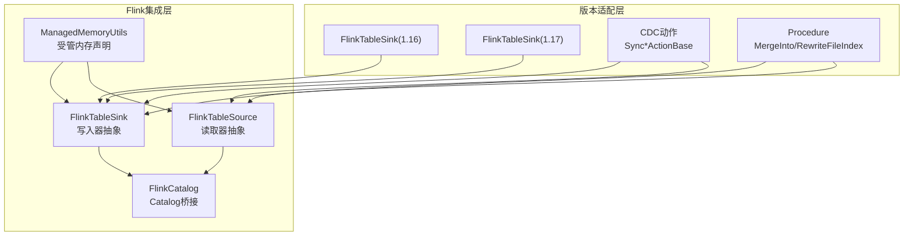
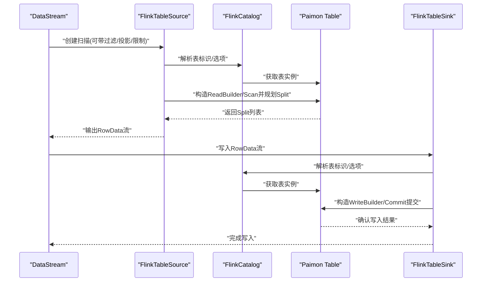
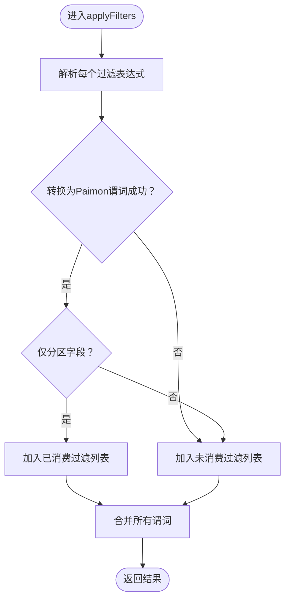
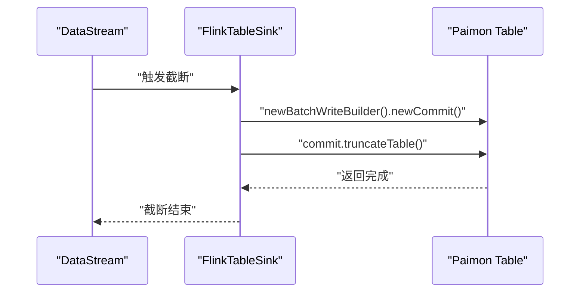
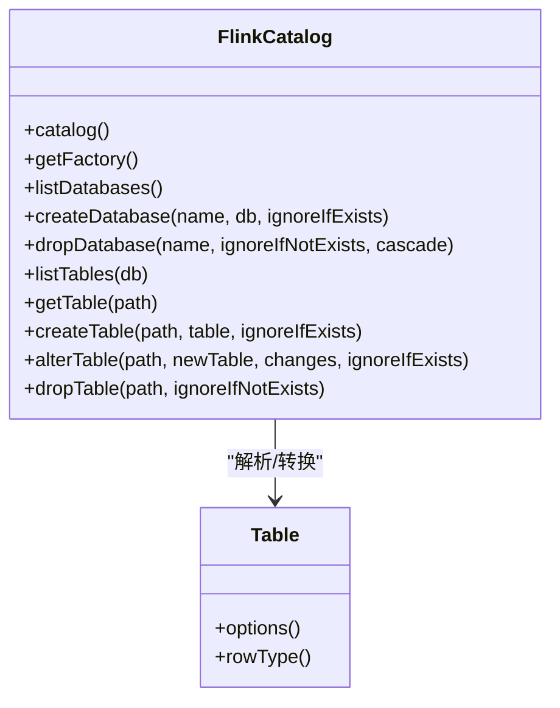
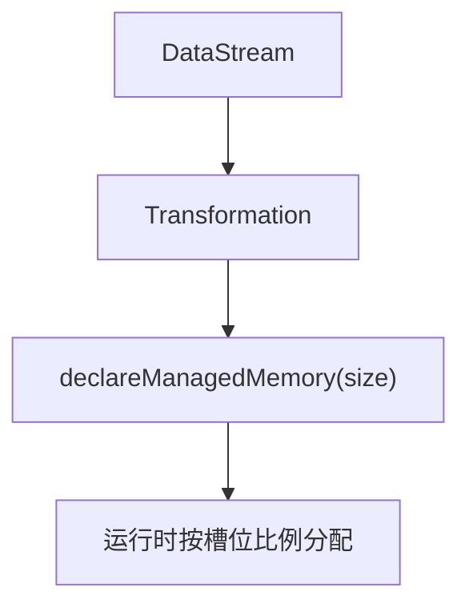
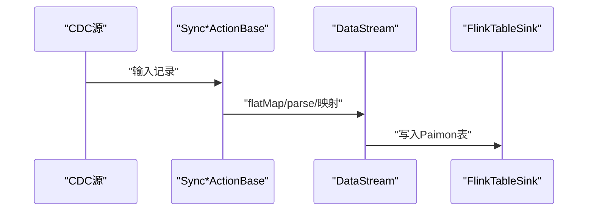
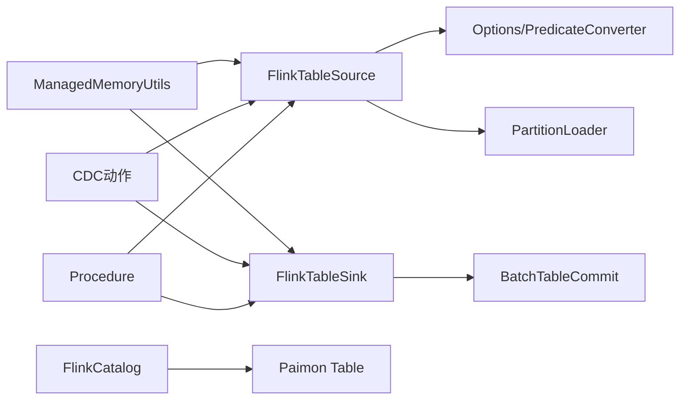

# DataStream集成

<cite>
**本文引用的文件**
- [FlinkTableSource.java](file://paimon-flink/paimon-flink-common/src/main/java/org/apache/paimon/flink/source/FlinkTableSource.java)
- [FlinkTableSink.java（通用）](file://paimon-flink/paimon-flink-common/src/main/java/org/apache/paimon/flink/sink/FlinkTableSink.java)
- [FlinkTableSink.java（1.16）](file://paimon-flink/paimon-flink-1.16/src/main/java/org/apache/paimon/flink/sink/FlinkTableSink.java)
- [FlinkTableSink.java（1.17）](file://paimon-flink/paimon-flink-1.17/src/main/java/org/apache/paimon/flink/sink/FlinkTableSink.java)
- [FlinkCatalog.java](file://paimon-flink/paimon-flink-common/src/main/java/org/apache/paimon/flink/FlinkCatalog.java)
- [ManagedMemoryUtils.java](file://paimon-flink/paimon-flink-common/src/main/java/org/apache/paimon/flink/utils/ManagedMemoryUtils.java)
- [SyncDatabaseActionBase.java](file://paimon-flink/paimon-flink-cdc/src/main/java/org/apache/paimon/flink/action/cdc/SyncDatabaseActionBase.java)
- [SyncTableActionBase.java](file://paimon-flink/paimon-flink-cdc/src/main/java/org/apache/paimon/flink/action/cdc/SyncTableActionBase.java)
- [SynchronizationActionBase.java](file://paimon-flink/paimon-flink-cdc/src/main/java/org/apache/paimon/flink/action/cdc/SynchronizationActionBase.java)
- [MergeIntoProcedure.java](file://paimon-flink/paimon-flink-1.18/src/main/java/org/apache/paimon/flink/procedure/MergeIntoProcedure.java)
- [RewriteFileIndexProcedure.java](file://paimon-flink/paimon-flink-1.18/src/main/java/org/apache/paimon/flink/procedure/RewriteFileIndexProcedure.java)
</cite>

## 目录
1. [简介](#简介)
2. [项目结构](#项目结构)
3. [核心组件](#核心组件)
4. [架构总览](#架构总览)
5. [组件详解](#组件详解)
6. [依赖关系分析](#依赖关系分析)
7. [性能考量](#性能考量)
8. [故障排查指南](#故障排查指南)
9. [结论](#结论)
10. [附录](#附录)

## 简介
本文件面向在Apache Flink DataStream中使用Paimon的用户，系统性地介绍如何通过Flink DataStream API进行数据读取与写入，以及如何借助FlinkTableSource与FlinkTableSink实现端到端的流批一体化能力。文档同时覆盖状态管理、检查点与容错、辅助表与Temporal Table Join、Structured Streaming支持与配置，并给出性能调优与内存管理的最佳实践。

## 项目结构
围绕Flink DataStream与Paimon的集成，核心代码主要分布在以下模块：
- paimon-flink/paimon-flink-common：通用的Flink Catalog、Source/Sink基类与工具
- paimon-flink/paimon-flink-1.16/1.17/1.18：不同Flink版本下的具体实现差异
- paimon-flink/paimon-flink-cdc：基于CDC的同步动作，直接产出DataStream
- paimon-flink/paimon-flink-1.18/procedure：部分操作以Procedure形式封装为DataStream

图表来源
- [FlinkTableSource.java:62-305](file://paimon-flink/paimon-flink-common/src/main/java/org/apache/paimon/flink/source/FlinkTableSource.java#L62-L305)
- [FlinkTableSink.java（通用）:28-46](file://paimon-flink/paimon-flink-common/src/main/java/org/apache/paimon/flink/sink/FlinkTableSink.java#L28-L46)
- [FlinkTableSink.java（1.16）:26-34](file://paimon-flink/paimon-flink-1.16/src/main/java/org/apache/paimon/flink/sink/FlinkTableSink.java#L26-L34)
- [FlinkTableSink.java（1.17）:26-34](file://paimon-flink/paimon-flink-1.17/src/main/java/org/apache/paimon/flink/sink/FlinkTableSink.java#L26-L34)
- [FlinkCatalog.java:177-215](file://paimon-flink/paimon-flink-common/src/main/java/org/apache/paimon/flink/FlinkCatalog.java#L177-L215)
- [ManagedMemoryUtils.java:28-51](file://paimon-flink/paimon-flink-common/src/main/java/org/apache/paimon/flink/utils/ManagedMemoryUtils.java#L28-L51)
- [SyncDatabaseActionBase.java:32-242](file://paimon-flink/paimon-flink-cdc/src/main/java/org/apache/paimon/flink/action/cdc/SyncDatabaseActionBase.java#L32-L242)
- [SyncTableActionBase.java:33-163](file://paimon-flink/paimon-flink-cdc/src/main/java/org/apache/paimon/flink/action/cdc/SyncTableActionBase.java#L33-L163)
- [SynchronizationActionBase.java:40-138](file://paimon-flink/paimon-flink-cdc/src/main/java/org/apache/paimon/flink/action/cdc/SynchronizationActionBase.java#L40-L138)
- [MergeIntoProcedure.java:24-220](file://paimon-flink/paimon-flink-1.18/src/main/java/org/apache/paimon/flink/procedure/MergeIntoProcedure.java#L24-L220)
- [RewriteFileIndexProcedure.java:38-96](file://paimon-flink/paimon-flink-1.18/src/main/java/org/apache/paimon/flink/procedure/RewriteFileIndexProcedure.java#L38-L96)

章节来源
- [FlinkTableSource.java:62-305](file://paimon-flink/paimon-flink-common/src/main/java/org/apache/paimon/flink/source/FlinkTableSource.java#L62-L305)
- [FlinkTableSink.java（通用）:28-46](file://paimon-flink/paimon-flink-common/src/main/java/org/apache/paimon/flink/sink/FlinkTableSink.java#L28-L46)
- [FlinkCatalog.java:177-215](file://paimon-flink/paimon-flink-common/src/main/java/org/apache/paimon/flink/FlinkCatalog.java#L177-L215)
- [ManagedMemoryUtils.java:28-51](file://paimon-flink/paimon-flink-common/src/main/java/org/apache/paimon/flink/utils/ManagedMemoryUtils.java#L28-L51)
- [SyncDatabaseActionBase.java:32-242](file://paimon-flink/paimon-flink-cdc/src/main/java/org/apache/paimon/flink/action/cdc/SyncDatabaseActionBase.java#L32-L242)
- [SyncTableActionBase.java:33-163](file://paimon-flink/paimon-flink-cdc/src/main/java/org/apache/paimon/flink/action/cdc/SyncTableActionBase.java#L33-L163)
- [SynchronizationActionBase.java:40-138](file://paimon-flink/paimon-flink-cdc/src/main/java/org/apache/paimon/flink/action/cdc/SynchronizationActionBase.java#L40-L138)
- [MergeIntoProcedure.java:24-220](file://paimon-flink/paimon-flink-1.18/src/main/java/org/apache/paimon/flink/procedure/MergeIntoProcedure.java#L24-L220)
- [RewriteFileIndexProcedure.java:38-96](file://paimon-flink/paimon-flink-1.18/src/main/java/org/apache/paimon/flink/procedure/RewriteFileIndexProcedure.java#L38-L96)

## 核心组件
- FlinkTableSource：实现Flink ScanTableSource接口，负责将Paimon表转换为DataStream的扫描入口；支持过滤下推、投影下推、限制下推、分区谓词构建与并行度推断。
- FlinkTableSink：实现Flink Sink接口，负责将DataStream写入Paimon表；在通用版本中实现批量截断能力；在1.16/1.17版本中扩展了行级操作支持。
- FlinkCatalog：作为Flink Catalog桥接Paimon Catalog，提供表/视图/物化视图的创建、变更与查询，支撑SQL与DataStream双入口。
- ManagedMemoryUtils：在DataStream算子层面声明受管内存，优化读写阶段的内存使用与吞吐。
- CDC动作与Procedure：将CDC同步与部分DDL/维护操作以DataStream或Procedure形式暴露，便于在流式作业中编排。

章节来源
- [FlinkTableSource.java:62-305](file://paimon-flink/paimon-flink-common/src/main/java/org/apache/paimon/flink/source/FlinkTableSource.java#L62-L305)
- [FlinkTableSink.java（通用）:28-46](file://paimon-flink/paimon-flink-common/src/main/java/org/apache/paimon/flink/sink/FlinkTableSink.java#L28-L46)
- [FlinkTableSink.java（1.16）:26-34](file://paimon-flink/paimon-flink-1.16/src/main/java/org/apache/paimon/flink/sink/FlinkTableSink.java#L26-L34)
- [FlinkTableSink.java（1.17）:26-34](file://paimon-flink/paimon-flink-1.17/src/main/java/org/apache/paimon/flink/sink/FlinkTableSink.java#L26-L34)
- [FlinkCatalog.java:177-215](file://paimon-flink/paimon-flink-common/src/main/java/org/apache/paimon/flink/FlinkCatalog.java#L177-L215)
- [ManagedMemoryUtils.java:28-51](file://paimon-flink/paimon-flink-common/src/main/java/org/apache/paimon/flink/utils/ManagedMemoryUtils.java#L28-L51)

## 架构总览
下图展示了从Flink DataStream到Paimon的读写路径，以及与Catalog、Procedure/CDC的交互关系。

图表来源
- [FlinkTableSource.java:108-201](file://paimon-flink/paimon-flink-common/src/main/java/org/apache/paimon/flink/source/FlinkTableSource.java#L108-L201)
- [FlinkTableSink.java（通用）:32-44](file://paimon-flink/paimon-flink-common/src/main/java/org/apache/paimon/flink/sink/FlinkTableSink.java#L32-L44)
- [FlinkCatalog.java:287-335](file://paimon-flink/paimon-flink-common/src/main/java/org/apache/paimon/flink/FlinkCatalog.java#L287-L335)

## 组件详解

### FlinkTableSource：读取器与谓词/投影/限制下推
- 能力概览
  - 过滤下推：将Flink表达式转换为Paimon谓词，区分分区字段与非分区字段，仅对分区谓词进行下推，确保查询正确性。
  - 投影下推：记录投影字段索引，减少序列化与传输开销。
  - 限制下推：支持limit下推，配合并行度推断控制输出规模。
  - 分区谓词：支持静态/动态分区加载，结合scan.partitions选项生成分区过滤条件。
  - 并行度推断：在无界/批模式下分别推断最优并行度，避免未知桶或动态桶导致的推断失败。
- 关键流程
  - applyFilters：遍历过滤表达式，转换为Paimon谓词，按是否仅涉及分区键决定是否消费该过滤。
  - getPartitionPredicateWithOptions：根据scan.partitions与分区加载器生成分区谓词。
  - applyProjection/applyLimit：记录投影与限制参数。
  - inferSourceParallelism/scanSplitsForInference：基于Split统计估算并行度与行数。

图表来源
- [FlinkTableSource.java:108-140](file://paimon-flink/paimon-flink-common/src/main/java/org/apache/paimon/flink/source/FlinkTableSource.java#L108-L140)

章节来源
- [FlinkTableSource.java:62-305](file://paimon-flink/paimon-flink-common/src/main/java/org/apache/paimon/flink/source/FlinkTableSource.java#L62-L305)

### FlinkTableSink：写入器与行级操作/截断
- 能力概览
  - 行级操作支持：在1.17及以后版本中，FlinkTableSink扩展了行级操作能力，便于Upsert/ChangeLog场景。
  - 截断能力：在通用版本中实现executeTruncation，用于批量截断表。
- 关键流程
  - 构造BatchTableCommit并执行truncateTable，异常时包装为运行时异常抛出。

图表来源
- [FlinkTableSink.java（通用）:37-44](file://paimon-flink/paimon-flink-common/src/main/java/org/apache/paimon/flink/sink/FlinkTableSink.java#L37-L44)

章节来源
- [FlinkTableSink.java（通用）:28-46](file://paimon-flink/paimon-flink-common/src/main/java/org/apache/paimon/flink/sink/FlinkTableSink.java#L28-L46)
- [FlinkTableSink.java（1.16）:26-34](file://paimon-flink/paimon-flink-1.16/src/main/java/org/apache/paimon/flink/sink/FlinkTableSink.java#L26-L34)
- [FlinkTableSink.java（1.17）:26-34](file://paimon-flink/paimon-flink-1.17/src/main/java/org/apache/paimon/flink/sink/FlinkTableSink.java#L26-L34)

### FlinkCatalog：Catalog桥接与物化视图
- 能力概览
  - 支持数据库/表/视图/物化视图的创建、删除、变更与查询。
  - 将Flink Catalog表转换为Paimon Catalog表，支持物化视图刷新模式、时间新鲜度等选项。
  - 提供Factory以供Flink动态工厂体系识别。
- 关键流程
  - getTable：优先解析为表，否则尝试视图；支持时间旅行（仅对FileStoreTable生效）。
  - createTable：校验连接器类型，构建Paimon Schema后创建表。
  - alterTable：支持属性变更与Schema变更（列名、类型、位置、注释、水印等）。

图表来源
- [FlinkCatalog.java:177-800](file://paimon-flink/paimon-flink-common/src/main/java/org/apache/paimon/flink/FlinkCatalog.java#L177-L800)

章节来源
- [FlinkCatalog.java:177-800](file://paimon-flink/paimon-flink-common/src/main/java/org/apache/paimon/flink/FlinkCatalog.java#L177-L800)

### 受管内存声明：ManagedMemoryUtils
- 能力概览
  - 在DataStream的Transformation上声明受管内存使用范围，限定Operator作用域内的内存份额。
  - 提供计算当前Operator可用受管内存的方法，便于动态评估。
- 使用建议
  - 对于大规模读写或复杂算子，合理声明受管内存可提升稳定性与吞吐。

图表来源
- [ManagedMemoryUtils.java:31-49](file://paimon-flink/paimon-flink-common/src/main/java/org/apache/paimon/flink/utils/ManagedMemoryUtils.java#L31-L49)

章节来源
- [ManagedMemoryUtils.java:28-51](file://paimon-flink/paimon-flink-common/src/main/java/org/apache/paimon/flink/utils/ManagedMemoryUtils.java#L28-L51)

### CDC动作与Procedure：将外部变更流接入DataStream
- SyncDatabaseActionBase/SyncTableActionBase/SynchronizationActionBase
  - 基于CDC输入构建DataStream，经过解析、扁平化、映射后写入目标Paimon表。
  - 支持多表/数据库同步，适合在Flink中编排增量同步任务。
- MergeIntoProcedure/RewriteFileIndexProcedure
  - 将复杂操作封装为Procedure，内部构建DataStream并执行，适合运维或批处理场景。

图表来源
- [SyncDatabaseActionBase.java:242-242](file://paimon-flink/paimon-flink-cdc/src/main/java/org/apache/paimon/flink/action/cdc/SyncDatabaseActionBase.java#L242-L242)
- [SyncTableActionBase.java:163-163](file://paimon-flink/paimon-flink-cdc/src/main/java/org/apache/paimon/flink/action/cdc/SyncTableActionBase.java#L163-L163)
- [SynchronizationActionBase.java:137-138](file://paimon-flink/paimon-flink-cdc/src/main/java/org/apache/paimon/flink/action/cdc/SynchronizationActionBase.java#L137-L138)
- [MergeIntoProcedure.java:220-220](file://paimon-flink/paimon-flink-1.18/src/main/java/org/apache/paimon/flink/procedure/MergeIntoProcedure.java#L220-L220)
- [RewriteFileIndexProcedure.java:96-96](file://paimon-flink/paimon-flink-1.18/src/main/java/org/apache/paimon/flink/procedure/RewriteFileIndexProcedure.java#L96-L96)

章节来源
- [SyncDatabaseActionBase.java:32-242](file://paimon-flink/paimon-flink-cdc/src/main/java/org/apache/paimon/flink/action/cdc/SyncDatabaseActionBase.java#L32-L242)
- [SyncTableActionBase.java:33-163](file://paimon-flink/paimon-flink-cdc/src/main/java/org/apache/paimon/flink/action/cdc/SyncTableActionBase.java#L33-L163)
- [SynchronizationActionBase.java:40-138](file://paimon-flink/paimon-flink-cdc/src/main/java/org/apache/paimon/flink/action/cdc/SynchronizationActionBase.java#L40-L138)
- [MergeIntoProcedure.java:24-220](file://paimon-flink/paimon-flink-1.18/src/main/java/org/apache/paimon/flink/procedure/MergeIntoProcedure.java#L24-L220)
- [RewriteFileIndexProcedure.java:38-96](file://paimon-flink/paimon-flink-1.18/src/main/java/org/apache/paimon/flink/procedure/RewriteFileIndexProcedure.java#L38-L96)

## 依赖关系分析
- FlinkTableSource依赖Paimon Table与Options，结合Flink谓词转换器与分区加载器实现过滤/分区/投影/限制的下推与并行度推断。
- FlinkTableSink依赖Paimon Table与BatchTableCommit，实现写入与截断。
- FlinkCatalog作为桥接层，将Flink Catalog对象映射为Paimon Catalog对象，支持物化视图与Schema变更。
- ManagedMemoryUtils在DataStream层面对受管内存进行声明与计算，影响运行时内存分配。
- CDC动作与Procedure在更高层封装了数据接入与维护操作，底层仍依赖FlinkTableSource/Sink。

图表来源
- [FlinkTableSource.java:108-186](file://paimon-flink/paimon-flink-common/src/main/java/org/apache/paimon/flink/source/FlinkTableSource.java#L108-L186)
- [FlinkTableSink.java（通用）:37-44](file://paimon-flink/paimon-flink-common/src/main/java/org/apache/paimon/flink/sink/FlinkTableSink.java#L37-L44)
- [FlinkCatalog.java:287-335](file://paimon-flink/paimon-flink-common/src/main/java/org/apache/paimon/flink/FlinkCatalog.java#L287-L335)
- [ManagedMemoryUtils.java:31-49](file://paimon-flink/paimon-flink-common/src/main/java/org/apache/paimon/flink/utils/ManagedMemoryUtils.java#L31-L49)
- [SyncDatabaseActionBase.java:242-242](file://paimon-flink/paimon-flink-cdc/src/main/java/org/apache/paimon/flink/action/cdc/SyncDatabaseActionBase.java#L242-L242)
- [SynchronizationActionBase.java:137-138](file://paimon-flink/paimon-flink-cdc/src/main/java/org/apache/paimon/flink/action/cdc/SynchronizationActionBase.java#L137-L138)
- [MergeIntoProcedure.java:220-220](file://paimon-flink/paimon-flink-1.18/src/main/java/org/apache/paimon/flink/procedure/MergeIntoProcedure.java#L220-L220)

章节来源
- [FlinkTableSource.java:62-305](file://paimon-flink/paimon-flink-common/src/main/java/org/apache/paimon/flink/source/FlinkTableSource.java#L62-L305)
- [FlinkTableSink.java（通用）:28-46](file://paimon-flink/paimon-flink-common/src/main/java/org/apache/paimon/flink/sink/FlinkTableSink.java#L28-L46)
- [FlinkCatalog.java:177-800](file://paimon-flink/paimon-flink-common/src/main/java/org/apache/paimon/flink/FlinkCatalog.java#L177-L800)
- [ManagedMemoryUtils.java:28-51](file://paimon-flink/paimon-flink-common/src/main/java/org/apache/paimon/flink/utils/ManagedMemoryUtils.java#L28-L51)
- [SyncDatabaseActionBase.java:32-242](file://paimon-flink/paimon-flink-cdc/src/main/java/org/apache/paimon/flink/action/cdc/SyncDatabaseActionBase.java#L32-L242)
- [SynchronizationActionBase.java:40-138](file://paimon-flink/paimon-flink-cdc/src/main/java/org/apache/paimon/flink/action/cdc/SynchronizationActionBase.java#L40-L138)
- [MergeIntoProcedure.java:24-220](file://paimon-flink/paimon-flink-1.18/src/main/java/org/apache/paimon/flink/procedure/MergeIntoProcedure.java#L24-L220)

## 性能考量
- 并行度推断
  - 无界模式：若未设置并行度且启用推断，需具备固定桶数或可推断桶数，否则无法推断。
  - 批模式：通过Split统计估算并行度，结合limit与最大并行度上限进行裁剪。
- Split与分区
  - 合理设置split目标大小与分区策略，有助于提高扫描并行度与I/O效率。
- 受管内存
  - 对读写密集算子声明合适的受管内存，避免频繁GC与反序列化瓶颈。
- 写入路径
  - 使用批量写入与合适的提交策略，降低小文件数量与元数据压力。

章节来源
- [FlinkTableSource.java:205-243](file://paimon-flink/paimon-flink-common/src/main/java/org/apache/paimon/flink/source/FlinkTableSource.java#L205-L243)
- [FlinkTableSource.java:245-279](file://paimon-flink/paimon-flink-common/src/main/java/org/apache/paimon/flink/source/FlinkTableSource.java#L245-L279)
- [ManagedMemoryUtils.java:31-49](file://paimon-flink/paimon-flink-common/src/main/java/org/apache/paimon/flink/utils/ManagedMemoryUtils.java#L31-L49)

## 故障排查指南
- 过滤下推不生效
  - 检查过滤表达式是否仅涉及分区字段；非分区字段会被视为未消费过滤。
- 并行度推断失败
  - 无界模式下若桶数未知或动态桶模式，可能无法推断；可在作业或表选项中显式设置并行度。
- 写入截断异常
  - 确认表类型与权限；异常会包装为运行时异常抛出，需查看堆栈定位问题。
- CDC同步卡顿
  - 检查CDC源与解析逻辑，确认DataStream链路是否正常；必要时调整并行度与缓冲策略。

章节来源
- [FlinkTableSource.java:108-140](file://paimon-flink/paimon-flink-common/src/main/java/org/apache/paimon/flink/source/FlinkTableSource.java#L108-L140)
- [FlinkTableSource.java:205-243](file://paimon-flink/paimon-flink-common/src/main/java/org/apache/paimon/flink/source/FlinkTableSource.java#L205-L243)
- [FlinkTableSink.java（通用）:37-44](file://paimon-flink/paimon-flink-common/src/main/java/org/apache/paimon/flink/sink/FlinkTableSink.java#L37-L44)
- [SyncDatabaseActionBase.java:242-242](file://paimon-flink/paimon-flink-cdc/src/main/java/org/apache/paimon/flink/action/cdc/SyncDatabaseActionBase.java#L242-L242)

## 结论
通过FlinkTableSource与FlinkTableSink，Paimon为Flink DataStream提供了完整的读写能力；FlinkCatalog则统一了表/视图/物化视图的生命周期管理。结合CDC动作与Procedure，用户可以在流式作业中高效完成数据接入、维护与查询。配合受管内存与并行度推断策略，可获得稳定且高性能的运行表现。

## 附录
- 具体DataStream代码示例请参考以下文件路径（不直接展示代码内容）：
  - [SyncDatabaseActionBase.java:242-242](file://paimon-flink/paimon-flink-cdc/src/main/java/org/apache/paimon/flink/action/cdc/SyncDatabaseActionBase.java#L242-L242)
  - [SyncTableActionBase.java:163-163](file://paimon-flink/paimon-flink-cdc/src/main/java/org/apache/paimon/flink/action/cdc/SyncTableActionBase.java#L163-L163)
  - [SynchronizationActionBase.java:137-138](file://paimon-flink/paimon-flink-cdc/src/main/java/org/apache/paimon/flink/action/cdc/SynchronizationActionBase.java#L137-L138)
  - [MergeIntoProcedure.java:220-220](file://paimon-flink/paimon-flink-1.18/src/main/java/org/apache/paimon/flink/procedure/MergeIntoProcedure.java#L220-L220)
  - [RewriteFileIndexProcedure.java:96-96](file://paimon-flink/paimon-flink-1.18/src/main/java/org/apache/paimon/flink/procedure/RewriteFileIndexProcedure.java#L96-L96)