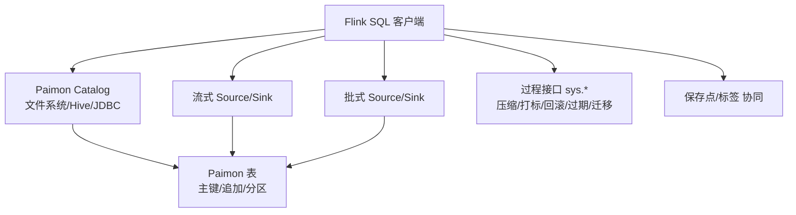
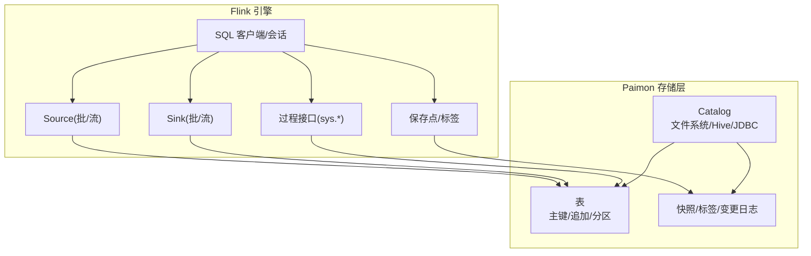
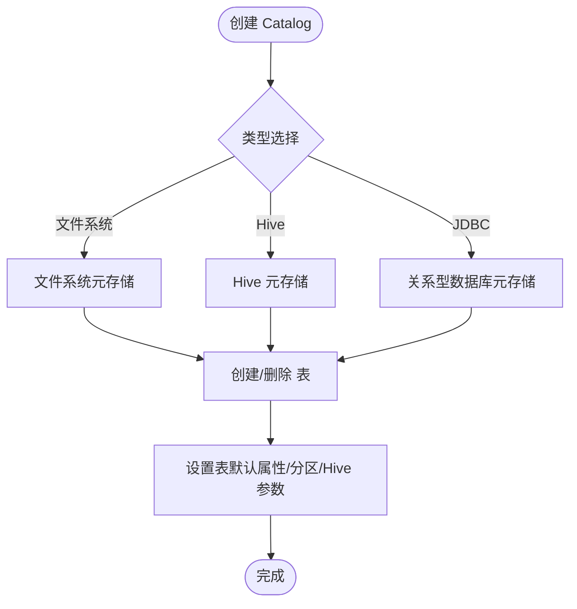
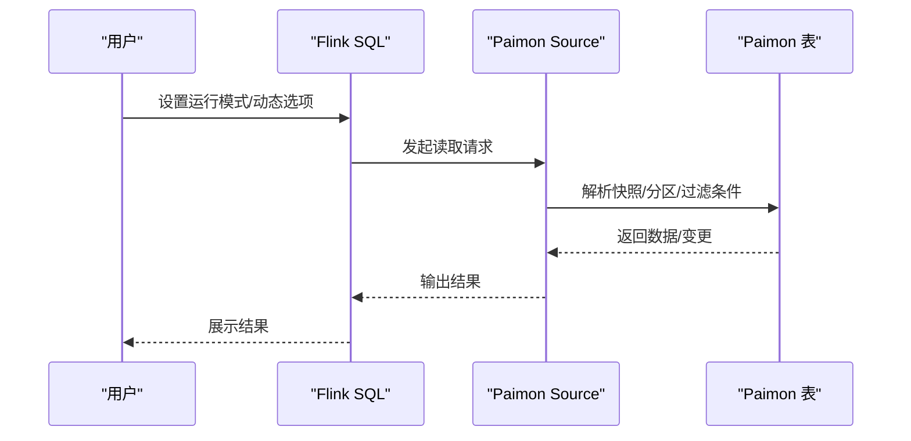
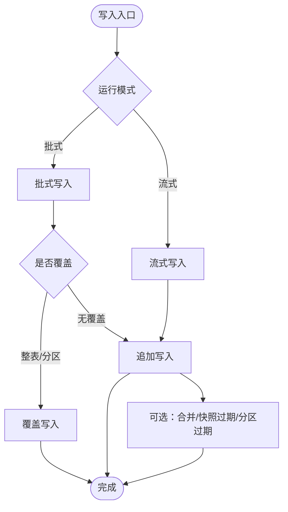
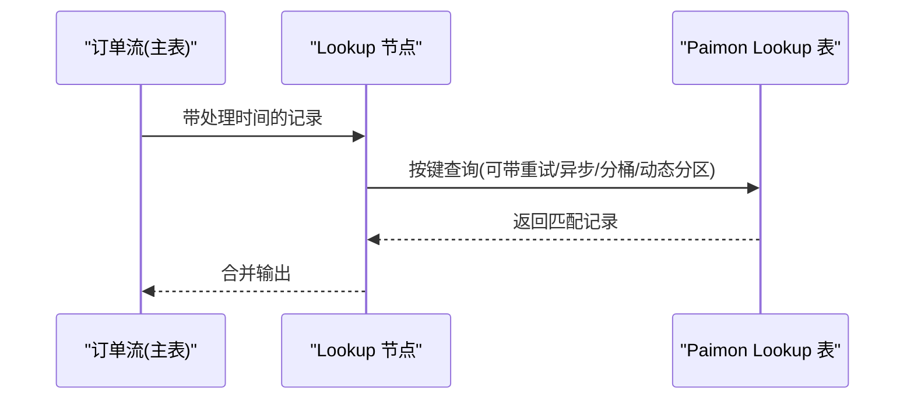
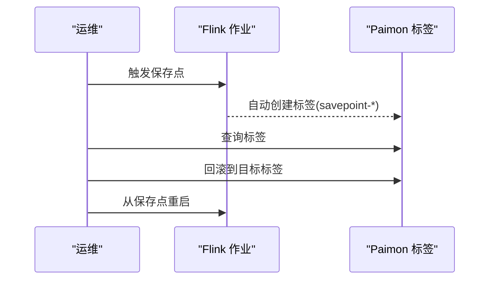
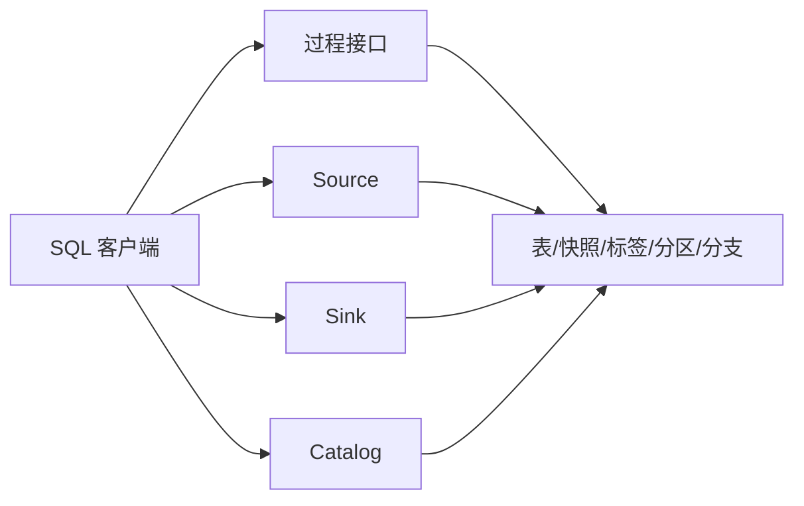

# Flink集成

<cite>
**本文引用的文件**
- [快速开始](file://docs/content/flink/quick-start.md)
- [SQL DDL](file://docs/content/flink/sql-ddl.md)
- [SQL 查询](file://docs/content/flink/sql-query.md)
- [SQL 写入](file://docs/content/flink/sql-write.md)
- [保存点](file://docs/content/flink/savepoint.md)
- [过程接口](file://docs/content/flink/procedures.md)
- [默认值](file://docs/content/flink/default-value.md)
- [Lookup 连接](file://docs/content/flink/sql-lookup.md)
- [消费者ID](file://docs/content/flink/consumer-id.md)
</cite>

## 目录
1. [简介](#简介)
2. [项目结构](#项目结构)
3. [核心组件](#核心组件)
4. [架构总览](#架构总览)
5. [详细组件分析](#详细组件分析)
6. [依赖关系分析](#依赖关系分析)
7. [性能考量](#性能考量)
8. [故障排除指南](#故障排除指南)
9. [结论](#结论)
10. [附录](#附录)

## 简介
本文件面向在 Apache Flink 中使用 Apache Paimon 的用户，系统性地梳理 Paimon 在 Flink 环境中的 SQL 支持（DDL、查询、写入）、流式读写与状态管理、CDC 集成、Catalog 使用（Paimon Catalog 与 Generic Catalog）、部署与性能优化、Flink 特定配置（如托管内存、保存点）以及常见问题排查。文档以仓库内官方文档为基础，结合图示帮助读者建立从入门到进阶的完整知识体系。

## 项目结构
围绕 Flink 集成，官方文档主要分布在以下主题页：
- 快速开始：安装、启动、Catalog 创建、表创建、写入与查询、托管内存与动态选项
- SQL DDL：Catalog 类型（文件系统、Hive、JDBC）、表创建、分区、统计模式、字段默认值
- SQL 查询：批式查询、时间旅行、增量读取、流式查询、并行度推断、查询优化
- SQL 写入：INSERT/INSERT OVERWRITE、分区覆盖、静态/动态覆盖、清空/截断、更新与删除、分区“标记完成”
- 保存点：与 Paimon 快照/标签的协同策略
- 过程接口：调用系统过程进行压缩、打标、回滚、过期、迁移等运维操作
- 默认值：列默认值定义与生效行为
- Lookup 连接：流式 Lookup Join、重试策略、异步 Lookup、动态分区、查询服务
- 消费者ID：安全消费、断点续跑、忽略进度、消费模式切换

**图表来源**
- [快速开始:130-244](file://docs/content/flink/quick-start.md#L130-L244)
- [SQL DDL:29-151](file://docs/content/flink/sql-ddl.md#L29-L151)
- [SQL 查询:27-307](file://docs/content/flink/sql-query.md#L27-L307)
- [SQL 写入:27-316](file://docs/content/flink/sql-write.md#L27-L316)
- [过程接口:27-990](file://docs/content/flink/procedures.md#L27-L990)
- [保存点:27-73](file://docs/content/flink/savepoint.md#L27-L73)

**章节来源**
- [快速开始:1-298](file://docs/content/flink/quick-start.md#L1-L298)
- [SQL DDL:1-319](file://docs/content/flink/sql-ddl.md#L1-L319)
- [SQL 查询:1-308](file://docs/content/flink/sql-query.md#L1-L308)
- [SQL 写入:1-316](file://docs/content/flink/sql-write.md#L1-L316)
- [过程接口:1-990](file://docs/content/flink/procedures.md#L1-L990)
- [保存点:1-73](file://docs/content/flink/savepoint.md#L1-L73)

## 核心组件
- Catalog 与表管理
  - 支持文件系统、Hive、JDBC 三种元存储；可设置表默认属性与 Hive 参数映射
  - 支持临时表与外部连接器配合
- 流批一体的读写
  - 批式：快照读取、时间旅行、增量读取（基于快照或水印）
  - 流式：基于快照全量+增量变更；支持“仅增量”模式与文件创建时间过滤
- 写入能力
  - INSERT/INSERT OVERWRITE（整表/分区覆盖），支持静态/动态覆盖
  - 更新与删除（批式，主键表，特定 MergeEngine）
  - 分区“标记完成”用于下游调度
- Lookup Join
  - 流式 Lookup，支持重试、异步、固定桶分片、动态分区(max_pt)、查询服务
- 过程接口
  - 压缩、数据库级压缩、打标、按时间/水印打标、删除/替换标签、过期快照/变更日志/分区、修复、重写文件索引、分支管理、清理消费者、回滚到版本、查询服务等
- 保存点与标签协同
  - 通过自动打标与标签回滚实现增量恢复

**章节来源**
- [SQL DDL:29-151](file://docs/content/flink/sql-ddl.md#L29-L151)
- [SQL 查询:27-307](file://docs/content/flink/sql-query.md#L27-L307)
- [SQL 写入:27-316](file://docs/content/flink/sql-write.md#L27-L316)
- [过程接口:27-990](file://docs/content/flink/procedures.md#L27-L990)
- [保存点:27-73](file://docs/content/flink/savepoint.md#L27-L73)

## 架构总览
下图展示了 Flink 与 Paimon 在 Catalog、Source/Sink、过程接口与保存点/标签之间的交互关系。

**图表来源**
- [快速开始:130-244](file://docs/content/flink/quick-start.md#L130-L244)
- [SQL 查询:27-307](file://docs/content/flink/sql-query.md#L27-L307)
- [SQL 写入:27-316](file://docs/content/flink/sql-write.md#L27-L316)
- [过程接口:27-990](file://docs/content/flink/procedures.md#L27-L990)
- [保存点:27-73](file://docs/content/flink/savepoint.md#L27-L73)

## 详细组件分析

### Catalog 与表管理（DDL）
- Catalog 类型
  - 文件系统：默认元存储，元数据与表文件均落盘
  - Hive：元数据落 Hive Metastore，便于与 Hive 生态互通
  - JDBC：元数据落关系型数据库（MySQL/Postgres 等），支持锁配置（MySQL/SQLite）
- 表创建
  - 支持主键表、分区表、字段默认值、统计模式（full/truncate(counts/none)）
  - 支持 CREATE TABLE AS SELECT 与 LIKE
- Hive 元数据同步
  - 可选将分区同步至 Hive；可通过表属性设置 Hive 参数映射
- 动态选项
  - 支持会话级动态表选项覆盖全局选项

**图表来源**
- [SQL DDL:29-151](file://docs/content/flink/sql-ddl.md#L29-L151)

**章节来源**
- [SQL DDL:29-151](file://docs/content/flink/sql-ddl.md#L29-L151)
- [快速开始:130-187](file://docs/content/flink/quick-start.md#L130-L187)

### SQL 查询（批/流）
- 批式查询
  - 默认读取最新快照；支持时间旅行（快照ID、时间戳、Tag、水印）
  - 增量读取：指定起止快照/时间范围；可强制扫描模式；批量中不返回 DELETE 记录
- 流式查询
  - 首次启动默认产出最新快照并持续读取增量
  - 支持仅增量模式与文件创建时间过滤
- 并行度
  - 批式：并行度与切分数相关；流式：与桶数相关但受上限限制
  - 可禁用推断或手动指定
- 查询优化
  - 推荐同时给出分区与主键过滤，利用主键排序加速点查/范围查

**图表来源**
- [SQL 查询:27-307](file://docs/content/flink/sql-query.md#L27-L307)

**章节来源**
- [SQL 查询:27-307](file://docs/content/flink/sql-query.md#L27-L307)

### SQL 写入（INSERT/覆盖/更新/删除）
- INSERT/INSERT OVERWRITE
  - 支持整表覆盖与分区覆盖；可配置静态/动态覆盖
- 清空/截断
  - 通过覆盖空集实现整表/分区清空；Flink 1.18+ 支持 TRUNCATE TABLE
- 更新与删除
  - 更新：批式，主键表，特定 MergeEngine 支持
  - 删除：批式，主键表，支持删除后记录处理策略
- 分区“标记完成”
  - 通过时间解析、间隔与空闲时长触发，生成完成信号（如 _SUCCESS 或自定义动作）

**图表来源**
- [SQL 写入:27-316](file://docs/content/flink/sql-write.md#L27-L316)

**章节来源**
- [SQL 写入:27-316](file://docs/content/flink/sql-write.md#L27-L316)

### Lookup 连接（流式 Lookup Join）
- 基本用法：主表含处理时间属性，从 Paimon 表 Lookup
- 重试策略：延迟重试（固定间隔、最大次数）
- 异步 Lookup：避免阻塞，允许无序输出
- 固定桶优化：Join 键包含桶键时，按桶分发减少本地缓存
- 动态分区(max_pt)：仅加载最新分区，定期刷新
- 查询服务：启动专用查询服务提升 Lookup 性能

**图表来源**
- [Lookup 连接:27-213](file://docs/content/flink/sql-lookup.md#L27-L213)

**章节来源**
- [Lookup 连接:27-213](file://docs/content/flink/sql-lookup.md#L27-L213)

### 过程接口（sys.*）
- 压缩与数据库级压缩：支持分区过滤、排序策略、并行度、空闲分区全量压缩
- 标签管理：创建/删除/替换标签，按时间戳/水印创建标签，触发自动创建
- 回滚：回滚到快照或标签，支持按时间戳/水印回滚
- 过期：快照/变更日志/分区过期，支持保留数量/时间窗口
- 迁移：Hive/Iceberg 表迁移到 Paimon
- 其他：修复、重写文件索引、分支管理、清理消费者、查询服务等

```mermaid
classDiagram
class SysCompact {
+compact(table, partitions, order_strategy, order_by, options, where, partition_idle_time, compact_strategy)
+compact_database(including_databases, mode, including_tables, excluding_tables, table_options, partition_idle_time, compact_strategy)
}
class SysTag {
+create_tag(table, tag, snapshot_id, time_retained)
+create_tag_from_timestamp(table, tag, timestamp, time_retained)
+create_tag_from_watermark(table, tag, watermark, time_retained)
+delete_tag(table, tag)
+replace_tag(table, tag, snapshot_id, time_retained)
+expire_tags(table, older_than)
+trigger_tag_automatic_creation(table)
}
class SysRollback {
+rollback_to(table, snapshot_id/tag)
+rollback_to_timestamp(table, timestamp)
+rollback_to_watermark(table, watermark)
}
class SysExpire {
+expire_snapshots(table, retain_max, retain_min, older_than, max_deletes, options)
+expire_changelogs(table, retain_max, retain_min, older_than, max_deletes, delete_all)
+expire_partitions(table, expiration_time, timestamp_formatter, expire_strategy, max_expires, options)
}
class SysMigrate {
+migrate_database(connector, source_database, options, parallelism)
+migrate_table(connector, source_table, options, parallelism, target_table, delete_origin)
+migrate_iceberg_table(source_table, iceberg_options, options, parallelism)
}
class SysMaintenance {
+repair(target)
+rewrite_file_index(table, partitions)
+create_branch(table, branch, tag, ignoreIfExists)
+delete_branch(table, branch)
+rename_branch(table, from_branch, to_branch)
+reset_consumer(table, consumer_id, next_snapshot_id)
+clear_consumers(table, including_consumers, excluding_consumers)
+remove_orphan_files(table, older_than, dry_run, parallelism, mode)
+remove_unexisting_files(table, dry_run, parallelism)
+remove_unexisting_manifests(table)
+purge_files(table)
+query_service(table, parallelism)
}
```

**图表来源**
- [过程接口:27-990](file://docs/content/flink/procedures.md#L27-L990)

**章节来源**
- [过程接口:27-990](file://docs/content/flink/procedures.md#L27-L990)

### 保存点与标签协同
- 冲突说明：Paimon 自有快照管理与 Flink Checkpoint 可能冲突
- 推荐方案
  - 使用 Flink 停机保存点
  - 开启“保存点自动打标签”，按标签回滚后再从保存点恢复
- 步骤
  - 启用自动打标签
  - 触发保存点
  - 查找对应标签
  - 回滚 Paimon 表到该标签
  - 从保存点重启

**图表来源**
- [保存点:27-73](file://docs/content/flink/savepoint.md#L27-L73)

**章节来源**
- [保存点:27-73](file://docs/content/flink/savepoint.md#L27-L73)

### 默认值（列默认值）
- Flink SQL 不原生支持默认值，需通过过程接口在建表后添加
- 支持简单类型与复杂类型（数组/映射/嵌套行）
- 写入时未显式提供值的列将填充默认值

**章节来源**
- [默认值:1-75](file://docs/content/flink/default-value.md#L1-L75)

### 消费者ID（安全消费与断点续跑）
- 作用
  - 防止快照被过期清理（只要存在消费者依赖）
  - 断点续跑：重启后从上次进度继续消费
- 选项
  - consumer-id：消费者标识
  - consumer.ignore-progress：仅安全消费，重启时获取新快照进度
  - consumer.mode：exactly-once/at-least-once；两种模式状态不兼容
  - consumer.expiration-time：消费者生命周期
- 操作
  - 重置/删除消费者
  - 批量清理消费者

**章节来源**
- [消费者ID:1-160](file://docs/content/flink/consumer-id.md#L1-L160)

## 依赖关系分析
- 组件耦合
  - SQL 客户端依赖 Catalog 提供表元信息；Source/Sink 依赖表结构与快照/标签
  - 过程接口对表/快照/标签/分区/分支等进行运维操作
  - 保存点与标签协同解决状态与快照的生命周期冲突
- 外部依赖
  - Hive Catalog 依赖 Hive Metastore 与 Hadoop 类路径
  - JDBC Catalog 依赖对应数据库驱动
- 潜在循环
  - 文档未见直接循环依赖；过程接口与 SQL 客户端为双向协作

**图表来源**
- [SQL 查询:27-307](file://docs/content/flink/sql-query.md#L27-L307)
- [SQL 写入:27-316](file://docs/content/flink/sql-write.md#L27-L316)
- [过程接口:27-990](file://docs/content/flink/procedures.md#L27-L990)

**章节来源**
- [SQL 查询:27-307](file://docs/content/flink/sql-query.md#L27-L307)
- [SQL 写入:27-316](file://docs/content/flink/sql-write.md#L27-L316)
- [过程接口:27-990](file://docs/content/flink/procedures.md#L27-L990)

## 性能考量
- 写入性能
  - 主键表合并与快照过期在 Sink 中执行，多作业写同一表时可参考专用合并作业
  - 追加表支持聚簇写入（批模式，桶=-1），可按列聚簇提升下游读取效率
- 读取性能
  - 批式：启用并行度推断与最大并发限制；必要时禁用推断并手动指定
  - 流式：使用“仅增量”模式与文件创建时间过滤减少初始扫描
  - 查询优化：尽量使用分区与主键前缀过滤
- Lookup 性能
  - 固定桶分片、异步 Lookup、动态分区(max_pt)、查询服务
- 内存管理
  - Flink 托管内存：启用托管内存分配器与写缓冲权重，提升稳定性与吞吐
- 并发与资源
  - 合理设置任务槽与并行度；避免过多任务导致 Executor 内存压力

**章节来源**
- [SQL 写入:52-82](file://docs/content/flink/sql-write.md#L52-L82)
- [SQL 查询:198-307](file://docs/content/flink/sql-query.md#L198-L307)
- [Lookup 连接:123-213](file://docs/content/flink/sql-lookup.md#L123-L213)
- [快速开始:252-270](file://docs/content/flink/quick-start.md#L252-L270)

## 故障排除指南
- 保存点/快照冲突
  - 使用“停止即保存点”或“保存点自动打标签 + 标签回滚”的组合策略
- Lookup 缺失
  - 使用延迟重试策略；异步 + allow_unordered 避免阻塞；对 CDC 流可用审计日志转为追加流
- 过多快照/分区导致空间压力
  - 使用过程接口过期快照/变更日志/分区；或开启自动打标后按标签回滚
- 消费停滞
  - 检查消费者ID与过期时间；必要时重置/删除消费者并清理
- Hive 元存储问题
  - 确认 Hive 元存储 URI/认证/监听器配置；禁用 Hive ACID（针对 Hive3）

**章节来源**
- [保存点:27-73](file://docs/content/flink/savepoint.md#L27-L73)
- [Lookup 连接:85-122](file://docs/content/flink/sql-lookup.md#L85-L122)
- [过程接口:624-720](file://docs/content/flink/procedures.md#L624-L720)
- [消费者ID:81-160](file://docs/content/flink/consumer-id.md#L81-L160)

## 结论
Paimon 在 Flink 中提供了统一的 Catalog、批流一体的读写、完善的运维过程接口与灵活的保存点/标签协同机制。通过合理配置 Catalog、启用托管内存、优化查询与写入策略、善用 Lookup 与过程接口，可在生产环境中获得稳定且高性能的数据湖/数据仓库体验。

## 附录
- 快速开始步骤要点
  - 下载对应版本的 Paimon Flink Jar 与 Hadoop 预打包 Jar
  - 启动本地集群，复制 Jar 至 Flink lib
  - 使用 SQL 客户端创建 Catalog 与表，设置检查点间隔，执行写入与查询
- 常用动态选项
  - 批式时间旅行、增量读取、流式启动模式、并行度推断与上限、扫描分区等
- 建议实践
  - 流式写入务必开启检查点
  - 主键表优先考虑 MergeEngine 为去重或部分更新
  - 对大 Lookup 表启用固定桶分片与查询服务
  - 定期过期快照/分区，保持存储健康

**章节来源**
- [快速开始:77-298](file://docs/content/flink/quick-start.md#L77-L298)
- [SQL 查询:198-307](file://docs/content/flink/sql-query.md#L198-L307)
- [SQL 写入:27-316](file://docs/content/flink/sql-write.md#L27-L316)
- [过程接口:624-720](file://docs/content/flink/procedures.md#L624-L720)