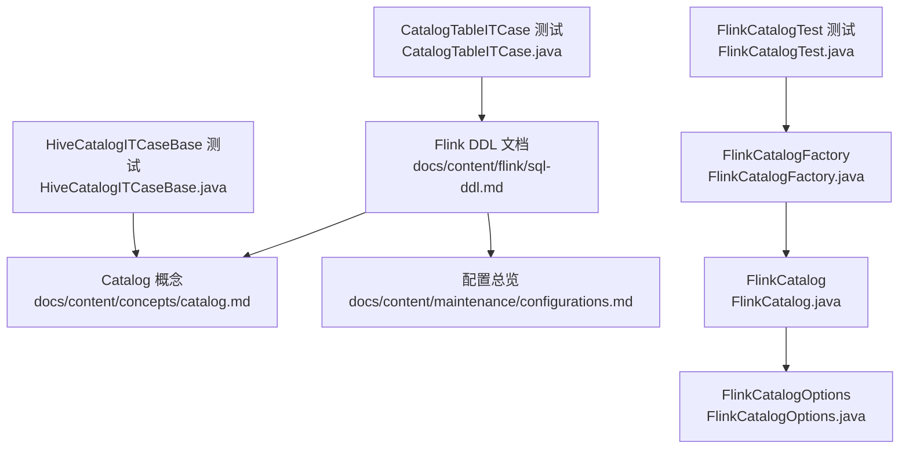
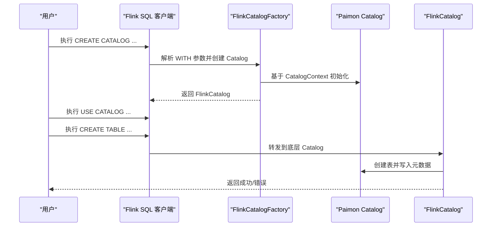
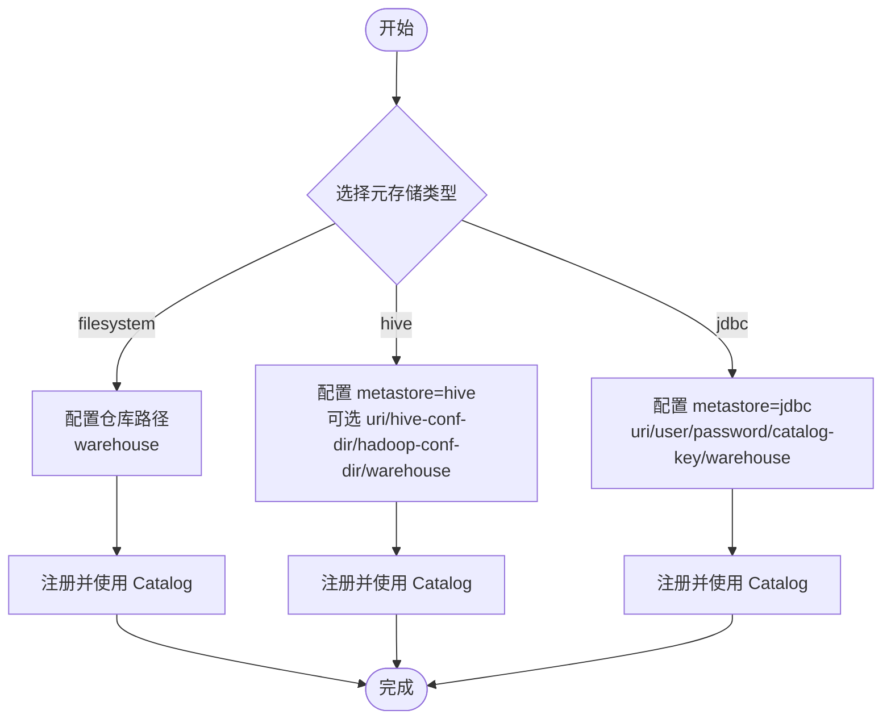
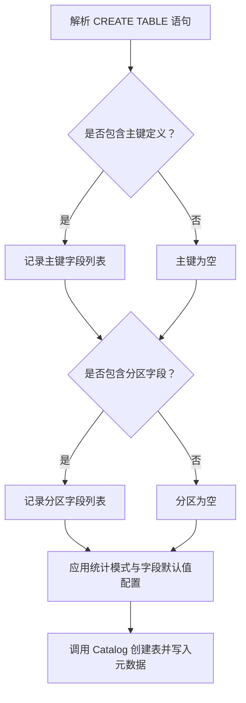
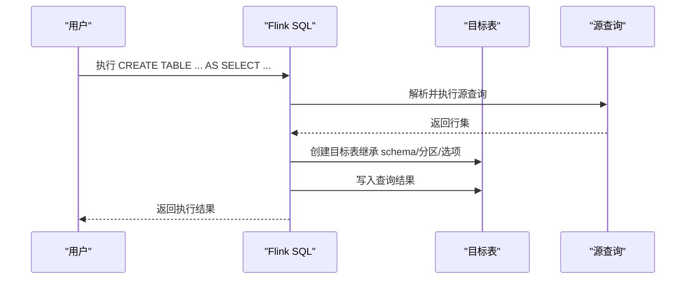
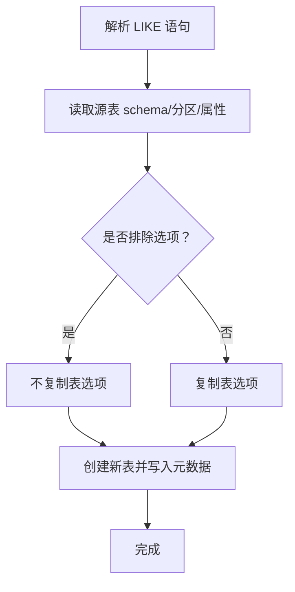
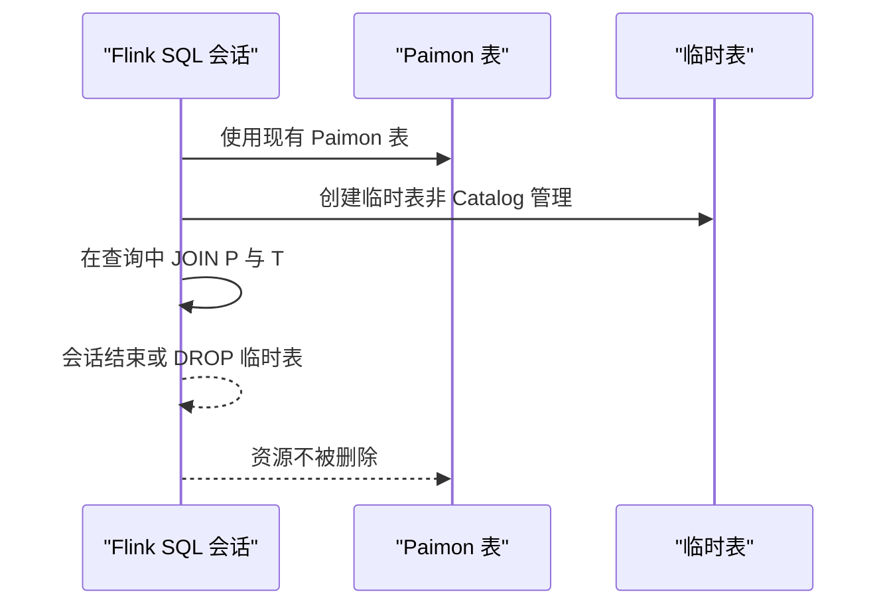
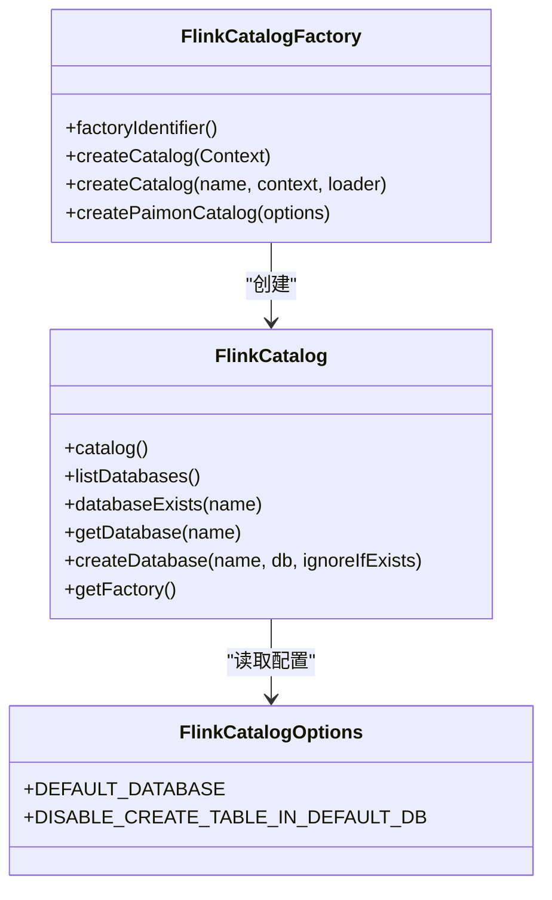

# DDL操作

<cite>
**本文引用的文件**
- [docs/content/flink/sql-ddl.md](file://docs/content/flink/sql-ddl.md)
- [docs/content/concepts/catalog.md](file://docs/content/concepts/catalog.md)
- [docs/content/maintenance/configurations.md](file://docs/content/maintenance/configurations.md)
- [paimon-flink/paimon-flink-common/src/main/java/org/apache/paimon/flink/FlinkCatalogFactory.java](file://paimon-flink/paimon-flink-common/src/main/java/org/apache/paimon/flink/FlinkCatalogFactory.java)
- [paimon-flink/paimon-flink-common/src/main/java/org/apache/paimon/flink/FlinkCatalogOptions.java](file://paimon-flink/paimon-flink-common/src/main/java/org/apache/paimon/flink/FlinkCatalogOptions.java)
- [paimon-flink/paimon-flink-common/src/main/java/org/apache/paimon/flink/FlinkCatalog.java](file://paimon-flink/paimon-flink-common/src/main/java/org/apache/paimon/flink/FlinkCatalog.java)
- [paimon-flink/paimon-flink-common/src/test/java/org/apache/paimon/flink/CatalogTableITCase.java](file://paimon-flink/paimon-flink-common/src/test/java/org/apache/paimon/flink/CatalogTableITCase.java)
- [paimon-flink/paimon-flink-common/src/test/java/org/apache/paimon/flink/FlinkCatalogTest.java](file://paimon-flink/paimon-flink-common/src/test/java/org/apache/paimon/flink/FlinkCatalogTest.java)
- [paimon-hive/paimon-hive-connector-common/src/test/java/org/apache/paimon/hive/HiveCatalogITCaseBase.java](file://paimon-hive/paimon-hive-connector-common/src/test/java/org/apache/paimon/hive/HiveCatalogITCaseBase.java)
</cite>

## 目录
1. [简介](#简介)
2. [项目结构](#项目结构)
3. [核心组件](#核心组件)
4. [架构总览](#架构总览)
5. [详细组件分析](#详细组件分析)
6. [依赖关系分析](#依赖关系分析)
7. [性能考虑](#性能考虑)
8. [故障排查指南](#故障排查指南)
9. [结论](#结论)
10. [附录](#附录)

## 简介
本章节聚焦于 Apache Paimon 在 Flink 中的 DDL 操作，系统性讲解以下主题：
- CREATE CATALOG 的三类元存储：filesystem（默认）、hive、jdbc 的配置与使用要点
- CREATE TABLE 的语法要点：表结构定义、主键声明、分区字段设置、统计模式与字段默认值
- 高级建表：CREATE TABLE AS SELECT、CREATE TABLE LIKE
- 临时表：在会话中创建临时表并与其他表联用
- 性能优化与最佳实践

## 项目结构
围绕 DDL 的文档与实现主要分布在如下位置：
- 文档层：Flink DDL 文档、概念与配置文档
- 实现层：Flink Catalog 工厂与选项、FlinkCatalog 包装器、测试用例覆盖了 DDL 行为

**图示来源**
- [docs/content/flink/sql-ddl.md:29-319](file://docs/content/flink/sql-ddl.md#L29-L319)
- [docs/content/concepts/catalog.md:33-97](file://docs/content/concepts/catalog.md#L33-L97)
- [docs/content/maintenance/configurations.md:35-63](file://docs/content/maintenance/configurations.md#L35-L63)
- [paimon-flink/paimon-flink-common/src/main/java/org/apache/paimon/flink/FlinkCatalogFactory.java:32-78](file://paimon-flink/paimon-flink-common/src/main/java/org/apache/paimon/flink/FlinkCatalogFactory.java#L32-L78)
- [paimon-flink/paimon-flink-common/src/main/java/org/apache/paimon/flink/FlinkCatalogOptions.java:26-40](file://paimon-flink/paimon-flink-common/src/main/java/org/apache/paimon/flink/FlinkCatalogOptions.java#L26-L40)
- [paimon-flink/paimon-flink-common/src/main/java/org/apache/paimon/flink/FlinkCatalog.java:177-253](file://paimon-flink/paimon-flink-common/src/main/java/org/apache/paimon/flink/FlinkCatalog.java#L177-L253)
- [paimon-flink/paimon-flink-common/src/test/java/org/apache/paimon/flink/CatalogTableITCase.java:414-423](file://paimon-flink/paimon-flink-common/src/test/java/org/apache/paimon/flink/CatalogTableITCase.java#L414-L423)
- [paimon-flink/paimon-flink-common/src/test/java/org/apache/paimon/flink/FlinkCatalogTest.java:99-126](file://paimon-flink/paimon-flink-common/src/test/java/org/apache/paimon/flink/FlinkCatalogTest.java#L99-L126)
- [paimon-hive/paimon-hive-connector-common/src/test/java/org/apache/paimon/hive/HiveCatalogITCaseBase.java:718-740](file://paimon-hive/paimon-hive-connector-common/src/test/java/org/apache/paimon/hive/HiveCatalogITCaseBase.java#L718-L740)

**章节来源**
- [docs/content/flink/sql-ddl.md:29-319](file://docs/content/flink/sql-ddl.md#L29-L319)
- [docs/content/concepts/catalog.md:33-97](file://docs/content/concepts/catalog.md#L33-L97)
- [docs/content/maintenance/configurations.md:35-63](file://docs/content/maintenance/configurations.md#L35-L63)

## 核心组件
- FlinkCatalogFactory：负责根据上下文创建 Paimon Catalog，并注入 Flink 环境
- FlinkCatalogOptions：定义 Flink 侧 Catalog 的可选参数（如默认数据库、是否允许在默认库建表）
- FlinkCatalog：对底层 Catalog 的封装，暴露 Flink Catalog 接口能力
- 测试用例：验证 CREATE TABLE AS SELECT、CREATE TABLE LIKE、临时表等行为

**章节来源**
- [paimon-flink/paimon-flink-common/src/main/java/org/apache/paimon/flink/FlinkCatalogFactory.java:32-78](file://paimon-flink/paimon-flink-common/src/main/java/org/apache/paimon/flink/FlinkCatalogFactory.java#L32-L78)
- [paimon-flink/paimon-flink-common/src/main/java/org/apache/paimon/flink/FlinkCatalogOptions.java:26-40](file://paimon-flink/paimon-flink-common/src/main/java/org/apache/paimon/flink/FlinkCatalogOptions.java#L26-L40)
- [paimon-flink/paimon-flink-common/src/main/java/org/apache/paimon/flink/FlinkCatalog.java:177-253](file://paimon-flink/paimon-flink-common/src/main/java/org/apache/paimon/flink/FlinkCatalog.java#L177-L253)
- [paimon-flink/paimon-flink-common/src/test/java/org/apache/paimon/flink/CatalogTableITCase.java:414-423](file://paimon-flink/paimon-flink-common/src/test/java/org/apache/paimon/flink/CatalogTableITCase.java#L414-L423)
- [paimon-flink/paimon-flink-common/src/test/java/org/apache/paimon/flink/FlinkCatalogTest.java:99-126](file://paimon-flink/paimon-flink-common/src/test/java/org/apache/paimon/flink/FlinkCatalogTest.java#L99-L126)

## 架构总览
下图展示了 Flink DDL 创建 Catalog 与表的高层流程。

**图示来源**
- [docs/content/flink/sql-ddl.md:29-152](file://docs/content/flink/sql-ddl.md#L29-L152)
- [paimon-flink/paimon-flink-common/src/main/java/org/apache/paimon/flink/FlinkCatalogFactory.java:52-76](file://paimon-flink/paimon-flink-common/src/main/java/org/apache/paimon/flink/FlinkCatalogFactory.java#L52-L76)
- [paimon-flink/paimon-flink-common/src/main/java/org/apache/paimon/flink/FlinkCatalog.java:177-253](file://paimon-flink/paimon-flink-common/src/main/java/org/apache/paimon/flink/FlinkCatalog.java#L177-L253)

## 详细组件分析

### CREATE CATALOG：filesystem、hive、jdbc
- filesystem 元存储（默认）：元数据与表文件均存储在文件系统中，通过仓库路径进行定位
- hive 元存储：元数据同时存储在 Hive Metastore；支持 Kerberos 等安全环境下的配置项；可选择将分区同步至 Hive
- jdbc 元存储：元数据存储在关系型数据库（如 MySQL、Postgres），支持锁配置（仅部分数据库）

**图示来源**
- [docs/content/flink/sql-ddl.md:39-152](file://docs/content/flink/sql-ddl.md#L39-L152)
- [docs/content/concepts/catalog.md:42-97](file://docs/content/concepts/catalog.md#L42-L97)

**章节来源**
- [docs/content/flink/sql-ddl.md:39-152](file://docs/content/flink/sql-ddl.md#L39-L152)
- [docs/content/concepts/catalog.md:33-97](file://docs/content/concepts/catalog.md#L33-L97)

### CREATE TABLE：语法要点与示例
- 表结构定义：列名、类型、注释等
- 主键声明：NOT ENFORCED 表示不强制约束
- 分区字段：PARTITIONED BY
- 统计模式：metadata.stats-mode 支持 full/truncate(length)/counts/none
- 字段默认值：fields.{field_name}.default-value（分区字段与主键字段不可指定）

**图示来源**
- [docs/content/flink/sql-ddl.md:153-213](file://docs/content/flink/sql-ddl.md#L153-L213)

**章节来源**
- [docs/content/flink/sql-ddl.md:153-213](file://docs/content/flink/sql-ddl.md#L153-L213)

### CREATE TABLE AS SELECT：高级建表方式
- 可直接基于查询结果创建并填充表
- 支持在建表时指定主键、分区、文件格式等选项
- 测试用例验证了 schema、分区、选项与数据一致性

**图示来源**
- [docs/content/flink/sql-ddl.md:214-270](file://docs/content/flink/sql-ddl.md#L214-L270)
- [paimon-flink/paimon-flink-common/src/test/java/org/apache/paimon/flink/CatalogTableITCase.java:425-437](file://paimon-flink/paimon-flink-common/src/test/java/org/apache/paimon/flink/CatalogTableITCase.java#L425-L437)
- [paimon-hive/paimon-hive-connector-common/src/test/java/org/apache/paimon/hive/HiveCatalogITCaseBase.java:718-740](file://paimon-hive/paimon-hive-connector-common/src/test/java/org/apache/paimon/hive/HiveCatalogITCaseBase.java#L718-L740)

**章节来源**
- [docs/content/flink/sql-ddl.md:214-270](file://docs/content/flink/sql-ddl.md#L214-L270)
- [paimon-flink/paimon-flink-common/src/test/java/org/apache/paimon/flink/CatalogTableITCase.java:425-437](file://paimon-flink/paimon-flink-common/src/test/java/org/apache/paimon/flink/CatalogTableITCase.java#L425-L437)
- [paimon-hive/paimon-hive-connector-common/src/test/java/org/apache/paimon/hive/HiveCatalogITCaseBase.java:718-740](file://paimon-hive/paimon-hive-connector-common/src/test/java/org/apache/paimon/hive/HiveCatalogITCaseBase.java#L718-L740)

### CREATE TABLE LIKE：复制结构与属性
- 复制源表的 schema、分区与表属性
- 支持 EXCLUDING OPTIONS 排除选项

**图示来源**
- [docs/content/flink/sql-ddl.md:272-287](file://docs/content/flink/sql-ddl.md#L272-L287)
- [paimon-flink/paimon-flink-common/src/test/java/org/apache/paimon/flink/CatalogTableITCase.java:414-423](file://paimon-flink/paimon-flink-common/src/test/java/org/apache/paimon/flink/CatalogTableITCase.java#L414-L423)

**章节来源**
- [docs/content/flink/sql-ddl.md:272-287](file://docs/content/flink/sql-ddl.md#L272-L287)
- [paimon-flink/paimon-flink-common/src/test/java/org/apache/paimon/flink/CatalogTableITCase.java:414-423](file://paimon-flink/paimon-flink-common/src/test/java/org/apache/paimon/flink/CatalogTableITCase.java#L414-L423)

### 临时表：会话内使用
- 临时表由会话记录但不由 Catalog 管理
- 会话关闭或显式 DROP 后资源不会被删除
- 可与 Paimon 表联用，便于中间态数据处理

**图示来源**
- [docs/content/flink/sql-ddl.md:289-319](file://docs/content/flink/sql-ddl.md#L289-L319)

**章节来源**
- [docs/content/flink/sql-ddl.md:289-319](file://docs/content/flink/sql-ddl.md#L289-L319)

## 依赖关系分析
- FlinkCatalogFactory 依赖 CatalogFactory 与 CatalogContext，负责创建底层 Catalog 并包装为 FlinkCatalog
- FlinkCatalogOptions 提供 Flink 侧 Catalog 的可配置项
- FlinkCatalog 对外暴露数据库/表管理接口，内部委托底层 Catalog

**图示来源**
- [paimon-flink/paimon-flink-common/src/main/java/org/apache/paimon/flink/FlinkCatalogFactory.java:32-78](file://paimon-flink/paimon-flink-common/src/main/java/org/apache/paimon/flink/FlinkCatalogFactory.java#L32-L78)
- [paimon-flink/paimon-flink-common/src/main/java/org/apache/paimon/flink/FlinkCatalogOptions.java:26-40](file://paimon-flink/paimon-flink-common/src/main/java/org/apache/paimon/flink/FlinkCatalogOptions.java#L26-L40)
- [paimon-flink/paimon-flink-common/src/main/java/org/apache/paimon/flink/FlinkCatalog.java:177-253](file://paimon-flink/paimon-flink-common/src/main/java/org/apache/paimon/flink/FlinkCatalog.java#L177-L253)

**章节来源**
- [paimon-flink/paimon-flink-common/src/main/java/org/apache/paimon/flink/FlinkCatalogFactory.java:32-78](file://paimon-flink/paimon-flink-common/src/main/java/org/apache/paimon/flink/FlinkCatalogFactory.java#L32-L78)
- [paimon-flink/paimon-flink-common/src/main/java/org/apache/paimon/flink/FlinkCatalogOptions.java:26-40](file://paimon-flink/paimon-flink-common/src/main/java/org/apache/paimon/flink/FlinkCatalogOptions.java#L26-L40)
- [paimon-flink/paimon-flink-common/src/main/java/org/apache/paimon/flink/FlinkCatalog.java:177-253](file://paimon-flink/paimon-flink-common/src/main/java/org/apache/paimon/flink/FlinkCatalog.java#L177-L253)

## 性能考虑
- 统计模式选择
  - metadata.stats-mode 支持 full、truncate(length)、counts、none
  - truncate(16) 为默认模式，兼顾大小与性能
  - stats-mode=none 时可显著降低清单文件体积，但需注意读取引擎版本要求
- 字段级统计
  - 可按字段设置 fields.{field_name}.stats-mode
- 文件格式与压缩
  - 通过 WITH 选项设置文件格式（如 orc、parquet），影响写入与查询性能
- 分区策略
  - 合理设置分区字段，避免过多小分区导致元数据膨胀
  - 可配置分区过期时间自动清理历史分区

**章节来源**
- [docs/content/flink/sql-ddl.md:193-213](file://docs/content/flink/sql-ddl.md#L193-L213)
- [docs/content/maintenance/configurations.md:35-63](file://docs/content/maintenance/configurations.md#L35-L63)

## 故障排查指南
- 默认数据库限制
  - 若禁用在默认数据库建表，需显式指定数据库名
  - 参考测试用例对默认数据库行为的断言
- Hive 兼容性
  - 修改不兼容列类型时需调整 Hive 配置
  - Hive3 场景需关闭 ACID
- JDBC 锁配置
  - 仅部分数据库支持锁配置，其他数据库请勿配置 lock.enabled
- 临时表生命周期
  - 临时表随会话结束而释放，避免误删生产数据

**章节来源**
- [docs/content/flink/sql-ddl.md:90-99](file://docs/content/flink/sql-ddl.md#L90-L99)
- [docs/content/flink/sql-ddl.md:123-124](file://docs/content/flink/sql-ddl.md#L123-L124)
- [paimon-flink/paimon-flink-common/src/test/java/org/apache/paimon/flink/FlinkCatalogTest.java:712-728](file://paimon-flink/paimon-flink-common/src/test/java/org/apache/paimon/flink/FlinkCatalogTest.java#L712-L728)

## 结论
- Paimon 在 Flink 中通过 Catalog 抽象统一管理元数据与表文件，支持多种元存储后端
- DDL 操作覆盖了从 Catalog 注册、表结构定义、分区与主键声明，到高级建表与临时表使用的完整链路
- 通过合理的统计模式、文件格式与分区策略，可在保证查询性能的同时控制存储成本

## 附录
- 示例参考路径
  - filesystem Catalog 示例：[docs/content/flink/sql-ddl.md:43-50](file://docs/content/flink/sql-ddl.md#L43-L50)
  - hive Catalog 示例：[docs/content/flink/sql-ddl.md:73-84](file://docs/content/flink/sql-ddl.md#L73-L84)
  - jdbc Catalog 示例：[docs/content/flink/sql-ddl.md:132-144](file://docs/content/flink/sql-ddl.md#L132-L144)
  - 主键与分区示例：[docs/content/flink/sql-ddl.md:161-183](file://docs/content/flink/sql-ddl.md#L161-L183)
  - CREATE TABLE AS SELECT 示例：[docs/content/flink/sql-ddl.md:222-270](file://docs/content/flink/sql-ddl.md#L222-L270)
  - CREATE TABLE LIKE 示例：[docs/content/flink/sql-ddl.md:276-287](file://docs/content/flink/sql-ddl.md#L276-L287)
  - 临时表示例：[docs/content/flink/sql-ddl.md:298-318](file://docs/content/flink/sql-ddl.md#L298-L318)