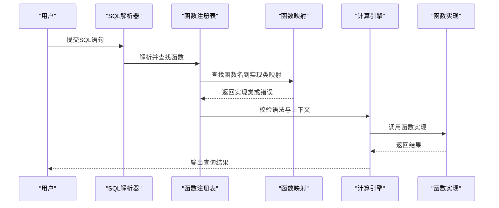
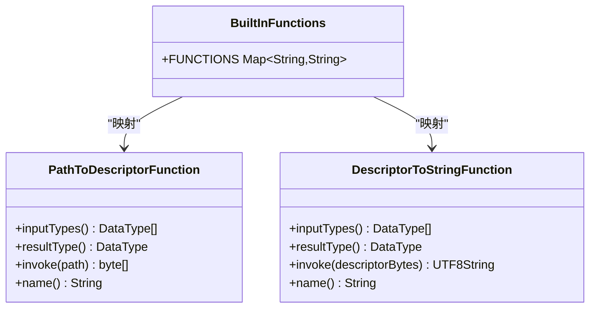
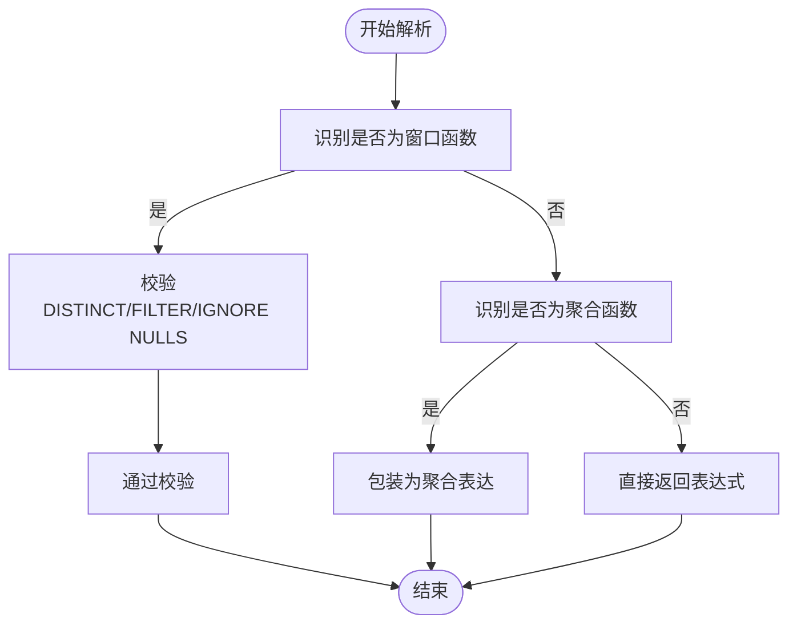
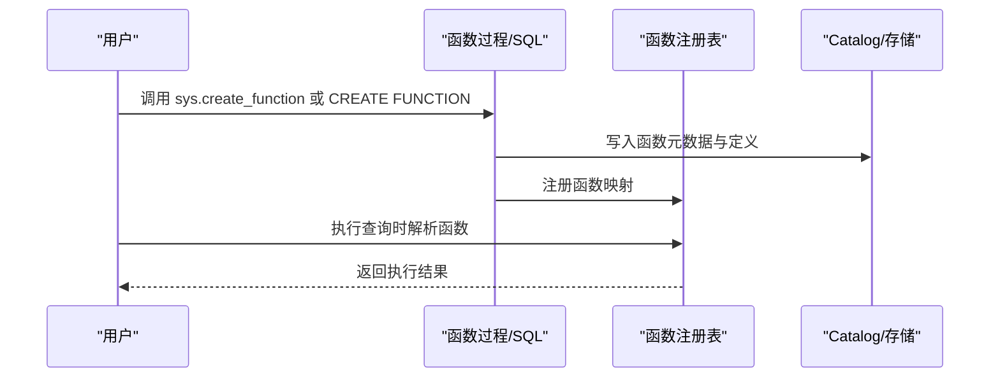
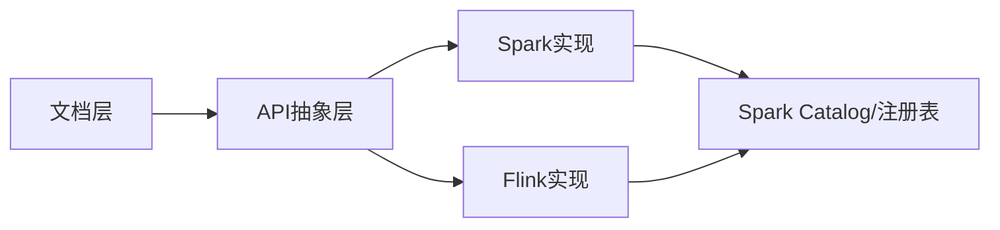

# SQL函数

<cite>
**本文引用的文件**
- [functions.md](file://docs/content/concepts/functions.md)
- [sql-functions.md](file://docs/content/spark/sql-functions.md)
- [BuiltInFunctions.java](file://paimon-flink/paimon-flink-common/src/main/java/org/apache/paimon/flink/function/BuiltInFunctions.java)
- [PathToDescriptorFunction.java](file://paimon-spark/paimon-spark-common/src/main/java/org/apache/paimon/spark/function/PathToDescriptorFunction.java)
- [DescriptorToStringFunction.java](file://paimon-spark/paimon-spark-common/src/main/java/org/apache/paimon/spark/function/DescriptorToStringFunction.java)
- [PaimonV1FunctionRegistry.scala](file://paimon-spark/paimon-spark-common/src/main/scala/org/apache/spark/sql/catalyst/catalog/PaimonV1FunctionRegistry.scala)
- [SparkZOrderUDF.java](file://paimon-spark/paimon-spark-common/src/main/java/org/apache/paimon/spark/sort/SparkZOrderUDF.java)
- [SparkHilbertUDF.java](file://paimon-spark/paimon-spark-common/src/main/java/org/apache/paimon/spark/sort/SparkHilbertUDF.java)
- [Function.java](file://paimon-api/src/main/java/org/apache/paimon/function/Function.java)
- [FunctionDefinition.java](file://paimon-api/src/main/java/org/apache/paimon/function/FunctionDefinition.java)
- [FunctionImpl.java](file://paimon-api/src/main/java/org/apache/paimon/function/FunctionImpl.java)
- [AlterFunctionProcedure.java](file://paimon-flink/paimon-flink-common/src/main/java/org/apache/paimon/flink/procedure/AlterFunctionProcedure.java)
- [CreateFunctionProcedure.java](file://paimon-spark/paimon-spark-common/src/main/java/org/apache/paimon/spark/procedure/CreateFunctionProcedure.java)
- [DropFunctionProcedure.java](file://paimon-spark/paimon-spark-common/src/main/java/org/apache/paimon/spark/procedure/DropFunctionProcedure.java)
</cite>

## 目录
1. [简介](#简介)
2. [项目结构](#项目结构)
3. [核心组件](#核心组件)
4. [架构总览](#架构总览)
5. [详细组件分析](#详细组件分析)
6. [依赖分析](#依赖分析)
7. [性能考虑](#性能考虑)
8. [故障排查指南](#故障排查指南)
9. [结论](#结论)
10. [附录](#附录)

## 简介
本章节系统梳理 Apache Paimon 在不同计算引擎（Flink、Spark）中的 SQL 函数能力，覆盖内置函数、条件与聚合函数的使用方式、窗口函数的实现与限制、以及用户自定义函数（UDF/UDAF）的开发与注册流程。文档同时给出最佳实践、性能优化建议与常见组合用法的注意事项，帮助读者在生产环境中高效、安全地使用 Paimon 的函数体系。

## 项目结构
围绕 SQL 函数的相关实现分布在以下模块与目录：
- 文档层：docs/content 下的 functions 与 spark/sql-functions，用于说明函数类型、语法与示例。
- Flink 层：paimon-flink-common 中的内置函数映射与 Flink 端函数过程（Procedure）。
- Spark 层：paimon-spark-common 中的内置标量函数实现与函数注册校验逻辑；Spark UDF 示例位于 sort 包。
- API 抽象层：paimon-api 中的 Function 接口、FunctionDefinition 定义与 FunctionImpl 实现，统一函数抽象与跨引擎支持。

```mermaid
graph TB
subgraph "文档"
D1["docs/content/concepts/functions.md"]
D2["docs/content/spark/sql-functions.md"]
end
subgraph "Flink"
F1["paimon-flink-common/BuiltInFunctions.java"]
F2["paimon-flink-common/.../procedure/AlterFunctionProcedure.java"]
end
subgraph "Spark"
S1["paimon-spark-common/.../function/PathToDescriptorFunction.java"]
S2["paimon-spark-common/.../function/DescriptorToStringFunction.java"]
S3["paimon-spark-common/.../catalog/PaimonV1FunctionRegistry.scala"]
S4["paimon-spark-common/.../sort/SparkZOrderUDF.java"]
S5["paimon-spark-common/.../sort/SparkHilbertUDF.java"]
S6["paimon-spark-common/.../procedure/CreateFunctionProcedure.java"]
S7["paimon-spark-common/.../procedure/DropFunctionProcedure.java"]
end
subgraph "API抽象"
A1["paimon-api/.../Function.java"]
A2["paimon-api/.../FunctionDefinition.java"]
A3["paimon-api/.../FunctionImpl.java"]
end
D1 --> F1
D1 --> F2
D2 --> S1
D2 --> S2
D2 --> S3
D2 --> S6
D2 --> S7
S4 --> S3
S5 --> S3
A1 --> A2
A2 --> A3
```

图表来源
- [functions.md:1-90](file://docs/content/concepts/functions.md#L1-L90)
- [sql-functions.md:1-157](file://docs/content/spark/sql-functions.md#L1-L157)
- [BuiltInFunctions.java:1-35](file://paimon-flink/paimon-flink-common/src/main/java/org/apache/paimon/flink/function/BuiltInFunctions.java#L1-L35)
- [PathToDescriptorFunction.java:1-57](file://paimon-spark/paimon-spark-common/src/main/java/org/apache/paimon/spark/function/PathToDescriptorFunction.java#L1-L57)
- [DescriptorToStringFunction.java:1-57](file://paimon-spark/paimon-spark-common/src/main/java/org/apache/paimon/spark/function/DescriptorToStringFunction.java#L1-L57)
- [PaimonV1FunctionRegistry.scala:180-267](file://paimon-spark/paimon-spark-common/src/main/scala/org/apache/spark/sql/catalyst/catalog/PaimonV1FunctionRegistry.scala#L180-L267)
- [SparkZOrderUDF.java:263-325](file://paimon-spark/paimon-spark-common/src/main/java/org/apache/paimon/spark/sort/SparkZOrderUDF.java#L263-L325)
- [SparkHilbertUDF.java:169-199](file://paimon-spark/paimon-spark-common/src/main/java/org/apache/paimon/spark/sort/SparkHilbertUDF.java#L169-L199)
- [Function.java:28-35](file://paimon-api/src/main/java/org/apache/paimon/function/Function.java#L28-L35)
- [FunctionDefinition.java:45-231](file://paimon-api/src/main/java/org/apache/paimon/function/FunctionDefinition.java#L45-L231)
- [FunctionImpl.java:32-32](file://paimon-api/src/main/java/org/apache/paimon/function/FunctionImpl.java#L32-L32)

章节来源
- [functions.md:1-90](file://docs/content/concepts/functions.md#L1-L90)
- [sql-functions.md:1-157](file://docs/content/spark/sql-functions.md#L1-L157)

## 核心组件
- 函数抽象与定义
  - Function 接口：统一函数能力边界。
  - FunctionDefinition：支持 File/SQL/Lambda 三种定义方式，便于跨引擎复用。
  - FunctionImpl：具体函数实现，封装输入输出参数、注释、选项与多引擎定义。
- 内置函数
  - Flink：通过 BuiltInFunctions 映射内置函数名到实现类。
  - Spark：提供路径与描述符转换的标量函数实现。
- 用户自定义函数
  - Spark 支持 Lambda 与 File（JAR）两类定义；Flink 支持通过 Procedure 创建/修改/删除函数。
- 查询编译与校验
  - Spark 注册表对窗口与聚合函数的语法进行严格校验，确保 DISTINCT/FILTER/IGNORE NULLS 等特性按规范使用。

章节来源
- [Function.java:28-35](file://paimon-api/src/main/java/org/apache/paimon/function/Function.java#L28-L35)
- [FunctionDefinition.java:45-231](file://paimon-api/src/main/java/org/apache/paimon/function/FunctionDefinition.java#L45-L231)
- [FunctionImpl.java:32-32](file://paimon-api/src/main/java/org/apache/paimon/function/FunctionImpl.java#L32-L32)
- [BuiltInFunctions.java:25-35](file://paimon-flink/paimon-flink-common/src/main/java/org/apache/paimon/flink/function/BuiltInFunctions.java#L25-L35)
- [PathToDescriptorFunction.java:30-57](file://paimon-spark/paimon-spark-common/src/main/java/org/apache/paimon/spark/function/PathToDescriptorFunction.java#L30-L57)
- [DescriptorToStringFunction.java:30-57](file://paimon-spark/paimon-spark-common/src/main/java/org/apache/paimon/spark/function/DescriptorToStringFunction.java#L30-L57)
- [PaimonV1FunctionRegistry.scala:180-267](file://paimon-spark/paimon-spark-common/src/main/scala/org/apache/spark/sql/catalyst/catalog/PaimonV1FunctionRegistry.scala#L180-L267)

## 架构总览
下图展示从 SQL 到函数执行的关键路径：解析与校验、函数注册与映射、引擎侧实现与调用。

图表来源
- [BuiltInFunctions.java:25-35](file://paimon-flink/paimon-flink-common/src/main/java/org/apache/paimon/flink/function/BuiltInFunctions.java#L25-L35)
- [PaimonV1FunctionRegistry.scala:180-267](file://paimon-spark/paimon-spark-common/src/main/scala/org/apache/spark/sql/catalyst/catalog/PaimonV1FunctionRegistry.scala#L180-L267)

## 详细组件分析

### 内置函数：路径与描述符转换（Spark）
- 功能概述
  - path_to_descriptor：将外部文件路径转换为二进制描述符，便于写入含 Blob 的表。
  - descriptor_to_string：将二进制描述符反序列化为可读字符串，便于调试与验证。
- 数据类型与行为
  - 输入/输出类型由实现类声明，确保与 SQL 类型系统一致。
  - 对空值进行显式处理，避免空指针异常。
- 使用场景
  - 大对象（Blob）数据导入时，先生成描述符再写入目标表。
  - 调试阶段查看描述符内容，确认文件路径与偏移量正确。

图表来源
- [PathToDescriptorFunction.java:30-57](file://paimon-spark/paimon-spark-common/src/main/java/org/apache/paimon/spark/function/PathToDescriptorFunction.java#L30-L57)
- [DescriptorToStringFunction.java:30-57](file://paimon-spark/paimon-spark-common/src/main/java/org/apache/paimon/spark/function/DescriptorToStringFunction.java#L30-L57)
- [BuiltInFunctions.java:25-35](file://paimon-flink/paimon-flink-common/src/main/java/org/apache/paimon/flink/function/BuiltInFunctions.java#L25-L35)

章节来源
- [sql-functions.md:33-97](file://docs/content/spark/sql-functions.md#L33-L97)
- [PathToDescriptorFunction.java:30-57](file://paimon-spark/paimon-spark-common/src/main/java/org/apache/paimon/spark/function/PathToDescriptorFunction.java#L30-L57)
- [DescriptorToStringFunction.java:30-57](file://paimon-spark/paimon-spark-common/src/main/java/org/apache/paimon/spark/function/DescriptorToStringFunction.java#L30-L57)

### 条件函数与表达式
- CASE WHEN
  - 作为表达式使用，支持在 SELECT/WHERE/HAVING/ORDER BY 等位置出现。
  - 建议配合类型一致性与空值处理，避免隐式类型转换带来的性能损耗。
- COALESCE/NVL/IFNULL
  - 用于空值填充与默认值策略，常与聚合/窗口函数结合使用。
  - 注意：在某些引擎中，非确定性表达式不可用于聚合的 FILTER 子句。
- 过滤（FILTER）
  - 聚合函数支持 FILTER (WHERE ...) 子句，仅对满足条件的行参与聚合。
  - 编译器会校验 FILTER 表达式的确定性与类型，防止非法使用。

章节来源
- [PaimonV1FunctionRegistry.scala:233-247](file://paimon-spark/paimon-spark-common/src/main/scala/org/apache/spark/sql/catalyst/catalog/PaimonV1FunctionRegistry.scala#L233-L247)

### 聚合函数与性能考量
- 支持的聚合
  - SUM/COUNT/AVG/MIN/MAX 等基础聚合；部分聚合不支持回滚（retract），需谨慎在更新型表中使用。
- 性能要点
  - 合理使用 DISTINCT 与 IGNORE NULLS，避免不必要的去重与空值过滤开销。
  - 将过滤条件放入 FILTER 子句，减少聚合输入规模。
  - 避免在大分组上进行昂贵的聚合操作，必要时拆分维度或预聚合。
- 不支持回滚的聚合
  - 某些聚合函数（如 first_value/first_non_null_value）不支持 retract，若需要回滚语义，请选择支持的聚合。

章节来源
- [PaimonV1FunctionRegistry.scala:248-261](file://paimon-spark/paimon-spark-common/src/main/scala/org/apache/spark/sql/catalyst/catalog/PaimonV1FunctionRegistry.scala#L248-L261)

### 窗口函数与实现限制
- 窗口函数类型
  - 聚合窗口函数（如 rank/row_number/sum/avg 等）仅能在窗口上下文中求值，无需包装为聚合表达。
  - 无框架偏移窗口函数（lead/lag）支持 IGNORE NULLS。
- 语法限制
  - DISTINCT/FILTER/IGNORE NULLS 在窗口函数中的支持有限，需遵循注册表的校验规则。
- 典型用法
  - 使用 ROW_NUMBER()/RANK() 进行去重与排序。
  - 使用 SUM()/AVG() 在窗口内做滑动聚合。

图表来源
- [PaimonV1FunctionRegistry.scala:180-267](file://paimon-spark/paimon-spark-common/src/main/scala/org/apache/spark/sql/catalyst/catalog/PaimonV1FunctionRegistry.scala#L180-L267)

### 用户自定义函数（UDF/UDAF）开发与注册
- Spark
  - Lambda 函数：通过 sys.create_function 系列过程创建/修改/删除函数，支持指定输入输出参数、确定性标记与选项。
  - File 函数：通过 JAR 文件注册，支持临时与永久函数，需满足引擎版本要求。
- Flink
  - 通过 CREATE/ALTER/DROP FUNCTION 语法注册与管理函数，支持从对象存储加载 JAR。
  - 提供 Procedure（如 AlterFunctionProcedure）以在运行时变更函数定义。
- 开发建议
  - 明确函数的确定性与空值处理策略，避免在 UPDATE/UPSERT 场景引入不确定性。
  - 对复杂 UDF，优先考虑向量化与本地缓存，减少序列化与网络传输成本。

图表来源
- [sql-functions.md:99-157](file://docs/content/spark/sql-functions.md#L99-L157)
- [functions.md:45-86](file://docs/content/concepts/functions.md#L45-L86)
- [CreateFunctionProcedure.java](file://paimon-spark/paimon-spark-common/src/main/java/org/apache/paimon/spark/procedure/CreateFunctionProcedure.java)
- [AlterFunctionProcedure.java](file://paimon-flink/paimon-flink-common/src/main/java/org/apache/paimon/flink/procedure/AlterFunctionProcedure.java)
- [DropFunctionProcedure.java](file://paimon-spark/paimon-spark-common/src/main/java/org/apache/paimon/spark/procedure/DropFunctionProcedure.java)

章节来源
- [sql-functions.md:99-157](file://docs/content/spark/sql-functions.md#L99-L157)
- [functions.md:45-86](file://docs/content/concepts/functions.md#L45-L86)

### Spark UDF 示例：Z-Order/Hilbert 排序辅助
- 作用
  - 将字符串/字节序列转换为有序字节，用于 Z-Order/Hilbert 曲线排序，提升范围查询与扫描局部性。
- 特点
  - 通过 Spark UDF 形式提供，名称与返回类型明确，便于在 SQL 中直接调用。
- 注意
  - 输入为空时返回空缓冲区，保证空值安全。
  - 输出长度与输入类型大小相关，需在 SQL 中正确声明返回类型。

章节来源
- [SparkZOrderUDF.java:263-325](file://paimon-spark/paimon-spark-common/src/main/java/org/apache/paimon/spark/sort/SparkZOrderUDF.java#L263-L325)
- [SparkHilbertUDF.java:169-199](file://paimon-spark/paimon-spark-common/src/main/java/org/apache/paimon/spark/sort/SparkHilbertUDF.java#L169-L199)

## 依赖分析
- 组件耦合
  - 文档层提供函数类型与语法说明，驱动 Flink/Spark 的实现与注册。
  - API 抽象层统一函数定义与实现，降低引擎差异带来的维护成本。
  - Spark 注册表对函数语法进行强约束，确保查询编译期的安全性。
- 外部依赖
  - Spark SQL Connector 与 Catalyst 解析器负责函数解析与表达式树构建。
  - Flink Catalog/Procedure 机制负责函数生命周期管理。

图表来源
- [Function.java:28-35](file://paimon-api/src/main/java/org/apache/paimon/function/Function.java#L28-L35)
- [FunctionDefinition.java:45-231](file://paimon-api/src/main/java/org/apache/paimon/function/FunctionDefinition.java#L45-L231)
- [PaimonV1FunctionRegistry.scala:180-267](file://paimon-spark/paimon-spark-common/src/main/scala/org/apache/spark/sql/catalyst/catalog/PaimonV1FunctionRegistry.scala#L180-L267)

## 性能考虑
- 函数选择
  - 优先使用内置标量函数（如路径/描述符转换），避免重复实现与测试成本。
  - UDF 应尽量保持纯函数与确定性，减少状态与副作用。
- 类型与空值
  - 明确输入/输出类型，避免隐式转换导致的额外开销。
  - 对空值进行显式处理，减少运行时分支判断。
- 聚合与窗口
  - 使用 FILTER 子句缩小聚合输入集；避免在大分组上进行昂贵聚合。
  - 窗口函数中谨慎使用 DISTINCT/FILTER/IGNORE NULLS，遵循引擎校验规则。
- I/O 与序列化
  - Blob 描述符转换涉及序列化/反序列化，建议批量处理与缓存热点路径。

## 故障排查指南
- 函数语法错误
  - DISTINCT/FILTER/IGNORE NULLS 在窗口/聚合函数中的非法组合会导致编译期异常，检查注册表校验逻辑。
- 空值与类型不匹配
  - UDF/内置函数对空值的处理不一致可能导致空指针或类型转换异常，建议在调用前进行空值保护。
- 聚合不支持回滚
  - 某些聚合函数不支持 retract，在更新型表中会产生异常，应选择支持回滚的聚合或调整表模式。
- 函数生命周期问题
  - 在 Flink/Spark 中创建/修改/删除函数后，需确保 Catalog/注册表同步生效，避免查询解析失败。

章节来源
- [PaimonV1FunctionRegistry.scala:180-267](file://paimon-spark/paimon-spark-common/src/main/scala/org/apache/spark/sql/catalyst/catalog/PaimonV1FunctionRegistry.scala#L180-L267)

## 结论
Paimon 在 Flink/Spark 上提供了统一的函数抽象与丰富的内置函数能力，辅以严格的查询编译校验与灵活的 UDF/UDAF 支持。通过合理选择函数类型、遵循性能与安全最佳实践，可在生产环境中获得稳定且高效的查询体验。

## 附录
- 常见函数组合示例（思路）
  - 导入 Blob 数据：path_to_descriptor → 写入表 → 调试：descriptor_to_string → 校验。
  - 条件与聚合：CASE WHEN + COALESCE + SUM()/COUNT() + FILTER → 限定聚合范围。
  - 窗口去重：ROW_NUMBER()/RANK() + WHERE rn=1 → 去除重复记录。
- 最佳实践清单
  - 明确函数确定性与空值处理。
  - 优先使用内置函数与向量化实现。
  - 在聚合/窗口中合理使用 FILTER/DISTINCT/IGNORE NULLS。
  - 对复杂 UDF 进行单元测试与性能压测。