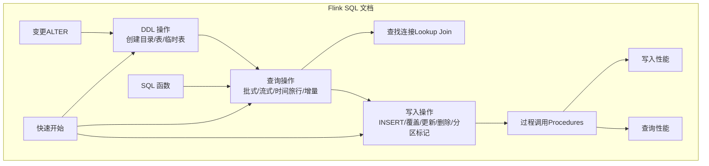
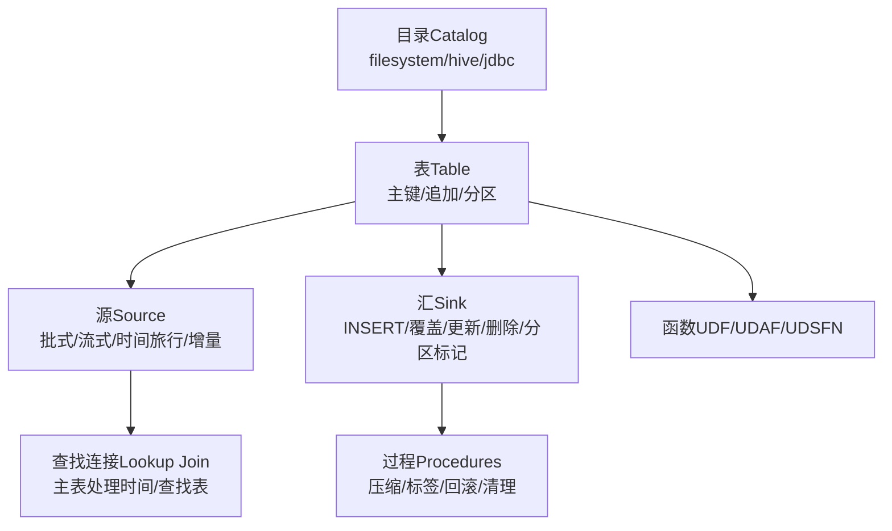
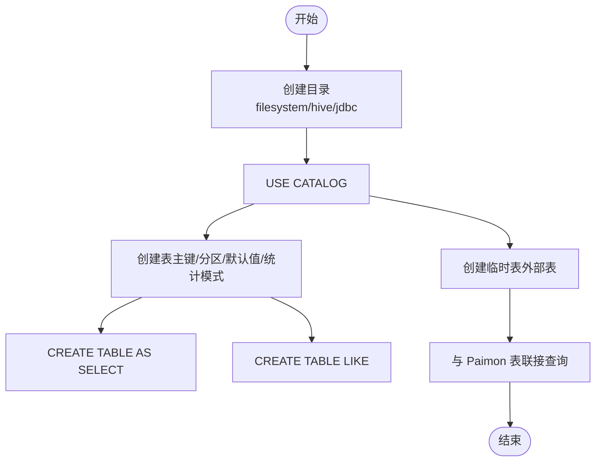
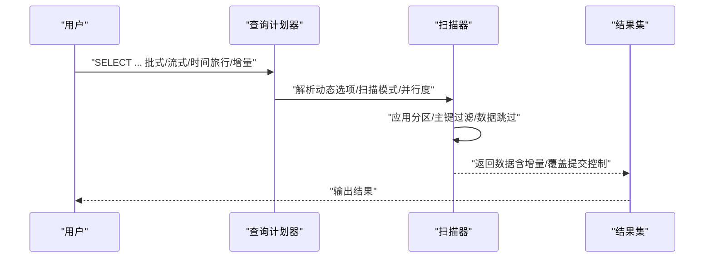
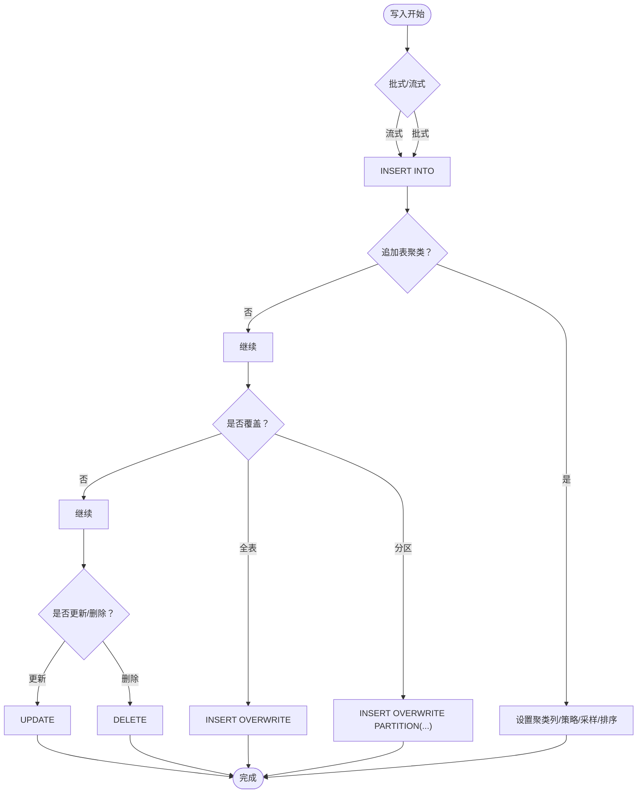
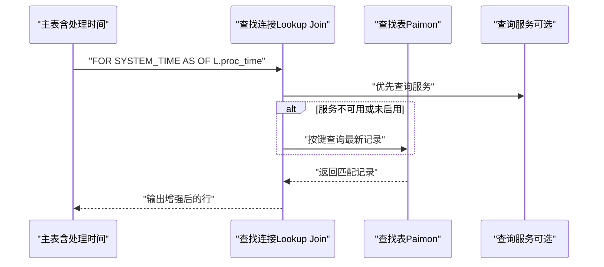
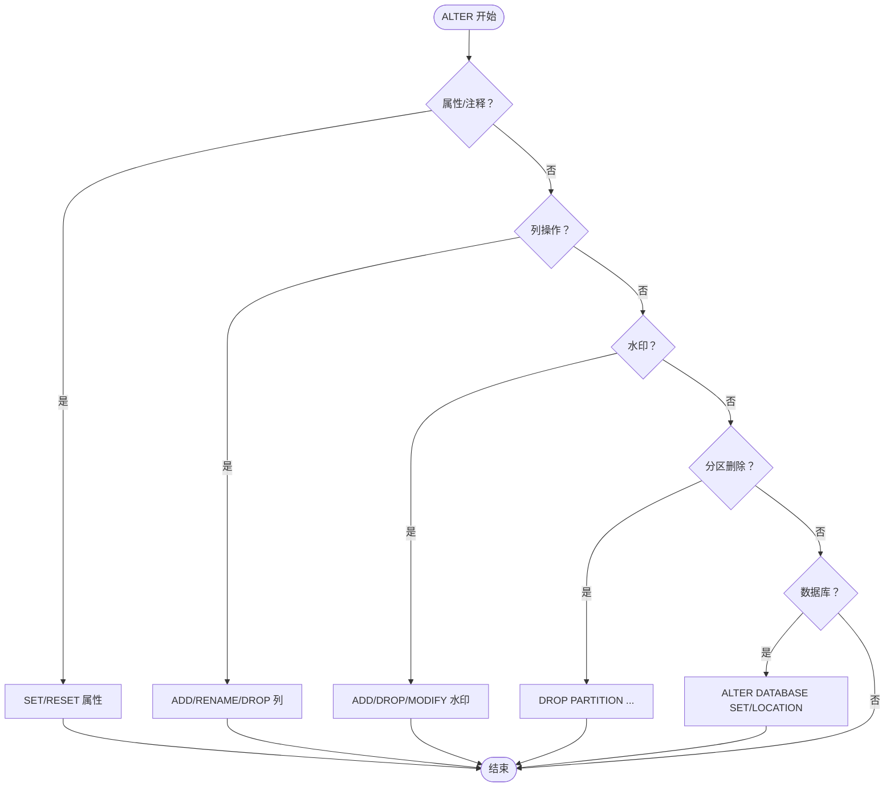
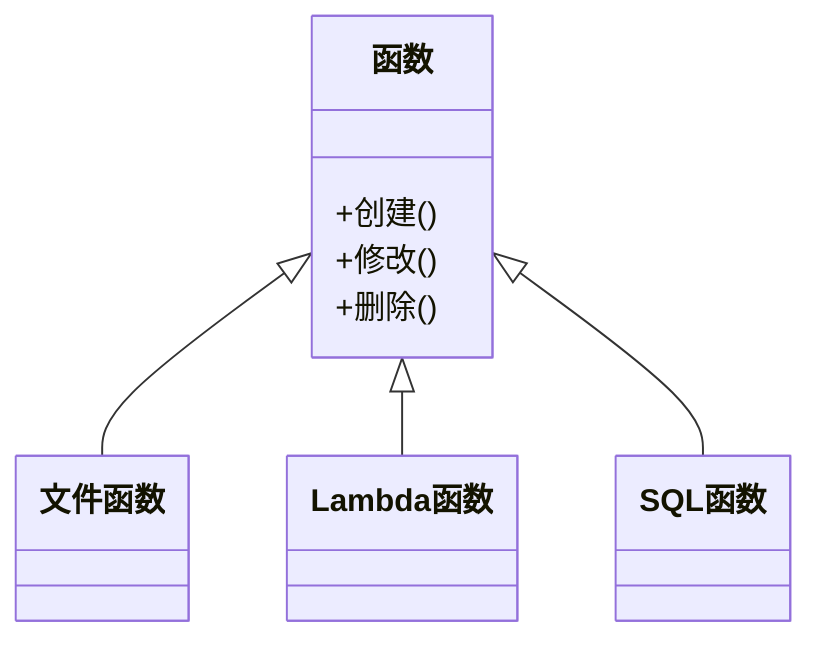
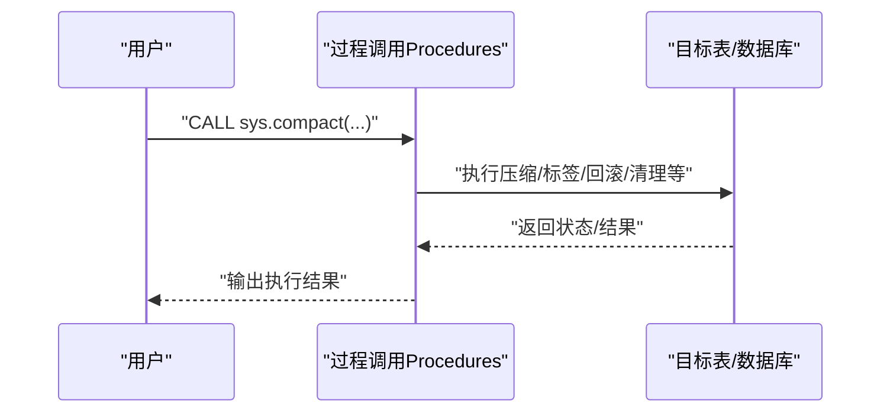
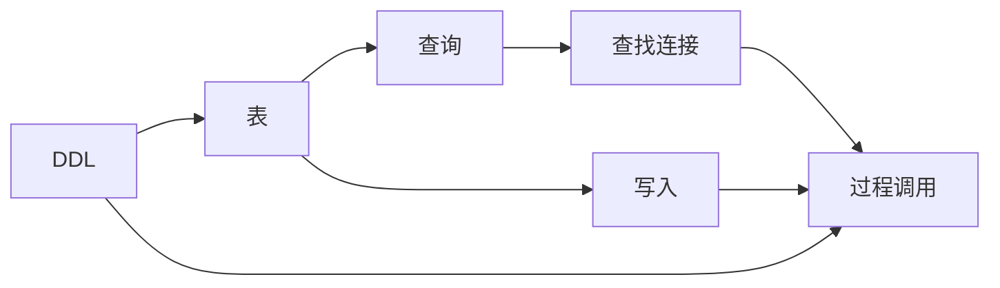

# SQL操作

<cite>
**本文引用的文件**
- [sql-ddl.md](file://docs/content/flink/sql-ddl.md)
- [sql-query.md](file://docs/content/flink/sql-query.md)
- [sql-write.md](file://docs/content/flink/sql-write.md)
- [sql-lookup.md](file://docs/content/flink/sql-lookup.md)
- [sql-alter.md](file://docs/content/flink/sql-alter.md)
- [functions.md](file://docs/content/concepts/functions.md)
- [quick-start.md](file://docs/content/flink/quick-start.md)
- [procedures.md](file://docs/content/flink/procedures.md)
- [write-performance.md](file://docs/content/maintenance/write-performance.md)
- [query-performance.md](file://docs/content/primary-key-table/query-performance.md)
</cite>

## 目录
1. [简介](#简介)
2. [项目结构](#项目结构)
3. [核心组件](#核心组件)
4. [架构总览](#架构总览)
5. [详细组件分析](#详细组件分析)
6. [依赖分析](#依赖分析)
7. [性能考虑](#性能考虑)
8. [故障排查指南](#故障排查指南)
9. [结论](#结论)
10. [附录](#附录)

## 简介
本文件面向在 Apache Paimon 上进行 Flink SQL 操作的用户，系统性梳理 DDL（创建/删除/变更）、查询（批式/流式/时间旅行/增量）、写入（INSERT/覆盖/更新/删除/分区标记完成）以及 SQL 函数与查找连接（Lookup Join）等能力，并提供丰富的示例路径与最佳实践建议，帮助读者快速上手并高效运维。

## 项目结构
围绕 Flink SQL 的文档主要分布在以下位置：
- Flink SQL DDL：创建目录、表、临时表，以及基于不同元存储（文件系统/Hive/JDBC）的配置要点
- Flink SQL 查询：批式/流式读取、时间旅行、增量读取、并行度控制与查询优化
- Flink SQL 写入：INSERT/覆盖/分区覆盖/清空/更新/删除/分区标记完成
- SQL 查找连接（Lookup Join）：主表处理时间属性、查找表的准备与优化策略
- SQL 变更（ALTER）：属性/注释/重命名/列增删改/水印/数据库位置等
- SQL 函数：创建/修改/删除函数（文件/lambda/SQL）
- 快速开始：JAR 下载、本地集群启动、创建目录与表、写入与查询
- 过程调用（Procedures）：批量执行压缩、标签管理、回滚、清理孤儿文件等
- 性能：写入性能、查询性能、并行度与内存调优

**章节来源**
- [sql-ddl.md:1-319](file://docs/content/flink/sql-ddl.md#L1-L319)
- [sql-query.md:1-308](file://docs/content/flink/sql-query.md#L1-L308)
- [sql-write.md:1-316](file://docs/content/flink/sql-write.md#L1-L316)
- [sql-lookup.md:1-213](file://docs/content/flink/sql-lookup.md#L1-L213)
- [sql-alter.md:1-238](file://docs/content/flink/sql-alter.md#L1-L238)
- [functions.md:1-90](file://docs/content/concepts/functions.md#L1-L90)
- [quick-start.md:1-298](file://docs/content/flink/quick-start.md#L1-L298)
- [procedures.md:1-990](file://docs/content/flink/procedures.md#L1-L990)
- [write-performance.md:1-164](file://docs/content/maintenance/write-performance.md#L1-L164)
- [query-performance.md:1-105](file://docs/content/primary-key-table/query-performance.md#L1-L105)

## 核心组件
- 目录（Catalog）：支持 filesystem、hive、jdbc 三种元存储；可设置默认表选项、分区同步、Hive 参数注入、锁配置等
- 表（Table）：支持主键表、追加表、分区表；可指定统计模式、字段默认值、临时表与外部表配合
- 查询（Query）：批式/流式读取、时间旅行（快照/标签/时间戳/水位线）、增量读取（快照区间/自动标签区间）
- 写入（Write）：INSERT/覆盖/分区覆盖/清空/更新/删除/分区标记完成
- 查找连接（Lookup Join）：基于主表处理时间与查找表的连接，支持重试、异步重试、固定桶分片、动态分区
- 变更（ALTER）：表属性/注释/重命名、列增删改/位置/类型/空值约束/水印、分区删除、数据库属性/位置
- 函数（Functions）：文件/lambda/SQL 函数的创建/修改/删除
- 过程（Procedures）：压缩/标签/回滚/清理/迁移/过期等运维操作

**章节来源**
- [sql-ddl.md:29-152](file://docs/content/flink/sql-ddl.md#L29-L152)
- [sql-query.md:27-308](file://docs/content/flink/sql-query.md#L27-L308)
- [sql-write.md:27-316](file://docs/content/flink/sql-write.md#L27-L316)
- [sql-lookup.md:27-213](file://docs/content/flink/sql-lookup.md#L27-L213)
- [sql-alter.md:27-238](file://docs/content/flink/sql-alter.md#L27-L238)
- [functions.md:27-90](file://docs/content/concepts/functions.md#L27-L90)
- [procedures.md:27-990](file://docs/content/flink/procedures.md#L27-L990)

## 架构总览
下图展示了从“目录与表”到“查询/写入/查找连接”的整体关系，以及“过程调用”对性能与运维的支持。

**图表来源**
- [sql-ddl.md:29-152](file://docs/content/flink/sql-ddl.md#L29-L152)
- [sql-query.md:27-308](file://docs/content/flink/sql-query.md#L27-L308)
- [sql-write.md:27-316](file://docs/content/flink/sql-write.md#L27-L316)
- [sql-lookup.md:27-213](file://docs/content/flink/sql-lookup.md#L27-L213)
- [functions.md:27-90](file://docs/content/concepts/functions.md#L27-L90)
- [procedures.md:27-990](file://docs/content/flink/procedures.md#L27-L990)

## 详细组件分析

### DDL 操作（创建/删除/变更）
- 创建目录
  - 文件系统目录：指定仓库路径，注册并使用目录
  - Hive 目录：支持 Hive 元存储，注意库/表/字段名小写、安全认证与分区同步
  - JDBC 目录：支持 MySQL/SQLite 等，注意锁配置与 catalog-key 隔离
- 创建表
  - 主键表、分区表、字段默认值、统计模式（full/truncate(counts/none)）
  - 支持 CREATE TABLE AS SELECT 与 CREATE TABLE LIKE
- 临时表
  - 与 Paimon 目录配合，实现临时外部表参与联接

**图表来源**
- [sql-ddl.md:29-152](file://docs/content/flink/sql-ddl.md#L29-L152)
- [sql-ddl.md:153-319](file://docs/content/flink/sql-ddl.md#L153-L319)

**章节来源**
- [sql-ddl.md:29-152](file://docs/content/flink/sql-ddl.md#L29-L152)
- [sql-ddl.md:153-319](file://docs/content/flink/sql-ddl.md#L153-L319)

### 查询操作（SELECT/时间旅行/增量/并行度）
- 批式查询
  - 默认读取最新快照；支持按快照 ID/时间戳/标签/水位线进行时间旅行
  - 增量读取：快照区间、时间区间、自动标签区间（容错延迟）
- 流式查询
  - 默认首次全量+后续增量；可仅增量（latest）或从指定快照起始
  - 时间旅行流读：基于快照/时间戳/从某快照起始
  - 覆盖提交读取：默认忽略 OVERWRITE 提交，可开启读取
- 并行度与优化
  - 批式并行度=分片数，流式并行度=桶数（受最大推断并行度限制）
  - 推荐指定分区/主键过滤以加速数据跳过
  - 大量分片场景可启用专用分片生成避免初始化慢/OOM

**图表来源**
- [sql-query.md:27-308](file://docs/content/flink/sql-query.md#L27-L308)

**章节来源**
- [sql-query.md:27-308](file://docs/content/flink/sql-query.md#L27-L308)

### 写入操作（INSERT/覆盖/更新/删除/分区标记）
- INSERT INTO
  - 支持批式/流式；默认执行合并、快照过期、分区过期（如配置）
  - 追加表支持聚类写入（batch+追加表），通过列聚类与采样/排序策略优化
- INSERT OVERWRITE
  - 全表覆盖（未分区表）或分区覆盖（分区表）
  - 动态/静态覆盖模式切换
- TRUNCATE TABLE（Flink 1.18+）
- UPDATE/DELETE（Flink 1.17+）
  - 更新：主键表+去重/部分更新合并引擎；不支持更新主键
  - 删除：主键表+去重/部分更新（允许删除时）；不支持流式
- 分区标记完成（Partition Mark Done）
  - 定义时间解析器/时间间隔/idle 时间，触发下游调度；支持 done 文件/HTTP 报告/自定义动作

**图表来源**
- [sql-write.md:27-316](file://docs/content/flink/sql-write.md#L27-L316)

**章节来源**
- [sql-write.md:27-316](file://docs/content/flink/sql-write.md#L27-L316)

### SQL 查找连接（Lookup Join）
- 场景：在流式查询中，使用主表处理时间属性与 Paimon 查找表进行增强联接
- 正常查找、重试查找（同步/异步 allow_unordered）、固定桶分片（Flink 2.0+ 且固定桶表）
- 动态分区：max_pt() 自动刷新最新分区；可指定父分区层级
- 查询服务：启动查询服务优先从服务端获取数据，提升性能

**图表来源**
- [sql-lookup.md:27-213](file://docs/content/flink/sql-lookup.md#L27-L213)

**章节来源**
- [sql-lookup.md:27-213](file://docs/content/flink/sql-lookup.md#L27-L213)

### SQL 变更（ALTER）
- 属性/注释：SET/RESET
- 重命名表
- 列操作：ADD/RENAME/DROP、FIRST/AFTER 指定位置、MODIFY 类型/空值/注释
- 分区删除（Flink SQL 中可指定部分分区列与多值）
- 水印：ADD/DROP/MODIFY
- 数据库：ALTER DATABASE 设置属性/位置

**图表来源**
- [sql-alter.md:27-238](file://docs/content/flink/sql-alter.md#L27-L238)

**章节来源**
- [sql-alter.md:27-238](file://docs/content/flink/sql-alter.md#L27-L238)

### SQL 函数
- 支持文件函数、Lambda 函数、SQL 函数
- 在 Flink 中创建/修改/删除函数，可指定语言与 JAR 来源

**图表来源**
- [functions.md:27-90](file://docs/content/concepts/functions.md#L27-L90)

**章节来源**
- [functions.md:27-90](file://docs/content/concepts/functions.md#L27-L90)

### 快速开始与示例路径
- 下载对应版本的 Paimon Flink JAR，复制到 Flink lib，启动本地集群
- 使用 SQL Client 创建目录与表，写入数据，切换批式/流式查询
- 示例路径（仅路径，不含代码内容）：
  - 创建目录与表：[quick-start.md:136-151](file://docs/content/flink/quick-start.md#L136-L151)
  - 写入与批式查询：[quick-start.md:189-219](file://docs/content/flink/quick-start.md#L189-L219)
  - 流式查询：[quick-start.md:223-232](file://docs/content/flink/quick-start.md#L223-L232)

**章节来源**
- [quick-start.md:136-232](file://docs/content/flink/quick-start.md#L136-L232)

### 过程调用（Procedures）
- 压缩/数据库压缩、标签管理（创建/删除/替换/过期/触发）、回滚到快照/标签/时间戳/水位线
- 清理孤儿文件/不存在文件/清单、重置/清除消费者
- 迁移 Hive/Iceberg 表到 Paimon、重写文件索引、分支管理、清空表
- 以上均支持命名参数与索引参数两种调用方式

**图表来源**
- [procedures.md:27-990](file://docs/content/flink/procedures.md#L27-L990)

**章节来源**
- [procedures.md:27-990](file://docs/content/flink/procedures.md#L27-L990)

## 依赖分析
- 组件耦合
  - 查询依赖表的扫描模式与并行度配置；写入依赖目录的元存储类型与表属性
  - Lookup Join 依赖主表处理时间属性与查找表的键分布（固定桶/分片）
  - 过程调用贯穿写入/查询/运维全流程，降低作业提交成本
- 外部依赖
  - Hive 目录需 Hive Connector JAR；JDBC 目录需对应数据库驱动
  - 对象存储场景下，目录/表重命名需关注非原子性风险

**图表来源**
- [sql-ddl.md:29-152](file://docs/content/flink/sql-ddl.md#L29-L152)
- [sql-query.md:27-308](file://docs/content/flink/sql-query.md#L27-L308)
- [sql-write.md:27-316](file://docs/content/flink/sql-write.md#L27-L316)
- [sql-lookup.md:27-213](file://docs/content/flink/sql-lookup.md#L27-L213)
- [procedures.md:27-990](file://docs/content/flink/procedures.md#L27-L990)

**章节来源**
- [sql-ddl.md:29-152](file://docs/content/flink/sql-ddl.md#L29-L152)
- [sql-query.md:27-308](file://docs/content/flink/sql-query.md#L27-L308)
- [sql-write.md:27-316](file://docs/content/flink/sql-write.md#L27-L316)
- [sql-lookup.md:27-213](file://docs/content/flink/sql-lookup.md#L27-L213)
- [procedures.md:27-990](file://docs/content/flink/procedures.md#L27-L990)

## 性能考虑
- 写入性能
  - 增大检查点间隔、并发检查点数；增大写缓冲、启用可溢出；调整桶数；必要时关闭/延后变更生产器与全量压缩
  - 针对主键倾斜可启用本地合并缓冲；批量写入优于频繁小事务
  - 文件格式与压缩策略权衡：Row 存储适合高吞吐写与压缩，但查询投影差；列存适合分析查询
  - 写入初始化阶段可启用协调器缓存；Commit 内存可通过细粒度资源管理单独提升
- 查询性能
  - 合理选择表模式（MOR/Deletion Vectors/Read Optimized）；固定桶表可避免联接洗牌
  - 利用主键/文件索引（布隆/位图/范围位图）加速点查与范围过滤
  - 查询优化：指定分区/主键过滤、左前缀匹配、聚合下推

**章节来源**
- [write-performance.md:27-164](file://docs/content/maintenance/write-performance.md#L27-L164)
- [query-performance.md:27-105](file://docs/content/primary-key-table/query-performance.md#L27-L105)

## 故障排查指南
- Hive 目录兼容性
  - 修改不兼容列类型需关闭严格校验或在目录中禁用不兼容变更
  - Hive3 禁用 ACID，避免与 Paimon 写入冲突
- 对象存储重命名
  - 非原子性导致部分文件移动失败，需谨慎使用
- 写入稳定性
  - 桶数过少或全量压缩导致检查点超时，可延长超时或增加资源
- 查询阻塞
  - Lookup Join 异步重试+允许无序可避免阻塞；CDC 流中需结合审计日志转换为追加流

**章节来源**
- [sql-ddl.md:90-118](file://docs/content/flink/sql-ddl.md#L90-L118)
- [sql-alter.md:109-116](file://docs/content/flink/sql-alter.md#L109-L116)
- [write-performance.md:115-164](file://docs/content/maintenance/write-performance.md#L115-L164)
- [sql-lookup.md:117-121](file://docs/content/flink/sql-lookup.md#L117-L121)

## 结论
通过系统化的 DDL/查询/写入/查找连接/变更/函数与过程调用，Paimon 在 Flink 上提供了从开发到运维的一体化 SQL 能力。结合性能优化与最佳实践，可在保证稳定性的同时获得更高的吞吐与更低的查询延迟。

## 附录
- 示例路径（仅路径，不含代码内容）
  - DDL：创建目录与表、临时表与联接示例
    - [sql-ddl.md:39-84](file://docs/content/flink/sql-ddl.md#L39-L84)
    - [sql-ddl.md:158-183](file://docs/content/flink/sql-ddl.md#L158-L183)
    - [sql-ddl.md:214-270](file://docs/content/flink/sql-ddl.md#L214-L270)
    - [sql-ddl.md:289-319](file://docs/content/flink/sql-ddl.md#L289-L319)
  - 查询：批式/流式/时间旅行/增量
    - [sql-query.md:35-80](file://docs/content/flink/sql-query.md#L35-L80)
    - [sql-query.md:126-192](file://docs/content/flink/sql-query.md#L126-L192)
    - [sql-query.md:193-308](file://docs/content/flink/sql-query.md#L193-L308)
  - 写入：INSERT/覆盖/更新/删除/分区标记
    - [sql-write.md:31-49](file://docs/content/flink/sql-write.md#L31-L49)
    - [sql-write.md:84-118](file://docs/content/flink/sql-write.md#L84-L118)
    - [sql-write.md:174-243](file://docs/content/flink/sql-write.md#L174-L243)
    - [sql-write.md:244-316](file://docs/content/flink/sql-write.md#L244-L316)
  - 查找连接：重试/异步/固定桶/动态分区/查询服务
    - [sql-lookup.md:72-121](file://docs/content/flink/sql-lookup.md#L72-L121)
    - [sql-lookup.md:123-181](file://docs/content/flink/sql-lookup.md#L123-L181)
    - [sql-lookup.md:182-213](file://docs/content/flink/sql-lookup.md#L182-L213)
  - 变更：属性/注释/重命名/列/水印/分区/数据库
    - [sql-alter.md:29-71](file://docs/content/flink/sql-alter.md#L29-L71)
    - [sql-alter.md:77-178](file://docs/content/flink/sql-alter.md#L77-L178)
    - [sql-alter.md:179-238](file://docs/content/flink/sql-alter.md#L179-L238)
  - 函数：创建/修改/删除
    - [functions.md:49-85](file://docs/content/concepts/functions.md#L49-L85)
  - 快速开始：JAR/启动/目录/表/写入/查询
    - [quick-start.md:31-76](file://docs/content/flink/quick-start.md#L31-L76)
    - [quick-start.md:130-232](file://docs/content/flink/quick-start.md#L130-L232)
  - 过程调用：压缩/标签/回滚/清理/迁移/分支
    - [procedures.md:48-990](file://docs/content/flink/procedures.md#L48-L990)
  - 性能：写入/查询
    - [write-performance.md:27-164](file://docs/content/maintenance/write-performance.md#L27-L164)
    - [query-performance.md:27-105](file://docs/content/primary-key-table/query-performance.md#L27-L105)