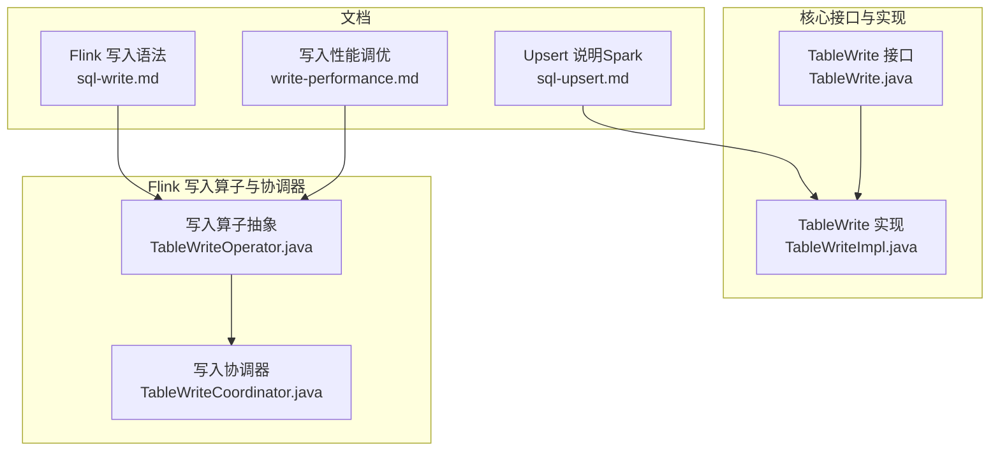
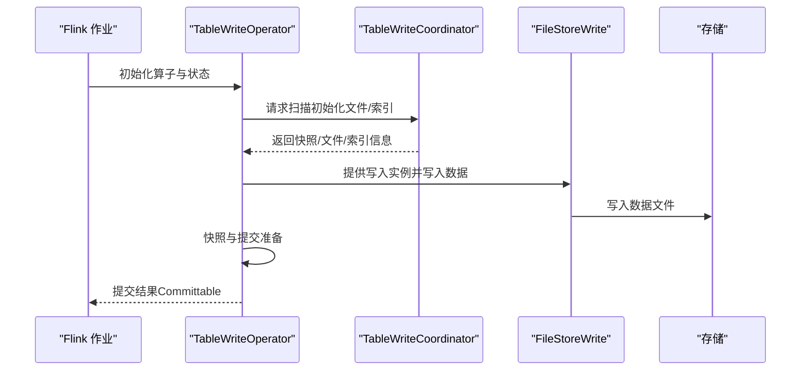
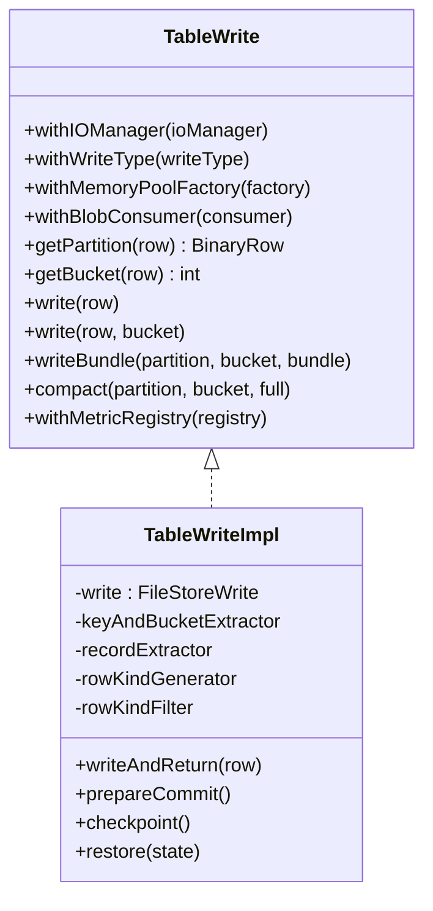
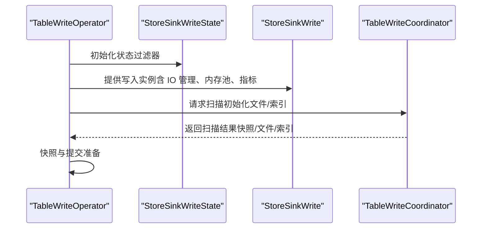
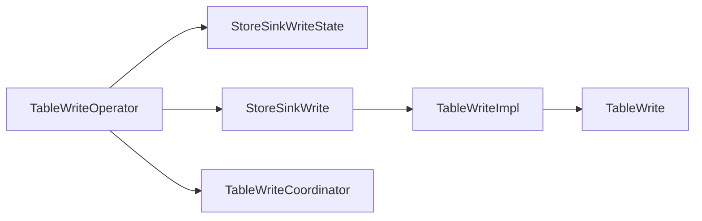

# 写入操作

<cite>
**本文引用的文件**
- [sql-write.md](file://docs/content/flink/sql-write.md)
- [write-performance.md](file://docs/content/maintenance/write-performance.md)
- [sql-upsert.md](file://docs/content/spark/sql-upsert.md)
- [TableWrite.java](file://paimon-core/src/main/java/org/apache/paimon/table/sink/TableWrite.java)
- [TableWriteImpl.java](file://paimon-core/src/main/java/org/apache/paimon/table/sink/TableWriteImpl.java)
- [TableWriteOperator.java](file://paimon-flink/paimon-flink-common/src/main/java/org/apache/paimon/flink/sink/TableWriteOperator.java)
- [TableWriteCoordinator.java](file://paimon-flink/paimon-flink-common/src/main/java/org/apache/paimon/flink/sink/coordinator/TableWriteCoordinator.java)
</cite>

## 目录
1. [简介](#简介)
2. [项目结构](#项目结构)
3. [核心组件](#核心组件)
4. [架构总览](#架构总览)
5. [组件详解](#组件详解)
6. [依赖关系分析](#依赖关系分析)
7. [性能考量](#性能考量)
8. [故障排查指南](#故障排查指南)
9. [结论](#结论)
10. [附录：SQL 示例与最佳实践](#附录sql-示例与最佳实践)

## 简介
本章节面向在 Apache Flink 中使用 Paimon 进行写入操作的用户，系统性讲解以下主题：
- INSERT 静态插入与流式插入的差异与用法
- UPSERT 操作的实现原理、适用场景与配置要点
- 批量写入与流式写入的配置项与行为
- 写入性能优化策略（并行度、批大小、缓冲与压缩等）
- 错误处理与重试机制
- 不同写入模式下的 SQL 示例与最佳实践
- 写入监控与故障排除建议

## 项目结构
围绕写入能力，核心代码分布在以下模块与文件中：
- 文档层：Flink 写入语法与运维调优指南
- 核心接口与实现：表写入抽象与具体实现
- Flink 写入算子与协调器：负责状态管理、提交与协调

**图表来源**
- [sql-write.md:27-316](file://docs/content/flink/sql-write.md#L27-L316)
- [write-performance.md:27-164](file://docs/content/maintenance/write-performance.md#L27-L164)
- [sql-upsert.md:27-96](file://docs/content/spark/sql-upsert.md#L27-L96)
- [TableWrite.java:32-84](file://paimon-core/src/main/java/org/apache/paimon/table/sink/TableWrite.java#L32-L84)
- [TableWriteImpl.java:49-287](file://paimon-core/src/main/java/org/apache/paimon/table/sink/TableWriteImpl.java#L49-L287)
- [TableWriteOperator.java:46-224](file://paimon-flink/paimon-flink-common/src/main/java/org/apache/paimon/flink/sink/TableWriteOperator.java#L46-L224)
- [TableWriteCoordinator.java:51-221](file://paimon-flink/paimon-flink-common/src/main/java/org/apache/paimon/flink/sink/coordinator/TableWriteCoordinator.java#L51-L221)

**章节来源**
- [sql-write.md:27-316](file://docs/content/flink/sql-write.md#L27-L316)
- [write-performance.md:27-164](file://docs/content/maintenance/write-performance.md#L27-L164)
- [sql-upsert.md:27-96](file://docs/content/spark/sql-upsert.md#L27-L96)

## 核心组件
- 表写入接口与实现
  - TableWrite：定义写入能力（分区/桶计算、逐行写入、打包写入、压缩触发、指标注册等）
  - TableWriteImpl：封装 FileStoreWrite 的具体写入逻辑，负责记录提取、空值校验、默认值填充、写入执行与提交
- Flink 写入算子与协调器
  - TableWriteOperator：抽象写入算子，负责初始化状态、写入实例、快照与提交
  - TableWriteCoordinator：协调写入初始化扫描、分页响应、动态桶索引与删除向量索引扫描

**章节来源**
- [TableWrite.java:32-84](file://paimon-core/src/main/java/org/apache/paimon/table/sink/TableWrite.java#L32-L84)
- [TableWriteImpl.java:49-287](file://paimon-core/src/main/java/org/apache/paimon/table/sink/TableWriteImpl.java#L49-L287)
- [TableWriteOperator.java:46-224](file://paimon-flink/paimon-flink-common/src/main/java/org/apache/paimon/flink/sink/TableWriteOperator.java#L46-L224)
- [TableWriteCoordinator.java:51-221](file://paimon-flink/paimon-flink-common/src/main/java/org/apache/paimon/flink/sink/coordinator/TableWriteCoordinator.java#L51-L221)

## 架构总览
下图展示从 Flink 任务到 Paimon 写入端的整体流程：算子初始化、状态恢复、写入执行、协调器扫描与提交。

**图表来源**
- [TableWriteOperator.java:74-155](file://paimon-flink/paimon-flink-common/src/main/java/org/apache/paimon/flink/sink/TableWriteOperator.java#L74-L155)
- [TableWriteCoordinator.java:89-169](file://paimon-flink/paimon-flink-common/src/main/java/org/apache/paimon/flink/sink/coordinator/TableWriteCoordinator.java#L89-L169)
- [TableWriteImpl.java:250-260](file://paimon-core/src/main/java/org/apache/paimon/table/sink/TableWriteImpl.java#L250-L260)

## 组件详解

### INSERT 语法与模式
- 语法与模式
  - 支持 INSERT INTO 与 INSERT OVERWRITE；支持批与流模式
  - 流模式下默认会进行压缩、快照过期与分区过期（若配置）
- 覆盖策略
  - 全表覆盖（未分区或关闭动态分区覆盖时）
  - 分区覆盖（分区表按分区覆盖）
  - 动态覆盖 vs 静态覆盖（通过选项控制）
- 截断与分区清理
  - 可通过覆盖插入空查询实现截断
  - 多分区删除可通过专用作业方式执行

**章节来源**
- [sql-write.md:29-143](file://docs/content/flink/sql-write.md#L29-L143)

### UPSERT 原理与使用
- 适用范围
  - 无主键表支持 upsert 写入，基于 upsert-key 去重/更新
  - 可选 sequence.field 控制保留最新记录
- 工作机制
  - 相同 upsert-key 的新记录与现有记录比较，按规则更新或插入
  - 若未设置 sequence.field，则仅做更新且不进行额外去重
- 注意事项
  - upsert-key 可包含可空列，支持空等值匹配
  - 与主键表的 MergeEngine 不同，Upsert 模式更偏向“键冲突即更新”

**章节来源**
- [sql-upsert.md:27-96](file://docs/content/spark/sql-upsert.md#L27-L96)

### 批量写入与流式写入
- 批量写入
  - 适合离线/周期性同步，吞吐高、延迟低
  - 通常配合较大的写缓冲与合适的并行度
- 流式写入
  - 适合实时/准实时场景，具备持续提交与压缩能力
  - 默认会进行压缩、快照与分区过期（若配置）

**章节来源**
- [sql-write.md:47-48](file://docs/content/flink/sql-write.md#L47-L48)

### 写入类与流程（代码级）

**图表来源**
- [TableWrite.java:32-84](file://paimon-core/src/main/java/org/apache/paimon/table/sink/TableWrite.java#L32-L84)
- [TableWriteImpl.java:49-287](file://paimon-core/src/main/java/org/apache/paimon/table/sink/TableWriteImpl.java#L49-L287)

### 写入算子与协调器（Flink）

**图表来源**
- [TableWriteOperator.java:74-155](file://paimon-flink/paimon-flink-common/src/main/java/org/apache/paimon/flink/sink/TableWriteOperator.java#L74-L155)
- [TableWriteCoordinator.java:89-169](file://paimon-flink/paimon-flink-common/src/main/java/org/apache/paimon/flink/sink/coordinator/TableWriteCoordinator.java#L89-L169)

## 依赖关系分析
- 接口与实现
  - TableWrite 为写入抽象，TableWriteImpl 实现具体逻辑，并委托给 FileStoreWrite 完成底层写入
- Flink 集成
  - TableWriteOperator 负责在算子生命周期内完成状态初始化、写入实例提供与提交
  - TableWriteCoordinator 提供写入初始化扫描与分页响应，降低算子初始化成本
- 配置与运行时
  - 协调器分页大小、写入缓冲、内存池、指标注册等均通过 TableWriteOperator 与 TableWriteImpl 的链路生效

**图表来源**
- [TableWriteOperator.java:74-155](file://paimon-flink/paimon-flink-common/src/main/java/org/apache/paimon/flink/sink/TableWriteOperator.java#L74-L155)
- [TableWriteCoordinator.java:51-221](file://paimon-flink/paimon-flink-common/src/main/java/org/apache/paimon/flink/sink/coordinator/TableWriteCoordinator.java#L51-L221)
- [TableWriteImpl.java:49-287](file://paimon-core/src/main/java/org/apache/paimon/table/sink/TableWriteImpl.java#L49-L287)
- [TableWrite.java:32-84](file://paimon-core/src/main/java/org/apache/paimon/table/sink/TableWrite.java#L32-L84)

**章节来源**
- [TableWriteOperator.java:46-224](file://paimon-flink/paimon-flink-common/src/main/java/org/apache/paimon/flink/sink/TableWriteOperator.java#L46-L224)
- [TableWriteCoordinator.java:51-221](file://paimon-flink/paimon-flink-common/src/main/java/org/apache/paimon/flink/sink/coordinator/TableWriteCoordinator.java#L51-L221)
- [TableWriteImpl.java:49-287](file://paimon-core/src/main/java/org/apache/paimon/table/sink/TableWriteImpl.java#L49-L287)
- [TableWrite.java:32-84](file://paimon-core/src/main/java/org/apache/paimon/table/sink/TableWrite.java#L32-L84)

## 性能考量
- 并行度与桶数
  - 建议下游写入并行度小于等于桶数，优先相等
  - 可通过 sink.parallelism 控制
- 写缓冲与溢出
  - 增大 write-buffer-size，启用 write-buffer-spillable 以提升吞吐
- 文件格式与压缩
  - 行式格式（如 AVRO）可提升写入与压缩性能，但牺牲查询投影效率
  - 可按层级指定文件格式（如前若干层使用 AVRO）
  - 调整 zstd 压缩等级平衡压缩率与速度
- 局部合并与倾斜
  - 主键倾斜场景可启用 local-merge-buffer-size 缓冲后合并，减少跨桶 shuffle
- 初始化加速
  - 启用 sink.writer-coordinator.enabled 并配置缓存内存，加速历史文件扫描
- 提交与内存
  - 大量写入时，提交阶段可能占用较多内存，可使用细粒度资源管理为提交器单独分配内存与 CPU
- 稳定性
  - 桶数过少或全量压缩可能导致检查点超时，可适当延长检查点超时时间

**章节来源**
- [write-performance.md:29-164](file://docs/content/maintenance/write-performance.md#L29-L164)

## 故障排查指南
- 写入卡顿与背压
  - 观察输入抖动与节点不平衡，考虑开启异步压缩观察吞吐变化
- 检查点超时
  - 全量压缩或桶数不足易导致超时，可延长检查点超时或减少压缩强度
- 写入初始化慢
  - 启用写入协调器并增大缓存内存，减少历史文件扫描开销
- 提交阶段 OOM
  - 为提交器单独配置内存与 CPU，避免全局 TaskManager 内存浪费
- 数据倾斜
  - 启用局部合并缓冲，或调整桶数与分区键，缓解热点

**章节来源**
- [write-performance.md:115-164](file://docs/content/maintenance/write-performance.md#L115-L164)

## 结论
- 在 Flink 中使用 Paimon 写入，应结合业务场景选择批量或流式模式，并根据数据特征合理配置并行度、缓冲与文件格式
- Upsert 模式适用于无主键表的键冲突更新，需正确设置 upsert-key 与 sequence.field
- 通过写入协调器与局部合并等手段可显著提升稳定性与吞吐
- 遇到性能瓶颈时，优先从检查点间隔、写缓冲、压缩与提交器资源三方面入手

## 附录：SQL 示例与最佳实践
- INSERT INTO（批/流）
  - 用于常规追加写入，流模式默认会进行压缩、快照与分区过期（若配置）
- INSERT OVERWRITE（全表/分区）
  - 全表覆盖（未分区或关闭动态分区覆盖）
  - 分区覆盖（分区表按分区覆盖）
  - 动态覆盖 vs 静态覆盖（通过选项切换）
- TRUNCATE TABLE（Flink 1.18+）
  - 使用 TRUNCATE TABLE 清空表
- UPDATE/DELETE（主键表）
  - 仅主键表支持，需满足 MergeEngine 条件；DELETE 不支持流模式
- Upsert（无主键表）
  - 设置 upsert-key 与可选 sequence.field，实现键冲突更新
- 最佳实践
  - 明确并行度与桶数关系，避免写入热点
  - 合理设置写缓冲与溢出策略，平衡内存与吞吐
  - 根据查询负载选择列存/行存格式，并调整压缩级别
  - 使用写入协调器加速初始化，必要时为提交器单独分配资源

**章节来源**
- [sql-write.md:29-316](file://docs/content/flink/sql-write.md#L29-L316)
- [sql-upsert.md:27-96](file://docs/content/spark/sql-upsert.md#L27-L96)