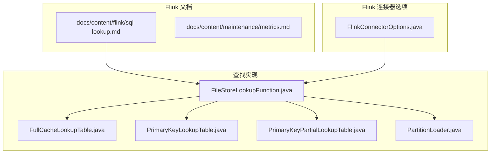
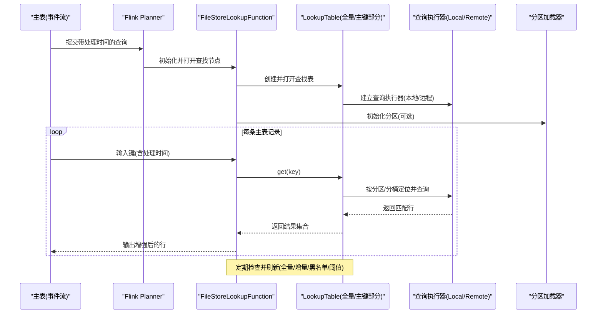
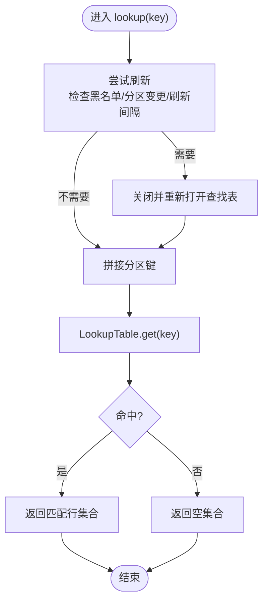
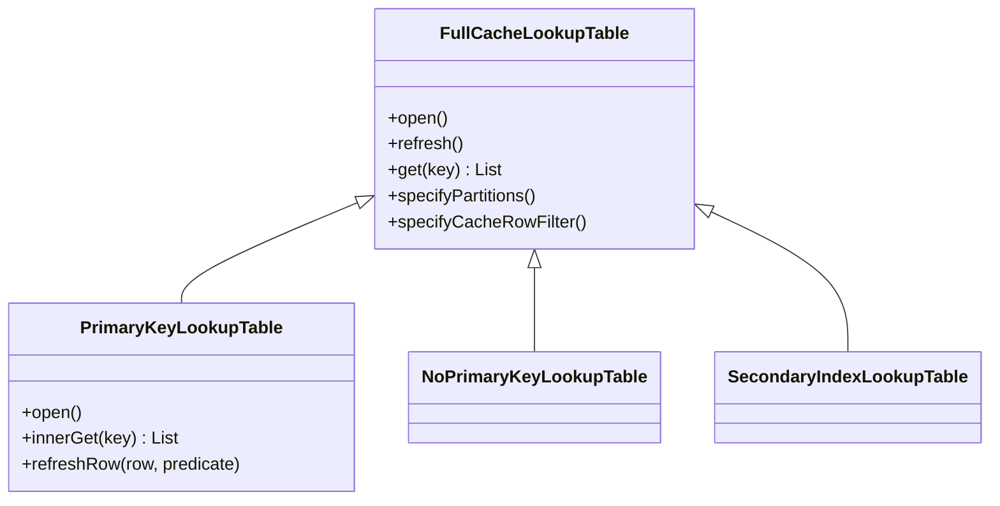
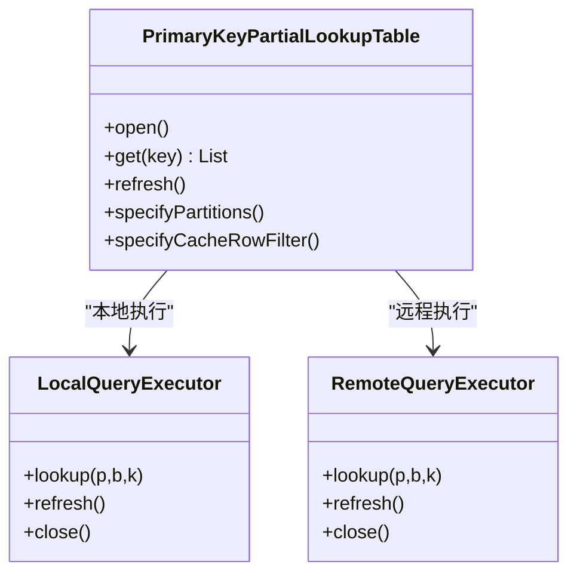
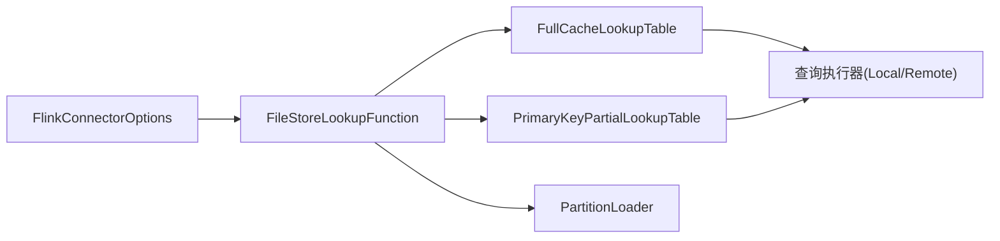

# 查找连接

<cite>
**本文引用的文件**
- [sql-lookup.md](file://docs/content/flink/sql-lookup.md)
- [FlinkConnectorOptions.java](file://paimon-flink/paimon-flink-common/src/main/java/org/apache/paimon/flink/FlinkConnectorOptions.java)
- [FileStoreLookupFunction.java](file://paimon-flink/paimon-flink-common/src/main/java/org/apache/paimon/flink/lookup/FileStoreLookupFunction.java)
- [FullCacheLookupTable.java](file://paimon-flink/paimon-flink-common/src/main/java/org/apache/paimon/flink/lookup/FullCacheLookupTable.java)
- [PrimaryKeyLookupTable.java](file://paimon-flink/paimon-flink-common/src/main/java/org/apache/paimon/flink/lookup/PrimaryKeyLookupTable.java)
- [PrimaryKeyPartialLookupTable.java](file://paimon-flink/paimon-flink-common/src/main/java/org/apache/paimon/flink/lookup/PrimaryKeyPartialLookupTable.java)
- [PartitionLoader.java](file://paimon-flink/paimon-flink-common/src/main/java/org/apache/paimon/flink/lookup/PartitionLoader.java)
- [LookupJoinITCase.java](file://paimon-flink/paimon-flink-common/src/test/java/org/apache/paimon/flink/LookupJoinITCase.java)
- [metrics.md](file://docs/content/maintenance/metrics.md)
</cite>

## 目录
1. [简介](#简介)
2. [项目结构](#项目结构)
3. [核心组件](#核心组件)
4. [架构总览](#架构总览)
5. [详细组件分析](#详细组件分析)
6. [依赖分析](#依赖分析)
7. [性能考量](#性能考量)
8. [故障排除指南](#故障排除指南)
9. [结论](#结论)
10. [附录](#附录)

## 简介
查找连接（Lookup Join）是流式查询中的一种连接方式，用于在流式处理过程中以“点查”的方式从维表（Paimon 表）中检索数据，从而对主表（如来自 Kafka 的事件流）进行实时增强。它要求主表具备处理时间属性，且维表由支持查找的源（如 Paimon 文件存储）提供。

查找连接适用于以下典型场景：
- 维表关联：将订单流与客户、商品等维度表进行实时关联，补充维度信息。
- 实时查询：通过查询服务优先从内存或本地执行器读取，降低延迟。
- 动态分区：针对按时间分区的最新分区进行查找，减少扫描范围。
- 大表分桶：结合固定分桶与分桶重分布，仅加载必要分桶，降低内存占用。

## 项目结构
围绕查找连接的关键代码位于 Flink 连接器与查找实现模块中，文档与示例位于 Flink 文档目录；核心实现位于 paimon-flink-common 的 lookup 包下。

图示来源
- [sql-lookup.md:1-213](file://docs/content/flink/sql-lookup.md#L1-L213)
- [FlinkConnectorOptions.java:222-315](file://paimon-flink/paimon-flink-common/src/main/java/org/apache/paimon/flink/FlinkConnectorOptions.java#L222-L315)
- [FileStoreLookupFunction.java:1-526](file://paimon-flink/paimon-flink-common/src/main/java/org/apache/paimon/flink/lookup/FileStoreLookupFunction.java#L1-L526)
- [FullCacheLookupTable.java:1-430](file://paimon-flink/paimon-flink-common/src/main/java/org/apache/paimon/flink/lookup/FullCacheLookupTable.java#L1-L430)
- [PrimaryKeyLookupTable.java:1-152](file://paimon-flink/paimon-flink-common/src/main/java/org/apache/paimon/flink/lookup/PrimaryKeyLookupTable.java#L1-L152)
- [PrimaryKeyPartialLookupTable.java:1-426](file://paimon-flink/paimon-flink-common/src/main/java/org/apache/paimon/flink/lookup/PrimaryKeyPartialLookupTable.java#L1-L426)
- [PartitionLoader.java:1-125](file://paimon-flink/paimon-flink-common/src/main/java/org/apache/paimon/flink/lookup/PartitionLoader.java#L1-L125)

章节来源
- [sql-lookup.md:1-213](file://docs/content/flink/sql-lookup.md#L1-L213)
- [FlinkConnectorOptions.java:222-315](file://paimon-flink/paimon-flink-common/src/main/java/org/apache/paimon/flink/FlinkConnectorOptions.java#L222-L315)

## 核心组件
- 查找函数（FileStoreLookupFunction）
  - 负责打开/刷新查找表、执行键查找、处理分区刷新与黑名单控制、以及根据策略选择本地/远程查询执行器。
  - 支持自动模式：当主键与连接键一致且存在查询服务可用时，优先使用远程查询；否则尝试本地部分缓存模式，失败则回退到全量缓存模式。
- 全量缓存查找表（FullCacheLookupTable 及其子类）
  - 提供基于投影、谓词过滤、序列字段排序、异步刷新、批量加载等能力。
  - 子类包括：无主键表、主键表、二级索引表等。
- 主键部分缓存查找表（PrimaryKeyPartialLookupTable）
  - 针对主键表，直接读取 LSM 树，按分区与分桶定位，避免全表缓存。
  - 支持本地执行器与远程执行器两种路径。
- 分区加载器（PartitionLoader）
  - 支持静态分区、动态分区（max_pt/max_two_pt）、层级动态分区等，负责生成分区谓词与刷新逻辑。
- 连接器选项（FlinkConnectorOptions）
  - 定义查找连接相关配置项：异步查找、缓存模式、动态分区刷新间隔、黑名单时间窗、全量加载阈值等。

章节来源
- [FileStoreLookupFunction.java:167-260](file://paimon-flink/paimon-flink-common/src/main/java/org/apache/paimon/flink/lookup/FileStoreLookupFunction.java#L167-L260)
- [FullCacheLookupTable.java:76-140](file://paimon-flink/paimon-flink-common/src/main/java/org/apache/paimon/flink/lookup/FullCacheLookupTable.java#L76-L140)
- [PrimaryKeyLookupTable.java:40-86](file://paimon-flink/paimon-flink-common/src/main/java/org/apache/paimon/flink/lookup/PrimaryKeyLookupTable.java#L40-L86)
- [PrimaryKeyPartialLookupTable.java:62-140](file://paimon-flink/paimon-flink-common/src/main/java/org/apache/paimon/flink/lookup/PrimaryKeyPartialLookupTable.java#L62-L140)
- [PartitionLoader.java:85-123](file://paimon-flink/paimon-flink-common/src/main/java/org/apache/paimon/flink/lookup/PartitionLoader.java#L85-L123)
- [FlinkConnectorOptions.java:222-315](file://paimon-flink/paimon-flink-common/src/main/java/org/apache/paimon/flink/FlinkConnectorOptions.java#L222-L315)

## 架构总览
查找连接在运行时的总体流程如下：

图示来源
- [FileStoreLookupFunction.java:278-327](file://paimon-flink/paimon-flink-common/src/main/java/org/apache/paimon/flink/lookup/FileStoreLookupFunction.java#L278-L327)
- [FullCacheLookupTable.java:290-326](file://paimon-flink/paimon-flink-common/src/main/java/org/apache/paimon/flink/lookup/FullCacheLookupTable.java#L290-L326)
- [PrimaryKeyPartialLookupTable.java:159-200](file://paimon-flink/paimon-flink-common/src/main/java/org/apache/paimon/flink/lookup/PrimaryKeyPartialLookupTable.java#L159-L200)
- [PartitionLoader.java:81-123](file://paimon-flink/paimon-flink-common/src/main/java/org/apache/paimon/flink/lookup/PartitionLoader.java#L81-L123)

## 详细组件分析

### 查找函数（FileStoreLookupFunction）
- 打开阶段
  - 解析投影字段与连接键，确保主键加入投影。
  - 根据缓存模式与是否启用远程查询服务，选择主键部分缓存或全量缓存。
  - 初始化分区加载器与分区刷新器（动态分区）。
- 查询阶段
  - 将输入键与分区键拼接后查询。
  - 对于超出范围或需要重建的情况，触发 reopen 流程。
- 刷新阶段
  - 黑名单时段跳过刷新。
  - 动态分区变更检测与异步切换。
  - 全量/增量刷新策略，支持“超过待处理快照阈值”时进行全量加载。

图示来源
- [FileStoreLookupFunction.java:278-327](file://paimon-flink/paimon-flink-common/src/main/java/org/apache/paimon/flink/lookup/FileStoreLookupFunction.java#L278-L327)
- [FileStoreLookupFunction.java:338-394](file://paimon-flink/paimon-flink-common/src/main/java/org/apache/paimon/flink/lookup/FileStoreLookupFunction.java#L338-L394)

章节来源
- [FileStoreLookupFunction.java:167-260](file://paimon-flink/paimon-flink-common/src/main/java/org/apache/paimon/flink/lookup/FileStoreLookupFunction.java#L167-L260)
- [FileStoreLookupFunction.java:338-394](file://paimon-flink/paimon-flink-common/src/main/java/org/apache/paimon/flink/lookup/FileStoreLookupFunction.java#L338-L394)

### 全量缓存查找表（FullCacheLookupTable）
- 设计要点
  - 支持内存/磁盘状态工厂（MEMORY/FULL），批量加载与增量刷新。
  - 异步刷新线程池，避免阻塞主查询。
  - 序列字段排序与用户自定义比较器，保证同一主键下保留最新记录。
  - 支持分区指定与谓词投影，减少不必要的缓存与扫描。
- 子类差异
  - 无主键表：按投影字段进行全量缓存。
  - 主键表：基于主键 LRU 缓存，支持删除/更新。
  - 二级索引表：基于非主键连接键的二级索引缓存。

图示来源
- [FullCacheLookupTable.java:76-140](file://paimon-flink/paimon-flink-common/src/main/java/org/apache/paimon/flink/lookup/FullCacheLookupTable.java#L76-L140)
- [PrimaryKeyLookupTable.java:40-86](file://paimon-flink/paimon-flink-common/src/main/java/org/apache/paimon/flink/lookup/PrimaryKeyLookupTable.java#L40-L86)

章节来源
- [FullCacheLookupTable.java:171-227](file://paimon-flink/paimon-flink-common/src/main/java/org/apache/paimon/flink/lookup/FullCacheLookupTable.java#L171-L227)
- [FullCacheLookupTable.java:230-288](file://paimon-flink/paimon-flink-common/src/main/java/org/apache/paimon/flink/lookup/FullCacheLookupTable.java#L230-L288)
- [PrimaryKeyLookupTable.java:71-118](file://paimon-flink/paimon-flink-common/src/main/java/org/apache/paimon/flink/lookup/PrimaryKeyLookupTable.java#L71-L118)

### 主键部分缓存查找表（PrimaryKeyPartialLookupTable）
- 设计要点
  - 直接访问 LSM 树，按分区与分桶定位，避免全量缓存。
  - 支持本地执行器（LocalQueryExecutor）与远程执行器（RemoteQueryExecutor）。
  - 当主键与连接键不一致时，提供键重排逻辑。
- 适用条件
  - 固定分桶或推迟分桶模式（POSTPONE）不支持远程查询。
  - 合法的合并引擎与序列字段配置。

图示来源
- [PrimaryKeyPartialLookupTable.java:62-140](file://paimon-flink/paimon-flink-common/src/main/java/org/apache/paimon/flink/lookup/PrimaryKeyPartialLookupTable.java#L62-L140)
- [PrimaryKeyPartialLookupTable.java:259-388](file://paimon-flink/paimon-flink-common/src/main/java/org/apache/paimon/flink/lookup/PrimaryKeyPartialLookupTable.java#L259-L388)
- [PrimaryKeyPartialLookupTable.java:390-424](file://paimon-flink/paimon-flink-common/src/main/java/org/apache/paimon/flink/lookup/PrimaryKeyPartialLookupTable.java#L390-L424)

章节来源
- [PrimaryKeyPartialLookupTable.java:214-239](file://paimon-flink/paimon-flink-common/src/main/java/org/apache/paimon/flink/lookup/PrimaryKeyPartialLookupTable.java#L214-L239)
- [PrimaryKeyPartialLookupTable.java:390-424](file://paimon-flink/paimon-flink-common/src/main/java/org/apache/paimon/flink/lookup/PrimaryKeyPartialLookupTable.java#L390-L424)

### 分区加载器（PartitionLoader）
- 支持的分区策略
  - 静态分区：固定分区键值组合。
  - 动态分区：max_pt()/max_two_pt()，按层级选择最新分区。
  - 层级动态分区：允许父分区使用 max_pt()，自动展开子分区。
- 关键限制
  - 分区键不可同时出现在连接键中。
  - 需要与投影字段协调，确保查询谓词正确。

章节来源
- [PartitionLoader.java:85-123](file://paimon-flink/paimon-flink-common/src/main/java/org/apache/paimon/flink/lookup/PartitionLoader.java#L85-L123)

## 依赖分析
- 查找函数依赖
  - 连接器选项：缓存模式、异步刷新、动态分区刷新间隔、黑名单、全量加载阈值等。
  - 分区加载器：动态/静态分区解析与刷新。
  - 查找表：全量/主键部分缓存实现。
- 查找表依赖
  - 本地/远程查询执行器：按需选择。
  - 投影与谓词：减少扫描与缓存压力。
  - 异步刷新线程池：提升吞吐与降低阻塞风险。

图示来源
- [FlinkConnectorOptions.java:222-315](file://paimon-flink/paimon-flink-common/src/main/java/org/apache/paimon/flink/FlinkConnectorOptions.java#L222-L315)
- [FileStoreLookupFunction.java:182-260](file://paimon-flink/paimon-flink-common/src/main/java/org/apache/paimon/flink/lookup/FileStoreLookupFunction.java#L182-L260)
- [FullCacheLookupTable.java:159-179](file://paimon-flink/paimon-flink-common/src/main/java/org/apache/paimon/flink/lookup/FullCacheLookupTable.java#L159-L179)
- [PrimaryKeyPartialLookupTable.java:214-239](file://paimon-flink/paimon-flink-common/src/main/java/org/apache/paimon/flink/lookup/PrimaryKeyPartialLookupTable.java#L214-L239)

章节来源
- [FlinkConnectorOptions.java:222-315](file://paimon-flink/paimon-flink-common/src/main/java/org/apache/paimon/flink/FlinkConnectorOptions.java#L222-L315)
- [FileStoreLookupFunction.java:182-260](file://paimon-flink/paimon-flink-common/src/main/java/org/apache/paimon/flink/lookup/FileStoreLookupFunction.java#L182-L260)

## 性能考量
- 缓存策略
  - AUTO 模式：主键=连接键且远程可用时走主键部分缓存（远程/本地），否则全量缓存。
  - FULL 模式：全量缓存，适合小/中型维表。
  - MEMORY 模式：纯内存缓存，适合超小维表。
- 异步刷新与线程数
  - 异步刷新可避免查询阻塞；可通过线程数参数调整并发度。
  - 待处理快照过多时自动降级为全量加载，避免增量刷新堆积。
- 动态分区与分桶
  - 使用 max_pt() 或固定分区减少扫描范围。
  - 固定分桶+shuffle优化可仅加载必要分桶，降低内存占用。
- 查询服务优先
  - 若存在查询服务，优先从内存/本地执行器读取，显著降低延迟。

章节来源
- [sql-lookup.md:123-181](file://docs/content/flink/sql-lookup.md#L123-L181)
- [FlinkConnectorOptions.java:222-315](file://paimon-flink/paimon-flink-common/src/main/java/org/apache/paimon/flink/FlinkConnectorOptions.java#L222-L315)
- [FileStoreLookupFunction.java:376-418](file://paimon-flink/paimon-flink-common/src/main/java/org/apache/paimon/flink/lookup/FileStoreLookupFunction.java#L376-L418)

## 故障排除指南
- 常见问题与处理
  - 部分更新合并引擎不支持流式读取：需改为 lookup/full-compaction 合并策略。
  - 远程查询不支持推迟分桶：请确认分桶模式与合并引擎配置。
  - 动态分区与连接键冲突：分区键不可参与连接键。
  - 异步刷新堆积：待处理快照数超过阈值会触发全量加载，适当提高并行度。
- 重试策略
  - 使用 LOOKUP 提示进行同步/异步重试，避免单条记录阻塞后续处理。
- 监控指标
  - 结合 Paimon 与 Flink 指标，观察扫描耗时、提交耗时、写缓冲、压缩等关键指标，定位性能瓶颈。

章节来源
- [LookupJoinITCase.java:666-678](file://paimon-flink/paimon-flink-common/src/test/java/org/apache/paimon/flink/LookupJoinITCase.java#L666-L678)
- [sql-lookup.md:85-121](file://docs/content/flink/sql-lookup.md#L85-L121)
- [metrics.md:40-465](file://docs/content/maintenance/metrics.md#L40-L465)

## 结论
查找连接通过“点查+缓存”的方式，将维表数据高效注入到流式主表中，广泛适用于实时查询与维表关联场景。合理选择缓存模式、启用异步刷新与动态分区、利用查询服务与分桶优化，可显著提升性能与稳定性。配合完善的监控与重试机制，可在生产环境中获得可靠的低延迟体验。

## 附录
- SQL 示例与用法
  - 准备维表与主表、处理时间字段。
  - 基础查找连接、带重试提示的查找连接、异步重试、固定分桶优化、动态分区等示例均可参考官方文档。
- 最佳实践
  - 小维表用 MEMORY，中等维表用 FULL，大维表用 AUTO 并结合分桶与动态分区。
  - 开启异步刷新与合适的线程数，避免查询阻塞。
  - 使用查询服务优先路径，缩短热点键的查询延迟。
  - 对于 CDC 流，谨慎使用 allow_unordered，必要时转换为追加流或使用审计日志系统表。

章节来源
- [sql-lookup.md:33-213](file://docs/content/flink/sql-lookup.md#L33-L213)
- [LookupJoinITCase.java:110-140](file://paimon-flink/paimon-flink-common/src/test/java/org/apache/paimon/flink/LookupJoinITCase.java#L110-L140)