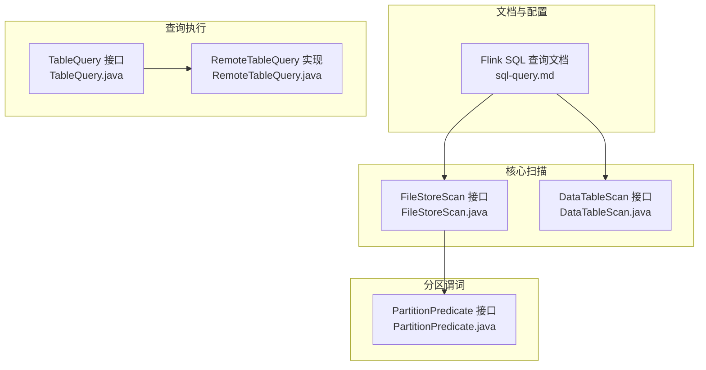
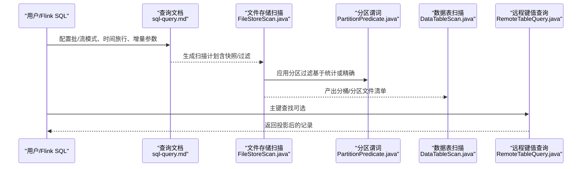
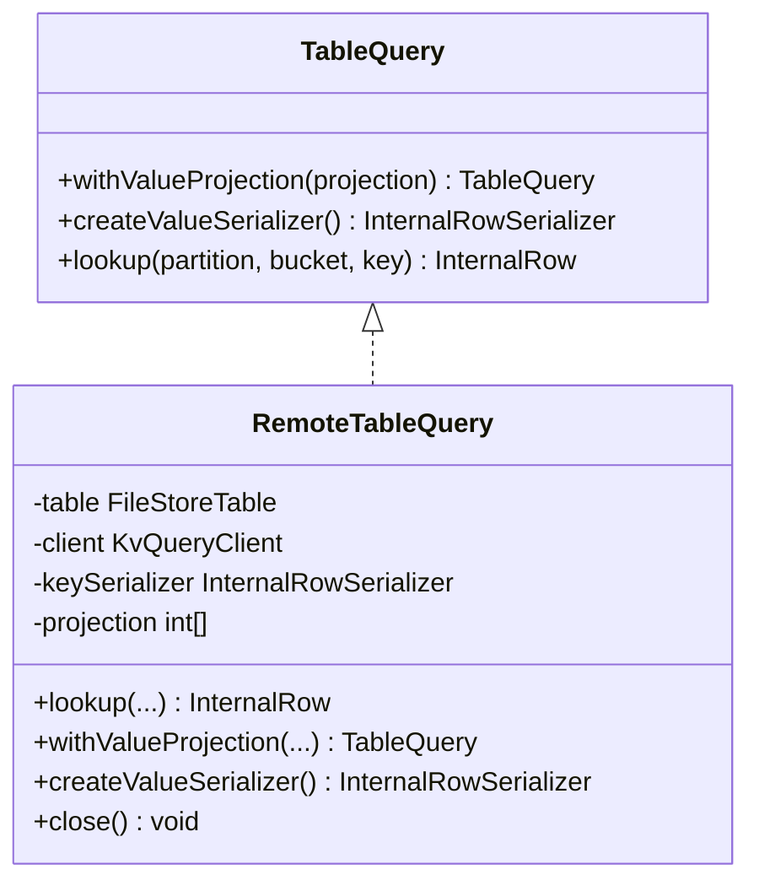
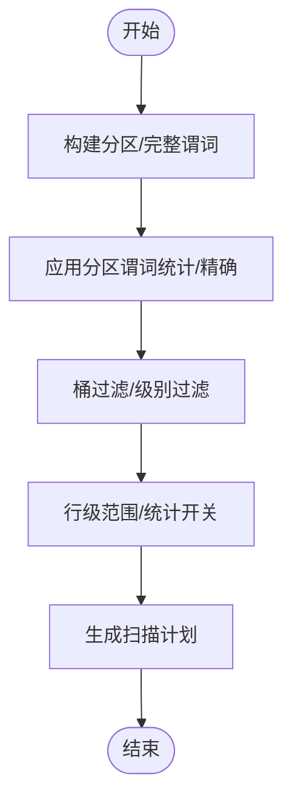
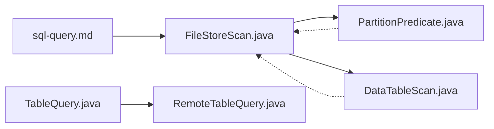

# 查询操作

<cite>
**本文引用的文件**
- [sql-query.md](file://docs/content/flink/sql-query.md)
- [TableQuery.java](file://paimon-core/src/main/java/org/apache/paimon/table/query/TableQuery.java)
- [RemoteTableQuery.java](file://paimon-flink/paimon-flink-common/src/main/java/org/apache/paimon/flink/query/RemoteTableQuery.java)
- [FileStoreScan.java](file://paimon-core/src/main/java/org/apache/paimon/operation/FileStoreScan.java)
- [DataTableScan.java](file://paimon-core/src/main/java/org/apache/paimon/table/source/DataTableScan.java)
- [PartitionPredicate.java](file://paimon-core/src/main/java/org/apache/paimon/partition/PartitionPredicate.java)
</cite>

## 目录
1. [简介](#简介)
2. [项目结构](#项目结构)
3. [核心组件](#核心组件)
4. [架构总览](#架构总览)
5. [组件详解](#组件详解)
6. [依赖关系分析](#依赖关系分析)
7. [性能考量](#性能考量)
8. [故障排查指南](#故障排查指南)
9. [结论](#结论)
10. [附录](#附录)

## 简介
本章节面向在 Apache Paimon 上进行 Flink 查询操作的用户与工程师，系统性地介绍 SELECT 语句的基础语法与高级特性，覆盖投影、过滤、排序、JOIN、聚合、窗口函数与时间属性、分区裁剪与谓词下推等主题。文档同时结合源码层面的关键接口与实现，给出可操作的查询模式、性能优化建议与最佳实践。

## 项目结构
围绕 Flink 查询能力，Paimon 在文档与核心实现中主要涉及以下模块：
- 文档层：Flink SQL 查询文档，涵盖批式与流式查询、时间旅行、增量读取、并行度控制与查询优化要点。
- 核心扫描层：文件存储扫描接口，支持分区过滤、桶过滤、快照选择、统计信息保留/丢弃、行级范围等。
- 表扫描层：数据表扫描接口，支持分片（shard）分配与子任务读取范围限定。
- 分区谓词层：专门用于分区过滤的谓词构建与测试，支持基于统计信息的快速命中判定。
- 远程查询层：远程键值查询客户端封装，支持投影裁剪与序列化器生成。

**图示来源**
- [sql-query.md:1-308](file://docs/content/flink/sql-query.md#L1-L308)
- [FileStoreScan.java:1-168](file://paimon-core/src/main/java/org/apache/paimon/operation/FileStoreScan.java#L1-L168)
- [DataTableScan.java:1-27](file://paimon-core/src/main/java/org/apache/paimon/table/source/DataTableScan.java#L1-L27)
- [PartitionPredicate.java:1-504](file://paimon-core/src/main/java/org/apache/paimon/partition/PartitionPredicate.java#L1-L504)
- [TableQuery.java:1-41](file://paimon-core/src/main/java/org/apache/paimon/table/query/TableQuery.java#L1-L41)
- [RemoteTableQuery.java:1-114](file://paimon-flink/paimon-flink-common/src/main/java/org/apache/paimon/flink/query/RemoteTableQuery.java#L1-L114)

**章节来源**
- [sql-query.md:1-308](file://docs/content/flink/sql-query.md#L1-L308)

## 核心组件
- 批式与流式查询：文档明确批式读取返回某快照全量数据；流式读取默认在首次启动时产出最新快照并持续读取变更；支持时间旅行与增量读取选项。
- 并行度与拆分：文档提供并行度推断与上限、自定义并行度等配置项，以平衡初始化时间与资源占用。
- 查询优化：强调通过分区与主键过滤加速数据跳过；列举可加速的过滤函数集合；说明复合主键左前缀匹配对点查与区间查的加速作用。
- 远程键值查询：接口定义了带投影的查找能力，实现类封装了远程服务发现、KV 客户端调用、序列化与结果投影。

**章节来源**
- [sql-query.md:27-308](file://docs/content/flink/sql-query.md#L27-L308)
- [TableQuery.java:30-40](file://paimon-core/src/main/java/org/apache/paimon/table/query/TableQuery.java#L30-L40)
- [RemoteTableQuery.java:44-113](file://paimon-flink/paimon-flink-common/src/main/java/org/apache/paimon/flink/query/RemoteTableQuery.java#L44-L113)

## 架构总览
下图展示从 Flink SQL 到 Paimon 文件存储扫描的整体链路，以及分区谓词与远程查询的集成点。

**图示来源**
- [sql-query.md:27-308](file://docs/content/flink/sql-query.md#L27-L308)
- [FileStoreScan.java:50-167](file://paimon-core/src/main/java/org/apache/paimon/operation/FileStoreScan.java#L50-L167)
- [PartitionPredicate.java:66-503](file://paimon-core/src/main/java/org/apache/paimon/partition/PartitionPredicate.java#L66-L503)
- [DataTableScan.java:22-26](file://paimon-core/src/main/java/org/apache/paimon/table/source/DataTableScan.java#L22-L26)
- [RemoteTableQuery.java:44-113](file://paimon-flink/paimon-flink-common/src/main/java/org/apache/paimon/flink/query/RemoteTableQuery.java#L44-L113)

## 组件详解

### 基础语法与运行模式
- 批式查询：默认读取最新快照；支持按快照 ID、时间戳、标签、水位线进行时间旅行读取；支持增量读取（快照区间、时间区间、自动标签到标签的增量）。
- 流式查询：默认首次启动产出最新快照并持续读取变更；支持仅读取最新变更（scan.mode='latest'）；流式时间旅行依赖快照或文件创建时间过滤。
- 并行度：支持推断并行度（基于拆分数或桶数）、最大并行度限制与自定义并行度；提供专用拆分生成以缓解长初始化与 OOM 风险。

**章节来源**
- [sql-query.md:31-308](file://docs/content/flink/sql-query.md#L31-L308)

### 投影、过滤与排序
- 投影：远程键值查询支持 value 投影裁剪，减少序列化与网络传输开销。
- 过滤：分区谓词支持基于统计信息的快速命中判定；文档列举可加速的过滤函数集合；复合主键左前缀匹配可显著提升点查与区间查性能。
- 排序：主键有序组织数据，有利于点查与区间查；建议查询过滤尽量落在主键左前缀上。

**图示来源**
- [TableQuery.java:30-40](file://paimon-core/src/main/java/org/apache/paimon/table/query/TableQuery.java#L30-L40)
- [RemoteTableQuery.java:44-113](file://paimon-flink/paimon-flink-common/src/main/java/org/apache/paimon/flink/query/RemoteTableQuery.java#L44-L113)

**章节来源**
- [RemoteTableQuery.java:44-113](file://paimon-flink/paimon-flink-common/src/main/java/org/apache/paimon/flink/query/RemoteTableQuery.java#L44-L113)
- [sql-query.md:242-291](file://docs/content/flink/sql-query.md#L242-L291)

### JOIN 操作
- 内连接：通过 Lookup Join 或广播/分区策略在 Flink 中实现，结合主键过滤可降低数据倾斜风险。
- 外连接：可借助 Paimon 的远程键值查询能力进行维表回放，注意处理缺失键与空值场景。
- 性能建议：优先在维表侧建立主键索引并启用分区裁剪；在事实表侧使用等值连接条件以提升命中率。

（本节为概念性说明，不直接分析具体文件）

### 聚合查询
- GROUP BY：建议将过滤条件尽可能前置到分区谓词与桶过滤，减少参与聚合的数据量。
- 聚合函数：结合主键有序与分区裁剪，可有效降低聚合计算复杂度；对于大表聚合，建议配合窗口与物化策略。

（本节为概念性说明，不直接分析具体文件）

### 窗口函数与时间属性
- 时间属性：利用事件时间/处理时间字段进行滚动/滑动窗口计算；结合 Paimon 的时间旅行与增量读取，可实现历史窗口重算与增量窗口推进。
- 窗口函数：建议在分区裁剪后进行窗口计算，避免不必要的全表扫描。

（本节为概念性说明，不直接分析具体文件）

### 分区裁剪与谓词下推
- 分区裁剪：通过分区谓词接口，将分区过滤提前至元数据阶段，避免扫描无关分区。
- 谓词下推：文件存储扫描接口提供完整谓词设置、桶过滤、级别过滤、行级范围与统计开关等能力，结合分区谓词可实现多层过滤优化。

**图示来源**
- [PartitionPredicate.java:88-126](file://paimon-core/src/main/java/org/apache/paimon/partition/PartitionPredicate.java#L88-L126)
- [FileStoreScan.java:52-102](file://paimon-core/src/main/java/org/apache/paimon/operation/FileStoreScan.java#L52-L102)

**章节来源**
- [PartitionPredicate.java:66-503](file://paimon-core/src/main/java/org/apache/paimon/partition/PartitionPredicate.java#L66-L503)
- [FileStoreScan.java:49-167](file://paimon-core/src/main/java/org/apache/paimon/operation/FileStoreScan.java#L49-L167)

### 实际查询示例与最佳实践
- 示例类型：批式时间旅行、流式时间旅行、增量读取、仅读最新、禁用快照保留等。
- 最佳实践：优先使用分区与主键过滤；合理设置并行度与拆分生成；在维表侧启用远程键值查询并进行 value 投影；对大表聚合与窗口计算进行分区裁剪与统计保留控制。

**章节来源**
- [sql-query.md:31-308](file://docs/content/flink/sql-query.md#L31-L308)
- [RemoteTableQuery.java:94-102](file://paimon-flink/paimon-flink-common/src/main/java/org/apache/paimon/flink/query/RemoteTableQuery.java#L94-L102)

## 依赖关系分析
- 查询文档驱动扫描配置：文档中的动态选项与语法直接影响扫描接口的调用方式（如快照选择、时间旅行、增量参数）。
- 扫描接口耦合：文件存储扫描接口提供丰富的过滤与统计开关，是实现分区裁剪与谓词下推的关键；数据表扫描接口负责将文件清单分配给子任务。
- 分区谓词独立于扫描实现：提供线程安全的分区过滤能力，既可用于精确匹配，也可用于统计快速判定。
- 远程查询作为可选执行路径：当存在可用远程服务时，主键查找可绕过全表扫描，显著降低延迟与带宽消耗。

**图示来源**
- [sql-query.md:27-308](file://docs/content/flink/sql-query.md#L27-L308)
- [FileStoreScan.java:49-167](file://paimon-core/src/main/java/org/apache/paimon/operation/FileStoreScan.java#L49-L167)
- [DataTableScan.java:22-26](file://paimon-core/src/main/java/org/apache/paimon/table/source/DataTableScan.java#L22-L26)
- [PartitionPredicate.java:66-503](file://paimon-core/src/main/java/org/apache/paimon/partition/PartitionPredicate.java#L66-L503)
- [TableQuery.java:30-40](file://paimon-core/src/main/java/org/apache/paimon/table/query/TableQuery.java#L30-L40)
- [RemoteTableQuery.java:44-113](file://paimon-flink/paimon-flink-common/src/main/java/org/apache/paimon/flink/query/RemoteTableQuery.java#L44-L113)

**章节来源**
- [sql-query.md:27-308](file://docs/content/flink/sql-query.md#L27-L308)
- [FileStoreScan.java:49-167](file://paimon-core/src/main/java/org/apache/paimon/operation/FileStoreScan.java#L49-L167)
- [DataTableScan.java:22-26](file://paimon-core/src/main/java/org/apache/paimon/table/source/DataTableScan.java#L22-L26)
- [PartitionPredicate.java:66-503](file://paimon-core/src/main/java/org/apache/paimon/partition/PartitionPredicate.java#L66-L503)
- [TableQuery.java:30-40](file://paimon-core/src/main/java/org/apache/paimon/table/query/TableQuery.java#L30-L40)
- [RemoteTableQuery.java:44-113](file://paimon-flink/paimon-flink-common/src/main/java/org/apache/paimon/flink/query/RemoteTableQuery.java#L44-L113)

## 性能考量
- 分区与主键过滤：优先使用分区与主键过滤，确保查询命中主键左前缀，以获得最佳点查与区间查性能。
- 并行度与拆分：根据数据规模与集群资源设置推断并行度上限与自定义并行度；在大规模快照场景下启用专用拆分生成以降低初始化成本。
- 统计与过滤：在扫描接口中合理开启/关闭统计信息，平衡过滤精度与元数据开销。
- 远程查询：在维表回放场景启用远程键值查询并进行 value 投影，减少序列化与网络传输。

（本节为通用指导，不直接分析具体文件）

## 故障排查指南
- 初始化耗时与 OOM：启用专用拆分生成并关注 DAG 变更与全局失败策略影响。
- 并行度异常：检查推断并行度上限与自定义并行度配置，必要时调整以适配作业拓扑。
- 时间旅行与增量读取：确认快照/标签/时间戳格式正确，避免因时间旅行范围不当导致的空结果或错误。
- 远程查询不可用：确认远程服务可用性检测逻辑与服务注册状态。

**章节来源**
- [sql-query.md:292-308](file://docs/content/flink/sql-query.md#L292-L308)
- [RemoteTableQuery.java:60-62](file://paimon-flink/paimon-flink-common/src/main/java/org/apache/paimon/flink/query/RemoteTableQuery.java#L60-L62)

## 结论
通过将 Flink SQL 查询与 Paimon 的文件存储扫描、分区谓词与远程键值查询相结合，可以在保证查询灵活性的同时实现高效的分区裁剪与谓词下推。遵循分区与主键过滤优先、合理设置并行度与统计开关、在维表侧启用远程查询与投影裁剪的最佳实践，可显著提升批式与流式查询的性能与稳定性。

## 附录
- 关键接口速览
  - 文件存储扫描：分区过滤、桶过滤、快照选择、统计开关、行级范围、读取类型等。
  - 数据表扫描：分片分配与子任务读取范围。
  - 分区谓词：基于统计与精确匹配的分区过滤。
  - 远程键值查询：主键查找、value 投影、序列化器生成。

**章节来源**
- [FileStoreScan.java:50-167](file://paimon-core/src/main/java/org/apache/paimon/operation/FileStoreScan.java#L50-L167)
- [DataTableScan.java:22-26](file://paimon-core/src/main/java/org/apache/paimon/table/source/DataTableScan.java#L22-L26)
- [PartitionPredicate.java:66-503](file://paimon-core/src/main/java/org/apache/paimon/partition/PartitionPredicate.java#L66-L503)
- [TableQuery.java:30-40](file://paimon-core/src/main/java/org/apache/paimon/table/query/TableQuery.java#L30-L40)
- [RemoteTableQuery.java:44-113](file://paimon-flink/paimon-flink-common/src/main/java/org/apache/paimon/flink/query/RemoteTableQuery.java#L44-L113)