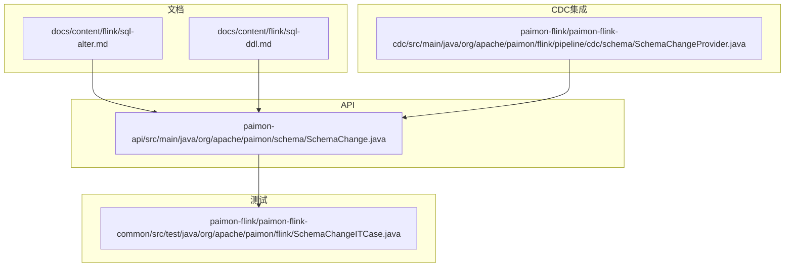
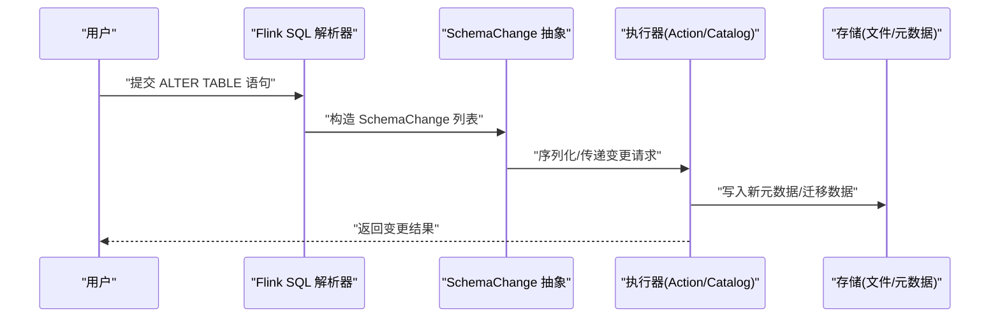
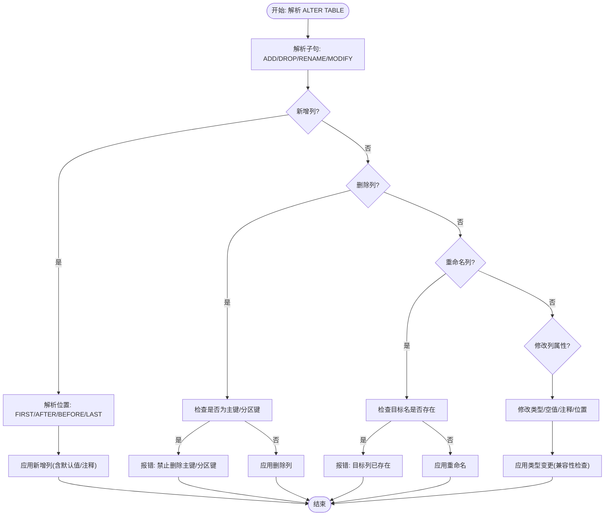
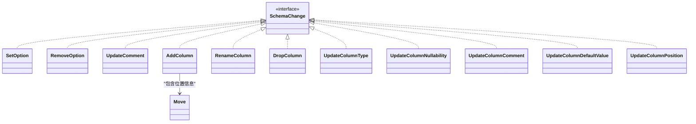
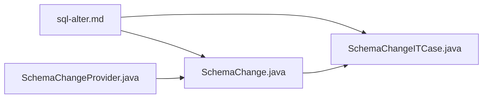

# 表结构变更

<cite>
**本文引用的文件**
- [sql-alter.md](file://docs/content/flink/sql-alter.md)
- [sql-ddl.md](file://docs/content/flink/sql-ddl.md)
- [SchemaChange.java](file://paimon-api/src/main/java/org/apache/paimon/schema/SchemaChange.java)
- [SchemaChangeITCase.java](file://paimon-flink/paimon-flink-common/src/test/java/org/apache/paimon/flink/SchemaChangeITCase.java)
- [SchemaChangeProvider.java](file://paimon-flink/paimon-flink-cdc/src/main/java/org/apache/paimon/flink/pipeline/cdc/schema/SchemaChangeProvider.java)
</cite>

## 目录
1. [简介](#简介)
2. [项目结构](#项目结构)
3. [核心组件](#核心组件)
4. [架构总览](#架构总览)
5. [详细组件分析](#详细组件分析)
6. [依赖分析](#依赖分析)
7. [性能考虑](#性能考虑)
8. [故障排查指南](#故障排查指南)
9. [结论](#结论)
10. [附录](#附录)

## 简介
本文件面向使用 Apache Paimon 的 Flink 用户，系统性梳理“表结构变更”能力与实践，覆盖 ALTER TABLE 的常见操作（新增/删除/重命名列、修改列类型与默认值、修改空值约束、修改列位置、水印管理）、分区字段的增删、主键约束的限制与校验、模式演进机制与限制、SQL 示例与注意事项、变更前数据备份与回滚策略，以及变更对查询性能的影响与优化建议。

## 项目结构
围绕 Flink 表结构变更，相关文档与实现主要分布在以下模块：
- 文档层：Flink 子目录下的 SQL 变更与 DDL 文档，提供 ALTER TABLE 的语法与行为说明
- API 层：SchemaChange 接口及其实现，定义结构变更的抽象与序列化契约
- 测试层：SchemaChangeITCase 提供丰富的 ALTER TABLE 行为验证用例
- CDC 集成层：SchemaChangeProvider 将 CDC 事件转换为 SchemaChange，支撑变更流场景

**图表来源**
- [sql-alter.md](file://docs/content/flink/sql-alter.md)
- [sql-ddl.md](file://docs/content/flink/sql-ddl.md)
- [SchemaChange.java](file://paimon-api/src/main/java/org/apache/paimon/schema/SchemaChange.java)
- [SchemaChangeITCase.java](file://paimon-flink/paimon-flink-common/src/test/java/org/apache/paimon/flink/SchemaChangeITCase.java)
- [SchemaChangeProvider.java](file://paimon-flink/paimon-flink-cdc/src/main/java/org/apache/paimon/flink/pipeline/cdc/schema/SchemaChangeProvider.java)

**章节来源**
- [sql-alter.md](file://docs/content/flink/sql-alter.md)
- [sql-ddl.md](file://docs/content/flink/sql-ddl.md)

## 核心组件
- SchemaChange 抽象与动作类型
  - 定义了表级选项、注释、列级新增、重命名、删除、类型更新、空值约束更新、注释更新、默认值更新、列位置更新等动作类型
  - 通过 JSON 序列化/反序列化传递到执行层，确保跨进程/服务的一致性
- Flink SQL ALTER TABLE 语法映射
  - 文档中列举了 ALTER TABLE 的常用子句：SET/RESET 表属性、RENAME 表名、ADD/DROP/Rename 列、MODIFY 类型/空值/注释/位置、水印的 ADD/DROP/MODIFY
- CDC 场景的 SchemaChangeProvider
  - 将 CDC 事件转换为 SchemaChange 列表，支持列新增（含默认值）、类型更新、重命名、删除等

**章节来源**
- [SchemaChange.java](file://paimon-api/src/main/java/org/apache/paimon/schema/SchemaChange.java)
- [sql-alter.md](file://docs/content/flink/sql-alter.md)
- [SchemaChangeProvider.java](file://paimon-flink/paimon-flink-cdc/src/main/java/org/apache/paimon/flink/pipeline/cdc/schema/SchemaChangeProvider.java)

## 架构总览
下图展示从 SQL 到执行层的结构变更路径：Flink SQL 解析器将 ALTER TABLE 语句解析为 SchemaChange 列表，随后由 Catalog/Action 执行具体变更；测试用例覆盖了大多数变更场景的行为验证。

**图表来源**
- [sql-alter.md](file://docs/content/flink/sql-alter.md)
- [SchemaChange.java](file://paimon-api/src/main/java/org/apache/paimon/schema/SchemaChange.java)

## 详细组件分析

### 列级结构变更（ADD/DROP/RENAME/MODIFY）
- 新增列
  - 支持单列或多列批量新增，可指定 FIRST/AFTER/BEFORE/LAST 位置
  - 默认值可通过表选项设置，或在 CDC 场景中由 SchemaChangeProvider 自动注入
- 删除列
  - 不允许删除被主键或分区键使用的列
  - 删除后，历史数据中的该列将不再可见，后续写入不会包含该列
- 重命名列
  - 目标列名不能已存在；不存在的列重命名会报错
- 修改列类型
  - 支持数值、字符串、时间戳、二进制等多种类型之间的转换，遵循兼容规则
  - 某些转换可能丢失精度或信息，需谨慎评估
- 修改空值约束
  - 从 NOT NULL 变更为 NULL：直接允许写入 NULL
  - 从 NULL 变更为 NOT NULL：需要保证现有数据满足非空，或通过配置/策略清理后再变更
- 修改列注释
  - 支持为已有列增加或更新注释
- 修改列位置
  - 支持将列移动到 FIRST/AFTER/BEFORE/LAST，自移动或目标列缺失会报错

**图表来源**
- [sql-alter.md](file://docs/content/flink/sql-alter.md)
- [SchemaChangeITCase.java](file://paimon-flink/paimon-flink-common/src/test/java/org/apache/paimon/flink/SchemaChangeITCase.java)

**章节来源**
- [sql-alter.md](file://docs/content/flink/sql-alter.md)
- [SchemaChangeITCase.java](file://paimon-flink/paimon-flink-common/src/test/java/org/apache/paimon/flink/SchemaChangeITCase.java)

### 分区字段的添加与删除
- 删除分区键：若列被用作分区键，则不允许删除
- 文档提供了分区删除的语法示例，支持按部分分区列指定多个分区值

**章节来源**
- [sql-alter.md](file://docs/content/flink/sql-alter.md)

### 主键约束的修改与验证
- 主键列不可删除
- 若列参与主键，删除该列会失败
- 测试用例覆盖了主键列删除的错误场景

**章节来源**
- [SchemaChangeITCase.java](file://paimon-flink/paimon-flink-common/src/test/java/org/apache/paimon/flink/SchemaChangeITCase.java)

### 模式演进机制与限制
- SchemaChange 动作类型覆盖了列级与表级的主要变更需求
- 兼容性检查贯穿类型变更、空值变更、位置变更等流程
- CDC 场景下，SchemaChangeProvider 将外部事件转换为 SchemaChange，保障变更一致性

**图表来源**
- [SchemaChange.java](file://paimon-api/src/main/java/org/apache/paimon/schema/SchemaChange.java)

**章节来源**
- [SchemaChange.java](file://paimon-api/src/main/java/org/apache/paimon/schema/SchemaChange.java)
- [SchemaChangeProvider.java](file://paimon-flink/paimon-flink-cdc/src/main/java/org/apache/paimon/flink/pipeline/cdc/schema/SchemaChangeProvider.java)

### SQL 示例与注意事项
- 表属性变更：SET/RESET
- 注释变更：表注释/列注释
- 列操作：新增、删除、重命名、修改类型/空值/注释/位置
- 水印：新增、删除、修改
- 分区：删除分区
- 注意事项：
  - Hive 兼容性：某些 Hive 版本需要关闭不兼容列类型变更限制
  - 对象存储重命名：非原子性，失败时仅部分文件移动
  - 主键/分区键列禁止删除
  - 修改列为空值约束时，需确保数据满足新约束

**章节来源**
- [sql-alter.md](file://docs/content/flink/sql-alter.md)
- [sql-ddl.md](file://docs/content/flink/sql-ddl.md)

### 备份与回滚策略
- 结构变更前建议：
  - 基于快照/分支进行备份（如仓库支持分支/标签），以便回滚
  - 对关键表进行全量导出或基于时间点的备份
- 回滚思路：
  - 使用分支/标签切换至变更前状态
  - 重新应用变更前的元数据（如可行）
- 注意：
  - 对象存储上的重命名不具备原子性，失败时需人工介入修复
  - 某些类型变更不可逆，应提前评估风险

**章节来源**
- [sql-alter.md](file://docs/content/flink/sql-alter.md)

## 依赖分析
- 文档与 API 的耦合
  - 文档中的 ALTER TABLE 语法与 SchemaChange 的动作类型一一对应
- 测试与实现的耦合
  - SchemaChangeITCase 覆盖了 ADD/DROP/RENAME/MODIFY 的典型场景，验证行为与错误处理
- CDC 集成
  - SchemaChangeProvider 将 CDC 事件映射为 SchemaChange，形成“变更流 → 元数据变更”的闭环

**图表来源**
- [sql-alter.md](file://docs/content/flink/sql-alter.md)
- [SchemaChange.java](file://paimon-api/src/main/java/org/apache/paimon/schema/SchemaChange.java)
- [SchemaChangeITCase.java](file://paimon-flink/paimon-flink-common/src/test/java/org/apache/paimon/flink/SchemaChangeITCase.java)
- [SchemaChangeProvider.java](file://paimon-flink/paimon-flink-cdc/src/main/java/org/apache/paimon/flink/pipeline/cdc/schema/SchemaChangeProvider.java)

**章节来源**
- [SchemaChangeITCase.java](file://paimon-flink/paimon-flink-common/src/test/java/org/apache/paimon/flink/SchemaChangeITCase.java)
- [SchemaChangeProvider.java](file://paimon-flink/paimon-flink-cdc/src/main/java/org/apache/paimon/flink/pipeline/cdc/schema/SchemaChangeProvider.java)

## 性能考虑
- 结构变更对查询性能的影响
  - 新增列通常不影响既有数据扫描，但后续写入会包含新列
  - 删除列会移除历史数据中的该列，查询时不再读取，可能减少 IO
  - 修改列类型/空值约束可能触发隐式数据转换或过滤，需关注转换成本
  - 水印变更影响事件时间处理与窗口计算
- 优化建议
  - 在低峰期执行结构变更，避免与大量写入/聚合作业冲突
  - 对大表的类型变更优先评估兼容性与数据量，必要时分批迁移
  - 合理设置统计收集策略以提升查询计划质量

[本节为通用指导，无需特定文件引用]

## 故障排查指南
- 常见错误与定位
  - 删除主键/分区键列：报错提示列被使用
  - 重命名目标列已存在：报错提示重复
  - 修改列为空值约束失败：检查现有数据是否满足新约束
  - Hive 不兼容列类型变更：根据文档调整 Hive 配置
- 建议排查步骤
  - 查看 ALTER TABLE 的具体子句与目标对象
  - 检查表的当前模式（DESC/SHOW CREATE TABLE）
  - 根据错误信息定位到 SchemaChangeITCase 中的对应用例，复现实例

**章节来源**
- [SchemaChangeITCase.java](file://paimon-flink/paimon-flink-common/src/test/java/org/apache/paimon/flink/SchemaChangeITCase.java)
- [sql-alter.md](file://docs/content/flink/sql-alter.md)

## 结论
Paimon 在 Flink 环境下提供了完善的表结构变更能力，覆盖列级与表级的常见需求，并通过 SchemaChange 抽象与测试用例保障行为一致性。实践中应重视主键/分区键保护、类型兼容性、空值约束变更的风险控制，结合备份与回滚策略，确保变更安全可控。

[本节为总结性内容，无需特定文件引用]

## 附录
- 相关文档与参考
  - ALTER TABLE 语法与示例：参见 [sql-alter.md](file://docs/content/flink/sql-alter.md)
  - DDL 与表属性：参见 [sql-ddl.md](file://docs/content/flink/sql-ddl.md)
  - API 定义与动作类型：参见 [SchemaChange.java](file://paimon-api/src/main/java/org/apache/paimon/schema/SchemaChange.java)
  - 行为验证用例：参见 [SchemaChangeITCase.java](file://paimon-flink/paimon-flink-common/src/test/java/org/apache/paimon/flink/SchemaChangeITCase.java)
  - CDC 场景映射：参见 [SchemaChangeProvider.java](file://paimon-flink/paimon-flink-cdc/src/main/java/org/apache/paimon/flink/pipeline/cdc/schema/SchemaChangeProvider.java)

[本节为补充说明，无需特定文件引用]