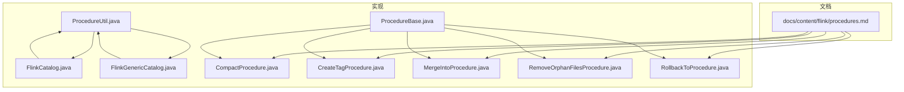
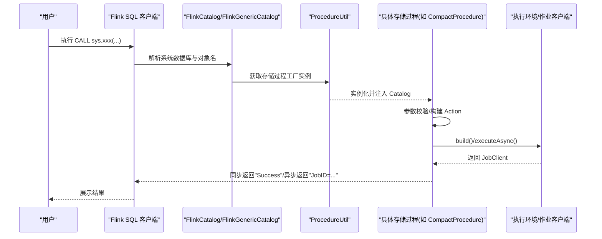
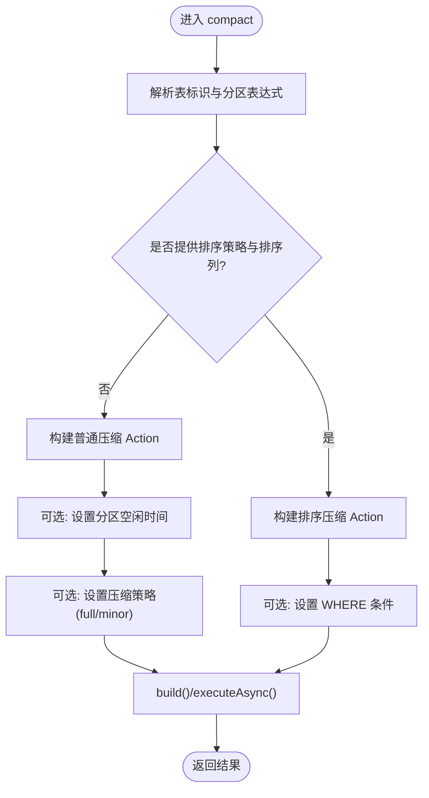
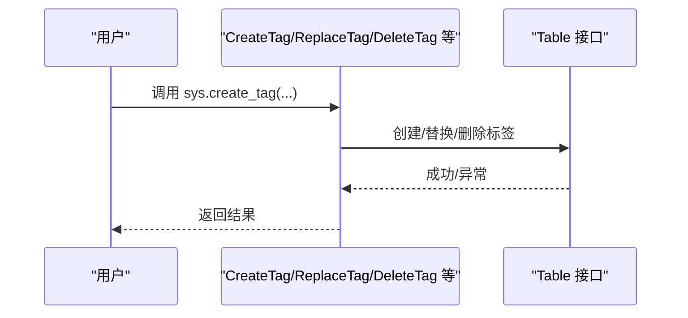
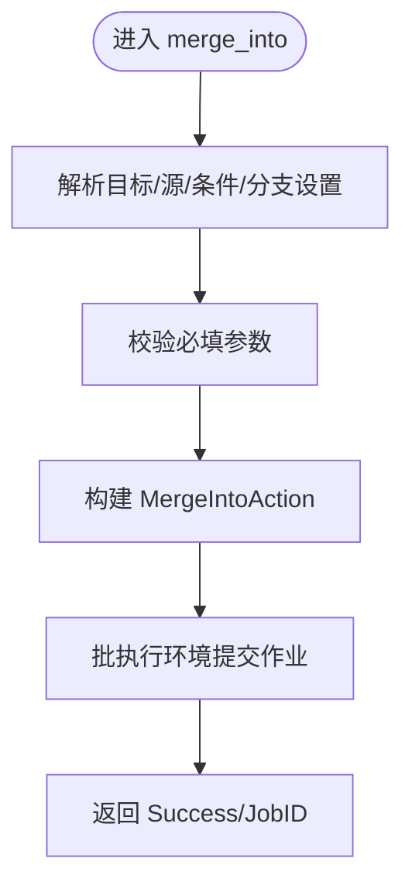
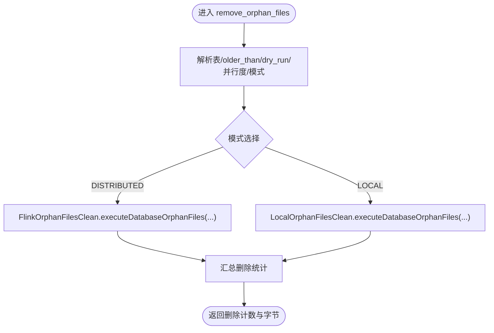
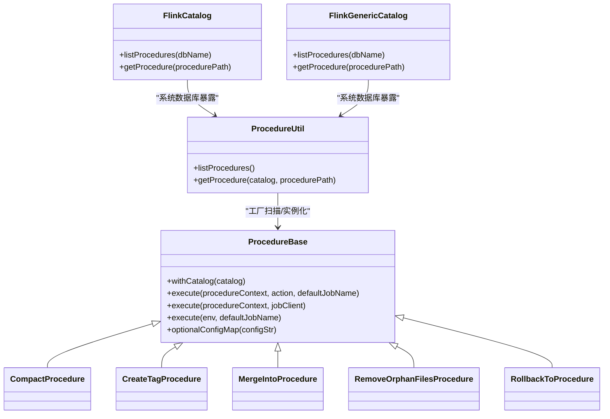

# 存储过程

<cite>
**本文引用的文件**
- [procedures.md](file://docs/content/flink/procedures.md)
- [CompactProcedure.java](file://paimon-flink/paimon-flink-1.18/src/main/java/org/apache/paimon/flink/procedure/CompactProcedure.java)
- [CreateTagProcedure.java](file://paimon-flink/paimon-flink-1.18/src/main/java/org/apache/paimon/flink/procedure/CreateTagProcedure.java)
- [MergeIntoProcedure.java](file://paimon-flink/paimon-flink-1.18/src/main/java/org/apache/paimon/flink/procedure/MergeIntoProcedure.java)
- [RemoveOrphanFilesProcedure.java](file://paimon-flink/paimon-flink-1.18/src/main/java/org/apache/paimon/flink/procedure/RemoveOrphanFilesProcedure.java)
- [RollbackToProcedure.java](file://paimon-flink/paimon-flink-1.18/src/main/java/org/apache/paimon/flink/procedure/RollbackToProcedure.java)
- [ProcedureBase.java](file://paimon-flink/paimon-flink-common/src/main/java/org/apache/paimon/flink/procedure/ProcedureBase.java)
- [ProcedureUtil.java](file://paimon-flink/paimon-flink-common/src/main/java/org/apache/paimon/flink/procedure/ProcedureUtil.java)
- [FlinkCatalog.java](file://paimon-flink/paimon-flink-common/src/main/java/org/apache/paimon/flink/FlinkCatalog.java)
- [FlinkGenericCatalog.java](file://paimon-flink/paimon-flink-common/src/main/java/org/apache/paimon/flink/FlinkGenericCatalog.java)
</cite>

## 目录
1. [简介](#简介)
2. [项目结构](#项目结构)
3. [核心组件](#核心组件)
4. [架构总览](#架构总览)
5. [详细组件分析](#详细组件分析)
6. [依赖关系分析](#依赖关系分析)
7. [性能考量](#性能考量)
8. [故障排除指南](#故障排除指南)
9. [结论](#结论)
10. [附录](#附录)

## 简介
本章节概述 Apache Paimon 在 Flink 中的“存储过程”能力：通过 SQL 的 CALL 语句直接对 Paimon 表进行数据与元数据管理，无需提交独立的批/流作业。从 Flink 1.18 起支持按位置传参；在更高版本中进一步支持按名称传参，允许以任意顺序省略可选参数。存储过程覆盖表压缩、标签与快照管理、回滚、孤儿文件清理、分支与标签操作、函数管理、向量检索等场景。

## 项目结构
围绕 Flink 存储过程的关键目录与文件如下：
- 文档：docs/content/flink/procedures.md 提供所有可用存储过程的清单、调用方式与参数说明
- 实现基类：ProcedureBase 提供统一的 Catalog 注入、执行环境与作业提交逻辑
- 工具类：ProcedureUtil 基于工厂机制发现并实例化系统命名空间下的存储过程
- Catalog 集成：FlinkCatalog 与 FlinkGenericCatalog 将系统数据库中的存储过程暴露给 Flink Catalog
- 具体存储过程：位于 paimon-flink-1.18 的 procedure 包中，如 CompactProcedure、CreateTagProcedure、MergeIntoProcedure、RemoveOrphanFilesProcedure、RollbackToProcedure 等

**图表来源**
- [procedures.md](file://docs/content/flink/procedures.md)
- [ProcedureBase.java](file://paimon-flink/paimon-flink-common/src/main/java/org/apache/paimon/flink/procedure/ProcedureBase.java)
- [ProcedureUtil.java](file://paimon-flink/paimon-flink-common/src/main/java/org/apache/paimon/flink/procedure/ProcedureUtil.java)
- [FlinkCatalog.java](file://paimon-flink/paimon-flink-common/src/main/java/org/apache/paimon/flink/FlinkCatalog.java)
- [FlinkGenericCatalog.java](file://paimon-flink/paimon-flink-common/src/main/java/org/apache/paimon/flink/FlinkGenericCatalog.java)
- [CompactProcedure.java](file://paimon-flink/paimon-flink-1.18/src/main/java/org/apache/paimon/flink/procedure/CompactProcedure.java)
- [CreateTagProcedure.java](file://paimon-flink/paimon-flink-1.18/src/main/java/org/apache/paimon/flink/procedure/CreateTagProcedure.java)
- [MergeIntoProcedure.java](file://paimon-flink/paimon-flink-1.18/src/main/java/org/apache/paimon/flink/procedure/MergeIntoProcedure.java)
- [RemoveOrphanFilesProcedure.java](file://paimon-flink/paimon-flink-1.18/src/main/java/org/apache/paimon/flink/procedure/RemoveOrphanFilesProcedure.java)
- [RollbackToProcedure.java](file://paimon-flink/paimon-flink-1.18/src/main/java/org/apache/paimon/flink/procedure/RollbackToProcedure.java)

**章节来源**
- [procedures.md](file://docs/content/flink/procedures.md)
- [ProcedureBase.java](file://paimon-flink/paimon-flink-common/src/main/java/org/apache/paimon/flink/procedure/ProcedureBase.java)
- [ProcedureUtil.java](file://paimon-flink/paimon-flink-common/src/main/java/org/apache/paimon/flink/procedure/ProcedureUtil.java)
- [FlinkCatalog.java](file://paimon-flink/paimon-flink-common/src/main/java/org/apache/paimon/flink/FlinkCatalog.java)
- [FlinkGenericCatalog.java](file://paimon-flink/paimon-flink-common/src/main/java/org/apache/paimon/flink/FlinkGenericCatalog.java)

## 核心组件
- 存储过程基类：ProcedureBase
  - 提供 Catalog 注入、表解析、空值处理、作业执行（同步/异步）等通用能力
  - 统一返回值格式：同步模式返回“Success”，异步模式返回“JobID=...”
- 存储过程工具：ProcedureUtil
  - 基于工厂扫描系统命名空间下的所有存储过程标识符
  - 按对象路径解析并实例化具体存储过程，注入 Catalog
- Catalog 集成：FlinkCatalog 与 FlinkGenericCatalog
  - 将系统数据库中的存储过程暴露给 Flink Catalog，供 SQL 调用
  - 支持列出与获取系统命名空间下的存储过程

**章节来源**
- [ProcedureBase.java](file://paimon-flink/paimon-flink-common/src/main/java/org/apache/paimon/flink/procedure/ProcedureBase.java)
- [ProcedureUtil.java](file://paimon-flink/paimon-flink-common/src/main/java/org/apache/paimon/flink/procedure/ProcedureUtil.java)
- [FlinkCatalog.java](file://paimon-flink/paimon-flink-common/src/main/java/org/apache/paimon/flink/FlinkCatalog.java)
- [FlinkGenericCatalog.java](file://paimon-flink/paimon-flink-common/src/main/java/org/apache/paimon/flink/FlinkGenericCatalog.java)

## 架构总览
下图展示从 SQL 调用到具体存储过程执行的整体流程：

**图表来源**
- [FlinkCatalog.java](file://paimon-flink/paimon-flink-common/src/main/java/org/apache/paimon/flink/FlinkCatalog.java)
- [FlinkGenericCatalog.java](file://paimon-flink/paimon-flink-common/src/main/java/org/apache/paimon/flink/FlinkGenericCatalog.java)
- [ProcedureUtil.java](file://paimon-flink/paimon-flink-common/src/main/java/org/apache/paimon/flink/procedure/ProcedureUtil.java)
- [ProcedureBase.java](file://paimon-flink/paimon-flink-common/src/main/java/org/apache/paimon/flink/procedure/ProcedureBase.java)
- [CompactProcedure.java](file://paimon-flink/paimon-flink-1.18/src/main/java/org/apache/paimon/flink/procedure/CompactProcedure.java)

## 详细组件分析

### 表压缩存储过程：compact
- 功能：对指定表或分区进行压缩，支持排序策略与全量/小合并策略
- 参数要点
  - 表标识、分区过滤、排序策略与排序列、附加表选项、WHERE 条件、分区空闲时间、压缩策略
  - 1.18 版本仅支持按位置传参；高版本支持按名称传参且可省略可选参数
- 处理逻辑
  - 解析表标识与分区表达式
  - 根据是否提供排序策略决定使用普通压缩还是排序压缩
  - 可选设置分区空闲时间与压缩策略
  - 通过 Action 构建并提交作业，返回执行结果

**图表来源**
- [CompactProcedure.java](file://paimon-flink/paimon-flink-1.18/src/main/java/org/apache/paimon/flink/procedure/CompactProcedure.java)
- [ProcedureBase.java](file://paimon-flink/paimon-flink-common/src/main/java/org/apache/paimon/flink/procedure/ProcedureBase.java)

**章节来源**
- [procedures.md](file://docs/content/flink/procedures.md)
- [CompactProcedure.java](file://paimon-flink/paimon-flink-1.18/src/main/java/org/apache/paimon/flink/procedure/CompactProcedure.java)

### 标签管理存储过程：create_tag / create_tag_from_timestamp / create_tag_from_watermark / replace_tag / delete_tag / expire_tags / trigger_tag_automatic_creation
- 功能：基于快照、时间戳或水位线创建/替换/删除/过期标签，触发自动标签创建
- 参数要点
  - 表标识、标签名、快照 ID、时间保留时长、时间戳/水位线、过滤条件等
- 处理逻辑
  - 解析表标识，调用 Table 的标签相关接口完成标签生命周期管理
  - replace_tag 支持更新快照 ID 与时间保留时长
  - expire_tags 支持按时间阈值批量过期

**图表来源**
- [CreateTagProcedure.java](file://paimon-flink/paimon-flink-1.18/src/main/java/org/apache/paimon/flink/procedure/CreateTagProcedure.java)
- [procedures.md](file://docs/content/flink/procedures.md)

**章节来源**
- [procedures.md](file://docs/content/flink/procedures.md)
- [CreateTagProcedure.java](file://paimon-flink/paimon-flink-1.18/src/main/java/org/apache/paimon/flink/procedure/CreateTagProcedure.java)

### 数据写入与合并：merge_into / data_evolution_merge_into
- 功能：执行 MERGE INTO 语义，支持匹配 Upsert、不匹配 Insert、匹配 Delete 等分支
- 参数要点
  - 目标表与别名、源 SQL 列表/表、合并条件、匹配 Upsert 条件与设置、不匹配 Insert 条件与值、匹配 Delete 条件
  - 高版本支持按名称传参，参数顺序可变
- 处理逻辑
  - 构建 MergeIntoAction，校验并组装各分支条件
  - 强制使用批执行环境，提交作业并返回结果

**图表来源**
- [MergeIntoProcedure.java](file://paimon-flink/paimon-flink-1.18/src/main/java/org/apache/paimon/flink/procedure/MergeIntoProcedure.java)
- [ProcedureBase.java](file://paimon-flink/paimon-flink-common/src/main/java/org/apache/paimon/flink/procedure/ProcedureBase.java)

**章节来源**
- [procedures.md](file://docs/content/flink/procedures.md)
- [MergeIntoProcedure.java](file://paimon-flink/paimon-flink-1.18/src/main/java/org/apache/paimon/flink/procedure/MergeIntoProcedure.java)

### 元数据与文件清理：remove_orphan_files / remove_unexisting_files / remove_unexisting_manifests
- 功能：清理孤儿文件、无效文件与无效清单
- 参数要点
  - 表标识、older_than、dry_run、并行度、模式（分布式/本地）
- 处理逻辑
  - 支持数据库级通配符清理
  - 分布式模式通过 Flink Orphan 清理器执行，本地模式通过本地清理器执行
  - 返回删除数量与字节数统计

**图表来源**
- [RemoveOrphanFilesProcedure.java](file://paimon-flink/paimon-flink-1.18/src/main/java/org/apache/paimon/flink/procedure/RemoveOrphanFilesProcedure.java)
- [ProcedureBase.java](file://paimon-flink/paimon-flink-common/src/main/java/org/apache/paimon/flink/procedure/ProcedureBase.java)

**章节来源**
- [procedures.md](file://docs/content/flink/procedures.md)
- [RemoveOrphanFilesProcedure.java](file://paimon-flink/paimon-flink-1.18/src/main/java/org/apache/paimon/flink/procedure/RemoveOrphanFilesProcedure.java)

### 回滚与时间点恢复：rollback_to / rollback_to_timestamp / rollback_to_watermark / purge_files
- 功能：将表回滚到指定快照、标签或时间点，或清空并删除文件
- 参数要点
  - 表标识、快照 ID、标签名、时间戳/水位线
- 处理逻辑
  - 直接调用 Table 的回滚接口，成功后返回“Success”

**章节来源**
- [procedures.md](file://docs/content/flink/procedures.md)
- [RollbackToProcedure.java](file://paimon-flink/paimon-flink-1.18/src/main/java/org/apache/paimon/flink/procedure/RollbackToProcedure.java)

### 其他常用存储过程
- 数据库压缩：compact_database（支持模式、包含/排除表、表选项、空闲分区全量压缩策略）
- 迁移：migrate_database/migrate_table/migrate_iceberg_table（连接器类型、源数据库/表、选项、并行度）
- 快照与变更日志过期：expire_snapshots/expire_changelogs
- 分区过期：expire_partitions
- 修复：repair（同步文件系统与元数据）
- 文件索引重写：rewrite_file_index
- 分支：create_branch/delete_branch/rename_branch/fast_forward
- Manifest 压缩：compact_manifest
- 分桶重分布：rescale
- 视图方言：alter_view_dialect
- 函数：create_function/alter_function/drop_function
- 向量检索：vector_search

以上均在文档中给出参数与示例，具体实现由对应存储过程类与 Action 组合完成。

**章节来源**
- [procedures.md](file://docs/content/flink/procedures.md)

## 依赖关系分析
- 存储过程与 Catalog 的耦合
  - ProcedureUtil 通过工厂扫描系统命名空间下的存储过程标识符
  - FlinkCatalog/FlinkGenericCatalog 将系统数据库中的存储过程暴露给 Flink Catalog
- 存储过程与执行环境
  - ProcedureBase 统一封装了作业构建与提交逻辑，支持同步等待与异步返回
- 存储过程与业务 Action
  - 各存储过程内部通过相应 Action（如 CompactAction、MergeIntoAction 等）完成实际操作

**图表来源**
- [ProcedureBase.java](file://paimon-flink/paimon-flink-common/src/main/java/org/apache/paimon/flink/procedure/ProcedureBase.java)
- [ProcedureUtil.java](file://paimon-flink/paimon-flink-common/src/main/java/org/apache/paimon/flink/procedure/ProcedureUtil.java)
- [FlinkCatalog.java](file://paimon-flink/paimon-flink-common/src/main/java/org/apache/paimon/flink/FlinkCatalog.java)
- [FlinkGenericCatalog.java](file://paimon-flink/paimon-flink-common/src/main/java/org/apache/paimon/flink/FlinkGenericCatalog.java)
- [CompactProcedure.java](file://paimon-flink/paimon-flink-1.18/src/main/java/org/apache/paimon/flink/procedure/CompactProcedure.java)
- [CreateTagProcedure.java](file://paimon-flink/paimon-flink-1.18/src/main/java/org/apache/paimon/flink/procedure/CreateTagProcedure.java)
- [MergeIntoProcedure.java](file://paimon-flink/paimon-flink-1.18/src/main/java/org/apache/paimon/flink/procedure/MergeIntoProcedure.java)
- [RemoveOrphanFilesProcedure.java](file://paimon-flink/paimon-flink-1.18/src/main/java/org/apache/paimon/flink/procedure/RemoveOrphanFilesProcedure.java)
- [RollbackToProcedure.java](file://paimon-flink/paimon-flink-1.18/src/main/java/org/apache/paimon/flink/procedure/RollbackToProcedure.java)

**章节来源**
- [ProcedureBase.java](file://paimon-flink/paimon-flink-common/src/main/java/org/apache/paimon/flink/procedure/ProcedureBase.java)
- [ProcedureUtil.java](file://paimon-flink/paimon-flink-common/src/main/java/org/apache/paimon/flink/procedure/ProcedureUtil.java)
- [FlinkCatalog.java](file://paimon-flink/paimon-flink-common/src/main/java/org/apache/paimon/flink/FlinkCatalog.java)
- [FlinkGenericCatalog.java](file://paimon-flink/paimon-flink-common/src/main/java/org/apache/paimon/flink/FlinkGenericCatalog.java)

## 性能考量
- 并行度与资源
  - 多数存储过程支持通过 options 或参数设置并行度（如 sink 并行度），合理设置可提升吞吐
- 执行模式
  - 同步模式会阻塞直到作业完成，适合交互式调试；异步模式返回 JobID，适合自动化调度
- 压缩策略
  - 全量压缩适合离线维护窗口，小合并压缩适合在线场景；排序压缩会引入额外排序成本
- 清理策略
  - 孤儿文件清理支持 dry_run 与分布式/本地两种模式，结合 older_than 控制安全范围
- I/O 与存储
  - 大规模清理与迁移建议在稳定网络与存储条件下执行，并评估并发度对存储系统的压力

[本节为通用指导，无需特定文件来源]

## 故障排除指南
- 常见错误与定位
  - 参数缺失：如 merge_into 缺少必要分支设置会抛出参数校验异常
  - 不支持的组合：排序压缩与分区空闲时间不可同时使用
  - 未知模式：孤儿文件清理模式必须为 DISTRIBUTED 或 LOCAL
- 调试建议
  - 使用 dry_run 模式先验证清理范围
  - 在同步模式下等待作业完成，便于快速定位失败原因
  - 查看作业日志与 JobID，结合存储过程返回信息定位问题
- 权限与安全
  - 确保存储过程调用者具备对目标表的读写与元数据操作权限
  - 对涉及大规模数据变更的操作（如 purge_files、全量压缩）应谨慎授权与审计

**章节来源**
- [MergeIntoProcedure.java](file://paimon-flink/paimon-flink-1.18/src/main/java/org/apache/paimon/flink/procedure/MergeIntoProcedure.java)
- [RemoveOrphanFilesProcedure.java](file://paimon-flink/paimon-flink-1.18/src/main/java/org/apache/paimon/flink/procedure/RemoveOrphanFilesProcedure.java)
- [ProcedureBase.java](file://paimon-flink/paimon-flink-common/src/main/java/org/apache/paimon/flink/procedure/ProcedureBase.java)

## 结论
Paimon 的 Flink 存储过程将复杂的数据与元数据管理封装为简洁的 SQL 调用，配合工厂机制与 Catalog 集成，实现了即插即用的能力扩展。通过统一的基类与工具类，开发者可以快速实现新的存储过程，满足不同运维与治理场景的需求。

[本节为总结性内容，无需特定文件来源]

## 附录
- 调用语法与参数速查
  - 1.18 版本：仅支持按位置传参，需用空字符串占位可选参数
  - 高版本：支持按名称传参，参数顺序可变，可省略可选参数
  - 分区过滤：逗号表示 AND，分号表示 OR
  - 表选项：逗号分隔的键值对字符串
- 最佳实践
  - 在生产环境优先使用命名参数与 dry_run 验证
  - 合理设置并行度与超时时间，避免长时间占用资源
  - 对关键操作（回滚、清理、迁移）建立变更审批与回溯机制

**章节来源**
- [procedures.md](file://docs/content/flink/procedures.md)