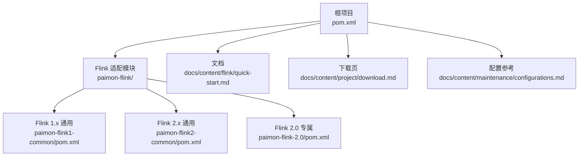
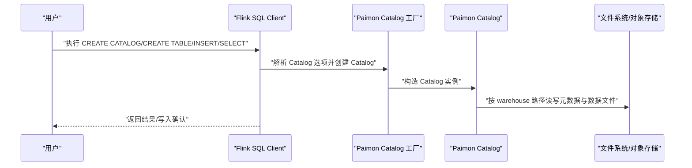
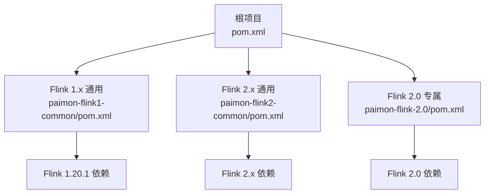

# 快速开始

<cite>
**本文引用的文件**
- [quick-start.md](file://docs/content/flink/quick-start.md)
- [download.md](file://docs/content/project/download.md)
- [sql-ddl.md](file://docs/content/flink/sql-ddl.md)
- [sql-query.md](file://docs/content/flink/sql-query.md)
- [sql-write.md](file://docs/content/flink/sql-write.md)
- [FlinkCatalogFactory.java](file://paimon-flink/paimon-flink-common/src/main/java/org/apache/paimon/flink/FlinkCatalogFactory.java)
- [FlinkGenericCatalogFactory.java](file://paimon-flink/paimon-flink-common/src/main/java/org/apache/paimon/flink/FlinkGenericCatalogFactory.java)
- [FlinkGenericCatalog.java](file://paimon-flink/paimon-flink-common/src/main/java/org/apache/paimon/flink/FlinkGenericCatalog.java)
- [pom.xml](file://pom.xml)
- [paimon-flink-2.0/pom.xml](file://paimon-flink/paimon-flink-2.0/pom.xml)
- [paimon-flink1-common/pom.xml](file://paimon-flink/paimon-flink1-common/pom.xml)
- [paimon-flink2-common/pom.xml](file://paimon-flink/paimon-flink2-common/pom.xml)
- [configurations.md](file://docs/content/maintenance/configurations.md)
</cite>

## 目录
1. [简介](#简介)
2. [项目结构](#项目结构)
3. [核心组件](#核心组件)
4. [架构总览](#架构总览)
5. [详细组件分析](#详细组件分析)
6. [依赖分析](#依赖分析)
7. [性能考虑](#性能考虑)
8. [故障排除指南](#故障排除指南)
9. [结论](#结论)
10. [附录](#附录)

## 简介
本“快速开始”面向首次在 Apache Flink 中使用 Paimon 的用户，提供从环境准备、JAR 下载与放置、Flink 集群启动、Paimon Catalog 创建与使用、第一个 Flink SQL 示例（建表、写入、查询）到常见初始化步骤与配置参数说明的完整流程。同时给出故障排除建议，帮助你顺利完成本地或单机集群的首次体验。

## 项目结构
本仓库包含多引擎适配模块（Flink、Spark、Hive 等），以及文档与测试模块。与 Flink 快速开始直接相关的文档位于 docs/content/flink 目录；Flink 适配层代码位于 paimon-flink 模块中；版本与依赖信息可在根 pom.xml 与各子模块 pom.xml 中查看。

图表来源
- [pom.xml:54-78](file://pom.xml#L54-L78)
- [paimon-flink1-common/pom.xml:35-82](file://paimon-flink/paimon-flink1-common/pom.xml#L35-L82)
- [paimon-flink2-common/pom.xml:35-82](file://paimon-flink/paimon-flink2-common/pom.xml#L35-L82)
- [paimon-flink-2.0/pom.xml:36-66](file://paimon-flink/paimon-flink-2.0/pom.xml#L36-L66)
- [quick-start.md:77-129](file://docs/content/flink/quick-start.md#L77-L129)
- [download.md:31-84](file://docs/content/project/download.md#L31-L84)
- [configurations.md:27-92](file://docs/content/maintenance/configurations.md#L27-L92)

章节来源
- [pom.xml:54-78](file://pom.xml#L54-L78)
- [quick-start.md:77-129](file://docs/content/flink/quick-start.md#L77-L129)
- [download.md:31-84](file://docs/content/project/download.md#L31-L84)

## 核心组件
- Paimon Flink Catalog 工厂：负责根据 Catalog 选项创建 Paimon Catalog 实例，支持默认数据库等配置。
- Paimon Generic Catalog 工厂：在已有 Hive Catalog 基础上，统一加载 Paimon 表与非 Paimon 表（如 Kafka 等），实现“通用 Catalog”能力。
- Flink SQL 文档：涵盖 DDL（建库建表）、写入（INSERT/覆盖/更新/删除）、查询（批/流/时间旅行）等关键主题。
- 版本与依赖：根 pom 定义了默认 Flink 主版本与测试版本，各子模块声明了与具体 Flink 版本对应的依赖。

章节来源
- [FlinkCatalogFactory.java:32-77](file://paimon-flink/paimon-flink-common/src/main/java/org/apache/paimon/flink/FlinkCatalogFactory.java#L32-L77)
- [FlinkGenericCatalogFactory.java:40-107](file://paimon-flink/paimon-flink-common/src/main/java/org/apache/paimon/flink/FlinkGenericCatalogFactory.java#L40-L107)
- [FlinkGenericCatalog.java:60-103](file://paimon-flink/paimon-flink-common/src/main/java/org/apache/paimon/flink/FlinkGenericCatalog.java#L60-L103)
- [sql-ddl.md:29-152](file://docs/content/flink/sql-ddl.md#L29-L152)
- [sql-write.md:29-143](file://docs/content/flink/sql-write.md#L29-L143)
- [sql-query.md:29-141](file://docs/content/flink/sql-query.md#L29-L141)
- [pom.xml:90-96](file://pom.xml#L90-L96)

## 架构总览
下图展示了从用户在 Flink SQL Client 执行命令到 Paimon Catalog 加载与表读写的整体流程。

图表来源
- [FlinkCatalogFactory.java:52-77](file://paimon-flink/paimon-flink-common/src/main/java/org/apache/paimon/flink/FlinkCatalogFactory.java#L52-L77)
- [quick-start.md:130-188](file://docs/content/flink/quick-start.md#L130-L188)

章节来源
- [quick-start.md:130-188](file://docs/content/flink/quick-start.md#L130-L188)
- [FlinkCatalogFactory.java:52-77](file://paimon-flink/paimon-flink-common/src/main/java/org/apache/paimon/flink/FlinkCatalogFactory.java#L52-L77)

## 详细组件分析

### 环境准备与 JAR 下载
- 支持的 Flink 版本：2.2、2.1、2.0、1.20、1.19、1.18、1.17、1.16。推荐使用最新稳定版以获得最佳体验。
- 下载两类 JAR：
  - Bundled Jar：用于数据读写。
  - Action Jar：用于手动执行如合并等运维操作。
- 可通过 Maven 构建或从官方仓库下载对应版本 JAR。
- 若运行环境为 Hadoop 环境，请确保 HADOOP_CLASSPATH 包含 Hadoop 库，或复制预打包 Hadoop JAR 到 Flink lib 目录。

章节来源
- [quick-start.md:31-106](file://docs/content/flink/quick-start.md#L31-L106)
- [download.md:31-84](file://docs/content/project/download.md#L31-L84)

### 启动本地 Flink 集群
- 解压 Flink 并将 Paimon Bundled Jar 与可选的 Hadoop 预打包 JAR 复制到 Flink lib 目录。
- 修改 flink-conf.yaml（Flink < 1.19）或 config.yaml（Flink ≥ 1.19）中的任务槽位数等配置。
- 启动集群并通过 Web UI 检查状态。
- 使用 Flink SQL Client 连接执行脚本。

章节来源
- [quick-start.md:77-129](file://docs/content/flink/quick-start.md#L77-L129)

### Paimon Catalog 配置（Catalog 与 Generic-Catalog）
- Catalog 模式
  - 使用类型为 paimon 的 Catalog，设置仓库路径（本地或共享文件系统/对象存储）。
  - 在 Catalog 下创建主键表（Primary Key Table）进行写入与查询。
- Generic-Catalog 模式
  - 类型为 paimon-generic，需要 Hive 元存储配合。
  - 在该模式下，表需通过 WITH 子句指定 connector=paimon。
  - 注意：Hive 元存储的 warehouse 路径应带协议前缀（如 hdfs://...），否则可能回退到本地路径。

章节来源
- [quick-start.md:130-188](file://docs/content/flink/quick-start.md#L130-L188)
- [sql-ddl.md:39-88](file://docs/content/flink/sql-ddl.md#L39-L88)

### 第一个 Flink SQL 示例：建表、写入与查询
- 建表
  - 在 Catalog 下创建主键表（示例中包含 word 字段与计数字段）。
- 写入
  - 使用 datagen 临时表生成测试数据。
  - 流式写入时需设置检查点间隔。
- 批式查询
  - 设置运行模式为 batch，执行 SELECT 查询。
- 流式查询
  - 设置运行模式为 streaming，观察变更流统计。

章节来源
- [quick-start.md:130-233](file://docs/content/flink/quick-start.md#L130-L233)
- [sql-write.md:39-49](file://docs/content/flink/sql-write.md#L39-L49)
- [sql-query.md:31-141](file://docs/content/flink/sql-query.md#L31-L141)

### 动态选项与内存管理
- 动态选项
  - 支持在会话级别为特定表或全局设置扫描/写入参数，优先级为：表级动态选项 > 全局动态选项。
- Flink 管理内存
  - 可启用 Flink 管理的内存分配器，提升 Sink 性能与稳定性，并通过权重参数控制 Writer 缓冲大小。

章节来源
- [quick-start.md:252-298](file://docs/content/flink/quick-start.md#L252-L298)
- [sql-query.md:198-236](file://docs/content/flink/sql-query.md#L198-L236)

### Catalog 工厂与通用 Catalog
- Catalog 工厂
  - 通过工厂类识别标识符 paimon，创建 Catalog 实例并注入默认数据库与选项。
- 通用 Catalog
  - 在现有 Hive Catalog 基础上，组合 Paimon Catalog，使同一 Catalog 下可访问 Paimon 表与非 Paimon 表（如 Kafka）。

章节来源
- [FlinkCatalogFactory.java:32-77](file://paimon-flink/paimon-flink-common/src/main/java/org/apache/paimon/flink/FlinkCatalogFactory.java#L32-L77)
- [FlinkGenericCatalogFactory.java:40-107](file://paimon-flink/paimon-flink-common/src/main/java/org/apache/paimon/flink/FlinkGenericCatalogFactory.java#L40-L107)
- [FlinkGenericCatalog.java:60-103](file://paimon-flink/paimon-flink-common/src/main/java/org/apache/paimon/flink/FlinkGenericCatalog.java#L60-L103)

### Flink 版本与依赖
- 根 pom 定义了默认 Flink 主版本与测试版本，便于统一管理。
- 各 Flink 适配模块（1.x/2.x/2.0）分别声明了与具体 Flink 版本匹配的依赖。

章节来源
- [pom.xml:90-96](file://pom.xml#L90-L96)
- [paimon-flink1-common/pom.xml:35-82](file://paimon-flink/paimon-flink1-common/pom.xml#L35-L82)
- [paimon-flink2-common/pom.xml:35-82](file://paimon-flink/paimon-flink2-common/pom.xml#L35-L82)
- [paimon-flink-2.0/pom.xml:36-66](file://paimon-flink/paimon-flink-2.0/pom.xml#L36-L66)

## 依赖分析
下图展示 Flink 与 Paimon 适配模块之间的依赖关系与版本映射。

图表来源
- [pom.xml:90-96](file://pom.xml#L90-L96)
- [paimon-flink1-common/pom.xml:35-82](file://paimon-flink/paimon-flink1-common/pom.xml#L35-L82)
- [paimon-flink2-common/pom.xml:35-82](file://paimon-flink/paimon-flink2-common/pom.xml#L35-L82)
- [paimon-flink-2.0/pom.xml:36-66](file://paimon-flink/paimon-flink-2.0/pom.xml#L36-L66)

章节来源
- [pom.xml:90-96](file://pom.xml#L90-L96)
- [paimon-flink1-common/pom.xml:35-82](file://paimon-flink/paimon-flink1-common/pom.xml#L35-L82)
- [paimon-flink2-common/pom.xml:35-82](file://paimon-flink/paimon-flink2-common/pom.xml#L35-L82)
- [paimon-flink-2.0/pom.xml:36-66](file://paimon-flink/paimon-flink-2.0/pom.xml#L36-L66)

## 性能考虑
- 使用 Flink 管理内存分配器可提升 Sink 性能与稳定性，尤其在多任务共享内存池时。
- 合理设置 Writer 缓冲权重，避免过多任务导致内存压力过大。
- 批/流模式切换会影响读取行为与并行度推断，按场景选择合适的运行模式。

章节来源
- [quick-start.md:252-269](file://docs/content/flink/quick-start.md#L252-L269)
- [sql-query.md:198-236](file://docs/content/flink/sql-query.md#L198-L236)

## 故障排除指南
- Hadoop 环境变量未配置
  - 症状：无法在 Hadoop 环境中正确加载 Hadoop 库。
  - 处理：确保 HADOOP_CLASSPATH 包含 Hadoop 库，或复制预打包 Hadoop JAR 到 Flink lib 目录。
- Generic-Catalog 仓库路径不带协议
  - 症状：Paimon 回退到本地路径而非期望的远程仓库。
  - 处理：在 hive-site.xml 中设置带协议的 warehouse 路径（如 hdfs://...）。
- 版本不匹配
  - 症状：运行时报错或功能异常。
  - 处理：确保下载的 Paimon JAR 与 Flink 版本一致；参考下载页选择对应版本。
- 写入无检查点导致流式写入失败
  - 症状：流式写入报错或无法提交。
  - 处理：在流式写入前设置检查点间隔。

章节来源
- [quick-start.md:95-106](file://docs/content/flink/quick-start.md#L95-L106)
- [quick-start.md:162-165](file://docs/content/flink/quick-start.md#L162-L165)
- [quick-start.md:200-201](file://docs/content/flink/quick-start.md#L200-L201)
- [download.md:31-84](file://docs/content/project/download.md#L31-L84)

## 结论
通过本快速开始，你已完成了：
- 环境准备与 JAR 下载
- 本地 Flink 集群启动
- Paimon Catalog（Catalog 与 Generic-Catalog）配置
- 第一个 Flink SQL 示例（建表、写入、查询）
- 常见初始化步骤与配置参数说明
- 常见问题的排查思路

建议在生产环境中进一步结合配置参考文档完善参数调优与监控策略。

## 附录
- 参考配置项索引：可在配置参考文档中查阅 Catalog、Flink Connector、Core 等选项的详细说明。

章节来源
- [configurations.md:27-92](file://docs/content/maintenance/configurations.md#L27-L92)