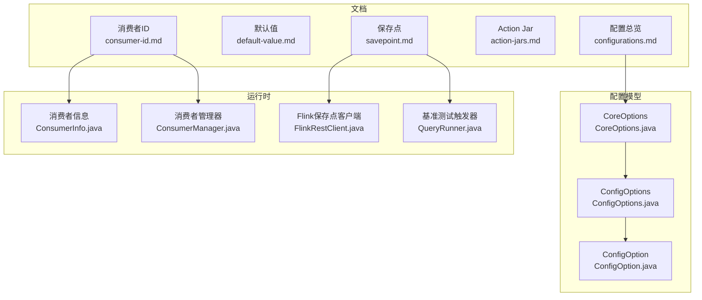
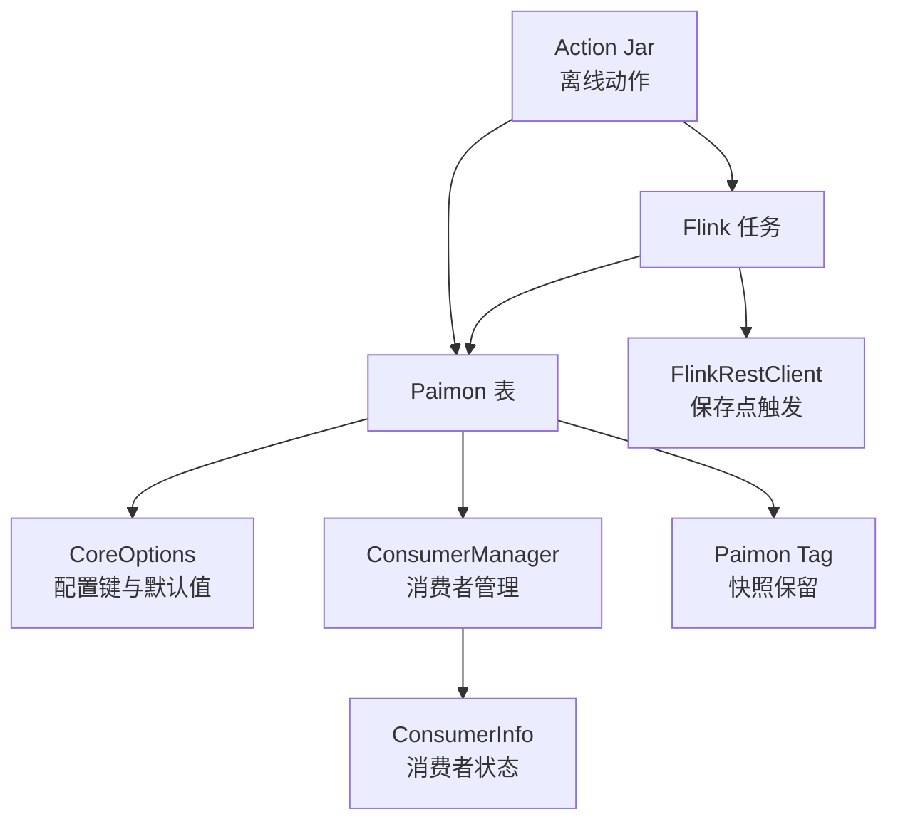
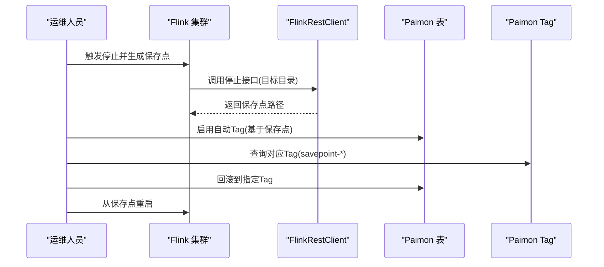
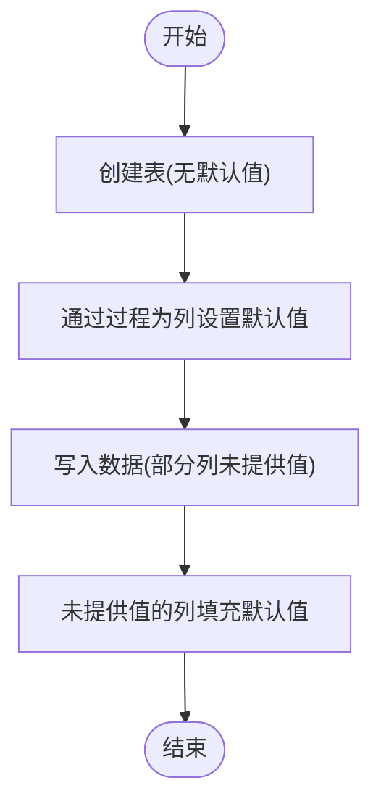
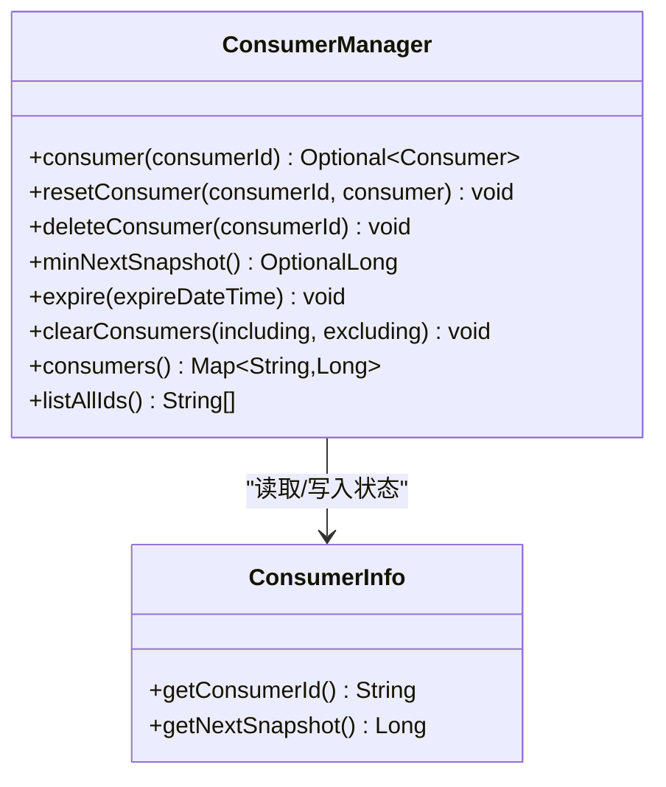
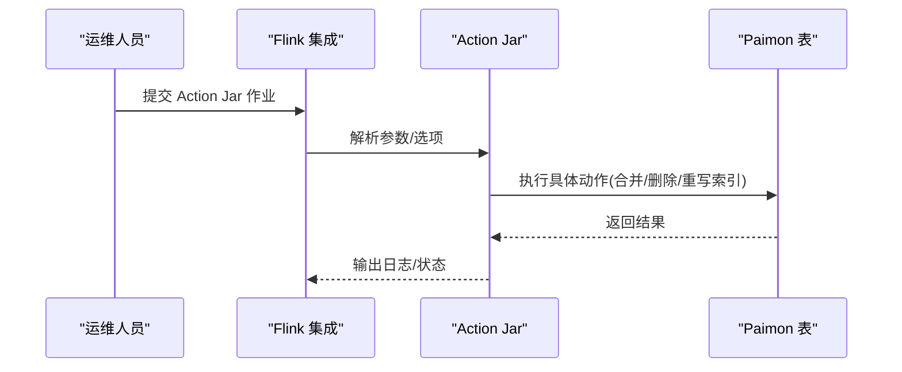
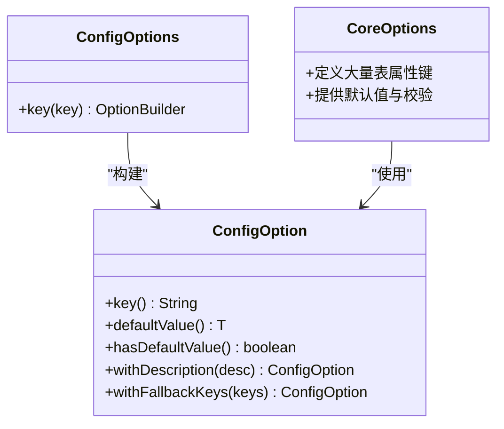
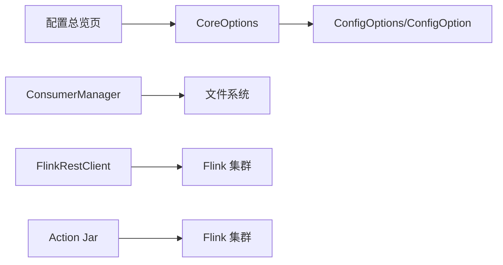

# 配置管理

<cite>
**本文引用的文件**
- [savepoint.md](file://docs/content/flink/savepoint.md)
- [default-value.md](file://docs/content/flink/default-value.md)
- [consumer-id.md](file://docs/content/flink/consumer-id.md)
- [action-jars.md](file://docs/content/flink/action-jars.md)
- [configurations.md](file://docs/content/maintenance/configurations.md)
- [CoreOptions.java](file://paimon-api/src/main/java/org/apache/paimon/CoreOptions.java)
- [ConfigOptions.java](file://paimon-api/src/main/java/org/apache/paimon/options/ConfigOptions.java)
- [ConfigOption.java](file://paimon-api/src/main/java/org/apache/paimon/options/ConfigOption.java)
- [ConsumerInfo.java](file://paimon-api/src/main/java/org/apache/paimon/consumer/ConsumerInfo.java)
- [ConsumerManager.java](file://paimon-core/src/main/java/org/apache/paimon/consumer/ConsumerManager.java)
- [FlinkRestClient.java](file://paimon-benchmark/paimon-cluster-benchmark/src/main/java/org/apache/paimon/benchmark/metric/FlinkRestClient.java)
- [QueryRunner.java](file://paimon-benchmark/paimon-cluster-benchmark/src/main/java/org/apache/paimon/benchmark/QueryRunner.java)
</cite>

## 目录
1. [简介](#简介)
2. [项目结构](#项目结构)
3. [核心组件](#核心组件)
4. [架构总览](#架构总览)
5. [详细组件分析](#详细组件分析)
6. [依赖分析](#依赖分析)
7. [性能考虑](#性能考虑)
8. [故障排除指南](#故障排除指南)
9. [结论](#结论)
10. [附录](#附录)

## 简介
本文件面向在 Flink 中运行 Apache Paimon 的用户，系统性地梳理并讲解配置管理的关键主题：保存点（Savepoint）的创建、恢复与管理；默认值配置的设定与生效；消费者 ID 的配置与消费者组管理及状态恢复；Action Jar 的使用与部署；Paimon 特有的配置项与参数；配置模板与示例；配置验证与故障排除；以及不同场景下的最佳实践与性能调优建议。

## 项目结构
围绕 Flink 配置管理，本文涉及以下文档与代码模块：
- 文档层：Flink 专题文档（保存点、默认值、消费者 ID、Action Jar、配置总览）
- 配置模型层：配置键定义、默认值与类型系统
- 运行时层：消费者管理、保存点触发与恢复流程

**图示来源**
- [savepoint.md:1-73](file://docs/content/flink/savepoint.md#L1-L73)
- [consumer-id.md:1-160](file://docs/content/flink/consumer-id.md#L1-L160)
- [action-jars.md:1-326](file://docs/content/flink/action-jars.md#L1-L326)
- [configurations.md:1-92](file://docs/content/maintenance/configurations.md#L1-L92)
- [CoreOptions.java:1-200](file://paimon-api/src/main/java/org/apache/paimon/CoreOptions.java#L1-L200)
- [ConfigOptions.java:1-238](file://paimon-api/src/main/java/org/apache/paimon/options/ConfigOptions.java#L1-L238)
- [ConfigOption.java:1-268](file://paimon-api/src/main/java/org/apache/paimon/options/ConfigOption.java#L1-L268)
- [ConsumerInfo.java:1-56](file://paimon-api/src/main/java/org/apache/paimon/consumer/ConsumerInfo.java#L1-L56)
- [ConsumerManager.java:1-171](file://paimon-core/src/main/java/org/apache/paimon/consumer/ConsumerManager.java#L1-L171)
- [FlinkRestClient.java:90-160](file://paimon-benchmark/paimon-cluster-benchmark/src/main/java/org/apache/paimon/benchmark/metric/FlinkRestClient.java#L90-L160)
- [QueryRunner.java:90-110](file://paimon-benchmark/paimon-cluster-benchmark/src/main/java/org/apache/paimon/benchmark/QueryRunner.java#L90-L110)

**章节来源**
- [savepoint.md:1-73](file://docs/content/flink/savepoint.md#L1-L73)
- [default-value.md:1-75](file://docs/content/flink/default-value.md#L1-L75)
- [consumer-id.md:1-160](file://docs/content/flink/consumer-id.md#L1-L160)
- [action-jars.md:1-326](file://docs/content/flink/action-jars.md#L1-L326)
- [configurations.md:1-92](file://docs/content/maintenance/configurations.md#L1-L92)

## 核心组件
- 配置键与默认值：通过配置构建器定义键、类型、默认值与描述，用于统一管理表属性、连接器参数与运行时行为。
- 消费者管理：以消费者 ID 为核心的状态实体，记录“下一个快照”进度，支持重置、删除、过期清理与批量清理。
- 保存点集成：结合 Paimon Tag 与 Flink Savepoint，实现可回溯的增量恢复路径。
- Action Jar：离线动作提交入口，支持合并、删除分区、重写索引等操作，并可强制作为 Flink 作业提交。

**章节来源**
- [CoreOptions.java:1-200](file://paimon-api/src/main/java/org/apache/paimon/CoreOptions.java#L1-L200)
- [ConfigOptions.java:1-238](file://paimon-api/src/main/java/org/apache/paimon/options/ConfigOptions.java#L1-L238)
- [ConfigOption.java:1-268](file://paimon-api/src/main/java/org/apache/paimon/options/ConfigOption.java#L1-L268)
- [ConsumerInfo.java:1-56](file://paimon-api/src/main/java/org/apache/paimon/consumer/ConsumerInfo.java#L1-L56)
- [ConsumerManager.java:1-171](file://paimon-core/src/main/java/org/apache/paimon/consumer/ConsumerManager.java#L1-L171)
- [savepoint.md:1-73](file://docs/content/flink/savepoint.md#L1-L73)
- [action-jars.md:1-326](file://docs/content/flink/action-jars.md#L1-L326)

## 架构总览
下图展示 Flink 与 Paimon 在配置管理上的交互关系：配置键由 CoreOptions 定义并通过 ConfigOptions/ConfigOption 统一建模；消费者 ID 与消费者管理器支撑状态恢复；保存点通过 Flink REST 接口触发并在 Paimon 中配合 Tag 实现可回溯恢复；Action Jar 作为独立提交入口执行离线动作。

**图示来源**
- [CoreOptions.java:1-200](file://paimon-api/src/main/java/org/apache/paimon/CoreOptions.java#L1-L200)
- [ConsumerManager.java:1-171](file://paimon-core/src/main/java/org/apache/paimon/consumer/ConsumerManager.java#L1-L171)
- [ConsumerInfo.java:1-56](file://paimon-api/src/main/java/org/apache/paimon/consumer/ConsumerInfo.java#L1-L56)
- [FlinkRestClient.java:90-160](file://paimon-benchmark/paimon-cluster-benchmark/src/main/java/org/apache/paimon/benchmark/metric/FlinkRestClient.java#L90-L160)
- [savepoint.md:1-73](file://docs/content/flink/savepoint.md#L1-L73)
- [action-jars.md:1-326](file://docs/content/flink/action-jars.md#L1-L326)

## 详细组件分析

### 保存点（Savepoint）管理
- 冲突与风险：Paimon 自有快照管理与 Flink Checkpoint 可能冲突，从保存点恢复时可能出现异常，但不会损坏存储。
- 推荐策略：
  - 使用 Flink 停止并生成保存点，确保最后检查点已完全处理，避免未提交元数据。
  - 结合 Paimon Tag 与 Flink 保存点：启用自动打 Tag，按保存点 ID 对应查询 Tag，回滚到对应 Tag 后再从保存点重启。

**图示来源**
- [savepoint.md:32-72](file://docs/content/flink/savepoint.md#L32-L72)
- [FlinkRestClient.java:90-100](file://paimon-benchmark/paimon-cluster-benchmark/src/main/java/org/apache/paimon/benchmark/metric/FlinkRestClient.java#L90-L100)
- [QueryRunner.java:90-110](file://paimon-benchmark/paimon-cluster-benchmark/src/main/java/org/apache/paimon/benchmark/QueryRunner.java#L90-L110)

**章节来源**
- [savepoint.md:1-73](file://docs/content/flink/savepoint.md#L1-L73)
- [FlinkRestClient.java:90-100](file://paimon-benchmark/paimon-cluster-benchmark/src/main/java/org/apache/paimon/benchmark/metric/FlinkRestClient.java#L90-L100)
- [QueryRunner.java:90-110](file://paimon-benchmark/paimon-cluster-benchmark/src/main/java/org/apache/paimon/benchmark/QueryRunner.java#L90-L110)

### 默认值配置
- 功能概述：为列指定默认值，写入时若未显式提供该列值，则自动生成默认值。
- 创建与修改：先创建表（不包含默认值），再通过过程（procedure）为已有列添加默认值定义，支持简单类型与复杂类型（数组、映射、嵌套行）。
- 生效机制：SQL 写入命令（如 INSERT/UPDATE/MERGE）中遇到 NULL 将解析为对应列的默认值。

**图示来源**
- [default-value.md:32-74](file://docs/content/flink/default-value.md#L32-L74)

**章节来源**
- [default-value.md:1-75](file://docs/content/flink/default-value.md#L1-L75)

### 消费者 ID 与消费者组管理
- 作用：
  - 安全消费：防止依赖该快照的消费者不存在时，快照被过期删除。
  - 断点续传：上个作业停止后，新作业可从上次进度继续消费，无需从状态恢复。
- 关键参数：
  - consumer-id：消费者标识。
  - consumer.expiration-time：消费者生命周期，到期后会被清理。
  - consumer.ignore-progress：仅启用“安全消费”，重启时从新快照进度读取。
  - consumer.mode：Exactly-once 或 At-least-once，两种模式状态不兼容，切换需重新启动。
- 状态恢复：通过消费者 ID 记录的“下一个快照”进度进行恢复。
- 管理操作：重置消费者（指定下一快照或删除）、批量清理消费者（支持正则过滤）。

**图示来源**
- [ConsumerInfo.java:1-56](file://paimon-api/src/main/java/org/apache/paimon/consumer/ConsumerInfo.java#L1-L56)
- [ConsumerManager.java:1-171](file://paimon-core/src/main/java/org/apache/paimon/consumer/ConsumerManager.java#L1-L171)

**章节来源**
- [consumer-id.md:1-160](file://docs/content/flink/consumer-id.md#L1-L160)
- [ConsumerInfo.java:1-56](file://paimon-api/src/main/java/org/apache/paimon/consumer/ConsumerInfo.java#L1-L56)
- [ConsumerManager.java:1-171](file://paimon-core/src/main/java/org/apache/paimon/consumer/ConsumerManager.java#L1-L171)

### Action Jar 使用与部署
- 入口：通过 Flink 运行 Action Jar 执行离线动作。
- 常见动作：
  - 合并（merge_into）：对主键表执行 Upsert 语义的合并，支持匹配/未匹配条件与动作组合。
  - 删除（delete）：按 WHERE 条件删除记录。
  - 删除分区（drop_partition）：删除指定分区。
  - 重写文件索引（rewrite_file_index）：重写文件索引。
- 提交行为：默认非重量级动作不提交为 Flink 作业，可通过标志位强制提交，统一体验。

**图示来源**
- [action-jars.md:29-326](file://docs/content/flink/action-jars.md#L29-L326)

**章节来源**
- [action-jars.md:1-326](file://docs/content/flink/action-jars.md#L1-L326)

### Paimon 特有配置选项与参数
- 配置体系：通过 ConfigOptions/ConfigOption 定义键、类型、默认值与描述；CoreOptions 聚合核心表属性与行为参数。
- 生成文档：维护页面通过占位符生成各模块配置清单（核心、目录、Hive、JDBC、Flink 连接器、Spark 等）。
- RocksDB 调优：提供细粒度调整项，既可在表属性中设置，也可在动态表提示中覆盖。

**图示来源**
- [ConfigOptions.java:1-238](file://paimon-api/src/main/java/org/apache/paimon/options/ConfigOptions.java#L1-L238)
- [ConfigOption.java:1-268](file://paimon-api/src/main/java/org/apache/paimon/options/ConfigOption.java#L1-L268)
- [CoreOptions.java:1-200](file://paimon-api/src/main/java/org/apache/paimon/CoreOptions.java#L1-L200)

**章节来源**
- [configurations.md:1-92](file://docs/content/maintenance/configurations.md#L1-L92)
- [ConfigOptions.java:1-238](file://paimon-api/src/main/java/org/apache/paimon/options/ConfigOptions.java#L1-L238)
- [ConfigOption.java:1-268](file://paimon-api/src/main/java/org/apache/paimon/options/ConfigOption.java#L1-L268)
- [CoreOptions.java:1-200](file://paimon-api/src/main/java/org/apache/paimon/CoreOptions.java#L1-L200)

## 依赖分析
- 配置层：CoreOptions 依赖 ConfigOptions/ConfigOption 提供的键定义与默认值能力，形成统一的配置模型。
- 运行时层：消费者管理依赖文件系统进行消费者状态持久化与清理；保存点流程依赖 Flink REST 客户端；Action Jar 作为独立作业与集群交互。
- 文档层：配置总览页通过占位符生成各模块配置清单，便于查阅与对比。

**图示来源**
- [CoreOptions.java:1-200](file://paimon-api/src/main/java/org/apache/paimon/CoreOptions.java#L1-L200)
- [ConfigOptions.java:1-238](file://paimon-api/src/main/java/org/apache/paimon/options/ConfigOptions.java#L1-L238)
- [ConfigOption.java:1-268](file://paimon-api/src/main/java/org/apache/paimon/options/ConfigOption.java#L1-L268)
- [ConsumerManager.java:1-171](file://paimon-core/src/main/java/org/apache/paimon/consumer/ConsumerManager.java#L1-L171)
- [FlinkRestClient.java:90-160](file://paimon-benchmark/paimon-cluster-benchmark/src/main/java/org/apache/paimon/benchmark/metric/FlinkRestClient.java#L90-L160)
- [configurations.md:1-92](file://docs/content/maintenance/configurations.md#L1-L92)

**章节来源**
- [CoreOptions.java:1-200](file://paimon-api/src/main/java/org/apache/paimon/CoreOptions.java#L1-L200)
- [ConsumerManager.java:1-171](file://paimon-core/src/main/java/org/apache/paimon/consumer/ConsumerManager.java#L1-L171)
- [FlinkRestClient.java:90-160](file://paimon-benchmark/paimon-cluster-benchmark/src/main/java/org/apache/paimon/benchmark/metric/FlinkRestClient.java#L90-L160)
- [configurations.md:1-92](file://docs/content/maintenance/configurations.md#L1-L92)

## 性能考虑
- 消费模式选择：
  - Exactly-once：严格对齐检查点，保证断点续传的精确性，但可能影响吞吐。
  - At-least-once：允许读者以不同速率消费快照，记录最慢读者的下一个快照 ID，减少对检查点时间的影响，适合不要求严格断点续传的场景。
- 快照与消费者过期：
  - 设置合理的消费者过期时间，避免过多快照占用空间。
  - 通过消费者管理器定期清理过期消费者，降低文件系统压力。
- 保存点与 Tag 协同：
  - 在升级或大规模变更前触发保存点并自动打 Tag，缩短回滚窗口，提高恢复效率。

[本节为通用指导，不直接分析具体文件]

## 故障排除指南
- 保存点恢复冲突：
  - 现象：从保存点恢复时报错。
  - 处理：采用 Flink 停止并生成保存点；或启用自动 Tag 并回滚到对应 Tag 后再重启。
- 消费者状态不一致：
  - 现象：重启后无法从预期进度继续消费。
  - 处理：确认 consumer-id 与 consumer.ignore-progress 设置；必要时重置消费者或删除后重建。
- 模式切换问题：
  - 现象：切换 consumer.mode 后无法从旧状态恢复。
  - 处理：模式切换状态不兼容，需重新启动作业。
- Action Jar 提交异常：
  - 现象：动作未提交为 Flink 作业或参数解析失败。
  - 处理：使用强制提交标志；确保参数转义正确，避免空格与特殊字符导致解析错误。

**章节来源**
- [savepoint.md:1-73](file://docs/content/flink/savepoint.md#L1-L73)
- [consumer-id.md:1-160](file://docs/content/flink/consumer-id.md#L1-L160)
- [action-jars.md:1-326](file://docs/content/flink/action-jars.md#L1-L326)

## 结论
通过统一的配置模型、完善的消费者管理与保存点/Tag 协同机制，以及丰富的 Action Jar 能力，Paimon 在 Flink 场景下提供了稳健的配置管理与运维手段。建议在生产环境中优先采用“停止并生成保存点”的安全策略，合理设置消费者过期时间与消费模式，并在需要时利用 Action Jar 执行离线维护操作。

[本节为总结性内容，不直接分析具体文件]

## 附录

### 配置模板与示例（路径指引）
- 保存点与 Tag 协同
  - 启用自动 Tag：参考 [保存点文档步骤:52-72](file://docs/content/flink/savepoint.md#L52-L72)
  - 查询 Tag 与回滚：参考 [保存点文档步骤:61-72](file://docs/content/flink/savepoint.md#L61-L72)
- 默认值配置
  - 创建表与设置默认值：参考 [默认值文档:32-74](file://docs/content/flink/default-value.md#L32-L74)
- 消费者 ID 与模式
  - 指定消费者 ID 与模式：参考 [消费者 ID 文档:44-80](file://docs/content/flink/consumer-id.md#L44-L80)
  - 忽略进度与仅安全消费：参考 [消费者 ID 文档:54-64](file://docs/content/flink/consumer-id.md#L54-L64)
- Action Jar 示例
  - 合并/删除/删除分区/重写索引：参考 [Action Jar 文档:29-326](file://docs/content/flink/action-jars.md#L29-L326)

### 配置验证清单
- 核对配置键与默认值：参考 [配置总览页:29-92](file://docs/content/maintenance/configurations.md#L29-L92) 与 [CoreOptions:1-200](file://paimon-api/src/main/java/org/apache/paimon/CoreOptions.java#L1-L200)
- 消费者状态核对：确认消费者 ID、过期时间与最小下一快照一致性
  - 参考 [ConsumerManager:82-109](file://paimon-core/src/main/java/org/apache/paimon/consumer/ConsumerManager.java#L82-L109)
- 保存点路径与权限：确认 Flink REST 客户端可写入保存点目录
  - 参考 [FlinkRestClient:90-100](file://paimon-benchmark/paimon-cluster-benchmark/src/main/java/org/apache/paimon/benchmark/metric/FlinkRestClient.java#L90-L100)