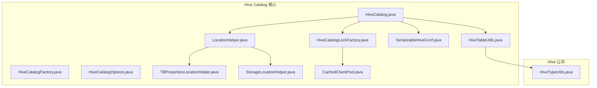
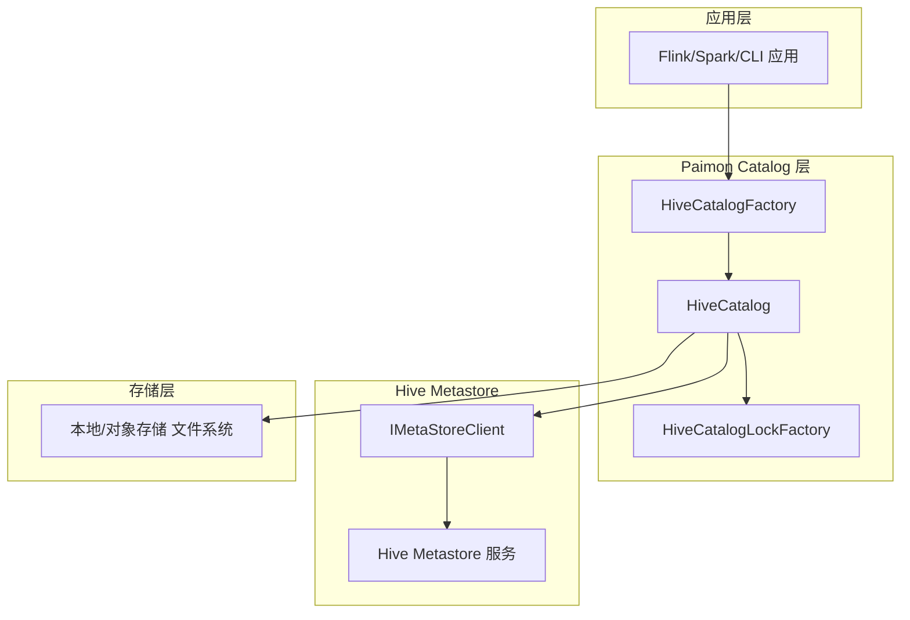
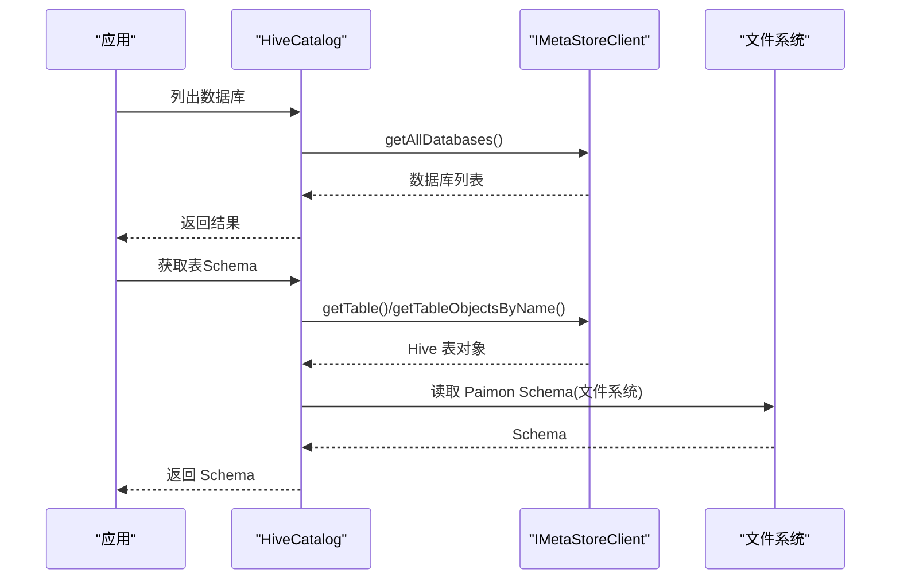
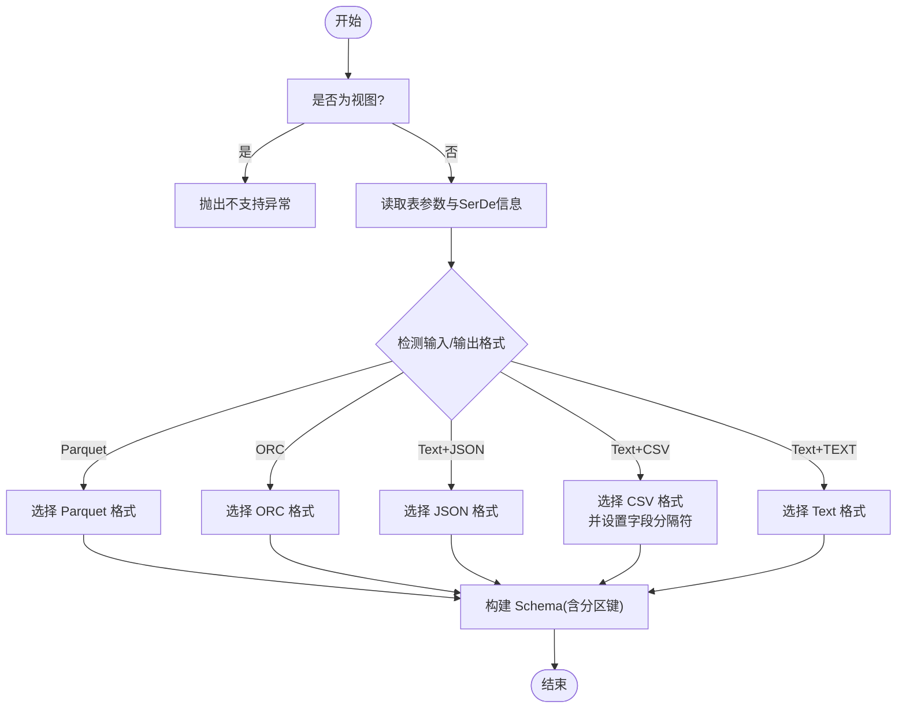
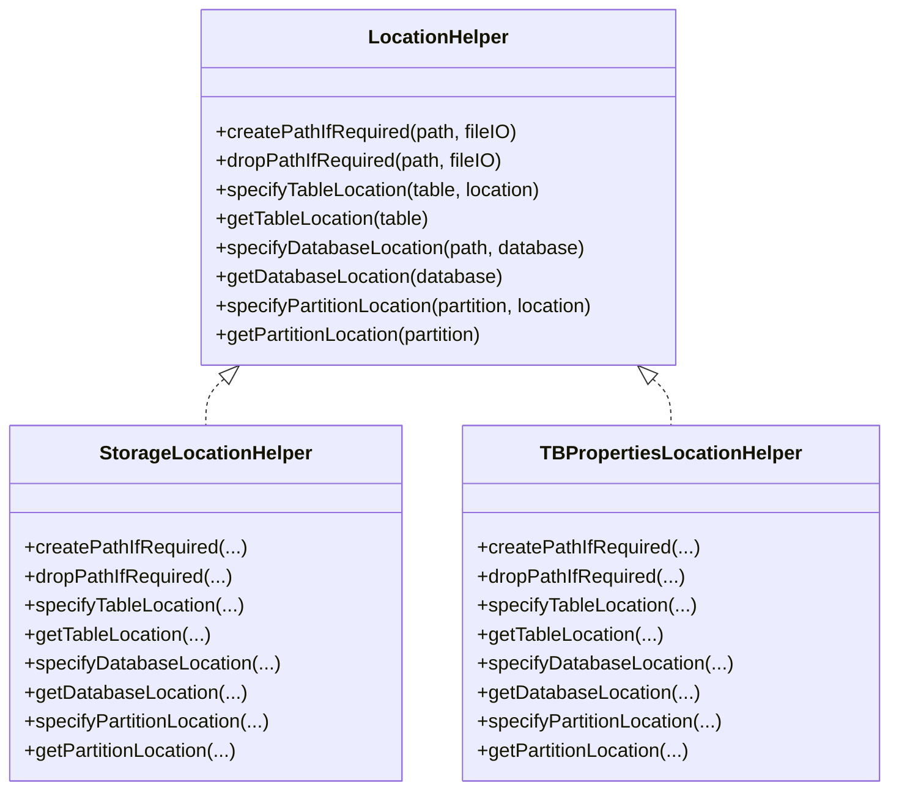
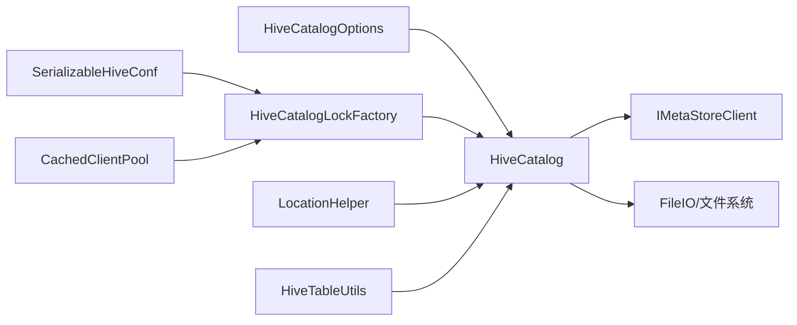

# Hive Catalog

<cite>
**本文引用的文件**
- [HiveCatalog.java](file://paimon-hive/paimon-hive-catalog/src/main/java/org/apache/paimon/hive/HiveCatalog.java)
- [HiveCatalogFactory.java](file://paimon-hive/paimon-hive-catalog/src/main/java/org/apache/paimon/hive/HiveCatalogFactory.java)
- [HiveCatalogOptions.java](file://paimon-hive/paimon-hive-catalog/src/main/java/org/apache/paimon/hive/HiveCatalogOptions.java)
- [HiveTableUtils.java](file://paimon-hive/paimon-hive-catalog/src/main/java/org/apache/paimon/hive/HiveTableUtils.java)
- [LocationHelper.java](file://paimon-hive/paimon-hive-catalog/src/main/java/org/apache/paimon/hive/LocationHelper.java)
- [TBPropertiesLocationHelper.java](file://paimon-hive/paimon-hive-catalog/src/main/java/org/apache/paimon/hive/TBPropertiesLocationHelper.java)
- [StorageLocationHelper.java](file://paimon-hive/paimon-hive-catalog/src/main/java/org/apache/paimon/hive/StorageLocationHelper.java)
- [SerializableHiveConf.java](file://paimon-hive/paimon-hive-catalog/src/main/java/org/apache/paimon/hive/SerializableHiveConf.java)
- [HiveCatalogLockFactory.java](file://paimon-hive/paimon-hive-catalog/src/main/java/org/apache/paimon/hive/HiveCatalogLockFactory.java)
- [CachedClientPool.java](file://paimon-hive/paimon-hive-catalog/src/main/java/org/apache/paimon/hive/pool/CachedClientPool.java)
- [HiveTypeUtils.java](file://paimon-hive/paimon-hive-common/src/main/java/org/apache/paimon/hive/HiveTypeUtils.java)
- [HiveCatalogTest.java](file://paimon-hive/paimon-hive-catalog/src/test/java/org/apache/paimon/hive/HiveCatalogTest.java)
- [Hive23CatalogITCase.java](file://paimon-hive/paimon-hive-connector-2.3/src/test/java/org/apache/paimon/hive/Hive23CatalogITCase.java)
- [Hive23CatalogFormatTableITCase.java](file://paimon-hive/paimon-hive-connector-2.3/src/test/java/org/apache/paimon/hive/Hive23CatalogFormatTableITCase.java)
- [hive-site.xml](file://paimon-hive/paimon-hive-catalog/src/test/resources/hive-site.xml)
- [log4j2-test.properties](file://paimon-hive/paimon-hive-catalog/src/test/resources/log4j2-test.properties)
</cite>

## 目录
1. [引言](#引言)
2. [项目结构](#项目结构)
3. [核心组件](#核心组件)
4. [架构总览](#架构总览)
5. [详细组件分析](#详细组件分析)
6. [依赖分析](#依赖分析)
7. [性能考虑](#性能考虑)
8. [故障排除指南](#故障排除指南)
9. [结论](#结论)
10. [附录](#附录)

## 引言
本文件面向使用 Apache Paimon 的 Hive Catalog 组件的用户与工程师，系统性阐述其架构设计、实现原理与运维实践。重点覆盖以下方面：
- 元数据存储机制：如何在 Hive Metastore 中映射 Paimon 表与分区，并通过本地文件系统或对象存储进行数据定位。
- 表映射关系：Paimon 表与 Hive 表之间的字段、分区键、SerDe、格式等映射规则。
- 数据库管理：数据库创建、删除、属性变更与位置管理策略。
- 配置选项与参数：连接配置、权限与安全认证、客户端池化与缓存策略等。
- 与 Hive Metastore 的交互：元数据同步、事务与并发控制、批量获取与事件标记。
- 部署与配置指南：环境要求、依赖安装、配置文件设置与最佳实践。
- 性能优化与监控：客户端池化、批处理、路径解析与缓存策略。
- 常见问题与排障：典型错误场景与解决思路。

## 项目结构
Hive Catalog 相关代码主要位于 paimon-hive 模块中，核心目录与文件如下：
- paimon-hive/paimon-hive-catalog：Hive Catalog 实现与工厂、选项、工具类、位置辅助器、序列化配置与锁工厂等。
- paimon-hive/paimon-hive-common：Hive 类型转换等通用能力。
- paimon-hive/paimon-hive-connector-*：与 Hive 版本兼容的 Connector（用于读写）。

图表来源
- [HiveCatalog.java:132-191](file://paimon-hive/paimon-hive-catalog/src/main/java/org/apache/paimon/hive/HiveCatalog.java#L132-L191)
- [HiveCatalogFactory.java:28-38](file://paimon-hive/paimon-hive-catalog/src/main/java/org/apache/paimon/hive/HiveCatalogFactory.java#L28-L38)
- [HiveCatalogOptions.java:30-99](file://paimon-hive/paimon-hive-catalog/src/main/java/org/apache/paimon/hive/HiveCatalogOptions.java#L30-L99)
- [HiveTableUtils.java:45-126](file://paimon-hive/paimon-hive-catalog/src/main/java/org/apache/paimon/hive/HiveTableUtils.java#L45-L126)
- [LocationHelper.java:31-48](file://paimon-hive/paimon-hive-catalog/src/main/java/org/apache/paimon/hive/LocationHelper.java#L31-L48)
- [TBPropertiesLocationHelper.java:32-102](file://paimon-hive/paimon-hive-catalog/src/main/java/org/apache/paimon/hive/TBPropertiesLocationHelper.java#L32-L102)
- [StorageLocationHelper.java:29-72](file://paimon-hive/paimon-hive-catalog/src/main/java/org/apache/paimon/hive/StorageLocationHelper.java#L29-L72)
- [SerializableHiveConf.java:34-84](file://paimon-hive/paimon-hive-catalog/src/main/java/org/apache/paimon/hive/SerializableHiveConf.java#L34-L84)
- [HiveCatalogLockFactory.java:34-53](file://paimon-hive/paimon-hive-catalog/src/main/java/org/apache/paimon/hive/HiveCatalogLockFactory.java#L34-L53)
- [CachedClientPool.java](file://paimon-hive/paimon-hive-catalog/src/main/java/org/apache/paimon/hive/pool/CachedClientPool.java)

章节来源
- [HiveCatalog.java:132-191](file://paimon-hive/paimon-hive-catalog/src/main/java/org/apache/paimon/hive/HiveCatalog.java#L132-L191)
- [HiveCatalogOptions.java:30-99](file://paimon-hive/paimon-hive-catalog/src/main/java/org/apache/paimon/hive/HiveCatalogOptions.java#L30-L99)

## 核心组件
- HiveCatalog：Catalog 接口的 Hive 实现，负责数据库与表的生命周期管理、Schema 加载、分区操作、统计更新、路径解析与与 Hive Metastore 的交互。
- HiveCatalogFactory：Catalog 工厂，根据 CatalogContext 创建 HiveCatalog 实例。
- HiveCatalogOptions：Hive Catalog 的配置项集合，涵盖 Hive/Hadoop 配置目录、Metastore 客户端类名、位置存储策略、客户端池化与缓存键等。
- HiveTableUtils：将 Hive 表元数据转换为 Paimon Schema 的工具，支持 Parquet、ORC、CSV、JSON、Text 等格式识别。
- LocationHelper 及其实现：抽象表/库/分区位置设置与读取策略，支持“将位置放入表属性”和“放入 StorageDescriptor”的两种模式。
- SerializableHiveConf：对 HiveConf 的可序列化包装，减少跨进程传递时的序列化开销。
- HiveCatalogLockFactory：基于 Hive 的 Catalog 锁工厂，结合客户端池化与超时策略保障并发安全。
- CachedClientPool：Hive Metastore 客户端池化实现，支持按 UGI、用户名、自定义配置键等维度构建缓存键。

章节来源
- [HiveCatalog.java:132-191](file://paimon-hive/paimon-hive-catalog/src/main/java/org/apache/paimon/hive/HiveCatalog.java#L132-L191)
- [HiveCatalogFactory.java:28-38](file://paimon-hive/paimon-hive-catalog/src/main/java/org/apache/paimon/hive/HiveCatalogFactory.java#L28-L38)
- [HiveCatalogOptions.java:30-99](file://paimon-hive/paimon-hive-catalog/src/main/java/org/apache/paimon/hive/HiveCatalogOptions.java#L30-L99)
- [HiveTableUtils.java:45-126](file://paimon-hive/paimon-hive-catalog/src/main/java/org/apache/paimon/hive/HiveTableUtils.java#L45-L126)
- [LocationHelper.java:31-48](file://paimon-hive/paimon-hive-catalog/src/main/java/org/apache/paimon/hive/LocationHelper.java#L31-L48)
- [TBPropertiesLocationHelper.java:32-102](file://paimon-hive/paimon-hive-catalog/src/main/java/org/apache/paimon/hive/TBPropertiesLocationHelper.java#L32-L102)
- [StorageLocationHelper.java:29-72](file://paimon-hive/paimon-hive-catalog/src/main/java/org/apache/paimon/hive/StorageLocationHelper.java#L29-L72)
- [SerializableHiveConf.java:34-84](file://paimon-hive/paimon-hive-catalog/src/main/java/org/apache/paimon/hive/SerializableHiveConf.java#L34-L84)
- [HiveCatalogLockFactory.java:34-53](file://paimon-hive/paimon-hive-catalog/src/main/java/org/apache/paimon/hive/HiveCatalogLockFactory.java#L34-L53)
- [CachedClientPool.java](file://paimon-hive/paimon-hive-catalog/src/main/java/org/apache/paimon/hive/pool/CachedClientPool.java)

## 架构总览
Hive Catalog 的总体架构围绕“Catalog 抽象 + Hive Metastore 交互 + 本地/对象存储文件系统 + 客户端池化 + 并发锁”展开。下图展示了关键组件及其交互：

图表来源
- [HiveCatalog.java:193-205](file://paimon-hive/paimon-hive-catalog/src/main/java/org/apache/paimon/hive/HiveCatalog.java#L193-L205)
- [HiveCatalogFactory.java:36-38](file://paimon-hive/paimon-hive-catalog/src/main/java/org/apache/paimon/hive/HiveCatalogFactory.java#L36-L38)
- [HiveCatalogLockFactory.java:38-47](file://paimon-hive/paimon-hive-catalog/src/main/java/org/apache/paimon/hive/HiveCatalogLockFactory.java#L38-L47)
- [CachedClientPool.java](file://paimon-hive/paimon-hive-catalog/src/main/java/org/apache/paimon/hive/pool/CachedClientPool.java)

## 详细组件分析

### HiveCatalog：元数据与表映射
- 数据库管理：创建/删除/修改数据库，自动处理位置创建与清理；支持从参数中提取注释、所有者、位置等属性。
- 表管理：加载表元数据与 Schema，区分 Paimon 表与格式表（Format Table），外部表判断与路径解析。
- 分区管理：支持分区创建、删除、统计更新与事件标记；当启用“分区表在 Metastore 中”或“标签转分区字段”时，分区信息同步到 Hive Metastore。
- 路径解析：优先从 Metastore 读取位置，若未配置则回退到仓库默认路径；支持“位置放入属性”与“放入 StorageDescriptor”两种策略。
- 批量获取：列表表时采用分批获取，降低一次 RPC 的压力。
- 与 Hive 的映射：通过 HiveTableUtils 将 Hive 表的 SerDe、输入输出格式、字段类型等映射为 Paimon Schema。

图表来源
- [HiveCatalog.java:294-303](file://paimon-hive/paimon-hive-catalog/src/main/java/org/apache/paimon/hive/HiveCatalog.java#L294-L303)
- [HiveCatalog.java:708-752](file://paimon-hive/paimon-hive-catalog/src/main/java/org/apache/paimon/hive/HiveCatalog.java#L708-L752)
- [HiveCatalog.java:786-805](file://paimon-hive/paimon-hive-catalog/src/main/java/org/apache/paimon/hive/HiveCatalog.java#L786-L805)

章节来源
- [HiveCatalog.java:294-303](file://paimon-hive/paimon-hive-catalog/src/main/java/org/apache/paimon/hive/HiveCatalog.java#L294-L303)
- [HiveCatalog.java:306-322](file://paimon-hive/paimon-hive-catalog/src/main/java/org/apache/paimon/hive/HiveCatalog.java#L306-L322)
- [HiveCatalog.java:376-380](file://paimon-hive/paimon-hive-catalog/src/main/java/org/apache/paimon/hive/HiveCatalog.java#L376-L380)
- [HiveCatalog.java:383-398](file://paimon-hive/paimon-hive-catalog/src/main/java/org/apache/paimon/hive/HiveCatalog.java#L383-L398)
- [HiveCatalog.java:441-472](file://paimon-hive/paimon-hive-catalog/src/main/java/org/apache/paimon/hive/HiveCatalog.java#L441-L472)
- [HiveCatalog.java:492-544](file://paimon-hive/paimon-hive-catalog/src/main/java/org/apache/paimon/hive/HiveCatalog.java#L492-L544)
- [HiveCatalog.java:547-568](file://paimon-hive/paimon-hive-catalog/src/main/java/org/apache/paimon/hive/HiveCatalog.java#L547-L568)
- [HiveCatalog.java:708-752](file://paimon-hive/paimon-hive-catalog/src/main/java/org/apache/paimon/hive/HiveCatalog.java#L708-L752)
- [HiveCatalog.java:786-805](file://paimon-hive/paimon-hive-catalog/src/main/java/org/apache/paimon/hive/HiveCatalog.java#L786-L805)

### HiveTableUtils：Hive 表到 Paimon Schema 的映射
- 支持格式识别：Parquet、ORC、CSV、JSON、Text。
- 字段类型映射：基于 HiveTypeUtils 将 Hive 类型转换为 Paimon 类型。
- 分区键处理：从 Hive 表的分区键列表中提取分区列。
- 外部属性处理：从 SerDe 参数中提取字段分隔符等信息并注入到 Schema 的 Options 中。

图表来源
- [HiveTableUtils.java:47-104](file://paimon-hive/paimon-hive-catalog/src/main/java/org/apache/paimon/hive/HiveTableUtils.java#L47-L104)
- [HiveTypeUtils.java](file://paimon-hive/paimon-hive-common/src/main/java/org/apache/paimon/hive/HiveTypeUtils.java)

章节来源
- [HiveTableUtils.java:47-104](file://paimon-hive/paimon-hive-catalog/src/main/java/org/apache/paimon/hive/HiveTableUtils.java#L47-L104)
- [HiveTypeUtils.java](file://paimon-hive/paimon-hive-common/src/main/java/org/apache/paimon/hive/HiveTypeUtils.java)

### LocationHelper：位置存储策略
- 接口职责：统一抽象数据库/表/分区的位置设置与读取。
- 两种实现：
  - StorageLocationHelper：将位置写入 StorageDescriptor（默认行为）。
  - TBPropertiesLocationHelper：将位置写入表/库/分区的参数（适用于对象存储场景，避免通过 Hive 文件系统访问）。

图表来源
- [LocationHelper.java:31-48](file://paimon-hive/paimon-hive-catalog/src/main/java/org/apache/paimon/hive/LocationHelper.java#L31-L48)
- [StorageLocationHelper.java:29-72](file://paimon-hive/paimon-hive-catalog/src/main/java/org/apache/paimon/hive/StorageLocationHelper.java#L29-L72)
- [TBPropertiesLocationHelper.java:32-102](file://paimon-hive/paimon-hive-catalog/src/main/java/org/apache/paimon/hive/TBPropertiesLocationHelper.java#L32-L102)

章节来源
- [LocationHelper.java:31-48](file://paimon-hive/paimon-hive-catalog/src/main/java/org/apache/paimon/hive/LocationHelper.java#L31-L48)
- [StorageLocationHelper.java:29-72](file://paimon-hive/paimon-hive-catalog/src/main/java/org/apache/paimon/hive/StorageLocationHelper.java#L29-L72)
- [TBPropertiesLocationHelper.java:32-102](file://paimon-hive/paimon-hive-catalog/src/main/java/org/apache/paimon/hive/TBPropertiesLocationHelper.java#L32-L102)

### SerializableHiveConf：可序列化的 Hive 配置
- 作用：在需要跨进程传递 HiveConf 时，延迟序列化/反序列化以降低开销。
- 关键点：构造时持有 HiveConf；序列化时将其写出；反序列化时重建 HiveConf。

章节来源
- [SerializableHiveConf.java:34-84](file://paimon-hive/paimon-hive-catalog/src/main/java/org/apache/paimon/hive/SerializableHiveConf.java#L34-L84)

### HiveCatalogLockFactory：并发与锁
- 作用：基于 Hive 的 Catalog 锁工厂，结合客户端池化与超时策略，确保多实例或多线程并发下的元数据一致性。
- 关键点：校验上下文类型、创建 HiveCatalogLock、设置最大休眠时间与获取超时。

章节来源
- [HiveCatalogLockFactory.java:34-53](file://paimon-hive/paimon-hive-catalog/src/main/java/org/apache/paimon/hive/HiveCatalogLockFactory.java#L34-L53)

### CachedClientPool：Metastore 客户端池化
- 作用：复用 IMetaStoreClient，减少频繁创建/销毁带来的性能损耗。
- 关键点：支持按 UGI、用户名、自定义配置键等维度构建缓存键，支持空闲驱逐间隔配置。

章节来源
- [CachedClientPool.java](file://paimon-hive/paimon-hive-catalog/src/main/java/org/apache/paimon/hive/pool/CachedClientPool.java)

## 依赖分析
- 组件耦合：
  - HiveCatalog 依赖 HiveConf、IMetaStoreClient、FileIO、LocationHelper、HiveTableUtils、HiveCatalogLockFactory、CachedClientPool。
  - HiveCatalogFactory 仅负责实例化 HiveCatalog。
  - HiveCatalogOptions 提供配置入口，影响 HiveConf 初始化、客户端类名、位置策略与客户端池化键。
- 外部依赖：
  - Hive Metastore 客户端接口 IMetaStoreClient。
  - Hadoop 文件系统与配置加载。
  - 日志框架（测试资源中包含日志配置）。

图表来源
- [HiveCatalogOptions.java:30-99](file://paimon-hive/paimon-hive-catalog/src/main/java/org/apache/paimon/hive/HiveCatalogOptions.java#L30-L99)
- [HiveCatalog.java:165-191](file://paimon-hive/paimon-hive-catalog/src/main/java/org/apache/paimon/hive/HiveCatalog.java#L165-L191)
- [HiveCatalogLockFactory.java:38-47](file://paimon-hive/paimon-hive-catalog/src/main/java/org/apache/paimon/hive/HiveCatalogLockFactory.java#L38-L47)
- [CachedClientPool.java](file://paimon-hive/paimon-hive-catalog/src/main/java/org/apache/paimon/hive/pool/CachedClientPool.java)

章节来源
- [HiveCatalog.java:165-191](file://paimon-hive/paimon-hive-catalog/src/main/java/org/apache/paimon/hive/HiveCatalog.java#L165-L191)
- [HiveCatalogOptions.java:30-99](file://paimon-hive/paimon-hive-catalog/src/main/java/org/apache/paimon/hive/HiveCatalogOptions.java#L30-L99)

## 性能考虑
- 客户端池化与缓存键
  - 使用 CachedClientPool 复用 Metastore 客户端，减少连接建立成本。
  - 通过 client-pool-cache.keys 指定缓存键维度（UGI、用户名、特定配置键），避免不同上下文共享同一连接池导致的冲突。
- 批量获取与分区操作
  - 列表表时采用分批获取，降低单次 RPC 的负载。
  - 分区创建/删除/统计更新采用批量方式，减少往返次数。
- 位置策略选择
  - 对象存储场景建议开启“location-in-properties”，避免通过 Hive 文件系统访问存储后端。
- 路径解析与缓存
  - 通过 LocationHelper 抽象，减少重复解析与 IO 操作。
- 并发与锁
  - 使用 HiveCatalogLockFactory 结合超时与最大休眠时间，避免长时间阻塞。

章节来源
- [HiveCatalogOptions.java:69-95](file://paimon-hive/paimon-hive-catalog/src/main/java/org/apache/paimon/hive/HiveCatalogOptions.java#L69-L95)
- [HiveCatalog.java:711-737](file://paimon-hive/paimon-hive-catalog/src/main/java/org/apache/paimon/hive/HiveCatalog.java#L711-L737)
- [HiveCatalog.java:434-438](file://paimon-hive/paimon-hive-catalog/src/main/java/org/apache/paimon/hive/HiveCatalog.java#L434-L438)
- [TBPropertiesLocationHelper.java:56-63](file://paimon-hive/paimon-hive-catalog/src/main/java/org/apache/paimon/hive/TBPropertiesLocationHelper.java#L56-L63)

## 故障排除指南
- 连接与认证问题
  - 确认 hive-conf-dir 或 HIVE_CONF_DIR 指向正确的 hive-site.xml 所在目录，以便正确初始化 HiveConf 与安全认证（如 Kerberos、Ranger）。
  - 若未配置，尝试通过环境变量加载。
- 客户端类名不匹配
  - metastore.client.class 必须实现 IMetaStoreClient 接口，否则会抛出异常。
- 对象存储访问失败
  - 当使用 S3/OSS 等对象存储时，启用 location-in-properties，将位置写入表属性而非 StorageDescriptor，避免通过 Hive 文件系统访问。
- 分区同步异常
  - 当分区表在 Metastore 中启用时，需确保分区键与分区值正确映射；若分区不存在，删除/统计更新会忽略 NoSuchObjectException。
- 权限不足
  - 确保运行用户具备对仓库路径的读写权限；数据库/表创建时会根据 LocationHelper 自动创建或删除路径。
- 日志与调试
  - 测试资源中包含 log4j2-test.properties，可在本地调试时参考。

章节来源
- [HiveCatalogOptions.java:34-59](file://paimon-hive/paimon-hive-catalog/src/main/java/org/apache/paimon/hive/HiveCatalogOptions.java#L34-L59)
- [TBPropertiesLocationHelper.java:62-74](file://paimon-hive/paimon-hive-catalog/src/main/java/org/apache/paimon/hive/TBPropertiesLocationHelper.java#L62-L74)
- [HiveCatalog.java:454-467](file://paimon-hive/paimon-hive-catalog/src/main/java/org/apache/paimon/hive/HiveCatalog.java#L454-L467)
- [log4j2-test.properties](file://paimon-hive/paimon-hive-catalog/src/test/resources/log4j2-test.properties)

## 结论
Hive Catalog 通过清晰的抽象与严格的实现，实现了 Paimon 与 Hive Metastore 的无缝集成。其核心优势在于：
- 明确的元数据映射与位置策略，适配多种存储后端。
- 完善的并发控制与客户端池化，兼顾性能与稳定性。
- 可配置的选项体系，满足不同部署与安全需求。
建议在生产环境中结合对象存储与池化配置，配合严格的权限与监控策略，获得更优的可用性与性能表现。

## 附录

### 配置选项与参数说明
- hive-conf-dir：Hive 配置目录，用于加载 hive-site.xml 与安全认证配置。
- hadoop-conf-dir：Hadoop 配置目录，用于加载 core-site.xml、hdfs-site.xml 等。
- metastore.client.class：Metastore 客户端类名，必须实现 IMetaStoreClient。
- location-in-properties：是否将位置写入表/库/分区参数（推荐对象存储场景）。
- client-pool-cache.eviction-interval-ms：客户端池空闲驱逐间隔。
- client-pool-cache.keys：客户端池缓存键维度，支持 ugi、user_name、conf:xxx 等。

章节来源
- [HiveCatalogOptions.java:34-95](file://paimon-hive/paimon-hive-catalog/src/main/java/org/apache/paimon/hive/HiveCatalogOptions.java#L34-L95)

### 部署与配置指南
- 环境要求
  - 准备 Hive 与 Hadoop 配置文件（hive-site.xml、core-site.xml、hdfs-site.xml 等）。
  - 确保运行用户对仓库路径具有读写权限。
- 依赖安装
  - 引入 Paimon Hive Catalog 依赖与对应版本的 Hive Connector。
- 配置文件设置
  - 在 CatalogContext 中设置 hive-conf-dir 与 hadoop-conf-dir。
  - 如需对象存储访问，设置 location-in-properties=true。
  - 如需池化与缓存，合理配置 client-pool-cache.eviction-interval-ms 与 client-pool-cache.keys。
- 最佳实践
  - 对象存储场景优先使用 location-in-properties。
  - 合理设置客户端池化键，避免不同用户/配置共享连接池。
  - 对大表列表与分区操作启用批处理与事件标记，提升吞吐。

章节来源
- [HiveCatalogOptions.java:34-95](file://paimon-hive/paimon-hive-catalog/src/main/java/org/apache/paimon/hive/HiveCatalogOptions.java#L34-L95)
- [TBPropertiesLocationHelper.java:62-74](file://paimon-hive/paimon-hive-catalog/src/main/java/org/apache/paimon/hive/TBPropertiesLocationHelper.java#L62-L74)

### 示例与测试参考
- 单元与集成测试
  - HiveCatalogTest：验证 Catalog 基本功能。
  - Hive23CatalogITCase / Hive23CatalogFormatTableITCase：验证与 Hive 2.3/3.1 的兼容性与格式表场景。
- 配置样例
  - hive-site.xml：测试中提供的示例配置文件。

章节来源
- [HiveCatalogTest.java](file://paimon-hive/paimon-hive-catalog/src/test/java/org/apache/paimon/hive/HiveCatalogTest.java)
- [Hive23CatalogITCase.java](file://paimon-hive/paimon-hive-connector-2.3/src/test/java/org/apache/paimon/hive/Hive23CatalogITCase.java)
- [Hive23CatalogFormatTableITCase.java](file://paimon-hive/paimon-hive-connector-2.3/src/test/java/org/apache/paimon/hive/Hive23CatalogFormatTableITCase.java)
- [hive-site.xml](file://paimon-hive/paimon-hive-catalog/src/test/resources/hive-site.xml)