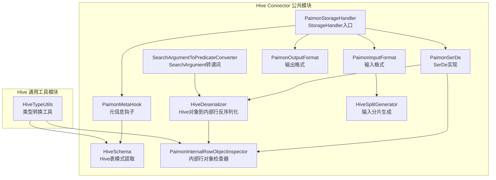
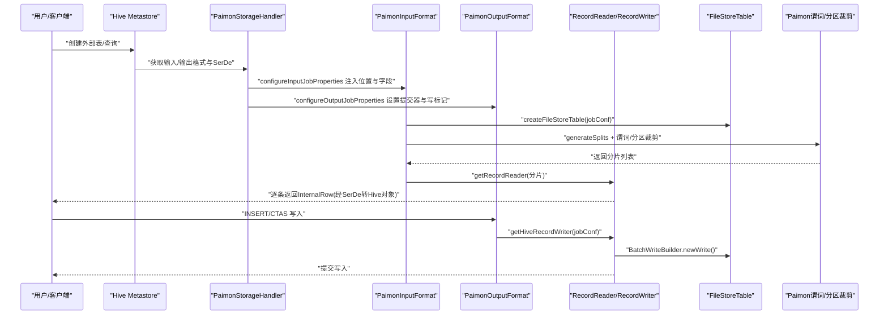
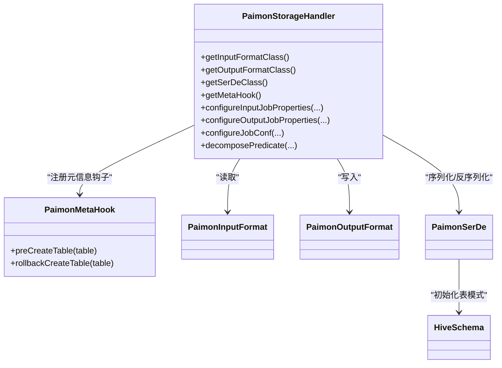
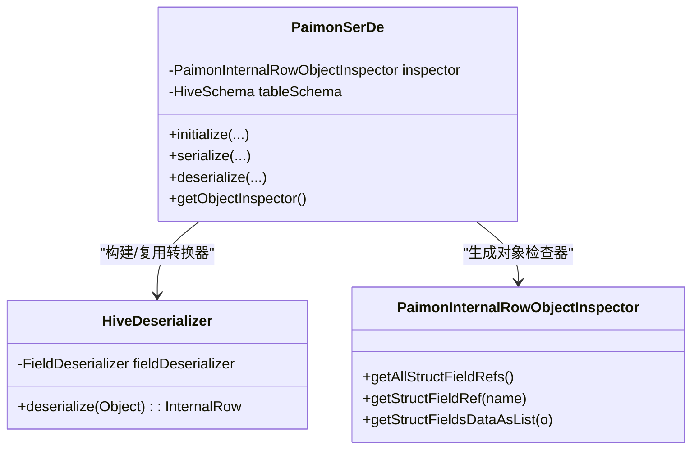
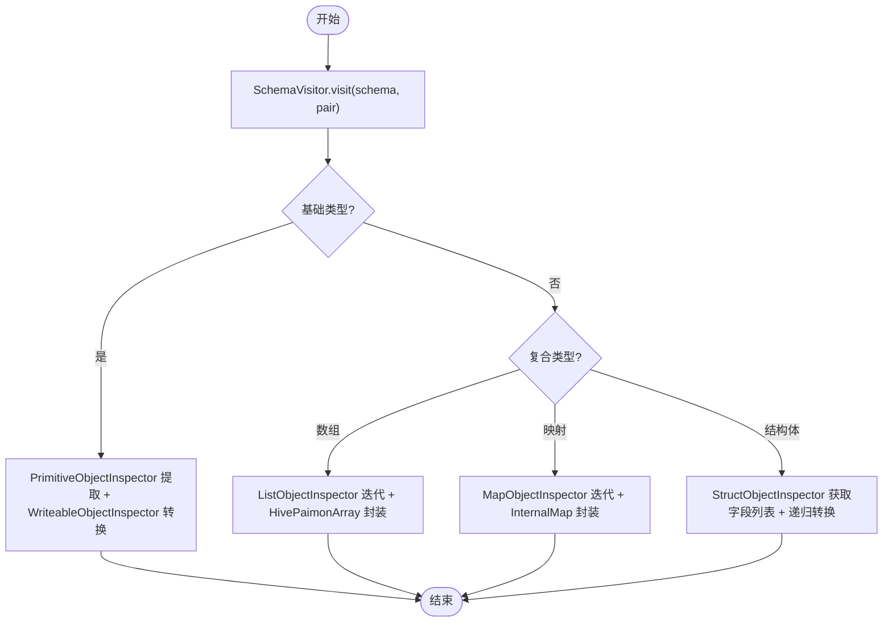
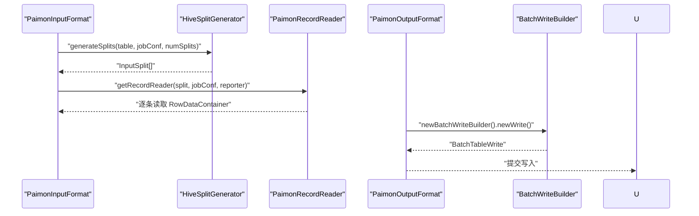
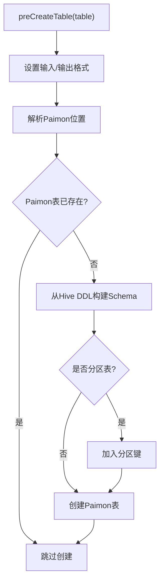
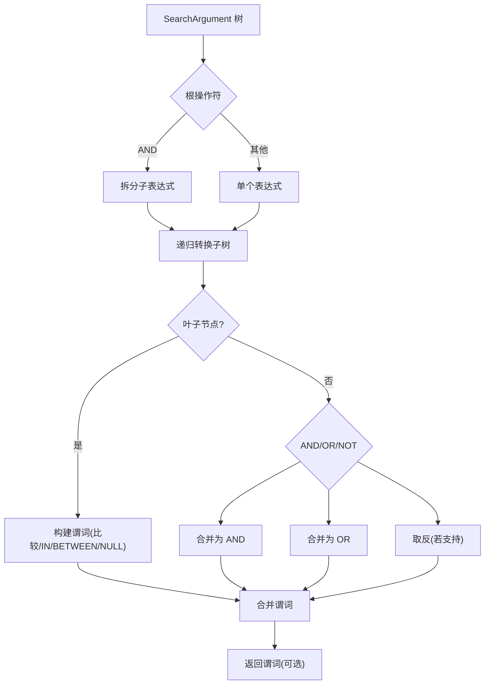
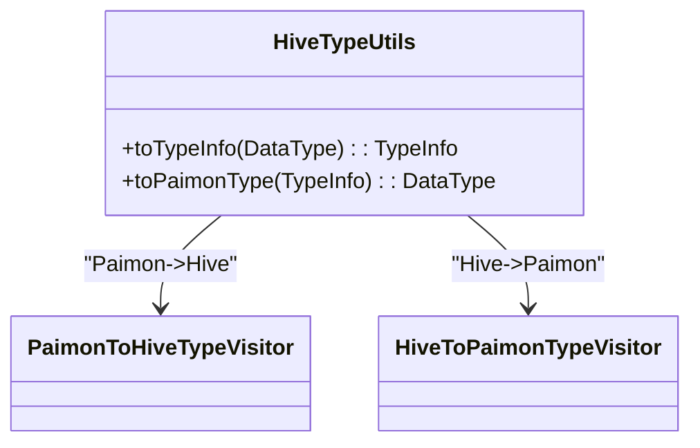
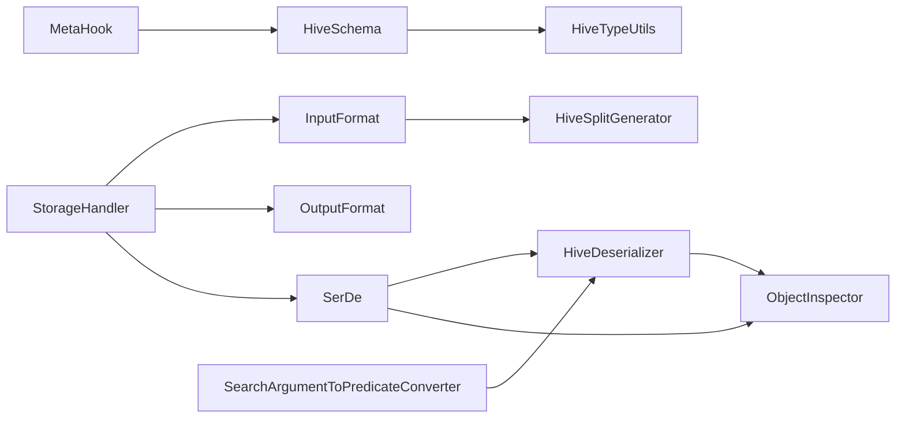

# Hive Connector

<cite>
**本文引用的文件**
- [PaimonStorageHandler.java](file://paimon-hive/paimon-hive-connector-common/src/main/java/org/apache/paimon/hive/PaimonStorageHandler.java)
- [PaimonSerDe.java](file://paimon-hive/paimon-hive-connector-common/src/main/java/org/apache/paimon/hive/PaimonSerDe.java)
- [HiveDeserializer.java](file://paimon-hive/paimon-hive-connector-common/src/main/java/org/apache/paimon/hive/HiveDeserializer.java)
- [SearchArgumentToPredicateConverter.java](file://paimon-hive/paimon-hive-connector-common/src/main/java/org/apache/paimon/hive/SearchArgumentToPredicateConverter.java)
- [PaimonInputFormat.java](file://paimon-hive/paimon-hive-connector-common/src/main/java/org/apache/paimon/hive/mapred/PaimonInputFormat.java)
- [PaimonOutputFormat.java](file://paimon-hive/paimon-hive-connector-common/src/main/java/org/apache/paimon/hive/mapred/PaimonOutputFormat.java)
- [PaimonMetaHook.java](file://paimon-hive/paimon-hive-connector-common/src/main/java/org/apache/paimon/hive/PaimonMetaHook.java)
- [HiveSchema.java](file://paimon-hive/paimon-hive-connector-common/src/main/java/org/apache/paimon/hive/HiveSchema.java)
- [PaimonInternalRowObjectInspector.java](file://paimon-hive/paimon-hive-connector-common/src/main/java/org/apache/paimon/hive/objectinspector/PaimonInternalRowObjectInspector.java)
- [HiveTypeUtils.java](file://paimon-hive/paimon-hive-common/src/main/java/org/apache/paimon/hive/HiveTypeUtils.java)
- [HiveSplitGenerator.java](file://paimon-hive/paimon-hive-connector-common/src/main/java/org/apache/paimon/hive/utils/HiveSplitGenerator.java)
</cite>

## 目录
1. [简介](#简介)
2. [项目结构](#项目结构)
3. [核心组件](#核心组件)
4. [架构总览](#架构总览)
5. [组件详解](#组件详解)
6. [依赖关系分析](#依赖关系分析)
7. [性能考量](#性能考量)
8. [故障排除指南](#故障排除指南)
9. [结论](#结论)
10. [附录：部署与使用示例](#附录部署与使用示例)

## 简介
本文件面向Apache Paimon的Hive Connector组件，系统性阐述其在Hive中的工作机制与实现细节，覆盖以下主题：
- StorageHandler入口与表注册流程
- 读写路径与查询转换（谓词下推、分区裁剪）
- SerDe（序列化/反序列化）与类型转换
- Hive查询计划转换与SearchArgument处理
- 部署配置（Hive版本兼容、依赖、UDF注册）
- 性能优化策略与调优参数
- 故障排除与调试方法

## 项目结构
Hive Connector主要由“连接器公共模块”和“Hive通用工具模块”组成，核心类集中在common子模块中，围绕StorageHandler、SerDe、InputFormat/OutputFormat、元信息钩子以及类型转换工具展开。

**图表来源**
- [PaimonStorageHandler.java:45-137](file://paimon-hive/paimon-hive-connector-common/src/main/java/org/apache/paimon/hive/PaimonStorageHandler.java#L45-L137)
- [PaimonSerDe.java:48-113](file://paimon-hive/paimon-hive-connector-common/src/main/java/org/apache/paimon/hive/PaimonSerDe.java#L48-L113)
- [HiveDeserializer.java:48-307](file://paimon-hive/paimon-hive-connector-common/src/main/java/org/apache/paimon/hive/HiveDeserializer.java#L48-L307)
- [PaimonInputFormat.java:40-54](file://paimon-hive/paimon-hive-connector-common/src/main/java/org/apache/paimon/hive/mapred/PaimonInputFormat.java#L40-L54)
- [PaimonOutputFormat.java:47-88](file://paimon-hive/paimon-hive-connector-common/src/main/java/org/apache/paimon/hive/mapred/PaimonOutputFormat.java#L47-L88)
- [PaimonMetaHook.java:60-191](file://paimon-hive/paimon-hive-connector-common/src/main/java/org/apache/paimon/hive/PaimonMetaHook.java#L60-L191)
- [HiveSchema.java:65-358](file://paimon-hive/paimon-hive-connector-common/src/main/java/org/apache/paimon/hive/HiveSchema.java#L65-L358)
- [SearchArgumentToPredicateConverter.java:45-179](file://paimon-hive/paimon-hive-connector-common/src/main/java/org/apache/paimon/hive/SearchArgumentToPredicateConverter.java#L45-L179)
- [PaimonInternalRowObjectInspector.java:37-150](file://paimon-hive/paimon-hive-connector-common/src/main/java/org/apache/paimon/hive/objectinspector/PaimonInternalRowObjectInspector.java#L37-L150)
- [HiveTypeUtils.java:69-314](file://paimon-hive/paimon-hive-common/src/main/java/org/apache/paimon/hive/HiveTypeUtils.java#L69-L314)
- [HiveSplitGenerator.java:60-263](file://paimon-hive/paimon-hive-connector-common/src/main/java/org/apache/paimon/hive/utils/HiveSplitGenerator.java#L60-L263)

**章节来源**
- [PaimonStorageHandler.java:45-137](file://paimon-hive/paimon-hive-connector-common/src/main/java/org/apache/paimon/hive/PaimonStorageHandler.java#L45-L137)
- [PaimonSerDe.java:48-113](file://paimon-hive/paimon-hive-connector-common/src/main/java/org/apache/paimon/hive/PaimonSerDe.java#L48-L113)
- [HiveDeserializer.java:48-307](file://paimon-hive/paimon-hive-connector-common/src/main/java/org/apache/paimon/hive/HiveDeserializer.java#L48-L307)
- [PaimonInputFormat.java:40-54](file://paimon-hive/paimon-hive-connector-common/src/main/java/org/apache/paimon/hive/mapred/PaimonInputFormat.java#L40-L54)
- [PaimonOutputFormat.java:47-88](file://paimon-hive/paimon-hive-connector-common/src/main/java/org/apache/paimon/hive/mapred/PaimonOutputFormat.java#L47-L88)
- [PaimonMetaHook.java:60-191](file://paimon-hive/paimon-hive-connector-common/src/main/java/org/apache/paimon/hive/PaimonMetaHook.java#L60-L191)
- [HiveSchema.java:65-358](file://paimon-hive/paimon-hive-connector-common/src/main/java/org/apache/paimon/hive/HiveSchema.java#L65-L358)
- [SearchArgumentToPredicateConverter.java:45-179](file://paimon-hive/paimon-hive-connector-common/src/main/java/org/apache/paimon/hive/SearchArgumentToPredicateConverter.java#L45-L179)
- [PaimonInternalRowObjectInspector.java:37-150](file://paimon-hive/paimon-hive-connector-common/src/main/java/org/apache/paimon/hive/objectinspector/PaimonInternalRowObjectInspector.java#L37-L150)
- [HiveTypeUtils.java:69-314](file://paimon-hive/paimon-hive-common/src/main/java/org/apache/paimon/hive/HiveTypeUtils.java#L69-L314)
- [HiveSplitGenerator.java:60-263](file://paimon-hive/paimon-hive-connector-common/src/main/java/org/apache/paimon/hive/utils/HiveSplitGenerator.java#L60-L263)

## 核心组件
- StorageHandler入口：负责声明InputFormat/OutputFormat、SerDe、元信息钩子，并在作业配置阶段注入Paimon位置与字段信息。
- SerDe：将Hive/Writable对象与Paimon内部行进行互转，支持复杂嵌套类型。
- 反序列化器：基于SchemaVisitor模式，按字段类型递归构建Hive对象到InternalRow的转换器。
- 输入/输出格式：读写路径的桥接，读侧生成分片并驱动RecordReader，写侧通过BatchWriteBuilder提交。
- 元信息钩子：在建表时设置输入/输出格式、解析位置、必要时创建Paimon表。
- 模式提取：从Hive属性或Paimon表Schema中提取列名、类型与注释。
- 类型工具：双向转换Paimon与Hive类型，保证兼容性。
- 查询转换：将Hive SearchArgument转换为Paimon谓词，支持谓词下推与分区裁剪。
- 分片生成：根据扫描计划与配置对数据文件进行打包与大小控制。

**章节来源**
- [PaimonStorageHandler.java:45-137](file://paimon-hive/paimon-hive-connector-common/src/main/java/org/apache/paimon/hive/PaimonStorageHandler.java#L45-L137)
- [PaimonSerDe.java:48-113](file://paimon-hive/paimon-hive-connector-common/src/main/java/org/apache/paimon/hive/PaimonSerDe.java#L48-L113)
- [HiveDeserializer.java:48-307](file://paimon-hive/paimon-hive-connector-common/src/main/java/org/apache/paimon/hive/HiveDeserializer.java#L48-L307)
- [PaimonInputFormat.java:40-54](file://paimon-hive/paimon-hive-connector-common/src/main/java/org/apache/paimon/hive/mapred/PaimonInputFormat.java#L40-L54)
- [PaimonOutputFormat.java:47-88](file://paimon-hive/paimon-hive-connector-common/src/main/java/org/apache/paimon/hive/mapred/PaimonOutputFormat.java#L47-L88)
- [PaimonMetaHook.java:60-191](file://paimon-hive/paimon-hive-connector-common/src/main/java/org/apache/paimon/hive/PaimonMetaHook.java#L60-L191)
- [HiveSchema.java:65-358](file://paimon-hive/paimon-hive-connector-common/src/main/java/org/apache/paimon/hive/HiveSchema.java#L65-L358)
- [HiveTypeUtils.java:69-314](file://paimon-hive/paimon-hive-common/src/main/java/org/apache/paimon/hive/HiveTypeUtils.java#L69-L314)
- [SearchArgumentToPredicateConverter.java:45-179](file://paimon-hive/paimon-hive-connector-common/src/main/java/org/apache/paimon/hive/SearchArgumentToPredicateConverter.java#L45-L179)
- [HiveSplitGenerator.java:60-263](file://paimon-hive/paimon-hive-connector-common/src/main/java/org/apache/paimon/hive/utils/HiveSplitGenerator.java#L60-L263)

## 架构总览
下图展示了Hive查询与写入的关键交互链路，包括表注册、读取分片生成、谓词下推、类型转换与提交写入。

**图表来源**
- [PaimonStorageHandler.java:80-117](file://paimon-hive/paimon-hive-connector-common/src/main/java/org/apache/paimon/hive/PaimonStorageHandler.java#L80-L117)
- [PaimonInputFormat.java:40-54](file://paimon-hive/paimon-hive-connector-common/src/main/java/org/apache/paimon/hive/mapred/PaimonInputFormat.java#L40-L54)
- [PaimonOutputFormat.java:47-88](file://paimon-hive/paimon-hive-connector-common/src/main/java/org/apache/paimon/hive/mapred/PaimonOutputFormat.java#L47-L88)
- [HiveSplitGenerator.java:64-129](file://paimon-hive/paimon-hive-connector-common/src/main/java/org/apache/paimon/hive/utils/HiveSplitGenerator.java#L64-L129)

## 组件详解

### StorageHandler：表注册与作业配置
- 角色定位：Hive存储处理器入口，声明InputFormat/OutputFormat、SerDe与MetaHook；在读写阶段注入Paimon位置与字段信息。
- 关键职责：
  - 读取阶段：注入内部位置与字段JSON，供SerDe初始化Schema。
  - 写入阶段：设置输出提交器与写标记，强制写入模式。
  - 谓词下推：当前直接透传谓词（保留残余谓词），实际谓词转换由SearchArgument转换器完成。

**图表来源**
- [PaimonStorageHandler.java:45-137](file://paimon-hive/paimon-hive-connector-common/src/main/java/org/apache/paimon/hive/PaimonStorageHandler.java#L45-L137)
- [PaimonMetaHook.java:60-191](file://paimon-hive/paimon-hive-connector-common/src/main/java/org/apache/paimon/hive/PaimonMetaHook.java#L60-L191)
- [PaimonInputFormat.java:40-54](file://paimon-hive/paimon-hive-connector-common/src/main/java/org/apache/paimon/hive/mapred/PaimonInputFormat.java#L40-L54)
- [PaimonOutputFormat.java:47-88](file://paimon-hive/paimon-hive-connector-common/src/main/java/org/apache/paimon/hive/mapred/PaimonOutputFormat.java#L47-L88)
- [PaimonSerDe.java:48-113](file://paimon-hive/paimon-hive-connector-common/src/main/java/org/apache/paimon/hive/PaimonSerDe.java#L48-L113)
- [HiveSchema.java:65-193](file://paimon-hive/paimon-hive-connector-common/src/main/java/org/apache/paimon/hive/HiveSchema.java#L65-L193)

**章节来源**
- [PaimonStorageHandler.java:45-137](file://paimon-hive/paimon-hive-connector-common/src/main/java/org/apache/paimon/hive/PaimonStorageHandler.java#L45-L137)
- [PaimonMetaHook.java:60-191](file://paimon-hive/paimon-hive-connector-common/src/main/java/org/apache/paimon/hive/PaimonMetaHook.java#L60-L191)

### SerDe：序列化/反序列化与类型转换
- 初始化：从表属性读取字段JSON或从Hive属性/Schema中提取字段，构造HiveSchema。
- 反序列化：将Writable包装RowDataContainer解包为InternalRow，交由HiveDeserializer按类型转换。
- 序列化：将Hive对象转换为Paimon内部行，缓存不同ObjectInspector的转换器以复用。

**图表来源**
- [PaimonSerDe.java:48-113](file://paimon-hive/paimon-hive-connector-common/src/main/java/org/apache/paimon/hive/PaimonSerDe.java#L48-L113)
- [HiveDeserializer.java:48-307](file://paimon-hive/paimon-hive-connector-common/src/main/java/org/apache/paimon/hive/HiveDeserializer.java#L48-L307)
- [PaimonInternalRowObjectInspector.java:37-150](file://paimon-hive/paimon-hive-connector-common/src/main/java/org/apache/paimon/hive/objectinspector/PaimonInternalRowObjectInspector.java#L37-L150)

**章节来源**
- [PaimonSerDe.java:48-113](file://paimon-hive/paimon-hive-connector-common/src/main/java/org/apache/paimon/hive/PaimonSerDe.java#L48-L113)
- [HiveDeserializer.java:48-307](file://paimon-hive/paimon-hive-connector-common/src/main/java/org/apache/paimon/hive/HiveDeserializer.java#L48-L307)
- [PaimonInternalRowObjectInspector.java:37-150](file://paimon-hive/paimon-hive-connector-common/src/main/java/org/apache/paimon/hive/objectinspector/PaimonInternalRowObjectInspector.java#L37-L150)

### 反序列化器：SchemaVisitor与类型访问器
- 设计要点：
  - 使用SchemaVisitor模式遍历HiveSchema，为每种类型生成对应的FieldDeserializer。
  - 对象检查器对偶：同时持有“写入端Paimon对象检查器”和“源端Hive对象检查器”，用于类型转换与值提取。
  - 名称映射：Hive查询结果列名与Schema字段名可能存在差异，通过名称映射修正。
- 支持类型：基础类型、数组、映射、结构体（嵌套）。

**图表来源**
- [HiveDeserializer.java:95-210](file://paimon-hive/paimon-hive-connector-common/src/main/java/org/apache/paimon/hive/HiveDeserializer.java#L95-L210)

**章节来源**
- [HiveDeserializer.java:48-307](file://paimon-hive/paimon-hive-connector-common/src/main/java/org/apache/paimon/hive/HiveDeserializer.java#L48-L307)

### 输入/输出格式：读写桥接
- 输入格式：
  - 依据JobConf创建FileStoreTable，生成分片（考虑分区裁剪与谓词），每个分片对应一个RecordReader。
- 输出格式：
  - 基于Tez任务ID包装，复制表并强制写模式，使用BatchWriteBuilder提交写入。

**图表来源**
- [PaimonInputFormat.java:40-54](file://paimon-hive/paimon-hive-connector-common/src/main/java/org/apache/paimon/hive/mapred/PaimonInputFormat.java#L40-L54)
- [HiveSplitGenerator.java:64-129](file://paimon-hive/paimon-hive-connector-common/src/main/java/org/apache/paimon/hive/utils/HiveSplitGenerator.java#L64-L129)
- [PaimonOutputFormat.java:75-87](file://paimon-hive/paimon-hive-connector-common/src/main/java/org/apache/paimon/hive/mapred/PaimonOutputFormat.java#L75-L87)

**章节来源**
- [PaimonInputFormat.java:40-54](file://paimon-hive/paimon-hive-connector-common/src/main/java/org/apache/paimon/hive/mapred/PaimonInputFormat.java#L40-L54)
- [PaimonOutputFormat.java:47-88](file://paimon-hive/paimon-hive-connector-common/src/main/java/org/apache/paimon/hive/mapred/PaimonOutputFormat.java#L47-L88)
- [HiveSplitGenerator.java:60-263](file://paimon-hive/paimon-hive-connector-common/src/main/java/org/apache/paimon/hive/utils/HiveSplitGenerator.java#L60-L263)

### 元信息钩子：表注册与Schema同步
- 在建表前设置输入/输出格式，解析位置，若Paimon表不存在则按Hive DDL创建Schema。
- 若Hive DDL与现有Paimon Schema不一致，会进行严格校验并给出建议。

**图表来源**
- [PaimonMetaHook.java:74-149](file://paimon-hive/paimon-hive-connector-common/src/main/java/org/apache/paimon/hive/PaimonMetaHook.java#L74-L149)

**章节来源**
- [PaimonMetaHook.java:60-191](file://paimon-hive/paimon-hive-connector-common/src/main/java/org/apache/paimon/hive/PaimonMetaHook.java#L60-L191)
- [HiveSchema.java:97-193](file://paimon-hive/paimon-hive-connector-common/src/main/java/org/apache/paimon/hive/HiveSchema.java#L97-L193)

### 查询转换：SearchArgument到谓词
- 将Hive SearchArgument树转换为Paimon谓词，支持AND/OR/NOT/叶子节点（比较、IN、BETWEEN、IS NULL等）。
- 不支持的操作会被记录警告并回退给Hive处理。
- 读取列白名单：仅当列在读取范围内时才转换，否则视为分区列导致的异常。

**图表来源**
- [SearchArgumentToPredicateConverter.java:80-171](file://paimon-hive/paimon-hive-connector-common/src/main/java/org/apache/paimon/hive/SearchArgumentToPredicateConverter.java#L80-L171)

**章节来源**
- [SearchArgumentToPredicateConverter.java:45-179](file://paimon-hive/paimon-hive-connector-common/src/main/java/org/apache/paimon/hive/SearchArgumentToPredicateConverter.java#L45-L179)

### 类型系统：双向转换与兼容性
- Paimon类型到Hive TypeInfo：覆盖基础类型、数组、映射、结构体、变体等。
- Hive TypeInfo到Paimon类型：支持常见原子类型与时间戳类型识别。
- 时间戳本地时区：特殊处理Hive本地时区时间戳类型映射。

**图表来源**
- [HiveTypeUtils.java:77-100](file://paimon-hive/paimon-hive-common/src/main/java/org/apache/paimon/hive/HiveTypeUtils.java#L77-L100)

**章节来源**
- [HiveTypeUtils.java:69-314](file://paimon-hive/paimon-hive-common/src/main/java/org/apache/paimon/hive/HiveTypeUtils.java#L69-L314)
- [HiveSchema.java:97-193](file://paimon-hive/paimon-hive-connector-common/src/main/java/org/apache/paimon/hive/HiveSchema.java#L97-L193)

## 依赖关系分析
- 组件内聚与耦合：
  - StorageHandler与InputFormat/OutputFormat紧密耦合，负责作业配置与提交器设置。
  - SerDe依赖HiveSchema与ObjectInspector，反序列化器依赖SchemaVisitor与类型工具。
  - 元信息钩子与Schema管理协作，确保Hive DDL与Paimon Schema一致性。
  - 查询转换器独立于读写路径，通过谓词接口与扫描层集成。
- 外部依赖：
  - Hive Metastore/HiveConf/JobConf等Hive运行时API。
  - Paimon FileStoreTable、BatchWriteBuilder、PredicateBuilder等核心能力。

**图表来源**
- [PaimonStorageHandler.java:45-137](file://paimon-hive/paimon-hive-connector-common/src/main/java/org/apache/paimon/hive/PaimonStorageHandler.java#L45-L137)
- [PaimonSerDe.java:48-113](file://paimon-hive/paimon-hive-connector-common/src/main/java/org/apache/paimon/hive/PaimonSerDe.java#L48-L113)
- [HiveDeserializer.java:48-307](file://paimon-hive/paimon-hive-connector-common/src/main/java/org/apache/paimon/hive/HiveDeserializer.java#L48-L307)
- [PaimonMetaHook.java:60-191](file://paimon-hive/paimon-hive-connector-common/src/main/java/org/apache/paimon/hive/PaimonMetaHook.java#L60-L191)
- [HiveSchema.java:65-358](file://paimon-hive/paimon-hive-connector-common/src/main/java/org/apache/paimon/hive/HiveSchema.java#L65-L358)
- [HiveTypeUtils.java:69-314](file://paimon-hive/paimon-hive-common/src/main/java/org/apache/paimon/hive/HiveTypeUtils.java#L69-L314)
- [HiveSplitGenerator.java:60-263](file://paimon-hive/paimon-hive-connector-common/src/main/java/org/apache/paimon/hive/utils/HiveSplitGenerator.java#L60-L263)
- [SearchArgumentToPredicateConverter.java:45-179](file://paimon-hive/paimon-hive-connector-common/src/main/java/org/apache/paimon/hive/SearchArgumentToPredicateConverter.java#L45-L179)

**章节来源**
- 同上各文件

## 性能考量
- 分片打包与大小控制：
  - 可启用最小/最大分片大小与打开文件成本参数，对原始数据文件进行打包，减少小文件数量。
  - 当启用删除向量时，打包逻辑会跳过以避免额外开销。
- 读取路径优化：
  - 通过分区裁剪与谓词下推减少扫描范围。
  - 支持Tag到分区字段的快速路径，按标签进行时间旅行扫描。
- 写入路径优化：
  - 强制写模式，减少不必要的读路径开销。
  - 批量写入通过BatchWriteBuilder统一提交。

**章节来源**
- [HiveSplitGenerator.java:160-262](file://paimon-hive/paimon-hive-connector-common/src/main/java/org/apache/paimon/hive/utils/HiveSplitGenerator.java#L160-L262)
- [PaimonOutputFormat.java:75-87](file://paimon-hive/paimon-hive-connector-common/src/main/java/org/apache/paimon/hive/mapred/PaimonOutputFormat.java#L75-L87)

## 故障排除指南
- 建表失败（Hive DDL与Paimon Schema不匹配）：
  - 现象：抛出字段或分区键不匹配异常。
  - 处理：移除Hive DDL中的列定义，让外部表直接从Paimon位置读取Schema。
- 查询异常（路径不匹配）：
  - 现象：Hive自动计算的路径与Paimon表位置不一致导致空结果或异常。
  - 处理：确认Hive表位置与Paimon表位置一致，或使用分区裁剪限定目录。
- 类型转换问题：
  - 现象：时间戳精度或本地时区类型不一致。
  - 处理：优先使用Paimon Schema中的类型信息，避免Hive TypeInfo精度不足。
- 谓词未生效：
  - 现象：某些复杂谓词无法转换为Paimon谓词。
  - 处理：查看日志警告，将无法转换的部分留在Hive侧执行；简化谓词或升级兼容版本。

**章节来源**
- [HiveSchema.java:216-357](file://paimon-hive/paimon-hive-connector-common/src/main/java/org/apache/paimon/hive/HiveSchema.java#L216-L357)
- [SearchArgumentToPredicateConverter.java:80-104](file://paimon-hive/paimon-hive-connector-common/src/main/java/org/apache/paimon/hive/SearchArgumentToPredicateConverter.java#L80-L104)
- [PaimonMetaHook.java:144-148](file://paimon-hive/paimon-hive-connector-common/src/main/java/org/apache/paimon/hive/PaimonMetaHook.java#L144-L148)

## 结论
Paimon的Hive Connector通过StorageHandler统一接入Hive生态，结合SerDe与类型工具实现高效的数据转换，借助输入/输出格式与分片生成实现高性能读写，并通过SearchArgument转换器与分区裁剪实现谓词下推与分区过滤。遵循本文的部署与调优建议，可在不同Hive版本与场景下获得稳定且高效的查询与写入体验。

## 附录：部署与使用示例

### 部署配置指南
- Hive版本兼容性
  - 本仓库包含多个Hive Connector版本模块（如2.1/2.2/2.3/3.1等），请根据目标Hive版本选择对应模块并引入依赖。
- 依赖配置
  - 引入paimon-hive-connector-common与paimon-hive-common模块，确保Hive SerDe、ObjectInspector与类型工具可用。
- UDF注册
  - 若使用变体类型或特定时间戳类型，需确保Hive侧类型映射与Paimon类型工具一致；无需额外注册UDF。
- 位置与权限
  - 确保Hive表位置与Paimon表位置一致，或通过分区裁剪限定目录；具备对存储系统的读写权限。

**章节来源**
- [PaimonStorageHandler.java:80-104](file://paimon-hive/paimon-hive-connector-common/src/main/java/org/apache/paimon/hive/PaimonStorageHandler.java#L80-L104)
- [PaimonMetaHook.java:83-92](file://paimon-hive/paimon-hive-connector-common/src/main/java/org/apache/paimon/hive/PaimonMetaHook.java#L83-L92)

### Hive SQL示例（概念性说明）
- 创建外部表（指向Paimon表位置）
  - 建议不显式声明列定义，让Hive从Paimon位置读取Schema。
- 查询示例
  - 支持基本过滤、投影与聚合；复杂谓词将尝试下推至Paimon，无法下推的部分由Hive处理。
- 写入示例
  - INSERT/CTAS写入将通过OutputFormat与BatchWriteBuilder提交，强制写模式。

[本节为概念性说明，不直接分析具体代码文件]