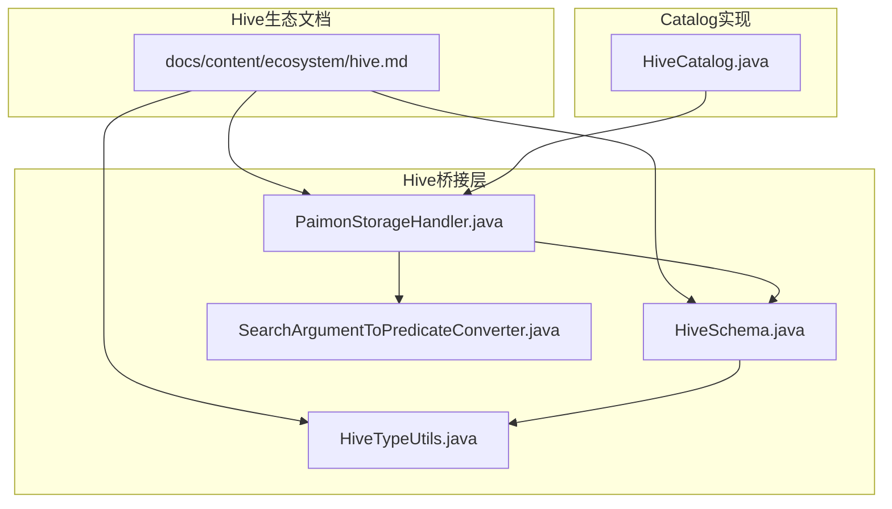
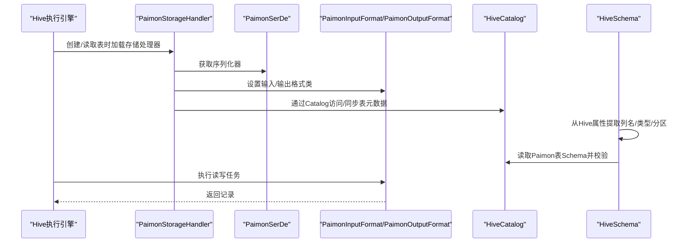
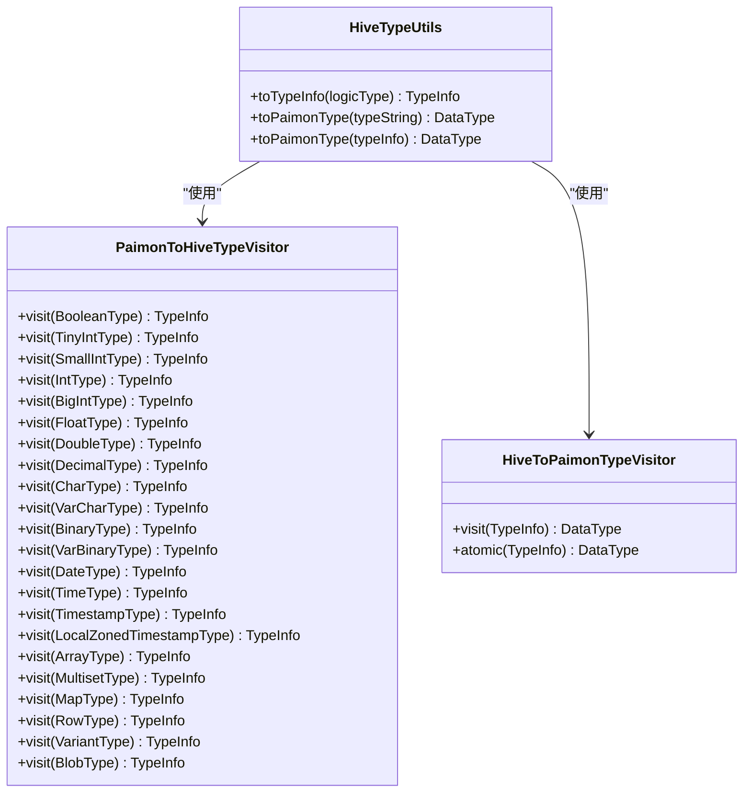
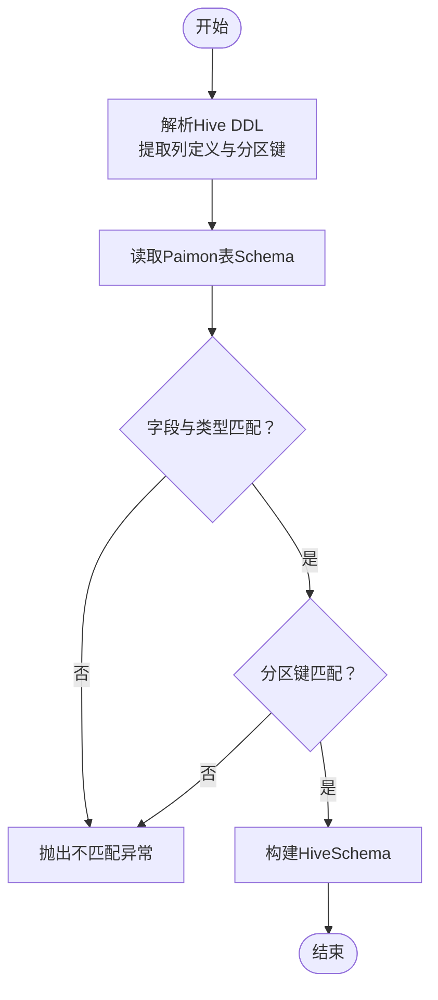
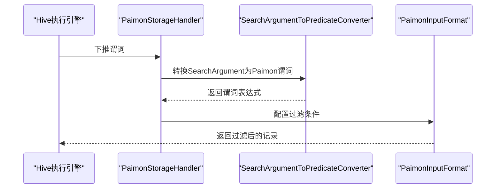
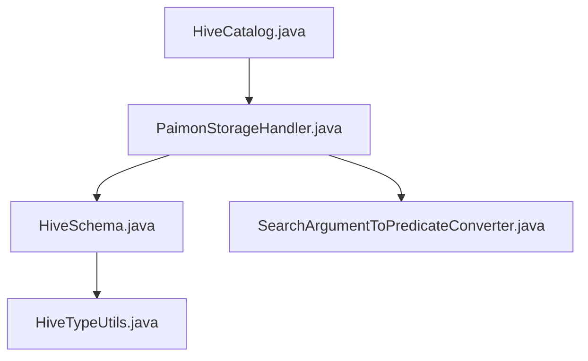

# Hive兼容性

<cite>
**本文引用的文件**
- [docs/content/ecosystem/hive.md](file://docs/content/ecosystem/hive.md)
- [paimon-hive/paimon-hive-common/src/main/java/org/apache/paimon/hive/HiveTypeUtils.java](file://paimon-hive/paimon-hive-common/src/main/java/org/apache/paimon/hive/HiveTypeUtils.java)
- [paimon-hive/paimon-hive-connector-common/src/main/java/org/apache/paimon/hive/PaimonStorageHandler.java](file://paimon-hive/paimon-hive-connector-common/src/main/java/org/apache/paimon/hive/PaimonStorageHandler.java)
- [paimon-hive/paimon-hive-connector-common/src/main/java/org/apache/paimon/hive/HiveSchema.java](file://paimon-hive/paimon-hive-connector-common/src/main/java/org/apache/paimon/hive/HiveSchema.java)
- [paimon-hive/paimon-hive-connector-common/src/main/java/org/apache/paimon/hive/SearchArgumentToPredicateConverter.java](file://paimon-hive/paimon-hive-connector-common/src/main/java/org/apache/paimon/hive/SearchArgumentToPredicateConverter.java)
- [paimon-hive/paimon-hive-connector-common/src/test/java/org/apache/paimon/hive/CreateTableITCase.java](file://paimon-hive/paimon-hive-connector-common/src/test/java/org/apache/paimon/hive/CreateTableITCase.java)
- [paimon-hive/paimon-hive-connector-2.3/src/test/java/org/apache/paimon/hive/Hive23CatalogITCase.java](file://paimon-hive/paimon-hive-connector-2.3/src/test/java/org/apache/paimon/hive/Hive23CatalogITCase.java)
- [paimon-hive/paimon-hive-catalog/src/main/java/org/apache/paimon/hive/HiveCatalog.java](file://paimon-hive/paimon-hive-catalog/src/main/java/org/apache/paimon/hive/HiveCatalog.java)
</cite>

## 目录
1. [简介](#简介)
2. [项目结构](#项目结构)
3. [核心组件](#核心组件)
4. [架构总览](#架构总览)
5. [详细组件分析](#详细组件分析)
6. [依赖分析](#依赖分析)
7. [性能考虑](#性能考虑)
8. [故障排查指南](#故障排查指南)
9. [结论](#结论)
10. [附录](#附录)

## 简介
本文件系统化梳理 Apache Paimon 与 Apache Hive 的兼容性，覆盖数据类型映射、分区管理、Hive 查询语法兼容、Hive 版本兼容矩阵、ACID 事务支持现状、常见限制与解决方案、以及 Hive 特定功能的实现状态与未来规划。文档以仓库中的官方文档与源码为依据，辅以图示帮助读者快速理解。

## 项目结构
围绕 Hive 兼容性的代码主要分布在以下模块：
- 文档：docs/content/ecosystem/hive.md
- 类型工具：paimon-hive-common 中的 HiveTypeUtils
- 存储处理器：paimon-hive-connector-common 中的 PaimonStorageHandler、HiveSchema
- 查询谓词转换：SearchArgumentToPredicateConverter
- 集成测试：paimon-hive-connector-common 与 paimon-hive-connector-2.3 的测试用例
- Hive Catalog 实现：paimon-hive-catalog 中的 HiveCatalog

**图表来源**
- [docs/content/ecosystem/hive.md:1-313](file://docs/content/ecosystem/hive.md#L1-L313)
- [paimon-hive/paimon-hive-connector-common/src/main/java/org/apache/paimon/hive/PaimonStorageHandler.java:1-138](file://paimon-hive/paimon-hive-connector-common/src/main/java/org/apache/paimon/hive/PaimonStorageHandler.java#L1-L138)
- [paimon-hive/paimon-hive-connector-common/src/main/java/org/apache/paimon/hive/HiveSchema.java:1-359](file://paimon-hive/paimon-hive-connector-common/src/main/java/org/apache/paimon/hive/HiveSchema.java#L1-L359)
- [paimon-hive/paimon-hive-common/src/main/java/org/apache/paimon/hive/HiveTypeUtils.java:1-315](file://paimon-hive/paimon-hive-common/src/main/java/org/apache/paimon/hive/HiveTypeUtils.java#L1-L315)
- [paimon-hive/paimon-hive-connector-common/src/main/java/org/apache/paimon/hive/SearchArgumentToPredicateConverter.java:143-179](file://paimon-hive/paimon-hive-connector-common/src/main/java/org/apache/paimon/hive/SearchArgumentToPredicateConverter.java#L143-L179)
- [paimon-hive/paimon-hive-catalog/src/main/java/org/apache/paimon/hive/HiveCatalog.java:1-200](file://paimon-hive/paimon-hive-catalog/src/main/java/org/apache/paimon/hive/HiveCatalog.java#L1-L200)

**章节来源**
- [docs/content/ecosystem/hive.md:1-313](file://docs/content/ecosystem/hive.md#L1-L313)

## 核心组件
- 类型映射工具：HiveTypeUtils 提供 Paimon 数据类型与 Hive TypeInfo 的双向转换，涵盖基本类型、字符串、日期时间、十进制、二进制、数组、映射、结构体等。
- 存储处理器：PaimonStorageHandler 作为 Hive StorageHandler 入口，负责输入输出格式、序列化反序列化、作业属性配置、谓词下推等。
- Hive 模式解析：HiveSchema 负责从 Hive SerDe 属性中提取列名、类型、注释、分区键等，并与 Paimon 表模式进行一致性校验。
- 查询谓词转换：SearchArgumentToPredicateConverter 将 Hive 的 SearchArgument 转换为 Paimon 的谓词表达式，支持等值、小于、小于等于、IN、BETWEEN、IS NULL 等操作符。
- Catalog 实现：HiveCatalog 将 Paimon 的表抽象映射到 Hive Metastore，负责表、库、分区的创建、列举与同步。

**章节来源**
- [paimon-hive/paimon-hive-common/src/main/java/org/apache/paimon/hive/HiveTypeUtils.java:68-315](file://paimon-hive/paimon-hive-common/src/main/java/org/apache/paimon/hive/HiveTypeUtils.java#L68-L315)
- [paimon-hive/paimon-hive-connector-common/src/main/java/org/apache/paimon/hive/PaimonStorageHandler.java:44-138](file://paimon-hive/paimon-hive-connector-common/src/main/java/org/apache/paimon/hive/PaimonStorageHandler.java#L44-L138)
- [paimon-hive/paimon-hive-connector-common/src/main/java/org/apache/paimon/hive/HiveSchema.java:64-359](file://paimon-hive/paimon-hive-connector-common/src/main/java/org/apache/paimon/hive/HiveSchema.java#L64-L359)
- [paimon-hive/paimon-hive-connector-common/src/main/java/org/apache/paimon/hive/SearchArgumentToPredicateConverter.java:143-179](file://paimon-hive/paimon-hive-connector-common/src/main/java/org/apache/paimon/hive/SearchArgumentToPredicateConverter.java#L143-L179)
- [paimon-hive/paimon-hive-catalog/src/main/java/org/apache/paimon/hive/HiveCatalog.java:131-200](file://paimon-hive/paimon-hive-catalog/src/main/java/org/apache/paimon/hive/HiveCatalog.java#L131-L200)

## 架构总览
下图展示了 Hive 通过 Paimon StorageHandler 访问 Paimon 表的关键交互路径：Hive 解析 DDL/DML，StorageHandler 配置作业属性，SerDe 进行序列化，InputFormat/OutputFormat 读写文件，Catalog/Schema 负责元数据与模式校验。

**图表来源**
- [paimon-hive/paimon-hive-connector-common/src/main/java/org/apache/paimon/hive/PaimonStorageHandler.java:44-138](file://paimon-hive/paimon-hive-connector-common/src/main/java/org/apache/paimon/hive/PaimonStorageHandler.java#L44-L138)
- [paimon-hive/paimon-hive-connector-common/src/main/java/org/apache/paimon/hive/HiveSchema.java:96-193](file://paimon-hive/paimon-hive-connector-common/src/main/java/org/apache/paimon/hive/HiveSchema.java#L96-L193)
- [paimon-hive/paimon-hive-catalog/src/main/java/org/apache/paimon/hive/HiveCatalog.java:131-200](file://paimon-hive/paimon-hive-catalog/src/main/java/org/apache/paimon/hive/HiveCatalog.java#L131-L200)

## 详细组件分析

### 数据类型映射机制
- 映射范围：Hive 的基本类型（布尔、整数、浮点、定点数、字符、变长字符、日期、时间戳、二进制）与 Paimon 的对应类型；复合类型（结构体、映射、数组）亦有明确映射。
- 精度与长度处理：
  - 十进制：Hive DecimalTypeInfo 的精度与刻度直接映射到 Paimon DecimalType。
  - 字符串：Hive Char/Varchar 的长度超过上限时回退到 Hive string 或 Paimon VarChar 最大长度。
  - 时间戳：Hive timestamp 与 Paimon timestamp with local time zone 在部分场景下兼容。
- 不支持类型：当遇到不支持的类型时会抛出异常，需在建表或外部表定义时规避。

**图表来源**
- [paimon-hive/paimon-hive-common/src/main/java/org/apache/paimon/hive/HiveTypeUtils.java:68-315](file://paimon-hive/paimon-hive-common/src/main/java/org/apache/paimon/hive/HiveTypeUtils.java#L68-L315)

**章节来源**
- [docs/content/ecosystem/hive.md:212-313](file://docs/content/ecosystem/hive.md#L212-L313)
- [paimon-hive/paimon-hive-common/src/main/java/org/apache/paimon/hive/HiveTypeUtils.java:77-100](file://paimon-hive/paimon-hive-common/src/main/java/org/apache/paimon/hive/HiveTypeUtils.java#L77-L100)
- [paimon-hive/paimon-hive-common/src/main/java/org/apache/paimon/hive/HiveTypeUtils.java:142-163](file://paimon-hive/paimon-hive-common/src/main/java/org/apache/paimon/hive/HiveTypeUtils.java#L142-L163)
- [paimon-hive/paimon-hive-common/src/main/java/org/apache/paimon/hive/HiveTypeUtils.java:273-312](file://paimon-hive/paimon-hive-common/src/main/java/org/apache/paimon/hive/HiveTypeUtils.java#L273-L312)

### 分区管理兼容性
- 分区键映射：Hive DDL 中的分区键与 Paimon 表的 partitionKeys 对应；当同时存在 Hive DDL 和 Paimon Schema 时，会进行字段与分区键的一致性校验。
- 分区值处理：Hive 外部表可通过 LOCATION 或 TBLPROPERTIES(paimon_location) 指向 Paimon 表位置；对于对象存储场景，建议使用 paimon_location 避免 Hive 自身文件系统访问。
- 分区发现：HiveCatalog 在需要时可从文件系统列举分区，但具体行为受 Hive 版本与配置影响。

**图表来源**
- [paimon-hive/paimon-hive-connector-common/src/main/java/org/apache/paimon/hive/HiveSchema.java:216-357](file://paimon-hive/paimon-hive-connector-common/src/main/java/org/apache/paimon/hive/HiveSchema.java#L216-L357)

**章节来源**
- [docs/content/ecosystem/hive.md:163-211](file://docs/content/ecosystem/hive.md#L163-L211)
- [paimon-hive/paimon-hive-connector-common/src/main/java/org/apache/paimon/hive/HiveSchema.java:96-193](file://paimon-hive/paimon-hive-connector-common/src/main/java/org/apache/paimon/hive/HiveSchema.java#L96-L193)
- [paimon-hive/paimon-hive-connector-common/src/test/java/org/apache/paimon/hive/CreateTableITCase.java:156-200](file://paimon-hive/paimon-hive-connector-common/src/test/java/org/apache/paimon/hive/CreateTableITCase.java#L156-L200)

### Hive 查询语法兼容性
- SQL 方言：官方文档提供在 Hive CLI 中使用 Paimon 表的示例，包括 SHOW TABLES、SELECT、INSERT INTO 等。
- 函数映射与表达式转换：SearchArgumentToPredicateConverter 支持将 Hive 的 SearchArgument 转换为 Paimon 谓词，覆盖等值、小于、小于等于、IN、BETWEEN、IS NULL 等常用操作符。
- 已知限制：文档提示某些 Hive CBO 场景可能导致查询结果不正确，例如对 struct 类型的非空谓词；建议在该场景禁用 CBO。

**图表来源**
- [paimon-hive/paimon-hive-connector-common/src/main/java/org/apache/paimon/hive/SearchArgumentToPredicateConverter.java:143-179](file://paimon-hive/paimon-hive-connector-common/src/main/java/org/apache/paimon/hive/SearchArgumentToPredicateConverter.java#L143-L179)
- [paimon-hive/paimon-hive-connector-common/src/main/java/org/apache/paimon/hive/PaimonStorageHandler.java:130-136](file://paimon-hive/paimon-hive-connector-common/src/main/java/org/apache/paimon/hive/PaimonStorageHandler.java#L130-L136)

**章节来源**
- [docs/content/ecosystem/hive.md:89-144](file://docs/content/ecosystem/hive.md#L89-L144)
- [docs/content/ecosystem/hive.md:82-88](file://docs/content/ecosystem/hive.md#L82-L88)
- [paimon-hive/paimon-hive-connector-common/src/main/java/org/apache/paimon/hive/SearchArgumentToPredicateConverter.java:143-179](file://paimon-hive/paimon-hive-connector-common/src/main/java/org/apache/paimon/hive/SearchArgumentToPredicateConverter.java#L143-L179)

### Hive 版本兼容性矩阵与已知限制
- 支持版本：Hive 3.1、2.3、2.2、2.1、2.1-cdh-6.3。
- 执行引擎：Hive 读支持 MR 与 Tez；Hive 写支持 MR。
- 安装与环境：建议将 paimon-hive-connector jar 放入 Hive 的 auxlib；若使用 MR 执行且运行连接查询，可能遇到类加载异常，不推荐使用 add jar 动态加载。
- CBO 注意：启用 CBO 可能导致某些查询（如 struct 非空谓词）出现不正确结果，建议禁用 CBO。

**章节来源**
- [docs/content/ecosystem/hive.md:31-88](file://docs/content/ecosystem/hive.md#L31-L88)

### ACID 事务支持情况与限制
- 测试配置：在 Hive 2.3 集成测试中，通过设置事务管理器与并发参数来准备 ACID 表所需的环境。
- 现状说明：仓库未提供 ACID 表的建表与写入示例，表明当前集成侧重于读写与模式兼容，ACID 语义支持尚未在文档与示例中明确给出。

**章节来源**
- [paimon-hive/paimon-hive-connector-2.3/src/test/java/org/apache/paimon/hive/Hive23CatalogITCase.java:42-57](file://paimon-hive/paimon-hive-connector-2.3/src/test/java/org/apache/paimon/hive/Hive23CatalogITCase.java#L42-L57)

### 具体类型转换示例与查询兼容性测试结果
- 类型转换示例：官方文档提供了 Hive 到 Paimon 的类型对照表，覆盖结构体、映射、数组、基本数值、定点数、字符、变长字符、日期、时间戳、二进制等。
- 查询兼容性测试：官方文档提供了在 Hive CLI 中对 Paimon 表进行读取、插入、时间旅行查询的示例，验证了基本 SQL 的兼容性。

**章节来源**
- [docs/content/ecosystem/hive.md:212-313](file://docs/content/ecosystem/hive.md#L212-L313)
- [docs/content/ecosystem/hive.md:89-144](file://docs/content/ecosystem/hive.md#L89-L144)

### 兼容性问题的解决方案与替代方案
- Schema 不一致：当 Hive DDL 与 Paimon Schema 不一致时，会抛出异常；建议在创建外部表时不显式声明列定义，让 Hive 从 Paimon 表位置读取 Schema。
- CBO 导致的查询异常：在涉及 struct 非空谓词等场景，建议临时关闭 CBO。
- 对象存储场景：使用 TBLPROPERTIES('paimon_location') 指向对象存储路径，避免 Hive 使用其自身文件系统访问。

**章节来源**
- [paimon-hive/paimon-hive-connector-common/src/main/java/org/apache/paimon/hive/HiveSchema.java:151-193](file://paimon-hive/paimon-hive-connector-common/src/main/java/org/apache/paimon/hive/HiveSchema.java#L151-L193)
- [docs/content/ecosystem/hive.md:82-88](file://docs/content/ecosystem/hive.md#L82-L88)
- [docs/content/ecosystem/hive.md:163-186](file://docs/content/ecosystem/hive.md#L163-L186)

### Hive 特定功能的实现状态与未来计划
- 实现状态：类型映射、外部表注册、DDL/DML 基本兼容、谓词下推、分区键映射与校验、Schema 读取与一致性检查。
- 未来计划：仓库未披露明确的未来计划；建议关注官方发布说明与社区讨论以获取最新进展。

**章节来源**
- [paimon-hive/paimon-hive-connector-common/src/main/java/org/apache/paimon/hive/HiveSchema.java:96-193](file://paimon-hive/paimon-hive-connector-common/src/main/java/org/apache/paimon/hive/HiveSchema.java#L96-L193)
- [paimon-hive/paimon-hive-connector-common/src/main/java/org/apache/paimon/hive/PaimonStorageHandler.java:44-138](file://paimon-hive/paimon-hive-connector-common/src/main/java/org/apache/paimon/hive/PaimonStorageHandler.java#L44-L138)

## 依赖分析
- 组件耦合：HiveTypeUtils 为类型转换的核心工具；HiveSchema 依赖 HiveTypeUtils 进行类型解析与校验；PaimonStorageHandler 依赖 HiveSchema 与 Catalog；SearchArgumentToPredicateConverter 为谓词下推提供支撑。
- 外部依赖：Hive SerDe、TypeInfo、InputFormat/OutputFormat、Metastore 客户端等。

**图表来源**
- [paimon-hive/paimon-hive-common/src/main/java/org/apache/paimon/hive/HiveTypeUtils.java:68-315](file://paimon-hive/paimon-hive-common/src/main/java/org/apache/paimon/hive/HiveTypeUtils.java#L68-L315)
- [paimon-hive/paimon-hive-connector-common/src/main/java/org/apache/paimon/hive/HiveSchema.java:64-359](file://paimon-hive/paimon-hive-connector-common/src/main/java/org/apache/paimon/hive/HiveSchema.java#L64-L359)
- [paimon-hive/paimon-hive-connector-common/src/main/java/org/apache/paimon/hive/PaimonStorageHandler.java:44-138](file://paimon-hive/paimon-hive-connector-common/src/main/java/org/apache/paimon/hive/PaimonStorageHandler.java#L44-L138)
- [paimon-hive/paimon-hive-connector-common/src/main/java/org/apache/paimon/hive/SearchArgumentToPredicateConverter.java:143-179](file://paimon-hive/paimon-hive-connector-common/src/main/java/org/apache/paimon/hive/SearchArgumentToPredicateConverter.java#L143-L179)
- [paimon-hive/paimon-hive-catalog/src/main/java/org/apache/paimon/hive/HiveCatalog.java:131-200](file://paimon-hive/paimon-hive-catalog/src/main/java/org/apache/paimon/hive/HiveCatalog.java#L131-L200)

**章节来源**
- [paimon-hive/paimon-hive-common/src/main/java/org/apache/paimon/hive/HiveTypeUtils.java:68-315](file://paimon-hive/paimon-hive-common/src/main/java/org/apache/paimon/hive/HiveTypeUtils.java#L68-L315)
- [paimon-hive/paimon-hive-connector-common/src/main/java/org/apache/paimon/hive/HiveSchema.java:64-359](file://paimon-hive/paimon-hive-connector-common/src/main/java/org/apache/paimon/hive/HiveSchema.java#L64-L359)
- [paimon-hive/paimon-hive-connector-common/src/main/java/org/apache/paimon/hive/PaimonStorageHandler.java:44-138](file://paimon-hive/paimon-hive-connector-common/src/main/java/org/apache/paimon/hive/PaimonStorageHandler.java#L44-L138)
- [paimon-hive/paimon-hive-connector-common/src/main/java/org/apache/paimon/hive/SearchArgumentToPredicateConverter.java:143-179](file://paimon-hive/paimon-hive-connector-common/src/main/java/org/apache/paimon/hive/SearchArgumentToPredicateConverter.java#L143-L179)
- [paimon-hive/paimon-hive-catalog/src/main/java/org/apache/paimon/hive/HiveCatalog.java:131-200](file://paimon-hive/paimon-hive-catalog/src/main/java/org/apache/paimon/hive/HiveCatalog.java#L131-L200)

## 性能考虑
- 小文件风险：官方文档建议写入非主键表，避免主键表写入产生大量小文件。
- Split 大小：HDFS 环境下可通过配置禁用默认配置加载以减小 split 大小。
- CBO 影响：在某些查询场景下禁用 CBO 可避免不正确的结果，从而减少不必要的重试与错误开销。

**章节来源**
- [docs/content/ecosystem/hive.md:82-88](file://docs/content/ecosystem/hive.md#L82-L88)
- [docs/content/ecosystem/hive.md:115-120](file://docs/content/ecosystem/hive.md#L115-L120)

## 故障排查指南
- Schema 文件缺失：创建外部表但目标位置缺少 Schema 文件时会报错，需先创建 Paimon 表再注册为外部表。
- DDL 与 Schema 不一致：当 Hive DDL 与 Paimon Schema 字段或分区键不一致时会抛出异常；建议移除 Hive DDL 中的列定义，让 Hive 从 Paimon 读取。
- CBO 异常：遇到 struct 非空谓词等查询异常时，尝试禁用 CBO。
- 类加载异常：使用 MR 执行连接查询时可能出现类加载问题，建议使用 auxlib 方式引入 jar 并重启集群。

**章节来源**
- [paimon-hive/paimon-hive-connector-common/src/test/java/org/apache/paimon/hive/CreateTableITCase.java:62-78](file://paimon-hive/paimon-hive-connector-common/src/test/java/org/apache/paimon/hive/CreateTableITCase.java#L62-L78)
- [paimon-hive/paimon-hive-connector-common/src/main/java/org/apache/paimon/hive/HiveSchema.java:151-193](file://paimon-hive/paimon-hive-connector-common/src/main/java/org/apache/paimon/hive/HiveSchema.java#L151-L193)
- [docs/content/ecosystem/hive.md:82-88](file://docs/content/ecosystem/hive.md#L82-L88)

## 结论
Paimon 与 Hive 的兼容性在类型映射、外部表注册、DDL/DML 基本操作、分区键映射与校验、谓词下推等方面已具备良好基础。官方文档明确了支持的 Hive 版本、执行引擎、安装方式与若干已知限制。ACID 事务支持在测试中可见准备步骤，但未在文档与示例中明确给出完整能力说明。建议在生产环境中优先采用“外部表 + 从 Paimon 读取 Schema”的方式，避免 DDL 与 Schema 不一致带来的问题，并根据查询场景调整 CBO 与执行策略以获得稳定的结果与性能。

## 附录
- 官方文档：Hive 兼容性与使用示例
- 关键实现：类型工具、存储处理器、Schema 解析、谓词转换、Catalog 实现

**章节来源**
- [docs/content/ecosystem/hive.md:1-313](file://docs/content/ecosystem/hive.md#L1-L313)
- [paimon-hive/paimon-hive-common/src/main/java/org/apache/paimon/hive/HiveTypeUtils.java:68-315](file://paimon-hive/paimon-hive-common/src/main/java/org/apache/paimon/hive/HiveTypeUtils.java#L68-L315)
- [paimon-hive/paimon-hive-connector-common/src/main/java/org/apache/paimon/hive/PaimonStorageHandler.java:44-138](file://paimon-hive/paimon-hive-connector-common/src/main/java/org/apache/paimon/hive/PaimonStorageHandler.java#L44-L138)
- [paimon-hive/paimon-hive-connector-common/src/main/java/org/apache/paimon/hive/HiveSchema.java:64-359](file://paimon-hive/paimon-hive-connector-common/src/main/java/org/apache/paimon/hive/HiveSchema.java#L64-L359)
- [paimon-hive/paimon-hive-connector-common/src/main/java/org/apache/paimon/hive/SearchArgumentToPredicateConverter.java:143-179](file://paimon-hive/paimon-hive-connector-common/src/main/java/org/apache/paimon/hive/SearchArgumentToPredicateConverter.java#L143-L179)
- [paimon-hive/paimon-hive-catalog/src/main/java/org/apache/paimon/hive/HiveCatalog.java:131-200](file://paimon-hive/paimon-hive-catalog/src/main/java/org/apache/paimon/hive/HiveCatalog.java#L131-L200)