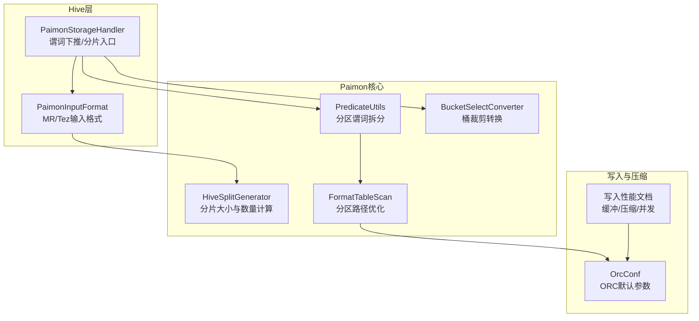
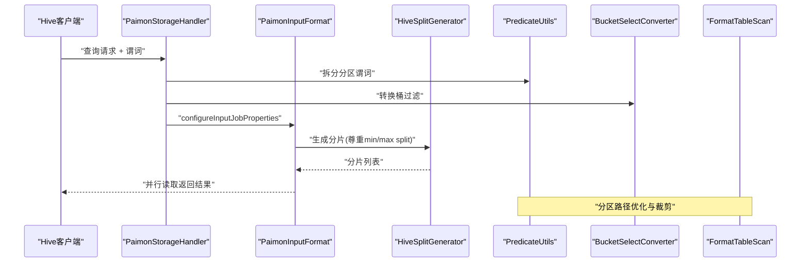
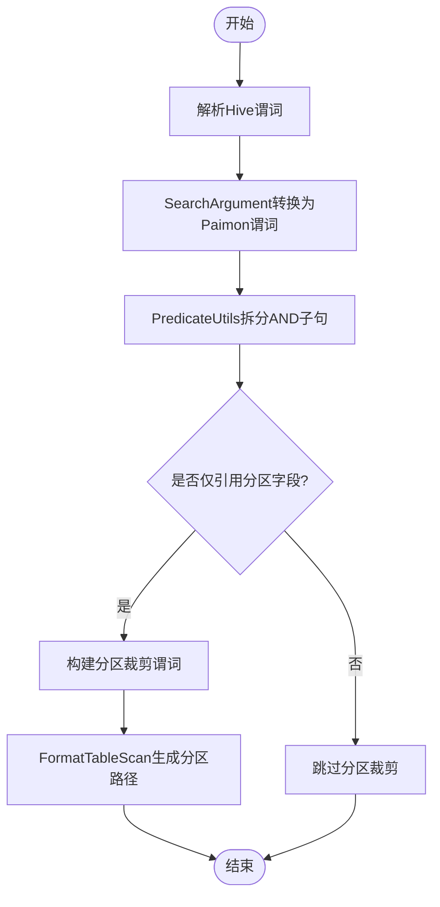
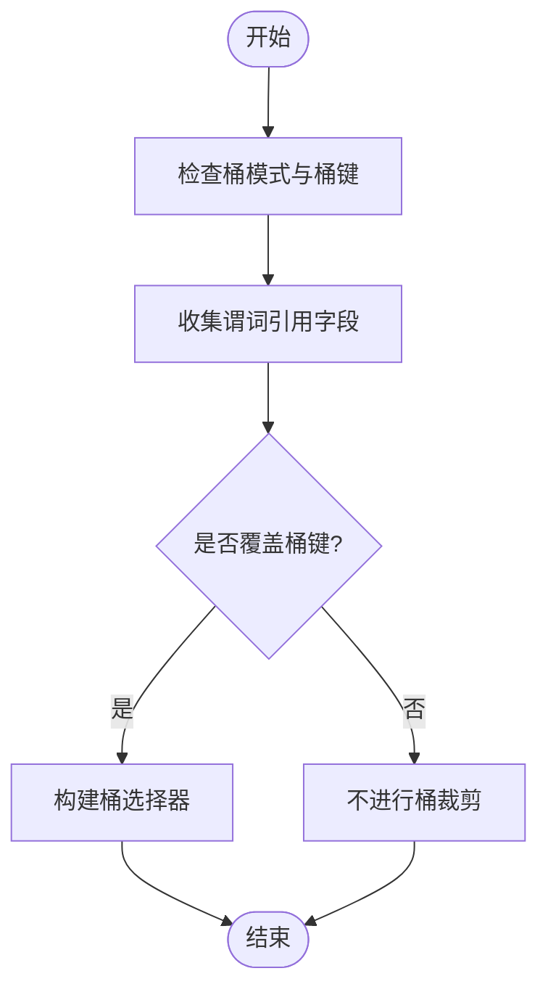
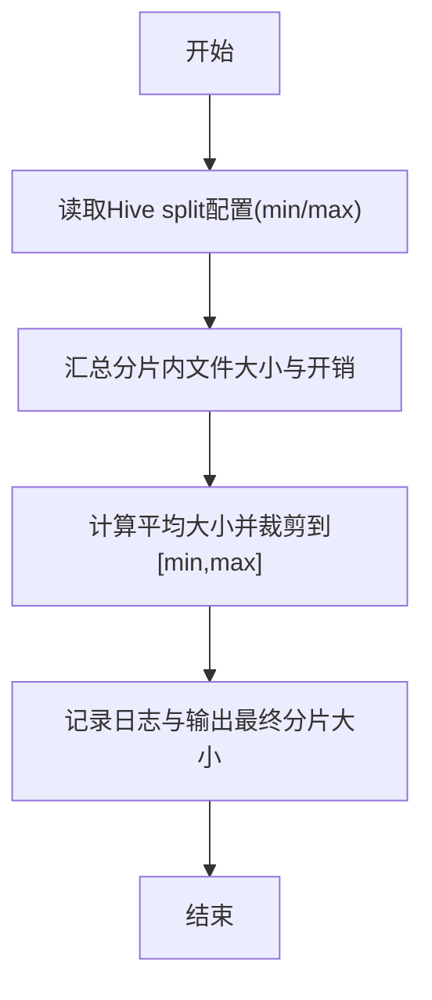
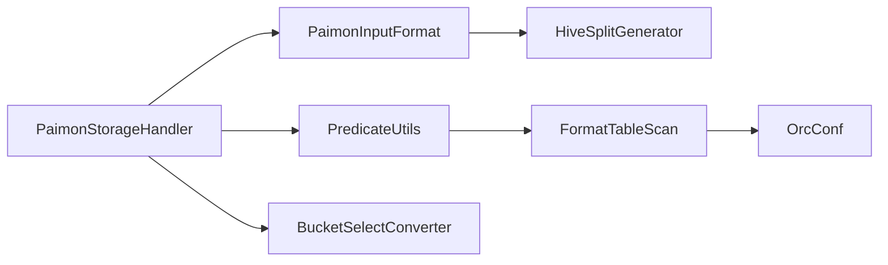

# Hive性能优化

<cite>
**本文引用的文件**
- [hive.md](file://docs/content/ecosystem/hive.md)
- [write-performance.md](file://docs/content/maintenance/write-performance.md)
- [query-performance.md](file://docs/content/primary-key-table/query-performance.md)
- [metrics.md](file://docs/content/maintenance/metrics.md)
- [PaimonStorageHandler.java](file://paimon-hive/paimon-hive-connector-common/src/main/java/org/apache/paimon/hive/PaimonStorageHandler.java)
- [PaimonInputFormat.java](file://paimon-hive/paimon-hive-connector-common/src/main/java/org/apache/paimon/hive/mapred/PaimonInputFormat.java)
- [HiveSplitGenerator.java](file://paimon-hive/paimon-hive-connector-common/src/main/java/org/apache/paimon/hive/utils/HiveSplitGenerator.java)
- [SearchArgumentToPredicateConverter.java](file://paimon-hive/paimon-hive-connector-common/src/main/java/org/apache/paimon/hive/SearchArgumentToPredicateConverter.java)
- [PredicateUtils.java](file://paimon-core/src/main/java/org/apache/paimon/table/format/predicate/PredicateUtils.java)
- [BucketSelectConverter.java](file://paimon-core/src/main/java/org/apache/paimon/operation/BucketSelectConverter.java)
- [FormatTableScan.java](file://paimon-core/src/main/java/org/apache/paimon/table/format/FormatTableScan.java)
- [OrcConf.java](file://paimon-format/src/main/java/org/apache/orc/OrcConf.java)
- [HiveConnectorOptions.java](file://paimon-hive/paimon-hive-connector-common/src/main/java/org/apache/paimon/hive/HiveConnectorOptions.java)
- [HiveCatalogOptions.java](file://paimon-hive/paimon-hive-catalog/src/main/java/org/apache/paimon/hive/HiveCatalogOptions.java)
- [PaimonEmbeddedHiveServerContext.java](file://paimon-hive/paimon-hive-connector-common/src/test/java/org/apache/paimon/hive/runner/PaimonEmbeddedHiveServerContext.java)
- [BenchmarkMetric.java](file://paimon-benchmark/paimon-cluster-benchmark/src/main/java/org/apache/paimon/benchmark/metric/BenchmarkMetric.java)
- [JobBenchmarkMetric.java](file://paimon-benchmark/paimon-cluster-benchmark/src/main/java/org/apache/paimon/benchmark/metric/JobBenchmarkMetric.java)
- [MetricReporter.java](file://paimon-benchmark/paimon-cluster-benchmark/src/main/java/org/apache/paimon/benchmark/metric/MetricReporter.java)
</cite>

## 目录
1. [简介](#简介)
2. [项目结构](#项目结构)
3. [核心组件](#核心组件)
4. [架构总览](#架构总览)
5. [详细组件分析](#详细组件分析)
6. [依赖分析](#依赖分析)
7. [性能考虑](#性能考虑)
8. [故障排查指南](#故障排查指南)
9. [结论](#结论)
10. [附录](#附录)

## 简介
本文件面向在Hive中使用Apache Paimon的用户，系统化梳理查询与写入性能优化策略，覆盖谓词下推、分区裁剪、桶裁剪、列裁剪、并行度与分片、缓冲区与压缩、以及Hive执行计划与监控诊断。文档结合源码与官方文档，给出可操作的参数配置与调优建议，并提供不同数据规模下的优化策略与基准测试指标说明。

## 项目结构
围绕Hive集成与性能优化，关键模块与职责如下：
- Hive存储处理器与输入格式：负责Hive侧的谓词下推、分片生成与MR/Tez执行引擎对接
- 核心谓词与分区裁剪：在Paimon内部进行分区过滤、桶过滤与谓词拆分
- 写入性能与压缩：文件格式选择、压缩级别、写缓冲与并发策略
- 指标与监控：扫描、提交、写缓冲、合并等多维度指标
- 基准测试：聚合RPS、CPU核效、数据新鲜度等指标

**图表来源**
- [PaimonStorageHandler.java:45-137](file://paimon-hive/paimon-hive-connector-common/src/main/java/org/apache/paimon/hive/PaimonStorageHandler.java#L45-L137)
- [PaimonInputFormat.java:40-54](file://paimon-hive/paimon-hive-connector-common/src/main/java/org/apache/paimon/hive/mapred/PaimonInputFormat.java#L40-L54)
- [HiveSplitGenerator.java:234-262](file://paimon-hive/paimon-hive-connector-common/src/main/java/org/apache/paimon/hive/utils/HiveSplitGenerator.java#L234-L262)
- [PredicateUtils.java:40-68](file://paimon-core/src/main/java/org/apache/paimon/table/format/predicate/PredicateUtils.java#L40-L68)
- [BucketSelectConverter.java:55-72](file://paimon-core/src/main/java/org/apache/paimon/operation/BucketSelectConverter.java#L55-L72)
- [FormatTableScan.java:234-260](file://paimon-core/src/main/java/org/apache/paimon/table/format/FormatTableScan.java#L234-L260)
- [OrcConf.java:65-96](file://paimon-format/src/main/java/org/apache/orc/OrcConf.java#L65-L96)
- [write-performance.md:1-164](file://docs/content/maintenance/write-performance.md#L1-L164)

**章节来源**
- [hive.md:31-88](file://docs/content/ecosystem/hive.md#L31-L88)

## 核心组件
- 存储处理器与谓词下推
  - PaimonStorageHandler作为Hive StorageHandler入口，提供谓词下推能力（decomposePredicate），将Hive谓词传递给Paimon执行层
  - SearchArgumentToPredicateConverter将Hive SearchArgument转换为Paimon内部谓词，支持AND/OR/NOT与叶子谓词映射
- 分区裁剪与路径优化
  - PredicateUtils对分区字段进行谓词拆分，按分区字段聚合，仅保留能用于分区裁剪的子表达式
  - FormatTableScan根据等值分区前缀生成具体分区路径，减少扫描层级
- 桶裁剪
  - BucketSelectConverter基于桶键与桶模式，将可下推的桶过滤条件转换为文件级跳过策略
- 分片与并行度
  - HiveSplitGenerator依据Hive split大小参数与文件开销估算，计算合理分片大小与数量；支持尊重Hive最小/最大split配置
- 写入性能与压缩
  - 写入性能文档提供缓冲、压缩、并发、本地合并等调优要点；ORC默认参数影响写入内存与压缩效率

**章节来源**
- [PaimonStorageHandler.java:130-136](file://paimon-hive/paimon-hive-connector-common/src/main/java/org/apache/paimon/hive/PaimonStorageHandler.java#L130-L136)
- [SearchArgumentToPredicateConverter.java:106-141](file://paimon-hive/paimon-hive-connector-common/src/main/java/org/apache/paimon/hive/SearchArgumentToPredicateConverter.java#L106-L141)
- [PredicateUtils.java:40-68](file://paimon-core/src/main/java/org/apache/paimon/table/format/predicate/PredicateUtils.java#L40-L68)
- [FormatTableScan.java:234-260](file://paimon-core/src/main/java/org/apache/paimon/table/format/FormatTableScan.java#L234-L260)
- [BucketSelectConverter.java:55-72](file://paimon-core/src/main/java/org/apache/paimon/operation/BucketSelectConverter.java#L55-L72)
- [HiveSplitGenerator.java:234-262](file://paimon-hive/paimon-hive-connector-common/src/main/java/org/apache/paimon/hive/utils/HiveSplitGenerator.java#L234-L262)
- [write-performance.md:85-108](file://docs/content/maintenance/write-performance.md#L85-L108)
- [OrcConf.java:65-96](file://paimon-format/src/main/java/org/apache/orc/OrcConf.java#L65-L96)

## 架构总览
Hive查询到Paimon读取的关键流程：
- Hive解析SQL，通过PaimonStorageHandler进行谓词下推与分片生成
- Paimon内部利用分区裁剪与桶裁剪进一步缩小扫描范围
- MR/Tez执行引擎并行读取分片，返回结果

**图表来源**
- [PaimonStorageHandler.java:80-104](file://paimon-hive/paimon-hive-connector-common/src/main/java/org/apache/paimon/hive/PaimonStorageHandler.java#L80-L104)
- [PaimonInputFormat.java:42-53](file://paimon-hive/paimon-hive-connector-common/src/main/java/org/apache/paimon/hive/mapred/PaimonInputFormat.java#L42-L53)
- [HiveSplitGenerator.java:234-262](file://paimon-hive/paimon-hive-connector-common/src/main/java/org/apache/paimon/hive/utils/HiveSplitGenerator.java#L234-L262)
- [PredicateUtils.java:40-68](file://paimon-core/src/main/java/org/apache/paimon/table/format/predicate/PredicateUtils.java#L40-L68)
- [BucketSelectConverter.java:55-72](file://paimon-core/src/main/java/org/apache/paimon/operation/BucketSelectConverter.java#L55-L72)
- [FormatTableScan.java:234-260](file://paimon-core/src/main/java/org/apache/paimon/table/format/FormatTableScan.java#L234-L260)

## 详细组件分析

### 组件A：谓词下推与分区裁剪
- Hive侧下推
  - PaimonStorageHandler提供decomposePredicate，将Hive谓词原样或部分下推至Paimon执行层
  - SearchArgumentToPredicateConverter将Hive SearchArgument树转换为Paimon谓词，支持AND/OR/NOT与叶子谓词映射
- Paimon侧裁剪
  - PredicateUtils按分区字段拆分AND子句，仅保留仅引用单一分区字段的谓词，用于分区裁剪
  - FormatTableScan提取等值分区前缀，生成具体分区路径，降低扫描层级

**图表来源**
- [SearchArgumentToPredicateConverter.java:106-141](file://paimon-hive/paimon-hive-connector-common/src/main/java/org/apache/paimon/hive/SearchArgumentToPredicateConverter.java#L106-L141)
- [PredicateUtils.java:40-68](file://paimon-core/src/main/java/org/apache/paimon/table/format/predicate/PredicateUtils.java#L40-L68)
- [FormatTableScan.java:234-260](file://paimon-core/src/main/java/org/apache/paimon/table/format/FormatTableScan.java#L234-L260)

**章节来源**
- [PaimonStorageHandler.java:130-136](file://paimon-hive/paimon-hive-connector-common/src/main/java/org/apache/paimon/hive/PaimonStorageHandler.java#L130-L136)
- [SearchArgumentToPredicateConverter.java:106-141](file://paimon-hive/paimon-hive-connector-common/src/main/java/org/apache/paimon/hive/SearchArgumentToPredicateConverter.java#L106-L141)
- [PredicateUtils.java:40-68](file://paimon-core/src/main/java/org/apache/paimon/table/format/predicate/PredicateUtils.java#L40-L68)
- [FormatTableScan.java:234-260](file://paimon-core/src/main/java/org/apache/paimon/table/format/FormatTableScan.java#L234-L260)

### 组件B：桶裁剪
- BucketSelectConverter基于桶模式与桶键，判断谓词是否可下推至桶级过滤
- 若满足条件，生成桶选择器，用于跳过不匹配的桶文件，减少IO

**图表来源**
- [BucketSelectConverter.java:55-72](file://paimon-core/src/main/java/org/apache/paimon/operation/BucketSelectConverter.java#L55-L72)

**章节来源**
- [BucketSelectConverter.java:55-72](file://paimon-core/src/main/java/org/apache/paimon/operation/BucketSelectConverter.java#L55-L72)

### 组件C：分片与并行度
- HiveSplitGenerator依据Hive split大小参数与文件开销估算，计算合理分片大小与数量
- HiveConnectorOptions提供paimon.respect.minmaxsplitsize.enabled与paimon.split.openfilecost，控制是否尊重Hive split配置及文件打开成本

**图表来源**
- [HiveSplitGenerator.java:234-262](file://paimon-hive/paimon-hive-connector-common/src/main/java/org/apache/paimon/hive/utils/HiveSplitGenerator.java#L234-L262)
- [HiveConnectorOptions.java:28-40](file://paimon-hive/paimon-hive-connector-common/src/main/java/org/apache/paimon/hive/HiveConnectorOptions.java#L28-L40)

**章节来源**
- [HiveSplitGenerator.java:234-262](file://paimon-hive/paimon-hive-connector-common/src/main/java/org/apache/paimon/hive/utils/HiveSplitGenerator.java#L234-L262)
- [HiveConnectorOptions.java:28-40](file://paimon-hive/paimon-hive-connector-common/src/main/java/org/apache/paimon/hive/HiveConnectorOptions.java#L28-L40)

### 组件D：写入性能与压缩
- 文件格式与统计
  - 文档建议在追求极致写入与合并性能时可启用AVRO行式格式，并关闭统计信息
  - 可指定特定层级使用AVRO以平衡查询与写入
- 压缩
  - 默认zstd级别1，可根据需求调整zstd压缩级别，但会牺牲读写速度
- 写缓冲与内存
  - 提供write-buffer-size、write-buffer-spillable、local-merge-buffer-size等参数
  - 针对ORC/Parquet字典编码可配置禁用策略以缓解大列场景内存压力
- 并发与稳定性
  - sink.parallelism建议与桶数相当或小于桶数
  - checkpoint间隔、并发与超时需配合写入吞吐与稳定性需求调整

**章节来源**
- [write-performance.md:85-164](file://docs/content/maintenance/write-performance.md#L85-L164)
- [OrcConf.java:65-96](file://paimon-format/src/main/java/org/apache/orc/OrcConf.java#L65-L96)

### 组件E：查询性能与索引
- 聚合下推与主键过滤
  - 支持COUNT/*等聚合下推；主键过滤可显著减少文件扫描
- 文件索引
  - 支持BloomFilter/Bitmap/Range Bitmap等文件索引，加速点查与范围过滤
- 桶连接
  - 固定桶表在批查询中可避免shuffle，提升连接性能

**章节来源**
- [query-performance.md:39-105](file://docs/content/primary-key-table/query-performance.md#L39-L105)

## 依赖分析
- Hive层依赖Paimon输入格式与分片生成器
- Paimon核心依赖谓词工具与扫描优化
- 写入路径依赖文件格式默认参数与写入性能配置

**图表来源**
- [PaimonStorageHandler.java:45-137](file://paimon-hive/paimon-hive-connector-common/src/main/java/org/apache/paimon/hive/PaimonStorageHandler.java#L45-L137)
- [PaimonInputFormat.java:40-54](file://paimon-hive/paimon-hive-connector-common/src/main/java/org/apache/paimon/hive/mapred/PaimonInputFormat.java#L40-L54)
- [HiveSplitGenerator.java:234-262](file://paimon-hive/paimon-hive-connector-common/src/main/java/org/apache/paimon/hive/utils/HiveSplitGenerator.java#L234-L262)
- [PredicateUtils.java:40-68](file://paimon-core/src/main/java/org/apache/paimon/table/format/predicate/PredicateUtils.java#L40-L68)
- [BucketSelectConverter.java:55-72](file://paimon-core/src/main/java/org/apache/paimon/operation/BucketSelectConverter.java#L55-L72)
- [FormatTableScan.java:234-260](file://paimon-core/src/main/java/org/apache/paimon/table/format/FormatTableScan.java#L234-L260)
- [OrcConf.java:65-96](file://paimon-format/src/main/java/org/apache/orc/OrcConf.java#L65-L96)

## 性能考虑
- 查询优化策略
  - 谓词下推：确保WHERE条件尽可能在Hive侧转换为Paimon谓词，减少跨层转换成本
  - 分区裁剪：优先使用等值分区过滤，配合FormatTableScan生成精确分区路径
  - 桶裁剪：当查询条件覆盖桶键时，启用桶裁剪以跳过不相关桶文件
  - 列裁剪：通过PaimonStorageHandler的pruneColumns能力，仅读取必要列
- 读取性能优化
  - 并行度：分片数量与桶数匹配，避免过度切分导致小文件与调度开销
  - 缓冲区：适当增大读取缓冲，减少小文件IO放大
  - 网络传输：在对象存储场景，尽量避免Hive访问Paimon位置的文件系统，可通过属性设置paimon_location
- 写入性能优化
  - 批量写入：增大写缓冲与本地合并，降低小文件数量
  - 压缩配置：根据存储成本与读写权衡调整zstd级别
  - 分区策略：合理设计分区键，避免数据倾斜
- Hive执行计划与优化
  - 关闭可能干扰的优化器（如CBO）以避免错误结果
  - 在嵌入式Hive测试中，可通过配置禁用索引过滤、MapReduce延迟等以稳定测试环境

**章节来源**
- [hive.md:82-88](file://docs/content/ecosystem/hive.md#L82-L88)
- [PaimonEmbeddedHiveServerContext.java:131-149](file://paimon-hive/paimon-hive-connector-common/src/test/java/org/apache/paimon/hive/runner/PaimonEmbeddedHiveServerContext.java#L131-L149)
- [HiveSplitGenerator.java:234-262](file://paimon-hive/paimon-hive-connector-common/src/main/java/org/apache/paimon/hive/utils/HiveSplitGenerator.java#L234-L262)
- [write-performance.md:85-164](file://docs/content/maintenance/write-performance.md#L85-L164)

## 故障排查指南
- Hive类型转换与限制
  - 注意Hive与Paimon的数据类型映射，避免不支持的类型组合
  - 写入限制：推荐非主键表写入，主键表写入可能导致大量小文件
- CBO与查询结果
  - 启用CBO可能导致某些查询（如struct非空）出现异常，可临时关闭CBO验证
- 元存储批取
  - HiveCatalogOptions提供元存储批取缓存时间等配置，影响表获取性能
- 指标监控
  - 使用Paimon内置指标观测扫描、提交、写缓冲与合并状态，定位瓶颈

**章节来源**
- [hive.md:212-313](file://docs/content/ecosystem/hive.md#L212-L313)
- [hive.md:82-88](file://docs/content/ecosystem/hive.md#L82-L88)
- [HiveCatalogOptions.java:69-73](file://paimon-hive/paimon-hive-catalog/src/main/java/org/apache/paimon/hive/HiveCatalogOptions.java#L69-L73)
- [metrics.md:40-318](file://docs/content/maintenance/metrics.md#L40-L318)

## 结论
在Hive中使用Paimon的性能优化应从“谓词下推—分区裁剪—桶裁剪—分片并行—写缓冲压缩”全链路协同入手。通过合理配置分片策略、写缓冲与压缩参数，并结合文件索引与桶连接等特性，可在不同数据规模下获得稳定且高效的查询与写入体验。同时，借助指标体系与基准测试工具，持续监控与迭代调优是保障生产性能的关键。

## 附录

### 参数与配置清单（摘要）
- Hive侧
  - paimon.respect.minmaxsplitsize.enabled：是否尊重Hive split大小
  - paimon.split.openfilecost：覆盖表属性的文件打开成本
  - paimon_location：外部表指向对象存储位置
  - hive.cbo.enable：在特定场景下关闭CBO
- Paimon侧
  - file.format：文件格式（如avro）
  - metadata.stats-mode：统计模式（如none）
  - file.compression.zstd-level：压缩级别
  - sink.parallelism：写入并行度
  - local-merge-buffer-size：本地合并缓冲
  - parquet.enable.dictionary / orc.dictionary.key.threshold / orc.column.encoding.direct：字典编码控制

**章节来源**
- [HiveConnectorOptions.java:28-40](file://paimon-hive/paimon-hive-connector-common/src/main/java/org/apache/paimon/hive/HiveConnectorOptions.java#L28-L40)
- [write-performance.md:85-164](file://docs/content/maintenance/write-performance.md#L85-L164)
- [hive.md:154-185](file://docs/content/ecosystem/hive.md#L154-L185)

### 基准测试与监控指标
- 基准指标
  - RPS（每秒查询数）、总行数、CPU核数、数据新鲜度（平均/最大）
- 报告与聚合
  - BenchmarkMetric与JobBenchmarkMetric用于单次查询与作业聚合指标
  - MetricReporter负责指标聚合与输出

**章节来源**
- [BenchmarkMetric.java:29-40](file://paimon-benchmark/paimon-cluster-benchmark/src/main/java/org/apache/paimon/benchmark/metric/BenchmarkMetric.java#L29-L40)
- [JobBenchmarkMetric.java:24-83](file://paimon-benchmark/paimon-cluster-benchmark/src/main/java/org/apache/paimon/benchmark/metric/JobBenchmarkMetric.java#L24-L83)
- [MetricReporter.java:106-131](file://paimon-benchmark/paimon-cluster-benchmark/src/main/java/org/apache/paimon/benchmark/metric/MetricReporter.java#L106-L131)