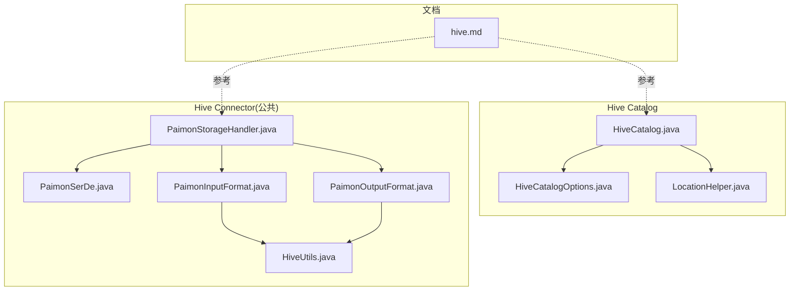
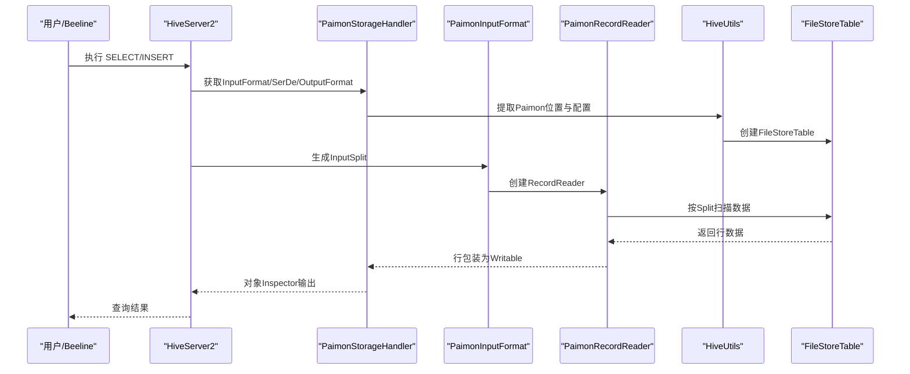
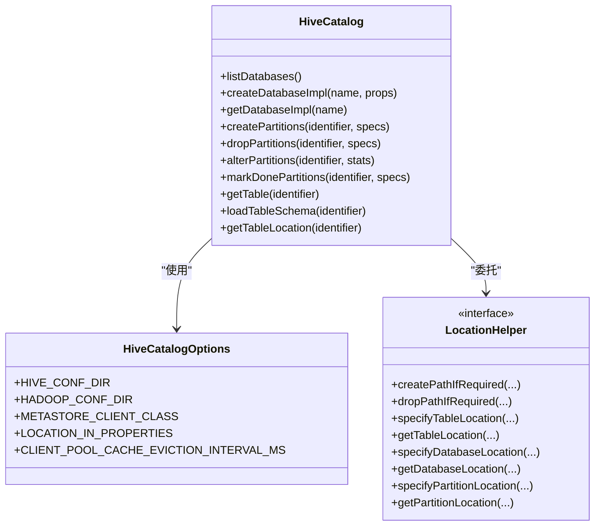
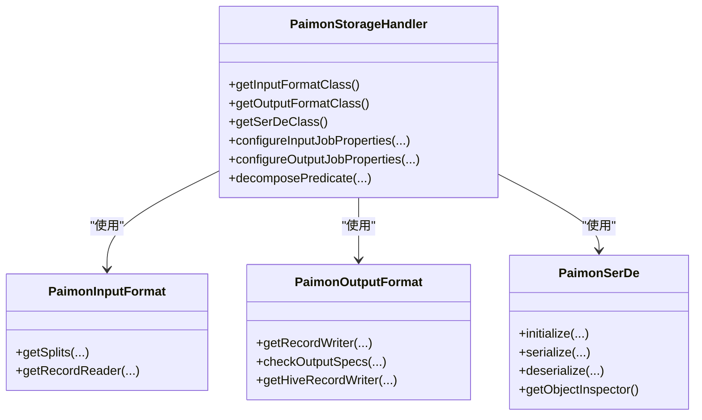
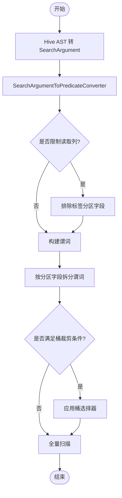
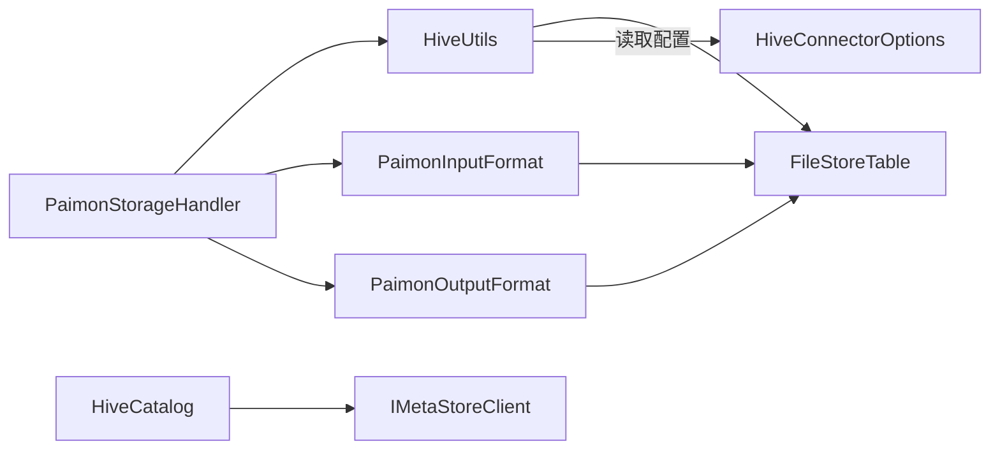

# Hive集成

<cite>
**本文引用的文件**
- [HiveCatalog.java](file://paimon-hive/paimon-hive-catalog/src/main/java/org/apache/paimon/hive/HiveCatalog.java)
- [HiveCatalogOptions.java](file://paimon-hive/paimon-hive-catalog/src/main/java/org/apache/paimon/hive/HiveCatalogOptions.java)
- [LocationHelper.java](file://paimon-hive/paimon-hive-catalog/src/main/java/org/apache/paimon/hive/LocationHelper.java)
- [PaimonStorageHandler.java](file://paimon-hive/paimon-hive-connector-common/src/main/java/org/apache/paimon/hive/PaimonStorageHandler.java)
- [PaimonSerDe.java](file://paimon-hive/paimon-hive-connector-common/src/main/java/org/apache/paimon/hive/PaimonSerDe.java)
- [PaimonInputFormat.java](file://paimon-hive/paimon-hive-connector-common/src/main/java/org/apache/paimon/hive/mapred/PaimonInputFormat.java)
- [PaimonOutputFormat.java](file://paimon-hive/paimon-hive-connector-common/src/main/java/org/apache/paimon/hive/mapred/PaimonOutputFormat.java)
- [HiveUtils.java](file://paimon-hive/paimon-hive-connector-common/src/main/java/org/apache/paimon/hive/utils/HiveUtils.java)
- [hive.md](file://docs/content/ecosystem/hive.md)
- [BucketSelector.java](file://paimon-core/src/main/java/org/apache/paimon/operation/BucketSelector.java)
- [PredicateUtils.java](file://paimon-core/src/main/java/org/apache/paimon/table/format/predicate/PredicateUtils.java)
- [BucketSelectConverter.java](file://paimon-core/src/main/java/org/apache/paimon/operation/BucketSelectConverter.java)
- [HiveConnectorOptions.java](file://paimon-hive/paimon-hive-connector-common/src/main/java/org/apache/paimon/hive/HiveConnectorOptions.java)
</cite>

## 目录
1. [简介](#简介)
2. [项目结构](#项目结构)
3. [核心组件](#核心组件)
4. [架构总览](#架构总览)
5. [组件详解](#组件详解)
6. [依赖关系分析](#依赖关系分析)
7. [性能考量](#性能考量)
8. [故障排除指南](#故障排除指南)
9. [结论](#结论)
10. [附录](#附录)

## 简介
本文件面向希望在Apache Hive中使用Paimon的用户与工程师，系统性阐述Paimon与Hive的集成方案：包括Hive Catalog的实现原理与配置、元数据与表映射、权限与锁机制；Hive Connector的工作机制（StorageHandler、SerDe、Input/OutputFormat）；Paimon与Hive的兼容性（数据类型映射、分区与标签分区、ACID事务支持现状）；Hive查询优化策略（谓词下推、分区裁剪、桶裁剪）；Hive部署与Paimon表创建流程；Hive SQL示例；Hive特定配置项与性能调优参数；以及常见问题排查与调试建议。

## 项目结构
围绕Hive集成的关键模块与文件如下：
- Hive Catalog：负责与Hive Metastore交互、表与数据库的元数据管理、位置解析与分区维护。
- Hive Connector（Common）：提供StorageHandler、SerDe、InputFormat/OutputFormat及工具类，支撑Hive读写路径。
- 文档：官方Hive生态文档，覆盖版本、安装、SQL示例与注意事项。

图示来源
- [HiveCatalog.java:132-191](file://paimon-hive/paimon-hive-catalog/src/main/java/org/apache/paimon/hive/HiveCatalog.java#L132-L191)
- [HiveCatalogOptions.java:30-98](file://paimon-hive/paimon-hive-catalog/src/main/java/org/apache/paimon/hive/HiveCatalogOptions.java#L30-L98)
- [LocationHelper.java:30-48](file://paimon-hive/paimon-hive-catalog/src/main/java/org/apache/paimon/hive/LocationHelper.java#L30-L48)
- [PaimonStorageHandler.java:44-137](file://paimon-hive/paimon-hive-connector-common/src/main/java/org/apache/paimon/hive/PaimonStorageHandler.java#L44-L137)
- [PaimonSerDe.java:43-113](file://paimon-hive/paimon-hive-connector-common/src/main/java/org/apache/paimon/hive/PaimonSerDe.java#L43-L113)
- [PaimonInputFormat.java:36-54](file://paimon-hive/paimon-hive-connector-common/src/main/java/org/apache/paimon/hive/mapred/PaimonInputFormat.java#L36-L54)
- [PaimonOutputFormat.java:46-88](file://paimon-hive/paimon-hive-connector-common/src/main/java/org/apache/paimon/hive/mapred/PaimonOutputFormat.java#L46-L88)
- [HiveUtils.java:52-115](file://paimon-hive/paimon-hive-connector-common/src/main/java/org/apache/paimon/hive/utils/HiveUtils.java#L52-L115)
- [hive.md:27-88](file://docs/content/ecosystem/hive.md#L27-L88)

章节来源
- [HiveCatalog.java:132-191](file://paimon-hive/paimon-hive-catalog/src/main/java/org/apache/paimon/hive/HiveCatalog.java#L132-L191)
- [PaimonStorageHandler.java:44-137](file://paimon-hive/paimon-hive-connector-common/src/main/java/org/apache/paimon/hive/PaimonStorageHandler.java#L44-L137)
- [hive.md:27-88](file://docs/content/ecosystem/hive.md#L27-L88)

## 核心组件
- Hive Catalog：封装HMS客户端、仓库路径、表位置解析、数据库/表/分区的增删改查、锁工厂与上下文、批式获取表名等。
- Hive Catalog 配置项：Hive与Hadoop配置目录、Metastore客户端类、位置存储策略、客户端池缓存策略等。
- StorageHandler：Hive入口，绑定InputFormat、OutputFormat与SerDe，并处理谓词分解与作业属性配置。
- SerDe：将内部行对象与Hive对象相互转换，支持序列化/反序列化与ObjectInspector。
- InputFormat/OutputFormat：基于Paimon分桶与文件划分生成InputSplit并创建RecordReader/RecordWriter。
- 工具类：从Hive配置提取Paimon Catalog配置、构建谓词、从路径解析标签分区名等。

章节来源
- [HiveCatalog.java:132-191](file://paimon-hive/paimon-hive-catalog/src/main/java/org/apache/paimon/hive/HiveCatalog.java#L132-L191)
- [HiveCatalogOptions.java:30-98](file://paimon-hive/paimon-hive-catalog/src/main/java/org/apache/paimon/hive/HiveCatalogOptions.java#L30-L98)
- [PaimonStorageHandler.java:44-137](file://paimon-hive/paimon-hive-connector-common/src/main/java/org/apache/paimon/hive/PaimonStorageHandler.java#L44-L137)
- [PaimonSerDe.java:43-113](file://paimon-hive/paimon-hive-connector-common/src/main/java/org/apache/paimon/hive/PaimonSerDe.java#L43-L113)
- [PaimonInputFormat.java:36-54](file://paimon-hive/paimon-hive-connector-common/src/main/java/org/apache/paimon/hive/mapred/PaimonInputFormat.java#L36-L54)
- [PaimonOutputFormat.java:46-88](file://paimon-hive/paimon-hive-connector-common/src/main/java/org/apache/paimon/hive/mapred/PaimonOutputFormat.java#L46-L88)
- [HiveUtils.java:52-115](file://paimon-hive/paimon-hive-connector-common/src/main/java/org/apache/paimon/hive/utils/HiveUtils.java#L52-L115)

## 架构总览
Hive通过StorageHandler接入Paimon：Hive在读取时由InputFormat生成Split并交由RecordReader扫描文件，写入时由OutputFormat创建Writer落盘；SerDe负责对象转换。Catalog负责元数据与表位置解析，支持外部表与仓库路径策略。

图示来源
- [PaimonStorageHandler.java:79-104](file://paimon-hive/paimon-hive-connector-common/src/main/java/org/apache/paimon/hive/PaimonStorageHandler.java#L79-L104)
- [PaimonInputFormat.java:42-53](file://paimon-hive/paimon-hive-connector-common/src/main/java/org/apache/paimon/hive/mapred/PaimonInputFormat.java#L42-L53)
- [HiveUtils.java:55-66](file://paimon-hive/paimon-hive-connector-common/src/main/java/org/apache/paimon/hive/utils/HiveUtils.java#L55-L66)

## 组件详解

### Hive Catalog 实现与配置
- 元数据与表映射
  - 通过HMS客户端进行数据库/表/分区的创建、列举、修改与删除。
  - 支持外部表与仓库路径策略：可将位置写入TBProperties或直接使用Storage位置。
  - 分区管理：支持按分区规格创建/删除/统计更新；当启用“标签到分区字段”时，分区来源于标签而非文件系统。
- 锁与权限
  - 提供默认锁工厂与可序列化的HiveConf锁上下文，便于跨进程/跨节点协调。
- 配置项
  - Hive/Hadoop配置目录、Metastore客户端类、位置存储策略、客户端池缓存策略等。

图示来源
- [HiveCatalog.java:294-303](file://paimon-hive/paimon-hive-catalog/src/main/java/org/apache/paimon/hive/HiveCatalog.java#L294-L303)
- [HiveCatalogOptions.java:34-95](file://paimon-hive/paimon-hive-catalog/src/main/java/org/apache/paimon/hive/HiveCatalogOptions.java#L34-L95)
- [LocationHelper.java:30-48](file://paimon-hive/paimon-hive-catalog/src/main/java/org/apache/paimon/hive/LocationHelper.java#L30-L48)

章节来源
- [HiveCatalog.java:294-303](file://paimon-hive/paimon-hive-catalog/src/main/java/org/apache/paimon/hive/HiveCatalog.java#L294-L303)
- [HiveCatalogOptions.java:34-95](file://paimon-hive/paimon-hive-catalog/src/main/java/org/apache/paimon/hive/HiveCatalogOptions.java#L34-L95)
- [LocationHelper.java:30-48](file://paimon-hive/paimon-hive-catalog/src/main/java/org/apache/paimon/hive/LocationHelper.java#L30-L48)

### Hive Connector 工作机制
- StorageHandler
  - 绑定InputFormat、OutputFormat、SerDe；在configureInputJobProperties/OutputJobProperties中注入Paimon位置与写入标记；提供谓词分解接口。
- SerDe
  - 基于Hive Schema与内部RowType构建ObjectInspector，完成序列化/反序列化。
- InputFormat/OutputFormat
  - InputFormat依据文件与桶生成Split并创建RecordReader；OutputFormat创建Writer并强制写模式。

图示来源
- [PaimonStorageHandler.java:44-137](file://paimon-hive/paimon-hive-connector-common/src/main/java/org/apache/paimon/hive/PaimonStorageHandler.java#L44-L137)
- [PaimonSerDe.java:43-113](file://paimon-hive/paimon-hive-connector-common/src/main/java/org/apache/paimon/hive/PaimonSerDe.java#L43-L113)
- [PaimonInputFormat.java:36-54](file://paimon-hive/paimon-hive-connector-common/src/main/java/org/apache/paimon/hive/mapred/PaimonInputFormat.java#L36-L54)
- [PaimonOutputFormat.java:46-88](file://paimon-hive/paimon-hive-connector-common/src/main/java/org/apache/paimon/hive/mapred/PaimonOutputFormat.java#L46-L88)

章节来源
- [PaimonStorageHandler.java:79-104](file://paimon-hive/paimon-hive-connector-common/src/main/java/org/apache/paimon/hive/PaimonStorageHandler.java#L79-L104)
- [PaimonSerDe.java:58-75](file://paimon-hive/paimon-hive-connector-common/src/main/java/org/apache/paimon/hive/PaimonSerDe.java#L58-L75)
- [PaimonInputFormat.java:42-53](file://paimon-hive/paimon-hive-connector-common/src/main/java/org/apache/paimon/hive/mapred/PaimonInputFormat.java#L42-L53)
- [PaimonOutputFormat.java:54-73](file://paimon-hive/paimon-hive-connector-common/src/main/java/org/apache/paimon/hive/mapred/PaimonOutputFormat.java#L54-L73)

### 查询转换与谓词下推
- Hive将AST转换为SearchArgument后，由工具类转换为Paimon谓词；可结合列投影限制参与谓词的字段集合；当存在“标签到分区字段”时，会从读取列集中排除该字段以避免Schema不匹配。
- 分区裁剪：根据分区键的谓词拆分并聚合，仅保留与分区字段相关的子表达式。
- 桶裁剪：若表为哈希固定桶或延迟模式且谓词包含桶键，则通过桶选择器过滤桶，减少扫描文件数。

图示来源
- [HiveUtils.java:68-97](file://paimon-hive/paimon-hive-connector-common/src/main/java/org/apache/paimon/hive/utils/HiveUtils.java#L68-L97)
- [PredicateUtils.java:39-68](file://paimon-core/src/main/java/org/apache/paimon/table/format/predicate/PredicateUtils.java#L39-L68)
- [BucketSelectConverter.java:55-72](file://paimon-core/src/main/java/org/apache/paimon/operation/BucketSelectConverter.java#L55-L72)
- [BucketSelector.java:83-89](file://paimon-core/src/main/java/org/apache/paimon/operation/BucketSelector.java#L83-L89)

章节来源
- [HiveUtils.java:68-97](file://paimon-hive/paimon-hive-connector-common/src/main/java/org/apache/paimon/hive/utils/HiveUtils.java#L68-L97)
- [PredicateUtils.java:39-68](file://paimon-core/src/main/java/org/apache/paimon/table/format/predicate/PredicateUtils.java#L39-L68)
- [BucketSelectConverter.java:55-72](file://paimon-core/src/main/java/org/apache/paimon/operation/BucketSelectConverter.java#L55-L72)
- [BucketSelector.java:83-89](file://paimon-core/src/main/java/org/apache/paimon/operation/BucketSelector.java#L83-L89)

### 兼容性与数据类型映射
- Hive版本：官方文档明确支持Hive 3.1、2.3、2.2、2.1与CDH 2.1-cdh-6.3。
- 类型映射：Hive复杂类型（struct/map/list）与Paimon RowType/MapType/ArrayType对应；基础类型如boolean、tinyint、smallint、int、bigint、float、double、char、varchar、date、timestamp、decimal、binary分别映射到Paimon相应原子类型。
- ACID事务：官方测试用例显示需配置事务管理器以支持ACID表创建与并发控制，但Hive Catalog本身未直接暴露ACID开关，需配合Hive端配置。

章节来源
- [hive.md:31-38](file://docs/content/ecosystem/hive.md#L31-L38)
- [hive.md:212-312](file://docs/content/ecosystem/hive.md#L212-L312)
- [Hive31CatalogITCase.java:45-57](file://paimon-hive/paimon-hive-connector-3.1/src/test/java/org/apache/paimon/hive/Hive31CatalogITCase.java#L45-L57)
- [Hive23CatalogITCase.java:45-57](file://paimon-hive/paimon-hive-connector-2.3/src/test/java/org/apache/paimon/hive/Hive23CatalogITCase.java#L45-L57)

### Hive SQL 示例与部署步骤
- 安装：下载对应Hive版本的Connector Jar并放置于Hive的auxlib或通过add jar加载；注意MR执行引擎下可能遇到类加载异常。
- 访问已有Paimon表：SHOW TABLES、SELECT、INSERT INTO（不支持INSERT OVERWRITE）。
- 时间旅行：通过设置扫描快照ID进行时间回溯。
- 创建新表：通过StorageHandler声明表存储方式；或注册外部表指向现有Paimon表位置。
- 注意事项：开启CBO可能导致某些非空谓词返回异常，可临时关闭CBO。

章节来源
- [hive.md:40-88](file://docs/content/ecosystem/hive.md#L40-L88)
- [hive.md:89-144](file://docs/content/ecosystem/hive.md#L89-L144)
- [hive.md:146-210](file://docs/content/ecosystem/hive.md#L146-L210)
- [hive.md:163-210](file://docs/content/ecosystem/hive.md#L163-L210)

## 依赖关系分析
- Catalog与HMS：HiveCatalog持有HiveConf与IMetaStoreClient池，负责数据库/表/分区的元数据操作。
- Connector与Catalog：StorageHandler通过HiveUtils从JobConf中提取Paimon配置并创建FileStoreTable；InputFormat/OutputFormat依赖Split生成与Writer创建。
- 优化器与谓词：HiveUtils将SearchArgument转为Paimon谓词；PredicateUtils与BucketSelectConverter用于分区裁剪与桶裁剪。

图示来源
- [PaimonStorageHandler.java:79-104](file://paimon-hive/paimon-hive-connector-common/src/main/java/org/apache/paimon/hive/PaimonStorageHandler.java#L79-L104)
- [HiveUtils.java:55-66](file://paimon-hive/paimon-hive-connector-common/src/main/java/org/apache/paimon/hive/utils/HiveUtils.java#L55-L66)
- [PaimonInputFormat.java:42-46](file://paimon-hive/paimon-hive-connector-common/src/main/java/org/apache/paimon/hive/mapred/PaimonInputFormat.java#L42-L46)
- [PaimonOutputFormat.java:75-87](file://paimon-hive/paimon-hive-connector-common/src/main/java/org/apache/paimon/hive/mapred/PaimonOutputFormat.java#L75-L87)
- [HiveCatalog.java:193-205](file://paimon-hive/paimon-hive-catalog/src/main/java/org/apache/paimon/hive/HiveCatalog.java#L193-L205)
- [HiveConnectorOptions.java:28-41](file://paimon-hive/paimon-hive-connector-common/src/main/java/org/apache/paimon/hive/HiveConnectorOptions.java#L28-L41)

章节来源
- [HiveCatalog.java:193-205](file://paimon-hive/paimon-hive-catalog/src/main/java/org/apache/paimon/hive/HiveCatalog.java#L193-L205)
- [HiveConnectorOptions.java:28-41](file://paimon-hive/paimon-hive-connector-common/src/main/java/org/apache/paimon/hive/HiveConnectorOptions.java#L28-L41)

## 性能考量
- Split大小与文件成本
  - 可通过配置项控制是否尊重Hive的split最小/最大size参数，以及覆盖表级open-file-cost，从而影响Split数量与小文件合并策略。
- 并发与锁
  - Catalog提供锁工厂与可序列化的HiveConf锁上下文，建议在高并发场景下合理设置锁超时与最大等待时间。
- CBO与谓词
  - 当启用CBO时，部分非空谓词可能产生异常结果，建议在相关查询场景禁用CBO。
- HDFS默认配置
  - 可通过配置项禁用从core-default.xml、hdfs-default.xml加载默认值，减小Split尺寸与提升小文件处理效率。

章节来源
- [HiveConnectorOptions.java:28-41](file://paimon-hive/paimon-hive-connector-common/src/main/java/org/apache/paimon/hive/HiveConnectorOptions.java#L28-L41)
- [hive.md:82-87](file://docs/content/ecosystem/hive.md#L82-L87)
- [HiveCatalogLock.java:149-164](file://paimon-hive/paimon-hive-catalog/src/main/java/org/apache/paimon/hive/HiveCatalogLock.java#L149-L164)

## 故障排除指南
- 类加载异常（MR执行引擎）
  - 在MR执行引擎下，使用add jar动态加载Jar可能导致类找不到异常；建议将Jar放入Hive的auxlib目录。
- CBO导致的查询异常
  - 对struct类型的非空谓词，建议临时关闭CBO以获得正确结果。
- 写入限制
  - INSERT OVERWRITE不支持；Primary Key表写入易产生大量小文件，建议写入非主键表或评估分桶策略。
- 位置访问问题（对象存储）
  - 若Hive无法通过其文件系统访问S3/OSS等对象存储，可启用“location-in-properties”将Paimon表位置写入TBProperties，避免Hive直接访问底层存储。
- 事务与ACID
  - 创建ACID表需要Hive端配置合适的事务管理器与并发支持；测试用例展示了相关配置要点。

章节来源
- [hive.md:77-88](file://docs/content/ecosystem/hive.md#L77-L88)
- [hive.md:115-120](file://docs/content/ecosystem/hive.md#L115-L120)
- [HiveCatalogOptions.java:60-67](file://paimon-hive/paimon-hive-catalog/src/main/java/org/apache/paimon/hive/HiveCatalogOptions.java#L60-L67)
- [Hive31CatalogITCase.java:45-57](file://paimon-hive/paimon-hive-connector-3.1/src/test/java/org/apache/paimon/hive/Hive31CatalogITCase.java#L45-L57)
- [Hive23CatalogITCase.java:45-57](file://paimon-hive/paimon-hive-connector-2.3/src/test/java/org/apache/paimon/hive/Hive23CatalogITCase.java#L45-L57)

## 结论
Paimon与Hive的集成通过Hive Catalog与Connector形成完整链路：Catalog负责元数据与位置管理，Connector负责读写桥接与谓词转换。官方文档明确了版本支持、安装与SQL示例，同时提供了类型映射与兼容性说明。在生产环境中，建议关注Split与文件成本、CBO与谓词行为、对象存储下的位置策略、以及事务与锁配置，以获得稳定与高性能的查询体验。

## 附录
- Hive Catalog配置项一览
  - hive-conf-dir：Hive配置目录，用于创建Metastore客户端与安全认证。
  - hadoop-conf-dir：Hadoop配置目录，优先级与环境变量说明。
  - metastore.client.class：Metastore客户端类名。
  - location-in-properties：是否将Paimon表位置写入TBProperties。
  - client-pool-cache.eviction-interval-ms：客户端池缓存淘汰间隔。
- Hive Connector配置项一览
  - paimon.respect.minmaxsplitsize.enabled：是否尊重Hive split大小参数。
  - paimon.split.openfilecost：覆盖表级open-file-cost。

章节来源
- [HiveCatalogOptions.java:34-95](file://paimon-hive/paimon-hive-catalog/src/main/java/org/apache/paimon/hive/HiveCatalogOptions.java#L34-L95)
- [HiveConnectorOptions.java:28-41](file://paimon-hive/paimon-hive-connector-common/src/main/java/org/apache/paimon/hive/HiveConnectorOptions.java#L28-L41)