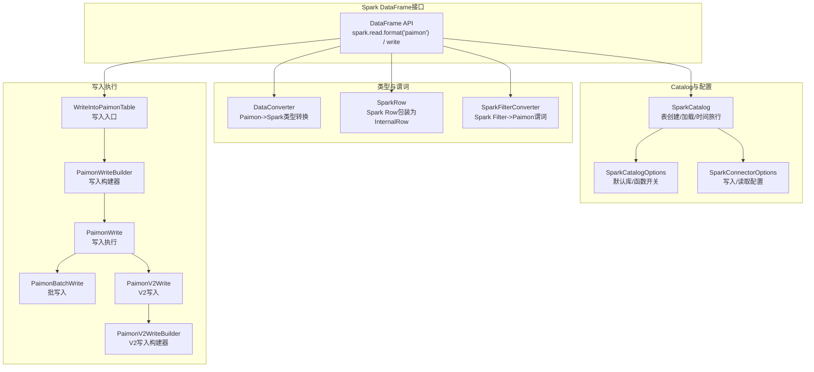
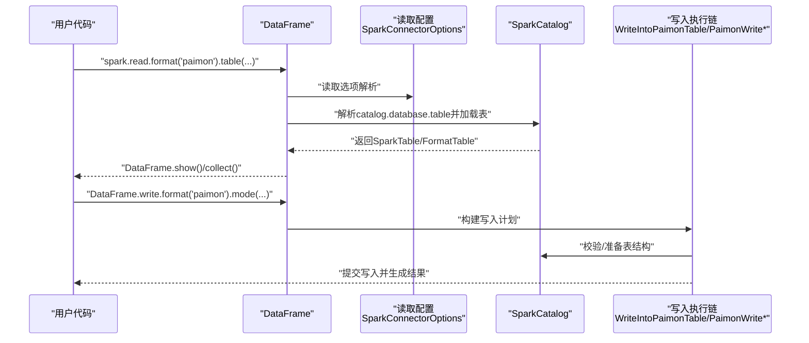
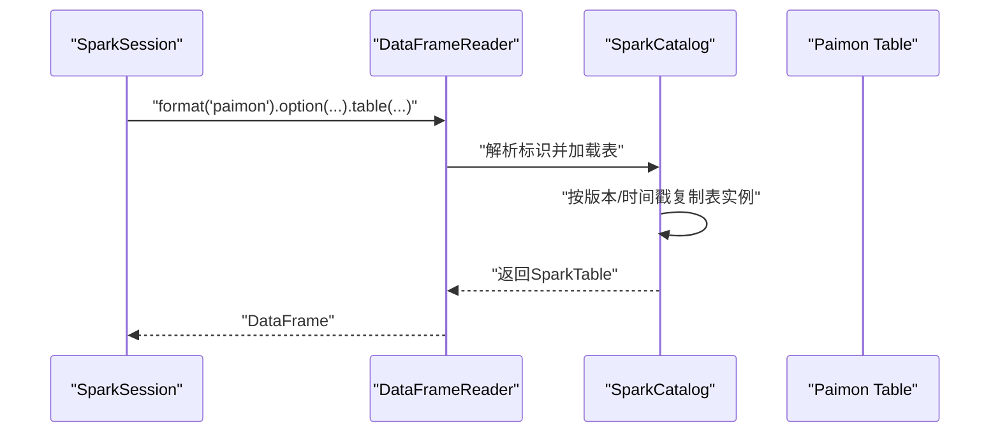
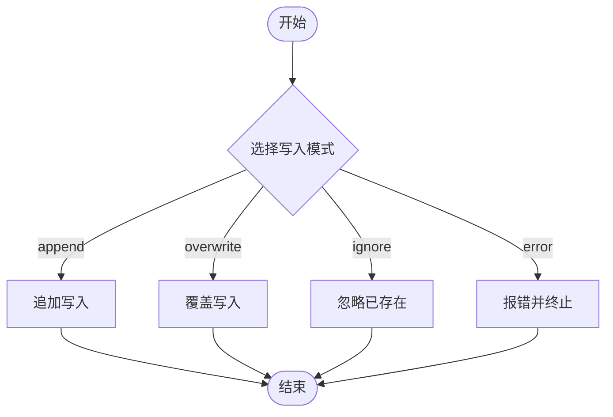
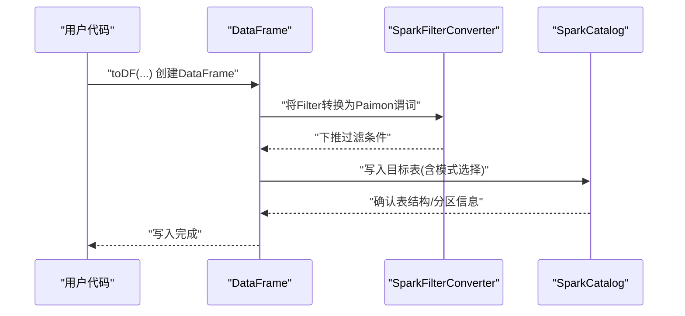
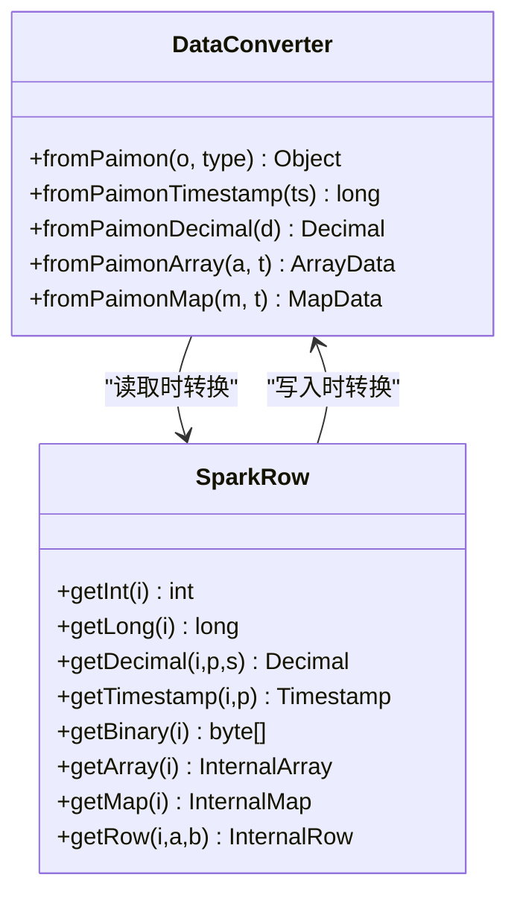
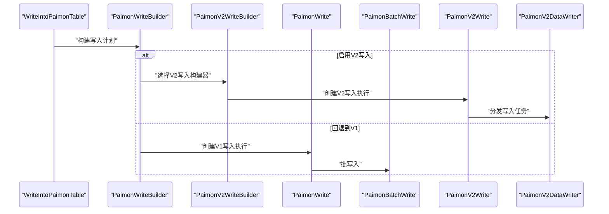
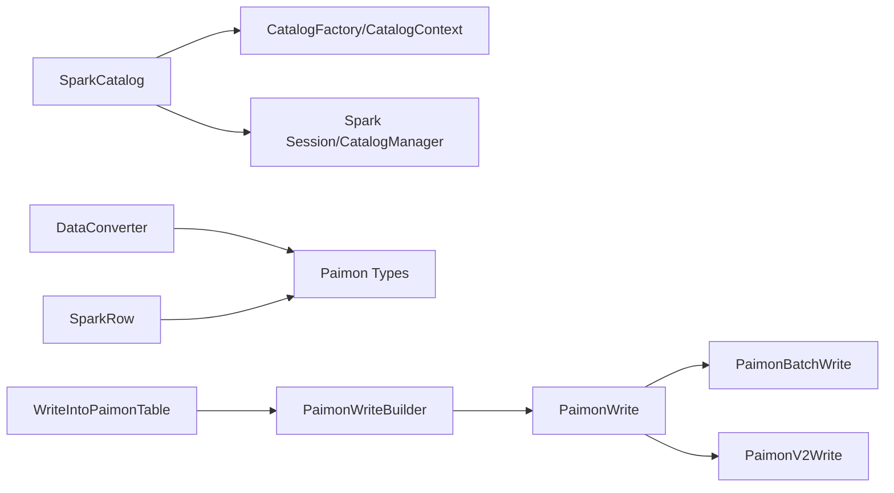

# DataFrame操作

<cite>
**本文引用的文件**   
- [dataframe.md](file://docs/content/spark/dataframe.md)
- [SparkCatalog.java](file://paimon-spark/paimon-spark-common/src/main/java/org/apache/paimon/spark/SparkCatalog.java)
- [SparkCatalogOptions.java](file://paimon-spark/paimon-spark-common/src/main/java/org/apache/paimon/spark/SparkCatalogOptions.java)
- [SparkConnectorOptions.java](file://paimon-spark/paimon-spark-common/src/main/java/org/apache/paimon/spark/SparkConnectorOptions.java)
- [DataConverter.java](file://paimon-spark/paimon-spark-common/src/main/java/org/apache/paimon/spark/DataConverter.java)
- [SparkUtils.java](file://paimon-spark/paimon-spark-common/src/main/java/org/apache/paimon/spark/SparkUtils.java)
- [SparkRow.java](file://paimon-spark/paimon-spark-common/src/main/java/org/apache/paimon/spark/SparkRow.java)
- [SparkFilterConverter.java](file://paimon-spark/paimon-spark-common/src/main/java/org/apache/paimon/spark/SparkFilterConverter.java)
- [PaimonSparkWriter.scala](file://paimon-spark/paimon-spark-common/src/main/scala/org/apache/paimon/spark/commands/PaimonSparkWriter.scala)
- [WriteIntoPaimonTable.scala](file://paimon-spark/paimon-spark-common/src/main/scala/org/apache/paimon/spark/commands/WriteIntoPaimonTable.scala)
- [BaseWriteBuilder.scala](file://paimon-spark/paimon-spark-common/src/main/scala/org/apache/paimon/spark/write/BaseWriteBuilder.scala)
- [PaimonWriteBuilder.scala](file://paimon-spark/paimon-spark-common/src/main/scala/org/apache/paimon/spark/write/PaimonWriteBuilder.scala)
- [PaimonWrite.scala](file://paimon-spark/paimon-spark-common/src/main/scala/org/apache/paimon/spark/write/PaimonWrite.scala)
- [PaimonBatchWrite.scala](file://paimon-spark/paimon-spark-common/src/main/scala/org/apache/paimon/spark/write/PaimonBatchWrite.scala)
- [PaimonV2Write.scala](file://paimon-spark/paimon-spark-common/src/main/scala/org/apache/paimon/spark/write/PaimonV2Write.scala)
- [PaimonV2WriteBuilder.scala](file://paimon-spark/paimon-spark-common/src/main/scala/org/apache/paimon/spark/write/PaimonV2WriteBuilder.scala)
- [PaimonWriteRequirement.scala](file://paimon-spark/paimon-spark-common/src/main/scala/org/apache/paimon/spark/write/PaimonWriteRequirement.scala)
- [PaimonDataWrite.scala](file://paimon-spark/paimon-spark-common/src/main/scala/org/apache/paimon/spark/write/PaimonDataWrite.scala)
- [PaimonV2DataWriter.scala](file://paimon-spark/paimon-spark-common/src/main/scala/org/apache/paimon/spark/write/PaimonV2DataWriter.scala)
- [PaimonCopyOnWriteScan.scala](file://paimon-spark/paimon-spark-common/src/main/scala/org/apache/paimon/spark/rowops/PaimonCopyOnWriteScan.scala)
- [PaimonSparkCopyOnWriteOperation.scala](file://paimon-spark/paimon-spark-common/src/main/scala/org/apache/paimon/spark/rowops/PaimonSparkCopyOnWriteOperation.scala)
</cite>

## 目录
1. [简介](#简介)
2. [项目结构](#项目结构)
3. [核心组件](#核心组件)
4. [架构总览](#架构总览)
5. [详细组件分析](#详细组件分析)
6. [依赖分析](#依赖分析)
7. [性能考虑](#性能考虑)
8. [故障排查指南](#故障排查指南)
9. [结论](#结论)
10. [附录](#附录)

## 简介
本文件面向使用 Apache Paimon 的 Spark DataFrame 场景，系统化阐述以下主题：
- 如何通过 spark.read.format("paimon") 读取 Paimon 表，并使用 table()/load() 指定表或路径
- DataFrame 写入 Paimon 的多种模式：append、overwrite、ignore、error 的语义与适用场景
- 使用 toDF() 创建 DataFrame、数据转换与过滤的实践
- DataFrame 与 Paimon 表之间的数据类型映射与转换规则
- 分区与桶优化策略，以及如何借助 Paimon 的分区/桶特性提升查询性能
- 性能优化建议（如缓存策略、广播变量使用等）
- 常见错误处理与调试技巧

## 项目结构
围绕 Spark DataFrame 的实现，核心位于 paimon-spark 的公共模块与各版本适配层中，文档与实现的关系如下：
- 文档层面：docs/content/spark/dataframe.md 提供了 DataFrame 读写的基本用法与配置入口
- 实现层面：SparkCatalog 负责 Catalog 初始化、表创建/加载、时间旅行等；SparkConnectorOptions/SparkCatalogOptions 定义读写相关配置项；DataConverter/SparkRow/SparkFilterConverter 负责类型转换与谓词下推；Scala 层的 PaimonSparkWriter/WriteIntoPaimonTable/PaimonWrite 等负责写入执行计划与任务构建

图表来源
- [SparkCatalog.java:106-153](file://paimon-spark/paimon-spark-common/src/main/java/org/apache/paimon/spark/SparkCatalog.java#L106-L153)
- [SparkCatalogOptions.java:27-46](file://paimon-spark/paimon-spark-common/src/main/java/org/apache/paimon/spark/SparkCatalogOptions.java#L27-L46)
- [SparkConnectorOptions.java:26-110](file://paimon-spark/paimon-spark-common/src/main/java/org/apache/paimon/spark/SparkConnectorOptions.java#L26-L110)
- [DataConverter.java:44-118](file://paimon-spark/paimon-spark-common/src/main/java/org/apache/paimon/spark/DataConverter.java#L44-L118)
- [SparkRow.java:60-252](file://paimon-spark/paimon-spark-common/src/main/java/org/apache/paimon/spark/SparkRow.java#L60-L252)
- [SparkFilterConverter.java:53-205](file://paimon-spark/paimon-spark-common/src/main/java/org/apache/paimon/spark/SparkFilterConverter.java#L53-L205)
- [WriteIntoPaimonTable.scala](file://paimon-spark/paimon-spark-common/src/main/scala/org/apache/paimon/spark/commands/WriteIntoPaimonTable.scala)
- [PaimonWriteBuilder.scala](file://paimon-spark/paimon-spark-common/src/main/scala/org/apache/paimon/spark/write/PaimonWriteBuilder.scala)
- [PaimonWrite.scala](file://paimon-spark/paimon-spark-common/src/main/scala/org/apache/paimon/spark/write/PaimonWrite.scala)
- [PaimonBatchWrite.scala](file://paimon-spark/paimon-spark-common/src/main/scala/org/apache/paimon/spark/write/PaimonBatchWrite.scala)
- [PaimonV2Write.scala](file://paimon-spark/paimon-spark-common/src/main/scala/org/apache/paimon/spark/write/PaimonV2Write.scala)
- [PaimonV2WriteBuilder.scala](file://paimon-spark/paimon-spark-common/src/main/scala/org/apache/paimon/spark/write/PaimonV2WriteBuilder.scala)

章节来源
- [dataframe.md:27-122](file://docs/content/spark/dataframe.md#L27-L122)
- [SparkCatalog.java:106-709](file://paimon-spark/paimon-spark-common/src/main/java/org/apache/paimon/spark/SparkCatalog.java#L106-L709)
- [SparkCatalogOptions.java:27-46](file://paimon-spark/paimon-spark-common/src/main/java/org/apache/paimon/spark/SparkCatalogOptions.java#L27-L46)
- [SparkConnectorOptions.java:26-110](file://paimon-spark/paimon-spark-common/src/main/java/org/apache/paimon/spark/SparkConnectorOptions.java#L26-L110)
- [DataConverter.java:44-118](file://paimon-spark/paimon-spark-common/src/main/java/org/apache/paimon/spark/DataConverter.java#L44-L118)
- [SparkRow.java:60-441](file://paimon-spark/paimon-spark-common/src/main/java/org/apache/paimon/spark/SparkRow.java#L60-L441)
- [SparkFilterConverter.java:53-205](file://paimon-spark/paimon-spark-common/src/main/java/org/apache/paimon/spark/SparkFilterConverter.java#L53-L205)

## 核心组件
- SparkCatalog：负责 Catalog 初始化、数据库/命名空间管理、表创建/加载、时间旅行（按版本/时间戳）、函数注册等
- SparkConnectorOptions/SparkCatalogOptions：定义读写行为的关键配置项，如写入合并 schema、是否启用 V2 写入、流式读取触发限制、允许全表扫描等
- DataConverter/SparkRow：在读写过程中完成 Paimon 与 Spark 类型之间的双向转换，处理数组、映射、时间戳、十进制等复杂类型
- SparkFilterConverter：将 Spark sources.Filter 下推为 Paimon 谓词，支持等值、范围、集合、空值、逻辑组合及字符串匹配
- 写入执行链路：WriteIntoPaimonTable 作为入口，结合 PaimonWriteBuilder/PaimonWrite/PaimonBatchWrite/PaimonV2Write 等组件完成写入执行

章节来源
- [SparkCatalog.java:106-709](file://paimon-spark/paimon-spark-common/src/main/java/org/apache/paimon/spark/SparkCatalog.java#L106-L709)
- [SparkConnectorOptions.java:26-110](file://paimon-spark/paimon-spark-common/src/main/java/org/apache/paimon/spark/SparkConnectorOptions.java#L26-L110)
- [SparkCatalogOptions.java:27-46](file://paimon-spark/paimon-spark-common/src/main/java/org/apache/paimon/spark/SparkCatalogOptions.java#L27-L46)
- [DataConverter.java:44-118](file://paimon-spark/paimon-spark-common/src/main/java/org/apache/paimon/spark/DataConverter.java#L44-L118)
- [SparkRow.java:60-441](file://paimon-spark/paimon-spark-common/src/main/java/org/apache/paimon/spark/SparkRow.java#L60-L441)
- [SparkFilterConverter.java:53-205](file://paimon-spark/paimon-spark-common/src/main/java/org/apache/paimon/spark/SparkFilterConverter.java#L53-L205)
- [WriteIntoPaimonTable.scala](file://paimon-spark/paimon-spark-common/src/main/scala/org/apache/paimon/spark/commands/WriteIntoPaimonTable.scala)
- [PaimonWriteBuilder.scala](file://paimon-spark/paimon-spark-common/src/main/scala/org/apache/paimon/spark/write/PaimonWriteBuilder.scala)
- [PaimonWrite.scala](file://paimon-spark/paimon-spark-common/src/main/scala/org/apache/paimon/spark/write/PaimonWrite.scala)
- [PaimonBatchWrite.scala](file://paimon-spark/paimon-spark-common/src/main/scala/org/apache/paimon/spark/write/PaimonBatchWrite.scala)
- [PaimonV2Write.scala](file://paimon-spark/paimon-spark-common/src/main/scala/org/apache/paimon/spark/write/PaimonV2Write.scala)
- [PaimonV2WriteBuilder.scala](file://paimon-spark/paimon-spark-common/src/main/scala/org/apache/paimon/spark/write/PaimonV2WriteBuilder.scala)

## 架构总览
下图展示了从 DataFrame 到 Paimon 的读写路径与关键组件交互：

图表来源
- [dataframe.md:91-122](file://docs/content/spark/dataframe.md#L91-L122)
- [SparkConnectorOptions.java:26-110](file://paimon-spark/paimon-spark-common/src/main/java/org/apache/paimon/spark/SparkConnectorOptions.java#L26-L110)
- [SparkCatalog.java:298-340](file://paimon-spark/paimon-spark-common/src/main/java/org/apache/paimon/spark/SparkCatalog.java#L298-L340)
- [WriteIntoPaimonTable.scala](file://paimon-spark/paimon-spark-common/src/main/scala/org/apache/paimon/spark/commands/WriteIntoPaimonTable.scala)
- [PaimonWriteBuilder.scala](file://paimon-spark/paimon-spark-common/src/main/scala/org/apache/paimon/spark/write/PaimonWriteBuilder.scala)
- [PaimonWrite.scala](file://paimon-spark/paimon-spark-common/src/main/scala/org/apache/paimon/spark/write/PaimonWrite.scala)

## 详细组件分析

### 读取路径与时间旅行
- 读取入口：spark.read.format("paimon").table("db.tbl") 或 .load("/path/to/table")
- 支持通过 catalog.database.table 或 .option("catalog","...").option("database","...").option("table","...") 指定
- 时间旅行：可通过选项指定扫描快照 ID 或时间戳，SparkCatalog 提供按版本/时间戳加载表的能力

图表来源
- [dataframe.md:91-122](file://docs/content/spark/dataframe.md#L91-L122)
- [SparkCatalog.java:306-339](file://paimon-spark/paimon-spark-common/src/main/java/org/apache/paimon/spark/SparkCatalog.java#L306-L339)

章节来源
- [dataframe.md:91-122](file://docs/content/spark/dataframe.md#L91-L122)
- [SparkCatalog.java:306-339](file://paimon-spark/paimon-spark-common/src/main/java/org/apache/paimon/spark/SparkCatalog.java#L306-L339)

### 写入模式与语义
- append：插入新记录，不删除已有数据
- overwrite：覆盖目标表/分区的数据，可配合动态分区覆盖
- ignore：当表已存在时跳过写入
- error：当表已存在时抛出异常

图表来源
- [dataframe.md:44-90](file://docs/content/spark/dataframe.md#L44-L90)

章节来源
- [dataframe.md:44-90](file://docs/content/spark/dataframe.md#L44-L90)

### DataFrame 创建与数据转换
- 使用 toDF() 将集合转换为 DataFrame
- 过滤与转换：结合谓词下推与 Spark SQL 引擎进行高效处理
- 插入语义：insertInto 与 saveAsTable 的差异（列名位置写入 vs 名称对齐写入）

图表来源
- [dataframe.md:34-58](file://docs/content/spark/dataframe.md#L34-L58)
- [SparkFilterConverter.java:99-179](file://paimon-spark/paimon-spark-common/src/main/java/org/apache/paimon/spark/SparkFilterConverter.java#L99-L179)

章节来源
- [dataframe.md:34-58](file://docs/content/spark/dataframe.md#L34-L58)
- [SparkFilterConverter.java:99-179](file://paimon-spark/paimon-spark-common/src/main/java/org/apache/paimon/spark/SparkFilterConverter.java#L99-L179)

### 数据类型映射与转换
- 读取方向：DataConverter 将 Paimon 内部类型（如 Timestamp、Decimal、Array、Map、Row）转换为 Spark 类型
- 写入方向：SparkRow 将 Spark Row 包装为 Paimon InternalRow，并处理日期、时间戳、十进制、二进制、变体、Blob 等类型
- 特殊处理：针对时间戳类型，根据配置决定是按微秒还是 Spark 时间戳类型处理

图表来源
- [DataConverter.java:44-118](file://paimon-spark/paimon-spark-common/src/main/java/org/apache/paimon/spark/DataConverter.java#L44-L118)
- [SparkRow.java:60-441](file://paimon-spark/paimon-spark-common/src/main/java/org/apache/paimon/spark/SparkRow.java#L60-L441)

章节来源
- [DataConverter.java:44-118](file://paimon-spark/paimon-spark-common/src/main/java/org/apache/paimon/spark/DataConverter.java#L44-L118)
- [SparkRow.java:60-441](file://paimon-spark/paimon-spark-common/src/main/java/org/apache/paimon/spark/SparkRow.java#L60-L441)

### 分区与桶优化策略
- 分区：通过 partitionBy 指定分区列，SparkCatalog 在创建表时将分区列转换为 Paimon 的分区键
- 桶：Paimon 支持桶表，写入时可利用桶键进行分桶，提升 Join/聚合性能
- 查询优化：结合 Spark 的分区裁剪与谓词下推，减少扫描数据量

章节来源
- [SparkCatalog.java:456-511](file://paimon-spark/paimon-spark-common/src/main/java/org/apache/paimon/spark/SparkCatalog.java#L456-L511)
- [SparkFilterConverter.java:53-71](file://paimon-spark/paimon-spark-common/src/main/java/org/apache/paimon/spark/SparkFilterConverter.java#L53-L71)

### 写入执行链与V2写入
- 入口：WriteIntoPaimonTable
- 构建：PaimonWriteBuilder/PaimonV2WriteBuilder
- 执行：PaimonWrite/PaimonBatchWrite/PaimonV2Write/PaimonV2DataWriter
- 条件：SparkConnectorOptions 中的 write.use-v2-write 控制是否启用 V2 写入

图表来源
- [WriteIntoPaimonTable.scala](file://paimon-spark/paimon-spark-common/src/main/scala/org/apache/paimon/spark/commands/WriteIntoPaimonTable.scala)
- [PaimonWriteBuilder.scala](file://paimon-spark/paimon-spark-common/src/main/scala/org/apache/paimon/spark/write/PaimonWriteBuilder.scala)
- [PaimonV2WriteBuilder.scala](file://paimon-spark/paimon-spark-common/src/main/scala/org/apache/paimon/spark/write/PaimonV2WriteBuilder.scala)
- [PaimonWrite.scala](file://paimon-spark/paimon-spark-common/src/main/scala/org/apache/paimon/spark/write/PaimonWrite.scala)
- [PaimonBatchWrite.scala](file://paimon-spark/paimon-spark-common/src/main/scala/org/apache/paimon/spark/write/PaimonBatchWrite.scala)
- [PaimonV2Write.scala](file://paimon-spark/paimon-spark-common/src/main/scala/org/apache/paimon/spark/write/PaimonV2Write.scala)
- [PaimonV2DataWriter.scala](file://paimon-spark/paimon-spark-common/src/main/scala/org/apache/paimon/spark/write/PaimonV2DataWriter.scala)

章节来源
- [WriteIntoPaimonTable.scala](file://paimon-spark/paimon-spark-common/src/main/scala/org/apache/paimon/spark/commands/WriteIntoPaimonTable.scala)
- [PaimonWriteBuilder.scala](file://paimon-spark/paimon-spark-common/src/main/scala/org/apache/paimon/spark/write/PaimonWriteBuilder.scala)
- [PaimonV2WriteBuilder.scala](file://paimon-spark/paimon-spark-common/src/main/scala/org/apache/paimon/spark/write/PaimonV2WriteBuilder.scala)
- [PaimonWrite.scala](file://paimon-spark/paimon-spark-common/src/main/scala/org/apache/paimon/spark/write/PaimonWrite.scala)
- [PaimonBatchWrite.scala](file://paimon-spark/paimon-spark-common/src/main/scala/org/apache/paimon/spark/write/PaimonBatchWrite.scala)
- [PaimonV2Write.scala](file://paimon-spark/paimon-spark-common/src/main/scala/org/apache/paimon/spark/write/PaimonV2Write.scala)
- [PaimonV2DataWriter.scala](file://paimon-spark/paimon-spark-common/src/main/scala/org/apache/paimon/spark/write/PaimonV2DataWriter.scala)

## 依赖分析
- 组件耦合
  - SparkCatalog 与 CatalogFactory/CatalogContext 紧密耦合，负责表生命周期管理与时间旅行
  - DataConverter/SparkRow 与 Paimon 内部类型体系耦合，确保读写一致性
  - 写入执行链通过 Builder/Write 组件解耦，便于 V1/V2 写入切换
- 外部依赖
  - Spark Session/CatalogManager/ParserInterface 用于标识解析与 Catalog 解析
  - 文件系统/URI 访问用于 Blob 等外部数据读取

图表来源
- [SparkCatalog.java:124-153](file://paimon-spark/paimon-spark-common/src/main/java/org/apache/paimon/spark/SparkCatalog.java#L124-L153)
- [DataConverter.java:44-118](file://paimon-spark/paimon-spark-common/src/main/java/org/apache/paimon/spark/DataConverter.java#L44-L118)
- [SparkRow.java:60-441](file://paimon-spark/paimon-spark-common/src/main/java/org/apache/paimon/spark/SparkRow.java#L60-L441)
- [WriteIntoPaimonTable.scala](file://paimon-spark/paimon-spark-common/src/main/scala/org/apache/paimon/spark/commands/WriteIntoPaimonTable.scala)
- [PaimonWriteBuilder.scala](file://paimon-spark/paimon-spark-common/src/main/scala/org/apache/paimon/spark/write/PaimonWriteBuilder.scala)
- [PaimonWrite.scala](file://paimon-spark/paimon-spark-common/src/main/scala/org/apache/paimon/spark/write/PaimonWrite.scala)
- [PaimonBatchWrite.scala](file://paimon-spark/paimon-spark-common/src/main/scala/org/apache/paimon/spark/write/PaimonBatchWrite.scala)
- [PaimonV2Write.scala](file://paimon-spark/paimon-spark-common/src/main/scala/org/apache/paimon/spark/write/PaimonV2Write.scala)

章节来源
- [SparkCatalog.java:124-153](file://paimon-spark/paimon-spark-common/src/main/java/org/apache/paimon/spark/SparkCatalog.java#L124-L153)
- [SparkUtils.java:49-156](file://paimon-spark/paimon-spark-common/src/main/java/org/apache/paimon/spark/SparkUtils.java#L49-L156)
- [DataConverter.java:44-118](file://paimon-spark/paimon-spark-common/src/main/java/org/apache/paimon/spark/DataConverter.java#L44-L118)
- [SparkRow.java:60-441](file://paimon-spark/paimon-spark-common/src/main/java/org/apache/paimon/spark/SparkRow.java#L60-L441)
- [WriteIntoPaimonTable.scala](file://paimon-spark/paimon-spark-common/src/main/scala/org/apache/paimon/spark/commands/WriteIntoPaimonTable.scala)
- [PaimonWriteBuilder.scala](file://paimon-spark/paimon-spark-common/src/main/scala/org/apache/paimon/spark/write/PaimonWriteBuilder.scala)
- [PaimonWrite.scala](file://paimon-spark/paimon-spark-common/src/main/scala/org/apache/paimon/spark/write/PaimonWrite.scala)
- [PaimonBatchWrite.scala](file://paimon-spark/paimon-spark-common/src/main/scala/org/apache/paimon/spark/write/PaimonBatchWrite.scala)
- [PaimonV2Write.scala](file://paimon-spark/paimon-spark-common/src/main/scala/org/apache/paimon/spark/write/PaimonV2Write.scala)

## 性能考虑
- 读取侧
  - 合理设置流式读取触发参数（如 maxFilesPerTrigger、maxRowsPerTrigger、maxBytesPerTrigger），平衡吞吐与延迟
  - 允许全表扫描的控制项可用于避免不必要的全表扫描
  - 读取变更日志（read.changelog）可满足 CDC 场景，但会增加列数与行类型开销
- 写入侧
  - 启用 V2 写入（write.use-v2-write）可获得更优的桶/分桶写入能力（当前仅部分桶模式受支持）
  - 合并 schema（write.merge-schema）与显式类型转换（write.merge-schema.explicit-cast）可降低模式不一致导致的失败
- 缓存与广播
  - 对小表广播连接（如维度表）可显著降低 Shuffle 成本
  - 对热点表进行缓存可减少重复读取开销

章节来源
- [SparkConnectorOptions.java:26-110](file://paimon-spark/paimon-spark-common/src/main/java/org/apache/paimon/spark/SparkConnectorOptions.java#L26-L110)

## 故障排查指南
- 读取失败
  - 检查 catalog.database.table 是否正确解析，必要时使用多段标识解析工具
  - 若需要时间旅行，请确认 scan.snapshot-id 或 scan.timestamp-millis 配置
- 写入失败
  - 模式选择错误：append/overwrite/ignore/error 的选择需与业务目标一致
  - schema 不匹配：开启 write.merge-schema 并根据需要启用显式类型转换
  - 动态分区覆盖：若目标表为分区表，需将 Spark 会话配置 spark.sql.sources.partitionOverwriteMode 设置为 dynamic
- 类型转换问题
  - 确认时间戳类型处理策略（微秒 vs Spark 时间戳）
  - Blob 字段需为二进制类型，且遵循 Paimon Blob 规范
- 谓词下推失败
  - 检查 Filter 类型是否受支持（等值、范围、集合、空值、逻辑组合、字符串匹配）

章节来源
- [SparkUtils.java:113-156](file://paimon-spark/paimon-spark-common/src/main/java/org/apache/paimon/spark/SparkUtils.java#L113-L156)
- [SparkCatalog.java:306-339](file://paimon-spark/paimon-spark-common/src/main/java/org/apache/paimon/spark/SparkCatalog.java#L306-L339)
- [dataframe.md:60-90](file://docs/content/spark/dataframe.md#L60-L90)
- [SparkFilterConverter.java:53-71](file://paimon-spark/paimon-spark-common/src/main/java/org/apache/paimon/spark/SparkFilterConverter.java#L53-L71)

## 结论
本文基于仓库中的文档与实现，系统梳理了 Paimon 在 Spark DataFrame 场景下的读写流程、类型转换、分区/桶优化与性能调优要点。通过合理配置与模式选择，可在保证数据一致性的同时获得更高的吞吐与更低的延迟。

## 附录
- 关键配置项速览
  - 读取：read.changelog、read.allow.fullScan、read.stream.* 触发参数
  - 写入：write.merge-schema、write.merge-schema.explicit-cast、write.use-v2-write
  - Catalog：defaultDatabase、v1Function.enabled、catalog.create-underlying-session-catalog

章节来源
- [SparkConnectorOptions.java:26-110](file://paimon-spark/paimon-spark-common/src/main/java/org/apache/paimon/spark/SparkConnectorOptions.java#L26-L110)
- [SparkCatalogOptions.java:27-46](file://paimon-spark/paimon-spark-common/src/main/java/org/apache/paimon/spark/SparkCatalogOptions.java#L27-L46)