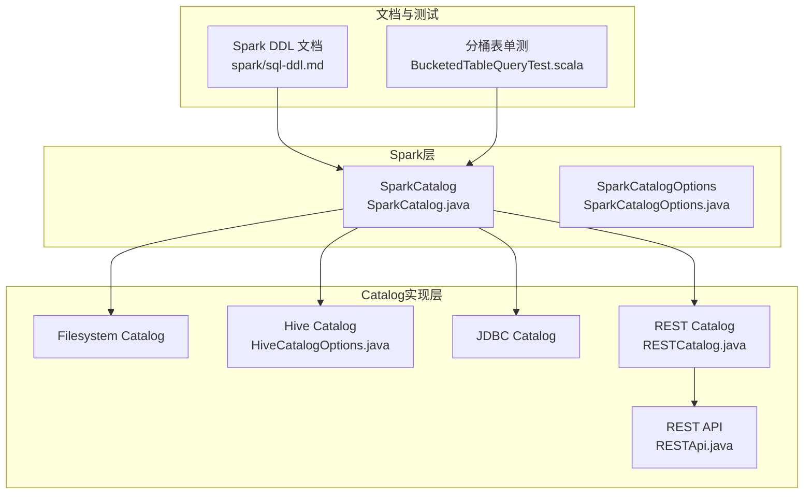
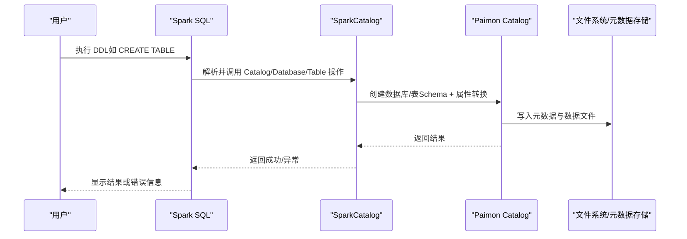
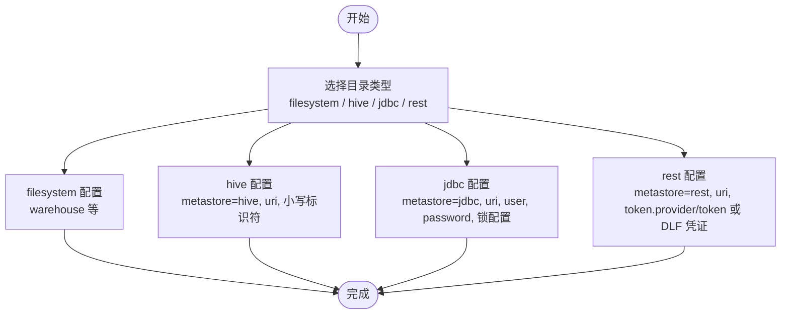
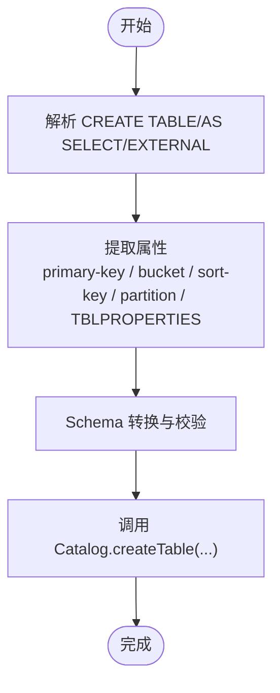
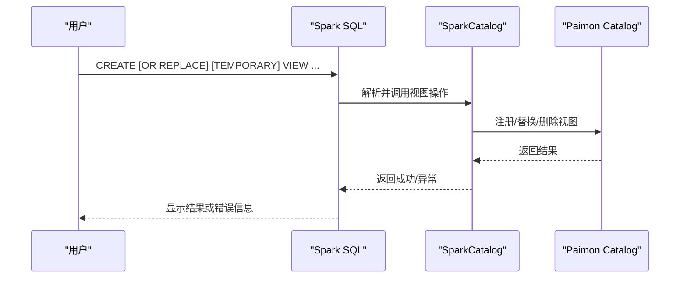
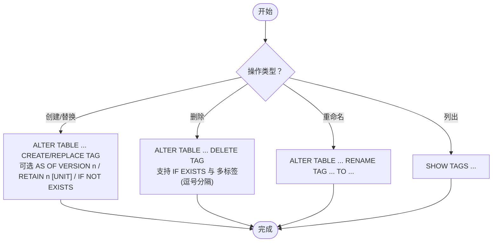
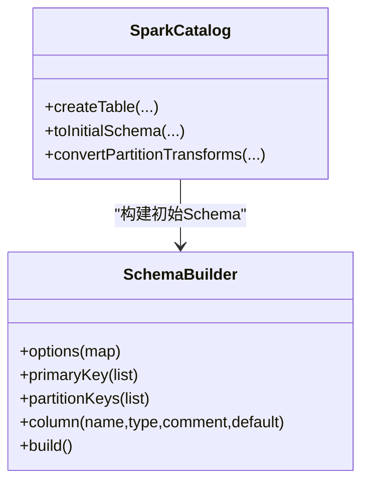
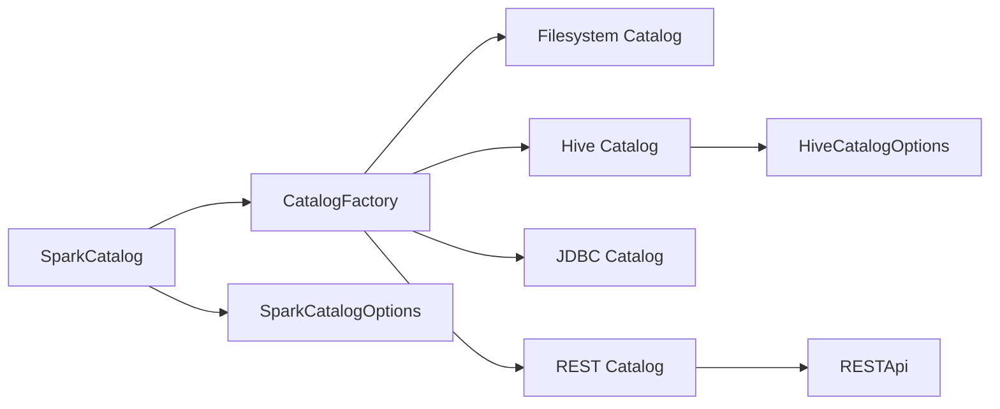

# DDL操作

<cite>
**本文引用的文件**
- [spark/sql-ddl.md](file://docs/content/spark/sql-ddl.md)
- [SparkCatalog.java](file://paimon-spark/paimon-spark-common/src/main/java/org/apache/paimon/spark/SparkCatalog.java)
- [SparkCatalogOptions.java](file://paimon-spark/paimon-spark-common/src/main/java/org/apache/paimon/spark/SparkCatalogOptions.java)
- [RESTApi.java](file://paimon-api/src/main/java/org/apache/paimon/rest/RESTApi.java)
- [RESTCatalog.java](file://paimon-core/src/main/java/org/apache/paimon/rest/RESTCatalog.java)
- [HiveCatalogOptions.java](file://paimon-hive/paimon-hive-catalog/src/main/java/org/apache/paimon/hive/HiveCatalogOptions.java)
- [BucketedTableQueryTest.scala](file://paimon-spark/paimon-spark-ut/src/test/scala/org/apache/paimon/spark/sql/BucketedTableQueryTest.scala)
</cite>

## 目录
1. [简介](#简介)
2. [项目结构](#项目结构)
3. [核心组件](#核心组件)
4. [架构总览](#架构总览)
5. [详细组件分析](#详细组件分析)
6. [依赖关系分析](#依赖关系分析)
7. [性能考虑](#性能考虑)
8. [故障排查指南](#故障排查指南)
9. [结论](#结论)
10. [附录](#附录)

## 简介
本技术文档聚焦于Apache Paimon在Spark中的DDL（数据定义语言）操作，系统性阐述以下主题：
- 目录（Catalog）创建与配置：filesystem、hive、jdbc、rest等类型及其关键配置项
- 表的创建语法：CREATE TABLE、CREATE EXTERNAL TABLE、CREATE TABLE AS SELECT，以及Paimon特有表属性（primary-key、bucket、sort-key、partition等）
- 视图（View）的创建与管理：临时视图与永久视图的区别及限制
- 标签（Tag）操作：创建、替换、删除、重命名、列出标签的SQL语法与使用场景
- 完整的DDL语法示例与实际应用场景，包含错误处理与最佳实践建议

本文件以仓库内官方文档与核心实现代码为依据，确保内容准确可追溯。

## 项目结构
围绕Spark DDL能力，相关知识与实现主要分布在如下位置：
- 官方文档：Spark DDL章节，涵盖目录类型、表与视图、标签等
- Spark Catalog实现：负责将Spark SQL的DDL解析为Paimon Catalog操作，并完成Schema转换与属性映射
- REST Catalog与REST API：支持远程REST Catalog的注册与交互
- Hive Catalog选项：提供Hive元数据存储的配置项说明
- 单测用例：验证分桶表等特性在Spark中的行为

**图表来源**
- [SparkCatalog.java:105-153](file://paimon-spark/paimon-spark-common/src/main/java/org/apache/paimon/spark/SparkCatalog.java#L105-L153)
- [SparkCatalogOptions.java:27-46](file://paimon-spark/paimon-spark-common/src/main/java/org/apache/paimon/spark/SparkCatalogOptions.java#L27-L46)
- [RESTCatalog.java:105-139](file://paimon-core/src/main/java/org/apache/paimon/rest/RESTCatalog.java#L105-L139)
- [RESTApi.java:117-149](file://paimon-api/src/main/java/org/apache/paimon/rest/RESTApi.java#L117-L149)
- [HiveCatalogOptions.java:29-49](file://paimon-hive/paimon-hive-catalog/src/main/java/org/apache/paimon/hive/HiveCatalogOptions.java#L29-L49)
- [spark/sql-ddl.md:29-165](file://docs/content/spark/sql-ddl.md#L29-L165)
- [BucketedTableQueryTest.scala:183-198](file://paimon-spark/paimon-spark-ut/src/test/scala/org/apache/paimon/spark/sql/BucketedTableQueryTest.scala#L183-L198)

**章节来源**
- [spark/sql-ddl.md:29-165](file://docs/content/spark/sql-ddl.md#L29-L165)
- [SparkCatalog.java:105-153](file://paimon-spark/paimon-spark-common/src/main/java/org/apache/paimon/spark/SparkCatalog.java#L105-L153)

## 核心组件
- SparkCatalog：Spark SQL到Paimon Catalog的桥接器，负责初始化Catalog、解析DDL、执行数据库/表/函数/视图等操作，并进行Schema与属性转换
- SparkCatalogOptions：Spark Catalog的运行时配置项，如默认数据库、是否启用v1函数等
- RESTCatalog与RESTApi：支持通过REST协议连接远端Catalog服务
- HiveCatalogOptions：Hive Catalog的配置项，如Hive配置目录、Hadoop配置目录等
- 官方文档：提供目录类型、表/视图/标签的完整语法与示例

**章节来源**
- [SparkCatalog.java:105-153](file://paimon-spark/paimon-spark-common/src/main/java/org/apache/paimon/spark/SparkCatalog.java#L105-L153)
- [SparkCatalogOptions.java:27-46](file://paimon-spark/paimon-spark-common/src/main/java/org/apache/paimon/spark/SparkCatalogOptions.java#L27-L46)
- [RESTCatalog.java:105-139](file://paimon-core/src/main/java/org/apache/paimon/rest/RESTCatalog.java#L105-L139)
- [RESTApi.java:117-149](file://paimon-api/src/main/java/org/apache/paimon/rest/RESTApi.java#L117-L149)
- [HiveCatalogOptions.java:29-49](file://paimon-hive/paimon-hive-catalog/src/main/java/org/apache/paimon/hive/HiveCatalogOptions.java#L29-L49)
- [spark/sql-ddl.md:29-165](file://docs/content/spark/sql-ddl.md#L29-L165)

## 架构总览
下图展示了Spark DDL在Paimon中的整体调用链：Spark SQL解析DDL后，由SparkCatalog将其转换为Paimon Catalog的内部表示并落库；对于REST Catalog，通过REST API与远端服务交互。

**图表来源**
- [SparkCatalog.java:277-376](file://paimon-spark/paimon-spark-common/src/main/java/org/apache/paimon/spark/SparkCatalog.java#L277-L376)
- [spark/sql-ddl.md:167-286](file://docs/content/spark/sql-ddl.md#L167-L286)

## 详细组件分析

### 目录（Catalog）创建与配置
- 类型与用途
  - filesystem：默认元存储，元数据与表文件均存放在文件系统中
  - hive：额外将元数据同步至Hive Metastore，可在Hive侧直接访问表
  - jdbc：将元数据存储在关系型数据库（如MySQL、Postgres）中
  - rest：通过REST协议连接远端Catalog服务，支持多种鉴权方式（如bear token、DLF AK/SK/STS）
- 关键配置项（示例路径）
  - filesystem：仓库路径（warehouse）、默认表选项前缀（table-default.*）
  - hive：metastore=hive、uri指向Hive Metastore、数据库/表/字段名需小写
  - jdbc：metastore=jdbc、uri/jdbc.user/jdbc.password、锁配置仅对MySQL/SQLite支持
  - rest：metastore=rest、uri、token.provider与token（或DLF相关AK/Secret/Token）

**图表来源**
- [spark/sql-ddl.md:31-165](file://docs/content/spark/sql-ddl.md#L31-L165)

**章节来源**
- [spark/sql-ddl.md:31-165](file://docs/content/spark/sql-ddl.md#L31-L165)

### 表的创建语法与属性
- 基本创建
  - CREATE TABLE：创建受Paimon Catalog管理的表，删除表会级联删除数据文件
  - CREATE EXTERNAL TABLE：当metastore为hive且指定location时视为外部表，删除仅移除元数据不删数据
  - CREATE TABLE AS SELECT：基于查询结果创建并填充数据，可同时指定primary-key、partition、TBLPROPERTIES等
- Paimon特有表属性
  - primary-key：主键列，用于更新/去重等能力
  - bucket：分桶数量，提升Join/聚合等查询性能
  - sort-key：排序键，优化顺序扫描与范围查询
  - partition：分区列，按列值分治存储
- 示例与参考路径
  - 基本表与分区表、外部表、CTAS等语法示例见官方文档对应章节

**图表来源**
- [SparkCatalog.java:456-511](file://paimon-spark/paimon-spark-common/src/main/java/org/apache/paimon/spark/SparkCatalog.java#L456-L511)
- [spark/sql-ddl.md:169-286](file://docs/content/spark/sql-ddl.md#L169-L286)

**章节来源**
- [spark/sql-ddl.md:169-286](file://docs/content/spark/sql-ddl.md#L169-L286)
- [SparkCatalog.java:456-511](file://paimon-spark/paimon-spark-common/src/main/java/org/apache/paimon/spark/SparkCatalog.java#L456-L511)

### 视图的创建与管理
- 视图由Paimon Catalog管理，当前在metastore为hive或rest时支持视图
- 支持创建/替换视图（含临时视图），以及删除视图
- 临时视图不指定数据库名，永久视图需指定数据库

**图表来源**
- [spark/sql-ddl.md:288-313](file://docs/content/spark/sql-ddl.md#L288-L313)
- [SparkCatalog.java:534-593](file://paimon-spark/paimon-spark-common/src/main/java/org/apache/paimon/spark/SparkCatalog.java#L534-L593)

**章节来源**
- [spark/sql-ddl.md:288-313](file://docs/content/spark/sql-ddl.md#L288-L313)
- [SparkCatalog.java:534-593](file://paimon-spark/paimon-spark-common/src/main/java/org/apache/paimon/spark/SparkCatalog.java#L534-L593)

### 标签（Tag）操作
- 创建/替换标签：支持基于最新快照或指定版本创建标签，可设置保留时长；支持IF NOT EXISTS与CREATE OR REPLACE
- 删除标签：支持删除单个或多个标签（逗号分隔），支持IF EXISTS
- 重命名标签：将现有标签改名为新名称
- 列出标签：展示表的所有标签

**图表来源**
- [spark/sql-ddl.md:314-368](file://docs/content/spark/sql-ddl.md#L314-L368)

**章节来源**
- [spark/sql-ddl.md:314-368](file://docs/content/spark/sql-ddl.md#L314-L368)

### 分桶表与排序键（性能相关）
- 分桶（bucket）：通过TBLPROPERTIES设置bucket数量，有助于Join/聚合等操作的性能
- 排序键（sort-key）：用于优化顺序扫描与范围查询
- 单测验证了分桶表的创建与查询行为，可作为参考

**图表来源**
- [SparkCatalog.java:456-511](file://paimon-spark/paimon-spark-common/src/main/java/org/apache/paimon/spark/SparkCatalog.java#L456-L511)

**章节来源**
- [BucketedTableQueryTest.scala:183-198](file://paimon-spark/paimon-spark-ut/src/test/scala/org/apache/paimon/spark/sql/BucketedTableQueryTest.scala#L183-L198)
- [SparkCatalog.java:456-511](file://paimon-spark/paimon-spark-common/src/main/java/org/apache/paimon/spark/SparkCatalog.java#L456-L511)

## 依赖关系分析
- SparkCatalog依赖CatalogFactory创建具体Catalog实例（filesystem/hive/jdbc/rest）
- REST Catalog通过RESTApi与远端服务交互，避免引入Hadoop等文件系统依赖
- Hive Catalog通过HiveCatalogOptions配置Hive/Hadoop相关路径
- Spark CatalogOptions控制默认数据库与函数兼容性等行为

**图表来源**
- [SparkCatalog.java:124-137](file://paimon-spark/paimon-spark-common/src/main/java/org/apache/paimon/spark/SparkCatalog.java#L124-L137)
- [RESTCatalog.java:105-139](file://paimon-core/src/main/java/org/apache/paimon/rest/RESTCatalog.java#L105-L139)
- [RESTApi.java:117-149](file://paimon-api/src/main/java/org/apache/paimon/rest/RESTApi.java#L117-L149)
- [HiveCatalogOptions.java:29-49](file://paimon-hive/paimon-hive-catalog/src/main/java/org/apache/paimon/hive/HiveCatalogOptions.java#L29-L49)
- [SparkCatalogOptions.java:27-46](file://paimon-spark/paimon-spark-common/src/main/java/org/apache/paimon/spark/SparkCatalogOptions.java#L27-L46)

**章节来源**
- [SparkCatalog.java:124-137](file://paimon-spark/paimon-spark-common/src/main/java/org/apache/paimon/spark/SparkCatalog.java#L124-L137)
- [RESTCatalog.java:105-139](file://paimon-core/src/main/java/org/apache/paimon/rest/RESTCatalog.java#L105-L139)
- [RESTApi.java:117-149](file://paimon-api/src/main/java/org/apache/paimon/rest/RESTApi.java#L117-L149)
- [HiveCatalogOptions.java:29-49](file://paimon-hive/paimon-hive-catalog/src/main/java/org/apache/paimon/hive/HiveCatalogOptions.java#L29-L49)
- [SparkCatalogOptions.java:27-46](file://paimon-spark/paimon-spark-common/src/main/java/org/apache/paimon/spark/SparkCatalogOptions.java#L27-L46)

## 性能考虑
- 合理设置分桶（bucket）与排序键（sort-key）可显著提升Join、聚合与范围扫描性能
- 主键（primary-key）用于更新/去重等能力，建议根据业务主键设计选择
- 对于分区表，分区键应结合查询模式选择，避免过度分区导致小文件过多
- 使用REST Catalog时，合理配置token与网络参数，减少远程交互开销

[本节为通用指导，无需特定文件来源]

## 故障排查指南
- 目录类型与配置
  - hive目录要求数据库/表/字段名小写，否则可能无法被Hive识别
  - jdbc目录的锁配置仅对MySQL/SQLite生效，其他数据库请勿配置锁相关项
  - rest目录需正确配置token/provider与远端URI
- 表与视图
  - 外部表删除仅移除元数据，确认location与权限
  - 视图在hive或rest元存储下可用，其他类型可能不支持
- 标签
  - 自动创建标签策略下，每个快照仅允许一个自动标签
- 典型异常
  - 数据库不存在、表已存在、列已存在/不存在等异常在Spark Catalog中进行抛出与转换

**章节来源**
- [spark/sql-ddl.md:61-165](file://docs/content/spark/sql-ddl.md#L61-L165)
- [SparkCatalog.java:342-376](file://paimon-spark/paimon-spark-common/src/main/java/org/apache/paimon/spark/SparkCatalog.java#L342-L376)

## 结论
本文从官方文档与核心实现两方面梳理了Paimon在Spark中的DDL能力，覆盖目录创建与配置、表/视图/标签的语法与实践，并给出架构与流程图示。结合单测与配置项，读者可据此在不同元存储类型下安全地进行DDL操作，并针对性能与可靠性进行优化。

[本节为总结，无需特定文件来源]

## 附录
- 官方文档：Spark DDL章节，包含目录、表、视图、标签的完整语法与示例
- 实现要点：SparkCatalog负责DDL解析与Schema转换，REST Catalog通过RESTApi与远端交互，Hive Catalog通过HiveCatalogOptions配置

**章节来源**
- [spark/sql-ddl.md:29-370](file://docs/content/spark/sql-ddl.md#L29-L370)
- [SparkCatalog.java:105-709](file://paimon-spark/paimon-spark-common/src/main/java/org/apache/paimon/spark/SparkCatalog.java#L105-L709)
- [RESTApi.java:117-149](file://paimon-api/src/main/java/org/apache/paimon/rest/RESTApi.java#L117-L149)
- [RESTCatalog.java:105-139](file://paimon-core/src/main/java/org/apache/paimon/rest/RESTCatalog.java#L105-L139)
- [HiveCatalogOptions.java:29-49](file://paimon-hive/paimon-hive-catalog/src/main/java/org/apache/paimon/hive/HiveCatalogOptions.java#L29-L49)
- [BucketedTableQueryTest.scala:183-198](file://paimon-spark/paimon-spark-ut/src/test/scala/org/apache/paimon/spark/sql/BucketedTableQueryTest.scala#L183-L198)