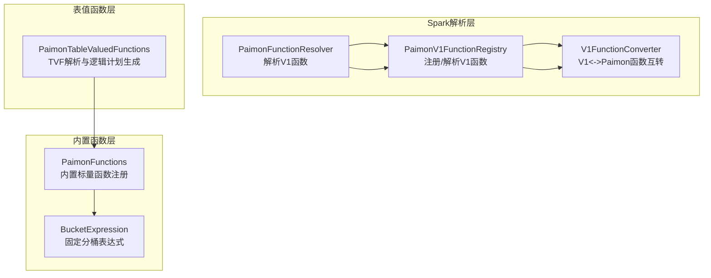
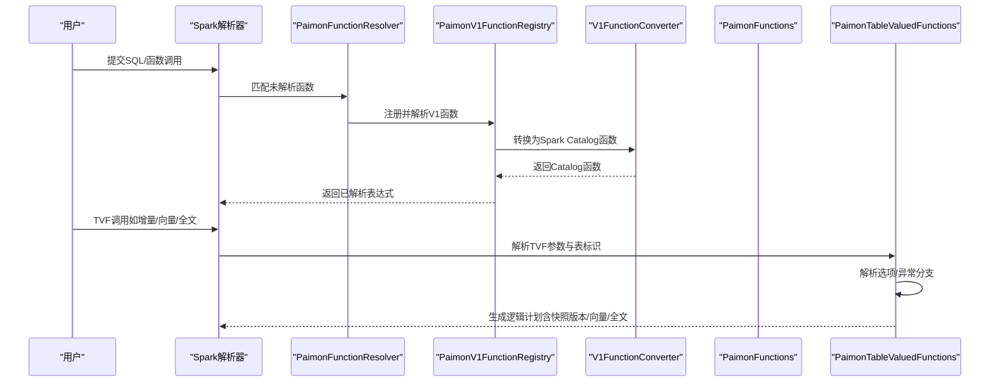
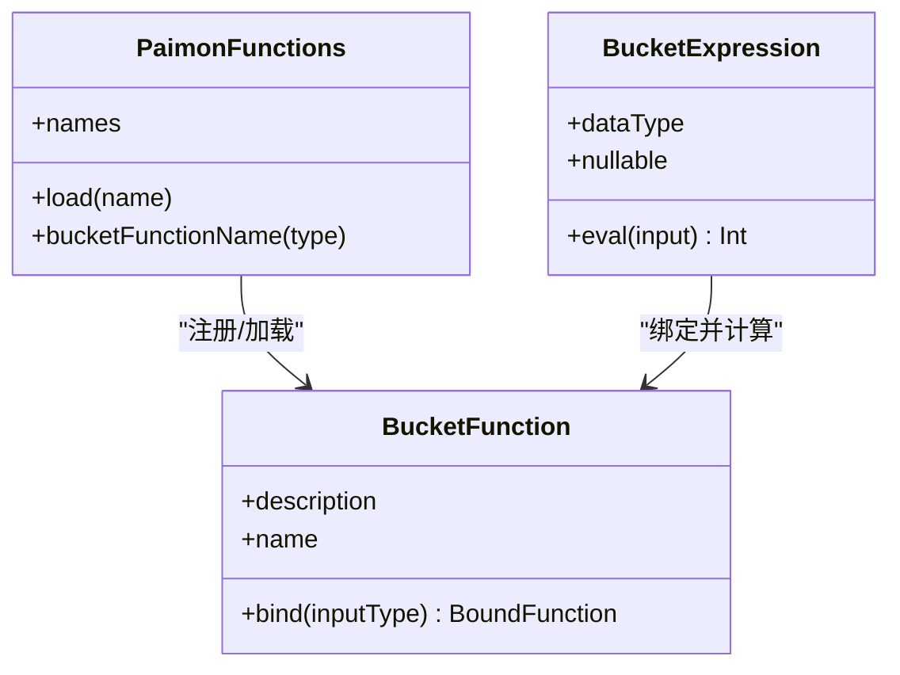
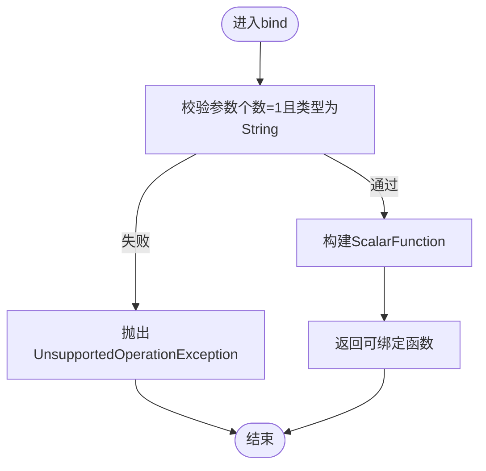
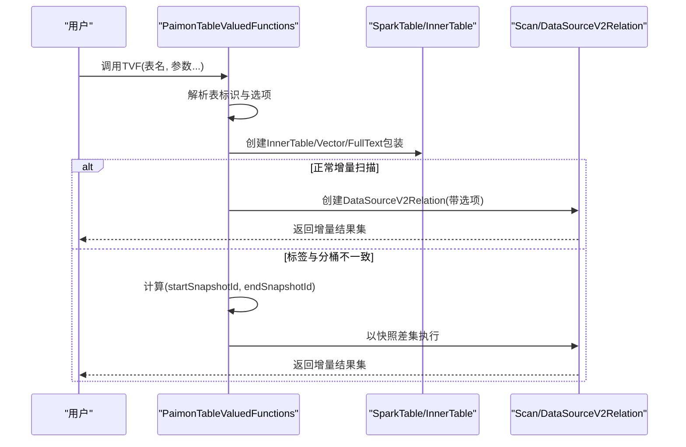
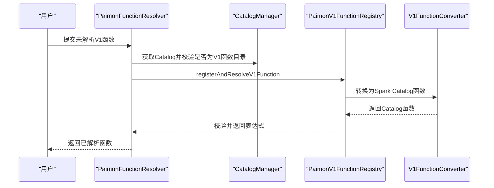
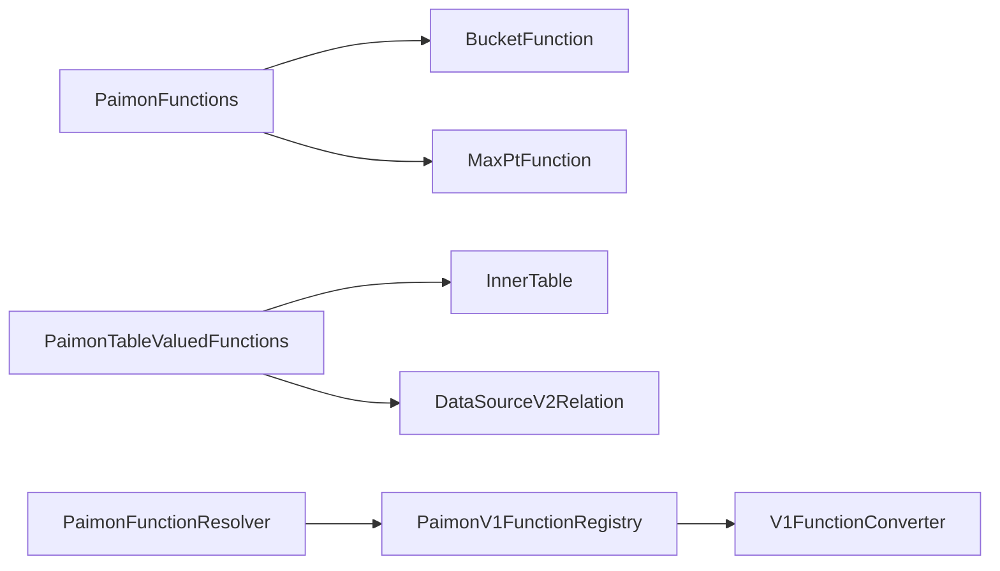

# SQL函数

<cite>
**本文引用的文件**
- [docs/content/spark/sql-functions.md](file://docs/content/spark/sql-functions.md)
- [paimon-spark/paimon-spark-common/src/main/scala/org/apache/paimon/spark/catalog/functions/PaimonFunctions.scala](file://paimon-spark/paimon-spark-common/src/main/scala/org/apache/paimon/spark/catalog/functions/PaimonFunctions.scala)
- [paimon-spark/paimon-spark-common/src/main/scala/org/apache/paimon/spark/catalyst/analysis/PaimonFunctionResolver.scala](file://paimon-spark/paimon-spark-common/src/main/scala/org/apache/paimon/spark/catalyst/analysis/PaimonFunctionResolver.scala)
- [paimon-spark/paimon-spark-common/src/main/scala/org/apache/paimon/spark/catalyst/plans/logical/PaimonTableValuedFunctions.scala](file://paimon-spark/paimon-spark-common/src/main/scala/org/apache/paimon/spark/catalyst/plans/logical/PaimonTableValuedFunctions.scala)
- [paimon-spark/paimon-spark-common/src/main/scala/org/apache/paimon/spark/commands/BucketExpression.scala](file://paimon-spark/paimon-spark-common/src/main/scala/org/apache/paimon/spark/commands/BucketExpression.scala)
- [paimon-spark/paimon-spark-common/src/main/scala/org/apache/paimon/spark/catalog/functions/V1FunctionConverter.scala](file://paimon-spark/paimon-spark-common/src/main/scala/org/apache/paimon/spark/catalog/functions/V1FunctionConverter.scala)
- [paimon-spark/paimon-spark-common/src/main/scala/org/apache/spark/sql/catalyst/catalog/PaimonV1FunctionRegistry.scala](file://paimon-spark/paimon-spark-common/src/main/scala/org/apache/spark/sql/catalyst/catalog/PaimonV1FunctionRegistry.scala)
- [paimon-spark/paimon-spark-common/src/main/java/org/apache/paimon/spark/PaimonSparkScalarFunction.java](file://paimon-spark/paimon-spark-common/src/main/java/org/apache/paimon/spark/PaimonSparkScalarFunction.java)
</cite>

## 目录
1. [简介](#简介)
2. [项目结构](#项目结构)
3. [核心组件](#核心组件)
4. [架构总览](#架构总览)
5. [详细组件分析](#详细组件分析)
6. [依赖关系分析](#依赖关系分析)
7. [性能考量](#性能考量)
8. [故障排查指南](#故障排查指南)
9. [结论](#结论)
10. [附录：函数语法与使用场景](#附录函数语法与使用场景)

## 简介
本文件面向Apache Paimon在Spark中的SQL函数能力，系统性梳理内置标量函数与表值函数（TVF）的能力边界、解析与绑定流程、执行路径以及与Spark Catalog和V1函数体系的集成方式。重点覆盖以下主题：
- 时间旅行与增量查询：基于快照版本、标签与时间戳的增量扫描函数
- 版本控制辅助：最大分区值查询函数
- 分桶函数：基于不同分桶策略的哈希分桶表达式
- Blob描述符函数：路径到描述符、描述符到字符串
- 用户自定义函数：Lambda与文件型函数的注册与解析
- 函数组合与性能优化建议

## 项目结构
围绕Spark SQL函数，Paimon在spark-common模块中提供了如下关键构件：
- 内置函数注册与绑定：PaimonFunctions对象负责内置标量函数的名称与实现映射，并在bind阶段生成可执行的ScalarFunction
- 表值函数解析：PaimonTableValuedFunctions提供增量查询、向量检索、全文检索等TVF的解析与逻辑计划生成
- V1函数解析器：PaimonFunctionResolver将未解析的V1函数解析为具体实现
- V1函数注册与转换：PaimonV1FunctionRegistry与V1FunctionConverter负责持久化函数的注册、校验与Spark Catalog互转
- 分桶表达式：BucketExpression提供写入路径下的固定分桶表达式，绕过Catalog限制
- 标量函数桥接：PaimonSparkScalarFunction用于封装Lambda函数的输入类型、返回类型与编译后的方法

图表来源
- [paimon-spark/paimon-spark-common/src/main/scala/org/apache/paimon/spark/catalyst/analysis/PaimonFunctionResolver.scala:29-51](file://paimon-spark/paimon-spark-common/src/main/scala/org/apache/paimon/spark/catalyst/analysis/PaimonFunctionResolver.scala#L29-L51)
- [paimon-spark/paimon-spark-common/src/main/scala/org/apache/spark/sql/catalyst/catalog/PaimonV1FunctionRegistry.scala:38-76](file://paimon-spark/paimon-spark-common/src/main/scala/org/apache/spark/sql/catalyst/catalog/PaimonV1FunctionRegistry.scala#L38-L76)
- [paimon-spark/paimon-spark-common/src/main/scala/org/apache/paimon/spark/catalog/functions/V1FunctionConverter.scala:37-68](file://paimon-spark/paimon-spark-common/src/main/scala/org/apache/paimon/spark/catalog/functions/V1FunctionConverter.scala#L37-L68)
- [paimon-spark/paimon-spark-common/src/main/scala/org/apache/paimon/spark/catalog/functions/PaimonFunctions.scala:42-77](file://paimon-spark/paimon-spark-common/src/main/scala/org/apache/paimon/spark/catalog/functions/PaimonFunctions.scala#L42-L77)
- [paimon-spark/paimon-spark-common/src/main/scala/org/apache/paimon/spark/commands/BucketExpression.scala:41-83](file://paimon-spark/paimon-spark-common/src/main/scala/org/apache/paimon/spark/commands/BucketExpression.scala#L41-L83)
- [paimon-spark/paimon-spark-common/src/main/scala/org/apache/paimon/spark/catalyst/plans/logical/PaimonTableValuedFunctions.scala:41-76](file://paimon-spark/paimon-spark-common/src/main/scala/org/apache/paimon/spark/catalyst/plans/logical/PaimonTableValuedFunctions.scala#L41-L76)

章节来源
- [paimon-spark/paimon-spark-common/src/main/scala/org/apache/paimon/spark/catalog/functions/PaimonFunctions.scala:42-77](file://paimon-spark/paimon-spark-common/src/main/scala/org/apache/paimon/spark/catalog/functions/PaimonFunctions.scala#L42-L77)
- [paimon-spark/paimon-spark-common/src/main/scala/org/apache/paimon/spark/catalyst/plans/logical/PaimonTableValuedFunctions.scala:41-76](file://paimon-spark/paimon-spark-common/src/main/scala/org/apache/paimon/spark/catalyst/plans/logical/PaimonTableValuedFunctions.scala#L41-L76)
- [paimon-spark/paimon-spark-common/src/main/scala/org/apache/paimon/spark/commands/BucketExpression.scala:41-83](file://paimon-spark/paimon-spark-common/src/main/scala/org/apache/paimon/spark/commands/BucketExpression.scala#L41-L83)
- [paimon-spark/paimon-spark-common/src/main/scala/org/apache/paimon/spark/catalyst/analysis/PaimonFunctionResolver.scala:29-51](file://paimon-spark/paimon-spark-common/src/main/scala/org/apache/paimon/spark/catalyst/analysis/PaimonFunctionResolver.scala#L29-L51)
- [paimon-spark/paimon-spark-common/src/main/scala/org/apache/paimon/spark/catalog/functions/V1FunctionConverter.scala:37-68](file://paimon-spark/paimon-spark-common/src/main/scala/org/apache/paimon/spark/catalog/functions/V1FunctionConverter.scala#L37-L68)
- [paimon-spark/paimon-spark-common/src/main/scala/org/apache/spark/sql/catalyst/catalog/PaimonV1FunctionRegistry.scala:38-76](file://paimon-spark/paimon-spark-common/src/main/scala/org/apache/spark/sql/catalyst/catalog/PaimonV1FunctionRegistry.scala#L38-L76)

## 核心组件
- 内置标量函数
  - 分桶函数族：支持默认、模运算、Hive兼容三种分桶策略，按桶键序列计算桶ID
  - 最大分区值函数：针对分区表返回首级分区的最大有效值
  - Blob描述符函数：路径到描述符、描述符到字符串
- 表值函数（TVF）
  - 增量查询：基于快照ID区间或标签名进行增量扫描
  - 向量检索：对指定向量列进行Top-K相似度检索
  - 全文检索：对指定文本列进行关键词Top-K检索
- V1函数解析与注册
  - 解析未解析的V1函数，校验参数数量与类型，注册到Spark FunctionRegistry
  - 支持持久化函数的加载、校验与表达式构建
- 分桶表达式
  - 针对写入路径的固定分桶表达式，绕过spark_catalog对V2函数的限制
- 标量函数桥接
  - 封装Lambda函数的输入输出类型与编译方法，作为ScalarFunction实现

章节来源
- [paimon-spark/paimon-spark-common/src/main/scala/org/apache/paimon/spark/catalog/functions/PaimonFunctions.scala:84-123](file://paimon-spark/paimon-spark-common/src/main/scala/org/apache/paimon/spark/catalog/functions/PaimonFunctions.scala#L84-L123)
- [paimon-spark/paimon-spark-common/src/main/scala/org/apache/paimon/spark/catalog/functions/PaimonFunctions.scala:165-197](file://paimon-spark/paimon-spark-common/src/main/scala/org/apache/paimon/spark/catalog/functions/PaimonFunctions.scala#L165-L197)
- [paimon-spark/paimon-spark-common/src/main/scala/org/apache/paimon/spark/catalyst/plans/logical/PaimonTableValuedFunctions.scala:234-273](file://paimon-spark/paimon-spark-common/src/main/scala/org/apache/paimon/spark/catalyst/plans/logical/PaimonTableValuedFunctions.scala#L234-L273)
- [paimon-spark/paimon-spark-common/src/main/scala/org/apache/paimon/spark/catalyst/plans/logical/PaimonTableValuedFunctions.scala:286-340](file://paimon-spark/paimon-spark-common/src/main/scala/org/apache/paimon/spark/catalyst/plans/logical/PaimonTableValuedFunctions.scala#L286-L340)
- [paimon-spark/paimon-spark-common/src/main/scala/org/apache/paimon/spark/catalyst/plans/logical/PaimonTableValuedFunctions.scala:353-389](file://paimon-spark/paimon-spark-common/src/main/scala/org/apache/paimon/spark/catalyst/plans/logical/PaimonTableValuedFunctions.scala#L353-L389)
- [paimon-spark/paimon-spark-common/src/main/scala/org/apache/paimon/spark/commands/BucketExpression.scala:41-83](file://paimon-spark/paimon-spark-common/src/main/scala/org/apache/paimon/spark/commands/BucketExpression.scala#L41-L83)
- [paimon-spark/paimon-spark-common/src/main/java/org/apache/paimon/spark/PaimonSparkScalarFunction.java:33-63](file://paimon-spark/paimon-spark-common/src/main/java/org/apache/paimon/spark/PaimonSparkScalarFunction.java#L33-L63)

## 架构总览
下图展示从SQL解析到函数执行的关键路径，涵盖V1函数解析、内置函数绑定、TVF解析与增量扫描执行。

图表来源
- [paimon-spark/paimon-spark-common/src/main/scala/org/apache/paimon/spark/catalyst/analysis/PaimonFunctionResolver.scala:33-50](file://paimon-spark/paimon-spark-common/src/main/scala/org/apache/paimon/spark/catalyst/analysis/PaimonFunctionResolver.scala#L33-L50)
- [paimon-spark/paimon-spark-common/src/main/scala/org/apache/spark/sql/catalyst/catalog/PaimonV1FunctionRegistry.scala:46-54](file://paimon-spark/paimon-spark-common/src/main/scala/org/apache/spark/sql/catalyst/catalog/PaimonV1FunctionRegistry.scala#L46-L54)
- [paimon-spark/paimon-spark-common/src/main/scala/org/apache/paimon/spark/catalog/functions/V1FunctionConverter.scala:42-58](file://paimon-spark/paimon-spark-common/src/main/scala/org/apache/paimon/spark/catalog/functions/V1FunctionConverter.scala#L42-L58)
- [paimon-spark/paimon-spark-common/src/main/scala/org/apache/paimon/spark/catalog/functions/PaimonFunctions.scala:84-123](file://paimon-spark/paimon-spark-common/src/main/scala/org/apache/paimon/spark/catalog/functions/PaimonFunctions.scala#L84-L123)
- [paimon-spark/paimon-spark-common/src/main/scala/org/apache/paimon/spark/catalyst/plans/logical/PaimonTableValuedFunctions.scala:78-120](file://paimon-spark/paimon-spark-common/src/main/scala/org/apache/paimon/spark/catalyst/plans/logical/PaimonTableValuedFunctions.scala#L78-L120)

## 详细组件分析

### 内置标量函数：分桶函数族
- 功能概述
  - 支持默认、模运算、Hive兼容三种分桶策略
  - 输入为桶数+桶键字段，输出桶ID（整型）
- 绑定与执行
  - 在bind阶段校验桶数类型为整型，其余桶键字段转换为Paimon内部行类型
  - 使用Paimon的bucket.BucketFunction计算桶ID
- 类型约束
  - 对时间戳精度有严格要求（需与Spark固定精度一致），否则不支持

图表来源
- [paimon-spark/paimon-spark-common/src/main/scala/org/apache/paimon/spark/catalog/functions/PaimonFunctions.scala:84-123](file://paimon-spark/paimon-spark-common/src/main/scala/org/apache/paimon/spark/catalog/functions/PaimonFunctions.scala#L84-L123)
- [paimon-spark/paimon-spark-common/src/main/scala/org/apache/paimon/spark/commands/BucketExpression.scala:41-83](file://paimon-spark/paimon-spark-common/src/main/scala/org/apache/paimon/spark/commands/BucketExpression.scala#L41-L83)

章节来源
- [paimon-spark/paimon-spark-common/src/main/scala/org/apache/paimon/spark/catalog/functions/PaimonFunctions.scala:84-123](file://paimon-spark/paimon-spark-common/src/main/scala/org/apache/paimon/spark/catalog/functions/PaimonFunctions.scala#L84-L123)
- [paimon-spark/paimon-spark-common/src/main/scala/org/apache/paimon/spark/catalog/functions/PaimonFunctions.scala:129-158](file://paimon-spark/paimon-spark-common/src/main/scala/org/apache/paimon/spark/catalog/functions/PaimonFunctions.scala#L129-L158)
- [paimon-spark/paimon-spark-common/src/main/scala/org/apache/paimon/spark/commands/BucketExpression.scala:41-83](file://paimon-spark/paimon-spark-common/src/main/scala/org/apache/paimon/spark/commands/BucketExpression.scala#L41-L83)

### 内置标量函数：最大分区值函数
- 功能概述
  - 针对分区表返回首级分区的最大有效值（按字典序）
  - 不会返回空分区
- 绑定与执行
  - bind阶段校验参数个数与类型（必须为单字符串参数）
  - 实际求值由后续规则替换为具体的分区字面量，避免直接执行

图表来源
- [paimon-spark/paimon-spark-common/src/main/scala/org/apache/paimon/spark/catalog/functions/PaimonFunctions.scala:167-192](file://paimon-spark/paimon-spark-common/src/main/scala/org/apache/paimon/spark/catalog/functions/PaimonFunctions.scala#L167-L192)

章节来源
- [paimon-spark/paimon-spark-common/src/main/scala/org/apache/paimon/spark/catalog/functions/PaimonFunctions.scala:165-197](file://paimon-spark/paimon-spark-common/src/main/scala/org/apache/paimon/spark/catalog/functions/PaimonFunctions.scala#L165-L197)

### 内置标量函数：Blob描述符函数
- 功能概述
  - 路径到描述符：将外部文件路径转换为二进制描述符
  - 描述符到字符串：将二进制描述符转为人类可读字符串
- 应用场景
  - 外部大对象（BLOB）存储与引用
  - 调试与可视化描述符内容

章节来源
- [docs/content/spark/sql-functions.md:56-97](file://docs/content/spark/sql-functions.md#L56-L97)

### 表值函数（TVF）：增量查询
- 功能概述
  - 基于快照ID区间或标签名进行增量扫描
  - 当表的分桶与标签状态不一致时，自动回退到基于快照差集的执行
- 参数与行为
  - 增量查询：起止快照ID
  - 按时间戳增量：起止时间戳
  - 到自动标签：结束标签名
- 执行路径
  - 解析表标识与参数
  - 尝试常规增量扫描；若抛出“标签与分桶不一致”异常，则以快照差集方式执行

图表来源
- [paimon-spark/paimon-spark-common/src/main/scala/org/apache/paimon/spark/catalyst/plans/logical/PaimonTableValuedFunctions.scala:78-120](file://paimon-spark/paimon-spark-common/src/main/scala/org/apache/paimon/spark/catalyst/plans/logical/PaimonTableValuedFunctions.scala#L78-L120)
- [paimon-spark/paimon-spark-common/src/main/scala/org/apache/paimon/spark/catalyst/plans/logical/PaimonTableValuedFunctions.scala:166-214](file://paimon-spark/paimon-spark-common/src/main/scala/org/apache/paimon/spark/catalyst/plans/logical/PaimonTableValuedFunctions.scala#L166-L214)

章节来源
- [paimon-spark/paimon-spark-common/src/main/scala/org/apache/paimon/spark/catalyst/plans/logical/PaimonTableValuedFunctions.scala:234-273](file://paimon-spark/paimon-spark-common/src/main/scala/org/apache/paimon/spark/catalyst/plans/logical/PaimonTableValuedFunctions.scala#L234-L273)
- [paimon-spark/paimon-spark-common/src/main/scala/org/apache/paimon/spark/catalyst/plans/logical/PaimonTableValuedFunctions.scala:248-261](file://paimon-spark/paimon-spark-common/src/main/scala/org/apache/paimon/spark/catalyst/plans/logical/PaimonTableValuedFunctions.scala#L248-L261)
- [paimon-spark/paimon-spark-common/src/main/scala/org/apache/paimon/spark/catalyst/plans/logical/PaimonTableValuedFunctions.scala:263-273](file://paimon-spark/paimon-spark-common/src/main/scala/org/apache/paimon/spark/catalyst/plans/logical/PaimonTableValuedFunctions.scala#L263-L273)

### 表值函数（TVF）：向量检索与全文检索
- 功能概述
  - 向量检索：对指定列执行Top-K向量相似度搜索
  - 全文检索：对指定列执行Top-K关键词搜索
- 参数与校验
  - 必须提供列名、查询向量/文本、限制条数
  - 限制条数必须为正整数
- 执行路径
  - 解析InnerTable与列存在性
  - 构造VectorSearch/FullTextSearch对象并包装为专用表

章节来源
- [paimon-spark/paimon-spark-common/src/main/scala/org/apache/paimon/spark/catalyst/plans/logical/PaimonTableValuedFunctions.scala:286-340](file://paimon-spark/paimon-spark-common/src/main/scala/org/apache/paimon/spark/catalyst/plans/logical/PaimonTableValuedFunctions.scala#L286-L340)
- [paimon-spark/paimon-spark-common/src/main/scala/org/apache/paimon/spark/catalyst/plans/logical/PaimonTableValuedFunctions.scala:353-389](file://paimon-spark/paimon-spark-common/src/main/scala/org/apache/paimon/spark/catalyst/plans/logical/PaimonTableValuedFunctions.scala#L353-L389)

### V1函数解析与注册
- 功能概述
  - 解析未解析的V1函数，检查参数数量与类型
  - 将持久化函数注册到Spark FunctionRegistry，支持临时/永久函数
  - 支持文件型函数（JAR）与Lambda函数的桥接
- 关键点
  - 仅当Catalog为V1函数目录时才允许解析
  - 支持资源加载与函数表达式构建

图表来源
- [paimon-spark/paimon-spark-common/src/main/scala/org/apache/paimon/spark/catalyst/analysis/PaimonFunctionResolver.scala:33-50](file://paimon-spark/paimon-spark-common/src/main/scala/org/apache/paimon/spark/catalyst/analysis/PaimonFunctionResolver.scala#L33-L50)
- [paimon-spark/paimon-spark-common/src/main/scala/org/apache/spark/sql/catalyst/catalog/PaimonV1FunctionRegistry.scala:46-54](file://paimon-spark/paimon-spark-common/src/main/scala/org/apache/spark/sql/catalyst/catalog/PaimonV1FunctionRegistry.scala#L46-L54)
- [paimon-spark/paimon-spark-common/src/main/scala/org/apache/paimon/spark/catalog/functions/V1FunctionConverter.scala:42-58](file://paimon-spark/paimon-spark-common/src/main/scala/org/apache/paimon/spark/catalog/functions/V1FunctionConverter.scala#L42-L58)

章节来源
- [paimon-spark/paimon-spark-common/src/main/scala/org/apache/paimon/spark/catalyst/analysis/PaimonFunctionResolver.scala:29-51](file://paimon-spark/paimon-spark-common/src/main/scala/org/apache/paimon/spark/catalyst/analysis/PaimonFunctionResolver.scala#L29-L51)
- [paimon-spark/paimon-spark-common/src/main/scala/org/apache/spark/sql/catalyst/catalog/PaimonV1FunctionRegistry.scala:38-76](file://paimon-spark/paimon-spark-common/src/main/scala/org/apache/spark/sql/catalyst/catalog/PaimonV1FunctionRegistry.scala#L38-L76)
- [paimon-spark/paimon-spark-common/src/main/scala/org/apache/paimon/spark/catalog/functions/V1FunctionConverter.scala:37-68](file://paimon-spark/paimon-spark-common/src/main/scala/org/apache/paimon/spark/catalog/functions/V1FunctionConverter.scala#L37-L68)

### 分桶表达式（写入路径）
- 功能概述
  - 在写入阶段提供固定分桶表达式，绕过spark_catalog对V2函数的限制
  - 通过解析函数类型与输入类型，动态绑定对应分桶函数
- 使用场景
  - INSERT/CTAS中根据桶键计算桶ID，确保写入一致性

章节来源
- [paimon-spark/paimon-spark-common/src/main/scala/org/apache/paimon/spark/commands/BucketExpression.scala:41-83](file://paimon-spark/paimon-spark-common/src/main/scala/org/apache/paimon/spark/commands/BucketExpression.scala#L41-L83)

### 标量函数桥接：Lambda函数
- 功能概述
  - 封装Lambda函数的输入类型、返回类型与编译方法
  - 作为ScalarFunction实现，供Spark执行引擎调用
- 关键属性
  - 函数名、输入类型数组、返回类型、Java类型、Lambda表达式、编译方法缓存

章节来源
- [paimon-spark/paimon-spark-common/src/main/java/org/apache/paimon/spark/PaimonSparkScalarFunction.java:33-63](file://paimon-spark/paimon-spark-common/src/main/java/org/apache/paimon/spark/PaimonSparkScalarFunction.java#L33-L63)

## 依赖关系分析
- 组件耦合
  - PaimonFunctions与BucketFunction紧密耦合，负责内置标量函数的注册与绑定
  - PaimonTableValuedFunctions依赖InnerTable与Scan能力，处理TVF解析与异常回退
  - PaimonFunctionResolver与PaimonV1FunctionRegistry协作，完成V1函数解析与注册
  - V1FunctionConverter在两者之间提供函数定义的互转
- 外部依赖
  - Spark SQL Catalyst解析与表达式执行框架
  - Paimon Core的BucketFunction、VectorSearch、FullTextSearch等能力

图表来源
- [paimon-spark/paimon-spark-common/src/main/scala/org/apache/paimon/spark/catalog/functions/PaimonFunctions.scala:42-77](file://paimon-spark/paimon-spark-common/src/main/scala/org/apache/paimon/spark/catalog/functions/PaimonFunctions.scala#L42-L77)
- [paimon-spark/paimon-spark-common/src/main/scala/org/apache/paimon/spark/catalyst/plans/logical/PaimonTableValuedFunctions.scala:41-76](file://paimon-spark/paimon-spark-common/src/main/scala/org/apache/paimon/spark/catalyst/plans/logical/PaimonTableValuedFunctions.scala#L41-L76)
- [paimon-spark/paimon-spark-common/src/main/scala/org/apache/paimon/spark/catalyst/analysis/PaimonFunctionResolver.scala:29-51](file://paimon-spark/paimon-spark-common/src/main/scala/org/apache/paimon/spark/catalyst/analysis/PaimonFunctionResolver.scala#L29-L51)
- [paimon-spark/paimon-spark-common/src/main/scala/org/apache/spark/sql/catalyst/catalog/PaimonV1FunctionRegistry.scala:38-76](file://paimon-spark/paimon-spark-common/src/main/scala/org/apache/spark/sql/catalyst/catalog/PaimonV1FunctionRegistry.scala#L38-L76)
- [paimon-spark/paimon-spark-common/src/main/scala/org/apache/paimon/spark/catalog/functions/V1FunctionConverter.scala:37-68](file://paimon-spark/paimon-spark-common/src/main/scala/org/apache/paimon/spark/catalog/functions/V1FunctionConverter.scala#L37-L68)

章节来源
- [paimon-spark/paimon-spark-common/src/main/scala/org/apache/paimon/spark/catalog/functions/PaimonFunctions.scala:42-77](file://paimon-spark/paimon-spark-common/src/main/scala/org/apache/paimon/spark/catalog/functions/PaimonFunctions.scala#L42-L77)
- [paimon-spark/paimon-spark-common/src/main/scala/org/apache/paimon/spark/catalyst/plans/logical/PaimonTableValuedFunctions.scala:41-76](file://paimon-spark/paimon-spark-common/src/main/scala/org/apache/paimon/spark/catalyst/plans/logical/PaimonTableValuedFunctions.scala#L41-L76)
- [paimon-spark/paimon-spark-common/src/main/scala/org/apache/paimon/spark/catalyst/analysis/PaimonFunctionResolver.scala:29-51](file://paimon-spark/paimon-spark-common/src/main/scala/org/apache/paimon/spark/catalyst/analysis/PaimonFunctionResolver.scala#L29-L51)
- [paimon-spark/paimon-spark-common/src/main/scala/org/apache/spark/sql/catalyst/catalog/PaimonV1FunctionRegistry.scala:38-76](file://paimon-spark/paimon-spark-common/src/main/scala/org/apache/spark/sql/catalyst/catalog/PaimonV1FunctionRegistry.scala#L38-L76)
- [paimon-spark/paimon-spark-common/src/main/scala/org/apache/paimon/spark/catalog/functions/V1FunctionConverter.scala:37-68](file://paimon-spark/paimon-spark-common/src/main/scala/org/apache/paimon/spark/catalog/functions/V1FunctionConverter.scala#L37-L68)

## 性能考量
- 分桶函数
  - 仅在哈希固定分桶模式下可用，且桶键类型的时间戳精度需与Spark一致，避免因精度差异导致的分桶异常
- TVF增量扫描
  - 当标签与分桶状态不一致时，自动采用快照差集执行，可能带来额外的扫描成本；建议在批量写入后及时维护标签与分桶一致性
- 向量/全文检索
  - 查询向量/文本需满足类型约束，限制条数必须为正；过大限制可能导致内存压力
- V1函数
  - 文件型函数依赖JAR加载，建议集中管理资源，减少重复加载开销

## 故障排查指南
- V1函数解析错误
  - 若Catalog非V1函数目录，解析将失败；请确认Catalog类型与函数持久化配置
- 分桶函数不生效
  - 检查桶键类型是否包含不支持的高精度时间戳；必要时调整Schema或使用其他分桶策略
- TVF参数错误
  - 增量查询/向量/全文检索均对参数个数与类型有严格断言；请核对函数签名与传参
- 标签与分桶不一致
  - 当抛出“标签与分桶不一致”异常时，系统会自动回退到快照差集执行；建议先修复标签与分桶状态再进行常规增量扫描

章节来源
- [paimon-spark/paimon-spark-common/src/main/scala/org/apache/paimon/spark/catalyst/analysis/PaimonFunctionResolver.scala:38-48](file://paimon-spark/paimon-spark-common/src/main/scala/org/apache/paimon/spark/catalyst/analysis/PaimonFunctionResolver.scala#L38-L48)
- [paimon-spark/paimon-spark-common/src/main/scala/org/apache/paimon/spark/catalog/functions/PaimonFunctions.scala:129-158](file://paimon-spark/paimon-spark-common/src/main/scala/org/apache/paimon/spark/catalog/functions/PaimonFunctions.scala#L129-L158)
- [paimon-spark/paimon-spark-common/src/main/scala/org/apache/paimon/spark/catalyst/plans/logical/PaimonTableValuedFunctions.scala:166-184](file://paimon-spark/paimon-spark-common/src/main/scala/org/apache/paimon/spark/catalyst/plans/logical/PaimonTableValuedFunctions.scala#L166-L184)
- [paimon-spark/paimon-spark-common/src/main/scala/org/apache/paimon/spark/catalyst/plans/logical/PaimonTableValuedFunctions.scala:289-321](file://paimon-spark/paimon-spark-common/src/main/scala/org/apache/paimon/spark/catalyst/plans/logical/PaimonTableValuedFunctions.scala#L289-L321)
- [paimon-spark/paimon-spark-common/src/main/scala/org/apache/paimon/spark/catalyst/plans/logical/PaimonTableValuedFunctions.scala:361-388](file://paimon-spark/paimon-spark-common/src/main/scala/org/apache/paimon/spark/catalyst/plans/logical/PaimonTableValuedFunctions.scala#L361-L388)

## 结论
Paimon在Spark上的SQL函数体系以“内置标量函数 + 表值函数 + V1函数生态”为核心，既满足时间旅行与增量查询等高级能力，又保持与Spark原生函数机制的无缝衔接。通过严格的参数校验、类型约束与异常回退策略，确保在复杂场景下的稳定性与可维护性。建议在生产环境中结合分桶策略、标签维护与TVF参数约束，实现更优的查询与写入性能。

## 附录：函数语法与使用场景
- 内置标量函数
  - 分桶函数族：根据桶数与桶键计算桶ID，适用于写入与一致性校验
  - 最大分区值函数：返回分区表首级分区的最大有效值，便于时间旅行与分区裁剪
  - Blob描述符函数：路径到描述符、描述符到字符串，用于外部大对象引用与调试
- 表值函数（TVF）
  - 增量查询：基于快照ID区间或标签名进行增量扫描
  - 向量检索：对指定列执行Top-K向量相似度搜索
  - 全文检索：对指定列执行Top-K关键词搜索
- V1函数
  - Lambda函数：通过sys.create_function/sys.alter_function/sys.drop_function进行持久化管理
  - 文件函数：通过JAR注册，支持Spark/Hive UDF/UDAF

章节来源
- [docs/content/spark/sql-functions.md:31-157](file://docs/content/spark/sql-functions.md#L31-L157)
- [paimon-spark/paimon-spark-common/src/main/scala/org/apache/paimon/spark/catalog/functions/PaimonFunctions.scala:44-59](file://paimon-spark/paimon-spark-common/src/main/scala/org/apache/paimon/spark/catalog/functions/PaimonFunctions.scala#L44-L59)
- [paimon-spark/paimon-spark-common/src/main/scala/org/apache/paimon/spark/catalyst/plans/logical/PaimonTableValuedFunctions.scala:43-55](file://paimon-spark/paimon-spark-common/src/main/scala/org/apache/paimon/spark/catalyst/plans/logical/PaimonTableValuedFunctions.scala#L43-L55)
- [paimon-spark/paimon-spark-common/src/main/scala/org/apache/paimon/spark/catalog/functions/V1FunctionConverter.scala:42-58](file://paimon-spark/paimon-spark-common/src/main/scala/org/apache/paimon/spark/catalog/functions/V1FunctionConverter.scala#L42-L58)