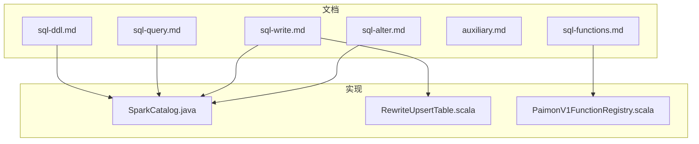
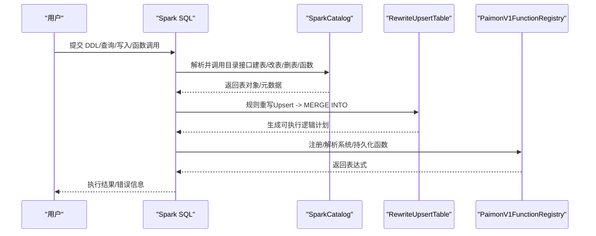
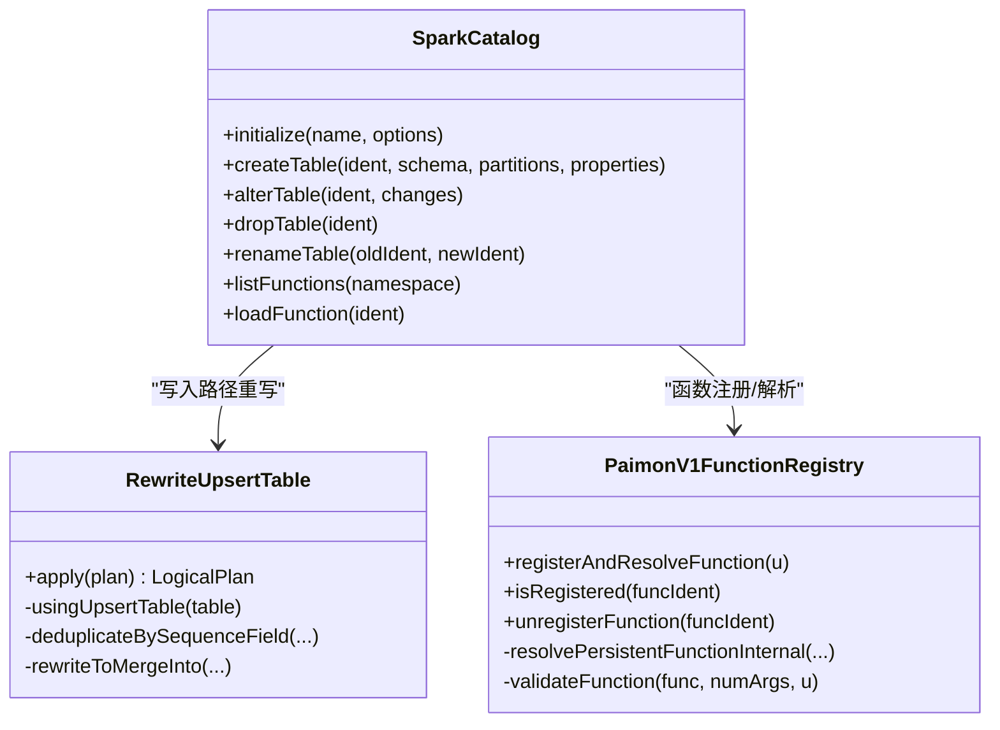

# SQL操作

<cite>
**本文引用的文件**
- [sql-ddl.md](file://docs/content/spark/sql-ddl.md)
- [sql-query.md](file://docs/content/spark/sql-query.md)
- [sql-write.md](file://docs/content/spark/sql-write.md)
- [sql-functions.md](file://docs/content/spark/sql-functions.md)
- [auxiliary.md](file://docs/content/spark/auxiliary.md)
- [sql-alter.md](file://docs/content/spark/sql-alter.md)
- [SparkCatalog.java](file://paimon-spark/paimon-spark-common/src/main/java/org/apache/paimon/spark/SparkCatalog.java)
- [RewriteUpsertTable.scala](file://paimon-spark/paimon-spark-common/src/main/scala/org/apache/paimon/spark/catalyst/analysis/RewriteUpsertTable.scala)
- [PaimonV1FunctionRegistry.scala](file://paimon-spark/paimon-spark-common/src/main/scala/org/apache/spark/sql/catalyst/catalog/PaimonV1FunctionRegistry.scala)
- [DDLTest.scala（Spark 3.5）](file://paimon-spark/paimon-spark-3.5/src/test/scala/org/apache/paimon/spark/sql/DDLTest.scala)
- [SparkSchemaEvolutionITCase.java](file://paimon-spark/paimon-spark-ut/src/test/java/org/apache/paimon/spark/SparkSchemaEvolutionITCase.java)
</cite>

## 目录
1. [简介](#简介)
2. [项目结构](#项目结构)
3. [核心组件](#核心组件)
4. [架构总览](#架构总览)
5. [详细组件分析](#详细组件分析)
6. [依赖关系分析](#依赖关系分析)
7. [性能考虑](#性能考虑)
8. [故障排查指南](#故障排查指南)
9. [结论](#结论)
10. [附录](#附录)

## 简介
本文件面向使用 Apache Paimon 的 Spark SQL 用户，系统性梳理 DDL、查询、写入、函数与表达式、辅助操作等能力，并结合源码实现说明 Paimon 在 Spark 上的表属性（如主键、分区分桶、排序键等）如何影响读写行为与执行计划。文档同时提供语法要点、使用场景、性能优化建议与查询计划分析方法，帮助读者在生产环境中高效、安全地使用 Paimon。

## 项目结构
围绕 Spark SQL 操作，相关文档与实现主要分布在以下位置：
- 文档层：docs/content/spark 下的 DDL、查询、写入、函数、辅助等主题文档
- 实现层：paimon-spark-common 中的 SparkCatalog（表目录与DDL/DML入口）、RewriteUpsertTable（Upsert重写为MERGE INTO）、PaimonV1FunctionRegistry（函数注册与解析）

图表来源
- [sql-ddl.md](file://docs/content/spark/sql-ddl.md)
- [sql-query.md](file://docs/content/spark/sql-query.md)
- [sql-write.md](file://docs/content/spark/sql-write.md)
- [sql-functions.md](file://docs/content/spark/sql-functions.md)
- [auxiliary.md](file://docs/content/spark/auxiliary.md)
- [sql-alter.md](file://docs/content/spark/sql-alter.md)
- [SparkCatalog.java](file://paimon-spark/paimon-spark-common/src/main/java/org/apache/paimon/spark/SparkCatalog.java)
- [RewriteUpsertTable.scala](file://paimon-spark/paimon-spark-common/src/main/scala/org/apache/paimon/spark/catalyst/analysis/RewriteUpsertTable.scala)
- [PaimonV1FunctionRegistry.scala](file://paimon-spark/paimon-spark-common/src/main/scala/org/apache/spark/sql/catalyst/catalog/PaimonV1FunctionRegistry.scala)

章节来源
- [sql-ddl.md](file://docs/content/spark/sql-ddl.md)
- [sql-query.md](file://docs/content/spark/sql-query.md)
- [sql-write.md](file://docs/content/spark/sql-write.md)
- [sql-functions.md](file://docs/content/spark/sql-functions.md)
- [auxiliary.md](file://docs/content/spark/auxiliary.md)
- [sql-alter.md](file://docs/content/spark/sql-alter.md)
- [SparkCatalog.java](file://paimon-spark/paimon-spark-common/src/main/java/org/apache/paimon/spark/SparkCatalog.java)

## 核心组件
- SparkCatalog：负责 Spark Catalog 与 Paimon Catalog 的桥接，处理 CREATE/ALTER/DROP 表、数据库命名空间、函数加载与系统函数注册等。
- RewriteUpsertTable：将 Upsert 写入转换为 MERGE INTO，利用主键或 upsertKey 进行去重与更新插入。
- PaimonV1FunctionRegistry：支持持久化函数（Lambda/文件型）在 Spark SQL 中的注册与解析，限定部分高级语法不支持。

章节来源
- [SparkCatalog.java](file://paimon-spark/paimon-spark-common/src/main/java/org/apache/paimon/spark/SparkCatalog.java)
- [RewriteUpsertTable.scala](file://paimon-spark/paimon-spark-common/src/main/scala/org/apache/paimon/spark/catalyst/analysis/RewriteUpsertTable.scala)
- [PaimonV1FunctionRegistry.scala](file://paimon-spark/paimon-spark-common/src/main/scala/org/apache/spark/sql/catalyst/catalog/PaimonV1FunctionRegistry.scala)

## 架构总览
下图展示 Spark SQL 到 Paimon 的关键交互路径：解析器生成逻辑计划，Catalog 负责表与元数据管理，规则重写器将 Upsert 转换为 MERGE INTO，函数注册器负责系统与持久化函数解析。

图表来源
- [SparkCatalog.java](file://paimon-spark/paimon-spark-common/src/main/java/org/apache/paimon/spark/SparkCatalog.java)
- [RewriteUpsertTable.scala](file://paimon-spark/paimon-spark-common/src/main/scala/org/apache/paimon/spark/catalyst/analysis/RewriteUpsertTable.scala)
- [PaimonV1FunctionRegistry.scala](file://paimon-spark/paimon-spark-common/src/main/scala/org/apache/spark/sql/catalyst/catalog/PaimonV1FunctionRegistry.scala)

## 详细组件分析

### DDL 操作（创建/删除/修改/外部表/视图/标签）
- 目录与仓库
  - 支持 filesystem/hive/jdbc/rest 等多种元数据存储后端；可通过会话配置指定 warehouse、metastore 类型与连接参数。
  - 使用 paimon.default 数据库时，需先切换 USE paimon.default。
- 创建表
  - 支持主键、分区、表属性（如文件格式、写缓冲等）；分区列必须出现在表定义中。
  - 可通过 CREATE TABLE AS SELECT 快速建表并导入数据，同时继承或覆盖主键/分区/属性。
- 外部表
  - 在 hive 元存储模式下，指定 LOCATION 即为外部表；删除仅移除元数据，不删除数据文件。
- 视图
  - 基于查询结果的虚拟表；在 hive 或 rest 元存储模式下受支持。
- 标签
  - 支持创建/替换/删除/重命名标签；可基于最新快照或指定版本/时间保留策略；SHOW TAGS 列出标签。

章节来源
- [sql-ddl.md](file://docs/content/spark/sql-ddl.md)

### 查询（批式/增量/时间旅行/隐藏元数据列）
- 批式查询
  - 默认读取最新快照；可读取隐藏元数据列（分区、桶、文件路径、行索引、行ID、序列号）以辅助定位与审计。
- 时间旅行
  - 支持 VERSION AS OF 与 TIMESTAMP AS OF；可按快照ID、时间戳、标签名、水位线进行回溯。
- 增量查询
  - 通过内置表值函数实现“between”“到标签”等增量扫描；批式查询不返回 DELETE 记录，如需查看请查询审计日志表。
- 查询优化
  - 强烈建议在分区与主键上施加过滤，以提升数据跳过效率；等值、范围、IN、前缀 LIKE、IS NULL 等谓词有助于加速。

章节来源
- [sql-query.md](file://docs/content/spark/sql-query.md)

### 写入（INSERT/覆盖/更新/删除/合并/模式演进）
- INSERT INTO/OVERWRITE
  - 支持静态/动态分区覆盖；动态覆盖需设置分区覆盖模式；OVERWRITE 可覆盖整表或指定分区。
- TRUNCATE
  - 清空表或分区数据。
- UPDATE/DELETE
  - UPDATE 支持基础类型与结构体字段；主键表禁止更新主键列。
- MERGE INTO
  - 支持匹配更新、插入、删除多分支；主键表禁止更新主键列。
- Upsert 写入
  - 当表无主键但配置 upsertKey 时，写入会被重写为 MERGE INTO，按 upsertKey 去重并按 sequenceField 决定保留顺序。
- 模式演进
  - 写入时自动合并新增列与向上转型；可启用显式类型转换；需要关闭目录缓存以避免缓存导致的 schema 不一致。

章节来源
- [sql-write.md](file://docs/content/spark/sql-write.md)
- [RewriteUpsertTable.scala](file://paimon-spark/paimon-spark-common/src/main/scala/org/apache/paimon/spark/catalyst/analysis/RewriteUpsertTable.scala)

### 函数与表达式（内置/系统/持久化）
- 内置函数
  - sys.max_pt：返回最高层级有效分区值；用于按最大分区筛选。
  - sys.path_to_descriptor/descriptor_to_string：处理外部文件的 blob 描述符。
- 持久化函数
  - Lambda 函数：通过 sys.create_function 定义，支持添加/替换定义。
  - 文件函数：通过 CREATE FUNCTION 指向 JAR，支持临时/永久函数；需 REST Catalog。
- 函数注册与校验
  - PaimonV1FunctionRegistry 负责加载资源、注册函数并在解析阶段校验不支持的语法（如 DISTINCT/FILTER/IGNORE NULLS 等）。

章节来源
- [sql-functions.md](file://docs/content/spark/sql-functions.md)
- [PaimonV1FunctionRegistry.scala](file://paimon-spark/paimon-spark-common/src/main/scala/org/apache/spark/sql/catalyst/catalog/PaimonV1FunctionRegistry.scala)

### 辅助操作（元数据查询/统计/刷新）
- SET/RESET 动态配置
  - 支持全局与动态表级选项；可按 catalog、database、table 粒度覆盖。
- 元数据查询
  - DESCRIBE/SHOW CREATE TABLE/SHOW COLUMNS/SHOW PARTITIONS/SHOW TABLE EXTENDED/SHOW VIEWS。
- 统计与刷新
  - ANALYZE TABLE 收集表级与列级统计；REFRESH TABLE 清理缓存，避免多会话间缓存不一致。

章节来源
- [auxiliary.md](file://docs/content/spark/auxiliary.md)

### 表属性与约束（主键/分区分桶/排序键）
- 主键（primary-key）
  - 主键表具备去重与点查/范围查优势；主键列不可更新（UPDATE/ALTER）。
- 分区（PARTITIONED BY）
  - 分区列需出现在表定义中；可与主键组合；支持 Hive 同步分区。
- 分区分桶（bucket）
  - 通过表属性配置分桶数量与分桶键；与主键配合可显著提升 Join/聚合性能。
- 排序键（sort-key）
  - 配合主键使用可进一步优化范围扫描与窗口函数性能。
- 其他常用属性
  - 文件格式、写缓冲、快照保留、标签保留等。

章节来源
- [sql-ddl.md](file://docs/content/spark/sql-ddl.md)
- [sql-query.md](file://docs/content/spark/sql-query.md)

### 修改表（ALTER）
- 属性变更/删除、注释更新/删除、重命名表、重命名列、删除列、列位置调整、列类型变更、添加列位置、删除分区等。
- Hive 元存储下变更列类型需放宽兼容性限制，否则可能失败。
- 对主键/分区键的删除有保护机制，不允许直接删除。

章节来源
- [sql-alter.md](file://docs/content/spark/sql-alter.md)
- [SparkSchemaEvolutionITCase.java](file://paimon-spark/paimon-spark-ut/src/test/java/org/apache/paimon/spark/SparkSchemaEvolutionITCase.java)

## 依赖关系分析
- SparkCatalog 作为统一入口，将 Spark 的 TableCatalog/FunctionCatalog 接口映射到 Paimon 的 Catalog/Function 系统。
- RewriteUpsertTable 依赖 Spark 的 MergeInto 语法与 FileStoreTable 的 upsertKey/sequenceField 配置。
- PaimonV1FunctionRegistry 依赖 Spark FunctionRegistry 与资源加载器，确保持久化函数可用。

图表来源
- [SparkCatalog.java](file://paimon-spark/paimon-spark-common/src/main/java/org/apache/paimon/spark/SparkCatalog.java)
- [RewriteUpsertTable.scala](file://paimon-spark/paimon-spark-common/src/main/scala/org/apache/paimon/spark/catalyst/analysis/RewriteUpsertTable.scala)
- [PaimonV1FunctionRegistry.scala](file://paimon-spark/paimon-spark-common/src/main/scala/org/apache/spark/sql/catalyst/catalog/PaimonV1FunctionRegistry.scala)

## 性能考虑
- 读取优化
  - 显式过滤主键与分区列，优先使用等值/前缀 LIKE/范围/IN/IS NULL。
  - 合理设置分桶数与分桶键，使热点数据均匀分布。
- 写入优化
  - 使用 Upsert（无主键但配置 upsertKey）时，确保 upsertKey 与 sequenceField 正确，避免重复记录。
  - 开启写缓冲、选择合适文件格式（如 ORC/Parquet），减少小文件数量。
- 统计与缓存
  - 定期 ANALYZE TABLE 收集统计；必要时使用 REFRESH TABLE 清理缓存。
- 查询计划分析
  - 使用 EXPLAIN/EXPLAIN EXTENDED 查看逻辑与物理计划；关注数据跳过、分区裁剪、桶裁剪与谓词下推。

[本节为通用指导，无需列出具体文件来源]

## 故障排查指南
- 目录与仓库
  - 若使用对象存储且非 REST Catalog，重命名表非原子，失败可能只移动部分文件，需谨慎。
- 写入
  - 主键表禁止更新主键列；Upsert 写入需确保 upsertKey/sequenceField 配置正确。
- 函数
  - 持久化函数需 REST Catalog；不支持 DISTINCT/FILTER/IGNORE NULLS 等高级语法。
- 元数据
  - 多会话场景下重建表后，其他会话需 REFRESH TABLE 清理缓存。

章节来源
- [sql-ddl.md](file://docs/content/spark/sql-ddl.md)
- [sql-write.md](file://docs/content/spark/sql-write.md)
- [sql-functions.md](file://docs/content/spark/sql-functions.md)
- [auxiliary.md](file://docs/content/spark/auxiliary.md)

## 结论
Paimon 在 Spark 上提供了完整的 DDL/查询/写入/函数与辅助操作能力。通过主键、分区、分桶与排序键等表属性，以及 Upsert/MERGE INTO 等写入路径，能够满足高吞吐与高性能的数据湖/数仓场景。建议在生产中结合查询优化策略与定期统计收集，持续优化查询计划与写入性能。

[本节为总结性内容，无需列出具体文件来源]

## 附录
- 测试参考
  - DDL 基础测试类：[DDLTest.scala（Spark 3.5）](file://paimon-spark/paimon-spark-3.5/src/test/scala/org/apache/paimon/spark/sql/DDLTest.scala)
  - 模式演进与列删除测试：[SparkSchemaEvolutionITCase.java](file://paimon-spark/paimon-spark-ut/src/test/java/org/apache/paimon/spark/SparkSchemaEvolutionITCase.java)

[本节为补充材料，无需列出具体文件来源]