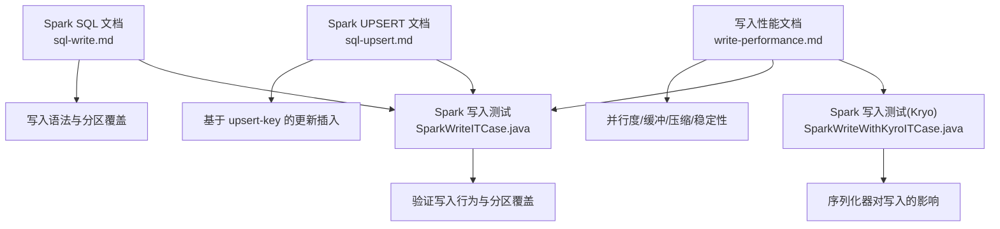
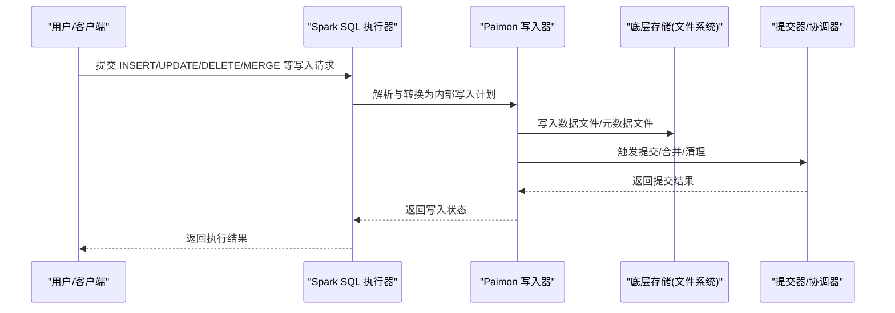
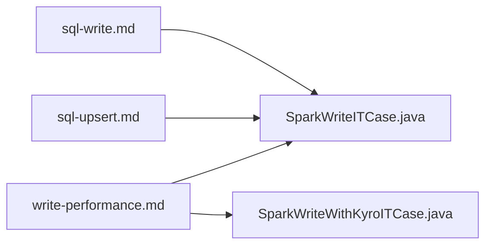

# 写入操作

<cite>
**本文引用的文件**
- [sql-write.md](file://docs/content/spark/sql-write.md)
- [sql-upsert.md](file://docs/content/spark/sql-upsert.md)
- [write-performance.md](file://docs/content/maintenance/write-performance.md)
- [SparkWriteITCase.java](file://paimon-spark/paimon-spark-ut/src/test/java/org/apache/paimon/spark/SparkWriteITCase.java)
- [SparkWriteWithKyroITCase.java](file://paimon-spark/paimon-spark-ut/src/test/java/org/apache/paimon/spark/SparkWriteWithKyroITCase.java)
</cite>

## 目录
1. [引言](#引言)
2. [项目结构](#项目结构)
3. [核心组件](#核心组件)
4. [架构总览](#架构总览)
5. [详细组件分析](#详细组件分析)
6. [依赖关系分析](#依赖关系分析)
7. [性能考量](#性能考量)
8. [故障排查指南](#故障排查指南)
9. [结论](#结论)
10. [附录](#附录)

## 引言
本技术文档聚焦于Apache Paimon在Spark中的写入操作，系统性阐述INSERT语句的多种形式（INSERT INTO、INSERT OVERWRITE、分区覆盖、动态/静态覆盖）、UPSERT（基于upsert-key的更新插入）以及批量写入（BULK INSERT）的适用场景与配置要点；同时涵盖条件写入、分区写入、并行度调优、数据倾斜处理、写入失败与重试策略，并给出可直接参考的示例路径与最佳实践。

## 项目结构
围绕Spark写入能力，本文主要依据以下文档与测试用例进行梳理：
- Spark SQL写入语法与行为：docs/content/spark/sql-write.md
- Spark UPSERT（无主键表的更新插入）：docs/content/spark/sql-upsert.md
- 写入性能优化与参数：docs/content/maintenance/write-performance.md
- Spark端写入集成测试：paimon-spark/paimon-spark-ut/src/test/java/org/apache/paimon/spark/SparkWriteITCase.java
- Spark端写入集成测试（含序列化器）：paimon-spark/paimon-spark-ut/src/test/java/org/apache/paimon/spark/SparkWriteWithKyroITCase.java

**图表来源**
- [sql-write.md:29-126](file://docs/content/spark/sql-write.md#L29-L126)
- [sql-upsert.md:29-43](file://docs/content/spark/sql-upsert.md#L29-L43)
- [write-performance.md:46-164](file://docs/content/maintenance/write-performance.md#L46-L164)
- [SparkWriteITCase.java](file://paimon-spark/paimon-spark-ut/src/test/java/org/apache/paimon/spark/SparkWriteITCase.java)
- [SparkWriteWithKyroITCase.java](file://paimon-spark/paimon-spark-ut/src/test/java/org/apache/paimon/spark/SparkWriteWithKyroITCase.java)

**章节来源**
- [sql-write.md:29-126](file://docs/content/spark/sql-write.md#L29-L126)
- [sql-upsert.md:29-43](file://docs/content/spark/sql-upsert.md#L29-L43)
- [write-performance.md:46-164](file://docs/content/maintenance/write-performance.md#L46-L164)
- [SparkWriteITCase.java](file://paimon-spark/paimon-spark-ut/src/test/java/org/apache/paimon/spark/SparkWriteITCase.java)
- [SparkWriteWithKyroITCase.java](file://paimon-spark/paimon-spark-ut/src/test/java/org/apache/paimon/spark/SparkWriteWithKyroITCase.java)

## 核心组件
- INSERT INTO：向表追加新记录，支持显式列清单与默认值填充（Spark 3.4起对部分列有默认值自动补齐）。
- INSERT OVERWRITE：整表或分区覆盖写入，支持静态/动态分区覆盖模式。
- TRUNCATE TABLE：清空表或分区数据。
- UPDATE/DELETE：按谓词更新/删除行（主键表不支持更新主键列）。
- MERGE INTO：基于源表与目标表的匹配执行插入、更新、删除的多分支合并。
- UPSERT（无主键表）：通过upsert-key与可选sequence.field实现“存在则更新，否则插入”的去重/择优写入。
- 写入性能参数：并行度、本地合并缓冲、文件格式/压缩、提交内存、检查点与稳定性等。

**章节来源**
- [sql-write.md:29-126](file://docs/content/spark/sql-write.md#L29-L126)
- [sql-upsert.md:29-43](file://docs/content/spark/sql-upsert.md#L29-L43)

## 架构总览
下图展示从Spark SQL到Paimon写入的关键流程与交互：

[此图为概念性流程示意，无需图表来源]

## 详细组件分析

### INSERT INTO 追加写入
- 作用：向表追加新行，不改变已有数据。
- 列清单与默认值：Spark 3.4起，INSERT INTO显式列清单若少于目标表列数，Spark会自动为缺失列填入默认值（或NULL）。
- 示例路径：
  - [INSERT INTO 示例:56-58](file://docs/content/spark/sql-write.md#L56-L58)

**章节来源**
- [sql-write.md:52-58](file://docs/content/spark/sql-write.md#L52-L58)

### INSERT OVERWRITE 覆盖写入
- 整表覆盖：INSERT OVERWRITE 表名 SELECT ... 将整表替换为新数据。
- 分区覆盖：
  - 静态覆盖：指定PARTITION子句仅覆盖指定分区。
  - 动态覆盖：需设置会话参数以启用动态分区覆盖模式，仅覆盖实际出现的分区。
- 示例路径：
  - [整表覆盖示例:64-66](file://docs/content/spark/sql-write.md#L64-L66)
  - [分区覆盖示例:72-74](file://docs/content/spark/sql-write.md#L72-L74)
  - [静态/动态覆盖对比示例:80-126](file://docs/content/spark/sql-write.md#L80-L126)

**章节来源**
- [sql-write.md:60-126](file://docs/content/spark/sql-write.md#L60-L126)

### 条件写入与 MERGE INTO
- UPDATE：按WHERE谓词更新列值；主键表不允许更新主键列。
- DELETE：按WHERE谓词删除行。
- MERGE INTO：根据ON条件与多分支WHEN子句实现“命中更新/删除、未命中插入”，支持复杂业务规则。
- 示例路径：
  - [UPDATE 语法与示例:150-166](file://docs/content/spark/sql-write.md#L150-L166)
  - [DELETE 语法与示例:172-174](file://docs/content/spark/sql-write.md#L172-L174)
  - [MERGE INTO 基础示例:192-202](file://docs/content/spark/sql-write.md#L192-L202)
  - [MERGE INTO 多条件示例:208-224](file://docs/content/spark/sql-write.md#L208-L224)

**章节来源**
- [sql-write.md:136-224](file://docs/content/spark/sql-write.md#L136-L224)

### UPSERT（无主键表）
- 适用场景：无主键表通过upsert-key实现“存在则更新，否则插入”的去重/择优写入。
- 关键属性：
  - upsert-key：定义用于upsert的列（可多列），可包含NULL，支持NULL相等匹配。
  - sequence.field（可选）：当新旧记录共享upsert-key时，保留sequence.field更大的记录；未设置则简单更新且不做去重。
- 示例路径：
  - [UPSER T建表与示例:48-95](file://docs/content/spark/sql-upsert.md#L48-L95)

**章节来源**
- [sql-upsert.md:29-43](file://docs/content/spark/sql-upsert.md#L29-L43)
- [sql-upsert.md:44-95](file://docs/content/spark/sql-upsert.md#L44-L95)

### 写入性能与优化
- 并行度：sink.parallelism建议小于等于桶数，优先等于桶数。
- 本地合并：针对主键数据倾斜，通过local-merge-buffer-size在shuffle前缓冲与合并，缓解热点。
- 文件格式与压缩：row存储（如AVRO）可提升写入与紧凑性能，但牺牲查询投影效率；可按层级指定格式。
- 写入缓冲与溢写：write-buffer-size与write-buffer-spillable可提升吞吐与稳定性。
- 稳定性：在全量同步阶段可临时关闭高成本选项，增量阶段再开启；必要时增大检查点超时。
- 提交内存：大规模写入时可通过细粒度资源管理为committer单独分配内存。
- 示例路径：
  - [并行度与本地合并:46-84](file://docs/content/maintenance/write-performance.md#L46-L84)
  - [文件格式与压缩:85-114](file://docs/content/maintenance/write-performance.md#L85-L114)
  - [写入初始化与稳定性:126-125](file://docs/content/maintenance/write-performance.md#L126-L125)
  - [提交内存与细粒度资源:154-164](file://docs/content/maintenance/write-performance.md#L154-L164)

**章节来源**
- [write-performance.md:46-164](file://docs/content/maintenance/write-performance.md#L46-L164)

### 写入失败处理与重试策略
- 检查点与稳定性：增大检查点间隔与并发数，或在批模式下运行以降低写入压力。
- 缓冲与溢写：适当增大写缓冲与启用溢写，减少OOM风险。
- 分区与并行：合理设置分区与并行度，避免热点与背压。
- 序列化器影响：在某些场景下序列化器（如Kryo）可能影响写入性能与稳定性，建议结合测试评估。
- 示例路径：
  - [写入性能与稳定性建议:29-44](file://docs/content/maintenance/write-performance.md#L29-L44)
  - [写入缓冲与溢写:34-36](file://docs/content/maintenance/write-performance.md#L34-L36)
  - [序列化器测试入口](file://paimon-spark/paimon-spark-ut/src/test/java/org/apache/paimon/spark/SparkWriteWithKyroITCase.java)

**章节来源**
- [write-performance.md:29-44](file://docs/content/maintenance/write-performance.md#L29-L44)
- [write-performance.md:34-36](file://docs/content/maintenance/write-performance.md#L34-L36)
- [SparkWriteWithKyroITCase.java](file://paimon-spark/paimon-spark-ut/src/test/java/org/apache/paimon/spark/SparkWriteWithKyroITCase.java)

### 写入示例与最佳实践
- INSERT INTO/INSERT OVERWRITE/分区覆盖/动态覆盖：参考文档中的示例路径。
- UPSERT：参考无主键表的upsert-key与sequence.field示例。
- 性能优化：按需调整并行度、本地合并、文件格式/压缩、检查点与提交内存。
- 最佳实践要点：
  - 明确写入模式：追加/覆盖/分区覆盖，避免不必要的全表重写。
  - 合理设置分区与并行度，避免数据倾斜。
  - 在大批量写入场景优先考虑row存储与更高压缩级别，权衡查询性能。
  - 在全量同步阶段谨慎使用高成本选项，增量阶段再启用。
  - 使用测试用例验证写入行为与序列化器影响。

**章节来源**
- [sql-write.md:52-126](file://docs/content/spark/sql-write.md#L52-L126)
- [sql-upsert.md:44-95](file://docs/content/spark/sql-upsert.md#L44-L95)
- [write-performance.md:46-164](file://docs/content/maintenance/write-performance.md#L46-L164)
- [SparkWriteITCase.java](file://paimon-spark/paimon-spark-ut/src/test/java/org/apache/paimon/spark/SparkWriteITCase.java)

## 依赖关系分析
- 文档层依赖：
  - sql-write.md 为写入语法与分区覆盖的核心参考。
  - sql-upsert.md 为无主键表upsert机制的权威说明。
  - write-performance.md 为写入性能与稳定性调优的综合指南。
- 测试层依赖：
  - SparkWriteITCase.java 与 SparkWriteWithKyroITCase.java 作为写入行为与序列化器影响的实证入口。

**图表来源**
- [sql-write.md:29-126](file://docs/content/spark/sql-write.md#L29-L126)
- [sql-upsert.md:29-43](file://docs/content/spark/sql-upsert.md#L29-L43)
- [write-performance.md:46-164](file://docs/content/maintenance/write-performance.md#L46-L164)
- [SparkWriteITCase.java](file://paimon-spark/paimon-spark-ut/src/test/java/org/apache/paimon/spark/SparkWriteITCase.java)
- [SparkWriteWithKyroITCase.java](file://paimon-spark/paimon-spark-ut/src/test/java/org/apache/paimon/spark/SparkWriteWithKyroITCase.java)

**章节来源**
- [sql-write.md:29-126](file://docs/content/spark/sql-write.md#L29-L126)
- [sql-upsert.md:29-43](file://docs/content/spark/sql-upsert.md#L29-L43)
- [write-performance.md:46-164](file://docs/content/maintenance/write-performance.md#L46-L164)
- [SparkWriteITCase.java](file://paimon-spark/paimon-spark-ut/src/test/java/org/apache/paimon/spark/SparkWriteITCase.java)
- [SparkWriteWithKyroITCase.java](file://paimon-spark/paimon-spark-ut/src/test/java/org/apache/paimon/spark/SparkWriteWithKyroITCase.java)

## 性能考量
- 并行度与桶数：sink.parallelism建议与桶数一致或不超过桶数，避免过度切分导致小文件与调度开销。
- 本地合并：针对主键热点数据，启用local-merge-buffer-size在shuffle前聚合，降低下游压力。
- 文件格式：row存储（如AVRO）适合高吞吐写入与紧凑，但牺牲查询投影；可按层级指定格式以平衡收益。
- 写缓冲：增大write-buffer-size并启用write-buffer-spillable，有助于提升吞吐与稳定性。
- 稳定性：在全量同步阶段关闭高成本选项，增量阶段再开启；必要时延长检查点超时。
- 提交内存：通过细粒度资源管理为committer单独分配内存，避免全局TaskManager内存浪费。

**章节来源**
- [write-performance.md:46-164](file://docs/content/maintenance/write-performance.md#L46-L164)

## 故障排查指南
- 数据倾斜：观察背压与热点节点，启用本地合并与异步紧凑（如适用）以缓解。
- 写入失败：检查检查点间隔与超时、写缓冲大小、序列化器配置；必要时降低并行度或增加资源。
- 分区覆盖异常：确认是否启用了动态分区覆盖模式，核对分区键与数据一致性。
- 测试验证：通过Spark写入测试用例快速复现问题，定位是语法/分区/序列化器等因素。

**章节来源**
- [write-performance.md:42-44](file://docs/content/maintenance/write-performance.md#L42-L44)
- [write-performance.md:120-125](file://docs/content/maintenance/write-performance.md#L120-L125)
- [SparkWriteWithKyroITCase.java](file://paimon-spark/paimon-spark-ut/src/test/java/org/apache/paimon/spark/SparkWriteWithKyroITCase.java)

## 结论
- INSERT INTO/INSERT OVERWRITE/分区覆盖/动态覆盖构成Spark写入的基础能力，应根据业务需求选择合适模式。
- UPSERT为无主键表提供了高效的更新插入机制，配合sequence.field可实现择优保留。
- 写入性能优化需从并行度、本地合并、文件格式/压缩、检查点与提交内存等维度协同调优。
- 通过测试用例与文档示例可快速验证写入行为与性能瓶颈，形成可落地的最佳实践。

## 附录
- 示例路径索引：
  - [INSERT INTO 示例:56-58](file://docs/content/spark/sql-write.md#L56-L58)
  - [INSERT OVERWRITE 示例:64-66](file://docs/content/spark/sql-write.md#L64-L66)
  - [分区覆盖示例:72-74](file://docs/content/spark/sql-write.md#L72-L74)
  - [静态/动态覆盖对比示例:80-126](file://docs/content/spark/sql-write.md#L80-L126)
  - [UPDATE 示例:150-166](file://docs/content/spark/sql-write.md#L150-L166)
  - [DELETE 示例:172-174](file://docs/content/spark/sql-write.md#L172-L174)
  - [MERGE INTO 示例:192-224](file://docs/content/spark/sql-write.md#L192-L224)
  - [UPSER T建表与示例:48-95](file://docs/content/spark/sql-upsert.md#L48-L95)
  - [写入性能参数与建议:46-164](file://docs/content/maintenance/write-performance.md#L46-L164)
  - [写入测试入口](file://paimon-spark/paimon-spark-ut/src/test/java/org/apache/paimon/spark/SparkWriteITCase.java)
  - [序列化器测试入口](file://paimon-spark/paimon-spark-ut/src/test/java/org/apache/paimon/spark/SparkWriteWithKyroITCase.java)