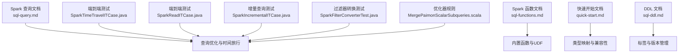
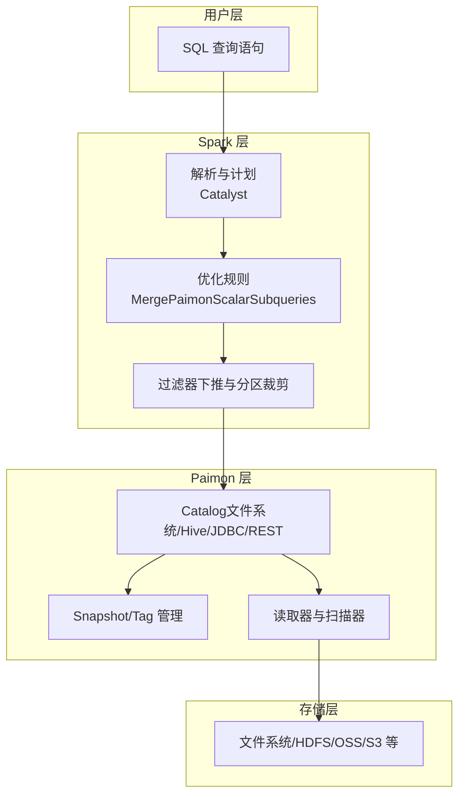
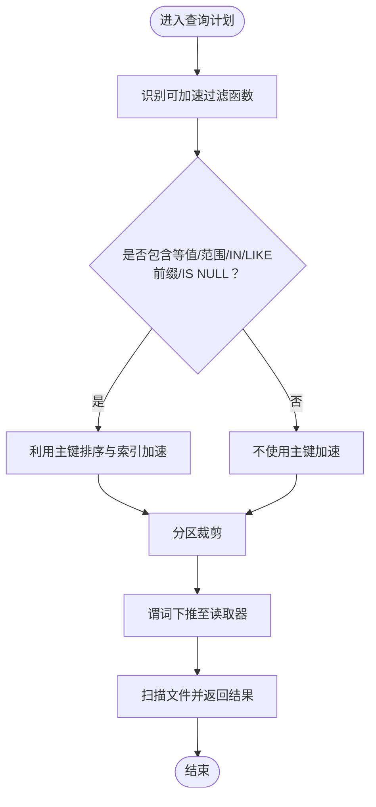
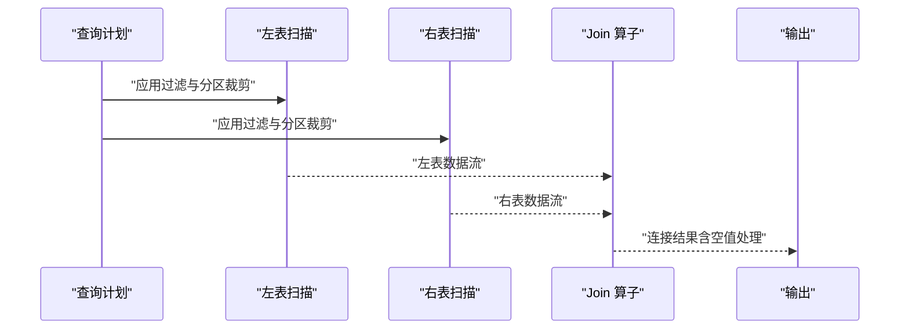
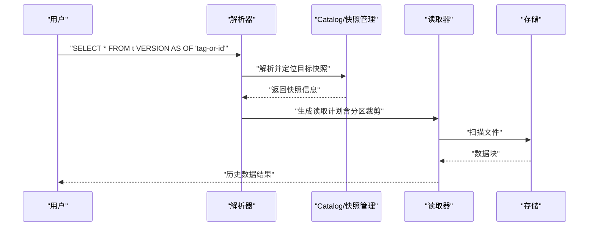
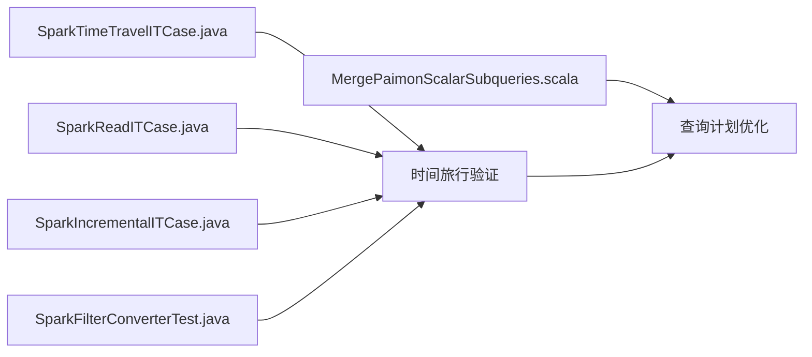

# 查询操作

<cite>
**本文引用的文件**
- [sql-query.md](file://docs/content/spark/sql-query.md)
- [sql-functions.md](file://docs/content/spark/sql-functions.md)
- [quick-start.md](file://docs/content/spark/quick-start.md)
- [sql-ddl.md](file://docs/content/spark/sql-ddl.md)
- [SparkTimeTravelITCase.java](file://paimon-spark/paimon-spark-ut/src/test/java/org/apache/paimon/spark/SparkTimeTravelITCase.java)
- [SparkReadITCase.java](file://paimon-spark/paimon-spark-ut/src/test/java/org/apache/paimon/spark/SparkReadITCase.java)
- [SparkIncrementalITCase.java](file://paimon-spark/paimon-spark-ut/src/test/java/org/apache/paimon/spark/SparkIncrementalITCase.java)
- [SparkFilterConverterTest.java](file://paimon-spark/paimon-spark-ut/src/test/java/org/apache/paimon/spark/SparkFilterConverterTest.java)
- [MergePaimonScalarSubqueries.scala](file://paimon-spark/paimon-spark-3.5/src/main/scala/org/apache/paimon/spark/catalyst/optimizer/MergePaimonScalarSubqueries.scala)
- [MergePaimonScalarSubqueries.scala](file://paimon-spark/paimon-spark-4.0/src/main/scala/org/apache/paimon/spark/catalyst/optimizer/MergePaimonScalarSubqueries.scala)
</cite>

## 目录
1. [简介](#简介)
2. [项目结构](#项目结构)
3. [核心组件](#核心组件)
4. [架构总览](#架构总览)
5. [详细组件分析](#详细组件分析)
6. [依赖分析](#依赖分析)
7. [性能考虑](#性能考虑)
8. [故障排查指南](#故障排查指南)
9. [结论](#结论)
10. [附录](#附录)

## 简介
本技术文档面向使用 Apache Paimon 的 Spark 用户，系统化讲解 Paimon 在 Spark 中的查询能力与优化实践，覆盖以下主题：
- SELECT 基础查询、条件过滤、聚合与分组统计
- WHERE 子句的比较与逻辑运算符、NULL 处理
- JOIN（内连接、外连接、自连接）的语法与场景
- 窗口函数（ROW_NUMBER、RANK、SUM、AVG 等）的使用
- 时间旅行查询与快照查询的特殊语法与使用方法
- 分区裁剪与谓词下推的优化技巧
- 完整查询示例与性能优化建议

## 项目结构
围绕 Spark 查询主题，本文主要参考以下文档与测试用例：
- Spark 查询与优化：docs/content/spark/sql-query.md
- Spark 函数：docs/content/spark/sql-functions.md
- 快速开始与类型转换：docs/content/spark/quick-start.md
- DDL 与标签管理：docs/content/spark/sql-ddl.md
- Spark 查询端到端与时间旅行测试：paimon-spark/paimon-spark-ut/src/test/.../*.java
- Spark 查询优化器规则（标量子查询合并）：paimon-spark/*/src/main/scala/.../MergePaimonScalarSubqueries.scala

**图表来源**
- [sql-query.md:27-170](file://docs/content/spark/sql-query.md#L27-L170)
- [sql-functions.md:27-157](file://docs/content/spark/sql-functions.md#L27-L157)
- [quick-start.md:27-375](file://docs/content/spark/quick-start.md#L27-L375)
- [sql-ddl.md:27-370](file://docs/content/spark/sql-ddl.md#L27-L370)
- [SparkTimeTravelITCase.java](file://paimon-spark/paimon-spark-ut/src/test/java/org/apache/paimon/spark/SparkTimeTravelITCase.java)
- [SparkReadITCase.java](file://paimon-spark/paimon-spark-ut/src/test/java/org/apache/paimon/spark/SparkReadITCase.java)
- [SparkIncrementalITCase.java](file://paimon-spark/paimon-spark-ut/src/test/java/org/apache/paimon/spark/SparkIncrementalITCase.java)
- [SparkFilterConverterTest.java](file://paimon-spark/paimon-spark-ut/src/test/java/org/apache/paimon/spark/SparkFilterConverterTest.java)
- [MergePaimonScalarSubqueries.scala](file://paimon-spark/paimon-spark-3.5/src/main/scala/org/apache/paimon/spark/catalyst/optimizer/MergePaimonScalarSubqueries.scala)
- [MergePaimonScalarSubqueries.scala](file://paimon-spark/paimon-spark-4.0/src/main/scala/org/apache/paimon/spark/catalyst/optimizer/MergePaimonScalarSubqueries.scala)

**章节来源**
- [sql-query.md:27-170](file://docs/content/spark/sql-query.md#L27-L170)
- [sql-functions.md:27-157](file://docs/content/spark/sql-functions.md#L27-L157)
- [quick-start.md:27-375](file://docs/content/spark/quick-start.md#L27-L375)
- [sql-ddl.md:27-370](file://docs/content/spark/sql-ddl.md#L27-L370)

## 核心组件
- 批式查询与时间旅行
  - 支持按快照读取，默认读取最新快照；支持通过版本或时间戳进行时间旅行读取；支持增量查询（基于表值函数）。
- 隐藏元数据列
  - 提供分区、桶、行索引、文件路径、行跟踪唯一标识与序列号等隐藏列，便于定位记录来源与调试。
- 查询优化
  - 强烈推荐在查询中指定分区与主键过滤，以提升数据跳过效率；支持等值、范围、IN、前缀 LIKE、IS NULL 等可加速过滤函数。
- 函数体系
  - 内置函数：如获取最大有效顶层分区值、blob 描述符转换等；支持 Lambda 与文件型 UDF（受限于 REST Catalog 与 Spark 版本）。

**章节来源**
- [sql-query.md:29-170](file://docs/content/spark/sql-query.md#L29-L170)
- [sql-functions.md:27-157](file://docs/content/spark/sql-functions.md#L27-L157)

## 架构总览
下图展示 Paimon Spark 查询从 SQL 到执行的关键路径，以及与优化器、Catalog 和存储层的关系。

**图表来源**
- [sql-query.md:56-117](file://docs/content/spark/sql-query.md#L56-L117)
- [sql-ddl.md:29-165](file://docs/content/spark/sql-ddl.md#L29-L165)
- [MergePaimonScalarSubqueries.scala](file://paimon-spark/paimon-spark-3.5/src/main/scala/org/apache/paimon/spark/catalyst/optimizer/MergePaimonScalarSubqueries.scala)
- [MergePaimonScalarSubqueries.scala](file://paimon-spark/paimon-spark-4.0/src/main/scala/org/apache/paimon/spark/catalyst/optimizer/MergePaimonScalarSubqueries.scala)

## 详细组件分析

### 基础查询与隐藏元数据列
- 基础 SELECT：支持全量列与通配符读取。
- 隐藏元数据列：分区、桶、行索引、文件路径、行跟踪唯一标识与序列号等，用于定位与审计。
- 示例参考：基础查询与隐藏列组合查询的示例位于查询文档中。

**章节来源**
- [sql-query.md:29-57](file://docs/content/spark/sql-query.md#L29-L57)

### 条件过滤与谓词下推
- 可加速的过滤函数：等值、小于、小于等于、大于、大于等于、IN、前缀 LIKE、IS NULL。
- 主键排序优势：主键排序可加速点查与范围查；复合主键建议使用左前缀匹配以获得更好加速效果。
- 过滤器下推与分区裁剪：由 Spark 优化器与 Paimon 读取器协同实现，减少扫描数据量。

**图表来源**
- [sql-query.md:118-170](file://docs/content/spark/sql-query.md#L118-L170)
- [SparkFilterConverterTest.java](file://paimon-spark/paimon-spark-ut/src/test/java/org/apache/paimon/spark/SparkFilterConverterTest.java)

**章节来源**
- [sql-query.md:118-170](file://docs/content/spark/sql-query.md#L118-L170)
- [SparkFilterConverterTest.java](file://paimon-spark/paimon-spark-ut/src/test/java/org/apache/paimon/spark/SparkFilterConverterTest.java)

### 聚合与分组统计
- 聚合查询：支持 GROUP BY、聚合函数（SUM、AVG 等）与 HAVING。
- 主键与分区：建议在过滤与分组中充分利用主键与分区，以提升数据跳过与局部聚合效率。
- 与窗口函数结合：可在分组后使用窗口函数进行排名、累计等分析。

**章节来源**
- [sql-query.md:118-170](file://docs/content/spark/sql-query.md#L118-L170)

### JOIN 操作详解
- 内连接（INNER JOIN）：保留两表均存在的记录。
- 左/右/全外连接（LEFT/RIGHT/FULL OUTER JOIN）：保留一侧或双方缺失的记录，需注意空值处理。
- 自连接（SELF JOIN）：同一张表的不同别名进行连接，常用于层次结构或对比分析。
- 优化建议：尽量在连接键上建立等值过滤，并配合分区裁剪与谓词下推。

**图表来源**
- [sql-query.md:118-170](file://docs/content/spark/sql-query.md#L118-L170)

### 窗口函数
- 常用窗口函数：ROW_NUMBER、RANK、DENSE_RANK、SUM、AVG、COUNT 等。
- 典型场景：分区内排序、滚动聚合、Top-N、同比环比分析。
- 性能要点：合理设计窗口分区与排序键，避免大分区内无序数据导致的额外排序成本。

**章节来源**
- [sql-query.md:118-170](file://docs/content/spark/sql-query.md#L118-L170)

### 时间旅行查询与快照查询
- 版本时间旅行：通过 VERSION AS OF 指定快照 ID 或标签；通过 TIMESTAMP AS OF 指定时间戳或秒级时间戳。
- 水印时间旅行：通过水印名称匹配对应快照。
- 注意事项：当标签名与快照 ID 数值相同，优先按标签解析。
- 增量查询：通过表值函数实现快照区间或时间区间的增量数据读取。

**图表来源**
- [sql-query.md:56-87](file://docs/content/spark/sql-query.md#L56-L87)
- [SparkTimeTravelITCase.java](file://paimon-spark/paimon-spark-ut/src/test/java/org/apache/paimon/spark/SparkTimeTravelITCase.java)

**章节来源**
- [sql-query.md:56-117](file://docs/content/spark/sql-query.md#L56-L117)
- [SparkTimeTravelITCase.java](file://paimon-spark/paimon-spark-ut/src/test/java/org/apache/paimon/spark/SparkTimeTravelITCase.java)

### 增量查询（基于表值函数）
- 支持按快照区间、时间区间或自动标签进行增量读取。
- 默认扫描变更日志文件，否则扫描新增文件；可通过选项强制指定扫描模式。
- 返回结果不含删除记录（-D），如需查看删除记录，应查询审计日志表。

**章节来源**
- [sql-query.md:88-117](file://docs/content/spark/sql-query.md#L88-L117)
- [SparkIncrementalITCase.java](file://paimon-spark/paimon-spark-ut/src/test/java/org/apache/paimon/spark/SparkIncrementalITCase.java)

### 函数体系与扩展
- 内置函数：如获取最大有效顶层分区值、blob 描述符转换等，便于分区筛选与外部文件集成。
- 用户自定义函数：支持 Lambda 与文件型 UDF（受限于 REST Catalog 与 Spark 版本）。

**章节来源**
- [sql-functions.md:27-157](file://docs/content/spark/sql-functions.md#L27-L157)

## 依赖分析
- 优化器规则
  - MergePaimonScalarSubqueries：合并标量子查询，减少跨层调用开销，提升查询计划质量。
- 测试与验证
  - SparkTimeTravelITCase：验证时间旅行查询行为。
  - SparkReadITCase：验证批式读取与隐藏元数据列。
  - SparkIncrementalITCase：验证增量查询行为。
  - SparkFilterConverterTest：验证过滤器转换与下推逻辑。

**图表来源**
- [MergePaimonScalarSubqueries.scala](file://paimon-spark/paimon-spark-3.5/src/main/scala/org/apache/paimon/spark/catalyst/optimizer/MergePaimonScalarSubqueries.scala)
- [MergePaimonScalarSubqueries.scala](file://paimon-spark/paimon-spark-4.0/src/main/scala/org/apache/paimon/spark/catalyst/optimizer/MergePaimonScalarSubqueries.scala)
- [SparkTimeTravelITCase.java](file://paimon-spark/paimon-spark-ut/src/test/java/org/apache/paimon/spark/SparkTimeTravelITCase.java)
- [SparkReadITCase.java](file://paimon-spark/paimon-spark-ut/src/test/java/org/apache/paimon/spark/SparkReadITCase.java)
- [SparkIncrementalITCase.java](file://paimon-spark/paimon-spark-ut/src/test/java/org/apache/paimon/spark/SparkIncrementalITCase.java)
- [SparkFilterConverterTest.java](file://paimon-spark/paimon-spark-ut/src/test/java/org/apache/paimon/spark/SparkFilterConverterTest.java)

**章节来源**
- [MergePaimonScalarSubqueries.scala](file://paimon-spark/paimon-spark-3.5/src/main/scala/org/apache/paimon/spark/catalyst/optimizer/MergePaimonScalarSubqueries.scala)
- [MergePaimonScalarSubqueries.scala](file://paimon-spark/paimon-spark-4.0/src/main/scala/org/apache/paimon/spark/catalyst/optimizer/MergePaimonScalarSubqueries.scala)
- [SparkTimeTravelITCase.java](file://paimon-spark/paimon-spark-ut/src/test/java/org/apache/paimon/spark/SparkTimeTravelITCase.java)
- [SparkReadITCase.java](file://paimon-spark/paimon-spark-ut/src/test/java/org/apache/paimon/spark/SparkReadITCase.java)
- [SparkIncrementalITCase.java](file://paimon-spark/paimon-spark-ut/src/test/java/org/apache/paimon/spark/SparkIncrementalITCase.java)
- [SparkFilterConverterTest.java](file://paimon-spark/paimon-spark-ut/src/test/java/org/apache/paimon/spark/SparkFilterConverterTest.java)

## 性能考虑
- 优先使用分区与主键过滤，确保能触发数据跳过与索引加速。
- 复合主键查询建议遵循左前缀原则，提升范围查询效率。
- 使用前缀 LIKE 与 IN 可显著降低扫描范围。
- 合理使用窗口函数与聚合函数，避免在大分区内进行无序计算。
- 对于时间旅行与增量查询，尽量限定时间范围或快照区间，减少扫描数据量。

**章节来源**
- [sql-query.md:118-170](file://docs/content/spark/sql-query.md#L118-L170)

## 故障排查指南
- 时间旅行解析异常
  - 当标签名与快照 ID 数值相同时，优先按标签解析。请检查标签命名与快照 ID 的冲突。
- 增量查询未返回删除记录
  - 增量查询默认不返回删除记录（-D），如需查看删除记录，请查询审计日志表。
- 过滤器未生效
  - 确认过滤函数是否属于可加速集合（等值、范围、IN、前缀 LIKE、IS NULL）；检查分区裁剪与谓词下推是否被正确应用。
- 类型不匹配
  - 参考类型映射文档，确认 Spark 与 Paimon 的类型转换关系，避免隐式转换导致的精度或时区问题。

**章节来源**
- [sql-query.md:82-117](file://docs/content/spark/sql-query.md#L82-L117)
- [quick-start.md:257-375](file://docs/content/spark/quick-start.md#L257-L375)

## 结论
Paimon 在 Spark 中提供了完善的批式查询能力，涵盖基础查询、条件过滤、聚合分组、JOIN、窗口函数、时间旅行与增量查询。通过合理使用分区与主键过滤、前缀 LIKE、IN 等可加速函数，以及利用隐藏元数据列与内置函数，可以显著提升查询性能与可维护性。建议在生产环境中结合测试用例与优化器规则，持续验证查询计划与执行效果。

## 附录
- 快速开始与类型映射：参考快速开始文档中的类型转换表格与版本兼容性提示。
- 标签与版本管理：参考 DDL 文档中的标签创建、替换、删除与展示命令，配合时间旅行查询使用。

**章节来源**
- [quick-start.md:257-375](file://docs/content/spark/quick-start.md#L257-L375)
- [sql-ddl.md:314-369](file://docs/content/spark/sql-ddl.md#L314-L369)