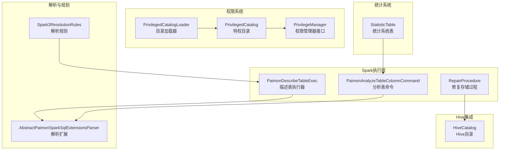
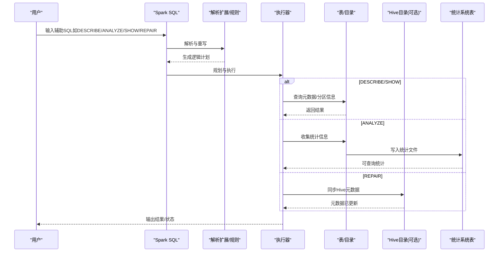
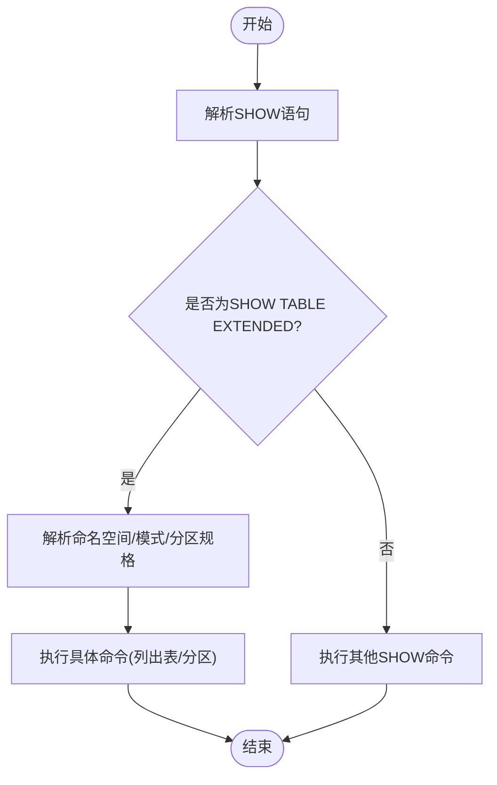
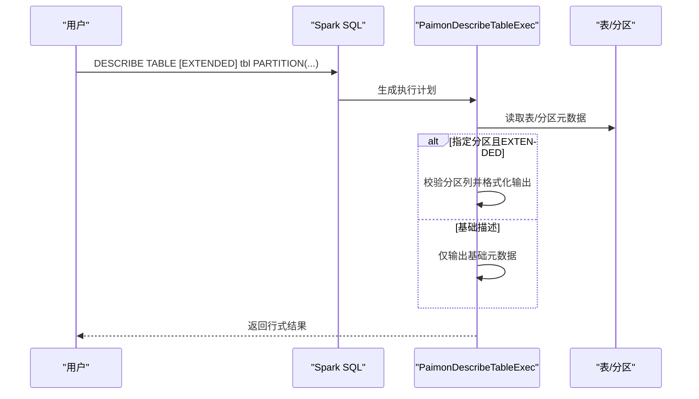
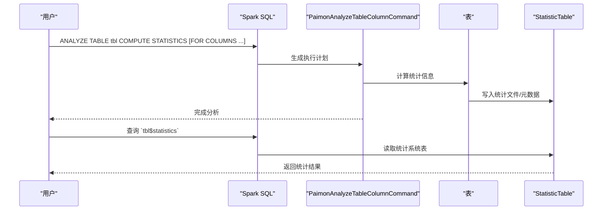
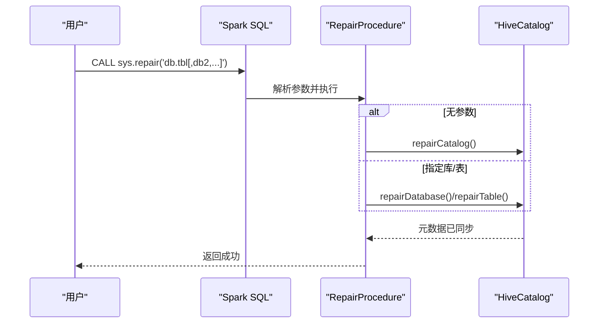
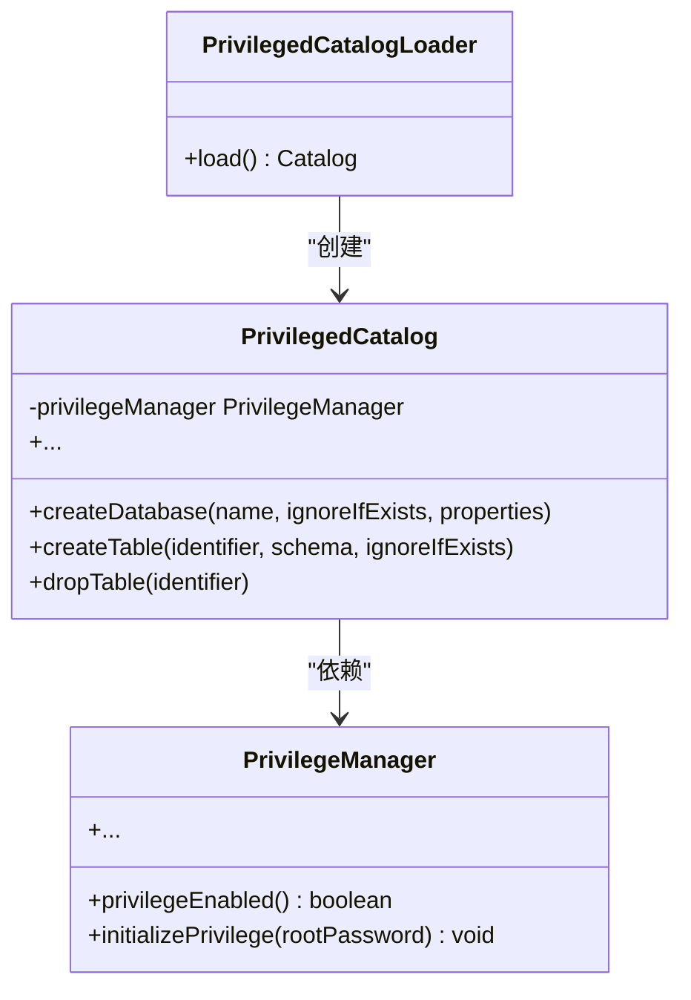
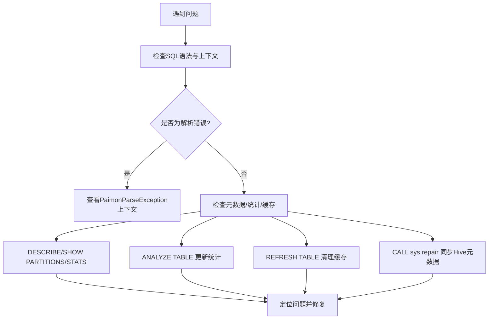
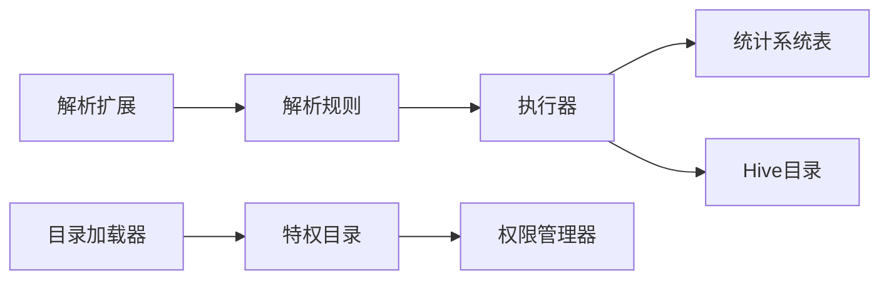

# 辅助操作

<cite>
**本文引用的文件**   
- [辅助语句（auxiliary.md）](file://docs/content/spark/auxiliary.md)
- [描述表执行器（PaimonDescribeTableExec.scala）](file://paimon-spark/paimon-spark-common/src/main/scala/org/apache/spark/sql/execution/PaimonDescribeTableExec.scala)
- [解析扩展（AbstractPaimonSparkSqlExtensionsParser.scala）](file://paimon-spark/paimon-spark-common/src/main/scala/org/apache/spark/sql/catalyst/parser/extensions/AbstractPaimonSparkSqlExtensionsParser.scala)
- [分析表命令（PaimonAnalyzeTableColumnCommand.scala）](file://paimon-spark/paimon-spark-common/src/main/scala/org/apache/paimon/spark/commands/PaimonAnalyzeTableColumnCommand.scala)
- [分析表测试基类（AnalyzeTableTestBase.scala）](file://paimon-spark/paimon-spark-ut/src/test/scala/org/apache/paimon/spark/sql/AnalyzeTableTestBase.scala)
- [统计系统表（StatisticTable.java）](file://paimon-core/src/main/java/org/apache/paimon/table/system/StatisticTable.java)
- [修复存储过程（RepairProcedure.java）](file://paimon-spark/paimon-spark-common/src/main/java/org/apache/paimon/spark/procedure/RepairProcedure.java)
- [Hive目录修复（HiveCatalog.java）](file://paimon-hive/paimon-hive-catalog/src/main/java/org/apache/paimon/hive/HiveCatalog.java)
- [权限目录加载器（PrivilegedCatalogLoader.java）](file://paimon-core/src/main/java/org/apache/paimon/privilege/PrivilegedCatalogLoader.java)
- [权限管理器接口（PrivilegeManager.java）](file://paimon-core/src/main/java/org/apache/paimon/privilege/PrivilegeManager.java)
- [特权目录（PrivilegedCatalog.java）](file://paimon-core/src/main/java/org/apache/paimon/privilege/PrivilegedCatalog.java)
- [权限管理（manage-privileges.md）](file://docs/content/maintenance/manage-privileges.md)
- [Spark工具（SparkUtils.java）](file://paimon-spark/paimon-spark-common/src/main/java/org/apache/paimon/spark/SparkUtils.java)
- [刷新缓存调用（BaseProcedure.java）](file://paimon-spark/paimon-spark-common/src/main/java/org/apache/paimon/spark/procedure/BaseProcedure.java)
- [经典API适配（Classic3Api.scala）](file://paimon-spark/paimon-spark3-common/src/main/scala/org/apache/spark/sql/paimon/shims/Classic3Api.scala)
- [Spark3解析规则（Spark3ResolutionRules.scala）](file://paimon-spark/paimon-spark3-common/src/main/scala/org/apache/paimon/spark/catalyst/analysis/Spark3ResolutionRules.scala)
</cite>

## 目录
1. [简介](#简介)
2. [项目结构](#项目结构)
3. [核心组件](#核心组件)
4. [架构总览](#架构总览)
5. [详细组件分析](#详细组件分析)
6. [依赖关系分析](#依赖关系分析)
7. [性能考量](#性能考量)
8. [故障排除指南](#故障排除指南)
9. [结论](#结论)
10. [附录](#附录)

## 简介
本文件面向Apache Paimon在Spark上的辅助操作，系统性梳理并解释以下能力：
- SHOW系列：SHOW DATABASES、SHOW TABLES、SHOW PARTITIONS、SHOW TABLE EXTENDED、SHOW VIEWS、SHOW COLUMNS、SHOW CREATE TABLE等
- DESCRIBE系列：DESCRIBE TABLE、DESCRIBE TABLE EXTENDED
- EXPLAIN相关：执行计划分析与优化建议（结合Spark执行路径）
- ANALYZE TABLE：统计信息收集、列级统计、系统表查看
- MSCK REPAIR TABLE：分区修复与元数据同步（通过CALL sys.repair实现）
- 权限管理：目录级、数据库级、表级的权限控制与用户管理
- 调试与故障排除：错误解析、缓存刷新、诊断工具

## 项目结构
围绕Spark辅助操作的关键代码分布在如下模块：
- 文档：docs/content/spark/auxiliary.md 提供命令语法与示例
- Spark执行层：PaimonDescribeTableExec、PaimonAnalyzeTableColumnCommand、RepairProcedure等
- 解析与规划：AbstractPaimonSparkSqlExtensionsParser、Spark3ResolutionRules
- 权限系统：PrivilegedCatalog、PrivilegeManager、PrivilegedCatalogLoader
- 统计系统表：StatisticTable
- Hive集成：HiveCatalog中的repairTable逻辑

**图表来源**
- [PaimonDescribeTableExec.scala:38-60](file://paimon-spark/paimon-spark-common/src/main/scala/org/apache/spark/sql/execution/PaimonDescribeTableExec.scala#L38-L60)
- [PaimonAnalyzeTableColumnCommand.scala](file://paimon-spark/paimon-spark-common/src/main/scala/org/apache/paimon/spark/commands/PaimonAnalyzeTableColumnCommand.scala)
- [RepairProcedure.java:67-83](file://paimon-spark/paimon-spark-common/src/main/java/org/apache/paimon/spark/procedure/RepairProcedure.java#L67-L83)
- [AbstractPaimonSparkSqlExtensionsParser.scala:258-291](file://paimon-spark/paimon-spark-common/src/main/scala/org/apache/spark/sql/catalyst/parser/extensions/AbstractPaimonSparkSqlExtensionsParser.scala#L258-L291)
- [Spark3ResolutionRules.scala:36-54](file://paimon-spark/paimon-spark3-common/src/main/scala/org/apache/paimon/spark/catalyst/analysis/Spark3ResolutionRules.scala#L36-L54)
- [PrivilegeManager.java:44-58](file://paimon-core/src/main/java/org/apache/paimon/privilege/PrivilegeManager.java#L44-L58)
- [PrivilegedCatalog.java:40-92](file://paimon-core/src/main/java/org/apache/paimon/privilege/PrivilegedCatalog.java#L40-L92)
- [PrivilegedCatalogLoader.java:25-43](file://paimon-core/src/main/java/org/apache/paimon/privilege/PrivilegedCatalogLoader.java#L25-L43)
- [StatisticTable.java:88-142](file://paimon-core/src/main/java/org/apache/paimon/table/system/StatisticTable.java#L88-L142)
- [HiveCatalog.java:1355-1391](file://paimon-hive/paimon-hive-catalog/src/main/java/org/apache/paimon/hive/HiveCatalog.java#L1355-L1391)

**章节来源**
- [辅助语句（auxiliary.md）:27-144](file://docs/content/spark/auxiliary.md#L27-L144)

## 核心组件
- 描述表执行器：负责DESCRIBE TABLE的执行，支持EXTENDED模式与分区详情补充
- 分析表命令：支持ANALYZE TABLE的表级统计与列级统计，并写入统计系统表
- 修复存储过程：通过CALL sys.repair完成目录、数据库或表的修复与元数据同步
- 解析扩展与规则：提供SQL解析增强与SHOW TABLE EXTENDED等命令的解析与重写
- 权限系统：基于用户的身份访问控制（IBAC），支持目录、数据库、表三级对象授权
- 统计系统表：提供只读系统表用于查询统计信息（如快照ID、schema ID、记录数、列统计）

**章节来源**
- [PaimonDescribeTableExec.scala:38-60](file://paimon-spark/paimon-spark-common/src/main/scala/org/apache/spark/sql/execution/PaimonDescribeTableExec.scala#L38-L60)
- [PaimonAnalyzeTableColumnCommand.scala](file://paimon-spark/paimon-spark-common/src/main/scala/org/apache/paimon/spark/commands/PaimonAnalyzeTableColumnCommand.scala)
- [RepairProcedure.java:67-104](file://paimon-spark/paimon-spark-common/src/main/java/org/apache/paimon/spark/procedure/RepairProcedure.java#L67-L104)
- [AbstractPaimonSparkSqlExtensionsParser.scala:258-291](file://paimon-spark/paimon-spark-common/src/main/scala/org/apache/spark/sql/catalyst/parser/extensions/AbstractPaimonSparkSqlExtensionsParser.scala#L258-L291)
- [Spark3ResolutionRules.scala:36-54](file://paimon-spark/paimon-spark3-common/src/main/scala/org/apache/paimon/spark/catalyst/analysis/Spark3ResolutionRules.scala#L36-L54)
- [PrivilegeManager.java:44-58](file://paimon-core/src/main/java/org/apache/paimon/privilege/PrivilegeManager.java#L44-L58)
- [PrivilegedCatalog.java:40-92](file://paimon-core/src/main/java/org/apache/paimon/privilege/PrivilegedCatalog.java#L40-L92)
- [StatisticTable.java:88-142](file://paimon-core/src/main/java/org/apache/paimon/table/system/StatisticTable.java#L88-L142)

## 架构总览
下图展示Spark端辅助操作从SQL到执行的整体流程，以及与权限系统、统计系统表、Hive目录的交互。

**图表来源**
- [PaimonDescribeTableExec.scala:47-60](file://paimon-spark/paimon-spark-common/src/main/scala/org/apache/spark/sql/execution/PaimonDescribeTableExec.scala#L47-L60)
- [PaimonAnalyzeTableColumnCommand.scala](file://paimon-spark/paimon-spark-common/src/main/scala/org/apache/paimon/spark/commands/PaimonAnalyzeTableColumnCommand.scala)
- [RepairProcedure.java:67-104](file://paimon-spark/paimon-spark-common/src/main/java/org/apache/paimon/spark/procedure/RepairProcedure.java#L67-L104)
- [HiveCatalog.java:1355-1391](file://paimon-hive/paimon-hive-catalog/src/main/java/org/apache/paimon/hive/HiveCatalog.java#L1355-L1391)
- [StatisticTable.java:88-142](file://paimon-core/src/main/java/org/apache/paimon/table/system/StatisticTable.java#L88-L142)

## 详细组件分析

### SHOW命令族
- SHOW DATABASES / SHOW TABLES：由Spark内置机制处理，Paimon作为Catalog插件返回对象列表
- SHOW PARTITIONS：列出指定表的分区；支持PARTITION子句进行过滤
- SHOW TABLE EXTENDED：支持正则匹配与可选分区规格，解析后转换为具体命令
- SHOW VIEWS / SHOW COLUMNS / SHOW CREATE TABLE：对应标准SQL行为，由Spark解析与执行

**图表来源**
- [Spark3ResolutionRules.scala:36-54](file://paimon-spark/paimon-spark3-common/src/main/scala/org/apache/paimon/spark/catalyst/analysis/Spark3ResolutionRules.scala#L36-L54)
- [辅助语句（auxiliary.md）:86-117](file://docs/content/spark/auxiliary.md#L86-L117)

**章节来源**
- [辅助语句（auxiliary.md）:86-117](file://docs/content/spark/auxiliary.md#L86-L117)
- [Spark3ResolutionRules.scala:36-54](file://paimon-spark/paimon-spark3-common/src/main/scala/org/apache/paimon/spark/catalyst/analysis/Spark3ResolutionRules.scala#L36-L54)

### DESCRIBE命令族
- DESCRIBE TABLE：返回列名、类型、注释等基础元数据
- DESCRIBE TABLE EXTENDED：在基础元数据基础上，附加非空约束等扩展信息
- 分区详情：当指定分区时，校验分区列完整性并在EXTENDED模式下格式化输出

**图表来源**
- [PaimonDescribeTableExec.scala:47-74](file://paimon-spark/paimon-spark-common/src/main/scala/org/apache/spark/sql/execution/PaimonDescribeTableExec.scala#L47-L74)

**章节来源**
- [PaimonDescribeTableExec.scala:38-74](file://paimon-spark/paimon-spark-common/src/main/scala/org/apache/spark/sql/execution/PaimonDescribeTableExec.scala#L38-L74)
- [辅助语句（auxiliary.md）:61-77](file://docs/content/spark/auxiliary.md#L61-L77)

### ANALYZE TABLE命令
- 功能：收集表级统计与列级统计，供查询优化器选择更优执行计划
- 执行：命令触发后，计算并写入统计文件，同时生成统计系统表条目
- 系统表：可通过查询`<table>$statistics`系统表获取统计快照、schema ID、记录数与列统计

**图表来源**
- [PaimonAnalyzeTableColumnCommand.scala](file://paimon-spark/paimon-spark-common/src/main/scala/org/apache/paimon/spark/commands/PaimonAnalyzeTableColumnCommand.scala)
- [AnalyzeTableTestBase.scala:37-94](file://paimon-spark/paimon-spark-ut/src/test/scala/org/apache/paimon/spark/sql/AnalyzeTableTestBase.scala#L37-L94)
- [StatisticTable.java:88-142](file://paimon-core/src/main/java/org/apache/paimon/table/system/StatisticTable.java#L88-L142)

**章节来源**
- [辅助语句（auxiliary.md）:119-133](file://docs/content/spark/auxiliary.md#L119-L133)
- [AnalyzeTableTestBase.scala:37-94](file://paimon-spark/paimon-spark-ut/src/test/scala/org/apache/paimon/spark/sql/AnalyzeTableTestBase.scala#L37-L94)
- [StatisticTable.java:88-142](file://paimon-core/src/main/java/org/apache/paimon/table/system/StatisticTable.java#L88-L142)

### MSCK REPAIR TABLE（通过CALL sys.repair）
- 作用：修复目录、数据库或表的元数据，使外部文件系统的变更同步到Hive Metastore
- 行为：若Hive表不存在则创建，存在则比较并必要时ALTER更新；支持传入多个标识符（逗号分隔）
- 集成：底层调用HiveCatalog.repairTable/repairDatabase，确保分区与字段定义一致

**图表来源**
- [RepairProcedure.java:67-104](file://paimon-spark/paimon-spark-common/src/main/java/org/apache/paimon/spark/procedure/RepairProcedure.java#L67-L104)
- [HiveCatalog.java:1355-1391](file://paimon-hive/paimon-hive-catalog/src/main/java/org/apache/paimon/hive/HiveCatalog.java#L1355-L1391)

**章节来源**
- [RepairProcedure.java:67-104](file://paimon-spark/paimon-spark-common/src/main/java/org/apache/paimon/spark/procedure/RepairProcedure.java#L67-L104)
- [HiveCatalog.java:1355-1391](file://paimon-hive/paimon-hive-catalog/src/main/java/org/apache/paimon/hive/HiveCatalog.java#L1355-L1391)

### 权限管理
- 对象层级：CATALOG → DATABASE → TABLE，具备继承特性
- 权限类型：SELECT、INSERT、ALTER_TABLE、DROP_TABLE、CREATE_TABLE、DROP_DATABASE、CREATE_DATABASE、ADMIN
- 用户与认证：启用后自动创建root与anonymous用户；通过user/password选项接入
- 实现要点：PrivilegedCatalog封装原始Catalog，统一在创建/修改/删除等操作前进行权限校验；PrivilegeManager提供初始化与授权能力

**图表来源**
- [PrivilegeManager.java:44-58](file://paimon-core/src/main/java/org/apache/paimon/privilege/PrivilegeManager.java#L44-L58)
- [PrivilegedCatalog.java:40-92](file://paimon-core/src/main/java/org/apache/paimon/privilege/PrivilegedCatalog.java#L40-L92)
- [PrivilegedCatalogLoader.java:25-43](file://paimon-core/src/main/java/org/apache/paimon/privilege/PrivilegedCatalogLoader.java#L25-L43)

**章节来源**
- [权限管理（manage-privileges.md）:27-247](file://docs/content/maintenance/manage-privileges.md#L27-L247)
- [PrivilegeManager.java:44-58](file://paimon-core/src/main/java/org/apache/paimon/privilege/PrivilegeManager.java#L44-L58)
- [PrivilegedCatalog.java:40-92](file://paimon-core/src/main/java/org/apache/paimon/privilege/PrivilegedCatalog.java#L40-L92)

### 调试与故障排除
- 错误解析：自定义异常类携带行列位置与上下文，便于定位SQL问题
- 缓存刷新：对表进行重建/变更后，需在其他会话中执行REFRESH TABLE以清除缓存
- 诊断建议：
  - 使用DESCRIBE EXTENDED确认分区列与非空约束
  - 使用ANALYZE TABLE更新统计，结合`<table>$statistics`核对统计快照
  - 使用SHOW PARTITIONS/SHOW TABLE EXTENDED验证分区与表元数据一致性
  - 使用CALL sys.repair同步Hive元数据

**图表来源**
- [AbstractPaimonSparkSqlExtensionsParser.scala:258-291](file://paimon-spark/paimon-spark-common/src/main/scala/org/apache/spark/sql/catalyst/parser/extensions/AbstractPaimonSparkSqlExtensionsParser.scala#L258-L291)
- [BaseProcedure.java:117-121](file://paimon-spark/paimon-spark-common/src/main/java/org/apache/paimon/spark/procedure/BaseProcedure.java#L117-L121)
- [Classic3Api.scala:43-45](file://paimon-spark/paimon-spark3-common/src/main/scala/org/apache/spark/sql/paimon/shims/Classic3Api.scala#L43-L45)

**章节来源**
- [辅助语句（auxiliary.md）:135-144](file://docs/content/spark/auxiliary.md#L135-L144)
- [AbstractPaimonSparkSqlExtensionsParser.scala:258-291](file://paimon-spark/paimon-spark-common/src/main/scala/org/apache/spark/sql/catalyst/parser/extensions/AbstractPaimonSparkSqlExtensionsParser.scala#L258-L291)
- [BaseProcedure.java:117-121](file://paimon-spark/paimon-spark-common/src/main/java/org/apache/paimon/spark/procedure/BaseProcedure.java#L117-L121)
- [Classic3Api.scala:43-45](file://paimon-spark/paimon-spark3-common/src/main/scala/org/apache/spark/sql/paimon/shims/Classic3Api.scala#L43-L45)

## 依赖关系分析
- 执行器依赖解析器与规则：SHOW TABLE EXTENDED经解析规则转换为具体命令
- 权限系统依赖目录加载器：特权目录通过加载器创建并注入权限校验
- 统计系统表被分析命令写入：分析完成后可通过系统表查询统计
- 修复过程依赖Hive目录：同步Hive元数据，保证外部文件系统与Metastore一致

**图表来源**
- [Spark3ResolutionRules.scala:36-54](file://paimon-spark/paimon-spark3-common/src/main/scala/org/apache/paimon/spark/catalyst/analysis/Spark3ResolutionRules.scala#L36-L54)
- [PaimonDescribeTableExec.scala:47-60](file://paimon-spark/paimon-spark-common/src/main/scala/org/apache/spark/sql/execution/PaimonDescribeTableExec.scala#L47-L60)
- [PrivilegedCatalog.java:40-92](file://paimon-core/src/main/java/org/apache/paimon/privilege/PrivilegedCatalog.java#L40-L92)
- [PrivilegedCatalogLoader.java:25-43](file://paimon-core/src/main/java/org/apache/paimon/privilege/PrivilegedCatalogLoader.java#L25-L43)
- [StatisticTable.java:88-142](file://paimon-core/src/main/java/org/apache/paimon/table/system/StatisticTable.java#L88-L142)
- [HiveCatalog.java:1355-1391](file://paimon-hive/paimon-hive-catalog/src/main/java/org/apache/paimon/hive/HiveCatalog.java#L1355-L1391)

**章节来源**
- [Spark3ResolutionRules.scala:36-54](file://paimon-spark/paimon-spark3-common/src/main/scala/org/apache/paimon/spark/catalyst/analysis/Spark3ResolutionRules.scala#L36-L54)
- [PrivilegedCatalogLoader.java:25-43](file://paimon-core/src/main/java/org/apache/paimon/privilege/PrivilegedCatalogLoader.java#L25-L43)
- [StatisticTable.java:88-142](file://paimon-core/src/main/java/org/apache/paimon/table/system/StatisticTable.java#L88-L142)
- [HiveCatalog.java:1355-1391](file://paimon-hive/paimon-hive-catalog/src/main/java/org/apache/paimon/hive/HiveCatalog.java#L1355-L1391)

## 性能考量
- 统计信息：ANALYZE TABLE有助于优化器选择更好的执行计划，建议在数据量变化较大后及时更新
- 缓存清理：表重建/变更后务必执行REFRESH TABLE，避免跨会话缓存不一致导致的性能回退
- 分区修复：定期使用CALL sys.repair同步Hive元数据，减少因分区缺失导致的扫描开销

## 故障排除指南
- SQL解析错误：利用自定义异常类提供的行列位置与上下文快速定位
- 元数据不一致：使用SHOW PARTITIONS/SHOW TABLE EXTENDED核对；必要时执行ANALYZE TABLE与CALL sys.repair
- 缓存问题：跨会话访问同一表但看到旧元数据时，执行REFRESH TABLE
- 权限不足：确认当前会话使用的user/password与目标对象权限匹配；必要时通过ADMIN用户授予/撤销权限

**章节来源**
- [AbstractPaimonSparkSqlExtensionsParser.scala:258-291](file://paimon-spark/paimon-spark-common/src/main/scala/org/apache/spark/sql/catalyst/parser/extensions/AbstractPaimonSparkSqlExtensionsParser.scala#L258-L291)
- [辅助语句（auxiliary.md）:135-144](file://docs/content/spark/auxiliary.md#L135-L144)
- [权限管理（manage-privileges.md）:127-247](file://docs/content/maintenance/manage-privileges.md#L127-L247)

## 结论
本文系统梳理了Paimon在Spark上的辅助操作，覆盖SHOW/DESCRIBE/ANALYZE/REPAIR等常用能力，并结合权限系统与统计系统表给出实践建议与故障排除方法。遵循本文的命令语法与最佳实践，可在多会话、多目录场景下稳定地维护与查询Paimon表。

## 附录
- 命令语法与示例请参考：[辅助语句（auxiliary.md）:27-144](file://docs/content/spark/auxiliary.md#L27-L144)
- 权限管理与用户操作请参考：[权限管理（manage-privileges.md）:27-247](file://docs/content/maintenance/manage-privileges.md#L27-L247)