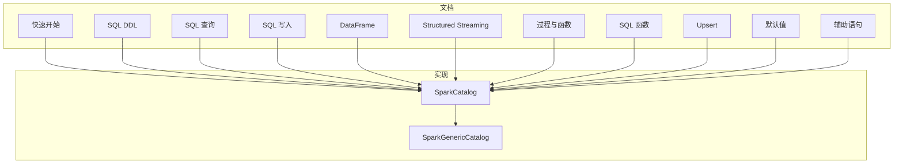
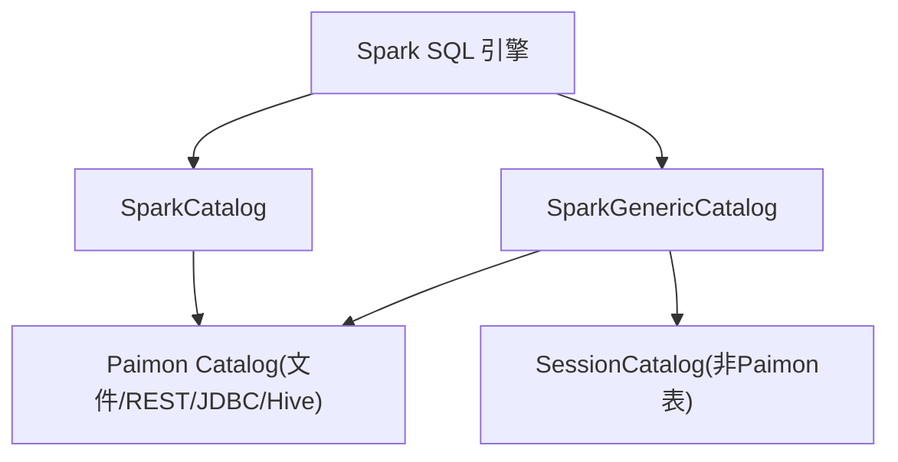
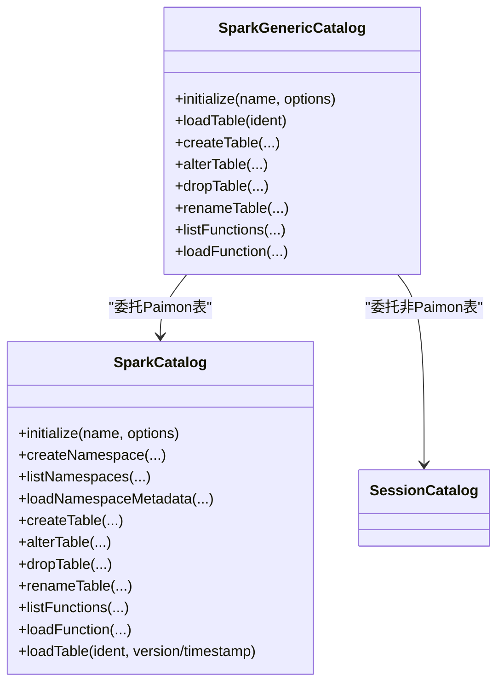
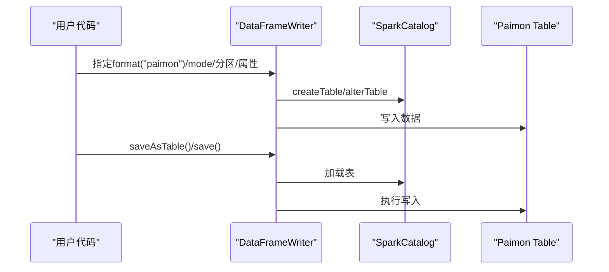
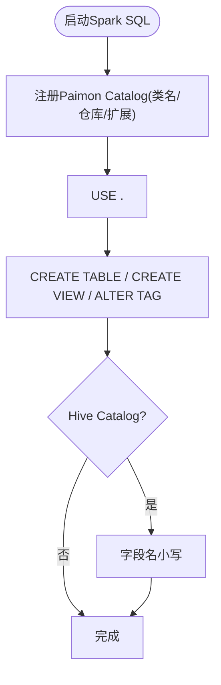
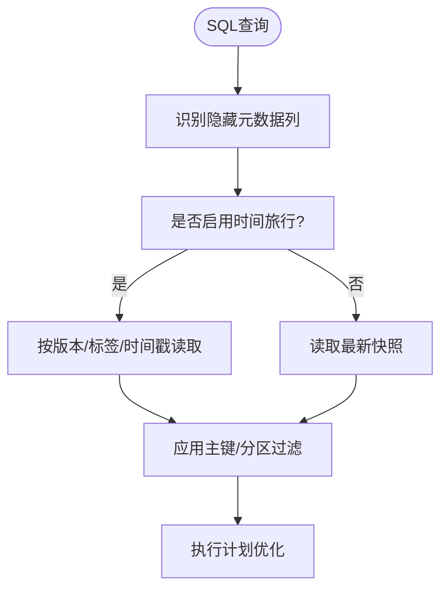
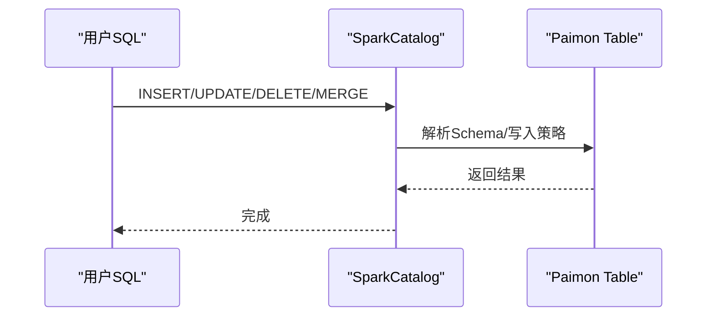
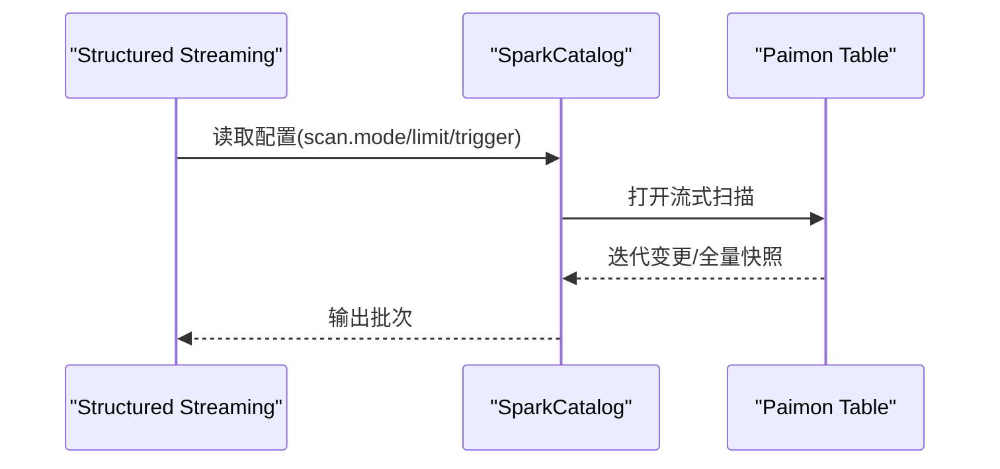
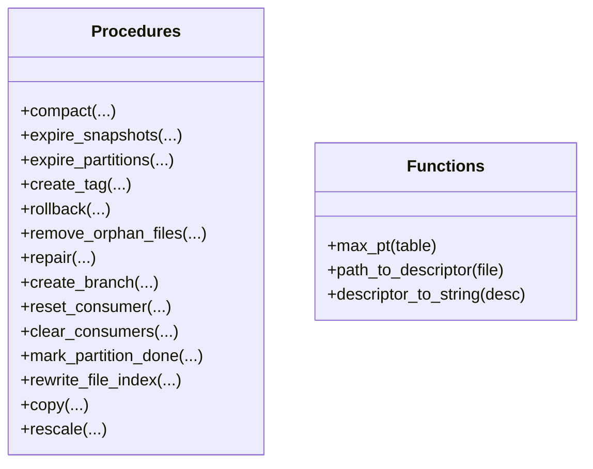
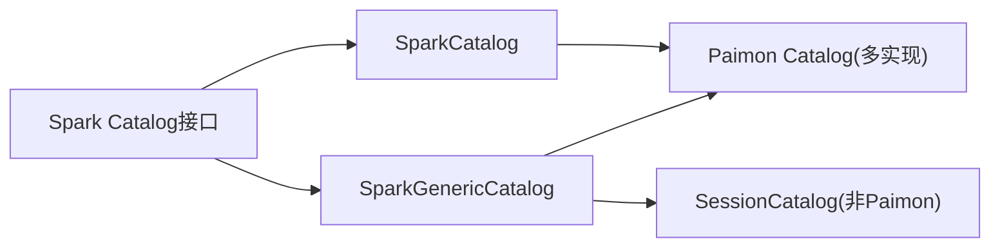

# Spark集成

<cite>
**本文引用的文件**
- [SparkCatalog.java](file://paimon-spark/paimon-spark-common/src/main/java/org/apache/paimon/spark/SparkCatalog.java)
- [SparkGenericCatalog.java](file://paimon-spark/paimon-spark-common/src/main/java/org/apache/paimon/spark/SparkGenericCatalog.java)
- [quick-start.md](file://docs/content/spark/quick-start.md)
- [dataframe.md](file://docs/content/spark/dataframe.md)
- [sql-ddl.md](file://docs/content/spark/sql-ddl.md)
- [sql-query.md](file://docs/content/spark/sql-query.md)
- [sql-write.md](file://docs/content/spark/sql-write.md)
- [structured-streaming.md](file://docs/content/spark/structured-streaming.md)
- [procedures.md](file://docs/content/spark/procedures.md)
- [sql-functions.md](file://docs/content/spark/sql-functions.md)
- [sql-upsert.md](file://docs/content/spark/sql-upsert.md)
- [default-value.md](file://docs/content/spark/default-value.md)
- [auxiliary.md](file://docs/content/spark/auxiliary.md)
</cite>

## 目录
1. [简介](#简介)
2. [项目结构](#项目结构)
3. [核心组件](#核心组件)
4. [架构总览](#架构总览)
5. [详细组件分析](#详细组件分析)
6. [依赖分析](#依赖分析)
7. [性能考虑](#性能考虑)
8. [故障排除指南](#故障排除指南)
9. [结论](#结论)
10. [附录](#附录)

## 简介
本文件面向希望在Apache Spark中使用Apache Paimon的用户，系统性地介绍Paimon与Spark的集成方案，覆盖以下方面：
- Spark SQL支持：DDL（创建/删除表、视图、标签）、查询优化、写入（插入/覆盖/更新/删除/合并）与Upsert
- DataFrame API：读取、写入、分区与模式指定
- Structured Streaming：流式写入与读取、扫描模式、触发策略与限流
- Spark Catalog：通用Catalog与Hive Catalog集成、REST/JDBC/文件系统元数据存储
- 部署与配置：版本兼容、JAR引入、会话扩展、动态选项
- 性能调优：主键/分区过滤、列式格式、分桶、扫描限制
- 故障排除：常见错误、调试技巧、函数与过程调用

## 项目结构
围绕Spark集成的核心文档与实现主要分布在如下位置：
- 文档目录：docs/content/spark 下涵盖快速开始、DataFrame、SQL DDL/查询/写入、Structured Streaming、过程与函数、Upsert、默认值、辅助语句等主题
- 实现目录：paimon-spark/paimon-spark-common/src/main/java/org/apache/paimon/spark 下包含SparkCatalog与SparkGenericCatalog等核心类

**图表来源**
- [quick-start.md](file://docs/content/spark/quick-start.md)
- [sql-ddl.md](file://docs/content/spark/sql-ddl.md)
- [sql-query.md](file://docs/content/spark/sql-query.md)
- [sql-write.md](file://docs/content/spark/sql-write.md)
- [dataframe.md](file://docs/content/spark/dataframe.md)
- [structured-streaming.md](file://docs/content/spark/structured-streaming.md)
- [procedures.md](file://docs/content/spark/procedures.md)
- [sql-functions.md](file://docs/content/spark/sql-functions.md)
- [sql-upsert.md](file://docs/content/spark/sql-upsert.md)
- [default-value.md](file://docs/content/spark/default-value.md)
- [auxiliary.md](file://docs/content/spark/auxiliary.md)
- [SparkCatalog.java](file://paimon-spark/paimon-spark-common/src/main/java/org/apache/paimon/spark/SparkCatalog.java)
- [SparkGenericCatalog.java](file://paimon-spark/paimon-spark-common/src/main/java/org/apache/paimon/spark/SparkGenericCatalog.java)

**章节来源**
- [quick-start.md](file://docs/content/spark/quick-start.md)
- [SparkCatalog.java](file://paimon-spark/paimon-spark-common/src/main/java/org/apache/paimon/spark/SparkCatalog.java)
- [SparkGenericCatalog.java](file://paimon-spark/paimon-spark-common/src/main/java/org/apache/paimon/spark/SparkGenericCatalog.java)

## 核心组件
- SparkCatalog：Spark TableCatalog实现，负责数据库/表/视图/函数的生命周期管理，以及Schema变更、时间旅行加载等
- SparkGenericCatalog：通用Catalog，既可加载Paimon表，也可委托给底层SessionCatalog加载非Paimon表（如CSV/Parquet/Hive）

关键职责与特性：
- Catalog初始化与校验、默认数据库创建
- 表的创建/删除/重命名、Schema变更（列增删改、类型变更、默认值）
- 视图与函数支持（系统函数与数据库函数）
- 时间旅行加载（按版本/时间戳）
- 与SessionCatalog的协同与回退

**章节来源**
- [SparkCatalog.java](file://paimon-spark/paimon-spark-common/src/main/java/org/apache/paimon/spark/SparkCatalog.java)
- [SparkGenericCatalog.java](file://paimon-spark/paimon-spark-common/src/main/java/org/apache/paimon/spark/SparkGenericCatalog.java)

## 架构总览
下图展示了Spark Catalog层与Paimon Catalog之间的交互，以及SparkGenericCatalog对SessionCatalog的委托。

**图表来源**
- [SparkCatalog.java](file://paimon-spark/paimon-spark-common/src/main/java/org/apache/paimon/spark/SparkCatalog.java)
- [SparkGenericCatalog.java](file://paimon-spark/paimon-spark-common/src/main/java/org/apache/paimon/spark/SparkGenericCatalog.java)

## 详细组件分析

### Spark Catalog与表生命周期
- 数据库管理：创建/列出/修改/删除命名空间（数据库），默认数据库自动创建
- 表管理：创建/列出/删除/重命名；支持Schema变更（列增删改、类型变更、注释、默认值）
- 视图与函数：系统函数与数据库函数加载；支持Lambda与文件型UDF（REST Catalog）
- 时间旅行：按版本或时间戳加载表快照

**图表来源**
- [SparkCatalog.java](file://paimon-spark/paimon-spark-common/src/main/java/org/apache/paimon/spark/SparkCatalog.java)
- [SparkGenericCatalog.java](file://paimon-spark/paimon-spark-common/src/main/java/org/apache/paimon/spark/SparkGenericCatalog.java)

**章节来源**
- [SparkCatalog.java](file://paimon-spark/paimon-spark-common/src/main/java/org/apache/paimon/spark/SparkCatalog.java)
- [SparkGenericCatalog.java](file://paimon-spark/paimon-spark-common/src/main/java/org/apache/paimon/spark/SparkGenericCatalog.java)

### DataFrame API使用
- 创建/写入：通过DataFrame.write.format("paimon")进行保存，支持指定主键、分区、表属性
- 插入：append/overwrite模式；insertInto/saveAsTable/save的区别
- 查询：spark.read.format("paimon").table(...)或.load(...)
- 时间旅行：通过option指定scan.snapshot-id进行历史读取

**图表来源**
- [dataframe.md](file://docs/content/spark/dataframe.md)
- [SparkCatalog.java](file://paimon-spark/paimon-spark-common/src/main/java/org/apache/paimon/spark/SparkCatalog.java)

**章节来源**
- [dataframe.md](file://docs/content/spark/dataframe.md)

### SQL DDL与Catalog配置
- Catalog类型：文件系统、Hive、JDBC、REST
- Hive Catalog注意事项：大小写要求、分区同步、URI一致性
- 默认表选项：catalog级table-default前缀
- 视图与标签：受支持的元数据存储类型

**图表来源**
- [sql-ddl.md](file://docs/content/spark/sql-ddl.md)
- [quick-start.md](file://docs/content/spark/quick-start.md)

**章节来源**
- [sql-ddl.md](file://docs/content/spark/sql-ddl.md)
- [quick-start.md](file://docs/content/spark/quick-start.md)

### SQL查询与优化
- 批查询：默认读取最新快照；支持隐藏元数据列（分区/桶/文件路径/行索引/行ID/序列号）
- 时间旅行：VERSION AS OF/TIMESTAMP AS OF/水位线
- 增量查询：Table Valued Function实现的增量读取
- 查询优化：主键/分区过滤加速、范围/前缀匹配、点查/范围查询优化

**图表来源**
- [sql-query.md](file://docs/content/spark/sql-query.md)

**章节来源**
- [sql-query.md](file://docs/content/spark/sql-query.md)

### SQL写入与Upsert
- INSERT INTO/OVERWRITE：静态/动态分区覆盖
- TRUNCATE/UPDATE/DELETE/MERGE：条件更新/删除/合并
- 写入合并Schema：动态表结构演进，支持显式类型转换
- Upsert：无主键表的upsert-key与sequence.field

**图表来源**
- [sql-write.md](file://docs/content/spark/sql-write.md)
- [sql-upsert.md](file://docs/content/spark/sql-upsert.md)

**章节来源**
- [sql-write.md](file://docs/content/spark/sql-write.md)
- [sql-upsert.md](file://docs/content/spark/sql-upsert.md)

### Structured Streaming集成
- 写入：仅支持append与complete两种输出模式
- 读取：多种扫描模式（latest、latest-full、from-timestamp、from-snapshot、from-snapshot-full、default）
- 触发与限流：maxFilesPerTrigger/maxBytesPerTrigger/maxRowsPerTrigger/minRowsPerTrigger/maxTriggerDelayMs
- 变更日志：直接读audit_log或开启read.changelog

**图表来源**
- [structured-streaming.md](file://docs/content/spark/structured-streaming.md)

**章节来源**
- [structured-streaming.md](file://docs/content/spark/structured-streaming.md)

### 过程与函数
- 过程：压缩、过期快照/分区、创建/替换/删除标签、回滚、清理孤儿文件、修复、分支管理、消费者重置/清理、标记分区完成、重写文件索引、复制表、重缩放分桶等
- 函数：内置函数（max_pt、path_to_descriptor、descriptor_to_string）、Lambda与文件型UDF（REST Catalog）

**图表来源**
- [procedures.md](file://docs/content/spark/procedures.md)
- [sql-functions.md](file://docs/content/spark/sql-functions.md)

**章节来源**
- [procedures.md](file://docs/content/spark/procedures.md)
- [sql-functions.md](file://docs/content/spark/sql-functions.md)

### 辅助能力与默认值
- SET/RESET动态选项：全局与表级动态选项优先级
- 元数据查询：DESCRIBE/SHOW CREATE/SHOW COLUMNS/PARTITIONS/TABLE EXTENDED/VIEWS
- 统计收集：ANALYZE TABLE
- 刷新缓存：REFRESH TABLE
- 默认值：列默认值定义与变更

**章节来源**
- [auxiliary.md](file://docs/content/spark/auxiliary.md)
- [default-value.md](file://docs/content/spark/default-value.md)

## 依赖分析
- SparkCatalog依赖Paimon CatalogFactory创建具体Catalog实例（文件系统/REST/JDBC/Hive）
- SparkGenericCatalog在Paimon表不存在时回退到SessionCatalog（非Paimon表）
- 两者均通过Spark TableCatalog接口暴露统一的表生命周期管理

**图表来源**
- [SparkCatalog.java](file://paimon-spark/paimon-spark-common/src/main/java/org/apache/paimon/spark/SparkCatalog.java)
- [SparkGenericCatalog.java](file://paimon-spark/paimon-spark-common/src/main/java/org/apache/paimon/spark/SparkGenericCatalog.java)

**章节来源**
- [SparkCatalog.java](file://paimon-spark/paimon-spark-common/src/main/java/org/apache/paimon/spark/SparkCatalog.java)
- [SparkGenericCatalog.java](file://paimon-spark/paimon-spark-common/src/main/java/org/apache/paimon/spark/SparkGenericCatalog.java)

## 性能考虑
- 主键/分区过滤：优先使用等值/前缀匹配，提升数据跳过效率
- 文件格式与分桶：合理设置文件格式与分桶数，结合主键排序
- 流式读取限流：通过maxBytesPerTrigger/maxRowsPerTrigger/minRowsPerTrigger/maxTriggerDelayMs平衡吞吐与延迟
- 动态选项：利用spark.paimon前缀设置全局/表级动态选项
- 分析统计：ANALYZE TABLE收集统计信息以优化执行计划

[本节为通用指导，不直接分析具体文件]

## 故障排除指南
- Catalog初始化失败：检查仓库路径、Hive URI一致性、JDBC驱动类路径
- Hive Catalog大小写问题：确保数据库/表/字段名小写
- 动态分区覆盖：未设置spark.sql.sources.partitionOverwriteMode=dynamic导致覆盖行为异常
- 函数与过程：REST Catalog才支持Lambda/文件型UDF；过程参数与表存在性检查
- 缓存问题：多会话场景重建表后需REFRESH TABLE清除缓存

**章节来源**
- [sql-ddl.md](file://docs/content/spark/sql-ddl.md)
- [sql-write.md](file://docs/content/spark/sql-write.md)
- [procedures.md](file://docs/content/spark/procedures.md)
- [auxiliary.md](file://docs/content/spark/auxiliary.md)

## 结论
Paimon在Spark中的集成提供了完整的SQL与DataFrame能力，覆盖DDL、查询、写入、流式处理与Catalog管理。通过SparkCatalog与SparkGenericCatalog，用户可在同一引擎内统一管理Paimon与传统表源。配合合理的主键/分区设计、文件格式与分桶策略，以及动态选项与统计收集，可获得良好的查询与写入性能。

[本节为总结性内容，不直接分析具体文件]

## 附录

### Spark版本与JAR准备
- 支持Spark 3.2–3.5、4.0（对应Scala 2.12/2.13与Java 8/17）
- 通过--packages或--jars引入对应版本的paimon-spark-*.jar
- 启动时注册扩展org.apache.paimon.spark.extensions.PaimonSparkSessionExtensions

**章节来源**
- [quick-start.md](file://docs/content/spark/quick-start.md)

### Catalog配置要点
- 文件系统/REST/JDBC/Hive三类元数据存储，分别适用于不同场景
- Hive Catalog需注意大小写与分区同步
- 默认表选项可通过spark.sql.catalog.<name>.table-default.<key>=value设置

**章节来源**
- [sql-ddl.md](file://docs/content/spark/sql-ddl.md)

### DataFrame与SQL示例路径
- DataFrame创建/插入/覆盖/替换与查询示例路径参考：
  - [dataframe.md](file://docs/content/spark/dataframe.md)
- SQL DDL/查询/写入示例路径参考：
  - [sql-ddl.md](file://docs/content/spark/sql-ddl.md)
  - [sql-query.md](file://docs/content/spark/sql-query.md)
  - [sql-write.md](file://docs/content/spark/sql-write.md)

**章节来源**
- [dataframe.md](file://docs/content/spark/dataframe.md)
- [sql-ddl.md](file://docs/content/spark/sql-ddl.md)
- [sql-query.md](file://docs/content/spark/sql-query.md)
- [sql-write.md](file://docs/content/spark/sql-write.md)