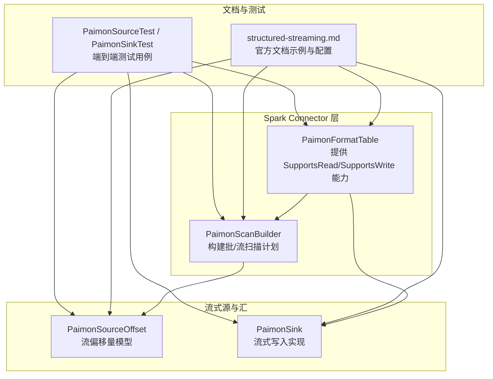
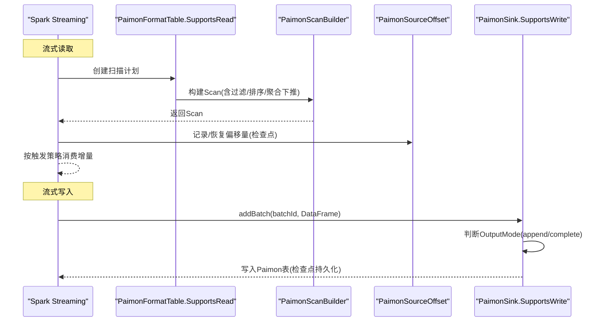
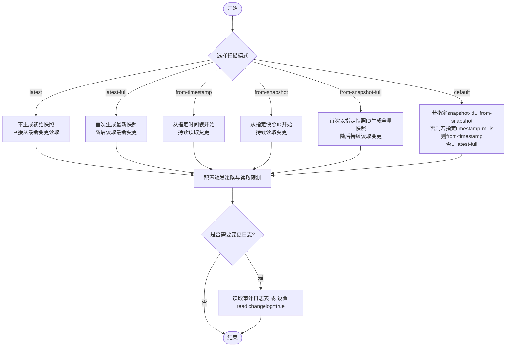
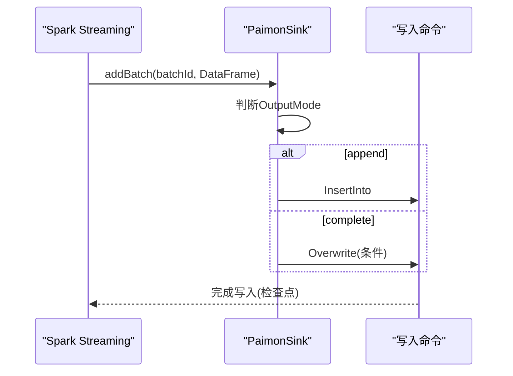
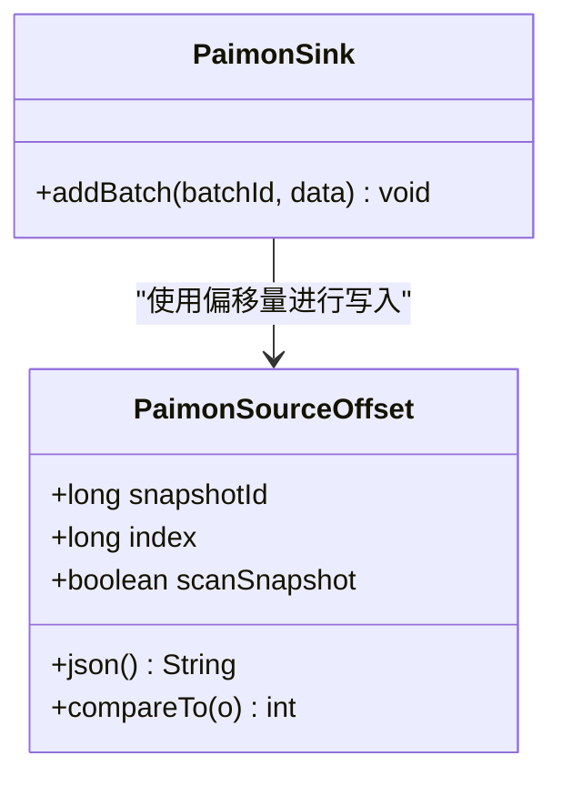
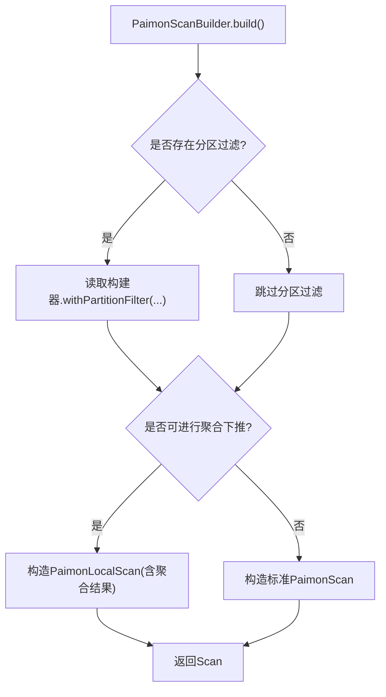
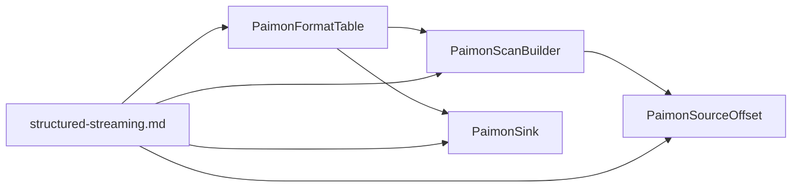

# Structured Streaming

<cite>
**本文引用的文件**
- [structured-streaming.md](file://docs/content/spark/structured-streaming.md)
- [PaimonFormatTable.scala](file://paimon-spark/paimon-spark-common/src/main/scala/org/apache/paimon/spark/format/PaimonFormatTable.scala)
- [PaimonScanBuilder.scala](file://paimon-spark/paimon-spark-common/src/main/scala/org/apache/paimon/spark/PaimonScanBuilder.scala)
- [PaimonSink.scala](file://paimon-spark/paimon-spark-common/src/main/scala/org/apache/paimon/spark/sources/PaimonSink.scala)
- [PaimonSourceOffset.scala](file://paimon-spark/paimon-spark-common/src/main/scala/org/apache/paimon/spark/sources/PaimonSourceOffset.scala)
- [PaimonSourceTest.scala](file://paimon-spark/paimon-spark-ut/src/test/scala/org/apache/paimon/spark/PaimonSourceTest.scala)
- [PaimonSinkTest.scala](file://paimon-spark/paimon-spark-3.4/src/test/scala/org/apache/paimon/spark/PaimonSinkTest.scala)
- [overview.md](file://docs/content/concepts/overview.md)
</cite>

## 目录
1. [引言](#引言)
2. [项目结构](#项目结构)
3. [核心组件](#核心组件)
4. [架构总览](#架构总览)
5. [组件详解](#组件详解)
6. [依赖关系分析](#依赖关系分析)
7. [性能考量](#性能考量)
8. [故障排查指南](#故障排查指南)
9. [结论](#结论)
10. [附录](#附录)

## 引言
本文件面向希望在Apache Paimon上进行Spark Structured Streaming（流式）读写与实时分析的工程师，系统性阐述以下主题：
- 如何配置流式查询与流式写入
- 增量数据处理与检查点机制
- 流式读取的不同扫描模式与触发策略
- 流式写入的模式选择与状态管理
- 乱序数据、水位线与重复数据的处理思路
- 性能优化（并行度、背压、内存）
- 典型应用场景（实时摄取、流式ETL、实时分析）
- 监控与故障恢复、常见问题排查

## 项目结构
围绕Spark Structured Streaming，Paimon在Spark模块中提供了统一的Source/Sink与ScanBuilder适配层，并通过格式化表接口暴露给Spark Connector。

图表来源
- [PaimonFormatTable.scala:42-64](file://paimon-spark/paimon-spark-common/src/main/scala/org/apache/paimon/spark/format/PaimonFormatTable.scala#L42-L64)
- [PaimonScanBuilder.scala:35-157](file://paimon-spark/paimon-spark-common/src/main/scala/org/apache/paimon/spark/PaimonScanBuilder.scala#L35-L157)
- [PaimonSourceOffset.scala:26-89](file://paimon-spark/paimon-spark-common/src/main/scala/org/apache/paimon/spark/sources/PaimonSourceOffset.scala#L26-L89)
- [PaimonSink.scala:31-51](file://paimon-spark/paimon-spark-common/src/main/scala/org/apache/paimon/spark/sources/PaimonSink.scala#L31-L51)
- [structured-streaming.md:29-234](file://docs/content/spark/structured-streaming.md#L29-L234)

章节来源
- [structured-streaming.md:27-234](file://docs/content/spark/structured-streaming.md#L27-L234)
- [PaimonFormatTable.scala:42-64](file://paimon-spark/paimon-spark-common/src/main/scala/org/apache/paimon/spark/format/PaimonFormatTable.scala#L42-L64)
- [PaimonScanBuilder.scala:35-157](file://paimon-spark/paimon-spark-common/src/main/scala/org/apache/paimon/spark/PaimonScanBuilder.scala#L35-L157)
- [PaimonSourceOffset.scala:26-89](file://paimon-spark/paimon-spark-common/src/main/scala/org/apache/paimon/spark/sources/PaimonSourceOffset.scala#L26-L89)
- [PaimonSink.scala:31-51](file://paimon-spark/paimon-spark-common/src/main/scala/org/apache/paimon/spark/sources/PaimonSink.scala#L31-L51)

## 核心组件
- 格式化表适配器：提供Spark Connector所需的读写能力声明与属性导出。
- 扫描构建器：负责将Spark的读取计划转换为Paimon内部的读取构建器，支持分区过滤、Top-N与聚合下推等。
- 流式偏移量：定义流式读取的偏移量结构与比较逻辑，支撑检查点与重启恢复。
- 流式写入器：根据OutputMode选择插入或覆盖写入，封装写入流程。

章节来源
- [PaimonFormatTable.scala:42-64](file://paimon-spark/paimon-spark-common/src/main/scala/org/apache/paimon/spark/format/PaimonFormatTable.scala#L42-L64)
- [PaimonScanBuilder.scala:35-157](file://paimon-spark/paimon-spark-common/src/main/scala/org/apache/paimon/spark/PaimonScanBuilder.scala#L35-L157)
- [PaimonSourceOffset.scala:26-89](file://paimon-spark/paimon-spark-common/src/main/scala/org/apache/paimon/spark/sources/PaimonSourceOffset.scala#L26-L89)
- [PaimonSink.scala:31-51](file://paimon-spark/paimon-spark-common/src/main/scala/org/apache/paimon/spark/sources/PaimonSink.scala#L31-L51)

## 架构总览
下图展示了从Spark Structured Streaming到Paimon的读写路径与关键交互点。

图表来源
- [PaimonFormatTable.scala:42-64](file://paimon-spark/paimon-spark-common/src/main/scala/org/apache/paimon/spark/format/PaimonFormatTable.scala#L42-L64)
- [PaimonScanBuilder.scala:127-155](file://paimon-spark/paimon-spark-common/src/main/scala/org/apache/paimon/spark/PaimonScanBuilder.scala#L127-L155)
- [PaimonSourceOffset.scala:26-89](file://paimon-spark/paimon-spark-common/src/main/scala/org/apache/paimon/spark/sources/PaimonSourceOffset.scala#L26-L89)
- [PaimonSink.scala:31-51](file://paimon-spark/paimon-spark-common/src/main/scala/org/apache/paimon/spark/sources/PaimonSink.scala#L31-L51)

## 组件详解

### 流式读取（Streaming Query）
- 支持的扫描模式
  - latest：首次启动不生成快照，直接从最新变更开始读取
  - latest-full：首次启动生成最新快照，随后持续读取最新变更
  - from-timestamp：从指定时间戳开始持续读取变更
  - from-snapshot：从指定快照ID开始持续读取变更
  - from-snapshot-full：首次以指定快照ID生成全量快照，随后持续读取变更
  - default：优先级为“snapshot-id” > “timestamp-millis” > latest-full
- 触发与限流
  - 支持Spark AvailableNow触发器与多种读取限制键，如每批次最大文件数、字节数、行数，以及最小行数与最大触发延迟组合
- 变更日志
  - 两种方式获取变更日志：直接读取系统审计日志表；或在表位置读取时开启“read.changelog=true”

图表来源
- [structured-streaming.md:61-234](file://docs/content/spark/structured-streaming.md#L61-L234)

章节来源
- [structured-streaming.md:61-234](file://docs/content/spark/structured-streaming.md#L61-L234)

### 流式写入（Streaming Write）
- 输出模式
  - append：仅追加新记录
  - complete：按条件覆盖写入（对应内部Overwrite）
- 写入流程
  - addBatch接收批次数据，依据OutputMode选择插入或覆盖
  - 将DataFrame转换为内部格式后调用写入命令执行

图表来源
- [PaimonSink.scala:31-51](file://paimon-spark/paimon-spark-common/src/main/scala/org/apache/paimon/spark/sources/PaimonSink.scala#L31-L51)
- [structured-streaming.md:31-60](file://docs/content/spark/structured-streaming.md#L31-L60)

章节来源
- [PaimonSink.scala:31-51](file://paimon-spark/paimon-spark-common/src/main/scala/org/apache/paimon/spark/sources/PaimonSink.scala#L31-L51)
- [structured-streaming.md:31-60](file://docs/content/spark/structured-streaming.md#L31-L60)

### 偏移量与检查点（Offset & Checkpoint）
- 偏移量模型
  - 由快照ID、文件索引、是否扫描全量快照组成
  - 提供JSON序列化与比较逻辑，用于判断数据分片与范围
- 检查点
  - 流式写入通过“checkpointLocation”选项持久化偏移量，保障重启后从正确位置继续

图表来源
- [PaimonSourceOffset.scala:26-89](file://paimon-spark/paimon-spark-common/src/main/scala/org/apache/paimon/spark/sources/PaimonSourceOffset.scala#L26-L89)
- [PaimonSink.scala:31-51](file://paimon-spark/paimon-spark-common/src/main/scala/org/apache/paimon/spark/sources/PaimonSink.scala#L31-L51)

章节来源
- [PaimonSourceOffset.scala:26-89](file://paimon-spark/paimon-spark-common/src/main/scala/org/apache/paimon/spark/sources/PaimonSourceOffset.scala#L26-L89)
- [structured-streaming.md:54-56](file://docs/content/spark/structured-streaming.md#L54-L56)

### 扫描构建与谓词/聚合/Top-N下推
- 分区过滤：将分区谓词下推至Paimon读取构建器
- 聚合下推：在无后置过滤条件下尝试将聚合下推到Paimon本地扫描
- Top-N下推：在满足字段存在与排序方向约束时，将排序与限制下推

图表来源
- [PaimonScanBuilder.scala:106-125](file://paimon-spark/paimon-spark-common/src/main/scala/org/apache/paimon/spark/PaimonScanBuilder.scala#L106-L125)
- [PaimonScanBuilder.scala:127-155](file://paimon-spark/paimon-spark-common/src/main/scala/org/apache/paimon/spark/PaimonScanBuilder.scala#L127-L155)

章节来源
- [PaimonScanBuilder.scala:35-157](file://paimon-spark/paimon-spark-common/src/main/scala/org/apache/paimon/spark/PaimonScanBuilder.scala#L35-L157)

### 端到端测试与行为验证
- 源到汇测试：验证从Paimon源读取并写入另一个Paimon表，覆盖检查点与增量数据追加
- 端到端验证：确保流式查询与写入在可用数据触发器下的行为符合预期

章节来源
- [PaimonSourceTest.scala:714-747](file://paimon-spark/paimon-spark-ut/src/test/scala/org/apache/paimon/spark/PaimonSourceTest.scala#L714-L747)
- [PaimonSinkTest.scala](file://paimon-spark/paimon-spark-3.4/src/test/scala/org/apache/paimon/spark/PaimonSinkTest.scala)

## 依赖关系分析
- PaimonFormatTable作为表适配器，声明表能力并导出属性，供Spark Connector读写
- PaimonScanBuilder将Spark读取计划转换为Paimon内部Scan，承担谓词/聚合/Top-N下推
- PaimonSourceOffset为流式偏移量载体，支撑检查点与重启
- PaimonSink根据OutputMode选择写入策略，封装写入命令

图表来源
- [PaimonFormatTable.scala:42-64](file://paimon-spark/paimon-spark-common/src/main/scala/org/apache/paimon/spark/format/PaimonFormatTable.scala#L42-L64)
- [PaimonScanBuilder.scala:35-157](file://paimon-spark/paimon-spark-common/src/main/scala/org/apache/paimon/spark/PaimonScanBuilder.scala#L35-L157)
- [PaimonSourceOffset.scala:26-89](file://paimon-spark/paimon-spark-common/src/main/scala/org/apache/paimon/spark/sources/PaimonSourceOffset.scala#L26-L89)
- [PaimonSink.scala:31-51](file://paimon-spark/paimon-spark-common/src/main/scala/org/apache/paimon/spark/sources/PaimonSink.scala#L31-L51)
- [structured-streaming.md:29-234](file://docs/content/spark/structured-streaming.md#L29-L234)

章节来源
- [PaimonFormatTable.scala:42-64](file://paimon-spark/paimon-spark-common/src/main/scala/org/apache/paimon/spark/format/PaimonFormatTable.scala#L42-L64)
- [PaimonScanBuilder.scala:35-157](file://paimon-spark/paimon-spark-common/src/main/scala/org/apache/paimon/spark/PaimonScanBuilder.scala#L35-L157)
- [PaimonSourceOffset.scala:26-89](file://paimon-spark/paimon-spark-common/src/main/scala/org/apache/paimon/spark/sources/PaimonSourceOffset.scala#L26-L89)
- [PaimonSink.scala:31-51](file://paimon-spark/paimon-spark-common/src/main/scala/org/apache/paimon/spark/sources/PaimonSink.scala#L31-L51)
- [structured-streaming.md:29-234](file://docs/content/spark/structured-streaming.md#L29-L234)

## 性能考量
- 并行度与分区
  - 合理设置主键/桶参数，提升并行读写能力
- 背压与限流
  - 使用“read.stream.*PerTrigger”系列键控制单批次大小，避免下游拥塞
  - 结合触发器（如AvailableNow）控制批量处理节奏
- 内存与序列化
  - 优先使用列存格式，减少序列化开销
- 下推优化
  - 利用分区过滤、Top-N与聚合下推，降低扫描与传输成本

## 故障排查指南
- 偏移量解析失败
  - 确认检查点目录可读写，偏移量JSON格式正确
- 重复数据
  - 检查OutputMode与幂等写入策略，必要时在上游去重
- 乱序与水位线
  - 当前Spark Structured Streaming未内置水位线推进；建议在上游Flink侧使用水位线，或在Spark侧通过事件时间+触发器策略控制
- 快照与时间旅行
  - 使用“scan.snapshot-id”或“scan.timestamp-millis”定位历史视图，验证一致性

章节来源
- [PaimonSourceOffset.scala:69-77](file://paimon-spark/paimon-spark-common/src/main/scala/org/apache/paimon/spark/sources/PaimonSourceOffset.scala#L69-L77)
- [structured-streaming.md:69-165](file://docs/content/spark/structured-streaming.md#L69-L165)

## 结论
Paimon对Spark Structured Streaming提供了完善的读写适配与扫描优化能力。通过合理的扫描模式、触发策略与限流配置，可在保证一致性的同时获得良好的吞吐与延迟表现。结合检查点与端到端测试，可有效支撑实时摄取、流式ETL与实时分析等场景。

## 附录
- 表概念概述（批/流语义）
  - 批执行模式下，表如同传统数据库，查询看到的是最新快照
  - 流执行模式下，表如同消息队列，查询表现为持续的变更流

章节来源
- [overview.md:63-71](file://docs/content/concepts/overview.md#L63-L71)