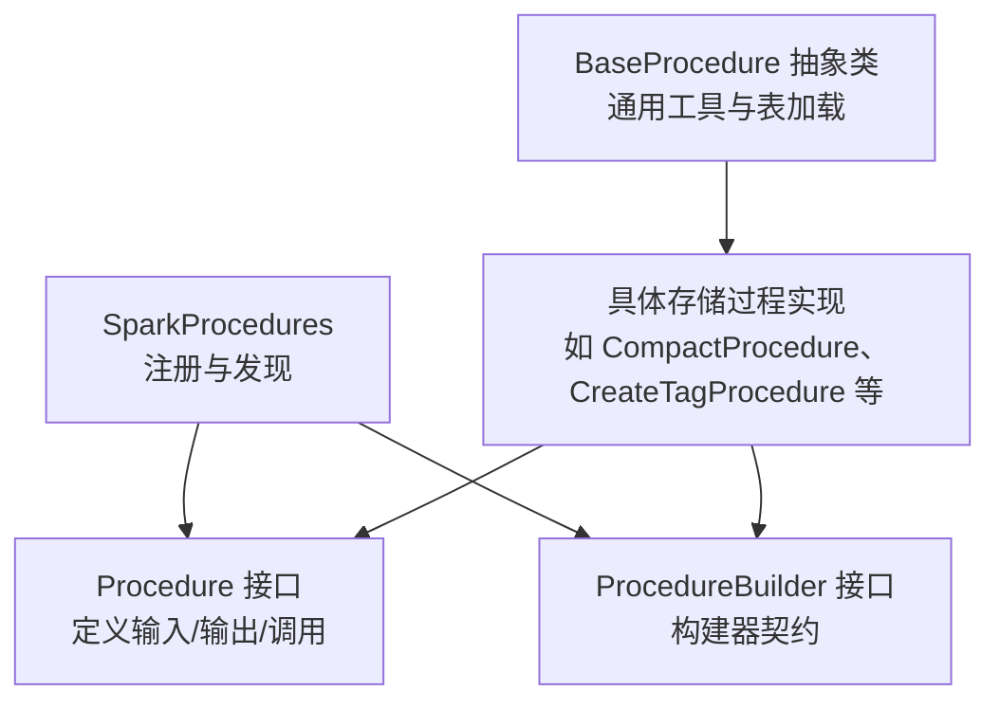
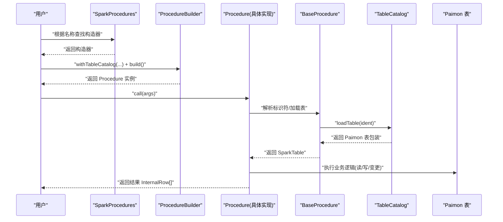
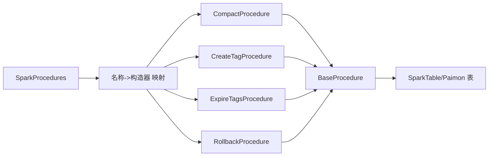

# 存储过程

<cite>
**本文引用的文件**
- [SparkProcedures.java](file://paimon-spark/paimon-spark-common/src/main/java/org/apache/paimon/spark/SparkProcedures.java)
- [BaseProcedure.java](file://paimon-spark/paimon-spark-common/src/main/java/org/apache/paimon/spark/procedure/BaseProcedure.java)
- [Procedure.java](file://paimon-spark/paimon-spark-common/src/main/java/org/apache/paimon/spark/procedure/Procedure.java)
- [ProcedureBuilder.java](file://paimon-spark/paimon-spark-common/src/main/java/org/apache/paimon/spark/procedure/ProcedureBuilder.java)
- [ProcedureParameter.java](file://paimon-spark/paimon-spark-common/src/main/java/org/apache/paimon/spark/procedure/ProcedureParameter.java)
- [ProcedureParameterImpl.java](file://paimon-spark/paimon-spark-common/src/main/java/org/apache/paimon/spark/procedure/ProcedureParameterImpl.java)
- [CompactProcedure.java](file://paimon-spark/paimon-spark-common/src/main/java/org/apache/paimon/spark/procedure/CompactProcedure.java)
- [CreateTagProcedure.java](file://paimon-spark/paimon-spark-common/src/main/java/org/apache/paimon/spark/procedure/CreateTagProcedure.java)
- [CreateOrReplaceTagBaseProcedure.java](file://paimon-spark/paimon-spark-common/src/main/java/org/apache/paimon/spark/procedure/CreateOrReplaceTagBaseProcedure.java)
- [ExpireTagsProcedure.java](file://paimon-spark/paimon-spark-common/src/main/java/org/apache/paimon/spark/procedure/ExpireTagsProcedure.java)
- [RollbackProcedure.java](file://paimon-spark/paimon-spark-common/src/main/java/org/apache/paimon/spark/procedure/RollbackProcedure.java)
- [CompactDatabaseProcedure.java](file://paimon-spark/paimon-spark-common/src/main/java/org/apache/paimon/spark/procedure/CompactDatabaseProcedure.java)
- [procedures.md](file://docs/content/spark/procedures.md)
</cite>

## 目录
1. [简介](#简介)
2. [项目结构](#项目结构)
3. [核心组件](#核心组件)
4. [架构总览](#架构总览)
5. [详细组件分析](#详细组件分析)
6. [依赖分析](#依赖分析)
7. [性能考虑](#性能考虑)
8. [故障排查指南](#故障排查指南)
9. [结论](#结论)
10. [附录](#附录)

## 简介
本文件系统性介绍 Apache Paimon 在 Spark 中的存储过程能力，覆盖内置存储过程的类型与职责、调用语法与参数传递机制、执行环境与权限控制、最佳实践与性能优化建议，以及自定义存储过程的开发方法。读者可据此在 Spark SQL 中通过标准 CALL 语法调用各类管理与维护操作，如标签管理、回滚、压缩、分区过期、函数与视图方言管理等。

## 项目结构
围绕 Spark 存储过程的关键模块如下：
- SparkProcedures：集中注册并暴露所有可用存储过程名称与其构造器
- procedure 包：存放具体存储过程实现，统一继承 BaseProcedure，并遵循 Procedure 接口规范
- 文档：docs/content/spark/procedures.md 提供各存储过程的参数说明与示例



图表来源
- [SparkProcedures.java:84-127](file://paimon-spark/paimon-spark-common/src/main/java/org/apache/paimon/spark/SparkProcedures.java#L84-L127)
- [Procedure.java:25-45](file://paimon-spark/paimon-spark-common/src/main/java/org/apache/paimon/spark/procedure/Procedure.java#L25-L45)
- [ProcedureBuilder.java:25-41](file://paimon-spark/paimon-spark-common/src/main/java/org/apache/paimon/spark/procedure/ProcedureBuilder.java#L25-L41)
- [BaseProcedure.java:42-156](file://paimon-spark/paimon-spark-common/src/main/java/org/apache/paimon/spark/procedure/BaseProcedure.java#L42-L156)

章节来源
- [SparkProcedures.java:1-129](file://paimon-spark/paimon-spark-common/src/main/java/org/apache/paimon/spark/SparkProcedures.java#L1-L129)
- [procedures.md:27-507](file://docs/content/spark/procedures.md#L27-L507)

## 核心组件
- 存储过程接口与构建器
  - Procedure：定义参数、输出模式、调用入口与描述
  - ProcedureBuilder：以 Catalog 与标识符为上下文构建具体 Procedure 实例
- 基类与通用能力
  - BaseProcedure：封装表解析、加载、Spark 缓存刷新、内部行构造等通用逻辑
- 注册中心
  - SparkProcedures：集中注册所有内置存储过程名称到其构造器映射，支持大小写不敏感查找

章节来源
- [Procedure.java:25-45](file://paimon-spark/paimon-spark-common/src/main/java/org/apache/paimon/spark/procedure/Procedure.java#L25-L45)
- [ProcedureBuilder.java:25-41](file://paimon-spark/paimon-spark-common/src/main/java/org/apache/paimon/spark/procedure/ProcedureBuilder.java#L25-L41)
- [BaseProcedure.java:42-156](file://paimon-spark/paimon-spark-common/src/main/java/org/apache/paimon/spark/procedure/BaseProcedure.java#L42-L156)
- [SparkProcedures.java:75-82](file://paimon-spark/paimon-spark-common/src/main/java/org/apache/paimon/spark/SparkProcedures.java#L75-L82)

## 架构总览
下图展示从 Spark 调用到存储过程执行的整体流程：用户通过 CALL 语法指定存储过程名与参数；SparkProcedures 根据名称获取对应构造器，构建 Procedure；BaseProcedure 完成表解析与加载，随后由具体实现执行业务逻辑并返回结果。



图表来源
- [SparkProcedures.java:75-78](file://paimon-spark/paimon-spark-common/src/main/java/org/apache/paimon/spark/SparkProcedures.java#L75-L78)
- [ProcedureBuilder.java:33-40](file://paimon-spark/paimon-spark-common/src/main/java/org/apache/paimon/spark/procedure/ProcedureBuilder.java#L33-L40)
- [Procedure.java:39-39](file://paimon-spark/paimon-spark-common/src/main/java/org/apache/paimon/spark/procedure/Procedure.java#L39-L39)
- [BaseProcedure.java:77-121](file://paimon-spark/paimon-spark-common/src/main/java/org/apache/paimon/spark/procedure/BaseProcedure.java#L77-L121)

## 详细组件分析

### 存储过程调用语法与参数传递
- 调用方式
  - 使用标准 CALL 语法，例如：CALL sys.compact(table => 'T', partitions => 'p=0;p=1', order_strategy => 'zorder', order_by => 'a,b')
- 参数传递机制
  - 所有存储过程均通过 InternalRow 形式接收参数，参数顺序与类型由各存储过程的 ProcedureParameter 列表定义
  - BaseProcedure 提供 toIdentifier、toCatalogAndIdentifier 等工具，确保传入的表标识符合法且归属当前 Catalog
- 输出格式
  - 各存储过程定义自己的输出 StructType，返回 InternalRow[] 结果集

章节来源
- [procedures.md:41-61](file://docs/content/spark/procedures.md#L41-L61)
- [Procedure.java:27-44](file://paimon-spark/paimon-spark-common/src/main/java/org/apache/paimon/spark/procedure/Procedure.java#L27-L44)
- [BaseProcedure.java:52-75](file://paimon-spark/paimon-spark-common/src/main/java/org/apache/paimon/spark/procedure/BaseProcedure.java#L52-L75)

### 管理类存储过程

#### 回滚相关
- rollback
  - 功能：将表回滚到指定版本（快照 ID 或标签）
  - 关键参数：table、version/snapshot/tag 三选一
  - 返回：previous_snapshot_id、current_snapshot_id
  - 注意：当 version 指定为字符串时按标签处理，数字时按快照 ID 处理
- rollback_to_timestamp / rollback_to_watermark
  - 功能：回滚到早于等于给定时间戳或水位的快照
  - 关键参数：table、timestamp 或 watermark
  - 返回：同上

章节来源
- [RollbackProcedure.java:41-137](file://paimon-spark/paimon-spark-common/src/main/java/org/apache/paimon/spark/procedure/RollbackProcedure.java#L41-L137)
- [procedures.md:175-211](file://docs/content/spark/procedures.md#L175-L211)

#### 标签管理
- create_tag / replace_tag / rename_tag / delete_tag / expire_tags / create_tag_from_timestamp / trigger_tag_automatic_creation
  - 统一由 CreateOrReplaceTagBaseProcedure 及其子类实现标签的创建/替换/重命名/删除/过期与触发自动创建
  - 共同参数：table、tag；部分支持 snapshot、time_retained；expire_tags 支持 older_than
  - 返回：布尔型结果或已过期标签列表

章节来源
- [CreateOrReplaceTagBaseProcedure.java:40-88](file://paimon-spark/paimon-spark-common/src/main/java/org/apache/paimon/spark/procedure/CreateOrReplaceTagBaseProcedure.java#L40-L88)
- [CreateTagProcedure.java:28-57](file://paimon-spark/paimon-spark-common/src/main/java/org/apache/paimon/spark/procedure/CreateTagProcedure.java#L28-L57)
- [ExpireTagsProcedure.java:44-119](file://paimon-spark/paimon-spark-common/src/main/java/org/apache/paimon/spark/procedure/ExpireTagsProcedure.java#L44-L119)
- [procedures.md:91-173](file://docs/content/spark/procedures.md#L91-L173)

### 维护类存储过程

#### 压缩与数据库级压缩
- compact
  - 功能：对表进行文件压缩，支持多种策略与排序方式
  - 关键参数：table、partitions/where 二选一、compact_strategy(full/minor)、order_strategy、order_by、options、partition_idle_time
  - 返回：布尔型结果
  - 注意：与排序压缩不兼容的组合会抛出异常；支持不同桶模式的差异化路径
- compact_database
  - 功能：对数据库内所有表执行压缩
  - 关键参数：数据库名、选项等
  - 返回：布尔型结果
  - 注意：内部会构造参数并调用 compactProcedure.call

章节来源
- [CompactProcedure.java:116-233](file://paimon-spark/paimon-spark-common/src/main/java/org/apache/paimon/spark/procedure/CompactProcedure.java#L116-L233)
- [CompactDatabaseProcedure.java:182-217](file://paimon-spark/paimon-spark-common/src/main/java/org/apache/paimon/spark/procedure/CompactDatabaseProcedure.java#L182-L217)
- [procedures.md:41-61](file://docs/content/spark/procedures.md#L41-L61)

#### 快照与分区过期
- expire_snapshots
  - 功能：按数量或时间阈值过期历史快照
  - 关键参数：table、retain_max、retain_min、older_than、max_deletes、options
- expire_partitions
  - 功能：按生命周期过期分区
  - 关键参数：table、expiration_time、timestamp_formatter、timestamp_pattern、expire_strategy、max_expires、options

章节来源
- [procedures.md:63-89](file://docs/content/spark/procedures.md#L63-L89)

#### 其他维护操作
- purge_files：清空表并删除文件
- repair：同步文件系统与元数据
- remove_orphan_files / remove_unexisting_files：清理孤儿/不存在文件
- compact_manifest：压缩清单
- reset_consumer / clear_consumers：消费者重置与清理
- mark_partition_done：标记分区完成
- rewrite_file_index / copy / rescale：索引重写、复制、重分桶

章节来源
- [procedures.md:213-504](file://docs/content/spark/procedures.md#L213-L504)

### 自定义存储过程开发指南
- 继承关系
  - 新建类继承 BaseProcedure，并实现 Procedure 接口（或复用现有抽象基类）
- 参数与输出
  - 在构造函数中定义 ProcedureParameter[] 与 StructType.outputType
  - 在 call 方法中解析参数、校验约束、执行业务逻辑
- 构造器与注册
  - 提供静态 builder() 返回 ProcedureBuilder，内部 doBuild 返回新实例
  - 在 SparkProcedures.initProcedureBuilders 中注册名称到构造器的映射
- 表访问与缓存
  - 使用 BaseProcedure.modifyPaimonTable 或 loadSparkTable 访问 Paimon 表
  - 若修改了表结构或元数据，调用 refreshSparkCache 使 Spark 重新缓存计划

```mermaid
classDiagram
class Procedure {
+parameters() ProcedureParameter[]
+outputType() StructType
+call(args) InternalRow[]
+description() String
}
class ProcedureBuilder {
+withTableCatalog(catalog) ProcedureBuilder
+build() Procedure
}
class BaseProcedure {
+toIdentifier(...)
+loadSparkTable(ident)
+refreshSparkCache(ident, table)
+newInternalRow(...)
}
class CreateTagProcedure
class ExpireTagsProcedure
class CompactProcedure
class RollbackProcedure
Procedure <|.. BaseProcedure
ProcedureBuilder <|.. BaseProcedure : : Builder
BaseProcedure <|-- CreateTagProcedure
BaseProcedure <|-- ExpireTagsProcedure
BaseProcedure <|-- CompactProcedure
BaseProcedure <|-- RollbackProcedure
```

图表来源
- [Procedure.java:25-45](file://paimon-spark/paimon-spark-common/src/main/java/org/apache/paimon/spark/procedure/Procedure.java#L25-L45)
- [ProcedureBuilder.java:25-41](file://paimon-spark/paimon-spark-common/src/main/java/org/apache/paimon/spark/procedure/ProcedureBuilder.java#L25-L41)
- [BaseProcedure.java:42-156](file://paimon-spark/paimon-spark-common/src/main/java/org/apache/paimon/spark/procedure/BaseProcedure.java#L42-L156)
- [CreateTagProcedure.java:28-57](file://paimon-spark/paimon-spark-common/src/main/java/org/apache/paimon/spark/procedure/CreateTagProcedure.java#L28-L57)
- [ExpireTagsProcedure.java:42-119](file://paimon-spark/paimon-spark-common/src/main/java/org/apache/paimon/spark/procedure/ExpireTagsProcedure.java#L42-L119)
- [CompactProcedure.java:112-233](file://paimon-spark/paimon-spark-common/src/main/java/org/apache/paimon/spark/procedure/CompactProcedure.java#L112-L233)
- [RollbackProcedure.java:39-137](file://paimon-spark/paimon-spark-common/src/main/java/org/apache/paimon/spark/procedure/RollbackProcedure.java#L39-L137)

章节来源
- [BaseProcedure.java:77-121](file://paimon-spark/paimon-spark-common/src/main/java/org/apache/paimon/spark/procedure/BaseProcedure.java#L77-L121)
- [SparkProcedures.java:84-127](file://paimon-spark/paimon-spark-common/src/main/java/org/apache/paimon/spark/SparkProcedures.java#L84-L127)

### 执行环境与权限控制
- 执行环境
  - 存储过程在 SparkSession 上下文中运行，通过 PaimonSparkSession$ 获取活动会话
  - 表必须是 Paimon 的 SparkTable，否则会抛出类型不匹配异常
- 权限控制
  - 存储过程本身未内置细粒度权限检查；实际权限取决于底层 Catalog 与表的访问控制策略
  - 建议结合 Catalog 层的鉴权与对象级权限策略使用

章节来源
- [BaseProcedure.java:48-50](file://paimon-spark/paimon-spark-common/src/main/java/org/apache/paimon/spark/procedure/BaseProcedure.java#L48-L50)
- [BaseProcedure.java:99-110](file://paimon-spark/paimon-spark-common/src/main/java/org/apache/paimon/spark/procedure/BaseProcedure.java#L99-L110)

## 依赖分析
- 内聚与耦合
  - SparkProcedures 仅负责注册与查找，低耦合；具体存储过程独立实现业务逻辑
  - BaseProcedure 提供通用能力，减少重复代码，提升内聚
- 外部依赖
  - 依赖 Spark SQL 的 InternalRow、StructType、DataSourceV2Relation 等
  - 依赖 Paimon 的 Table、FileStoreTable、Snapshot 等核心类型



图表来源
- [SparkProcedures.java:84-127](file://paimon-spark/paimon-spark-common/src/main/java/org/apache/paimon/spark/SparkProcedures.java#L84-L127)
- [BaseProcedure.java:77-121](file://paimon-spark/paimon-spark-common/src/main/java/org/apache/paimon/spark/procedure/BaseProcedure.java#L77-L121)

章节来源
- [SparkProcedures.java:84-127](file://paimon-spark/paimon-spark-common/src/main/java/org/apache/paimon/spark/SparkProcedures.java#L84-L127)

## 性能考虑
- 并行度与分区
  - 压缩类操作（如 compact）会根据分区与任务数并行执行，合理设置 Spark shuffle 分区数可提升吞吐
- 排序与重写
  - 排序压缩仅适用于无桶感知的追加只读表；启用增量聚簇时禁止排序压缩
- 过期策略
  - 标签与快照过期应结合保留策略与时间阈值，避免频繁扫描
- 缓存刷新
  - 修改表后及时刷新 Spark 缓存，避免查询计划陈旧

章节来源
- [CompactProcedure.java:250-304](file://paimon-spark/paimon-spark-common/src/main/java/org/apache/paimon/spark/procedure/CompactProcedure.java#L250-L304)
- [ExpireTagsProcedure.java:77-103](file://paimon-spark/paimon-spark-common/src/main/java/org/apache/paimon/spark/procedure/ExpireTagsProcedure.java#L77-L103)

## 故障排查指南
- 常见错误与定位
  - 表标识符为空或跨 Catalog：检查 toIdentifier 与 toCatalogAndIdentifier 的参数校验
  - 参数冲突：如 partitions 与 where 同时使用、排序压缩与 partition_idle_time 同时使用等，均会抛出非法参数异常
  - 回滚目标无效：确保 snapshot 或 tag 存在且可解析
- 调试建议
  - 使用较小数据范围先行验证（如 where/partitions 限定）
  - 查看日志输出，关注“Task plan is empty”“Partition bucket is empty”等提示
  - 对于压缩失败，确认桶模式与策略是否匹配

章节来源
- [BaseProcedure.java:52-75](file://paimon-spark/paimon-spark-common/src/main/java/org/apache/paimon/spark/procedure/BaseProcedure.java#L52-L75)
- [CompactProcedure.java:165-186](file://paimon-spark/paimon-spark-common/src/main/java/org/apache/paimon/spark/procedure/CompactProcedure.java#L165-L186)
- [RollbackProcedure.java:77-121](file://paimon-spark/paimon-spark-common/src/main/java/org/apache/paimon/spark/procedure/RollbackProcedure.java#L77-L121)

## 结论
Paimon 的 Spark 存储过程提供了统一的管理与维护能力，覆盖标签、回滚、压缩、过期、函数与视图方言、复制与重分桶等多个场景。通过标准化的参数与输出模型、完善的错误校验与缓存刷新机制，用户可在 Spark SQL 中以简洁的 CALL 语法完成复杂的数据治理任务。建议在生产环境中结合过期策略、并行度与缓存刷新策略，持续优化性能与稳定性。

## 附录

### 存储过程一览与调用要点
- 管理类
  - rollback / rollback_to_timestamp / rollback_to_watermark：回滚到版本/时间戳/水位
  - create_tag / replace_tag / rename_tag / delete_tag / expire_tags / create_tag_from_timestamp / trigger_tag_automatic_creation：标签全生命周期管理
- 维护类
  - compact / compact_database：文件压缩与数据库级压缩
  - expire_snapshots / expire_partitions：快照与分区过期
  - purge_files / repair / remove_orphan_files / remove_unexisting_files / compact_manifest：清理与修复
  - reset_consumer / clear_consumers / mark_partition_done：消费者与分区状态管理
  - rewrite_file_index / copy / rescale：索引重写、复制与重分桶
- 函数与视图
  - alter_view_dialect / create_function / alter_function / drop_function：函数与视图方言管理

章节来源
- [procedures.md:41-504](file://docs/content/spark/procedures.md#L41-L504)