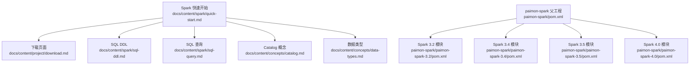
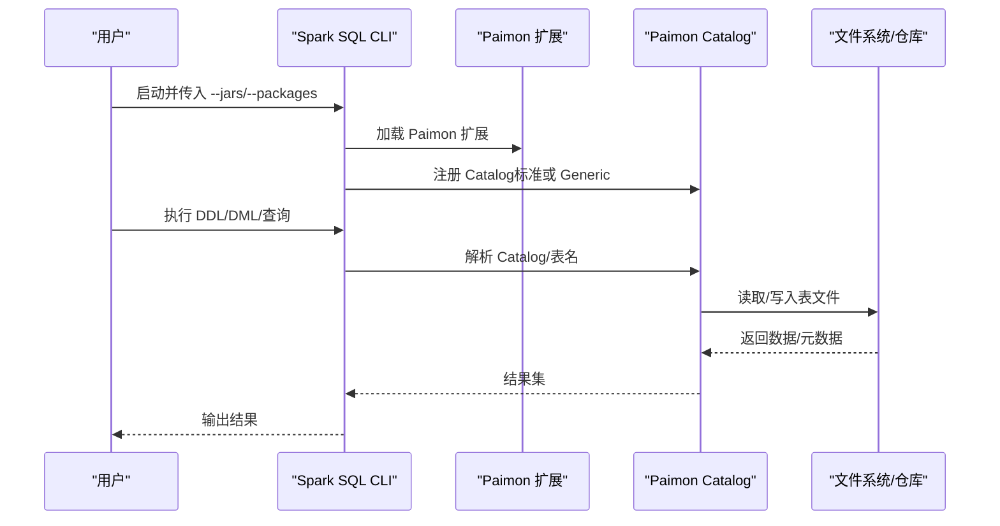
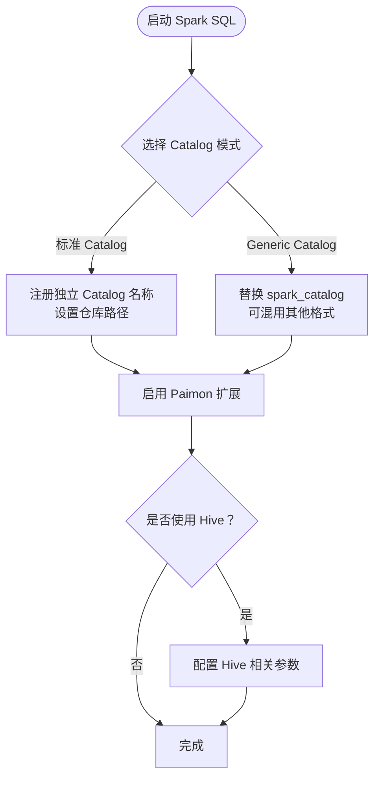
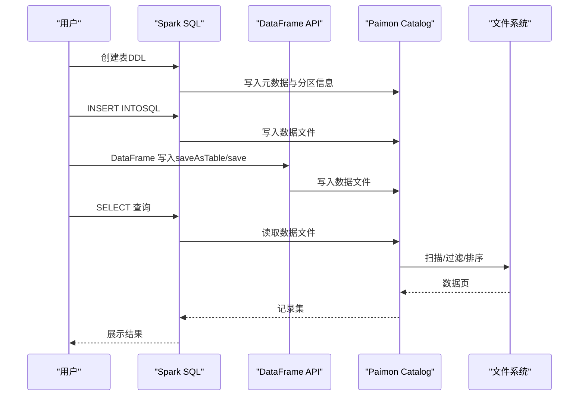
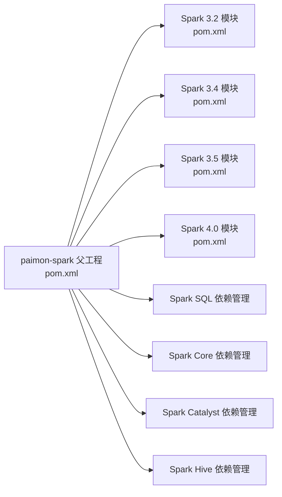

# 快速开始

<cite>
**本文引用的文件**   
- [docs/content/spark/quick-start.md](file://docs/content/spark/quick-start.md)
- [docs/content/project/download.md](file://docs/content/project/download.md)
- [docs/content/spark/sql-ddl.md](file://docs/content/spark/sql-ddl.md)
- [docs/content/spark/sql-query.md](file://docs/content/spark/sql-query.md)
- [docs/content/concepts/catalog.md](file://docs/content/concepts/catalog.md)
- [docs/content/concepts/data-types.md](file://docs/content/concepts/data-types.md)
- [paimon-spark/pom.xml](file://paimon-spark/pom.xml)
- [paimon-spark/paimon-spark-3.2/pom.xml](file://paimon-spark/paimon-spark-3.2/pom.xml)
- [paimon-spark/paimon-spark-3.4/pom.xml](file://paimon-spark/paimon-spark-3.4/pom.xml)
- [paimon-spark/paimon-spark-3.5/pom.xml](file://paimon-spark/paimon-spark-3.5/pom.xml)
- [paimon-spark/paimon-spark-4.0/pom.xml](file://paimon-spark/paimon-spark-4.0/pom.xml)
- [paimon-spark/paimon-spark-common/src/main/java/org/apache/paimon/spark/SparkGenericCatalog.java](file://paimon-spark/paimon-spark-common/src/main/java/org/apache/paimon/spark/SparkGenericCatalog.java)
- [paimon-spark/paimon-spark-common/src/main/scala/org/apache/paimon/spark/catalog/Catalogs.scala](file://paimon-spark/paimon-spark-common/src/main/scala/org/apache/paimon/spark/catalog/Catalogs.scala)
- [paimon-spark/paimon-spark-common/src/main/java/org/apache/paimon/spark/SparkCatalogOptions.java](file://paimon-spark/paimon-spark-common/src/main/java/org/apache/paimon/spark/SparkCatalogOptions.java)
- [paimon-spark/paimon-spark-common/src/main/java/org/apache/paimon/spark/AbstractSparkInternalRow.java](file://paimon-spark/paimon-spark-common/src/main/java/org/apache/paimon/spark/AbstractSparkInternalRow.java)
- [paimon-spark/paimon-spark-common/src/main/scala/org/apache/spark/sql/execution/SparkFormatTable.scala](file://paimon-spark/paimon-spark-common/src/main/scala/org/apache/spark/sql/execution/SparkFormatTable.scala)
- [paimon-spark/paimon-spark-ut/src/test/java/org/apache/paimon/spark/SparkCatalogWithHiveTest.java](file://paimon-spark/paimon-spark-ut/src/test/java/org/apache/paimon/spark/SparkCatalogWithHiveTest.java)
</cite>

## 目录
1. [简介](#简介)
2. [项目结构](#项目结构)
3. [核心组件](#核心组件)
4. [架构总览](#架构总览)
5. [详细组件分析](#详细组件分析)
6. [依赖分析](#依赖分析)
7. [性能考虑](#性能考虑)
8. [故障排除指南](#故障排除指南)
9. [结论](#结论)
10. [附录](#附录)

## 简介
本“快速开始”面向首次使用 Apache Paimon 的 Spark 用户，目标是帮助你在最短时间内完成环境准备、JAR 下载与构建、Spark SQL 命令行配置、Paimon Catalog（标准 Catalog 与 Generic Catalog）的两种接入方式、创建/写入/查询表的完整流程，并理解 Spark 类型到 Paimon 类型的映射关系。同时提供常见问题与故障排除建议，确保你能顺利落地实践。

## 项目结构
围绕 Spark 快速开始，以下文档与模块最为关键：
- 文档侧：Spark 快速开始、下载页面、SQL DDL、SQL 查询、Catalog 概念、数据类型
- 模块侧：paimon-spark 父工程及各版本子模块（3.2/3.4/3.5/4.0），通用公共模块与测试模块

图表来源
- [docs/content/spark/quick-start.md:1-375](file://docs/content/spark/quick-start.md#L1-L375)
- [docs/content/project/download.md:1-148](file://docs/content/project/download.md#L1-L148)
- [docs/content/spark/sql-ddl.md:1-370](file://docs/content/spark/sql-ddl.md#L1-L370)
- [docs/content/spark/sql-query.md:1-170](file://docs/content/spark/sql-query.md#L1-L170)
- [docs/content/concepts/catalog.md:1-97](file://docs/content/concepts/catalog.md#L1-L97)
- [docs/content/concepts/data-types.md:1-194](file://docs/content/concepts/data-types.md#L1-L194)
- [paimon-spark/pom.xml:1-389](file://paimon-spark/pom.xml#L1-L389)
- [paimon-spark/paimon-spark-3.2/pom.xml:1-150](file://paimon-spark/paimon-spark-3.2/pom.xml#L1-L150)
- [paimon-spark/paimon-spark-3.4/pom.xml:1-150](file://paimon-spark/paimon-spark-3.4/pom.xml#L1-L150)
- [paimon-spark/paimon-spark-3.5/pom.xml:1-150](file://paimon-spark/paimon-spark-3.5/pom.xml#L1-L150)
- [paimon-spark/paimon-spark-4.0/pom.xml:1-162](file://paimon-spark/paimon-spark-4.0/pom.xml#L1-L162)

章节来源
- [docs/content/spark/quick-start.md:1-375](file://docs/content/spark/quick-start.md#L1-L375)
- [paimon-spark/pom.xml:1-389](file://paimon-spark/pom.xml#L1-L389)

## 核心组件
- Spark 版本与兼容性
  - Spark 4.x（含 4.0）：预置打包，Java 17，Scala 2.13
  - Spark 3.x（含 3.5、3.4、3.3、3.2）：预置打包，Java 8，Scala 2.12/2.13
  - 可通过 Maven 构建对应版本的捆绑 JAR，或从中央仓库/快照仓库下载
- Spark SQL 命令行配置
  - 使用 --jars 或 --packages 引入 Paimon JAR
  - 注册 Paimon Catalog 并启用扩展
- Catalog 两种模式
  - 标准 Catalog：独立 Catalog 名称，表文件存储在指定仓库路径
  - Generic Catalog：替换默认 spark_catalog，可混用 Paimon 与其他格式表
- 表操作
  - 创建表（主键、分区等）
  - 写入数据（SQL/DataFrame）
  - 查询数据（基础查询、时间旅行、增量查询）
- Spark 类型到 Paimon 类型映射
  - 列出所有支持的映射关系，含原子类型标记与版本差异提示

章节来源
- [docs/content/spark/quick-start.md:29-103](file://docs/content/spark/quick-start.md#L29-L103)
- [docs/content/spark/quick-start.md:104-153](file://docs/content/spark/quick-start.md#L104-L153)
- [docs/content/spark/quick-start.md:155-255](file://docs/content/spark/quick-start.md#L155-L255)
- [docs/content/spark/quick-start.md:257-375](file://docs/content/spark/quick-start.md#L257-L375)

## 架构总览
下图展示从 Spark SQL 启动到执行 Paimon 表读写的整体流程，以及 Catalog 的两种接入方式。

图表来源
- [docs/content/spark/quick-start.md:88-153](file://docs/content/spark/quick-start.md#L88-L153)
- [docs/content/spark/sql-ddl.md:47-87](file://docs/content/spark/sql-ddl.md#L47-L87)
- [paimon-spark/pom.xml:64-135](file://paimon-spark/pom.xml#L64-L135)

## 详细组件分析

### 组件一：Spark 版本与 JAR 获取
- 官方预置 JAR
  - Spark 4.0：仅提供 Scala 2.13 版本
  - Spark 3.5/3.4/3.3/3.2：同时提供 Scala 2.12 与 2.13 版本
  - 可从稳定/快照仓库下载
- 源码构建
  - 支持按模块构建（如 paimon-spark-3.5、paimon-spark-4.0），并可选择 Scala 与 Spark 版本特性 Profile
- 注意事项
  - 请根据你的 Spark 版本选择匹配的 JAR（Scala/Java 兼容性）

章节来源
- [docs/content/spark/quick-start.md:31-76](file://docs/content/spark/quick-start.md#L31-L76)
- [docs/content/project/download.md:35-81](file://docs/content/project/download.md#L35-L81)
- [paimon-spark/pom.xml:64-135](file://paimon-spark/pom.xml#L64-L135)

### 组件二：Spark SQL 命令行配置
- 方式一：--jars
  - 在启动时通过 --jars 指定本地 Paimon JAR 路径
- 方式二：--packages
  - 通过 Maven 坐标远程拉取对应版本 JAR
- 方式三：复制到 Spark 安装目录 jars 目录
- 关键配置项
  - 注册 Catalog 实现类与扩展类
  - 设置仓库路径（标准 Catalog）或替换默认 Catalog（Generic Catalog）

章节来源
- [docs/content/spark/quick-start.md:88-103](file://docs/content/spark/quick-start.md#L88-L103)
- [docs/content/spark/quick-start.md:104-153](file://docs/content/spark/quick-start.md#L104-L153)

### 组件三：Paimon Catalog（标准 Catalog 与 Generic Catalog）
- 标准 Catalog
  - 以独立 Catalog 名称注册，表文件存储于指定仓库路径
  - 适合纯 Paimon 场景，隔离性强
- Generic Catalog
  - 替换默认 spark_catalog，可混用 Paimon 与其他格式（如 CSV、Parquet、Hive）
  - 适用于需要与现有 Spark 生态共存的场景
- 配置要点
  - 标准 Catalog：设置实现类、仓库路径、扩展类
  - Generic Catalog：设置实现类、可选 Hive 配置、默认数据库处理
- Hive 兼容性
  - 在 Generic Catalog 下，可通过 Hive 配置访问 Hive 表；若 Hive 配置无效，会抛出异常

图表来源
- [docs/content/spark/quick-start.md:104-153](file://docs/content/spark/quick-start.md#L104-L153)
- [docs/content/spark/sql-ddl.md:47-87](file://docs/content/spark/sql-ddl.md#L47-L87)
- [paimon-spark/paimon-spark-common/src/main/java/org/apache/paimon/spark/SparkGenericCatalog.java:321-355](file://paimon-spark/paimon-spark-common/src/main/java/org/apache/paimon/spark/SparkGenericCatalog.java#L321-L355)
- [paimon-spark/paimon-spark-ut/src/test/java/org/apache/paimon/spark/SparkCatalogWithHiveTest.java:117-130](file://paimon-spark/paimon-spark-ut/src/test/java/org/apache/paimon/spark/SparkCatalogWithHiveTest.java#L117-L130)

章节来源
- [docs/content/spark/quick-start.md:104-153](file://docs/content/spark/quick-start.md#L104-L153)
- [docs/content/spark/sql-ddl.md:47-87](file://docs/content/spark/sql-ddl.md#L47-L87)
- [paimon-spark/paimon-spark-common/src/main/java/org/apache/paimon/spark/SparkGenericCatalog.java:321-355](file://paimon-spark/paimon-spark-common/src/main/java/org/apache/paimon/spark/SparkGenericCatalog.java#L321-L355)
- [paimon-spark/paimon-spark-ut/src/test/java/org/apache/paimon/spark/SparkCatalogWithHiveTest.java:117-130](file://paimon-spark/paimon-spark-ut/src/test/java/org/apache/paimon/spark/SparkCatalogWithHiveTest.java#L117-L130)

### 组件四：创建表、写入数据、查询数据
- 创建表
  - 标准 Catalog：使用 Catalog 名称限定库/表
  - Generic Catalog：使用 USING paimon 或直接写入
- 写入数据
  - SQL：INSERT INTO
  - DataFrame：format("paimon") + saveAsTable/save
- 查询数据
  - SQL：SELECT
  - DataFrame：read.format("paimon").table(...).show()

图表来源
- [docs/content/spark/quick-start.md:155-255](file://docs/content/spark/quick-start.md#L155-L255)
- [docs/content/spark/sql-ddl.md:169-286](file://docs/content/spark/sql-ddl.md#L169-L286)
- [docs/content/spark/sql-query.md:31-170](file://docs/content/spark/sql-query.md#L31-L170)

章节来源
- [docs/content/spark/quick-start.md:155-255](file://docs/content/spark/quick-start.md#L155-L255)
- [docs/content/spark/sql-ddl.md:169-286](file://docs/content/spark/sql-ddl.md#L169-L286)
- [docs/content/spark/sql-query.md:31-170](file://docs/content/spark/sql-query.md#L31-L170)

### 组件五：Spark 类型转换表
- 映射范围覆盖基本类型、字符串、日期时间、数组/映射/结构体、十进制、二进制、变体（Spark 4.0+）
- 原子类型标记用于区分是否为标量类型
- 版本差异提示：Spark 3.3 及以下对 LocalZonedTimestamp 的解析存在时区偏移问题，建议在 Spark 3.4+ 使用

章节来源
- [docs/content/spark/quick-start.md:257-375](file://docs/content/spark/quick-start.md#L257-L375)
- [docs/content/concepts/data-types.md:31-194](file://docs/content/concepts/data-types.md#L31-L194)
- [paimon-spark/paimon-spark-common/src/main/java/org/apache/paimon/spark/AbstractSparkInternalRow.java:183-223](file://paimon-spark/paimon-spark-common/src/main/java/org/apache/paimon/spark/AbstractSparkInternalRow.java#L183-L223)

## 依赖分析
- Spark 依赖管理
  - 父工程统一管理 Spark SQL、Core、Catalyst、Hive 等依赖，并进行日志与 protobuf 等冲突排除
- 各版本模块
  - 3.2/3.4/3.5/4.0 模块分别声明对应 Spark 版本号，并通过 shade 插件合并公共模块
- 测试依赖
  - 各模块均引入对应的测试分类依赖，保证单元测试与集成测试的完整性

图表来源
- [paimon-spark/pom.xml:64-135](file://paimon-spark/pom.xml#L64-L135)
- [paimon-spark/paimon-spark-3.2/pom.xml:38-72](file://paimon-spark/paimon-spark-3.2/pom.xml#L38-L72)
- [paimon-spark/paimon-spark-3.4/pom.xml:38-72](file://paimon-spark/paimon-spark-3.4/pom.xml#L38-L72)
- [paimon-spark/paimon-spark-3.5/pom.xml:38-72](file://paimon-spark/paimon-spark-3.5/pom.xml#L38-L72)
- [paimon-spark/paimon-spark-4.0/pom.xml:38-78](file://paimon-spark/paimon-spark-4.0/pom.xml#L38-L78)

章节来源
- [paimon-spark/pom.xml:64-135](file://paimon-spark/pom.xml#L64-L135)
- [paimon-spark/paimon-spark-3.2/pom.xml:38-72](file://paimon-spark/paimon-spark-3.2/pom.xml#L38-L72)
- [paimon-spark/paimon-spark-3.4/pom.xml:38-72](file://paimon-spark/paimon-spark-3.4/pom.xml#L38-L72)
- [paimon-spark/paimon-spark-3.5/pom.xml:38-72](file://paimon-spark/paimon-spark-3.5/pom.xml#L38-L72)
- [paimon-spark/paimon-spark-4.0/pom.xml:38-78](file://paimon-spark/paimon-spark-4.0/pom.xml#L38-L78)

## 性能考虑
- 读取优化
  - 尽量在查询中包含分区与主键过滤，利用 Paimon 的数据跳过能力加速点查与范围查
  - 左前缀匹配复合主键可显著提升过滤效率
- 增量查询
  - 使用内置的增量查询函数，避免扫描全量数据
- 时间旅行
  - 支持基于快照 ID、标签或时间戳的时间旅行读取，便于回溯历史数据

章节来源
- [docs/content/spark/sql-query.md:118-170](file://docs/content/spark/sql-query.md#L118-L170)

## 故障排除指南
- 无法加载 Paimon JAR
  - 检查 --jars 路径或 --packages 坐标是否正确
  - 若使用本地 JAR，请确认路径可被 Spark 进程访问
- Generic Catalog 下 Hive 访问失败
  - 确认 hive-conf-dir 指向有效路径，否则会抛出文件未找到异常
- Catalog 默认数据库行为
  - Generic Catalog 在某些 Spark 版本不支持自定义默认数据库，会回退到会话默认数据库并给出警告
- Catalog 选项提取
  - 通过 Catalogs 工具方法从 SQLConf 中提取以 spark.sql.catalog.<name>. 开头的配置项
- 读取 LocalZonedTimestamp 时区偏移
  - Spark 3.3 及以下版本对 LocalZonedTimestamp 的解析存在时区偏移问题，建议升级至 3.4+

章节来源
- [paimon-spark/paimon-spark-ut/src/test/java/org/apache/paimon/spark/SparkCatalogWithHiveTest.java:117-130](file://paimon-spark/paimon-spark-ut/src/test/java/org/apache/paimon/spark/SparkCatalogWithHiveTest.java#L117-L130)
- [paimon-spark/paimon-spark-common/src/main/java/org/apache/paimon/spark/SparkGenericCatalog.java:321-355](file://paimon-spark/paimon-spark-common/src/main/java/org/apache/paimon/spark/SparkGenericCatalog.java#L321-L355)
- [paimon-spark/paimon-spark-common/src/main/scala/org/apache/paimon/spark/catalog/Catalogs.scala:41-51](file://paimon-spark/paimon-spark-common/src/main/scala/org/apache/paimon/spark/catalog/Catalogs.scala#L41-L51)
- [docs/content/spark/quick-start.md:369-375](file://docs/content/spark/quick-start.md#L369-L375)

## 结论
通过本“快速开始”，你已掌握：
- Spark 3.x/4.x 的版本与 JAR 兼容性
- 两种 Catalog 接入方式及其适用场景
- 从下载/构建 JAR 到命令行配置、创建/写入/查询表的完整流程
- Spark 类型到 Paimon 类型的映射关系与版本差异
- 常见问题与故障排除方法

建议在生产环境中结合性能优化策略（分区/主键过滤、增量查询、时间旅行）进一步提升查询与写入效率。

## 附录
- 相关配置项与选项
  - Catalog 选项提取：以 spark.sql.catalog.<name>. 开头的配置项
  - Generic Catalog 选项：是否创建底层会话 Catalog
- 文件索引与格式表
  - SparkFormatTable 提供了针对格式表的文件索引创建逻辑，支持分区 Schema 与通配路径

章节来源
- [paimon-spark/paimon-spark-common/src/main/scala/org/apache/paimon/spark/catalog/Catalogs.scala:41-51](file://paimon-spark/paimon-spark-common/src/main/scala/org/apache/paimon/spark/catalog/Catalogs.scala#L41-L51)
- [paimon-spark/paimon-spark-common/src/main/java/org/apache/paimon/spark/SparkCatalogOptions.java:27-33](file://paimon-spark/paimon-spark-common/src/main/java/org/apache/paimon/spark/SparkCatalogOptions.java#L27-L33)
- [paimon-spark/paimon-spark-common/src/main/scala/org/apache/spark/sql/execution/SparkFormatTable.scala:47-61](file://paimon-spark/paimon-spark-common/src/main/scala/org/apache/spark/sql/execution/SparkFormatTable.scala#L47-L61)