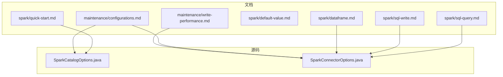
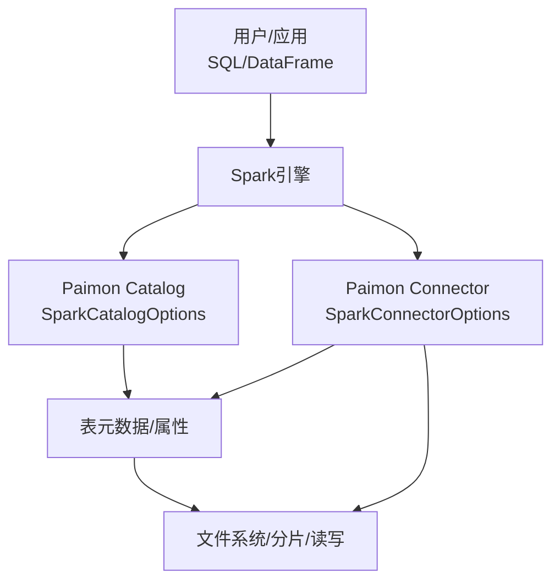
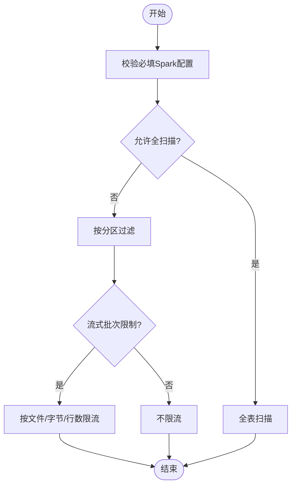
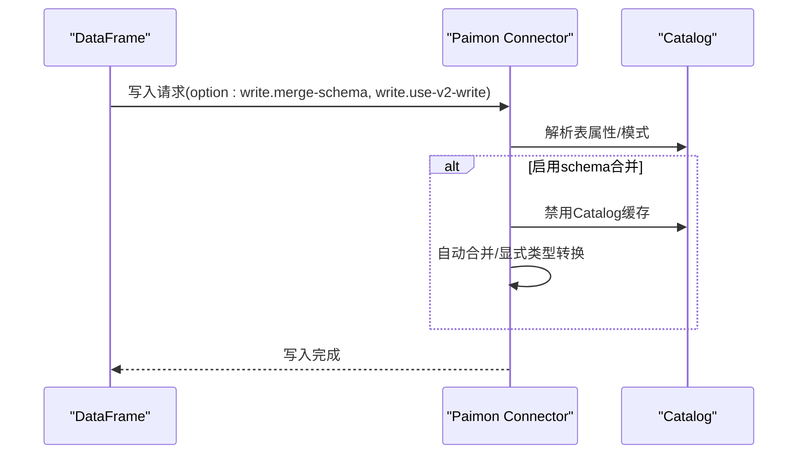
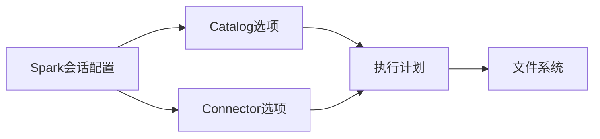

# 配置和优化

<cite>
**本文引用的文件**
- [sql-query.md](file://docs/content/spark/sql-query.md)
- [sql-write.md](file://docs/content/spark/sql-write.md)
- [dataframe.md](file://docs/content/spark/dataframe.md)
- [configurations.md](file://docs/content/maintenance/configurations.md)
- [default-value.md](file://docs/content/spark/default-value.md)
- [quick-start.md](file://docs/content/spark/quick-start.md)
- [SparkCatalogOptions.java](file://paimon-spark/paimon-spark-common/src/main/java/org/apache/paimon/spark/SparkCatalogOptions.java)
- [SparkConnectorOptions.java](file://paimon-spark/paimon-spark-common/src/main/java/org/apache/paimon/spark/SparkConnectorOptions.java)
- [write-performance.md](file://docs/content/maintenance/write-performance.md)
</cite>

## 目录
1. [简介](#简介)
2. [项目结构](#项目结构)
3. [核心组件](#核心组件)
4. [架构总览](#架构总览)
5. [详细组件分析](#详细组件分析)
6. [依赖分析](#依赖分析)
7. [性能考虑](#性能考虑)
8. [故障排查指南](#故障排查指南)
9. [结论](#结论)
10. [附录](#附录)

## 简介
本技术指南面向在Apache Spark中使用Paimon的工程师与数据平台运维人员，系统梳理Paimon Spark集成的配置体系与优化策略。内容涵盖：
- Catalog配置、读取选项、写入选项与默认值覆盖机制
- 通过SQL与DataFrame API设置表属性与运行时参数
- 性能优化建议：并行度、分区策略、缓存与内存管理
- Spark特定参数（shuffle、广播、本地性）对Paimon的影响
- 不同工作负载（批处理、流式、交互式）的调优策略
- 配置验证、性能监控与常见问题排查

## 项目结构
围绕Spark配置与优化，相关文档与源码主要分布在以下位置：
- 文档层：docs/content/spark 与 docs/content/maintenance
- 源码层：paimon-spark/paimon-spark-common 中的配置常量定义

**图表来源**
- [sql-query.md:1-170](file://docs/content/spark/sql-query.md#L1-L170)
- [sql-write.md:1-299](file://docs/content/spark/sql-write.md#L1-L299)
- [dataframe.md:1-122](file://docs/content/spark/dataframe.md#L1-L122)
- [default-value.md:1-102](file://docs/content/spark/default-value.md#L1-L102)
- [quick-start.md:1-375](file://docs/content/spark/quick-start.md#L1-L375)
- [configurations.md:1-92](file://docs/content/maintenance/configurations.md#L1-L92)
- [write-performance.md:1-164](file://docs/content/maintenance/write-performance.md#L1-L164)
- [SparkCatalogOptions.java:1-47](file://paimon-spark/paimon-spark-common/src/main/java/org/apache/paimon/spark/SparkCatalogOptions.java#L1-L47)
- [SparkConnectorOptions.java:1-110](file://paimon-spark/paimon-spark-common/src/main/java/org/apache/paimon/spark/SparkConnectorOptions.java#L1-L110)

**章节来源**
- [quick-start.md:1-375](file://docs/content/spark/quick-start.md#L1-L375)
- [configurations.md:1-92](file://docs/content/maintenance/configurations.md#L1-L92)

## 核心组件
- Spark Catalog配置项：用于控制Paimon Catalog行为（如是否创建底层会话Catalog、默认数据库、启用V1函数等）
- Spark Connector配置项：用于控制读写行为（如schema合并、触发限流、变更日志读取、允许全表扫描等）

上述配置项在源码中以ConfigOption形式定义，支持在Spark会话或表属性中设置，并影响Paimon在Spark中的读写路径。

**章节来源**
- [SparkCatalogOptions.java:27-46](file://paimon-spark/paimon-spark-common/src/main/java/org/apache/paimon/spark/SparkCatalogOptions.java#L27-L46)
- [SparkConnectorOptions.java:28-109](file://paimon-spark/paimon-spark-common/src/main/java/org/apache/paimon/spark/SparkConnectorOptions.java#L28-L109)

## 架构总览
下图展示Paimon在Spark中的配置与执行关系：用户通过SQL或DataFrame API发起读写请求；Paimon根据Catalog与Connector配置解析表属性、选择读写策略，并驱动底层文件存储。

**图表来源**
- [quick-start.md:104-153](file://docs/content/spark/quick-start.md#L104-L153)
- [SparkCatalogOptions.java:27-46](file://paimon-spark/paimon-spark-common/src/main/java/org/apache/paimon/spark/SparkCatalogOptions.java#L27-L46)
- [SparkConnectorOptions.java:28-109](file://paimon-spark/paimon-spark-common/src/main/java/org/apache/paimon/spark/SparkConnectorOptions.java#L28-L109)

## 详细组件分析

### Catalog配置（SparkCatalogOptions）
- 关键项
  - 创建底层会话Catalog开关
  - 默认数据库名称
  - 启用V1函数开关
- 设置方式
  - 在Spark会话配置中以“spark.sql.catalog.<name>.<key>”形式设置
  - 通过SQL切换到Paimon Catalog后，Catalog行为由上述键控制
- 默认值与覆盖
  - 默认值在源码中定义，可通过会话配置覆盖
  - 若使用Generic Catalog替换默认catalog，需确保Hive相关配置正确传递

**章节来源**
- [SparkCatalogOptions.java:28-39](file://paimon-spark/paimon-spark-common/src/main/java/org/apache/paimon/spark/SparkCatalogOptions.java#L28-L39)
- [quick-start.md:104-153](file://docs/content/spark/quick-start.md#L104-L153)

### 读取选项（SparkConnectorOptions）
- 关键项
  - 必填Spark配置校验开关
  - 变更日志读取开关
  - 允许分区表全扫描开关
  - 流式读取批次限制（最大文件数、字节数、行数、最小行数、最大延迟）
  - 基于裁剪列的分片目标大小调整开关
- 设置方式
  - DataFrame API通过.option(key, value)传入
  - SQL中通过SET或动态表提示设置
- 默认值与覆盖
  - 多数为无默认值或布尔默认值，可按需开启/关闭
  - 流式读取限流参数适合小批量持续消费场景

**图表来源**
- [SparkConnectorOptions.java:28-109](file://paimon-spark/paimon-spark-common/src/main/java/org/apache/paimon/spark/SparkConnectorOptions.java#L28-L109)

**章节来源**
- [SparkConnectorOptions.java:88-109](file://paimon-spark/paimon-spark-common/src/main/java/org/apache/paimon/spark/SparkConnectorOptions.java#L88-L109)
- [dataframe.md:114-122](file://docs/content/spark/dataframe.md#L114-L122)

### 写入选项（SparkConnectorOptions）
- 关键项
  - 写入schema自动合并开关
  - 显式类型转换开关
  - 使用V2写入开关
- 设置方式
  - DataFrame API通过.option(key, value)传入
  - SQL中通过SET或动态表提示设置
- 默认值与覆盖
  - schema合并默认关闭，启用后需禁用Catalog缓存以避免模式不一致
  - V2写入当前不支持部分桶模式与流式写能力

**图表来源**
- [SparkConnectorOptions.java:35-54](file://paimon-spark/paimon-spark-common/src/main/java/org/apache/paimon/spark/SparkConnectorOptions.java#L35-L54)
- [sql-write.md:226-299](file://docs/content/spark/sql-write.md#L226-L299)

**章节来源**
- [SparkConnectorOptions.java:35-54](file://paimon-spark/paimon-spark-common/src/main/java/org/apache/paimon/spark/SparkConnectorOptions.java#L35-L54)
- [sql-write.md:226-299](file://docs/content/spark/sql-write.md#L226-L299)

### 表属性与默认值（SQL与DataFrame）
- 表属性设置
  - SQL：通过CREATE/ALTER TABLE的TBLPROPERTIES设置
  - DataFrame：通过.saveAsTable/.save时的.option(key, value)传入
- 默认值
  - 支持为复杂类型设置默认值
  - 修改默认值不影响历史数据，后续写入采用新默认值
- 覆盖机制
  - 会话级SET优先级高于表属性
  - DataFrame API的option覆盖表属性

**章节来源**
- [default-value.md:32-102](file://docs/content/spark/default-value.md#L32-L102)
- [dataframe.md:31-90](file://docs/content/spark/dataframe.md#L31-L90)

### 查询优化要点（分区/主键过滤、谓词下推）
- 推荐在查询中指定分区与主键过滤条件，利用Paimon的数据跳过能力
- 支持加速的数据跳过谓词包括等值、范围、IN、前缀LIKE、IS NULL等
- 复合主键查询应尽量形成左前缀匹配，提升点查与范围查询性能

**章节来源**
- [sql-query.md:118-170](file://docs/content/spark/sql-query.md#L118-L170)

## 依赖分析
- 组件耦合
  - Spark Catalog与Connector共同决定Paimon在Spark中的行为
  - 读取/写入路径受Catalog与Connector配置双重影响
- 外部依赖
  - Spark版本兼容性（3.2–4.0），需选择对应Jar包
  - 文件系统（HDFS/Hive等）环境变量与配置需正确传递至Spark

**图表来源**
- [quick-start.md:31-61](file://docs/content/spark/quick-start.md#L31-L61)
- [SparkCatalogOptions.java:27-46](file://paimon-spark/paimon-spark-common/src/main/java/org/apache/paimon/spark/SparkCatalogOptions.java#L27-L46)
- [SparkConnectorOptions.java:28-109](file://paimon-spark/paimon-spark-common/src/main/java/org/apache/paimon/spark/SparkConnectorOptions.java#L28-L109)

**章节来源**
- [quick-start.md:31-61](file://docs/content/spark/quick-start.md#L31-L61)

## 性能考虑
- 并行度与分区
  - 写入并行度建议不超过桶数量，优先与桶数相等
  - 读取时按分区过滤与主键过滤可显著减少扫描数据量
- 分片与流式读取
  - 使用流式读取批次限制参数（文件数/字节数/行数/延迟）平衡吞吐与延迟
  - 开启基于裁剪列的分片目标大小调整，降低无关列IO开销
- 缓存与内存
  - schema合并功能需禁用Catalog缓存，避免模式不一致
  - 写入缓冲区大小、溢写策略、压缩级别等可按工作负载调优
- Spark特定参数
  - shuffle分区数、广播阈值、任务本地性等会影响Paimon读写阶段的网络与本地IO
  - 对于大表扫描与连接，适当提高本地性与广播阈值可改善性能

**章节来源**
- [SparkConnectorOptions.java:56-86](file://paimon-spark/paimon-spark-common/src/main/java/org/apache/paimon/spark/SparkConnectorOptions.java#L56-L86)
- [SparkConnectorOptions.java:102-109](file://paimon-spark/paimon-spark-common/src/main/java/org/apache/paimon/spark/SparkConnectorOptions.java#L102-L109)
- [sql-query.md:118-170](file://docs/content/spark/sql-query.md#L118-L170)
- [write-performance.md:46-164](file://docs/content/maintenance/write-performance.md#L46-L164)

## 故障排查指南
- Catalog相关
  - 使用Generic Catalog时，确认Hive配置已正确传递给Spark
  - 如出现模式不一致，检查是否启用了schema合并且未禁用Catalog缓存
- 读取相关
  - 分区表全扫描被拒绝：开启允许全扫描或添加分区过滤条件
  - 流式读取吞吐低：调整批次限制参数或增大触发延迟以提升聚合
- 写入相关
  - schema合并失败：确认显式类型转换开关与目标表缓存状态
  - V2写入回退：检查桶模式与是否启用流式写能力
- 性能问题
  - 读取慢：检查是否命中分区/主键过滤，确认统计信息与分片大小
  - 写入抖动：检查shuffle分区与本地性，必要时调整广播阈值

**章节来源**
- [quick-start.md:134-153](file://docs/content/spark/quick-start.md#L134-L153)
- [sql-write.md:226-299](file://docs/content/spark/sql-write.md#L226-L299)
- [SparkConnectorOptions.java:88-109](file://paimon-spark/paimon-spark-common/src/main/java/org/apache/paimon/spark/SparkConnectorOptions.java#L88-L109)

## 结论
- Paimon Spark配置以Catalog与Connector为核心，结合表属性与会话配置实现灵活的行为控制
- 通过合理的并行度、分区策略、分片与流式读取参数，以及Spark本地性与广播策略，可显著提升批处理、流式与交互式查询的性能
- 在生产环境中，建议禁用Catalog缓存配合schema合并，确保模式一致性；同时建立配置验证与性能监控流程，及时发现并解决问题

## 附录
- 配置清单与生成文档入口
  - 核心选项、Catalog选项、Spark Catalog/Connector选项、ORC/RocksDB选项等均在维护文档中生成展示

**章节来源**
- [configurations.md:29-92](file://docs/content/maintenance/configurations.md#L29-L92)