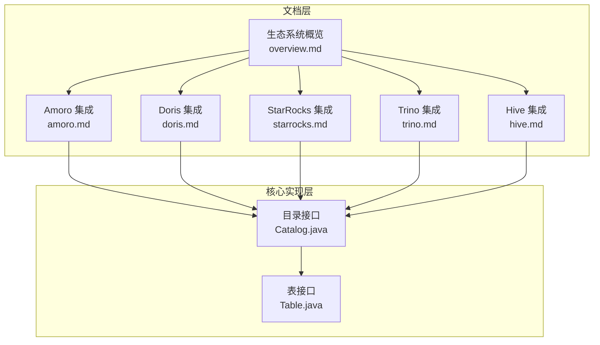
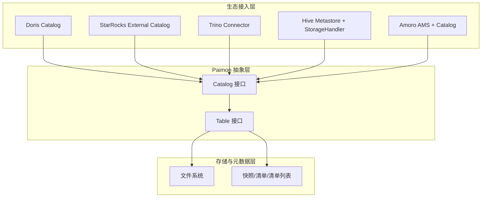
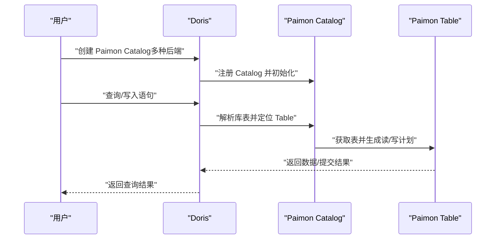
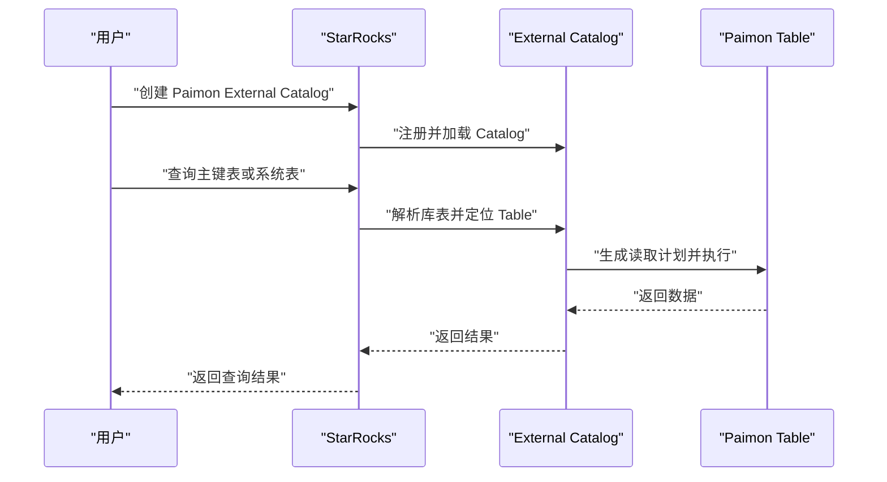
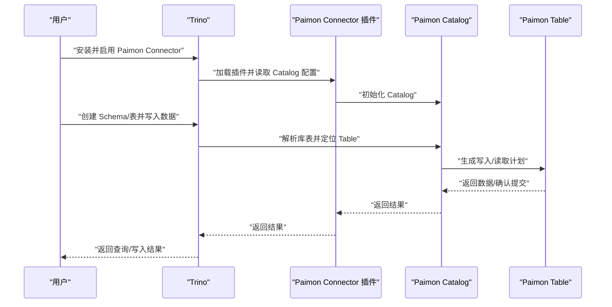
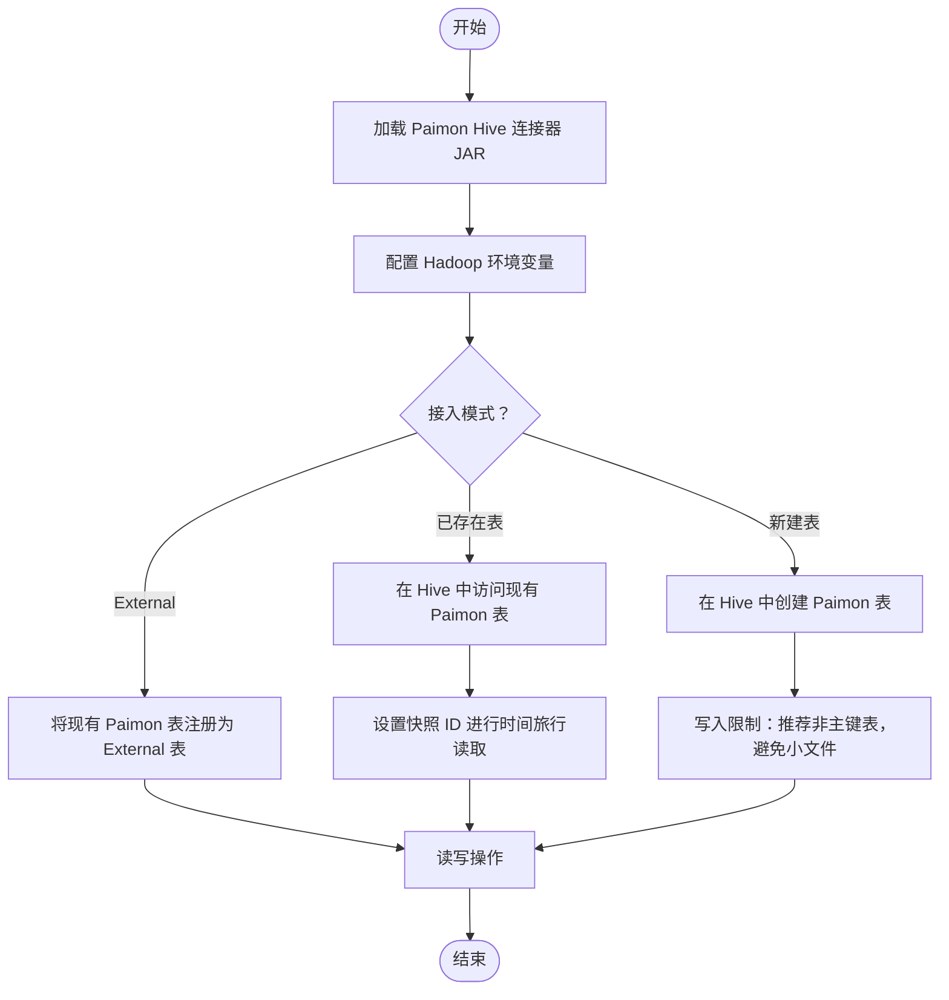
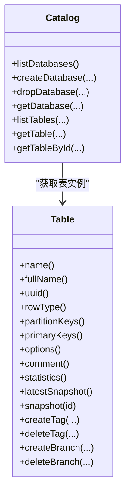

# 生态系统集成

<cite>
**本文引用的文件**
- [amoro.md](file://docs/content/ecosystem/amoro.md)
- [doris.md](file://docs/content/ecosystem/doris.md)
- [starrocks.md](file://docs/content/ecosystem/starrocks.md)
- [trino.md](file://docs/content/ecosystem/trino.md)
- [hive.md](file://docs/content/ecosystem/hive.md)
- [overview.md](file://docs/content/ecosystem/overview.md)
- [Catalog.java](file://paimon-core/src/main/java/org/apache/paimon/catalog/Catalog.java)
- [Table.java](file://paimon-core/src/main/java/org/apache/paimon/table/Table.java)
</cite>

## 目录
1. [简介](#简介)
2. [项目结构](#项目结构)
3. [核心组件](#核心组件)
4. [架构总览](#架构总览)
5. [详细组件分析](#详细组件分析)
6. [依赖关系分析](#依赖关系分析)
7. [性能考量](#性能考量)
8. [故障排除指南](#故障排除指南)
9. [结论](#结论)
10. [附录](#附录)

## 简介
本文件面向希望在多生态（Amoro、Doris、StarRocks、Trino、Hive）中使用 Apache Paimon 的工程师与数据平台团队，系统性梳理 Paimon 在各生态中的集成方式、能力边界、配置要点与最佳实践。文档同时给出架构视角下的数据流与控制流说明，并提供跨系统一致性与性能方面的建议。

## 项目结构
围绕“生态系统集成”的文档位于 docs/content/ecosystem 目录下，分别覆盖 Amoro、Doris、StarRocks、Trino、Hive 以及总体概览。核心实现层面，Paimon 的目录与表抽象由 paimon-core 提供，是各生态连接与交互的基础契约。

图表来源
- [overview.md](file://docs/content/ecosystem/overview.md)
- [amoro.md](file://docs/content/ecosystem/amoro.md)
- [doris.md](file://docs/content/ecosystem/doris.md)
- [starrocks.md](file://docs/content/ecosystem/starrocks.md)
- [trino.md](file://docs/content/ecosystem/trino.md)
- [hive.md](file://docs/content/ecosystem/hive.md)
- [Catalog.java](file://paimon-core/src/main/java/org/apache/paimon/catalog/Catalog.java)
- [Table.java](file://paimon-core/src/main/java/org/apache/paimon/table/Table.java)

章节来源
- [overview.md](file://docs/content/ecosystem/overview.md)
- [amoro.md](file://docs/content/ecosystem/amoro.md)
- [doris.md](file://docs/content/ecosystem/doris.md)
- [starrocks.md](file://docs/content/ecosystem/starrocks.md)
- [trino.md](file://docs/content/ecosystem/trino.md)
- [hive.md](file://docs/content/ecosystem/hive.md)
- [Catalog.java](file://paimon-core/src/main/java/org/apache/paimon/catalog/Catalog.java)
- [Table.java](file://paimon-core/src/main/java/org/apache/paimon/table/Table.java)

## 核心组件
- 目录接口（Catalog）
  - 负责数据库与表的元数据读写、分页列举、属性变更、系统表访问等。
  - 支持通过标识符获取表、按名称获取数据库、删除/修改数据库、分页列出对象等。
- 表接口（Table）
  - 抽象表的行类型、分区键、主键、选项、注释、统计信息等。
  - 提供读取构建器、写入构建器、快照管理（最新快照、指定快照、回滚）、标签与分支管理、向量检索与全文检索入口等。

这些接口是各生态（如 Doris、StarRocks、Trino、Hive）通过各自 Catalog/Connector 访问 Paimon 的统一契约。

章节来源
- [Catalog.java](file://paimon-core/src/main/java/org/apache/paimon/catalog/Catalog.java)
- [Table.java](file://paimon-core/src/main/java/org/apache/paimon/table/Table.java)

## 架构总览
从“生态接入—目录/表抽象—文件与快照”的角度，Paimon 在各生态中的集成遵循如下通用路径：生态侧通过自身 Catalog/Connector 将 Paimon 作为外部 Catalog 注册；随后以统一的 Catalog/表接口进行数据库/表操作、读写与时间旅行；底层由 Paimon 的文件系统与快照机制保障一致性与可恢复性。

图表来源
- [Catalog.java](file://paimon-core/src/main/java/org/apache/paimon/catalog/Catalog.java)
- [Table.java](file://paimon-core/src/main/java/org/apache/paimon/table/Table.java)
- [doris.md](file://docs/content/ecosystem/doris.md)
- [starrocks.md](file://docs/content/ecosystem/starrocks.md)
- [trino.md](file://docs/content/ecosystem/trino.md)
- [hive.md](file://docs/content/ecosystem/hive.md)
- [amoro.md](file://docs/content/ecosystem/amoro.md)

## 详细组件分析

### Amoro 集成
- 能力概述
  - Amoro 是基于开放数据湖格式的 Lakehouse 管理系统，提供统一目录服务与自优化能力，支持与 Flink、Spark、Trino 等计算引擎协同。
  - Paimon 与 Amoro 的结合体现在：共享表格式与存储类型，未来将支持自动优化策略协同。
- 关键点
  - 目录与存储类型兼容：Paimon 支持的目录（Hadoop、Hive、Glue、JDBC、Nessie 等）与存储（HDFS、S3、GCS、OSS 等）均可在 Amoro 中使用。
  - 与 AMS 的统一目录：Amoro AMS 提供统一目录服务，可与现有 HMS 兼容。
- 使用建议
  - 在 Amoro 中选择合适的目录与存储后端，结合 Paimon 的表格式与优化策略，获得更优的湖仓体验。

章节来源
- [amoro.md](file://docs/content/ecosystem/amoro.md)

### Doris 集成
- 版本与能力
  - 支持版本：Doris 2.0.6 及以上；类型映射覆盖基础与复杂类型。
- 配置与使用
  - 创建 Catalog：支持基于 HDFS、OSS、Hive Metastore、DLF（1.0/3.0）等多种后端。
  - 访问 Catalog：支持全限定名访问或切换 Catalog 后按库表访问。
  - 查询优化：利用 Paimon 主键表的读优化（原生 Parquet/ORC 读取基表、JNI 读取增量）与删除向量（Deletion Vectors）提升查询性能。
- 类型映射
  - 文档提供了 Doris 到 Paimon 的完整类型映射表，涵盖布尔、整数、浮点、字符串、日期时间、十进制、二进制及嵌套类型等。

图表来源
- [doris.md](file://docs/content/ecosystem/doris.md)
- [Catalog.java](file://paimon-core/src/main/java/org/apache/paimon/catalog/Catalog.java)
- [Table.java](file://paimon-core/src/main/java/org/apache/paimon/table/Table.java)

章节来源
- [doris.md](file://docs/content/ecosystem/doris.md)

### StarRocks 集成
- 版本与能力
  - 支持版本：推荐 3.2.6 及以上；可通过 External Catalog 注册 Paimon。
- 配置与使用
  - 创建 Catalog：通过 CREATE EXTERNAL CATALOG 指定目录类型与仓库路径。
  - 查询与系统表：支持对系统表（如读优化表、分区表信息）进行访问，以提升查询效率与可观测性。
- 类型映射
  - 文档提供了 StarRocks 到 Paimon 的类型映射表，覆盖布尔、整型、浮点、字符串、日期时间、十进制、变长二进制等。

图表来源
- [starrocks.md](file://docs/content/ecosystem/starrocks.md)
- [Catalog.java](file://paimon-core/src/main/java/org/apache/paimon/catalog/Catalog.java)
- [Table.java](file://paimon-core/src/main/java/org/apache/paimon/table/Table.java)

章节来源
- [starrocks.md](file://docs/content/ecosystem/starrocks.md)

### Trino 集成
- 版本与能力
  - 支持版本：Trino 440；共享 Trino 文件系统；支持时间旅行查询。
- 安装与配置
  - 下载/构建插件包，安装到 Trino 插件目录；配置文件系统（HDFS/Hadoop、OSS 等），必要时设置 Kerberos。
  - 通过 Catalog 属性（如仓库路径）挂载 Paimon。
- 使用流程
  - 创建 Schema 与表（含文件格式、主键、分区、桶等参数），支持插入与时间旅行读取。
- 类型映射
  - 文档提供了 Trino 到 Paimon 的类型映射表，覆盖基础与复杂类型。

图表来源
- [trino.md](file://docs/content/ecosystem/trino.md)
- [Catalog.java](file://paimon-core/src/main/java/org/apache/paimon/catalog/Catalog.java)
- [Table.java](file://paimon-core/src/main/java/org/apache/paimon/table/Table.java)

章节来源
- [trino.md](file://docs/content/ecosystem/trino.md)

### Hive 生态集成
- 版本与能力
  - 支持版本：Hive 3.1、2.3、2.2、2.1 及 CDH 2.1-cdh-6.3；读支持 MR/Tez，写支持 MR。
- 安装与配置
  - 下载对应版本的 Paimon Hive 连接器 JAR，放置于 Hive 的 auxlib 或使用 add jar 命令加载。
  - HDFS 环境需设置 HADOOP_HOME 或 HADOOP_CONF_DIR；可禁用默认 Hadoop 配置以优化 Split 大小。
- 使用方式
  - 访问已存在于 Hive Metastore 的 Paimon 表；或直接在 Hive 中创建 Paimon 表（通过 PaimonStorageHandler）；或以 External Table 方式指向已有 Paimon 表位置。
  - 支持时间旅行（通过设置扫描快照 ID）。
- 类型映射
  - 文档提供了 Hive 到 Paimon 的类型映射表，覆盖结构体、映射、数组、基础标量类型等。

图表来源
- [hive.md](file://docs/content/ecosystem/hive.md)

章节来源
- [hive.md](file://docs/content/ecosystem/hive.md)

### 概览与兼容矩阵
- 兼容矩阵
  - 文档提供了 Flink、Spark、Hive、Trino、Presto、StarRocks、Doris 等引擎在批量读写、创建/变更表、流写、时间旅行等方面的兼容性概览。
- 引擎推荐
  - 批处理：Spark Batch（推荐 3.5.8）、Flink Batch。
  - 流处理：Flink Streaming（推荐 1.17.2）、Spark Streaming（需接受 Mini-Batch）。
  - OLAP：StarRocks（推荐 3.2.6）、Doris（2.0.6+）、Trino/Presto。

章节来源
- [overview.md](file://docs/content/ecosystem/overview.md)

## 依赖关系分析
- 组件耦合
  - 各生态的 Catalog/Connector 通过统一的 Catalog/表接口与 Paimon 交互，降低与具体生态的耦合度。
  - 表接口提供读写、快照、标签、分支等能力，是生态侧实现查询优化与时间旅行的关键。
- 外部依赖
  - 文件系统（HDFS、S3、OSS、GCS 等）与 Metastore（HMS）是生态集成的重要外部依赖。
- 潜在风险
  - 不同生态对类型映射、时间旅行语法、写入限制存在差异，需在接入前明确约束。

图表来源
- [Catalog.java](file://paimon-core/src/main/java/org/apache/paimon/catalog/Catalog.java)
- [Table.java](file://paimon-core/src/main/java/org/apache/paimon/table/Table.java)

章节来源
- [Catalog.java](file://paimon-core/src/main/java/org/apache/paimon/catalog/Catalog.java)
- [Table.java](file://paimon-core/src/main/java/org/apache/paimon/table/Table.java)

## 性能考量
- 读优化
  - 主键表的读优化（基表原生格式 + 增量数据 JNI 读取）与删除向量（Deletion Vectors）可显著提升查询性能。
- 写入与文件组织
  - 避免在主键表上产生大量小文件（推荐非主键表写入），合理设置分区与桶策略。
- 时间旅行与历史查询
  - 通过快照/标签/分支实现可控的历史查询，但需关注快照数量与清理策略对性能的影响。
- 文件系统与网络
  - 对象存储（OSS/S3/GCS）与 HDFS 的配置、缓存与 Kerberos 权限会影响整体吞吐与延迟。

## 故障排除指南
- Hive
  - 使用 beeline 时需重启集群；MR/Tez 执行引擎读写能力不同；启用 CBO 可能导致某些谓词（如 struct 非空）结果异常，可临时关闭 CBO。
  - 将连接器 JAR 放置于 auxlib 或使用 add jar 加载；若使用 MR 并执行 join，可能遇到类加载异常，建议使用 auxlib。
- Trino
  - JDK 21 部署需添加 JVM 开放参数；Kerberos 需在属性中配置 principal/keytab，并确保 keytab 分发至所有节点。
  - 临时目录需安全且持久，避免被系统定期清理。
- Doris/StarRocks
  - 类型映射不一致会导致建表/查询失败，务必对照官方映射表进行字段设计。
  - 写入限制（如仅支持 INSERT INTO、不支持 INSERT OVERWRITE）需在作业中规避。
- Amoro
  - 与 AMS 的目录与 HMS 兼容性需提前验证；存储后端（HDFS/OSS/S3 等）配置正确性直接影响读写性能与稳定性。

章节来源
- [hive.md](file://docs/content/ecosystem/hive.md)
- [trino.md](file://docs/content/ecosystem/trino.md)
- [doris.md](file://docs/content/ecosystem/doris.md)
- [starrocks.md](file://docs/content/ecosystem/starrocks.md)
- [amoro.md](file://docs/content/ecosystem/amoro.md)

## 结论
Paimon 在多生态中的集成以统一的目录与表抽象为核心，通过各生态的 Catalog/Connector 实现对接。借助读优化、删除向量、时间旅行与系统表等能力，可在不同引擎中获得一致的数据体验。实际落地时，应重点关注版本兼容、类型映射、写入限制与文件系统配置，并结合性能与一致性需求制定最佳实践。

## 附录
- 快速参考
  - 各生态的 Catalog/Connector 安装与配置要点、SQL 示例与类型映射表详见对应章节。
- 最佳实践
  - 明确数据模型（主键/分区/桶），优先使用读优化与删除向量；严格控制写入路径，避免小文件风暴；合理规划标签/分支与快照保留策略；在对象存储场景下完善安全与权限配置。