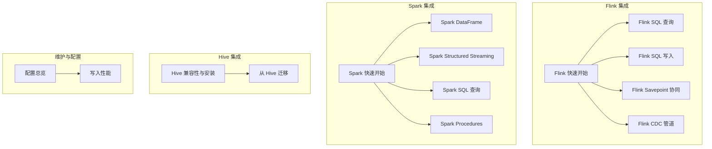
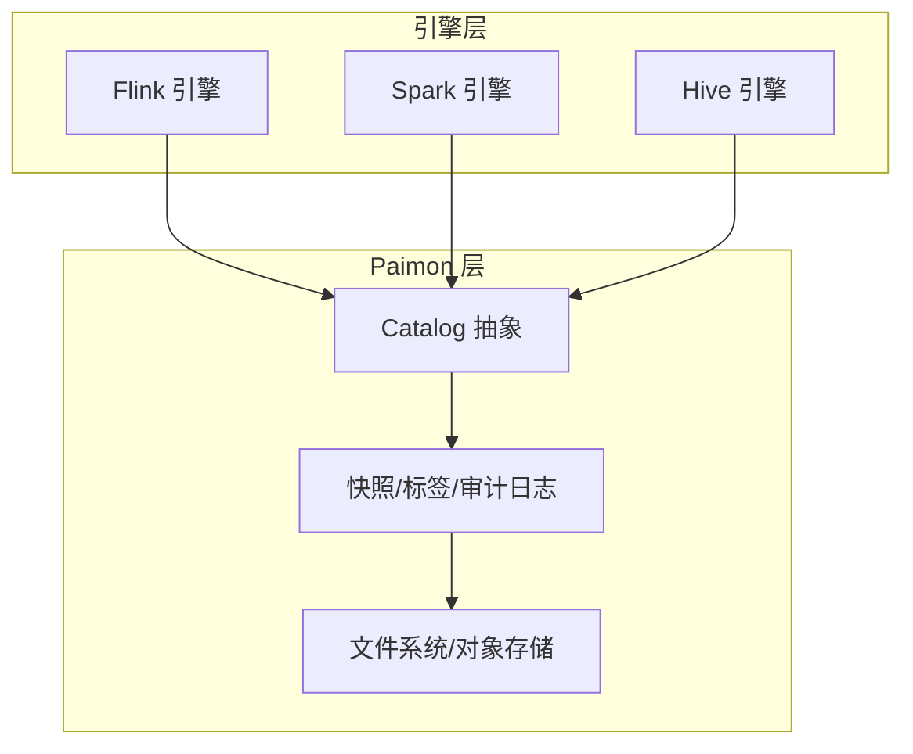
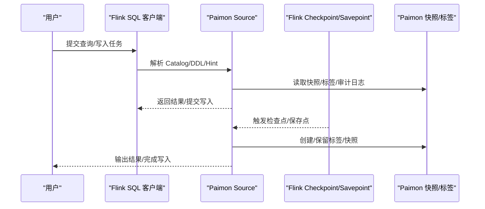
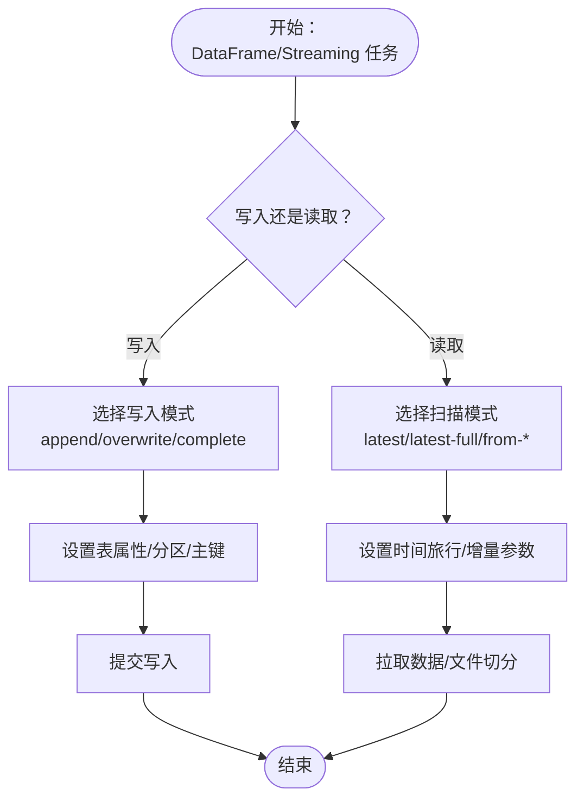
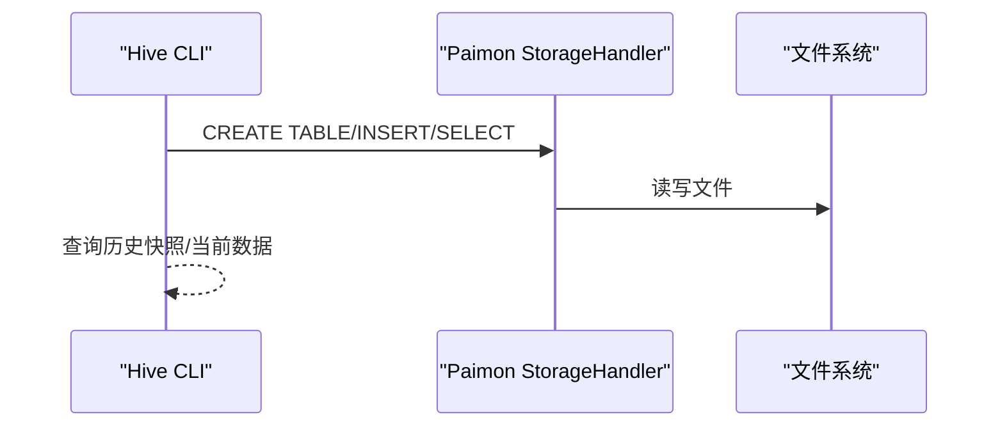
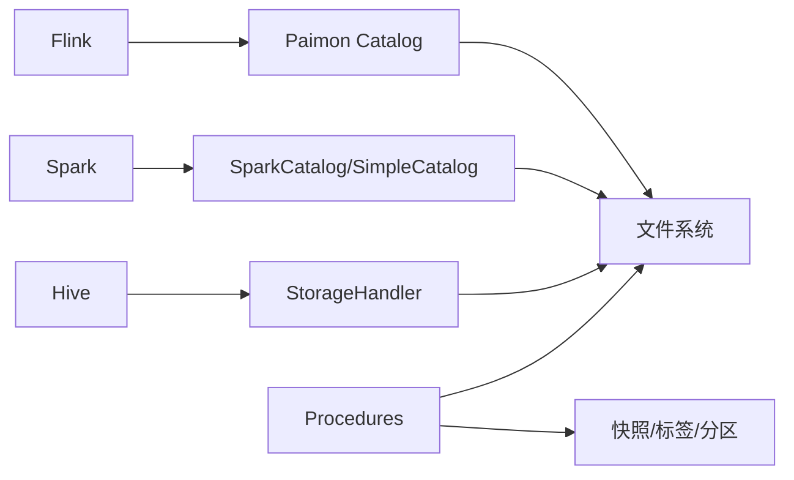

# 计算引擎集成

<cite>
**本文引用的文件**
- [docs/content/flink/quick-start.md](file://docs/content/flink/quick-start.md)
- [docs/content/flink/sql-query.md](file://docs/content/flink/sql-query.md)
- [docs/content/flink/sql-write.md](file://docs/content/flink/sql-write.md)
- [docs/content/flink/savepoint.md](file://docs/content/flink/savepoint.md)
- [docs/content/spark/quick-start.md](file://docs/content/spark/quick-start.md)
- [docs/content/spark/dataframe.md](file://docs/content/spark/dataframe.md)
- [docs/content/spark/structured-streaming.md](file://docs/content/spark/structured-streaming.md)
- [docs/content/spark/sql-query.md](file://docs/content/spark/sql-query.md)
- [docs/content/spark/procedures.md](file://docs/content/spark/procedures.md)
- [docs/content/ecosystem/hive.md](file://docs/content/ecosystem/hive.md)
- [docs/content/cdc-ingestion/flink-cdc.md](file://docs/content/cdc-ingestion/flink-cdc.md)
- [docs/content/migration/migration-from-hive.md](file://docs/content/migration/migration-from-hive.md)
- [docs/content/maintenance/configurations.md](file://docs/content/maintenance/configurations.md)
- [docs/content/maintenance/write-performance.md](file://docs/content/maintenance/write-performance.md)
- [docs/content/concepts/system-tables.md](file://docs/content/concepts/system-tables.md)
</cite>

## 目录
1. [简介](#简介)
2. [项目结构](#项目结构)
3. [核心组件](#核心组件)
4. [架构总览](#架构总览)
5. [详细组件分析](#详细组件分析)
6. [依赖关系分析](#依赖关系分析)
7. [性能考量](#性能考量)
8. [故障排除指南](#故障排除指南)
9. [结论](#结论)
10. [附录](#附录)

## 简介
本文件系统化梳理 Apache Paimon 在三大主流计算引擎（Flink、Spark、Hive）中的集成方案，覆盖：
- Flink 集成：SQL 支持、DataStream/CEP 扩展、CDC 管道、Savepoint 协同、写入与查询优化
- Spark 集成：SQL、DataFrame、Structured Streaming 使用方法与读写模式
- Hive 集成：兼容性、元数据同步、外部表接入、迁移策略
- 跨引擎一致性保障：基于快照/标签的时点回溯与增量读取
- 部署与配置：各引擎版本支持、JAR 安装、Catalog/连接器配置要点
- 性能优化与最佳实践：并行度、缓冲区、压缩、本地合并、写入初始化与内存管理
- 故障排除与调试：常见问题定位、异常处理与恢复策略

## 项目结构
文档按“引擎维度 + 功能维度”组织，便于快速定位：
- Flink：quick-start、sql-query、sql-write、savepoint、CDC 管道
- Spark：quick-start、dataframe、structured-streaming、sql-query、procedures
- Hive：ecosystem/hive、migration/migration-from-hive
- 维护与配置：maintenance/configurations、maintenance/write-performance
- 概念参考：concepts/system-tables（标签、审计日志等）

图示来源
- [docs/content/flink/quick-start.md:77-250](file://docs/content/flink/quick-start.md#L77-L250)
- [docs/content/spark/quick-start.md:80-154](file://docs/content/spark/quick-start.md#L80-L154)
- [docs/content/ecosystem/hive.md:40-88](file://docs/content/ecosystem/hive.md#L40-L88)

章节来源
- [docs/content/flink/quick-start.md:77-250](file://docs/content/flink/quick-start.md#L77-L250)
- [docs/content/spark/quick-start.md:80-154](file://docs/content/spark/quick-start.md#L80-L154)
- [docs/content/ecosystem/hive.md:40-88](file://docs/content/ecosystem/hive.md#L40-L88)

## 核心组件
- Catalog 与连接器
  - Flink：Paimon Catalog、Generic Catalog；Hive：Paimon StorageHandler；Spark：SparkCatalog/SimpleCatalog
  - 通过 Catalog 将 Paimon 表暴露为引擎原生表，支持 DDL/DML/查询与流式读写
- 读写执行器
  - Flink：Source/Sink、Checkpoint/Savepoint、写入缓冲与本地合并
  - Spark：DataFrame/Streaming 写入、分区覆盖、隐式元数据列、Procedures
  - Hive：MR/Tez 执行引擎读、MR 写、外部表接入
- 时间旅行与增量读取
  - 基于快照 ID、时间戳、Tag、水位线进行批/流读取
- 元数据与运维
  - 标签、审计日志、过期策略、分区标记完成、孤儿文件清理、分支/标签管理

章节来源
- [docs/content/flink/sql-query.md:31-125](file://docs/content/flink/sql-query.md#L31-L125)
- [docs/content/spark/sql-query.md:31-114](file://docs/content/spark/sql-query.md#L31-L114)
- [docs/content/maintenance/configurations.md:29-92](file://docs/content/maintenance/configurations.md#L29-L92)

## 架构总览
下图展示跨引擎的统一数据路径：Catalog 抽象屏蔽底层实现差异，引擎通过标准接口访问 Paimon 表；写入侧结合检查点/保存点与快照/标签实现一致性与可恢复性。

图示来源
- [docs/content/flink/sql-query.md:40-107](file://docs/content/flink/sql-query.md#L40-L107)
- [docs/content/spark/sql-query.md:56-113](file://docs/content/spark/sql-query.md#L56-L113)
- [docs/content/concepts/system-tables.md](file://docs/content/concepts/system-tables.md)

## 详细组件分析

### Flink 集成
- 快速开始与部署
  - 支持版本：Flink 1.16–1.20、2.0–2.2；推荐使用最新稳定版
  - 安装：复制 Paimon Bundle JAR 与 Hadoop 预打包 JAR 至 lib；启动本地集群；使用 SQL 客户端
  - Catalog 创建与表创建：支持 Paimon Catalog 与 Generic Catalog（需 Hive Metastore）
- SQL 查询
  - 批模式：默认读取最新快照；支持按快照 ID、时间戳、Tag、水位线进行时间旅行
  - 流模式：首次启动可选择“全量+增量”或仅增量；支持按快照/时间戳过滤
  - 增量读取：支持指定起止快照/时间戳、自动标签区间读取
  - 并行度与分片：可推断/手动设置；大快照场景可启用“专用分片生成”
- SQL 写入
  - INSERT INTO/INSERT OVERWRITE：支持分区覆盖与动态覆盖；支持 TRUNCATE（1.18+）
  - 更新/删除：主键表且 MergeEngine 支持时可用 UPDATE/DELETE（1.17+）
  - 分区标记完成：按时间间隔与空闲时长标记分区完成，触发下游调度
  - 聚簇写入：Append 表批量模式下按列聚簇，提升后续查询效率
- Savepoint 协同
  - Paimon 自有快照管理与 Flink Checkpoint 存在冲突风险；推荐使用“停止带保存点”或“保存点+标签回滚”的组合策略
- CDC 管道
  - Paimon 可作为 CDC 管道的源或汇；支持模式发现、Schema 变更同步、主键表更新转换为插入/删除

图示来源
- [docs/content/flink/sql-query.md:126-191](file://docs/content/flink/sql-query.md#L126-L191)
- [docs/content/flink/savepoint.md:29-72](file://docs/content/flink/savepoint.md#L29-L72)

章节来源
- [docs/content/flink/quick-start.md:31-129](file://docs/content/flink/quick-start.md#L31-L129)
- [docs/content/flink/sql-query.md:31-125](file://docs/content/flink/sql-query.md#L31-L125)
- [docs/content/flink/sql-write.md:39-173](file://docs/content/flink/sql-write.md#L39-L173)
- [docs/content/flink/savepoint.md:29-72](file://docs/content/flink/savepoint.md#L29-L72)
- [docs/content/cdc-ingestion/flink-cdc.md:27-90](file://docs/content/cdc-ingestion/flink-cdc.md#L27-L90)

### Spark 集成
- 快速开始与 Catalog
  - 支持版本：Spark 3.2–3.5、4.0（含 Java 8/17 与 Scala 2.12/2.13）
  - 两种 Catalog：Simple Catalog（独立仓库）与 Generic Catalog（替换 spark_catalog，需 Hive 配置）
- DataFrame 与 SQL
  - 创建/插入/覆盖/替换表；支持分区列与主键属性；读取隐式元数据列（分区、桶、文件路径等）
  - 时间旅行：VERSION AS OF/TIMESTAMP AS OF；增量函数（Table-valued Function）
- Structured Streaming
  - 写入：append/completed 模式；支持检查点目录
  - 读取：多种扫描模式（latest、latest-full、from-timestamp、from-snapshot、from-snapshot-full）；支持每触发批次大小/行数限制与最小行数+最大延迟组合
- Procedures
  - 提供大量运维操作：压缩、过期快照/分区、创建/重命名/替换/删除标签、回滚到版本/时间戳/水位线、孤儿文件清理、修复、分支管理、消费者重置/清理、标记分区完成、重写文件索引、复制表、缩放桶等

图示来源
- [docs/content/spark/dataframe.md:31-90](file://docs/content/spark/dataframe.md#L31-L90)
- [docs/content/spark/structured-streaming.md:31-120](file://docs/content/spark/structured-streaming.md#L31-L120)
- [docs/content/spark/sql-query.md:56-113](file://docs/content/spark/sql-query.md#L56-L113)

章节来源
- [docs/content/spark/quick-start.md:29-154](file://docs/content/spark/quick-start.md#L29-L154)
- [docs/content/spark/dataframe.md:31-122](file://docs/content/spark/dataframe.md#L31-L122)
- [docs/content/spark/structured-streaming.md:31-234](file://docs/content/spark/structured-streaming.md#L31-L234)
- [docs/content/spark/sql-query.md:31-170](file://docs/content/spark/sql-query.md#L31-L170)
- [docs/content/spark/procedures.md:31-507](file://docs/content/spark/procedures.md#L31-L507)

### Hive 集成
- 版本与执行引擎
  - 支持 Hive 2.1–2.3、3.1；读取支持 MR/Tez，写入使用 MR；使用 beeline 后需重启集群
- 安装与 Catalog
  - 下载对应版本的 Paimon Hive Connector JAR；放置于 Hive auxlib 或使用 add jar；HDFS 环境需设置 HADOOP_HOME/HADOOP_CONF_DIR
- SQL 使用
  - 已存在表：直接在 Hive CLI 中查询/插入（INSERT INTO 不支持 OVERWRITE）
  - 新建表：通过 Paimon StorageHandler 创建；或注册为外部表指向现有 Paimon 表位置
  - 时间旅行：通过会话参数设置快照 ID 进行历史查询
- 类型映射与注意事项
  - 列出 Hive 与 Paimon 的类型映射；CBO 场景下某些谓词可能产生不一致结果，可关闭 CBO
- 迁移策略
  - 从 Hive 迁移到 Paimon：提供 Flink SQL 与 Flink Action 两种方式；支持单表与数据库级迁移；迁移非原子，需提前备份

图示来源
- [docs/content/ecosystem/hive.md:89-144](file://docs/content/ecosystem/hive.md#L89-L144)
- [docs/content/ecosystem/hive.md:146-210](file://docs/content/ecosystem/hive.md#L146-L210)
- [docs/content/migration/migration-from-hive.md:43-123](file://docs/content/migration/migration-from-hive.md#L43-L123)

章节来源
- [docs/content/ecosystem/hive.md:31-313](file://docs/content/ecosystem/hive.md#L31-L313)
- [docs/content/migration/migration-from-hive.md:27-126](file://docs/content/migration/migration-from-hive.md#L27-L126)

### 跨引擎一致性保障
- 快照与标签
  - Paimon 提供快照与标签机制，用于时间旅行与增量读取；Flink Savepoint 可与 Paimon 标签配合实现增量恢复
- 审计日志
  - 通过审计日志表读取变更记录，支持流式读取变更（Changelog）
- 水位线与时间戳
  - 支持按水位线/时间戳进行读取与回溯，确保跨引擎读取的一致性视图

章节来源
- [docs/content/flink/sql-query.md:148-191](file://docs/content/flink/sql-query.md#L148-L191)
- [docs/content/spark/sql-query.md:56-113](file://docs/content/spark/sql-query.md#L56-L113)
- [docs/content/concepts/system-tables.md](file://docs/content/concepts/system-tables.md)

## 依赖关系分析
- 引擎到 Catalog 的依赖
  - Flink：Paimon Catalog/Generic Catalog → Paimon 表元数据/文件系统
  - Spark：SparkCatalog/SimpleCatalog → Paimon 表元数据/文件系统
  - Hive：StorageHandler → 文件系统
- 写入与检查点耦合
  - Flink 写入与 Checkpoint/Savepoint 管理紧密相关；Paimon 快照/标签与引擎状态协同
- 运维 Procedures 与表生命周期
  - Procedures 依赖表元数据与文件系统，涉及快照/标签/分区/分支等生命周期管理

图示来源
- [docs/content/spark/procedures.md:31-507](file://docs/content/spark/procedures.md#L31-L507)
- [docs/content/maintenance/configurations.md:29-92](file://docs/content/maintenance/configurations.md#L29-L92)

章节来源
- [docs/content/spark/procedures.md:31-507](file://docs/content/spark/procedures.md#L31-L507)
- [docs/content/maintenance/configurations.md:29-92](file://docs/content/maintenance/configurations.md#L29-L92)

## 性能考量
- Flink 写入性能
  - 增大 Checkpoint 间隔、并发数；增大写缓冲、启用可溢出缓冲；必要时调整桶数量
  - 避免在全量/全同步阶段开启高成本选项，转入增量阶段后再启用
  - 针对主键倾斜场景启用本地合并；写入初始化阶段可启用 Writer Coordinator 缓存加速
  - 写入内存：合理设置写缓冲、排序运行数阈值、批大小、压缩级别；必要时使用托管内存
  - Committer 内存：通过细粒度资源管理单独提升 Committer Heap
- Spark 写入性能
  - DataFrame/Streaming 写入注意分区覆盖模式与触发策略；合理设置每触发批次大小/行数
  - Procedures 中的压缩/过期/重写索引等操作可显著影响写入与查询性能
- 文件格式与压缩
  - 行式格式（如 AVRO）写入/压缩性能高但查询投影差；列式格式适合分析查询
  - 可按层级指定文件格式以平衡写入与查询

章节来源
- [docs/content/maintenance/write-performance.md:29-164](file://docs/content/maintenance/write-performance.md#L29-L164)
- [docs/content/flink/sql-write.md:52-82](file://docs/content/flink/sql-write.md#L52-L82)

## 故障排除指南
- Flink Savepoint/快照冲突
  - 使用“停止带保存点”或“保存点+标签回滚”策略避免冲突；恢复前先回滚到对应标签
- Spark CBO 与谓词不一致
  - 关闭 CBO 或调整谓词表达式；注意时间戳类型在低版本 Spark 的解析差异
- Hive 外部表与对象存储
  - 使用 paimon_location 指定外部位置，避免 Hive 自身文件系统访问导致的问题
- 迁移风险
  - 迁移非原子，中断可能导致数据丢失；迁移前务必备份
- 异常处理与调试
  - 使用异常工具类进行堆栈字符串化与再抛出；结合引擎日志与 Paimon 日志定位问题

章节来源
- [docs/content/flink/savepoint.md:29-72](file://docs/content/flink/savepoint.md#L29-L72)
- [docs/content/ecosystem/hive.md:82-87](file://docs/content/ecosystem/hive.md#L82-L87)
- [docs/content/migration/migration-from-hive.md:39-41](file://docs/content/migration/migration-from-hive.md#L39-L41)

## 结论
Paimon 在三大引擎中提供了统一的 Catalog 抽象与一致的时间旅行能力，结合 Procedures 与运维工具，能够满足从批到流、从开发到生产的全链路需求。通过合理的并行度、缓冲区与文件格式配置，可在不同引擎上获得稳定的吞吐与查询性能。跨引擎一致性通过快照/标签与审计日志得到保障，配合 Savepoint/标签回滚策略实现可靠的增量恢复。

## 附录
- 引擎版本与 JAR 获取
  - Flink：按版本下载 Bundle JAR 与 Action JAR；或从源码构建
  - Spark：按版本与 Scala 版本下载 JAR；或从源码构建
  - Hive：按版本下载 Connector JAR；放置 auxlib 或使用 add jar
- 配置总览
  - Catalog/连接器/引擎相关选项集中于配置文档，按模块分类便于查阅

章节来源
- [docs/content/flink/quick-start.md:31-76](file://docs/content/flink/quick-start.md#L31-L76)
- [docs/content/spark/quick-start.md:37-76](file://docs/content/spark/quick-start.md#L37-L76)
- [docs/content/ecosystem/hive.md:40-76](file://docs/content/ecosystem/hive.md#L40-L76)
- [docs/content/maintenance/configurations.md:29-92](file://docs/content/maintenance/configurations.md#L29-L92)