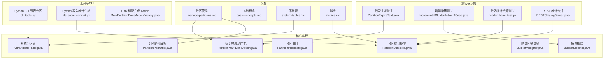
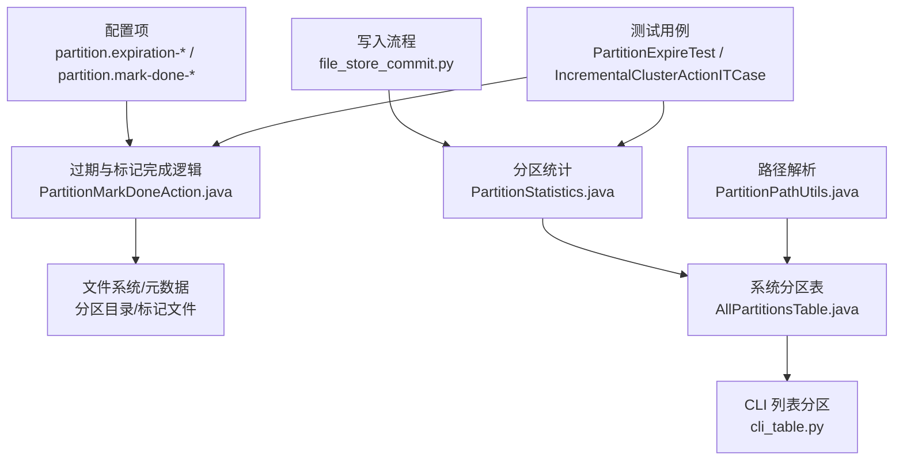
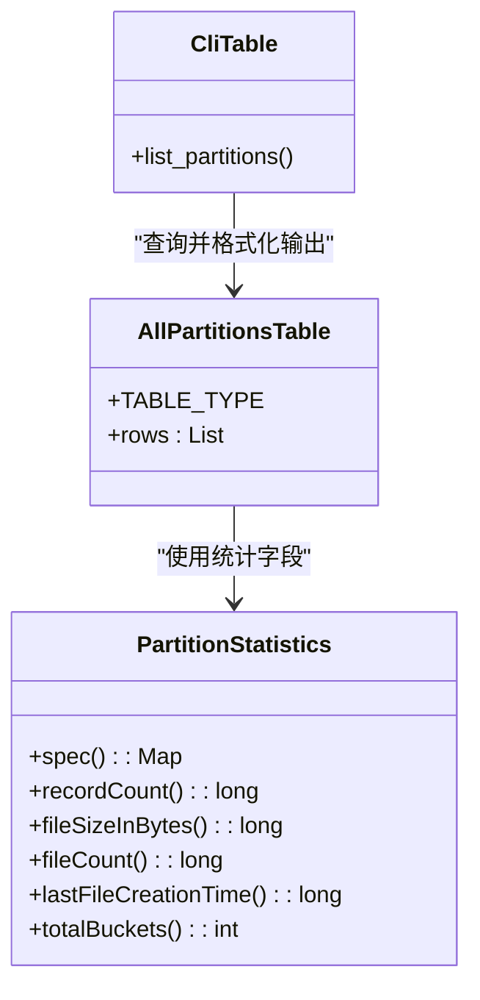
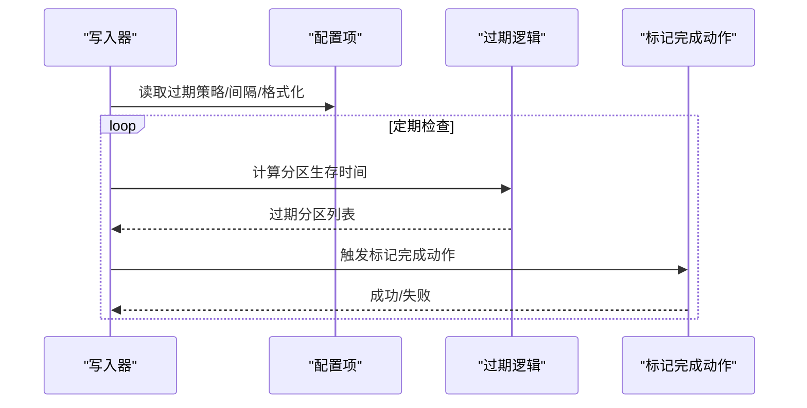
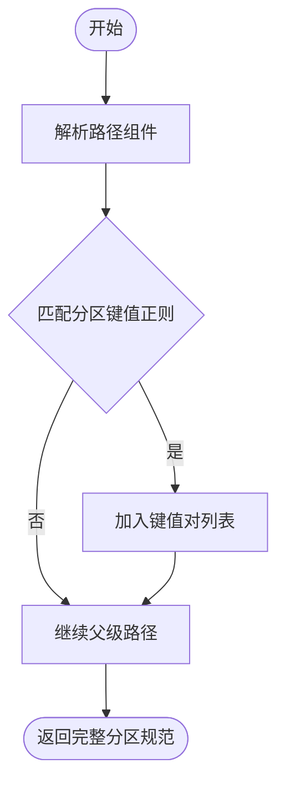
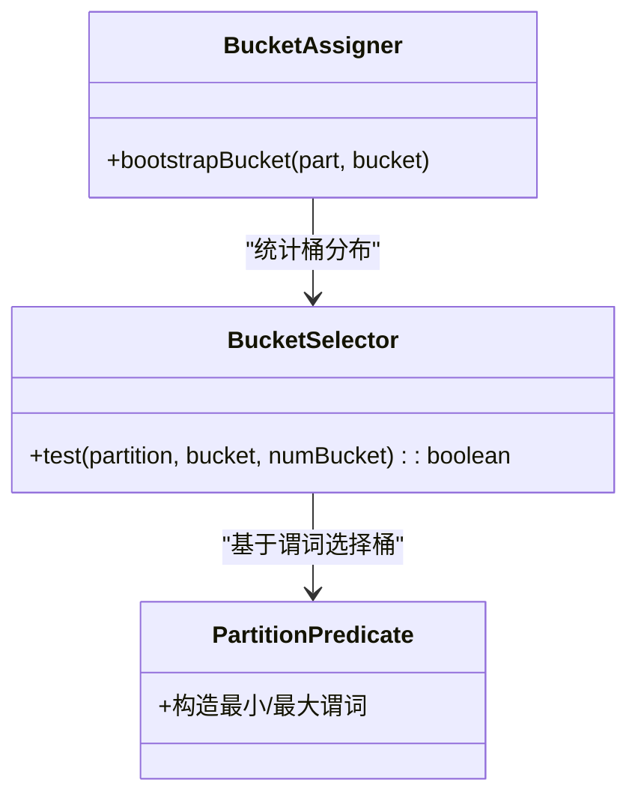
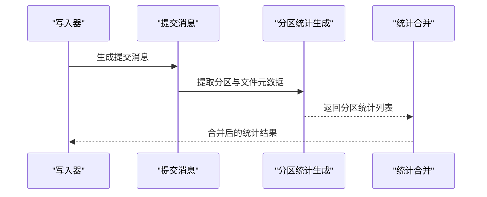
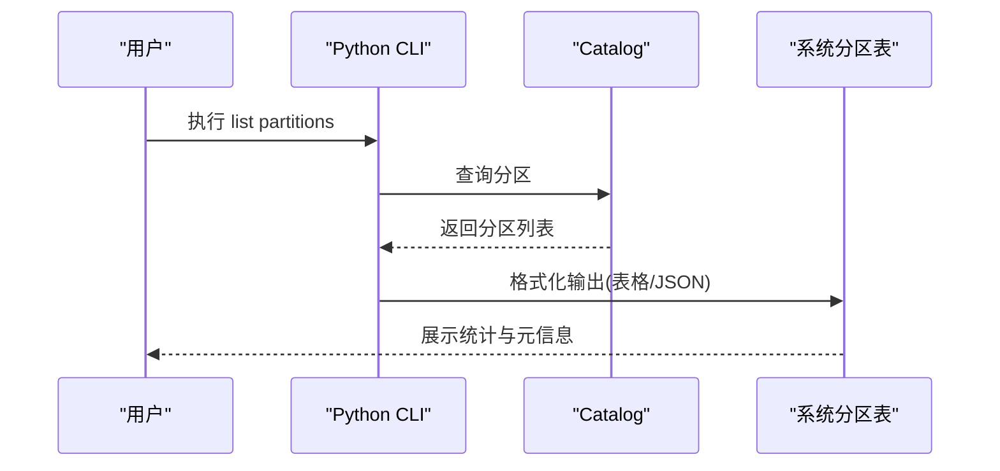
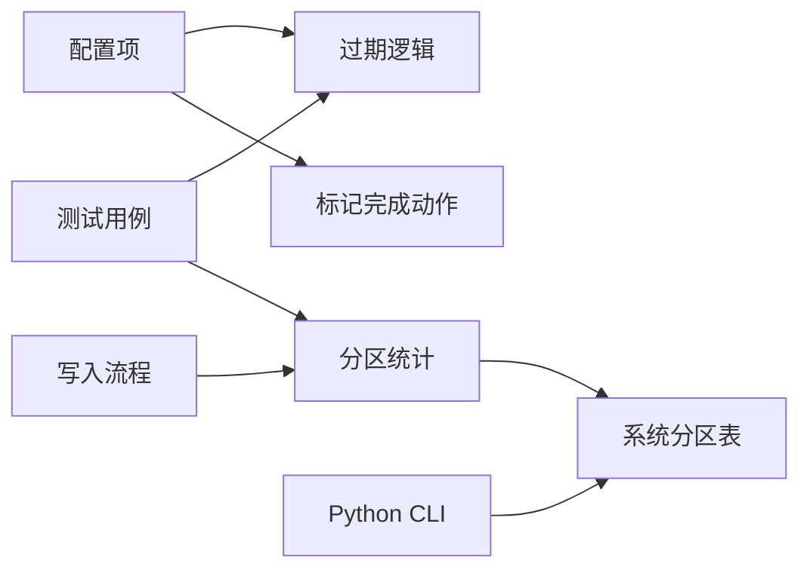

# 分区管理

<cite>
**本文引用的文件**
- [manage-partitions.md](file://docs/content/maintenance/manage-partitions.md)
- [basic-concepts.md](file://docs/content/concepts/basic-concepts.md)
- [metrics.md](file://docs/content/maintenance/metrics.md)
- [PartitionStatistics.java](file://paimon-api/src/main/java/org/apache/paimon/partition/PartitionStatistics.java)
- [AllPartitionsTable.java](file://paimon-core/src/main/java/org/apache/paimon/table/system/AllPartitionsTable.java)
- [PartitionExpireTest.java](file://paimon-core/src/test/java/org/apache/paimon/operation/PartitionExpireTest.java)
- [PartitionMarkDoneAction.java](file://paimon-core/src/main/java/org/apache/paimon/partition/actions/PartitionMarkDoneAction.java)
- [PartitionPathUtils.java](file://paimon-core/src/main/java/org/apache/paimon/utils/PartitionPathUtils.java)
- [PartitionPredicate.java](file://paimon-core/src/main/java/org/apache/paimon/partition/PartitionPredicate.java)
- [BucketSelector.java](file://paimon-core/src/main/java/org/apache/paimon/operation/BucketSelector.java)
- [BucketAssigner.java](file://paimon-core/src/main/java/org/apache/paimon/crosspartition/BucketAssigner.java)
- [file_store_commit.py](file://paimon-python/pypaimon/write/file_store_commit.py)
- [cli_table.py](file://paimon-python/pypaimon/cli/cli_table.py)
- [MarkPartitionDoneActionFactory.java](file://paimon-flink/paimon-flink-common/src/main/java/org/apache/paimon/flink/action/MarkPartitionDoneActionFactory.java)
- [IncrementalClusterActionITCase.java](file://paimon-flink/paimon-flink-common/src/test/java/org/apache/paimon/flink/action/IncrementalClusterActionITCase.java)
- [RESTCatalogServer.java](file://paimon-core/src/test/java/org/apache/paimon/rest/RESTCatalogServer.java)
- [reader_base_test.py](file://paimon-python/pypaimon/tests/reader_base_test.py)
- [system-tables.md](file://docs/content/concepts/system-tables.md)
</cite>

## 目录
1. [简介](#简介)
2. [项目结构](#项目结构)
3. [核心组件](#核心组件)
4. [架构总览](#架构总览)
5. [详细组件分析](#详细组件分析)
6. [依赖分析](#依赖分析)
7. [性能考量](#性能考量)
8. [故障排查指南](#故障排查指南)
9. [结论](#结论)
10. [附录](#附录)

## 简介
本文件系统性梳理 Apache Paimon 的分区管理能力与最佳实践，覆盖分区概念与设计、分区键选择与策略、日常维护（创建、删除、合并、分裂）、分区统计与监控、优化技术（重平衡、裁剪）、性能调优、自动化脚本与工具、以及故障诊断与最佳实践。内容基于官方文档与源码实现进行提炼，既适合初学者快速上手，也为进阶用户提供深入参考。

## 项目结构
围绕分区管理的关键位置与职责如下：
- 文档层：维护分区配置项、过期与标记完成策略、指标说明等
- 核心实现层：分区统计模型、路径解析、谓词与桶选择、标记完成动作等
- 工具与CLI：Python CLI 列出分区、Flink Action 工具触发标记完成
- 测试与示例：验证分区过期、增量聚簇、分区统计合并等行为

**图表来源**
- [manage-partitions.md](file://docs/content/maintenance/manage-partitions.md)
- [basic-concepts.md](file://docs/content/concepts/basic-concepts.md)
- [metrics.md](file://docs/content/maintenance/metrics.md)
- [PartitionStatistics.java](file://paimon-api/src/main/java/org/apache/paimon/partition/PartitionStatistics.java)
- [AllPartitionsTable.java](file://paimon-core/src/main/java/org/apache/paimon/table/system/AllPartitionsTable.java)
- [PartitionPathUtils.java](file://paimon-core/src/main/java/org/apache/paimon/utils/PartitionPathUtils.java)
- [PartitionPredicate.java](file://paimon-core/src/main/java/org/apache/paimon/partition/PartitionPredicate.java)
- [BucketSelector.java](file://paimon-core/src/main/java/org/apache/paimon/operation/BucketSelector.java)
- [BucketAssigner.java](file://paimon-core/src/main/java/org/apache/paimon/crosspartition/BucketAssigner.java)
- [PartitionMarkDoneAction.java](file://paimon-core/src/main/java/org/apache/paimon/partition/actions/PartitionMarkDoneAction.java)
- [cli_table.py](file://paimon-python/pypaimon/cli/cli_table.py)
- [file_store_commit.py](file://paimon-python/pypaimon/write/file_store_commit.py)
- [MarkPartitionDoneActionFactory.java](file://paimon-flink/paimon-flink-common/src/main/java/org/apache/paimon/flink/action/MarkPartitionDoneActionFactory.java)
- [PartitionExpireTest.java](file://paimon-core/src/test/java/org/apache/paimon/operation/PartitionExpireTest.java)
- [IncrementalClusterActionITCase.java](file://paimon-flink/paimon-flink-common/src/test/java/org/apache/paimon/flink/action/IncrementalClusterActionITCase.java)
- [reader_base_test.py](file://paimon-python/pypaimon/tests/reader_base_test.py)
- [RESTCatalogServer.java](file://paimon-core/src/test/java/org/apache/paimon/rest/RESTCatalogServer.java)

**章节来源**
- [manage-partitions.md](file://docs/content/maintenance/manage-partitions.md)
- [basic-concepts.md](file://docs/content/concepts/basic-concepts.md)
- [metrics.md](file://docs/content/maintenance/metrics.md)

## 核心组件
- 分区统计模型：描述每个分区的记录数、文件大小、文件数量、最后文件创建时间、桶总数等关键指标，支持序列化与比较，用于系统表展示与外部工具消费。
- 系统分区表：提供统一视图，列出数据库、表名、分区名、记录数、文件大小、文件数量、最后文件创建时间、是否完成等信息。
- 路径解析与规范：从文件系统路径中提取分区规范，保证分区名与值的正确映射。
- 过期与标记完成：通过配置项控制分区过期策略（按值时间或更新时间），以及在流批场景下自动标记完成的动作集合。
- 桶选择与跨分区桶分配：根据谓词与桶函数类型筛选目标桶，支撑读取裁剪与写入优化。
- Python CLI 与写入统计：CLI 列出分区并格式化输出；写入流程生成分区统计，供后续聚合与上报。

**章节来源**
- [PartitionStatistics.java](file://paimon-api/src/main/java/org/apache/paimon/partition/PartitionStatistics.java)
- [AllPartitionsTable.java](file://paimon-core/src/main/java/org/apache/paimon/table/system/AllPartitionsTable.java)
- [PartitionPathUtils.java](file://paimon-core/src/main/java/org/apache/paimon/utils/PartitionPathUtils.java)
- [PartitionMarkDoneAction.java](file://paimon-core/src/main/java/org/apache/paimon/partition/actions/PartitionMarkDoneAction.java)
- [BucketSelector.java](file://paimon-core/src/main/java/org/apache/paimon/operation/BucketSelector.java)
- [BucketAssigner.java](file://paimon-core/src/main/java/org/apache/paimon/crosspartition/BucketAssigner.java)
- [cli_table.py](file://paimon-python/pypaimon/cli/cli_table.py)
- [file_store_commit.py](file://paimon-python/pypaimon/write/file_store_commit.py)

## 架构总览
下图展示分区管理在系统中的关键交互：配置驱动过期与标记完成，写入生成分区统计，系统表与CLI对外呈现，测试用例验证行为。

**图表来源**
- [manage-partitions.md](file://docs/content/maintenance/manage-partitions.md)
- [PartitionMarkDoneAction.java](file://paimon-core/src/main/java/org/apache/paimon/partition/actions/PartitionMarkDoneAction.java)
- [file_store_commit.py](file://paimon-python/pypaimon/write/file_store_commit.py)
- [PartitionStatistics.java](file://paimon-api/src/main/java/org/apache/paimon/partition/PartitionStatistics.java)
- [AllPartitionsTable.java](file://paimon-core/src/main/java/org/apache/paimon/table/system/AllPartitionsTable.java)
- [cli_table.py](file://paimon-python/pypaimon/cli/cli_table.py)
- [PartitionPathUtils.java](file://paimon-core/src/main/java/org/apache/paimon/utils/PartitionPathUtils.java)
- [PartitionExpireTest.java](file://paimon-core/src/test/java/org/apache/paimon/operation/PartitionExpireTest.java)
- [IncrementalClusterActionITCase.java](file://paimon-flink/paimon-flink-common/src/test/java/org/apache/paimon/flink/action/IncrementalClusterActionITCase.java)

## 详细组件分析

### 分区统计与系统表
- 分区统计模型包含分区规范、记录数、文件大小、文件数量、最后文件创建时间、桶总数等字段，支持序列化与哈希比较，便于跨模块传递与缓存。
- 系统分区表提供统一查询接口，列示数据库、表名、分区名、记录数、文件大小、文件数量、最后文件创建时间、是否完成等，便于运维与监控。
- Python CLI 支持以表格或 JSON 格式列出分区，并包含记录数、文件大小、文件数量、最后文件创建时间、更新时间与更新者等字段，便于自动化集成。

**图表来源**
- [PartitionStatistics.java](file://paimon-api/src/main/java/org/apache/paimon/partition/PartitionStatistics.java)
- [AllPartitionsTable.java](file://paimon-core/src/main/java/org/apache/paimon/table/system/AllPartitionsTable.java)
- [cli_table.py](file://paimon-python/pypaimon/cli/cli_table.py)

**章节来源**
- [PartitionStatistics.java](file://paimon-api/src/main/java/org/apache/paimon/partition/PartitionStatistics.java)
- [AllPartitionsTable.java](file://paimon-core/src/main/java/org/apache/paimon/table/system/AllPartitionsTable.java)
- [cli_table.py](file://paimon-python/pypaimon/cli/cli_table.py)
- [system-tables.md](file://docs/content/concepts/system-tables.md)

### 分区过期与标记完成
- 过期策略：支持按“分区值时间”和“分区更新时间”，可配置检查间隔与时间格式化模式；过期后逻辑删除，快照过期后再物理清理。
- 标记完成：支持多种动作（成功文件、添加完成分区、事件标记、HTTP上报、自定义策略），可在流式空闲超时或批量结束时触发；Flink 支持基于处理时间或水位线触发。

**图表来源**
- [manage-partitions.md](file://docs/content/maintenance/manage-partitions.md)
- [PartitionMarkDoneAction.java](file://paimon-core/src/main/java/org/apache/paimon/partition/actions/PartitionMarkDoneAction.java)

**章节来源**
- [manage-partitions.md](file://docs/content/maintenance/manage-partitions.md)
- [PartitionMarkDoneAction.java](file://paimon-core/src/main/java/org/apache/paimon/partition/actions/PartitionMarkDoneAction.java)

### 分区路径解析与规范
- 从文件系统路径中提取分区规范，确保分区键值对顺序与转义处理正确，为系统表与统计聚合提供可靠输入。

**图表来源**
- [PartitionPathUtils.java](file://paimon-core/src/main/java/org/apache/paimon/utils/PartitionPathUtils.java)

**章节来源**
- [PartitionPathUtils.java](file://paimon-core/src/main/java/org/apache/paimon/utils/PartitionPathUtils.java)

### 分区谓词与桶选择
- 基于谓词与桶函数类型，筛选目标桶，减少扫描与写入范围，提升查询与写入效率。
- 跨分区桶分配器用于统计与引导桶分布，辅助重平衡与容量规划。

**图表来源**
- [BucketSelector.java](file://paimon-core/src/main/java/org/apache/paimon/operation/BucketSelector.java)
- [BucketAssigner.java](file://paimon-core/src/main/java/org/apache/paimon/crosspartition/BucketAssigner.java)
- [PartitionPredicate.java](file://paimon-core/src/main/java/org/apache/paimon/partition/PartitionPredicate.java)

**章节来源**
- [BucketSelector.java](file://paimon-core/src/main/java/org/apache/paimon/operation/BucketSelector.java)
- [BucketAssigner.java](file://paimon-core/src/main/java/org/apache/paimon/crosspartition/BucketAssigner.java)
- [PartitionPredicate.java](file://paimon-core/src/main/java/org/apache/paimon/partition/PartitionPredicate.java)

### 写入统计与聚合
- 写入流程生成分区统计，包含分区规范与汇总指标；测试用例验证多分区统计合并与删除条目计算。

**图表来源**
- [file_store_commit.py](file://paimon-python/pypaimon/write/file_store_commit.py)
- [reader_base_test.py](file://paimon-python/pypaimon/tests/reader_base_test.py)
- [RESTCatalogServer.java](file://paimon-core/src/test/java/org/apache/paimon/rest/RESTCatalogServer.java)

**章节来源**
- [file_store_commit.py](file://paimon-python/pypaimon/write/file_store_commit.py)
- [reader_base_test.py](file://paimon-python/pypaimon/tests/reader_base_test.py)
- [RESTCatalogServer.java](file://paimon-core/src/test/java/org/apache/paimon/rest/RESTCatalogServer.java)

### 自动化脚本与工具
- Python CLI：列出分区并格式化输出，便于运维与监控集成。
- Flink Action：提供命令行工具触发标记完成，支持仓库路径或表路径两种方式。

**图表来源**
- [cli_table.py](file://paimon-python/pypaimon/cli/cli_table.py)
- [AllPartitionsTable.java](file://paimon-core/src/main/java/org/apache/paimon/table/system/AllPartitionsTable.java)

**章节来源**
- [cli_table.py](file://paimon-python/pypaimon/cli/cli_table.py)
- [MarkPartitionDoneActionFactory.java](file://paimon-flink/paimon-flink-common/src/main/java/org/apache/paimon/flink/action/MarkPartitionDoneActionFactory.java)

## 依赖分析
- 配置项驱动行为：过期策略、检查间隔、时间格式化、标记完成动作集合等配置决定分区生命周期与可观测性。
- 实现耦合：系统分区表依赖分区统计模型；CLI 依赖系统分区表；写入统计依赖提交消息；测试用例覆盖过期与聚簇等关键路径。
- 外部集成：Flink Action 与 Python CLI 作为运维与自动化入口，REST 服务在测试中用于统计合并。

**图表来源**
- [manage-partitions.md](file://docs/content/maintenance/manage-partitions.md)
- [PartitionStatistics.java](file://paimon-api/src/main/java/org/apache/paimon/partition/PartitionStatistics.java)
- [AllPartitionsTable.java](file://paimon-core/src/main/java/org/apache/paimon/table/system/AllPartitionsTable.java)
- [cli_table.py](file://paimon-python/pypaimon/cli/cli_table.py)
- [file_store_commit.py](file://paimon-python/pypaimon/write/file_store_commit.py)
- [PartitionExpireTest.java](file://paimon-core/src/test/java/org/apache/paimon/operation/PartitionExpireTest.java)
- [IncrementalClusterActionITCase.java](file://paimon-flink/paimon-flink-common/src/test/java/org/apache/paimon/flink/action/IncrementalClusterActionITCase.java)

**章节来源**
- [manage-partitions.md](file://docs/content/maintenance/manage-partitions.md)
- [PartitionStatistics.java](file://paimon-api/src/main/java/org/apache/paimon/partition/PartitionStatistics.java)
- [AllPartitionsTable.java](file://paimon-core/src/main/java/org/apache/paimon/table/system/AllPartitionsTable.java)
- [cli_table.py](file://paimon-python/pypaimon/cli/cli_table.py)
- [file_store_commit.py](file://paimon-python/pypaimon/write/file_store_commit.py)
- [PartitionExpireTest.java](file://paimon-core/src/test/java/org/apache/paimon/operation/PartitionExpireTest.java)
- [IncrementalClusterActionITCase.java](file://paimon-flink/paimon-flink-common/src/test/java/org/apache/paimon/flink/action/IncrementalClusterActionITCase.java)

## 性能考量
- 分区数量与大小：合理设置分区键与粒度，避免过多小分区导致元数据膨胀；结合写入批次与桶数控制单分区文件规模。
- 读取裁剪：利用桶选择器与分区谓词减少扫描范围，优先按分区键过滤；启用分区排序与分段合并降低 IO。
- 写入优化：通过跨分区桶分配器了解桶分布，指导动态桶扩容与重平衡；关注压缩与聚簇策略，减少小文件与重复数据。
- 指标监控：利用内置指标（扫描耗时、提交耗时、文件增删、压缩输入/输出大小、排序缓冲使用率）定位瓶颈并调优。

**章节来源**
- [metrics.md](file://docs/content/maintenance/metrics.md)
- [BucketSelector.java](file://paimon-core/src/main/java/org/apache/paimon/operation/BucketSelector.java)
- [BucketAssigner.java](file://paimon-core/src/main/java/org/apache/paimon/crosspartition/BucketAssigner.java)

## 故障排查指南
- 分区未过期或过早过期
  - 检查过期策略与时间格式化配置，确认分区值时间或更新时间提取是否正确。
  - 参考测试用例验证过期逻辑与时间边界。
- 标记完成未生效
  - 确认标记完成动作集合与触发条件（空闲超时、水位线、批量结束）配置。
  - 使用 Flink Action 或 CLI 验证分区状态。
- 统计不准确或缺失
  - 检查写入流程是否正确生成分区统计，确认提交消息中分区规范与文件元数据。
  - 在测试环境中复现实验，验证统计合并与删除条目计算。
- 文件系统异常
  - 使用路径解析工具核对分区目录结构与键值映射，确保转义与顺序一致。

**章节来源**
- [manage-partitions.md](file://docs/content/maintenance/manage-partitions.md)
- [PartitionExpireTest.java](file://paimon-core/src/test/java/org/apache/paimon/operation/PartitionExpireTest.java)
- [PartitionMarkDoneAction.java](file://paimon-core/src/main/java/org/apache/paimon/partition/actions/PartitionMarkDoneAction.java)
- [file_store_commit.py](file://paimon-python/pypaimon/write/file_store_commit.py)
- [reader_base_test.py](file://paimon-python/pypaimon/tests/reader_base_test.py)
- [PartitionPathUtils.java](file://paimon-core/src/main/java/org/apache/paimon/utils/PartitionPathUtils.java)

## 结论
Paimon 的分区管理以配置驱动为核心，结合系统表与 CLI 工具实现可观测与自动化；通过分区统计、桶选择与跨分区桶分配实现高效读写与优化；配合指标体系与测试用例保障稳定性。遵循本文的分区键选择、过期与标记完成策略、统计与监控方法、优化与调优建议，可显著提升分区管理的可靠性与性能。

## 附录
- 最佳实践
  - 选择高区分度且稳定的分区键，避免过度分区。
  - 启用合适的过期策略与检查间隔，定期清理历史分区。
  - 使用标记完成通知下游，确保数据可用性与一致性。
  - 关注指标阈值，及时发现与处理异常。
- 常见陷阱
  - 分区键选择不当导致数据倾斜或热分区。
  - 过期策略与时间格式化不匹配引发误删或滞留。
  - 忽视统计聚合，导致监控与告警失真。
  - 缺乏自动化脚本，增加人工运维成本与错误风险。