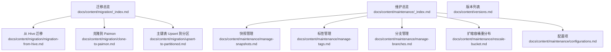
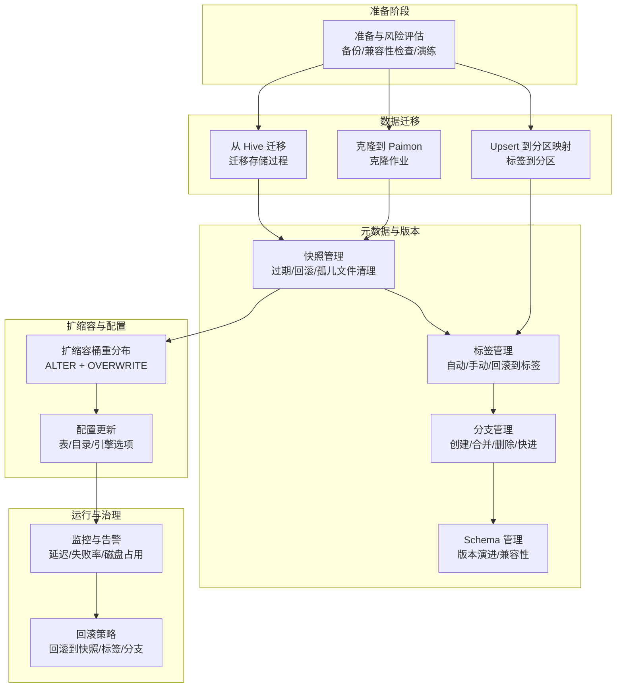
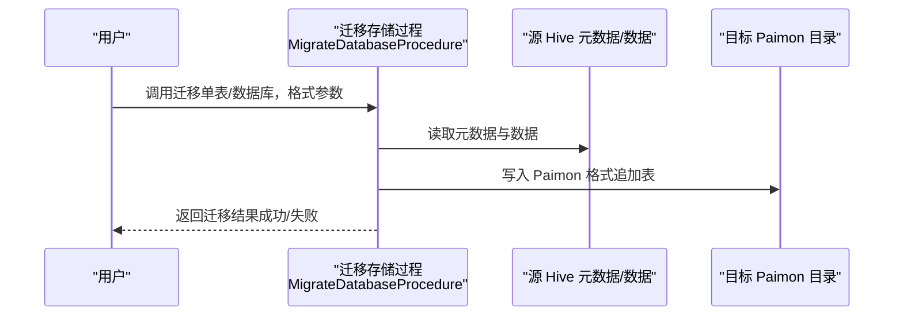
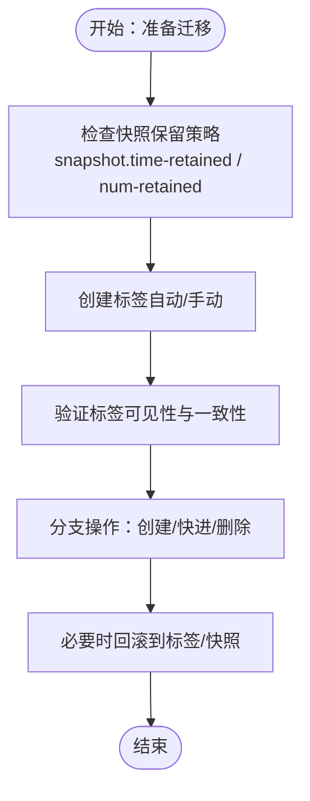
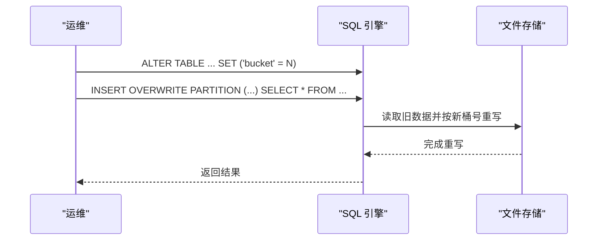
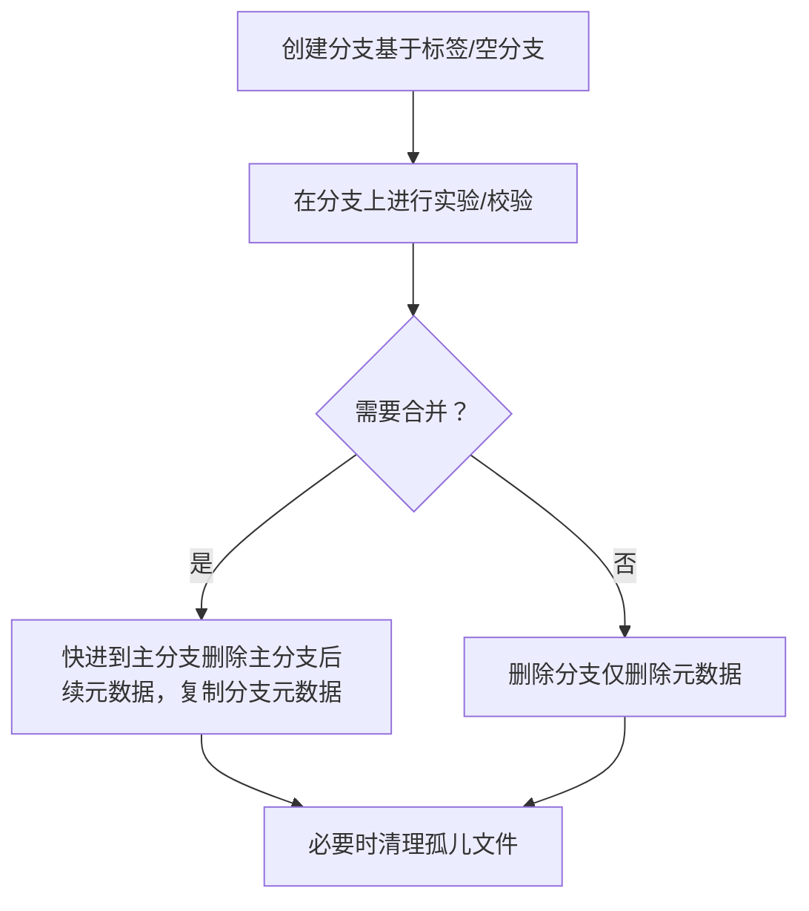
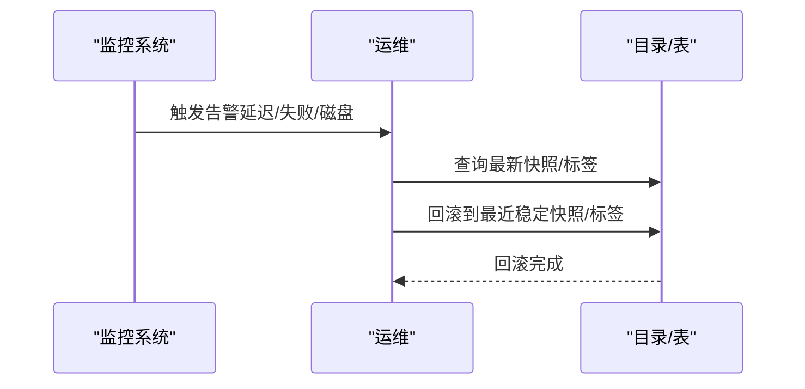
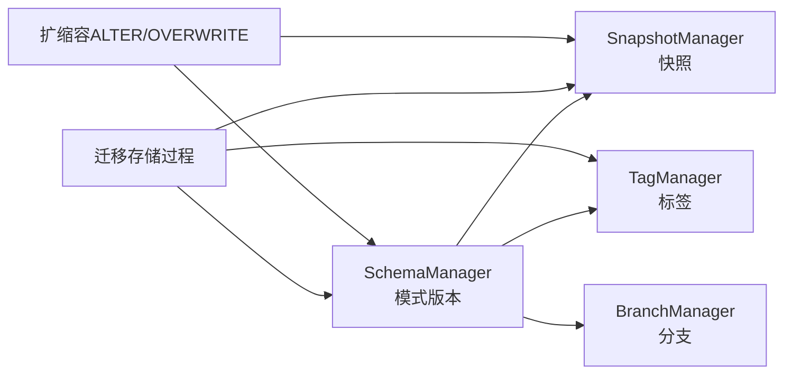

# 升级迁移

<cite>
**本文引用的文件**
- [迁移总览](file://docs/content/migration/_index.md)
- [从 Hive 迁移](file://docs/content/migration/migration-from-hive.md)
- [克隆到 Paimon](file://docs/content/migration/clone-to-paimon.md)
- [主键表 Upsert 到分区](file://docs/content/migration/upsert-to-partitioned.md)
- [维护总览](file://docs/content/maintenance/_index.md)
- [快照管理](file://docs/content/maintenance/manage-snapshots.md)
- [标签管理](file://docs/content/maintenance/manage-tags.md)
- [分支管理](file://docs/content/maintenance/manage-branches.md)
- [扩缩容（桶重分布）](file://docs/content/maintenance/rescale-bucket.md)
- [配置项](file://docs/content/maintenance/configurations.md)
- [版本列表](file://docs/content/versions.md)
- [Schema 管理器](file://paimon-core/src/main/java/org/apache/paimon/schema/SchemaManager.java)
- [Changelog 合并树重写器](file://paimon-core/src/main/java/org/apache/paimon/mergetree/compact/ChangelogMergeTreeRewriter.java)
- [Hive 迁移存储过程（Flink 1.18）](file://paimon-flink/paimon-flink-1.18/src/main/java/org/apache/paimon/flink/procedure/MigrateDatabaseProcedure.java)
- [Python 分支管理器（文件系统）](file://paimon-python/pypaimon/branch/filesystem_branch_manager.py)
- [REST 目录回滚测试](file://paimon-python/pypaimon/tests/rest/rest_catalog_test.py)
</cite>

## 目录
1. [引言](#引言)
2. [项目结构](#项目结构)
3. [核心组件](#核心组件)
4. [架构总览](#架构总览)
5. [详细组件分析](#详细组件分析)
6. [依赖关系分析](#依赖关系分析)
7. [性能考量](#性能考量)
8. [故障排查指南](#故障排查指南)
9. [结论](#结论)
10. [附录](#附录)

## 引言
本文件面向使用 Apache Paimon 的工程团队，提供一套完整的“升级与迁移”实践指南。内容覆盖版本升级策略（小版本与大版本）、兼容性检查、数据迁移方案（格式转换、元数据迁移、配置更新）、扩缩容（桶数调整、集群扩容）、分支与标签管理、升级前准备与风险评估、升级过程监控与回滚策略、以及迁移期间的数据一致性保障与验证方法，并总结最佳实践与常见问题。

## 项目结构
围绕升级迁移主题，官方文档主要分布在以下模块：
- 迁移：从 Hive 迁移到 Paimon、克隆到 Paimon、Upsert 到分区映射
- 维护：快照与标签管理、分支管理、扩缩容、配置项
- 版本：各版本文档索引页

**图表来源**
- [迁移总览:1-26](file://docs/content/migration/_index.md#L1-L26)
- [维护总览:1-26](file://docs/content/maintenance/_index.md#L1-L26)
- [版本列表:1-31](file://docs/content/versions.md#L1-L31)

**章节来源**
- [迁移总览:1-26](file://docs/content/migration/_index.md#L1-L26)
- [维护总览:1-26](file://docs/content/maintenance/_index.md#L1-L26)
- [版本列表:1-31](file://docs/content/versions.md#L1-L31)

## 核心组件
- 元数据与版本控制：快照、标签、分支、Schema 管理
- 数据迁移工具链：从 Hive 迁移、克隆、Upsert 到分区映射
- 扩缩容能力：通过 ALTER TABLE 与 INSERT OVERWRITE 实现桶重分布
- 配置体系：表级选项、目录级选项、引擎适配选项

**章节来源**
- [快照管理:1-402](file://docs/content/maintenance/manage-snapshots.md#L1-L402)
- [标签管理:1-299](file://docs/content/maintenance/manage-tags.md#L1-L299)
- [分支管理:1-291](file://docs/content/maintenance/manage-branches.md#L1-L291)
- [扩缩容（桶重分布）:1-161](file://docs/content/maintenance/rescale-bucket.md#L1-L161)
- [配置项:1-92](file://docs/content/maintenance/configurations.md#L1-L92)

## 架构总览
下图展示升级迁移的关键流程与组件交互：从“准备阶段”开始，经过“数据与元数据迁移”，再到“扩缩容与配置更新”，最后进入“监控与回滚”的闭环。

**图表来源**
- [从 Hive 迁移:1-126](file://docs/content/migration/migration-from-hive.md#L1-L126)
- [克隆到 Paimon:1-89](file://docs/content/migration/clone-to-paimon.md#L1-L89)
- [主键表 Upsert 到分区:1-179](file://docs/content/migration/upsert-to-partitioned.md#L1-L179)
- [快照管理:1-402](file://docs/content/maintenance/manage-snapshots.md#L1-L402)
- [标签管理:1-299](file://docs/content/maintenance/manage-tags.md#L1-L299)
- [分支管理:1-291](file://docs/content/maintenance/manage-branches.md#L1-L291)
- [扩缩容（桶重分布）:1-161](file://docs/content/maintenance/rescale-bucket.md#L1-L161)
- [配置项:1-92](file://docs/content/maintenance/configurations.md#L1-L92)

## 详细组件分析

### 1) 版本升级策略与兼容性检查
- 小版本升级：通常保持向后兼容，建议先在测试环境验证，再滚动到生产；关注配置项变更与默认值变化。
- 大版本升级：需进行兼容性扫描与回归测试，重点检查：
  - 表/目录选项变更（如 snapshot.*、tag.*、bucket 等）
  - 引擎适配差异（Flink/Spark/Hive）
  - 文件格式与编码规则变化
- 兼容性检查清单：
  - 快照保留策略是否满足批量查询与流式重启需求
  - 标签生命周期与自动创建策略是否符合业务
  - 分支/标签回滚对下游的影响
  - 桶数变更与重写策略对写入吞吐的影响

**章节来源**
- [配置项:1-92](file://docs/content/maintenance/configurations.md#L1-L92)
- [快照管理:1-402](file://docs/content/maintenance/manage-snapshots.md#L1-L402)
- [标签管理:1-299](file://docs/content/maintenance/manage-tags.md#L1-L299)
- [扩缩容（桶重分布）:1-161](file://docs/content/maintenance/rescale-bucket.md#L1-L161)

### 2) 数据迁移实施方案
- 从 Hive 迁移至 Paimon
  - 使用迁移存储过程，支持单表与数据库级迁移，目标表为追加表
  - 支持文件格式：ORC、Parquet、Avro
  - 迁移非原子，中断可能导致数据丢失，务必提前备份
  - 参考：[从 Hive 迁移:1-126](file://docs/content/migration/migration-from-hive.md#L1-L126)
- 克隆到 Paimon
  - 支持 Hive Catalog → Paimon Catalog 的克隆，覆盖语义，可重入
  - 支持指定过滤条件与包含/排除表清单
  - 参考：[克隆到 Paimon:1-89](file://docs/content/migration/clone-to-paimon.md#L1-L89)
- Upsert 到分区映射
  - 通过标签到分区映射，使主键表在 Hive 中以分区形式查询
  - 支持预览模式，提前暴露未落标签的最新数据
  - 参考：[主键表 Upsert 到分区:1-179](file://docs/content/migration/upsert-to-partitioned.md#L1-L179)

**图表来源**
- [Hive 迁移存储过程（Flink 1.18）:36-63](file://paimon-flink/paimon-flink-1.18/src/main/java/org/apache/paimon/flink/procedure/MigrateDatabaseProcedure.java#L36-L63)
- [从 Hive 迁移:1-126](file://docs/content/migration/migration-from-hive.md#L1-L126)

**章节来源**
- [从 Hive 迁移:1-126](file://docs/content/migration/migration-from-hive.md#L1-L126)
- [克隆到 Paimon:1-89](file://docs/content/migration/clone-to-paimon.md#L1-L89)
- [主键表 Upsert 到分区:1-179](file://docs/content/migration/upsert-to-partitioned.md#L1-L179)

### 3) 元数据迁移与版本演进
- 快照管理
  - 自动过期策略：基于时间与数量阈值，支持同步/异步执行模式
  - 手动过期与回滚到快照，支持孤儿文件清理
  - 参考：[快照管理:1-402](file://docs/content/maintenance/manage-snapshots.md#L1-L402)
- 标签管理
  - 自动/手动创建标签，支持按周期与延迟生成
  - 回滚到标签会删除大于等于该标签的快照/标签/模式
  - 参考：[标签管理:1-299](file://docs/content/maintenance/manage-tags.md#L1-L299)
- 分支管理
  - 创建/删除分支，按标签快进到主分支，支持回退分支读取
  - 参考：[分支管理:1-291](file://docs/content/maintenance/manage-branches.md#L1-L291)

**图表来源**
- [快照管理:1-402](file://docs/content/maintenance/manage-snapshots.md#L1-L402)
- [标签管理:1-299](file://docs/content/maintenance/manage-tags.md#L1-L299)
- [分支管理:1-291](file://docs/content/maintenance/manage-branches.md#L1-L291)

**章节来源**
- [快照管理:1-402](file://docs/content/maintenance/manage-snapshots.md#L1-L402)
- [标签管理:1-299](file://docs/content/maintenance/manage-tags.md#L1-L299)
- [分支管理:1-291](file://docs/content/maintenance/manage-branches.md#L1-L291)

### 4) 扩缩容操作（桶数调整与集群扩容）
- 桶重分布流程
  - ALTER TABLE 更新桶数（仅元数据）
  - INSERT OVERWRITE 重写现有分区数据，按新桶号重新分发
  - 参考：[扩缩容（桶重分布）:1-161](file://docs/content/maintenance/rescale-bucket.md#L1-L161)
- 执行要点
  - 重写期间避免其他写入作业
  - 对分区表可按分区分别调整桶数
  - 结合保存点暂停/恢复流式作业，确保一致性

**图表来源**
- [扩缩容（桶重分布）:1-161](file://docs/content/maintenance/rescale-bucket.md#L1-L161)

**章节来源**
- [扩缩容（桶重分布）:1-161](file://docs/content/maintenance/rescale-bucket.md#L1-L161)

### 5) 分支与标签管理策略
- 分支
  - 基于标签创建自定义分支，不影响主线读写
  - 支持快进到主分支，删除主分支在分支初始标签之后的快照/模式/标签
  - 参考：[分支管理:1-291](file://docs/content/maintenance/manage-branches.md#L1-L291)
- 标签
  - 自动/手动创建，支持保留时长与数量上限
  - 回滚到标签会删除后续快照/标签/模式
  - 参考：[标签管理:1-299](file://docs/content/maintenance/manage-tags.md#L1-L299)

**图表来源**
- [分支管理:1-291](file://docs/content/maintenance/manage-branches.md#L1-L291)
- [标签管理:1-299](file://docs/content/maintenance/manage-tags.md#L1-L299)

**章节来源**
- [分支管理:1-291](file://docs/content/maintenance/manage-branches.md#L1-L291)
- [标签管理:1-299](file://docs/content/maintenance/manage-tags.md#L1-L299)

### 6) 升级前准备与风险评估
- 准备工作
  - 全量备份：数据文件、元数据（快照/标签/分支/模式）
  - 兼容性扫描：检查配置项变更、引擎适配差异
  - 测试演练：在隔离环境执行迁移/扩缩容/回滚
- 风险评估
  - 快照过期策略不足导致批量查询失败或流式重启异常
  - 标签生命周期与自动创建策略不匹配业务
  - 桶重分布导致写入抖动与资源竞争
  - 迁移过程非原子，中断风险高

**章节来源**
- [快照管理:1-402](file://docs/content/maintenance/manage-snapshots.md#L1-L402)
- [标签管理:1-299](file://docs/content/maintenance/manage-tags.md#L1-L299)
- [扩缩容（桶重分布）:1-161](file://docs/content/maintenance/rescale-bucket.md#L1-L161)
- [从 Hive 迁移:1-126](file://docs/content/migration/migration-from-hive.md#L1-L126)

### 7) 升级过程中的监控与回滚策略
- 监控
  - 关键指标：写入延迟、失败率、磁盘占用、快照/标签数量
  - 建议：设置阈值告警与自动降级预案
- 回滚
  - 回滚到快照/标签：删除后续快照/标签/模式，恢复到目标状态
  - 分支快进失败：回退到分支初始标签，清理主分支后续元数据
  - 参考：[快照管理:1-402](file://docs/content/maintenance/manage-snapshots.md#L1-L402)、[标签管理:1-299](file://docs/content/maintenance/manage-tags.md#L1-L299)、[分支管理:1-291](file://docs/content/maintenance/manage-branches.md#L1-L291)

**图表来源**
- [快照管理:1-402](file://docs/content/maintenance/manage-snapshots.md#L1-L402)
- [标签管理:1-299](file://docs/content/maintenance/manage-tags.md#L1-L299)
- [分支管理:1-291](file://docs/content/maintenance/manage-branches.md#L1-L291)

**章节来源**
- [快照管理:1-402](file://docs/content/maintenance/manage-snapshots.md#L1-L402)
- [标签管理:1-299](file://docs/content/maintenance/manage-tags.md#L1-L299)
- [分支管理:1-291](file://docs/content/maintenance/manage-branches.md#L1-L291)

### 8) 数据一致性保障与验证
- 一致性保障
  - 使用标签作为每日不可变视图，结合批作业幂等重放
  - 分支实验与主分支隔离，实验结束后统一快进
  - 桶重分布期间避免并发写入，或采用批量重写
- 验证方法
  - 采样对比：抽取相同分区/标签的数据子集进行字段级比对
  - 时间窗口校验：对比迁移前后同一窗口内的聚合结果
  - 回滚验证：在测试环境执行回滚到标签/快照，确认可恢复性
  - 参考：[标签管理:1-299](file://docs/content/maintenance/manage-tags.md#L1-L299)、[REST 目录回滚测试:74-100](file://paimon-python/pypaimon/tests/rest/rest_catalog_test.py#L74-L100)

**章节来源**
- [标签管理:1-299](file://docs/content/maintenance/manage-tags.md#L1-L299)
- [REST 目录回滚测试:74-100](file://paimon-python/pypaimon/tests/rest/rest_catalog_test.py#L74-L100)

### 9) 最佳实践
- 升级与迁移
  - 优先使用标签作为“每日视图”，便于批处理与审计
  - 迁移前先在测试环境验证，再灰度到生产
  - 迁移过程非原子，务必做好备份与回滚预案
- 扩缩容
  - 先 ALTER 修改桶数，再批量重写，避免流式写入冲突
  - 对历史分区与近期分区分别处理，降低影响面
- 分支与标签
  - 实验用分支与主分支隔离，实验完成后统一快进
  - 标签自动创建周期与延迟应匹配业务窗口与晚到数据
- 配置
  - 明确快照保留策略，兼顾查询稳定性与存储成本
  - 引擎适配选项（Flink/Spark/Hive）需与部署环境一致

**章节来源**
- [扩缩容（桶重分布）:1-161](file://docs/content/maintenance/rescale-bucket.md#L1-L161)
- [分支管理:1-291](file://docs/content/maintenance/manage-branches.md#L1-L291)
- [标签管理:1-299](file://docs/content/maintenance/manage-tags.md#L1-L299)
- [配置项:1-92](file://docs/content/maintenance/configurations.md#L1-L92)

## 依赖关系分析
- 元数据管理依赖
  - Schema 管理器负责模式版本演进与兼容性
  - 快照/标签/分支管理器共同维护表的版本历史
- 迁移工具链依赖
  - 迁移存储过程依赖源目录（Hive）与目标目录（Paimon）
  - 克隆作业依赖源/目标 Catalog 与并行度配置
- 扩缩容依赖
  - ALTER TABLE 仅修改元数据，重写依赖 INSERT OVERWRITE
  - 与引擎运行时（Flink/Spark）的保存点/重启机制协同

**图表来源**
- [Schema 管理器:1-200](file://paimon-core/src/main/java/org/apache/paimon/schema/SchemaManager.java#L1-L200)
- [Changelog 合并树重写器:198-227](file://paimon-core/src/main/java/org/apache/paimon/mergetree/compact/ChangelogMergeTreeRewriter.java#L198-L227)
- [Hive 迁移存储过程（Flink 1.18）:36-63](file://paimon-flink/paimon-flink-1.18/src/main/java/org/apache/paimon/flink/procedure/MigrateDatabaseProcedure.java#L36-L63)

**章节来源**
- [Schema 管理器:1-200](file://paimon-core/src/main/java/org/apache/paimon/schema/SchemaManager.java#L1-L200)
- [Changelog 合并树重写器:198-227](file://paimon-core/src/main/java/org/apache/paimon/mergetree/compact/ChangelogMergeTreeRewriter.java#L198-L227)
- [Hive 迁移存储过程（Flink 1.18）:36-63](file://paimon-flink/paimon-flink-1.18/src/main/java/org/apache/paimon/flink/procedure/MigrateDatabaseProcedure.java#L36-L63)

## 性能考量
- 快照过期策略
  - 过短保留时间可能影响批量查询与流式重启
  - 异步过期可缓解上游背压，但需谨慎用于批任务
- 标签生命周期
  - 自动创建周期与延迟应与业务窗口匹配，避免过多标签占用空间
- 桶重分布
  - 重写阶段写放大显著，建议在低峰期执行
  - 并发度与并行度需与存储与网络带宽匹配

**章节来源**
- [快照管理:1-402](file://docs/content/maintenance/manage-snapshots.md#L1-L402)
- [标签管理:1-299](file://docs/content/maintenance/manage-tags.md#L1-L299)
- [扩缩容（桶重分布）:1-161](file://docs/content/maintenance/rescale-bucket.md#L1-L161)

## 故障排查指南
- 迁移中断
  - 现象：部分数据已迁移，部分未迁移
  - 处理：备份当前状态，修复中断原因后重试；若无法恢复，回滚到最近稳定标签/快照
  - 参考：[从 Hive 迁移:1-126](file://docs/content/migration/migration-from-hive.md#L1-L126)
- 快照过期导致查询失败
  - 现象：批量查询找不到文件或流式重启失败
  - 处理：延长快照保留时间/数量，或使用消费 ID 保护
  - 参考：[快照管理:1-402](file://docs/content/maintenance/manage-snapshots.md#L1-L402)
- 回滚异常
  - 现象：回滚到不存在的快照/标签报错
  - 处理：确认目标版本存在，必要时先创建标签/快照
  - 参考：[REST 目录回滚测试:74-100](file://paimon-python/pypaimon/tests/rest/rest_catalog_test.py#L74-L100)
- 分支快进失败
  - 现象：分支无快照或快进过程中异常
  - 处理：检查分支初始标签，清理主分支后续元数据后重试
  - 参考：[Python 分支管理器（文件系统）:223-250](file://paimon-python/pypaimon/branch/filesystem_branch_manager.py#L223-L250)

**章节来源**
- [从 Hive 迁移:1-126](file://docs/content/migration/migration-from-hive.md#L1-L126)
- [快照管理:1-402](file://docs/content/maintenance/manage-snapshots.md#L1-L402)
- [REST 目录回滚测试:74-100](file://paimon-python/pypaimon/tests/rest/rest_catalog_test.py#L74-L100)
- [Python 分支管理器（文件系统）:223-250](file://paimon-python/pypaimon/branch/filesystem_branch_manager.py#L223-L250)

## 结论
升级与迁移是一个系统工程，涉及数据、元数据、配置与运行时的多维协同。通过规范的准备与演练、严格的监控与回滚策略、以及完善的验证方法，可以显著降低风险并提升成功率。建议将标签、分支与扩缩容纳入日常运维流程，持续优化快照与标签策略，确保系统在演进中保持稳定与高效。

## 附录
- 版本文档索引：[版本列表:1-31](file://docs/content/versions.md#L1-L31)
- 配置参考：[配置项:1-92](file://docs/content/maintenance/configurations.md#L1-L92)