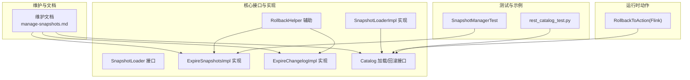
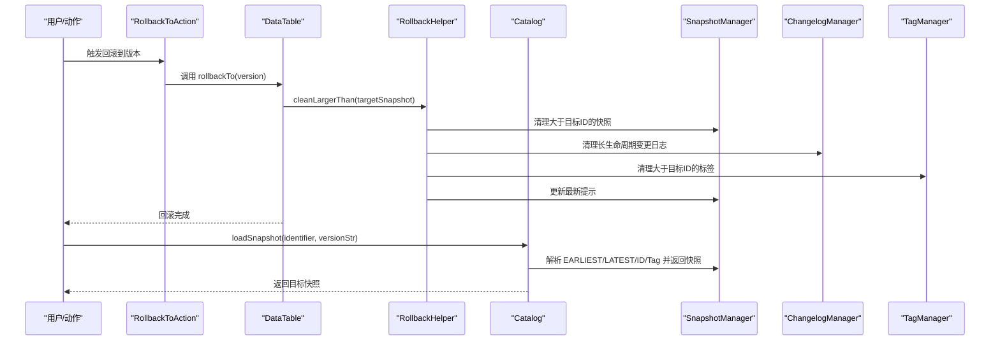
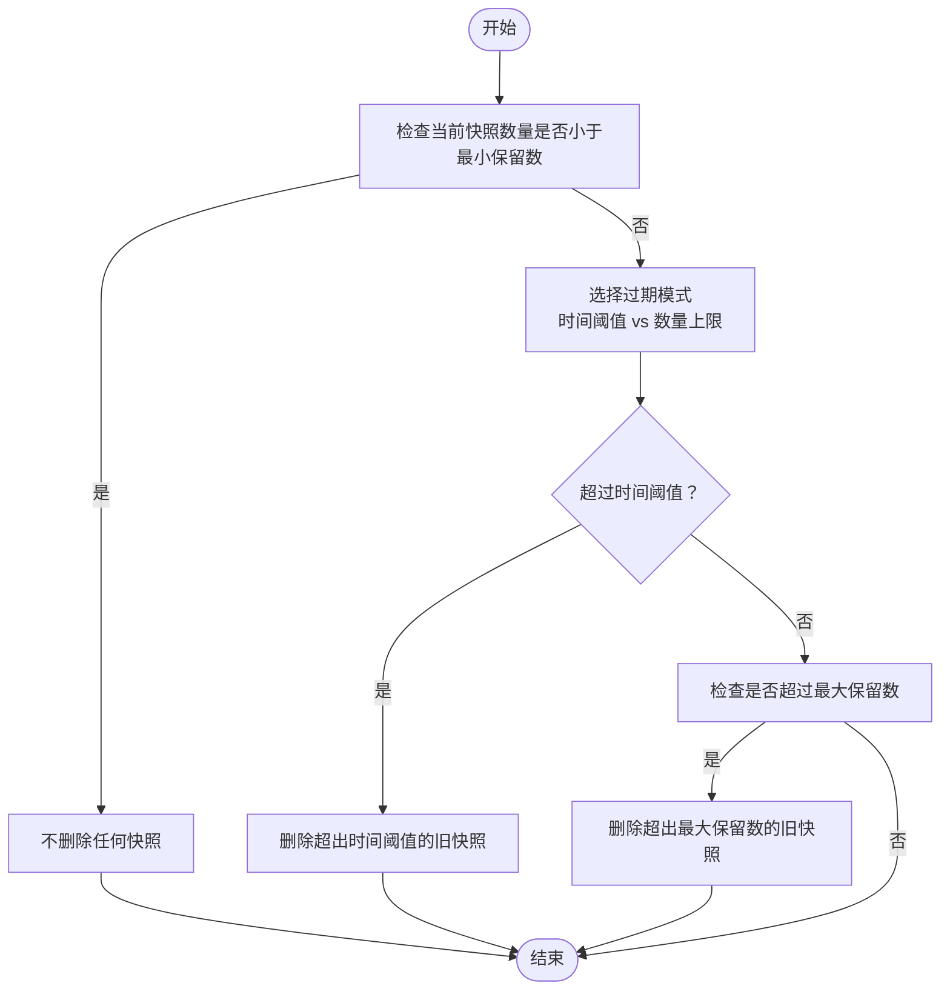
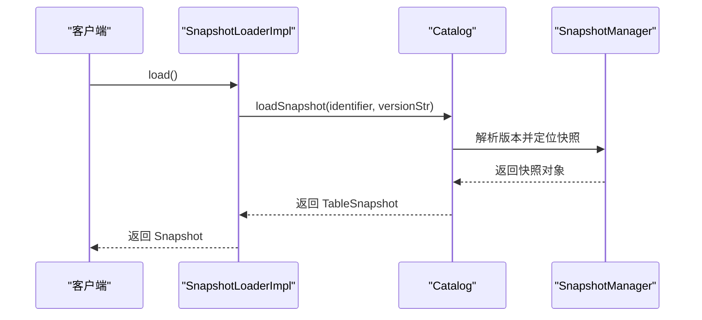
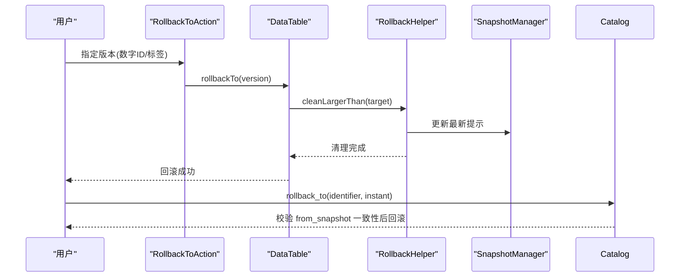
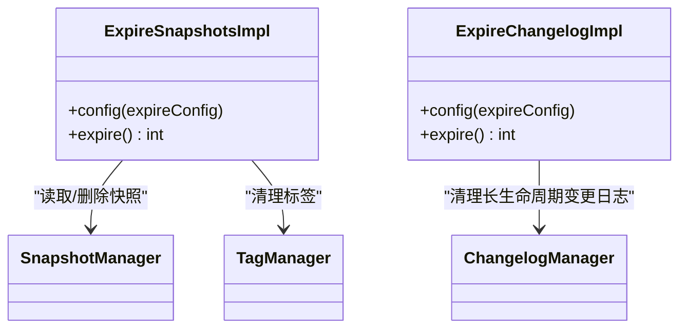
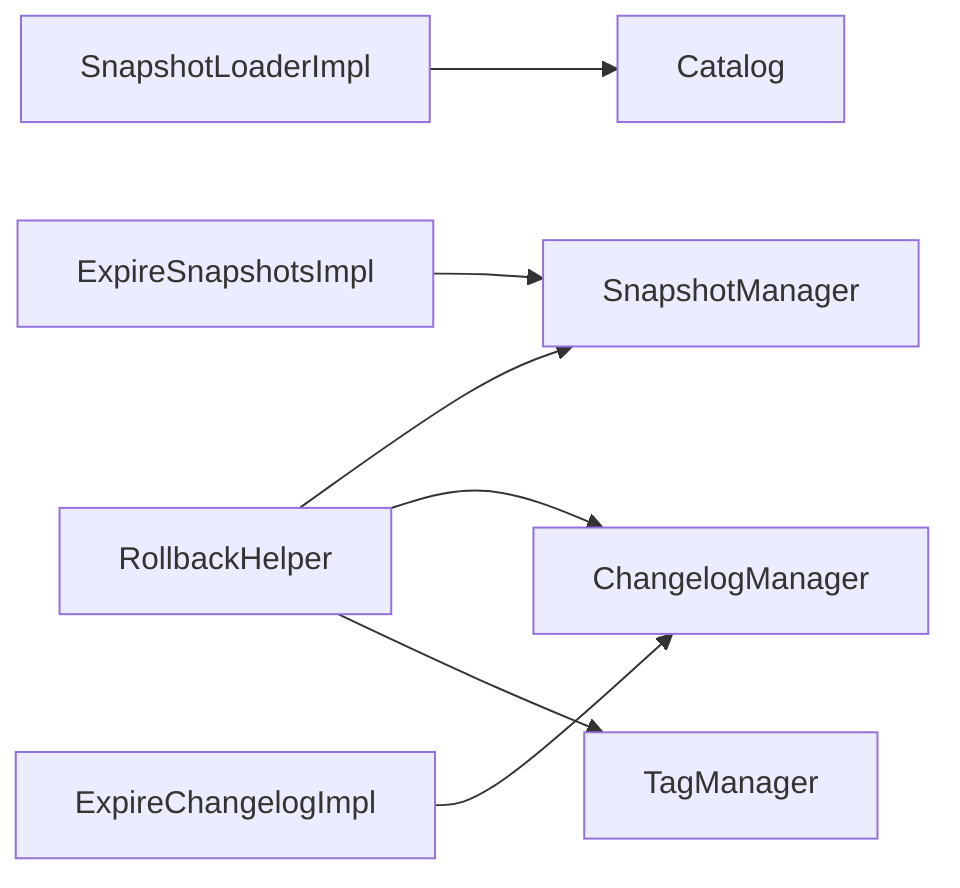

# 快照管理

<cite>
**本文引用的文件**
- [manage-snapshots.md](file://docs/content/maintenance/manage-snapshots.md)
- [SnapshotLoader.java](file://paimon-core/src/main/java/org/apache/paimon/utils/SnapshotLoader.java)
- [SnapshotLoaderImpl.java](file://paimon-core/src/main/java/org/apache/paimon/tag/SnapshotLoaderImpl.java)
- [RollbackHelper.java](file://paimon-core/src/main/java/org/apache/paimon/table/RollbackHelper.java)
- [ExpireSnapshotsImpl.java](file://paimon-core/src/main/java/org/apache/paimon/table/ExpireSnapshotsImpl.java)
- [ExpireChangelogImpl.java](file://paimon-core/src/main/java/org/apache/paimon/table/ExpireChangelogImpl.java)
- [Catalog.java](file://paimon-core/src/main/java/org/apache/paimon/catalog/Catalog.java)
- [RollbackToAction.java](file://paimon-flink/paimon-flink-common/src/main/java/org/apache/paimon/flink/action/RollbackToAction.java)
- [rest_catalog_test.py](file://paimon-python/pypaimon/tests/rest/rest_catalog_test.py)
- [SnapshotManagerTest.java](file://paimon-core/src/test/java/org/apache/paimon/utils/SnapshotManagerTest.java)
</cite>

## 目录
1. [简介](#简介)
2. [项目结构](#项目结构)
3. [核心组件](#核心组件)
4. [架构总览](#架构总览)
5. [详细组件分析](#详细组件分析)
6. [依赖关系分析](#依赖关系分析)
7. [性能考量](#性能考量)
8. [故障排查指南](#故障排查指南)
9. [结论](#结论)
10. [附录](#附录)

## 简介
本文件系统化阐述 Apache Paimon 的快照（Snapshot）管理机制与运维实践，覆盖快照概念、创建与保留策略、自动过期清理、版本回滚、备份与恢复、监控与告警、故障诊断与最佳实践。内容基于仓库内官方文档与核心实现源码进行提炼，帮助读者在不同运行环境（批/流、Flink、Spark、Python 客户端等）中高效、安全地管理快照。

## 项目结构
围绕快照管理的关键目录与文件如下：
- 维护与用户文档：docs/content/maintenance/manage-snapshots.md
- 核心接口与实现：
  - utils/SnapshotLoader 接口
  - tag/SnapshotLoaderImpl 实现
  - table/RollbackHelper 回滚辅助
  - table/ExpireSnapshotsImpl 快照过期实现
  - table/ExpireChangelogImpl 变更日志过期实现
  - catalog/Catalog 加载快照与回滚接口
- 运行时动作（Flink）：flink/action/RollbackToAction
- 测试用例与示例：
  - core/test/utils/SnapshotManagerTest
  - pypaimon/tests/rest/rest_catalog_test.py

**图表来源**
- [manage-snapshots.md:1-402](file://docs/content/maintenance/manage-snapshots.md#L1-L402)
- [SnapshotLoader.java:1-36](file://paimon-core/src/main/java/org/apache/paimon/utils/SnapshotLoader.java#L1-L36)
- [SnapshotLoaderImpl.java:35-71](file://paimon-core/src/main/java/org/apache/paimon/tag/SnapshotLoaderImpl.java#L35-L71)
- [RollbackHelper.java:36-92](file://paimon-core/src/main/java/org/apache/paimon/table/RollbackHelper.java#L36-L92)
- [ExpireSnapshotsImpl.java:65-98](file://paimon-core/src/main/java/org/apache/paimon/table/ExpireSnapshotsImpl.java#L65-L98)
- [ExpireChangelogImpl.java:55-91](file://paimon-core/src/main/java/org/apache/paimon/table/ExpireChangelogImpl.java#L55-L91)
- [Catalog.java:707-725](file://paimon-core/src/main/java/org/apache/paimon/catalog/Catalog.java#L707-L725)
- [RollbackToAction.java:44-58](file://paimon-flink/paimon-flink-common/src/main/java/org/apache/paimon/flink/action/RollbackToAction.java#L44-L58)
- [SnapshotManagerTest.java:363-382](file://paimon-core/src/test/java/org/apache/paimon/utils/SnapshotManagerTest.java#L363-L382)
- [rest_catalog_test.py:275-327](file://paimon-python/pypaimon/tests/rest/rest_catalog_test.py#L275-L327)

**章节来源**
- [manage-snapshots.md:1-402](file://docs/content/maintenance/manage-snapshots.md#L1-L402)

## 核心组件
- 快照加载器接口与实现
  - SnapshotLoader：定义加载最新快照与回滚能力的统一接口。
  - SnapshotLoaderImpl：通过 Catalog 加载指定标识表的快照，并支持按分支复制加载器实例。
- 回滚辅助工具
  - RollbackHelper：负责清理大于目标快照 ID 的快照、长链变更日志与标签，并更新“最新提示”。
- 快照过期实现
  - ExpireSnapshotsImpl：根据时间保留、数量最小/最大、并发删除限制等配置执行过期清理。
  - ExpireChangelogImpl：对长生命周期变更日志进行独立过期控制。
- Catalog 接口
  - 提供按版本字符串解析（最早/最新/数字 ID/标签名）加载快照的能力。
- Flink 回滚动作
  - RollbackToAction：在本地执行回滚到指定快照 ID 或标签的动作入口。

**章节来源**
- [SnapshotLoader.java:1-36](file://paimon-core/src/main/java/org/apache/paimon/utils/SnapshotLoader.java#L1-L36)
- [SnapshotLoaderImpl.java:35-71](file://paimon-core/src/main/java/org/apache/paimon/tag/SnapshotLoaderImpl.java#L35-L71)
- [RollbackHelper.java:36-92](file://paimon-core/src/main/java/org/apache/paimon/table/RollbackHelper.java#L36-L92)
- [ExpireSnapshotsImpl.java:65-98](file://paimon-core/src/main/java/org/apache/paimon/table/ExpireSnapshotsImpl.java#L65-L98)
- [ExpireChangelogImpl.java:55-91](file://paimon-core/src/main/java/org/apache/paimon/table/ExpireChangelogImpl.java#L55-L91)
- [Catalog.java:707-725](file://paimon-core/src/main/java/org/apache/paimon/catalog/Catalog.java#L707-L725)
- [RollbackToAction.java:44-58](file://paimon-flink/paimon-flink-common/src/main/java/org/apache/paimon/flink/action/RollbackToAction.java#L44-L58)

## 架构总览
下图展示从用户/动作触发到 Catalog 执行快照加载、回滚与过期清理的整体交互。

**图表来源**
- [RollbackToAction.java:44-58](file://paimon-flink/paimon-flink-common/src/main/java/org/apache/paimon/flink/action/RollbackToAction.java#L44-L58)
- [RollbackHelper.java:55-64](file://paimon-core/src/main/java/org/apache/paimon/table/RollbackHelper.java#L55-L64)
- [SnapshotLoaderImpl.java:54-63](file://paimon-core/src/main/java/org/apache/paimon/tag/SnapshotLoaderImpl.java#L54-L63)
- [Catalog.java:707-725](file://paimon-core/src/main/java/org/apache/paimon/catalog/Catalog.java#L707-L725)

## 详细组件分析

### 快照过期策略与清理规则
- 控制参数
  - 时间保留：snapshot.time-retained
  - 最小保留数：snapshot.num-retained.min
  - 最大保留数：snapshot.num-retained.max
  - 过期执行模式：snapshot.expire.execution-mode（默认同步）
  - 单次允许过期数量上限：snapshot.expire.limit
- 过期逻辑要点
  - 当快照数量未达到最小保留数时，即使超过时间阈值也不过期。
  - 达到最小保留后，使用最大保留数与时间阈值共同约束。
  - 支持异步过期以避免写入背压，但批任务不建议使用异步模式。
- 示例表格说明了在不同时间点新增快照后的过期结果与触发条件。

**图表来源**
- [manage-snapshots.md:31-86](file://docs/content/maintenance/manage-snapshots.md#L31-L86)
- [manage-snapshots.md:88-212](file://docs/content/maintenance/manage-snapshots.md#L88-L212)

**章节来源**
- [manage-snapshots.md:31-86](file://docs/content/maintenance/manage-snapshots.md#L31-L86)
- [manage-snapshots.md:88-212](file://docs/content/maintenance/manage-snapshots.md#L88-L212)

### 快照加载与版本解析
- 版本解析顺序
  - EARLIEST：最早快照
  - LATEST：最新快照
  - 数字：按快照 ID
  - 其他：按标签名
- 加载路径
  - SnapshotLoaderImpl 通过 Catalog.loadSnapshot 获取快照；支持分支复制。

**图表来源**
- [SnapshotLoaderImpl.java:44-52](file://paimon-core/src/main/java/org/apache/paimon/tag/SnapshotLoaderImpl.java#L44-L52)
- [Catalog.java:707-725](file://paimon-core/src/main/java/org/apache/paimon/catalog/Catalog.java#L707-L725)

**章节来源**
- [SnapshotLoaderImpl.java:35-71](file://paimon-core/src/main/java/org/apache/paimon/tag/SnapshotLoaderImpl.java#L35-L71)
- [Catalog.java:707-725](file://paimon-core/src/main/java/org/apache/paimon/catalog/Catalog.java#L707-L725)

### 版本回滚流程与安全校验
- 回滚入口
  - Flink 动作：RollbackToAction 支持按数字 ID 或标签名回滚。
  - Java API：Table.rollbackTo 支持按 ID 或标签名。
- 回滚过程
  - RollbackHelper.cleanLargerThan：清理大于目标快照 ID 的快照、长生命周期变更日志与标签，并更新“最新提示”。
  - 若目标快照不存在且早于当前最早快照，会写入目标快照文件并更新最早提示，确保可回溯性。
- 安全校验
  - Python REST 测试展示了“从快照”校验：若当前最新快照与传入 from_snapshot 不一致则拒绝回滚，防止并发回滚导致的数据不一致。

**图表来源**
- [RollbackToAction.java:44-58](file://paimon-flink/paimon-flink-common/src/main/java/org/apache/paimon/flink/action/RollbackToAction.java#L44-L58)
- [RollbackHelper.java:55-82](file://paimon-core/src/main/java/org/apache/paimon/table/RollbackHelper.java#L55-L82)
- [rest_catalog_test.py:74-100](file://paimon-python/pypaimon/tests/rest/rest_catalog_test.py#L74-L100)

**章节来源**
- [RollbackToAction.java:44-58](file://paimon-flink/paimon-flink-common/src/main/java/org/apache/paimon/flink/action/RollbackToAction.java#L44-L58)
- [RollbackHelper.java:36-92](file://paimon-core/src/main/java/org/apache/paimon/table/RollbackHelper.java#L36-L92)
- [rest_catalog_test.py:74-100](file://paimon-python/pypaimon/tests/rest/rest_catalog_test.py#L74-L100)

### 快照过期实现细节
- ExpireSnapshotsImpl
  - 依据配置计算“早于时间点”，遍历并删除满足条件的快照，受最大删除数量限制。
  - 支持与变更日志解耦模式配合。
- ExpireChangelogImpl
  - 对长生命周期变更日志进行独立过期，确保与快照过期策略解耦。

**图表来源**
- [ExpireSnapshotsImpl.java:65-98](file://paimon-core/src/main/java/org/apache/paimon/table/ExpireSnapshotsImpl.java#L65-L98)
- [ExpireChangelogImpl.java:55-91](file://paimon-core/src/main/java/org/apache/paimon/table/ExpireChangelogImpl.java#L55-L91)

**章节来源**
- [ExpireSnapshotsImpl.java:65-98](file://paimon-core/src/main/java/org/apache/paimon/table/ExpireSnapshotsImpl.java#L65-L98)
- [ExpireChangelogImpl.java:55-91](file://paimon-core/src/main/java/org/apache/paimon/table/ExpireChangelogImpl.java#L55-L91)

### 快照备份与恢复策略
- 备份思路
  - 全量备份：冻结写入后导出当前快照及其元数据文件，结合底层存储的全量导出。
  - 增量备份：仅导出自上次备份以来新增或变更的快照文件与数据文件清单，定期合并。
- 恢复步骤
  - 将备份的快照文件与数据文件恢复至目标存储。
  - 在 Catalog 中重建/恢复对应表的快照索引与提示文件，确保“最早/最新”提示正确。
  - 验证恢复后查询一致性与时间旅行可用性。
- 注意事项
  - 备份期间需避免写入导致快照 ID 连续性破坏。
  - 恢复后验证消费者位点与分区信息，确保流式作业可从正确快照重启。

[本节为通用方案说明，不直接分析具体源码文件]

### 快照监控与告警配置
- 关键指标
  - 快照数量趋势、最早/最新快照 ID、过期删除数量、异步过期延迟。
- 告警阈值
  - 快照数量长期低于最小保留导致无法回滚；
  - 过期失败或删除数量异常为零；
  - 异步过期长时间未完成。
- 建议手段
  - 使用运行时指标采集器暴露快照相关计数器；
  - 结合调度系统设置阈值告警与自动修复（如触发手动过期）。

[本节为通用方案说明，不直接分析具体源码文件]

### 故障诊断与处理
- 常见问题
  - 回滚失败：目标快照不存在或早于最早快照；from_snapshot 校验不通过。
  - 过期不生效：保留策略配置不当或异步模式未完成。
  - 文件泄漏：意外中断导致孤儿文件。
- 处理建议
  - 使用手动过期动作强制清理超限快照；
  - 启动 remove_orphan_files 任务清理孤儿文件；
  - 在批任务中禁用异步过期，确保一次性完成。

**章节来源**
- [manage-snapshots.md:231-281](file://docs/content/maintenance/manage-snapshots.md#L231-L281)
- [manage-snapshots.md:355-402](file://docs/content/maintenance/manage-snapshots.md#L355-L402)
- [rest_catalog_test.py:74-100](file://paimon-python/pypaimon/tests/rest/rest_catalog_test.py#L74-L100)

## 依赖关系分析
- 组件耦合
  - SnapshotLoaderImpl 依赖 Catalog 接口；Catalog 再依赖 SnapshotManager 等内部管理器。
  - RollbackHelper 依赖 SnapshotManager、ChangelogManager、TagManager，形成回滚清理闭环。
  - ExpireSnapshotsImpl 与 ExpireChangelogImpl 分别依赖 SnapshotManager 与 ChangelogManager。
- 外部依赖
  - 文件系统 IO 由 FileIO 提供，过期删除通过 SnapshotDeletion 等组件执行。
- 循环依赖
  - 未发现循环依赖；各组件职责清晰，接口边界明确。

**图表来源**
- [SnapshotLoaderImpl.java:35-71](file://paimon-core/src/main/java/org/apache/paimon/tag/SnapshotLoaderImpl.java#L35-L71)
- [RollbackHelper.java:36-53](file://paimon-core/src/main/java/org/apache/paimon/table/RollbackHelper.java#L36-L53)
- [ExpireSnapshotsImpl.java:65-83](file://paimon-core/src/main/java/org/apache/paimon/table/ExpireSnapshotsImpl.java#L65-L83)
- [ExpireChangelogImpl.java:55-71](file://paimon-core/src/main/java/org/apache/paimon/table/ExpireChangelogImpl.java#L55-L71)

**章节来源**
- [SnapshotLoaderImpl.java:35-71](file://paimon-core/src/main/java/org/apache/paimon/tag/SnapshotLoaderImpl.java#L35-L71)
- [RollbackHelper.java:36-53](file://paimon-core/src/main/java/org/apache/paimon/table/RollbackHelper.java#L36-L53)
- [ExpireSnapshotsImpl.java:65-83](file://paimon-core/src/main/java/org/apache/paimon/table/ExpireSnapshotsImpl.java#L65-L83)
- [ExpireChangelogImpl.java:55-71](file://paimon-core/src/main/java/org/apache/paimon/table/ExpireChangelogImpl.java#L55-L71)

## 性能考量
- 过期执行模式
  - 默认同步：简单可靠，大批量删除可能造成写入背压。
  - 异步：降低写入阻塞风险，但需确保任务稳定性与完成度。
- 删除上限与并发
  - 通过 snapshot.expire.limit 控制单次删除数量，避免一次性删除过多文件引发抖动。
- 长生命周期变更日志
  - 与快照解耦过期，减少回滚与清理对变更日志的影响。

[本节提供通用指导，不直接分析具体源码文件]

## 故障排查指南
- 回滚失败
  - 检查目标快照是否存在与是否早于最早快照；确认 from_snapshot 与当前最新快照一致。
- 过期不生效
  - 校验保留策略配置与时间阈值；确认执行模式与 limit 设置；观察异步任务状态。
- 孤儿文件
  - 使用 remove_orphan_files 任务清理；注意 older_than 参数避免误删新文件。

**章节来源**
- [rest_catalog_test.py:74-100](file://paimon-python/pypaimon/tests/rest/rest_catalog_test.py#L74-L100)
- [manage-snapshots.md:231-281](file://docs/content/maintenance/manage-snapshots.md#L231-L281)
- [manage-snapshots.md:355-402](file://docs/content/maintenance/manage-snapshots.md#L355-L402)

## 结论
快照管理是 Paimon 数据一致性与空间回收的核心机制。通过合理的保留策略、安全的回滚流程、可靠的过期与清理机制以及完善的监控告警，可以在保证数据可回溯与查询稳定性的前提下，持续释放存储空间并提升整体性能。建议在生产环境中结合业务场景调整保留策略与执行模式，并建立自动化运维与故障处置流程。

## 附录
- 快照加载与回滚的端到端调用参考路径
  - [SnapshotLoaderImpl.java:44-52](file://paimon-core/src/main/java/org/apache/paimon/tag/SnapshotLoaderImpl.java#L44-L52)
  - [Catalog.java:707-725](file://paimon-core/src/main/java/org/apache/paimon/catalog/Catalog.java#L707-L725)
  - [RollbackHelper.java:55-82](file://paimon-core/src/main/java/org/apache/paimon/table/RollbackHelper.java#L55-L82)
  - [RollbackToAction.java:44-58](file://paimon-flink/paimon-flink-common/src/main/java/org/apache/paimon/flink/action/RollbackToAction.java#L44-L58)
- 过期实现参考路径
  - [ExpireSnapshotsImpl.java:91-98](file://paimon-core/src/main/java/org/apache/paimon/table/ExpireSnapshotsImpl.java#L91-L98)
  - [ExpireChangelogImpl.java:80-91](file://paimon-core/src/main/java/org/apache/paimon/table/ExpireChangelogImpl.java#L80-L91)
- 文档参考路径
  - [manage-snapshots.md:31-402](file://docs/content/maintenance/manage-snapshots.md#L31-L402)