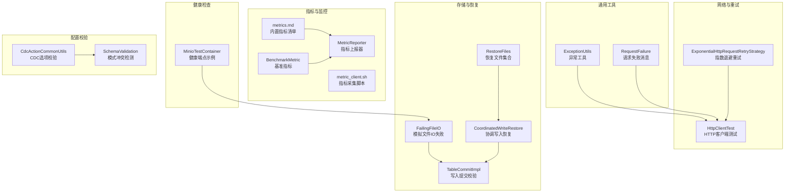
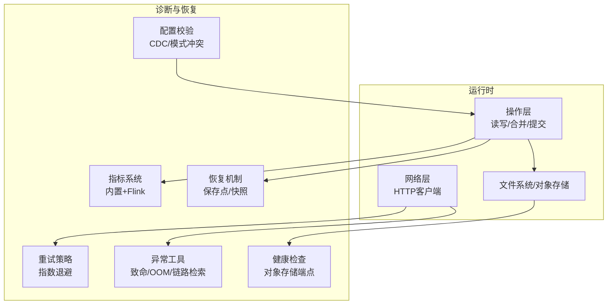
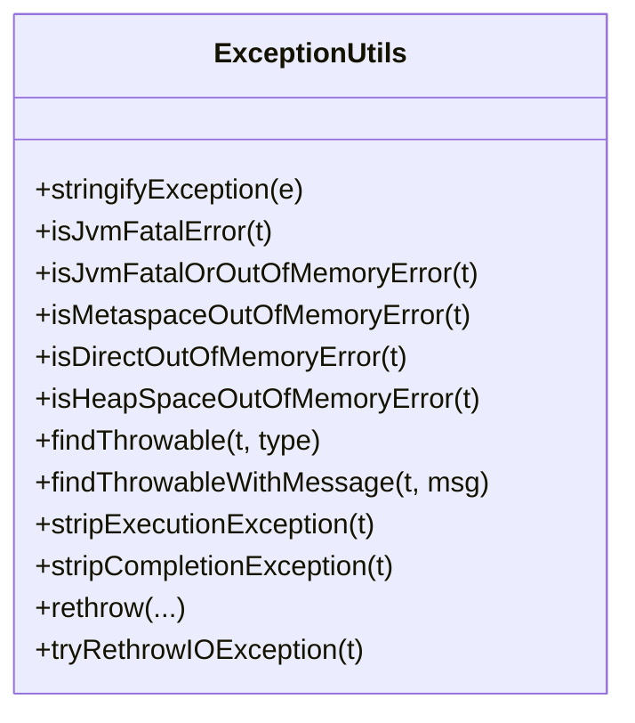
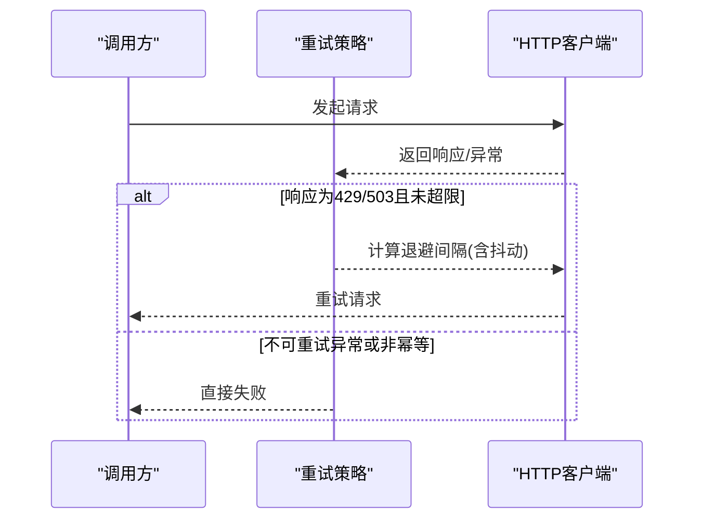
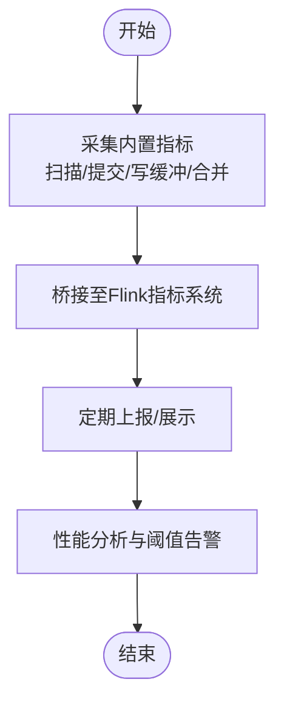
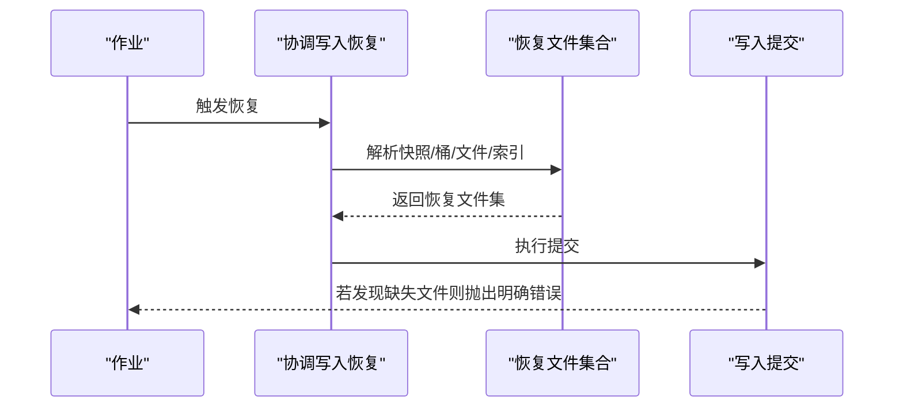
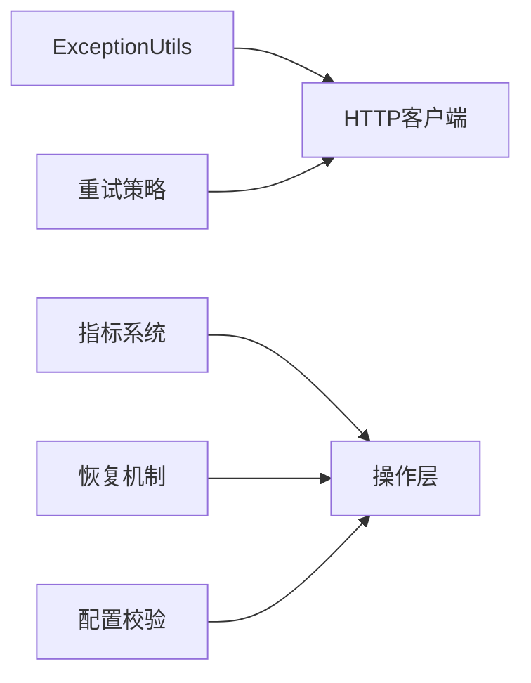
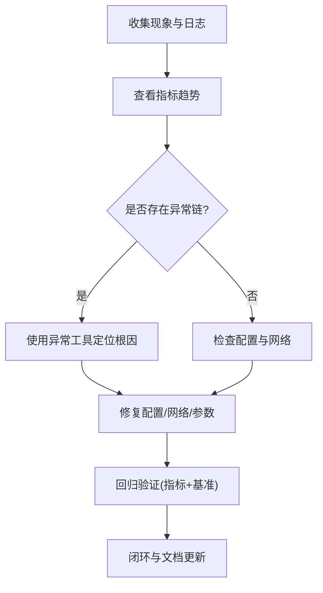

# 故障诊断

<cite>
**本文引用的文件**
- [ExceptionUtils.java](file://paimon-common/src/main/java/org/apache/paimon/utils/ExceptionUtils.java)
- [ExponentialHttpRequestRetryStrategy.java](file://paimon-api/src/main/java/org/apache/paimon/rest/ExponentialHttpRequestRetryStrategy.java)
- [TestExponentialHttpRequestRetryStrategy.java](file://paimon-api/src/test/java/org/apache/paimon/rest/TestExponentialHttpRequestRetryStrategy.java)
- [metrics.md](file://docs/content/maintenance/metrics.md)
- [BenchmarkMetric.java](file://paimon-benchmark/paimon-cluster-benchmark/src/main/java/org/apache/paimon/benchmark/metric/BenchmarkMetric.java)
- [MetricReporter.java](file://paimon-benchmark/paimon-cluster-benchmark/src/main/java/org/apache/paimon/benchmark/metric/MetricReporter.java)
- [metric_client.sh](file://paimon-benchmark/paimon-cluster-benchmark/src/main/resources/bin/metric_client.sh)
- [RestoreFiles.java](file://paimon-core/src/main/java/org/apache/paimon/operation/RestoreFiles.java)
- [CoordinatedWriteRestore.java](file://paimon-flink/paimon-flink-common/src/main/java/org/apache/paimon/flink/sink/coordinator/CoordinatedWriteRestore.java)
- [TableCommitImpl.java](file://paimon-core/src/main/java/org/apache/paimon/table/sink/TableCommitImpl.java)
- [FailingFileIO.java](file://paimon-core/src/test/java/org/apache/paimon/utils/FailingFileIO.java)
- [SinkSavepointITCase.java](file://paimon-flink/paimon-flink-common/src/test/java/org/apache/paimon/flink/sink/SinkSavepointITCase.java)
- [FlinkJobRecoveryITCase.java](file://paimon-flink/paimon-flink-common/src/test/java/org/apache/paimon/flink/FlinkJobRecoveryITCase.java)
- [MinioTestContainer.java](file://paimon-filesystems/paimon-s3/src/test/java/org/apache/paimon/s3/MinioTestContainer.java)
- [client.py](file://paimon-python/pypaimon/api/client.py)
- [HttpClientTest.java](file://paimon-core/src/test/java/org/apache/paimon/rest/HttpClientTest.java)
- [CdcActionCommonUtils.java](file://paimon-flink/paimon-flink-cdc/src/main/java/org/apache/paimon/flink/action/cdc/CdcActionCommonUtils.java)
- [SchemaValidation.java](file://paimon-core/src/main/java/org/apache/paimon/schema/SchemaValidation.java)
- [RequestFailure.java](file://paimon-service/paimon-service-client/src/main/java/org/apache/paimon/service/network/messages/RequestFailure.java)
</cite>

## 目录
1. [简介](#简介)
2. [项目结构](#项目结构)
3. [核心组件](#核心组件)
4. [架构总览](#架构总览)
5. [详细组件分析](#详细组件分析)
6. [依赖分析](#依赖分析)
7. [性能考量](#性能考量)
8. [故障排查指南](#故障排查指南)
9. [结论](#结论)
10. [附录](#附录)

## 简介
本文件面向运维与开发工程师，系统化梳理 Apache Paimon 在运行期可能遇到的故障类型与处置流程，覆盖存储故障、网络故障、配置故障等，并结合代码实现给出可操作的诊断方法（日志分析、指标观测、重试策略、保存点恢复）、应急处理步骤（数据恢复、系统重启、配置修复）以及预防策略（健康检查、容量规划、备份策略）。文档同时提供标准化流程与最佳实践，帮助快速定位根因并闭环问题。

## 项目结构
围绕“故障诊断”主题，相关能力主要分布在以下模块：
- 异常与错误处理：通用异常工具、REST 客户端错误处理
- 指标体系：内置指标清单、桥接 Flink 指标、基准测试指标采集
- 网络与重试：指数退避重试策略、HTTP 错误响应处理
- 存储与恢复：文件系统模拟失败、保存点/快照恢复、写入提交校验
- 健康检查：对象存储健康端点示例
- 配置校验：CDC 选项校验、冲突检测

图表来源
- [ExceptionUtils.java:420-584](file://paimon-common/src/main/java/org/apache/paimon/utils/ExceptionUtils.java#L420-L584)
- [ExponentialHttpRequestRetryStrategy.java:54-133](file://paimon-api/src/main/java/org/apache/paimon/rest/ExponentialHttpRequestRetryStrategy.java#L54-L133)
- [metrics.md:427-465](file://docs/content/maintenance/metrics.md#L427-L465)
- [BenchmarkMetric.java:1-40](file://paimon-benchmark/paimon-cluster-benchmark/src/main/java/org/apache/paimon/benchmark/metric/BenchmarkMetric.java#L1-L40)
- [MetricReporter.java:133-164](file://paimon-benchmark/paimon-cluster-benchmark/src/main/java/org/apache/paimon/benchmark/metric/MetricReporter.java#L133-L164)
- [metric_client.sh:1-31](file://paimon-benchmark/paimon-cluster-benchmark/src/main/resources/bin/metric_client.sh#L1-L31)
- [FailingFileIO.java:31-221](file://paimon-core/src/test/java/org/apache/paimon/utils/FailingFileIO.java#L31-L221)
- [RestoreFiles.java:1-80](file://paimon-core/src/main/java/org/apache/paimon/operation/RestoreFiles.java#L1-L80)
- [CoordinatedWriteRestore.java:100-117](file://paimon-flink/paimon-flink-common/src/main/java/org/apache/paimon/flink/sink/coordinator/CoordinatedWriteRestore.java#L100-L117)
- [TableCommitImpl.java:344-363](file://paimon-core/src/main/java/org/apache/paimon/table/sink/TableCommitImpl.java#L344-L363)
- [MinioTestContainer.java:50-82](file://paimon-filesystems/paimon-s3/src/test/java/org/apache/paimon/s3/MinioTestContainer.java#L50-L82)
- [CdcActionCommonUtils.java:322-343](file://paimon-flink/paimon-flink-cdc/src/main/java/org/apache/paimon/flink/action/cdc/CdcActionCommonUtils.java#L322-L343)
- [SchemaValidation.java:453-468](file://paimon-core/src/main/java/org/apache/paimon/schema/SchemaValidation.java#L453-L468)

章节来源
- [metrics.md:1-465](file://docs/content/maintenance/metrics.md#L1-L465)
- [ExponentialHttpRequestRetryStrategy.java:54-133](file://paimon-api/src/main/java/org/apache/paimon/rest/ExponentialHttpRequestRetryStrategy.java#L54-L133)
- [FailingFileIO.java:31-221](file://paimon-core/src/test/java/org/apache/paimon/utils/FailingFileIO.java#L31-L221)
- [RestoreFiles.java:1-80](file://paimon-core/src/main/java/org/apache/paimon/operation/RestoreFiles.java#L1-L80)
- [CoordinatedWriteRestore.java:100-117](file://paimon-flink/paimon-flink-common/src/main/java/org/apache/paimon/flink/sink/coordinator/CoordinatedWriteRestore.java#L100-L117)
- [TableCommitImpl.java:344-363](file://paimon-core/src/main/java/org/apache/paimon/table/sink/TableCommitImpl.java#L344-L363)
- [MinioTestContainer.java:50-82](file://paimon-filesystems/paimon-s3/src/test/java/org/apache/paimon/s3/MinioTestContainer.java#L50-L82)
- [CdcActionCommonUtils.java:322-343](file://paimon-flink/paimon-flink-cdc/src/main/java/org/apache/paimon/flink/action/cdc/CdcActionCommonUtils.java#L322-L343)
- [SchemaValidation.java:453-468](file://paimon-core/src/main/java/org/apache/paimon/schema/SchemaValidation.java#L453-L468)

## 核心组件
- 异常与错误处理：提供 JVM 致命错误判定、OOM 类型识别、异常链检索、异常包装与剥离等能力，支撑统一的错误传播与诊断。
- 指标体系：内置扫描、提交、写缓冲、合并等指标；桥接 Flink 指标；基准测试指标采集与上报。
- 网络与重试：指数退避重试策略，支持 429/503 等可重试状态码与 Retry-After 头；对不可重试异常进行明确排除。
- 存储与恢复：通过模拟文件 IO 失败验证容错；保存点/快照恢复路径与提交阶段校验；协调写入恢复。
- 健康检查：对象存储健康端点示例，便于容器化环境的就绪探测。
- 配置校验：CDC 选项必填/互斥校验、模式冲突检测，降低配置类故障概率。

章节来源
- [ExceptionUtils.java:420-584](file://paimon-common/src/main/java/org/apache/paimon/utils/ExceptionUtils.java#L420-L584)
- [metrics.md:42-318](file://docs/content/maintenance/metrics.md#L42-L318)
- [ExponentialHttpRequestRetryStrategy.java:54-133](file://paimon-api/src/main/java/org/apache/paimon/rest/ExponentialHttpRequestRetryStrategy.java#L54-L133)
- [FailingFileIO.java:31-221](file://paimon-core/src/test/java/org/apache/paimon/utils/FailingFileIO.java#L31-L221)
- [RestoreFiles.java:1-80](file://paimon-core/src/main/java/org/apache/paimon/operation/RestoreFiles.java#L1-L80)
- [CoordinatedWriteRestore.java:100-117](file://paimon-flink/paimon-flink-common/src/main/java/org/apache/paimon/flink/sink/coordinator/CoordinatedWriteRestore.java#L100-L117)
- [TableCommitImpl.java:344-363](file://paimon-core/src/main/java/org/apache/paimon/table/sink/TableCommitImpl.java#L344-L363)
- [MinioTestContainer.java:50-82](file://paimon-filesystems/paimon-s3/src/test/java/org/apache/paimon/s3/MinioTestContainer.java#L50-L82)
- [CdcActionCommonUtils.java:322-343](file://paimon-flink/paimon-flink-cdc/src/main/java/org/apache/paimon/flink/action/cdc/CdcActionCommonUtils.java#L322-L343)
- [SchemaValidation.java:453-468](file://paimon-core/src/main/java/org/apache/paimon/schema/SchemaValidation.java#L453-L468)

## 架构总览
下图展示“故障诊断”相关的关键交互：指标采集与上报、网络重试与错误处理、存储层容错与恢复、配置校验与健康检查。

图表来源
- [metrics.md:42-318](file://docs/content/maintenance/metrics.md#L42-L318)
- [ExponentialHttpRequestRetryStrategy.java:54-133](file://paimon-api/src/main/java/org/apache/paimon/rest/ExponentialHttpRequestRetryStrategy.java#L54-L133)
- [ExceptionUtils.java:420-584](file://paimon-common/src/main/java/org/apache/paimon/utils/ExceptionUtils.java#L420-L584)
- [RestoreFiles.java:1-80](file://paimon-core/src/main/java/org/apache/paimon/operation/RestoreFiles.java#L1-L80)
- [MinioTestContainer.java:50-82](file://paimon-filesystems/paimon-s3/src/test/java/org/apache/paimon/s3/MinioTestContainer.java#L50-L82)
- [CdcActionCommonUtils.java:322-343](file://paimon-flink/paimon-flink-cdc/src/main/java/org/apache/paimon/flink/action/cdc/CdcActionCommonUtils.java#L322-L343)

## 详细组件分析

### 组件A：异常与错误处理（ExceptionUtils）
- 能力要点
  - 致命 JVM 错误识别（InternalError/UnknownError/ThreadDeath）
  - OOM 类型识别（元空间/直接内存/堆空间）
  - 异常链检索与断言（按类型、谓词、消息）
  - 异常包装与剥离（ExecutionException/CompletionException）
  - 中断异常处理与多异常聚合
- 诊断价值
  - 快速判断是否需要进程级重启（致命错误/OOM）
  - 定位异常根因链，避免忽略深层异常
  - 统一错误传播，减少重复封装带来的信息丢失

图表来源
- [ExceptionUtils.java:420-584](file://paimon-common/src/main/java/org/apache/paimon/utils/ExceptionUtils.java#L420-L584)

章节来源
- [ExceptionUtils.java:420-584](file://paimon-common/src/main/java/org/apache/paimon/utils/ExceptionUtils.java#L420-L584)

### 组件B：网络与重试（指数退避）
- 能力要点
  - 可配置最大重试次数
  - 支持 429/503 状态码重试，尊重 Retry-After 头
  - 对不可重试异常（连接中断、SSL、未知主机等）直接拒绝
  - 幂等请求才触发重试（GET/HEAD 等）
- 诊断价值
  - 明确哪些错误应自动重试，哪些应立即失败
  - 通过指数退避缓解上游压力，避免雪崩
  - 通过测试用例覆盖典型场景，便于回归验证

图表来源
- [ExponentialHttpRequestRetryStrategy.java:54-133](file://paimon-api/src/main/java/org/apache/paimon/rest/ExponentialHttpRequestRetryStrategy.java#L54-L133)
- [TestExponentialHttpRequestRetryStrategy.java:32-223](file://paimon-api/src/test/java/org/apache/paimon/rest/TestExponentialHttpRequestRetryStrategy.java#L32-L223)

章节来源
- [ExponentialHttpRequestRetryStrategy.java:54-133](file://paimon-api/src/main/java/org/apache/paimon/rest/ExponentialHttpRequestRetryStrategy.java#L54-L133)
- [TestExponentialHttpRequestRetryStrategy.java:32-223](file://paimon-api/src/test/java/org/apache/paimon/rest/TestExponentialHttpRequestRetryStrategy.java#L32-L223)

### 组件C：指标体系与性能分析
- 能力要点
  - 内置指标：扫描耗时/文件数、提交耗时/尝试次数、写缓冲使用、合并线程繁忙度等
  - 桥接 Flink：按作用域与 infix 组合定位指标
  - 基准测试指标：RPS、总行数、CPU、数据新鲜度
  - 指标采集脚本：启动/停止指标客户端
- 诊断价值
  - 快速定位写入瓶颈（缓冲、合并、提交）
  - 评估查询性能（扫描耗时分布）
  - 结合外部监控平台进行趋势分析与告警

图表来源
- [metrics.md:42-318](file://docs/content/maintenance/metrics.md#L42-L318)
- [BenchmarkMetric.java:1-40](file://paimon-benchmark/paimon-cluster-benchmark/src/main/java/org/apache/paimon/benchmark/metric/BenchmarkMetric.java#L1-L40)
- [MetricReporter.java:133-164](file://paimon-benchmark/paimon-cluster-benchmark/src/main/java/org/apache/paimon/benchmark/metric/MetricReporter.java#L133-L164)
- [metric_client.sh:1-31](file://paimon-benchmark/paimon-cluster-benchmark/src/main/resources/bin/metric_client.sh#L1-L31)

章节来源
- [metrics.md:42-318](file://docs/content/maintenance/metrics.md#L42-L318)
- [BenchmarkMetric.java:1-40](file://paimon-benchmark/paimon-cluster-benchmark/src/main/java/org/apache/paimon/benchmark/metric/BenchmarkMetric.java#L1-L40)
- [MetricReporter.java:133-164](file://paimon-benchmark/paimon-cluster-benchmark/src/main/java/org/apache/paimon/benchmark/metric/MetricReporter.java#L133-L164)
- [metric_client.sh:1-31](file://paimon-benchmark/paimon-cluster-benchmark/src/main/resources/bin/metric_client.sh#L1-L31)

### 组件D：存储与恢复（保存点/快照）
- 能力要点
  - 模拟文件 IO 失败，验证组件在异常下的稳定性
  - 保存点/快照恢复：提取快照、桶数、数据文件、索引文件
  - 提交阶段校验：若需重提交的文件已不存在则直接报错，避免脏恢复
- 诊断价值
  - 通过失败注入验证容错路径
  - 保存点恢复失败时，快速定位“过旧保存点导致文件缺失”的问题
  - 协调写入恢复确保状态一致性

图表来源
- [CoordinatedWriteRestore.java:100-117](file://paimon-flink/paimon-flink-common/src/main/java/org/apache/paimon/flink/sink/coordinator/CoordinatedWriteRestore.java#L100-L117)
- [RestoreFiles.java:1-80](file://paimon-core/src/main/java/org/apache/paimon/operation/RestoreFiles.java#L1-L80)
- [TableCommitImpl.java:344-363](file://paimon-core/src/main/java/org/apache/paimon/table/sink/TableCommitImpl.java#L344-L363)

章节来源
- [FailingFileIO.java:31-221](file://paimon-core/src/test/java/org/apache/paimon/utils/FailingFileIO.java#L31-L221)
- [CoordinatedWriteRestore.java:100-117](file://paimon-flink/paimon-flink-common/src/main/java/org/apache/paimon/flink/sink/coordinator/CoordinatedWriteRestore.java#L100-L117)
- [RestoreFiles.java:1-80](file://paimon-core/src/main/java/org/apache/paimon/operation/RestoreFiles.java#L1-L80)
- [TableCommitImpl.java:344-363](file://paimon-core/src/main/java/org/apache/paimon/table/sink/TableCommitImpl.java#L344-L363)

### 组件E：健康检查（对象存储）
- 能力要点
  - 使用健康端点进行就绪探测（如 MinIO 的 /minio/health/ready）
  - 启动等待策略，确保依赖服务可用后再启动业务
- 诊断价值
  - 容器化部署中快速发现存储依赖异常
  - 与编排系统联动，避免业务在存储未就绪时启动

章节来源
- [MinioTestContainer.java:50-82](file://paimon-filesystems/paimon-s3/src/test/java/org/apache/paimon/s3/MinioTestContainer.java#L50-L82)

### 组件F：配置校验（CDC/模式）
- 能力要点
  - CDC 选项：必填项校验、互斥项校验
  - 模式冲突：当设置某选项时，禁止同时设置另一些选项
- 诊断价值
  - 在作业启动前暴露配置问题，避免运行期反复失败
  - 降低因配置不当导致的数据不一致风险

章节来源
- [CdcActionCommonUtils.java:322-343](file://paimon-flink/paimon-flink-cdc/src/main/java/org/apache/paimon/flink/action/cdc/CdcActionCommonUtils.java#L322-L343)
- [SchemaValidation.java:453-468](file://paimon-core/src/main/java/org/apache/paimon/schema/SchemaValidation.java#L453-L468)

## 依赖分析
- 组件耦合
  - 指标系统与引擎解耦，通过桥接层接入 Flink
  - 重试策略独立于具体 HTTP 客户端，便于替换与测试
  - 异常工具为全局共享，避免各模块重复实现
- 关键依赖链
  - 写入提交 → 恢复文件解析 → 文件存在性校验 → 失败即终止
  - 网络请求 → 重试策略 → 异常工具（OOM/致命错误）→ 上报/重启
- 潜在循环依赖
  - 当前模块间以工具类与接口为主，未见明显循环导入

图表来源
- [ExceptionUtils.java:420-584](file://paimon-common/src/main/java/org/apache/paimon/utils/ExceptionUtils.java#L420-L584)
- [ExponentialHttpRequestRetryStrategy.java:54-133](file://paimon-api/src/main/java/org/apache/paimon/rest/ExponentialHttpRequestRetryStrategy.java#L54-L133)
- [metrics.md:42-318](file://docs/content/maintenance/metrics.md#L42-L318)
- [RestoreFiles.java:1-80](file://paimon-core/src/main/java/org/apache/paimon/operation/RestoreFiles.java#L1-L80)
- [CdcActionCommonUtils.java:322-343](file://paimon-flink/paimon-flink-cdc/src/main/java/org/apache/paimon/flink/action/cdc/CdcActionCommonUtils.java#L322-L343)

章节来源
- [ExceptionUtils.java:420-584](file://paimon-common/src/main/java/org/apache/paimon/utils/ExceptionUtils.java#L420-L584)
- [ExponentialHttpRequestRetryStrategy.java:54-133](file://paimon-api/src/main/java/org/apache/paimon/rest/ExponentialHttpRequestRetryStrategy.java#L54-L133)
- [metrics.md:42-318](file://docs/content/maintenance/metrics.md#L42-L318)
- [RestoreFiles.java:1-80](file://paimon-core/src/main/java/org/apache/paimon/operation/RestoreFiles.java#L1-L80)
- [CdcActionCommonUtils.java:322-343](file://paimon-flink/paimon-flink-cdc/src/main/java/org/apache/paimon/flink/action/cdc/CdcActionCommonUtils.java#L322-L343)

## 性能考量
- 指标维度
  - 扫描耗时分布（Histogram）用于识别慢查询
  - 提交耗时与尝试次数（Gauge/Counter）用于评估写入压力
  - 合并线程繁忙度与排序缓冲使用率（Gauge）用于判断合并瓶颈
- 基准测试
  - RPS/总行数/CPU/数据新鲜度指标用于对比不同配置/版本的性能差异
- 建议
  - 结合外部监控平台设置阈值告警
  - 对高并发写入场景优化合并参数与写缓冲大小

章节来源
- [metrics.md:42-318](file://docs/content/maintenance/metrics.md#L42-L318)
- [BenchmarkMetric.java:1-40](file://paimon-benchmark/paimon-cluster-benchmark/src/main/java/org/apache/paimon/benchmark/metric/BenchmarkMetric.java#L1-L40)
- [MetricReporter.java:133-164](file://paimon-benchmark/paimon-cluster-benchmark/src/main/java/org/apache/paimon/benchmark/metric/MetricReporter.java#L133-L164)

## 故障排查指南

### 1. 常见故障类型与识别
- 存储故障
  - 表现：文件读写失败、保存点恢复失败、提交阶段发现缺失文件
  - 识别：通过模拟 IO 失败验证容错；提交阶段显式报错提示“文件已被删除”
- 网络故障
  - 表现：HTTP 请求频繁 503/429、连接中断、SSL 失败
  - 识别：重试策略对不可重试异常直接失败；指数退避缓解上游压力
- 配置故障
  - 表现：CDC 选项缺失或互斥、模式冲突导致建表/变更失败
  - 识别：启动前进行选项校验与冲突检测

章节来源
- [FailingFileIO.java:31-221](file://paimon-core/src/test/java/org/apache/paimon/utils/FailingFileIO.java#L31-L221)
- [TableCommitImpl.java:344-363](file://paimon-core/src/main/java/org/apache/paimon/table/sink/TableCommitImpl.java#L344-L363)
- [ExponentialHttpRequestRetryStrategy.java:54-133](file://paimon-api/src/main/java/org/apache/paimon/rest/ExponentialHttpRequestRetryStrategy.java#L54-L133)
- [CdcActionCommonUtils.java:322-343](file://paimon-flink/paimon-flink-cdc/src/main/java/org/apache/paimon/flink/action/cdc/CdcActionCommonUtils.java#L322-L343)
- [SchemaValidation.java:453-468](file://paimon-core/src/main/java/org/apache/paimon/schema/SchemaValidation.java#L453-L468)

### 2. 故障诊断方法与工具
- 日志分析
  - 使用异常工具进行异常链检索与致命错误识别
  - 对 OOM 进行类型细化（元空间/直接内存/堆），辅助定位资源瓶颈
- 性能分析
  - 查看扫描/提交/合并/写缓冲指标，定位瓶颈环节
  - 使用基准测试指标对比不同配置的吞吐与延迟
- 网络诊断
  - 检查重试策略是否正确启用，确认幂等性与不可重试异常列表
  - 通过健康检查端点验证存储依赖可用性

章节来源
- [ExceptionUtils.java:420-584](file://paimon-common/src/main/java/org/apache/paimon/utils/ExceptionUtils.java#L420-L584)
- [metrics.md:42-318](file://docs/content/maintenance/metrics.md#L42-L318)
- [BenchmarkMetric.java:1-40](file://paimon-benchmark/paimon-cluster-benchmark/src/main/java/org/apache/paimon/benchmark/metric/BenchmarkMetric.java#L1-L40)
- [ExponentialHttpRequestRetryStrategy.java:54-133](file://paimon-api/src/main/java/org/apache/paimon/rest/ExponentialHttpRequestRetryStrategy.java#L54-L133)
- [MinioTestContainer.java:50-82](file://paimon-filesystems/paimon-s3/src/test/java/org/apache/paimon/s3/MinioTestContainer.java#L50-L82)

### 3. 故障定位流程（标准化）
- 问题复现
  - 尽可能最小化复现场景，记录关键配置与输入
  - 对存储/网络/配置分别进行隔离验证
- 根因分析
  - 先看指标趋势，再看异常链，最后核对配置
  - 对保存点恢复失败，重点检查“文件是否被清理”
- 解决方案制定
  - 优先修复配置问题与网络不稳定因素
  - 针对存储瓶颈调整合并参数与写缓冲
- 回归验证
  - 通过基准测试与指标回归验证修复效果

[本图为概念流程，无需图表来源]

### 4. 应急处理措施
- 数据恢复
  - 使用最近可用的保存点/快照进行恢复
  - 若保存点过旧导致文件缺失，回滚到更早快照或重建
- 系统重启
  - 遇到致命错误或 OOM，优先进行进程级重启
  - 重启后检查资源限制与 JVM 参数
- 配置修复
  - 修正 CDC 选项与模式冲突
  - 调整网络重试策略与幂等性要求

章节来源
- [CoordinatedWriteRestore.java:100-117](file://paimon-flink/paimon-flink-common/src/main/java/org/apache/paimon/flink/sink/coordinator/CoordinatedWriteRestore.java#L100-L117)
- [TableCommitImpl.java:344-363](file://paimon-core/src/main/java/org/apache/paimon/table/sink/TableCommitImpl.java#L344-L363)
- [ExceptionUtils.java:420-584](file://paimon-common/src/main/java/org/apache/paimon/utils/ExceptionUtils.java#L420-L584)
- [CdcActionCommonUtils.java:322-343](file://paimon-flink/paimon-flink-cdc/src/main/java/org/apache/paimon/flink/action/cdc/CdcActionCommonUtils.java#L322-L343)

### 5. 故障预防策略
- 健康检查
  - 在容器编排中加入存储健康端点探测
- 容量规划
  - 基于指标上限与增长趋势预留资源
- 备份策略
  - 定期生成快照/保存点，保留多个版本以应对回滚

章节来源
- [MinioTestContainer.java:50-82](file://paimon-filesystems/paimon-s3/src/test/java/org/apache/paimon/s3/MinioTestContainer.java#L50-L82)
- [metrics.md:42-318](file://docs/content/maintenance/metrics.md#L42-L318)

### 6. 故障案例与经验
- 保存点恢复失败
  - 现象：提交阶段提示“某些文件已被删除”
  - 根因：恢复自过旧保存点，部分未提交文件已被清理
  - 处理：回滚到更早快照或重建
- 网络抖动导致频繁 503
  - 现象：写入延迟升高、重试频繁
  - 处理：启用指数退避并合理设置最大重试次数，关注幂等性
- CDC 配置错误
  - 现象：启动时报缺少必填项或互斥项冲突
  - 处理：修正配置，确保仅设置一个互斥项

章节来源
- [TableCommitImpl.java:344-363](file://paimon-core/src/main/java/org/apache/paimon/table/sink/TableCommitImpl.java#L344-L363)
- [ExponentialHttpRequestRetryStrategy.java:54-133](file://paimon-api/src/main/java/org/apache/paimon/rest/ExponentialHttpRequestRetryStrategy.java#L54-L133)
- [CdcActionCommonUtils.java:322-343](file://paimon-flink/paimon-flink-cdc/src/main/java/org/apache/paimon/flink/action/cdc/CdcActionCommonUtils.java#L322-L343)

## 结论
通过将异常工具、指标体系、网络重试、存储恢复与健康检查有机结合，Paimon 提供了从“可观测—可诊断—可恢复—可预防”的完整故障处理闭环。遵循本文提供的标准化流程与最佳实践，可在生产环境中快速定位并解决大多数运行期故障，提升系统稳定性与可维护性。

## 附录
- 术语
  - 致命错误：JVM 内部错误/未知错误/线程死亡
  - OOM：堆外/堆内/元空间内存不足
  - 幂等请求：GET/HEAD 等可安全重试的请求
- 参考实现位置
  - 异常工具：[ExceptionUtils.java:420-584](file://paimon-common/src/main/java/org/apache/paimon/utils/ExceptionUtils.java#L420-L584)
  - 指标清单：[metrics.md:42-318](file://docs/content/maintenance/metrics.md#L42-L318)
  - 重试策略：[ExponentialHttpRequestRetryStrategy.java:54-133](file://paimon-api/src/main/java/org/apache/paimon/rest/ExponentialHttpRequestRetryStrategy.java#L54-L133)
  - 恢复文件：[RestoreFiles.java:1-80](file://paimon-core/src/main/java/org/apache/paimon/operation/RestoreFiles.java#L1-L80)
  - 写入提交校验：[TableCommitImpl.java:344-363](file://paimon-core/src/main/java/org/apache/paimon/table/sink/TableCommitImpl.java#L344-L363)
  - 健康检查示例：[MinioTestContainer.java:50-82](file://paimon-filesystems/paimon-s3/src/test/java/org/apache/paimon/s3/MinioTestContainer.java#L50-L82)
  - 配置校验：[CdcActionCommonUtils.java:322-343](file://paimon-flink/paimon-flink-cdc/src/main/java/org/apache/paimon/flink/action/cdc/CdcActionCommonUtils.java#L322-L343)